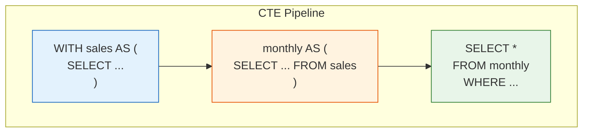
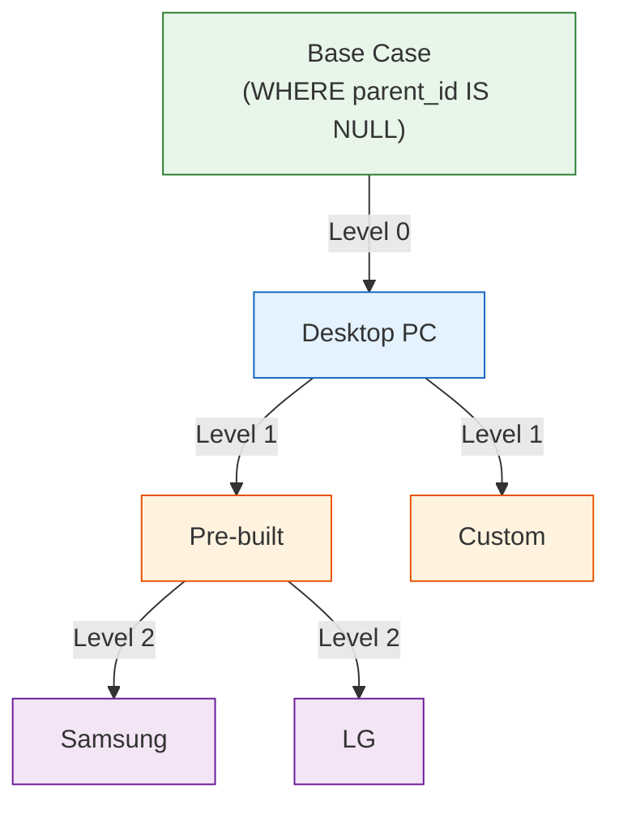

# Lesson 16: Common Table Expressions (WITH)

A Common Table Expression (CTE) is a named, temporary result set defined with the `WITH` keyword before the main query. CTEs make complex queries dramatically easier to read, debug, and reuse — each CTE is like a named subquery you can reference multiple times.





> CTEs break queries into steps connected like a pipeline. Recursive CTEs traverse tree structures.

## Basic CTE

```sql
WITH monthly_revenue AS (
    SELECT
        SUBSTR(ordered_at, 1, 7) AS year_month,
        SUM(total_amount)        AS revenue,
        COUNT(*)                 AS order_count
    FROM orders
    WHERE status NOT IN ('cancelled', 'returned')
    GROUP BY SUBSTR(ordered_at, 1, 7)
)
SELECT
    year_month,
    revenue,
    order_count,
    ROUND(revenue / order_count, 2) AS avg_order_value
FROM monthly_revenue
WHERE year_month LIKE '2024%'
ORDER BY year_month;
```

**Result:**

| year_month | revenue | order_count | avg_order_value |
|------------|---------|-------------|-----------------|
| 2024-01 | 147832.40 | 270 | 547.53 |
| 2024-02 | 136290.10 | 251 | 542.99 |
| 2024-03 | 204123.70 | 347 | 588.25 |
| ... | | | |

The CTE `monthly_revenue` reads like a named step — first we compute monthly totals, then we query them. No nested subquery nesting needed.

## Multiple CTEs

Chain CTEs with commas. Each CTE can reference any CTE defined before it.

```sql
-- Customer lifetime value segmentation
WITH customer_orders AS (
    SELECT
        customer_id,
        COUNT(*)          AS order_count,
        SUM(total_amount) AS lifetime_value
    FROM orders
    WHERE status NOT IN ('cancelled', 'returned')
    GROUP BY customer_id
),
customer_segments AS (
    SELECT
        co.customer_id,
        c.name,
        c.grade,
        co.order_count,
        co.lifetime_value,
        CASE
            WHEN co.lifetime_value >= 5000 THEN 'Champion'
            WHEN co.lifetime_value >= 2000 THEN 'Loyal'
            WHEN co.lifetime_value >= 500  THEN 'Regular'
            ELSE 'Occasional'
        END AS segment
    FROM customer_orders AS co
    INNER JOIN customers AS c ON co.customer_id = c.id
)
SELECT
    segment,
    COUNT(*)                    AS customer_count,
    ROUND(AVG(lifetime_value), 2) AS avg_ltv,
    ROUND(AVG(order_count), 1)    AS avg_orders
FROM customer_segments
GROUP BY segment
ORDER BY avg_ltv DESC;
```

**Result:**

| segment | customer_count | avg_ltv | avg_orders |
|---------|----------------|---------|------------|
| Champion | 312 | 8942.30 | 38.2 |
| Loyal | 891 | 3124.60 | 18.7 |
| Regular | 2341 | 842.30 | 6.4 |
| Occasional | 1242 | 198.70 | 2.1 |

## CTEs with Window Functions

CTEs and window functions complement each other well. Compute ranked results in a CTE, then filter in the main query.

```sql
-- Top 3 customers by revenue per membership grade
WITH customer_revenue AS (
    SELECT
        c.id,
        c.name,
        c.grade,
        SUM(o.total_amount) AS total_spent
    FROM customers AS c
    INNER JOIN orders AS o ON c.id = o.customer_id
    WHERE o.status NOT IN ('cancelled', 'returned')
    GROUP BY c.id, c.name, c.grade
),
ranked AS (
    SELECT
        *,
        RANK() OVER (PARTITION BY grade ORDER BY total_spent DESC) AS rnk
    FROM customer_revenue
)
SELECT grade, name, total_spent, rnk
FROM ranked
WHERE rnk <= 3
ORDER BY grade, rnk;
```

**Result:**

| grade | name | total_spent | rnk |
|-------|------|-------------|-----|
| BRONZE | Marcus Williams | 3241.50 | 1 |
| BRONZE | Tina Foster | 3089.90 | 2 |
| BRONZE | Derek Chang | 2944.20 | 3 |
| GOLD | Jennifer Martinez | 12891.00 | 1 |
| ... | | | |

## Recursive CTE — Category Tree

A recursive CTE references itself. It is the standard SQL way to walk hierarchical data like a category tree, org chart, or bill of materials.

The `categories` table has a `parent_id` column that points to itself.

```sql
-- Walk the full category tree and show depth/path
WITH RECURSIVE category_tree AS (
    -- Base case: root categories (no parent)
    SELECT
        id,
        name,
        parent_id,
        0             AS depth,
        name          AS path
    FROM categories
    WHERE parent_id IS NULL

    UNION ALL

    -- Recursive case: children of already-found nodes
    SELECT
        c.id,
        c.name,
        c.parent_id,
        ct.depth + 1,
        ct.path || ' > ' || c.name
    FROM categories AS c
    INNER JOIN category_tree AS ct ON c.parent_id = ct.id
)
SELECT
    SUBSTR('          ', 1, depth * 2) || name AS indented_name,
    depth,
    path
FROM category_tree
ORDER BY path;
```

**Result:**

| indented_name | depth | path |
|---------------|-------|------|
| Electronics | 0 | Electronics |
|   Computers | 1 | Electronics > Computers |
|     Laptops | 2 | Electronics > Computers > Laptops |
|     Desktops | 2 | Electronics > Computers > Desktops |
|   Peripherals | 1 | Electronics > Peripherals |
|     Mice | 2 | Electronics > Peripherals > Mice |
|     Keyboards | 2 | Electronics > Peripherals > Keyboards |
| ... | | |

## More Recursive CTE Examples

### Staff Org Chart (Recursive CTE)

Recursively follow `staff.manager_id` to build the full organizational hierarchy.

```sql
WITH RECURSIVE org_chart AS (
    -- Base: CEO (no manager)
    SELECT id, name, role, department, manager_id, 0 AS level,
           name AS path
    FROM staff
    WHERE manager_id IS NULL

    UNION ALL

    -- Recursive: employees under each manager
    SELECT s.id, s.name, s.role, s.department, s.manager_id,
           oc.level + 1,
           oc.path || ' > ' || s.name
    FROM staff s
    JOIN org_chart oc ON s.manager_id = oc.id
)
SELECT level, path, role, department
FROM org_chart
ORDER BY path;
```

### Q&A Threads (Recursive CTE)

Recursively trace the question → answer → follow-up chain.

```sql
WITH RECURSIVE thread AS (
    SELECT id, content, parent_id, 0 AS depth,
           CAST(id AS TEXT) AS thread_path
    FROM product_qna
    WHERE parent_id IS NULL

    UNION ALL

    SELECT q.id, q.content, q.parent_id, t.depth + 1,
           t.thread_path || '.' || CAST(q.id AS TEXT)
    FROM product_qna q
    JOIN thread t ON q.parent_id = t.id
)
SELECT depth, thread_path, SUBSTR('          ', 1, depth * 2) || content AS indented
FROM thread
ORDER BY thread_path
LIMIT 20;
```

!!! note "Lesson Review"
    Quick exercises to check your understanding of this lesson. For comprehensive practice combining multiple concepts, see the [Exercises](../exercises/) section.

## Practice Exercises

### Exercise 1
Using two CTEs, find the monthly revenue for 2024, then compute the month-over-month change in revenue. CTE 1: monthly totals. CTE 2: add `LAG` for previous month. Main query: return all columns plus the computed `mom_change` and `mom_pct`.

??? success "Answer"
    ```sql
    WITH monthly AS (
        SELECT
            SUBSTR(ordered_at, 1, 7) AS year_month,
            SUM(total_amount)        AS revenue
        FROM orders
        WHERE ordered_at LIKE '2024%'
          AND status NOT IN ('cancelled', 'returned')
        GROUP BY SUBSTR(ordered_at, 1, 7)
    ),
    with_lag AS (
        SELECT
            year_month,
            revenue,
            LAG(revenue) OVER (ORDER BY year_month) AS prev_revenue
        FROM monthly
    )
    SELECT
        year_month,
        revenue,
        prev_revenue,
        ROUND(revenue - prev_revenue, 2) AS mom_change,
        ROUND(100.0 * (revenue - prev_revenue) / prev_revenue, 1) AS mom_pct
    FROM with_lag
    ORDER BY year_month;
    ```

### Exercise 2
Use a CTE to identify "at-risk" customers: those who have placed at least 3 orders but whose most recent order was more than 180 days ago. Return `customer_id`, `name`, `grade`, `order_count`, and `last_order_date`.

??? success "Answer"
    ```sql
    WITH customer_recency AS (
        SELECT
            customer_id,
            COUNT(*)        AS order_count,
            MAX(ordered_at) AS last_order_date
        FROM orders
        WHERE status NOT IN ('cancelled', 'returned')
        GROUP BY customer_id
    )
    SELECT
        c.id    AS customer_id,
        c.name,
        c.grade,
        cr.order_count,
        cr.last_order_date
    FROM customer_recency AS cr
    INNER JOIN customers AS c ON cr.customer_id = c.id
    WHERE cr.order_count >= 3
      AND julianday('now') - julianday(cr.last_order_date) > 180
    ORDER BY cr.last_order_date ASC;
    ```

### Exercise 3
Use a recursive CTE to build the full breadcrumb path for every leaf category (categories with no children). Return `category_id`, `category_name`, and `full_path`.

??? success "Answer"
    ```sql
    WITH RECURSIVE category_tree AS (
        SELECT
            id,
            name,
            parent_id,
            name AS full_path
        FROM categories
        WHERE parent_id IS NULL

        UNION ALL

        SELECT
            c.id,
            c.name,
            c.parent_id,
            ct.full_path || ' > ' || c.name
        FROM categories AS c
        INNER JOIN category_tree AS ct ON c.parent_id = ct.id
    )
    SELECT
        ct.id   AS category_id,
        ct.name AS category_name,
        ct.full_path
    FROM category_tree AS ct
    WHERE ct.id NOT IN (SELECT parent_id FROM categories WHERE parent_id IS NOT NULL)
    ORDER BY ct.full_path;
    ```

---
Next: [Lesson 17: EXISTS and Correlated Subqueries](17-exists.md)
