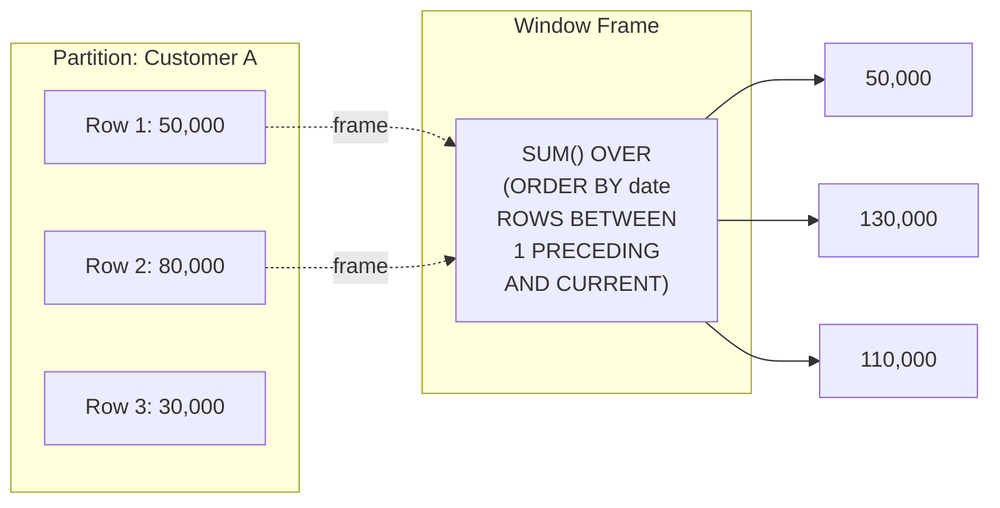
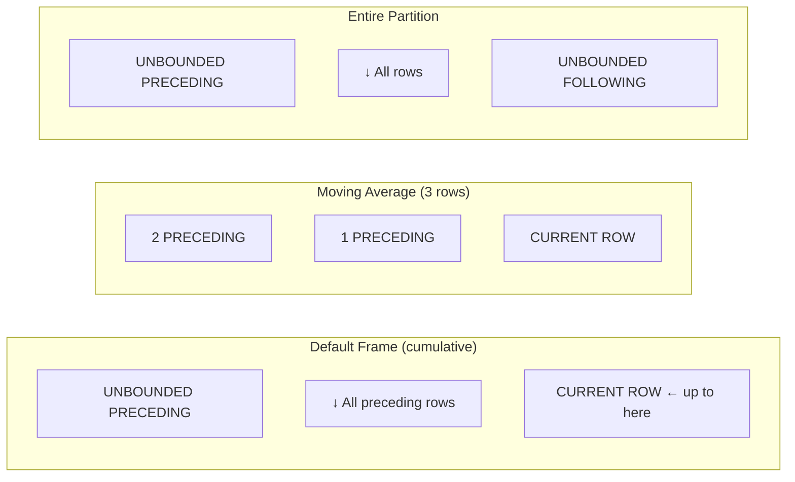

# Lesson 18: Window Functions

Window functions perform calculations over a set of rows related to the current row without collapsing results like `GROUP BY`. Each row retains its unique identity while gaining access to aggregate or ranking information.

Syntax: `function() OVER (PARTITION BY ... ORDER BY ...)`



> Window functions do not group rows; they compute from neighboring rows for each row. The number of result rows does not decrease.

{ .off-glb width="520"  }

### Window Frame Types

The `ROWS BETWEEN` clause specifies the range of the window. The computation result varies depending on the frame.



| Frame | Use Case | Example |
|--------|------|------|
| `ROWS BETWEEN UNBOUNDED PRECEDING AND CURRENT ROW` | Running total (default) | Daily cumulative revenue |
| `ROWS BETWEEN 2 PRECEDING AND CURRENT ROW` | Moving average | 3-month moving average |
| `ROWS BETWEEN UNBOUNDED PRECEDING AND UNBOUNDED FOLLOWING` | Entire partition | Required for LAST_VALUE |


!!! note "Already familiar?"
    If you are comfortable with window functions (ROW_NUMBER, RANK, LAG, SUM OVER), skip ahead to [Lesson 19: CTE](19-cte.md).

## ROW_NUMBER, RANK, DENSE_RANK

Ranking functions assign a rank to each row within a partition.

| Function | Tie Handling | Rank Gaps |
|----------|------|-----------------|
| `ROW_NUMBER()` | Assigns arbitrary rank | — |
| `RANK()` | Same rank for ties | Yes (1,1,3) |
| `DENSE_RANK()` | Same rank for ties | No (1,1,2) |

```sql
-- Rank products by price within each category
SELECT
    cat.name            AS category,
    p.name              AS product_name,
    p.price,
    RANK() OVER (
        PARTITION BY p.category_id
        ORDER BY p.price DESC
    ) AS price_rank
FROM products AS p
INNER JOIN categories AS cat ON p.category_id = cat.id
WHERE p.is_active = 1
ORDER BY cat.name, price_rank
LIMIT 12;
```

**Result (example):**

| category | product_name | price | price_rank |
| ---------- | ---------- | ----------: | ----------: |
| 2in1 | 레노버 IdeaPad Flex 5 화이트 | 2914000.0 | 1 |
| 2in1 | 레노버 ThinkPad X1 2in1 화이트 | 2579700.0 | 2 |
| 2in1 | HP Pavilion x360 14 블랙 | 2461600.0 | 3 |
| 2in1 | 삼성 갤럭시북4 360 | 2354000.0 | 4 |
| 2in1 | 레노버 ThinkPad X1 2in1 실버 | 2233200.0 | 5 |
| 2in1 | 레노버 IdeaPad Flex 5 화이트 | 2171700.0 | 6 |
| 2in1 | 레노버 Yoga 9i 실버 | 2161400.0 | 7 |
| 2in1 | 삼성 갤럭시북5 360 블랙 | 2111000.0 | 8 |
| ... | ... | ... | ... |

## Top-N per Group

Wrapping a ranked query in a CTE or subquery lets you extract the top N items per partition.

```sql
-- Top 3 products per category by sales volume (units sold)
WITH ranked_sales AS (
    SELECT
        cat.name                        AS category,
        p.name                          AS product_name,
        SUM(oi.quantity)                AS units_sold,
        RANK() OVER (
            PARTITION BY p.category_id
            ORDER BY SUM(oi.quantity) DESC
        ) AS sales_rank
    FROM order_items AS oi
    INNER JOIN products   AS p   ON oi.product_id = p.id
    INNER JOIN categories AS cat ON p.category_id = cat.id
    INNER JOIN orders     AS o   ON oi.order_id   = o.id
    WHERE o.status IN ('delivered', 'confirmed')
    GROUP BY p.category_id, p.id, p.name, cat.name
)
SELECT category, product_name, units_sold, sales_rank
FROM ranked_sales
WHERE sales_rank <= 3
ORDER BY category, sales_rank;
```

## SUM OVER — Running Totals

`SUM() OVER (ORDER BY ...)` computes a running total.

```sql
-- Monthly cumulative revenue for 2024
SELECT
    SUBSTR(ordered_at, 1, 7) AS year_month,
    SUM(total_amount)        AS monthly_revenue,
    SUM(SUM(total_amount)) OVER (
        ORDER BY SUBSTR(ordered_at, 1, 7)
    ) AS cumulative_revenue
FROM orders
WHERE ordered_at LIKE '2024%'
  AND status NOT IN ('cancelled', 'returned')
GROUP BY SUBSTR(ordered_at, 1, 7)
ORDER BY year_month;
```

**Result (example):**

| year_month | monthly_revenue | cumulative_revenue |
| ---------- | ----------: | ----------: |
| 2024-01 | 3807789761.0 | 3807789761.0 |
| 2024-02 | 4701108852.0 | 8508898613.0 |
| 2024-03 | 4935663129.0 | 13444561742.0 |
| 2024-04 | 4954492231.0 | 18399053973.0 |
| 2024-05 | 4912114419.0 | 23311168392.0 |
| 2024-06 | 3853868900.0 | 27165037292.0 |
| 2024-07 | 4453107092.0 | 31618144384.0 |
| 2024-08 | 4903583071.0 | 36521727455.0 |
| ... | ... | ... |

## LAG and LEAD — Referencing Adjacent Rows

`LAG(col, n)` references `n` rows before, and `LEAD(col, n)` references `n` rows after. You can also specify a default value when the referenced row does not exist.

```sql
-- Month-over-month revenue growth rate (MoM) for 2024
SELECT
    year_month,
    monthly_revenue,
    LAG(monthly_revenue) OVER (ORDER BY year_month) AS prev_month_revenue,
    ROUND(
        100.0 * (monthly_revenue - LAG(monthly_revenue) OVER (ORDER BY year_month))
              / LAG(monthly_revenue) OVER (ORDER BY year_month),
        1
    ) AS mom_growth_pct
FROM (
    SELECT
        SUBSTR(ordered_at, 1, 7) AS year_month,
        SUM(total_amount)        AS monthly_revenue
    FROM orders
    WHERE ordered_at LIKE '2024%'
      AND status NOT IN ('cancelled', 'returned')
    GROUP BY SUBSTR(ordered_at, 1, 7)
) AS monthly
ORDER BY year_month;
```

**Result (example):**

| year_month | monthly_revenue | prev_month_revenue | mom_growth_pct |
| ---------- | ----------: | ---------- | ---------- |
| 2024-01 | 3807789761.0 | (NULL) | (NULL) |
| 2024-02 | 4701108852.0 | 3807789761.0 | 23.5 |
| 2024-03 | 4935663129.0 | 4701108852.0 | 5.0 |
| 2024-04 | 4954492231.0 | 4935663129.0 | 0.4 |
| 2024-05 | 4912114419.0 | 4954492231.0 | -0.9 |
| 2024-06 | 3853868900.0 | 4912114419.0 | -21.5 |
| 2024-07 | 4453107092.0 | 3853868900.0 | 15.5 |
| 2024-08 | 4903583071.0 | 4453107092.0 | 10.1 |
| ... | ... | ... | ... |

## Using PARTITION BY with LEAD

=== "SQLite"
    ```sql
    -- VIP customers: order list with days until next order
    SELECT
        c.name          AS customer_name,
        o.order_number,
        o.ordered_at,
        LEAD(o.ordered_at) OVER (
            PARTITION BY o.customer_id
            ORDER BY o.ordered_at
        ) AS next_order_date,
        ROUND(
            julianday(
                LEAD(o.ordered_at) OVER (PARTITION BY o.customer_id ORDER BY o.ordered_at)
            ) - julianday(o.ordered_at),
            0
        ) AS days_to_next_order
    FROM orders AS o
    INNER JOIN customers AS c ON o.customer_id = c.id
    WHERE c.grade = 'VIP'
    ORDER BY c.name, o.ordered_at
    LIMIT 10;
    ```

=== "MySQL"
    ```sql
    -- VIP customers: order list with days until next order
    SELECT
        c.name          AS customer_name,
        o.order_number,
        o.ordered_at,
        LEAD(o.ordered_at) OVER (
            PARTITION BY o.customer_id
            ORDER BY o.ordered_at
        ) AS next_order_date,
        DATEDIFF(
            LEAD(o.ordered_at) OVER (PARTITION BY o.customer_id ORDER BY o.ordered_at),
            o.ordered_at
        ) AS days_to_next_order
    FROM orders AS o
    INNER JOIN customers AS c ON o.customer_id = c.id
    WHERE c.grade = 'VIP'
    ORDER BY c.name, o.ordered_at
    LIMIT 10;
    ```

=== "PostgreSQL"
    ```sql
    -- VIP customers: order list with days until next order
    SELECT
        c.name          AS customer_name,
        o.order_number,
        o.ordered_at,
        LEAD(o.ordered_at) OVER (
            PARTITION BY o.customer_id
            ORDER BY o.ordered_at
        ) AS next_order_date,
        LEAD(o.ordered_at) OVER (PARTITION BY o.customer_id ORDER BY o.ordered_at)::date
            - o.ordered_at::date
            AS days_to_next_order
    FROM orders AS o
    INNER JOIN customers AS c ON o.customer_id = c.id
    WHERE c.grade = 'VIP'
    ORDER BY c.name, o.ordered_at
    LIMIT 10;
    ```

## Additional Window Function Applications

### Point Balance Verification (SUM OVER)

Verify whether `balance_after` in `point_transactions` is correct using `SUM() OVER()`.

```sql
SELECT
    id,
    customer_id,
    type,
    reason,
    amount,
    balance_after,
    SUM(amount) OVER (
        PARTITION BY customer_id
        ORDER BY created_at, id
    ) AS calculated_balance,
    balance_after - SUM(amount) OVER (
        PARTITION BY customer_id
        ORDER BY created_at, id
    ) AS difference
FROM point_transactions
WHERE customer_id = 42
ORDER BY created_at, id;
```

### Grade Change Tracking (LAG)

Track changes between previous and current grades in `customer_grade_history`.

```sql
SELECT
    customer_id,
    changed_at,
    old_grade,
    new_grade,
    reason,
    LAG(new_grade) OVER (
        PARTITION BY customer_id ORDER BY changed_at
    ) AS previous_record_grade,
    LEAD(changed_at) OVER (
        PARTITION BY customer_id ORDER BY changed_at
    ) AS next_change_date
FROM customer_grade_history
WHERE customer_id = 42
ORDER BY changed_at;
```

## FIRST_VALUE and LAST_VALUE — First/Last Value in a Partition

`FIRST_VALUE(col)` retrieves the value from the first row of the window frame, and `LAST_VALUE(col)` retrieves the value from the last row.

| Function | Description |
|------|------|
| `FIRST_VALUE(col) OVER (PARTITION BY ... ORDER BY ...)` | First row value in the frame |
| `LAST_VALUE(col) OVER (... ROWS BETWEEN UNBOUNDED PRECEDING AND UNBOUNDED FOLLOWING)` | Last row value in the frame |

!!! warning "The LAST_VALUE Frame Trap"
    The default window frame is `ROWS BETWEEN UNBOUNDED PRECEDING AND CURRENT ROW`. With this default frame, `LAST_VALUE` always returns the value of the **current row**, so to get the actual last value of the partition, you must explicitly specify `ROWS BETWEEN UNBOUNDED PRECEDING AND UNBOUNDED FOLLOWING`.

```sql
-- Show the cheapest product (FIRST_VALUE) and
-- most expensive product (LAST_VALUE) per category
SELECT
    cat.name  AS category,
    p.name    AS product_name,
    p.price,
    FIRST_VALUE(p.name) OVER (
        PARTITION BY p.category_id
        ORDER BY p.price
    ) AS cheapest_product,
    LAST_VALUE(p.name) OVER (
        PARTITION BY p.category_id
        ORDER BY p.price
        ROWS BETWEEN UNBOUNDED PRECEDING AND UNBOUNDED FOLLOWING
    ) AS most_expensive_product
FROM products AS p
INNER JOIN categories AS cat ON p.category_id = cat.id
WHERE p.is_active = 1
ORDER BY cat.name, p.price
LIMIT 12;
```

`FIRST_VALUE` always returns the first row of the partition (the cheapest product) even with the default frame under `ORDER BY p.price`. In contrast, `LAST_VALUE` returns the value of the current row itself if `ROWS BETWEEN UNBOUNDED PRECEDING AND UNBOUNDED FOLLOWING` is not specified, so be careful.

**Common real-world scenarios for window functions:**

- **Revenue ranking:** Top-N by category/region (ROW_NUMBER, RANK)
- **Trend analysis:** Month-over-month growth, year-over-year comparison (LAG, LEAD)
- **Cumulative metrics:** Daily cumulative revenue, cumulative user count (SUM OVER)
- **Segment analysis:** Customer revenue quartiles, score percentiles (NTILE)
- **Moving averages:** 7-day/30-day moving averages for trend detection (ROWS BETWEEN)

## Summary

| Function / Syntax | Use Case |
|-------------|------|
| `ROW_NUMBER()` | Unique sequence number within partition |
| `RANK()` / `DENSE_RANK()` | Ranking with ties (with/without gaps) |
| `SUM() OVER (ORDER BY ...)` | Running total |
| `LAG(col, n)` / `LEAD(col, n)` | Reference previous/next row |
| `NTILE(n)` | Divide into n equal groups |
| `FIRST_VALUE(col)` | First row value in frame |
| `LAST_VALUE(col)` | Last row value in frame (frame specification required) |
| `ROWS BETWEEN ... AND ...` | Window frame range specification |

!!! note "Lesson Review Problems"
    These are simple problems to immediately test the concepts learned in this lesson. For comprehensive practice combining multiple concepts, see the [Practice Problems](../exercises/index.md) section.

## Practice Problems

### Problem 1
Use `DENSE_RANK()` to rank all active products by `price` in descending order. Return `product_name`, `price`, `overall_rank` and show the top 10.

??? success "Answer"
    ```sql
    SELECT
        name    AS product_name,
        price,
        DENSE_RANK() OVER (ORDER BY price DESC) AS overall_rank
    FROM products
    WHERE is_active = 1
    ORDER BY overall_rank
    LIMIT 10;
    ```

        **Result (example):**

| product_name | price | overall_rank |
| ---------- | ----------: | ----------: |
| Razer Blade 14 블랙 | 7495200.0 | 1 |
| Razer Blade 16 블랙 | 5634900.0 | 2 |
| Razer Blade 16 | 5518300.0 | 3 |
| Razer Blade 18 | 5450500.0 | 4 |
| Razer Blade 14 | 5339100.0 | 5 |
| Razer Blade 16 실버 | 5127500.0 | 6 |
| Razer Blade 18 화이트 | 4913500.0 | 7 |
| MSI GeForce RTX 5070 Ti VENTUS 3X 실버 | 4881500.0 | 8 |
| ... | ... | ... |


### Problem 2
Calculate the cumulative total of new customer signups by year (cumulative customer count from shop opening to each year). Return `year`, `new_signups`, `cumulative_customers`.

??? success "Answer"
    ```sql
    SELECT
        year,
        new_signups,
        SUM(new_signups) OVER (ORDER BY year) AS cumulative_customers
    FROM (
        SELECT
            SUBSTR(created_at, 1, 4) AS year,
            COUNT(*)                 AS new_signups
        FROM customers
        GROUP BY SUBSTR(created_at, 1, 4)
    ) AS yearly
    ORDER BY year;
    ```

        **Result (example):**

| year | new_signups | cumulative_customers |
| ---------- | ----------: | ----------: |
| 2016 | 1000 | 1000 |
| 2017 | 1800 | 2800 |
| 2018 | 3000 | 5800 |
| 2019 | 4500 | 10300 |
| 2020 | 7000 | 17300 |
| 2021 | 8000 | 25300 |
| 2022 | 6500 | 31800 |
| 2023 | 6000 | 37800 |
| ... | ... | ... |


### Problem 3
For each month in 2023 and 2024, calculate the year-over-year (YoY) revenue growth rate. Use `LAG(revenue, 12)` to compare with the same month last year. Return `year_month`, `revenue`, `same_month_last_year`, `yoy_growth_pct`.

??? success "Answer"
    ```sql
    SELECT
        year_month,
        revenue,
        LAG(revenue, 12) OVER (ORDER BY year_month) AS same_month_last_year,
        ROUND(
            100.0 * (revenue - LAG(revenue, 12) OVER (ORDER BY year_month))
                  / LAG(revenue, 12) OVER (ORDER BY year_month),
            1
        ) AS yoy_growth_pct
    FROM (
        SELECT
            SUBSTR(ordered_at, 1, 7) AS year_month,
            SUM(total_amount)        AS revenue
        FROM orders
        WHERE status NOT IN ('cancelled', 'returned')
          AND ordered_at BETWEEN '2022-01-01' AND '2024-12-31 23:59:59'
        GROUP BY SUBSTR(ordered_at, 1, 7)
    ) AS monthly
    WHERE year_month >= '2023-01'
    ORDER BY year_month;
    ```

        **Result (example):**

| year_month | revenue | same_month_last_year | yoy_growth_pct |
| ---------- | ----------: | ---------- | ---------- |
| 2023-01 | 3271703186.0 | (NULL) | (NULL) |
| 2023-02 | 3915639006.0 | (NULL) | (NULL) |
| 2023-03 | 4939077954.0 | (NULL) | (NULL) |
| 2023-04 | 4797530375.0 | (NULL) | (NULL) |
| 2023-05 | 4115530865.0 | (NULL) | (NULL) |
| 2023-06 | 3520005441.0 | (NULL) | (NULL) |
| 2023-07 | 3257340549.0 | (NULL) | (NULL) |
| 2023-08 | 4354477595.0 | (NULL) | (NULL) |
| ... | ... | ... | ... |


### Problem 4
Use `ROW_NUMBER()` to number each customer's orders and extract only the first order. Return `customer_id`, `name`, `order_number`, `ordered_at`, `total_amount`.

??? success "Answer"
    ```sql
    SELECT
        customer_id,
        name,
        order_number,
        ordered_at,
        total_amount
    FROM (
        SELECT
            c.id        AS customer_id,
            c.name,
            o.order_number,
            o.ordered_at,
            o.total_amount,
            ROW_NUMBER() OVER (
                PARTITION BY o.customer_id
                ORDER BY o.ordered_at
            ) AS rn
        FROM orders AS o
        INNER JOIN customers AS c ON o.customer_id = c.id
        WHERE o.status NOT IN ('cancelled', 'returned')
    ) AS numbered
    WHERE rn = 1
    ORDER BY ordered_at
    LIMIT 15;
    ```

        **Result (example):**

| customer_id | name | order_number | ordered_at | total_amount |
| ----------: | ---------- | ---------- | ---------- | ----------: |
| 903 | 김상철 | ORD-20160102-00026 | 2016-01-02 13:54:14 | 56400.0 |
| 752 | 김정순 | ORD-20160103-00063 | 2016-01-03 12:47:28 | 487900.0 |
| 840 | 문영숙 | ORD-20160101-00013 | 2016-01-03 12:48:53 | 49900.0 |
| 690 | 장승현 | ORD-20160103-00059 | 2016-01-03 21:05:14 | 56400.0 |
| 978 | 김현준 | ORD-20160102-00035 | 2016-01-05 17:54:32 | 194700.0 |
| 226 | 박정수 | ORD-20160105-00088 | 2016-01-05 19:40:04 | 2230100.0 |
| 90 | 유현지 | ORD-20160101-00017 | 2016-01-06 03:02:29 | 54500.0 |
| 881 | 김도현 | ORD-20160107-00143 | 2016-01-07 07:31:04 | 91300.0 |
| ... | ... | ... | ... | ... |


### Problem 5
Use `RANK()` and `DENSE_RANK()` together to rank product prices within each category. Return `category_name`, `product_name`, `price`, `rank`, `dense_rank` and show the top 15. You can observe the difference between the two ranking functions in the results.

??? success "Answer"
    ```sql
    SELECT
        cat.name AS category_name,
        p.name   AS product_name,
        p.price,
        RANK()       OVER (PARTITION BY p.category_id ORDER BY p.price DESC) AS rank,
        DENSE_RANK() OVER (PARTITION BY p.category_id ORDER BY p.price DESC) AS dense_rank
    FROM products AS p
    INNER JOIN categories AS cat ON p.category_id = cat.id
    WHERE p.is_active = 1
    ORDER BY cat.name, rank
    LIMIT 15;
    ```

        **Result (example):**

| category_name | product_name | price | rank | dense_rank |
| ---------- | ---------- | ----------: | ----------: | ----------: |
| 2in1 | 레노버 IdeaPad Flex 5 화이트 | 2914000.0 | 1 | 1 |
| 2in1 | 레노버 ThinkPad X1 2in1 화이트 | 2579700.0 | 2 | 2 |
| 2in1 | HP Pavilion x360 14 블랙 | 2461600.0 | 3 | 3 |
| 2in1 | 삼성 갤럭시북4 360 | 2354000.0 | 4 | 4 |
| 2in1 | 레노버 ThinkPad X1 2in1 실버 | 2233200.0 | 5 | 5 |
| 2in1 | 레노버 IdeaPad Flex 5 화이트 | 2171700.0 | 6 | 6 |
| 2in1 | 레노버 Yoga 9i 실버 | 2161400.0 | 7 | 7 |
| 2in1 | 삼성 갤럭시북5 360 블랙 | 2111000.0 | 8 | 8 |
| ... | ... | ... | ... | ... |


### Problem 6
Calculate the 3-month moving average of monthly revenue for 2024. Use the `ROWS BETWEEN 2 PRECEDING AND CURRENT ROW` frame. Return `year_month`, `monthly_revenue`, `moving_avg_3m`.

??? success "Answer"
    ```sql
    SELECT
        year_month,
        monthly_revenue,
        ROUND(
            AVG(monthly_revenue) OVER (
                ORDER BY year_month
                ROWS BETWEEN 2 PRECEDING AND CURRENT ROW
            ), 2
        ) AS moving_avg_3m
    FROM (
        SELECT
            SUBSTR(ordered_at, 1, 7) AS year_month,
            SUM(total_amount)        AS monthly_revenue
        FROM orders
        WHERE ordered_at LIKE '2024%'
          AND status NOT IN ('cancelled', 'returned')
        GROUP BY SUBSTR(ordered_at, 1, 7)
    ) AS monthly
    ORDER BY year_month;
    ```

        **Result (example):**

| year_month | monthly_revenue | moving_avg_3m |
| ---------- | ----------: | ----------: |
| 2024-01 | 3807789761.0 | 3807789761.0 |
| 2024-02 | 4701108852.0 | 4254449306.5 |
| 2024-03 | 4935663129.0 | 4481520580.67 |
| 2024-04 | 4954492231.0 | 4863754737.33 |
| 2024-05 | 4912114419.0 | 4934089926.33 |
| 2024-06 | 3853868900.0 | 4573491850.0 |
| 2024-07 | 4453107092.0 | 4406363470.33 |
| 2024-08 | 4903583071.0 | 4403519687.67 |
| ... | ... | ... |


### Problem 7
Use `NTILE(4)` to divide customers into 4 quartiles based on total purchase amount. Return `name`, `grade`, `total_spent`, `quartile`, sorted by `quartile` and `total_spent` descending. Show the top 20.

??? success "Answer"
    ```sql
    SELECT
        name,
        grade,
        total_spent,
        quartile
    FROM (
        SELECT
            c.name,
            c.grade,
            SUM(o.total_amount) AS total_spent,
            NTILE(4) OVER (ORDER BY SUM(o.total_amount) DESC) AS quartile
        FROM customers AS c
        INNER JOIN orders AS o ON c.id = o.customer_id
        WHERE o.status NOT IN ('cancelled', 'returned')
        GROUP BY c.id, c.name, c.grade
    ) AS ranked
    ORDER BY quartile, total_spent DESC
    LIMIT 20;
    ```

        **Result (example):**

| name | grade | total_spent | quartile |
| ---------- | ---------- | ----------: | ----------: |
| 박정수 | VIP | 671056103.0 | 1 |
| 정유진 | VIP | 646834022.0 | 1 |
| 이미정 | VIP | 633645694.0 | 1 |
| 김상철 | VIP | 565735423.0 | 1 |
| 문영숙 | VIP | 523138846.0 | 1 |
| 이영자 | VIP | 520594776.0 | 1 |
| 이미정 | VIP | 497376276.0 | 1 |
| 장영숙 | VIP | 487964896.0 | 1 |
| ... | ... | ... | ... |


### Problem 8
Calculate cumulative units sold for each product by order date. Return `product_name`, `ordered_at`, `quantity`, `cumulative_qty`. Query for a specific product (id = 1).

??? success "Answer"
    ```sql
    SELECT
        p.name       AS product_name,
        o.ordered_at,
        oi.quantity,
        SUM(oi.quantity) OVER (
            ORDER BY o.ordered_at, o.id
            ROWS BETWEEN UNBOUNDED PRECEDING AND CURRENT ROW
        ) AS cumulative_qty
    FROM order_items AS oi
    INNER JOIN orders   AS o ON oi.order_id   = o.id
    INNER JOIN products AS p ON oi.product_id = p.id
    WHERE oi.product_id = 1
      AND o.status NOT IN ('cancelled', 'returned')
    ORDER BY o.ordered_at;
    ```

        **Result (example):**

| product_name | ordered_at | quantity | cumulative_qty |
| ---------- | ---------- | ----------: | ----------: |
| Razer Blade 18 블랙 | 2016-11-09 11:59:05 | 1 | 1 |
| Razer Blade 18 블랙 | 2016-11-16 21:26:24 | 1 | 2 |
| Razer Blade 18 블랙 | 2016-11-29 21:30:03 | 1 | 3 |
| Razer Blade 18 블랙 | 2016-12-02 13:40:50 | 1 | 4 |
| Razer Blade 18 블랙 | 2016-12-13 15:38:56 | 1 | 5 |
| Razer Blade 18 블랙 | 2016-12-14 20:37:12 | 1 | 6 |
| Razer Blade 18 블랙 | 2016-12-15 10:52:01 | 1 | 7 |
| Razer Blade 18 블랙 | 2016-12-16 20:05:41 | 1 | 8 |
| ... | ... | ... | ... |


### Problem 9
Show the running headcount by department (by hire date order) along with the department total. Return `department`, `name`, `role`, `hired_at`, `running_headcount`, `dept_total_headcount`. Use `COUNT(*) OVER` for `running_headcount` and `COUNT(*) OVER (PARTITION BY department)` for `dept_total_headcount`.

??? success "Answer"
    ```sql
    SELECT
        department,
        name,
        role,
        hired_at,
        COUNT(*) OVER (
            PARTITION BY department
            ORDER BY hired_at
            ROWS BETWEEN UNBOUNDED PRECEDING AND CURRENT ROW
        ) AS running_headcount,
        COUNT(*) OVER (
            PARTITION BY department
        ) AS dept_total_headcount
    FROM staff
    WHERE is_active = 1
    ORDER BY department, hired_at;
    ```

        **Result (example):**

| department | name | role | hired_at | running_headcount | dept_total_headcount |
| ---------- | ---------- | ---------- | ---------- | ----------: | ----------: |
| CS | 김옥자 | staff | 2017-06-11 | 1 | 3 |
| CS | 이현준 | staff | 2022-05-17 | 2 | 3 |
| CS | 이순자 | staff | 2023-03-12 | 3 | 3 |
| 개발 | 김영일 | manager | 2020-05-03 | 1 | 2 |
| 개발 | 김현주 | staff | 2024-09-04 | 2 | 2 |
| 경영 | 한민재 | admin | 2016-05-23 | 1 | 11 |
| 경영 | 심정식 | staff | 2017-04-20 | 2 | 11 |
| 경영 | 장주원 | admin | 2017-08-20 | 3 | 11 |
| ... | ... | ... | ... | ... | ... |


### Problem 10
Calculate the interval (in days) between each customer's orders and find the average order interval per customer. Use `LAG` to reference the previous order date. Return `customer_id`, `name`, `order_count`, `avg_days_between_orders`.

??? success "Answer"
    === "SQLite"
        ```sql
        SELECT
            customer_id,
            name,
            order_count,
            ROUND(AVG(days_gap), 1) AS avg_days_between_orders
        FROM (
            SELECT
                c.id   AS customer_id,
                c.name,
                COUNT(*) OVER (PARTITION BY o.customer_id) AS order_count,
                ROUND(
                    julianday(o.ordered_at)
                    - julianday(LAG(o.ordered_at) OVER (
                          PARTITION BY o.customer_id ORDER BY o.ordered_at
                      )),
                    0
                ) AS days_gap
            FROM orders AS o
            INNER JOIN customers AS c ON o.customer_id = c.id
            WHERE o.status NOT IN ('cancelled', 'returned')
        ) AS gaps
        WHERE days_gap IS NOT NULL
        GROUP BY customer_id, name, order_count
        HAVING order_count >= 5
        ORDER BY avg_days_between_orders
        LIMIT 15;
        ```

        **Result (example):**

| customer_id | name | order_count | avg_days_between_orders |
| ----------: | ---------- | ----------: | ----------: |
| 47099 | 강현준 | 5 | 5.3 |
| 49904 | 류은주 | 5 | 5.3 |
| 226 | 박정수 | 661 | 5.5 |
| 48065 | 조경수 | 6 | 5.8 |
| 356 | 정유진 | 544 | 6.5 |
| 1000 | 이미정 | 530 | 6.6 |
| 840 | 문영숙 | 546 | 6.7 |
| 51259 | 박정희 | 9 | 6.8 |
| ... | ... | ... | ... |


    === "MySQL"
        ```sql
        SELECT
            customer_id,
            name,
            order_count,
            ROUND(AVG(days_gap), 1) AS avg_days_between_orders
        FROM (
            SELECT
                c.id   AS customer_id,
                c.name,
                COUNT(*) OVER (PARTITION BY o.customer_id) AS order_count,
                DATEDIFF(
                    o.ordered_at,
                    LAG(o.ordered_at) OVER (
                        PARTITION BY o.customer_id ORDER BY o.ordered_at
                    )
                ) AS days_gap
            FROM orders AS o
            INNER JOIN customers AS c ON o.customer_id = c.id
            WHERE o.status NOT IN ('cancelled', 'returned')
        ) AS gaps
        WHERE days_gap IS NOT NULL
        GROUP BY customer_id, name, order_count
        HAVING order_count >= 5
        ORDER BY avg_days_between_orders
        LIMIT 15;
        ```

    === "PostgreSQL"
        ```sql
        SELECT
            customer_id,
            name,
            order_count,
            ROUND(AVG(days_gap), 1) AS avg_days_between_orders
        FROM (
            SELECT
                c.id   AS customer_id,
                c.name,
                COUNT(*) OVER (PARTITION BY o.customer_id) AS order_count,
                o.ordered_at::date
                    - (LAG(o.ordered_at) OVER (
                           PARTITION BY o.customer_id ORDER BY o.ordered_at
                       ))::date
                    AS days_gap
            FROM orders AS o
            INNER JOIN customers AS c ON o.customer_id = c.id
            WHERE o.status NOT IN ('cancelled', 'returned')
        ) AS gaps
        WHERE days_gap IS NOT NULL
        GROUP BY customer_id, name, order_count
        HAVING order_count >= 5
        ORDER BY avg_days_between_orders
        LIMIT 15;
        ```

### Problem 11
For each category, display each product's name, price, the cheapest product name in that category (`cheapest_in_category`), and the most expensive product name (`priciest_in_category`). Use `FIRST_VALUE` and `LAST_VALUE`, targeting active products only. Return `category`, `product_name`, `price`, `cheapest_in_category`, `priciest_in_category` and show the top 15.

??? success "Answer"
    ```sql
    SELECT
        cat.name  AS category,
        p.name    AS product_name,
        p.price,
        FIRST_VALUE(p.name) OVER (
            PARTITION BY p.category_id
            ORDER BY p.price
            ROWS BETWEEN UNBOUNDED PRECEDING AND UNBOUNDED FOLLOWING
        ) AS cheapest_in_category,
        LAST_VALUE(p.name) OVER (
            PARTITION BY p.category_id
            ORDER BY p.price
            ROWS BETWEEN UNBOUNDED PRECEDING AND UNBOUNDED FOLLOWING
        ) AS priciest_in_category
    FROM products AS p
    INNER JOIN categories AS cat ON p.category_id = cat.id
    WHERE p.is_active = 1
    ORDER BY cat.name, p.price
    LIMIT 15;
    ```

        **Result (example):**

| category | product_name | price | cheapest_in_category | priciest_in_category |
| ---------- | ---------- | ----------: | ---------- | ---------- |
| 2in1 | HP Pavilion x360 14 | 720800.0 | HP Pavilion x360 14 | 레노버 IdeaPad Flex 5 화이트 |
| 2in1 | HP Spectre x360 14 블랙 | 721300.0 | HP Pavilion x360 14 | 레노버 IdeaPad Flex 5 화이트 |
| 2in1 | HP Spectre x360 14 블랙 | 846500.0 | HP Pavilion x360 14 | 레노버 IdeaPad Flex 5 화이트 |
| 2in1 | HP Envy x360 15 실버 | 883400.0 | HP Pavilion x360 14 | 레노버 IdeaPad Flex 5 화이트 |
| 2in1 | HP Envy x360 15 | 905200.0 | HP Pavilion x360 14 | 레노버 IdeaPad Flex 5 화이트 |
| 2in1 | HP Pavilion x360 14 블랙 | 911700.0 | HP Pavilion x360 14 | 레노버 IdeaPad Flex 5 화이트 |
| 2in1 | 레노버 IdeaPad Flex 5 | 937600.0 | HP Pavilion x360 14 | 레노버 IdeaPad Flex 5 화이트 |
| 2in1 | HP Pavilion x360 14 실버 | 991200.0 | HP Pavilion x360 14 | 레노버 IdeaPad Flex 5 화이트 |
| ... | ... | ... | ... | ... |


### Scoring Guide

| Score | Next Step |
|:----:|----------|
| **10-11** | Move to [Lesson 19: CTE](19-cte.md) |
| **8-9** | Review the explanations for incorrect answers, then proceed |
| **Half or less** | Re-read this lesson |
| **3 or fewer** | Start again from [Lesson 17: Transactions](../intermediate/17-transactions.md) |

**Problem Areas:**

| Area | Problems |
|------|:--------:|
| DENSE_RANK / RANK | 1, 5 |
| Running total (SUM OVER) | 2, 8 |
| YoY growth rate (LAG) | 3, 10 |
| ROW_NUMBER + PARTITION | 4 |
| Moving average (ROWS BETWEEN) | 6 |
| NTILE (quartile) | 7 |
| Cumulative aggregate + department | 9 |
| FIRST_VALUE / LAST_VALUE | 11 |

---
Next: [Lesson 19: Common Table Expressions (WITH)](19-cte.md)
