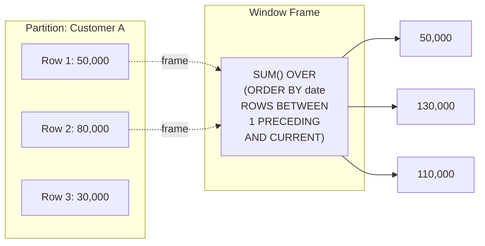
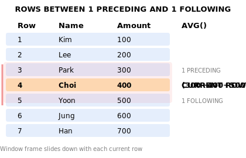

# Lesson 18: Window Functions

Window functions perform calculations across a set of rows that are related to the current row — without collapsing the result set like `GROUP BY` does. Each row keeps its identity while gaining access to aggregate or ranking information.

The syntax is: `function() OVER (PARTITION BY ... ORDER BY ...)`



> Window functions compute across related rows without grouping. The number of result rows stays the same.

{ .off-glb width="520"  }

## ROW_NUMBER, RANK, DENSE_RANK

These ranking functions assign a position to each row within a partition.

| Function | Ties | Gaps after ties |
|----------|------|-----------------|
| `ROW_NUMBER()` | Arbitrary tie-breaking | — |
| `RANK()` | Same rank | Yes (1,1,3) |
| `DENSE_RANK()` | Same rank | No (1,1,2) |

```sql
-- Rank products by price within each category
SELECT
    cat.name            AS category,
    p.name              AS product_name,
    p.price,
    RANK() OVER (
        PARTITION BY p.category_id
        ORDER BY p.price DESC
    ) AS price_rank
FROM products AS p
INNER JOIN categories AS cat ON p.category_id = cat.id
WHERE p.is_active = 1
ORDER BY cat.name, price_rank
LIMIT 12;
```

**Result:**

| category | product_name | price | price_rank |
|----------|--------------|------:|-----------:|
| Desktops | ASUS ROG Gaming Desktop | 1899.00 | 1 |
| Desktops | CyberPowerPC Gamer Xtreme | 1299.00 | 2 |
| Desktops | Acer Aspire TC | 549.00 | 3 |
| Laptops | Dell XPS 17 Laptop | 1999.00 | 1 |
| Laptops | MacBook Pro 16" M3 | 1799.00 | 2 |
| Laptops | Dell XPS 15 Laptop | 1299.99 | 3 |
| ... | | | |

## Top-N per Group

Wrap a ranked query in a CTE or subquery to pick the top N per partition.

```sql
-- Top 3 best-selling products per category (by units sold)
WITH ranked_sales AS (
    SELECT
        cat.name                        AS category,
        p.name                          AS product_name,
        SUM(oi.quantity)                AS units_sold,
        RANK() OVER (
            PARTITION BY p.category_id
            ORDER BY SUM(oi.quantity) DESC
        ) AS sales_rank
    FROM order_items AS oi
    INNER JOIN products   AS p   ON oi.product_id = p.id
    INNER JOIN categories AS cat ON p.category_id = cat.id
    INNER JOIN orders     AS o   ON oi.order_id   = o.id
    WHERE o.status IN ('delivered', 'confirmed')
    GROUP BY p.category_id, p.id, p.name, cat.name
)
SELECT category, product_name, units_sold, sales_rank
FROM ranked_sales
WHERE sales_rank <= 3
ORDER BY category, sales_rank;
```

## SUM OVER — Running Totals

`SUM() OVER (ORDER BY ...)` computes a cumulative total.

```sql
-- Cumulative revenue by month for 2024
SELECT
    SUBSTR(ordered_at, 1, 7) AS year_month,
    SUM(total_amount)        AS monthly_revenue,
    SUM(SUM(total_amount)) OVER (
        ORDER BY SUBSTR(ordered_at, 1, 7)
    ) AS cumulative_revenue
FROM orders
WHERE ordered_at LIKE '2024%'
  AND status NOT IN ('cancelled', 'returned')
GROUP BY SUBSTR(ordered_at, 1, 7)
ORDER BY year_month;
```

**Result:**

| year_month | monthly_revenue | cumulative_revenue |
|------------|----------------:|------------------:|
| 2024-01 | 147832.40 | 147832.40 |
| 2024-02 | 136290.10 | 284122.50 |
| 2024-03 | 204123.70 | 488246.20 |
| 2024-04 | 178912.30 | 667158.50 |
| ... | | |

## LAG and LEAD — Accessing Adjacent Rows

`LAG(col, n)` looks back `n` rows; `LEAD(col, n)` looks forward. Both accept a default value when the reference row doesn't exist.

```sql
-- Month-over-month revenue growth for 2024
SELECT
    year_month,
    monthly_revenue,
    LAG(monthly_revenue) OVER (ORDER BY year_month) AS prev_month_revenue,
    ROUND(
        100.0 * (monthly_revenue - LAG(monthly_revenue) OVER (ORDER BY year_month))
              / LAG(monthly_revenue) OVER (ORDER BY year_month),
        1
    ) AS mom_growth_pct
FROM (
    SELECT
        SUBSTR(ordered_at, 1, 7) AS year_month,
        SUM(total_amount)        AS monthly_revenue
    FROM orders
    WHERE ordered_at LIKE '2024%'
      AND status NOT IN ('cancelled', 'returned')
    GROUP BY SUBSTR(ordered_at, 1, 7)
) AS monthly
ORDER BY year_month;
```

**Result:**

| year_month | monthly_revenue | prev_month_revenue | mom_growth_pct |
|------------|----------------:|-------------------|----------------|
| 2024-01 | 147832.40 | (NULL) | (NULL) |
| 2024-02 | 136290.10 | 147832.40 | -7.8 |
| 2024-03 | 204123.70 | 136290.10 | 49.8 |
| 2024-04 | 178912.30 | 204123.70 | -12.4 |
| ... | | | |

## PARTITION BY with LEAD

=== "SQLite"
    ```sql
    -- For each customer, show their orders with the days until their next order
    SELECT
        c.name          AS customer_name,
        o.order_number,
        o.ordered_at,
        LEAD(o.ordered_at) OVER (
            PARTITION BY o.customer_id
            ORDER BY o.ordered_at
        ) AS next_order_date,
        ROUND(
            julianday(
                LEAD(o.ordered_at) OVER (PARTITION BY o.customer_id ORDER BY o.ordered_at)
            ) - julianday(o.ordered_at),
            0
        ) AS days_to_next_order
    FROM orders AS o
    INNER JOIN customers AS c ON o.customer_id = c.id
    WHERE c.grade = 'VIP'
    ORDER BY c.name, o.ordered_at
    LIMIT 10;
    ```

=== "MySQL"
    ```sql
    -- For each customer, show their orders with the days until their next order
    SELECT
        c.name          AS customer_name,
        o.order_number,
        o.ordered_at,
        LEAD(o.ordered_at) OVER (
            PARTITION BY o.customer_id
            ORDER BY o.ordered_at
        ) AS next_order_date,
        DATEDIFF(
            LEAD(o.ordered_at) OVER (PARTITION BY o.customer_id ORDER BY o.ordered_at),
            o.ordered_at
        ) AS days_to_next_order
    FROM orders AS o
    INNER JOIN customers AS c ON o.customer_id = c.id
    WHERE c.grade = 'VIP'
    ORDER BY c.name, o.ordered_at
    LIMIT 10;
    ```

=== "PostgreSQL"
    ```sql
    -- For each customer, show their orders with the days until their next order
    SELECT
        c.name          AS customer_name,
        o.order_number,
        o.ordered_at,
        LEAD(o.ordered_at) OVER (
            PARTITION BY o.customer_id
            ORDER BY o.ordered_at
        ) AS next_order_date,
        LEAD(o.ordered_at) OVER (PARTITION BY o.customer_id ORDER BY o.ordered_at)::date
            - o.ordered_at::date
            AS days_to_next_order
    FROM orders AS o
    INNER JOIN customers AS c ON o.customer_id = c.id
    WHERE c.grade = 'VIP'
    ORDER BY c.name, o.ordered_at
    LIMIT 10;
    ```

## More Window Function Examples

### Point Balance Verification (SUM OVER)

Verify that `balance_after` in `point_transactions` is correct using `SUM() OVER()`.

```sql
SELECT
    id,
    customer_id,
    type,
    reason,
    amount,
    balance_after,
    SUM(amount) OVER (
        PARTITION BY customer_id
        ORDER BY created_at, id
    ) AS calculated_balance,
    balance_after - SUM(amount) OVER (
        PARTITION BY customer_id
        ORDER BY created_at, id
    ) AS difference
FROM point_transactions
WHERE customer_id = 42
ORDER BY created_at, id;
```

### Grade Change Tracking (LAG)

Track grade transitions in `customer_grade_history` using LAG and LEAD.

```sql
SELECT
    customer_id,
    changed_at,
    old_grade,
    new_grade,
    reason,
    LAG(new_grade) OVER (
        PARTITION BY customer_id ORDER BY changed_at
    ) AS previous_record_grade,
    LEAD(changed_at) OVER (
        PARTITION BY customer_id ORDER BY changed_at
    ) AS next_change_date
FROM customer_grade_history
WHERE customer_id = 42
ORDER BY changed_at;
```

!!! note "Lesson Review"
    Quick exercises to check your understanding of this lesson. For comprehensive practice combining multiple concepts, see the [Exercises](../exercises/index.md) section.

## Practice Exercises

### Exercise 1
Rank all active products by `price` descending using `DENSE_RANK()`. Return `product_name`, `price`, and `overall_rank`. Show the top 10.

??? success "Answer"
    ```sql
    SELECT
        name    AS product_name,
        price,
        DENSE_RANK() OVER (ORDER BY price DESC) AS overall_rank
    FROM products
    WHERE is_active = 1
    ORDER BY overall_rank
    LIMIT 10;
    ```

### Exercise 2
Calculate the running total of new customer signups by year (cumulative customer count from the beginning of TechShop through each year). Return `year`, `new_signups`, and `cumulative_customers`.

??? success "Answer"
    ```sql
    SELECT
        year,
        new_signups,
        SUM(new_signups) OVER (ORDER BY year) AS cumulative_customers
    FROM (
        SELECT
            SUBSTR(created_at, 1, 4) AS year,
            COUNT(*)                 AS new_signups
        FROM customers
        GROUP BY SUBSTR(created_at, 1, 4)
    ) AS yearly
    ORDER BY year;
    ```

### Exercise 3
For each month in 2023 and 2024, compute the year-over-year (YoY) revenue growth. Use `LAG(revenue, 12)` to compare the same month in the prior year. Return `year_month`, `revenue`, `same_month_last_year`, and `yoy_growth_pct`.

??? success "Answer"
    ```sql
    SELECT
        year_month,
        revenue,
        LAG(revenue, 12) OVER (ORDER BY year_month) AS same_month_last_year,
        ROUND(
            100.0 * (revenue - LAG(revenue, 12) OVER (ORDER BY year_month))
                  / LAG(revenue, 12) OVER (ORDER BY year_month),
            1
        ) AS yoy_growth_pct
    FROM (
        SELECT
            SUBSTR(ordered_at, 1, 7) AS year_month,
            SUM(total_amount)        AS revenue
        FROM orders
        WHERE status NOT IN ('cancelled', 'returned')
          AND ordered_at BETWEEN '2022-01-01' AND '2024-12-31 23:59:59'
        GROUP BY SUBSTR(ordered_at, 1, 7)
    ) AS monthly
    WHERE year_month >= '2023-01'
    ORDER BY year_month;
    ```

### Exercise 4
Use `ROW_NUMBER()` to number each customer's orders chronologically and extract only the first order per customer. Return `customer_id`, `name`, `order_number`, `ordered_at`, and `total_amount`.

??? success "Answer"
    ```sql
    SELECT
        customer_id,
        name,
        order_number,
        ordered_at,
        total_amount
    FROM (
        SELECT
            c.id        AS customer_id,
            c.name,
            o.order_number,
            o.ordered_at,
            o.total_amount,
            ROW_NUMBER() OVER (
                PARTITION BY o.customer_id
                ORDER BY o.ordered_at
            ) AS rn
        FROM orders AS o
        INNER JOIN customers AS c ON o.customer_id = c.id
        WHERE o.status NOT IN ('cancelled', 'returned')
    ) AS numbered
    WHERE rn = 1
    ORDER BY ordered_at
    LIMIT 15;
    ```

### Exercise 5
Use both `RANK()` and `DENSE_RANK()` to rank products by price within each category. Return `category_name`, `product_name`, `price`, `rank`, and `dense_rank`. Show the top 15 rows so you can observe the difference between the two ranking functions.

??? success "Answer"
    ```sql
    SELECT
        cat.name AS category_name,
        p.name   AS product_name,
        p.price,
        RANK()       OVER (PARTITION BY p.category_id ORDER BY p.price DESC) AS rank,
        DENSE_RANK() OVER (PARTITION BY p.category_id ORDER BY p.price DESC) AS dense_rank
    FROM products AS p
    INNER JOIN categories AS cat ON p.category_id = cat.id
    WHERE p.is_active = 1
    ORDER BY cat.name, rank
    LIMIT 15;
    ```

### Exercise 6
Calculate a 3-month moving average of monthly revenue for 2024 using `ROWS BETWEEN 2 PRECEDING AND CURRENT ROW`. Return `year_month`, `monthly_revenue`, and `moving_avg_3m`.

??? success "Answer"
    ```sql
    SELECT
        year_month,
        monthly_revenue,
        ROUND(
            AVG(monthly_revenue) OVER (
                ORDER BY year_month
                ROWS BETWEEN 2 PRECEDING AND CURRENT ROW
            ), 2
        ) AS moving_avg_3m
    FROM (
        SELECT
            SUBSTR(ordered_at, 1, 7) AS year_month,
            SUM(total_amount)        AS monthly_revenue
        FROM orders
        WHERE ordered_at LIKE '2024%'
          AND status NOT IN ('cancelled', 'returned')
        GROUP BY SUBSTR(ordered_at, 1, 7)
    ) AS monthly
    ORDER BY year_month;
    ```

### Exercise 7
Use `NTILE(4)` to divide customers into 4 quartiles based on their total spending. Return `name`, `grade`, `total_spent`, and `quartile`. Order by `quartile` then `total_spent` descending. Show the top 20.

??? success "Answer"
    ```sql
    SELECT
        name,
        grade,
        total_spent,
        quartile
    FROM (
        SELECT
            c.name,
            c.grade,
            SUM(o.total_amount) AS total_spent,
            NTILE(4) OVER (ORDER BY SUM(o.total_amount) DESC) AS quartile
        FROM customers AS c
        INNER JOIN orders AS o ON c.id = o.customer_id
        WHERE o.status NOT IN ('cancelled', 'returned')
        GROUP BY c.id, c.name, c.grade
    ) AS ranked
    ORDER BY quartile, total_spent DESC
    LIMIT 20;
    ```

### Exercise 8
For a specific product (id = 1), calculate the cumulative quantity sold over time. Return `product_name`, `ordered_at`, `quantity`, and `cumulative_qty`.

??? success "Answer"
    ```sql
    SELECT
        p.name       AS product_name,
        o.ordered_at,
        oi.quantity,
        SUM(oi.quantity) OVER (
            ORDER BY o.ordered_at, o.id
            ROWS BETWEEN UNBOUNDED PRECEDING AND CURRENT ROW
        ) AS cumulative_qty
    FROM order_items AS oi
    INNER JOIN orders   AS o ON oi.order_id   = o.id
    INNER JOIN products AS p ON oi.product_id = p.id
    WHERE oi.product_id = 1
      AND o.status NOT IN ('cancelled', 'returned')
    ORDER BY o.ordered_at;
    ```

### Exercise 9
Show a running headcount per department (by hire date order) alongside the department total. Return `department`, `name`, `role`, `hired_at`, `running_headcount`, and `dept_total_headcount`. Use `COUNT(*) OVER` with and without an `ORDER BY` frame.

??? success "Answer"
    ```sql
    SELECT
        department,
        name,
        role,
        hired_at,
        COUNT(*) OVER (
            PARTITION BY department
            ORDER BY hired_at
            ROWS BETWEEN UNBOUNDED PRECEDING AND CURRENT ROW
        ) AS running_headcount,
        COUNT(*) OVER (
            PARTITION BY department
        ) AS dept_total_headcount
    FROM staff
    WHERE is_active = 1
    ORDER BY department, hired_at;
    ```

### Exercise 10
Calculate the number of days between consecutive orders for each customer using `LAG`, then find each customer's average order gap. Return `customer_id`, `name`, `order_count`, and `avg_days_between_orders`. Only include customers with 5 or more orders.

??? success "Answer"
    === "SQLite"
        ```sql
        SELECT
            customer_id,
            name,
            order_count,
            ROUND(AVG(days_gap), 1) AS avg_days_between_orders
        FROM (
            SELECT
                c.id   AS customer_id,
                c.name,
                COUNT(*) OVER (PARTITION BY o.customer_id) AS order_count,
                ROUND(
                    julianday(o.ordered_at)
                    - julianday(LAG(o.ordered_at) OVER (
                          PARTITION BY o.customer_id ORDER BY o.ordered_at
                      )),
                    0
                ) AS days_gap
            FROM orders AS o
            INNER JOIN customers AS c ON o.customer_id = c.id
            WHERE o.status NOT IN ('cancelled', 'returned')
        ) AS gaps
        WHERE days_gap IS NOT NULL
        GROUP BY customer_id, name, order_count
        HAVING order_count >= 5
        ORDER BY avg_days_between_orders
        LIMIT 15;
        ```

    === "MySQL"
        ```sql
        SELECT
            customer_id,
            name,
            order_count,
            ROUND(AVG(days_gap), 1) AS avg_days_between_orders
        FROM (
            SELECT
                c.id   AS customer_id,
                c.name,
                COUNT(*) OVER (PARTITION BY o.customer_id) AS order_count,
                DATEDIFF(
                    o.ordered_at,
                    LAG(o.ordered_at) OVER (
                        PARTITION BY o.customer_id ORDER BY o.ordered_at
                    )
                ) AS days_gap
            FROM orders AS o
            INNER JOIN customers AS c ON o.customer_id = c.id
            WHERE o.status NOT IN ('cancelled', 'returned')
        ) AS gaps
        WHERE days_gap IS NOT NULL
        GROUP BY customer_id, name, order_count
        HAVING order_count >= 5
        ORDER BY avg_days_between_orders
        LIMIT 15;
        ```

    === "PostgreSQL"
        ```sql
        SELECT
            customer_id,
            name,
            order_count,
            ROUND(AVG(days_gap), 1) AS avg_days_between_orders
        FROM (
            SELECT
                c.id   AS customer_id,
                c.name,
                COUNT(*) OVER (PARTITION BY o.customer_id) AS order_count,
                o.ordered_at::date
                    - (LAG(o.ordered_at) OVER (
                           PARTITION BY o.customer_id ORDER BY o.ordered_at
                       ))::date
                    AS days_gap
            FROM orders AS o
            INNER JOIN customers AS c ON o.customer_id = c.id
            WHERE o.status NOT IN ('cancelled', 'returned')
        ) AS gaps
        WHERE days_gap IS NOT NULL
        GROUP BY customer_id, name, order_count
        HAVING order_count >= 5
        ORDER BY avg_days_between_orders
        LIMIT 15;
        ```

---
Next: [Lesson 19: Common Table Expressions (WITH)](19-cte.md)
