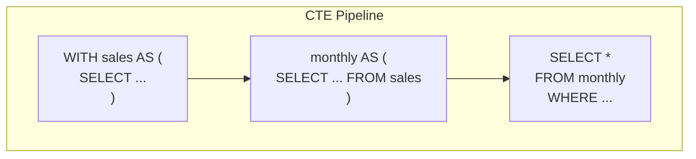
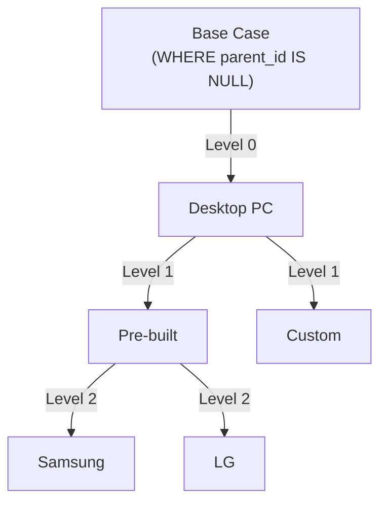

# Lesson 19: Common Table Expressions (WITH)

A Common Table Expression (CTE) is a named, temporary result set defined with the `WITH` keyword before the main query. CTEs make complex queries dramatically easier to read, debug, and reuse — each CTE is like a named subquery you can reference multiple times.





> CTEs break queries into steps connected like a pipeline. Recursive CTEs traverse tree structures.

## Basic CTE

=== "SQLite"
    ```sql
    WITH monthly_revenue AS (
        SELECT
            SUBSTR(ordered_at, 1, 7) AS year_month,
            SUM(total_amount)        AS revenue,
            COUNT(*)                 AS order_count
        FROM orders
        WHERE status NOT IN ('cancelled', 'returned')
        GROUP BY SUBSTR(ordered_at, 1, 7)
    )
    SELECT
        year_month,
        revenue,
        order_count,
        ROUND(revenue / order_count, 2) AS avg_order_value
    FROM monthly_revenue
    WHERE year_month LIKE '2024%'
    ORDER BY year_month;
    ```

=== "MySQL"
    ```sql
    WITH monthly_revenue AS (
        SELECT
            DATE_FORMAT(ordered_at, '%Y-%m') AS year_month,
            SUM(total_amount)                AS revenue,
            COUNT(*)                         AS order_count
        FROM orders
        WHERE status NOT IN ('cancelled', 'returned')
        GROUP BY DATE_FORMAT(ordered_at, '%Y-%m')
    )
    SELECT
        year_month,
        revenue,
        order_count,
        ROUND(revenue / order_count, 2) AS avg_order_value
    FROM monthly_revenue
    WHERE year_month LIKE '2024%'
    ORDER BY year_month;
    ```

=== "PostgreSQL"
    ```sql
    WITH monthly_revenue AS (
        SELECT
            TO_CHAR(ordered_at, 'YYYY-MM') AS year_month,
            SUM(total_amount)              AS revenue,
            COUNT(*)                       AS order_count
        FROM orders
        WHERE status NOT IN ('cancelled', 'returned')
        GROUP BY TO_CHAR(ordered_at, 'YYYY-MM')
    )
    SELECT
        year_month,
        revenue,
        order_count,
        ROUND(revenue / order_count, 2) AS avg_order_value
    FROM monthly_revenue
    WHERE year_month LIKE '2024%'
    ORDER BY year_month;
    ```

**Result:**

| year_month | revenue | order_count | avg_order_value |
|------------|--------:|------------:|----------------:|
| 2024-01 | 147832.40 | 270 | 547.53 |
| 2024-02 | 136290.10 | 251 | 542.99 |
| 2024-03 | 204123.70 | 347 | 588.25 |
| ... | | | |

The CTE `monthly_revenue` reads like a named step — first we compute monthly totals, then we query them. No nested subquery nesting needed.

## Multiple CTEs

Chain CTEs with commas. Each CTE can reference any CTE defined before it.

```sql
-- Customer lifetime value segmentation
WITH customer_orders AS (
    SELECT
        customer_id,
        COUNT(*)          AS order_count,
        SUM(total_amount) AS lifetime_value
    FROM orders
    WHERE status NOT IN ('cancelled', 'returned')
    GROUP BY customer_id
),
customer_segments AS (
    SELECT
        co.customer_id,
        c.name,
        c.grade,
        co.order_count,
        co.lifetime_value,
        CASE
            WHEN co.lifetime_value >= 5000 THEN 'Champion'
            WHEN co.lifetime_value >= 2000 THEN 'Loyal'
            WHEN co.lifetime_value >= 500  THEN 'Regular'
            ELSE 'Occasional'
        END AS segment
    FROM customer_orders AS co
    INNER JOIN customers AS c ON co.customer_id = c.id
)
SELECT
    segment,
    COUNT(*)                    AS customer_count,
    ROUND(AVG(lifetime_value), 2) AS avg_ltv,
    ROUND(AVG(order_count), 1)    AS avg_orders
FROM customer_segments
GROUP BY segment
ORDER BY avg_ltv DESC;
```

**Result:**

| segment | customer_count | avg_ltv | avg_orders |
|---------|---------------:|--------:|-----------:|
| Champion | 312 | 8942.30 | 38.2 |
| Loyal | 891 | 3124.60 | 18.7 |
| Regular | 2341 | 842.30 | 6.4 |
| Occasional | 1242 | 198.70 | 2.1 |

## CTEs with Window Functions

CTEs and window functions complement each other well. Compute ranked results in a CTE, then filter in the main query.

```sql
-- Top 3 customers by revenue per membership grade
WITH customer_revenue AS (
    SELECT
        c.id,
        c.name,
        c.grade,
        SUM(o.total_amount) AS total_spent
    FROM customers AS c
    INNER JOIN orders AS o ON c.id = o.customer_id
    WHERE o.status NOT IN ('cancelled', 'returned')
    GROUP BY c.id, c.name, c.grade
),
ranked AS (
    SELECT
        *,
        RANK() OVER (PARTITION BY grade ORDER BY total_spent DESC) AS rnk
    FROM customer_revenue
)
SELECT grade, name, total_spent, rnk
FROM ranked
WHERE rnk <= 3
ORDER BY grade, rnk;
```

**Result:**

| grade  | name | total_spent | rnk |
| ------ | ---- | ----------: | --: |
| BRONZE | 이정남  |   107052173 |   1 |
| BRONZE | 배종수  |    93476435 |   2 |
| BRONZE | 김선영  |    56829558 |   3 |
| GOLD   | 이옥순  |   160926628 |   1 |
| ...    | ...  | ...         | ... |

## Recursive CTE — Category Tree

A recursive CTE references itself. It is the standard SQL way to walk hierarchical data like a category tree, org chart, or bill of materials.

The `categories` table has a `parent_id` column that points to itself.

=== "SQLite / PostgreSQL"
    ```sql
    -- Walk the full category tree and show depth/path
    WITH RECURSIVE category_tree AS (
        -- Base case: root categories (no parent)
        SELECT
            id,
            name,
            parent_id,
            0             AS depth,
            name          AS path
        FROM categories
        WHERE parent_id IS NULL

        UNION ALL

        -- Recursive case: children of already-found nodes
        SELECT
            c.id,
            c.name,
            c.parent_id,
            ct.depth + 1,
            ct.path || ' > ' || c.name
        FROM categories AS c
        INNER JOIN category_tree AS ct ON c.parent_id = ct.id
    )
    SELECT
        SUBSTR('          ', 1, depth * 2) || name AS indented_name,
        depth,
        path
    FROM category_tree
    ORDER BY path;
    ```

=== "MySQL"
    ```sql
    -- Walk the full category tree and show depth/path
    WITH RECURSIVE category_tree AS (
        -- Base case: root categories (no parent)
        SELECT
            id,
            name,
            parent_id,
            0             AS depth,
            name          AS path
        FROM categories
        WHERE parent_id IS NULL

        UNION ALL

        -- Recursive case: children of already-found nodes
        SELECT
            c.id,
            c.name,
            c.parent_id,
            ct.depth + 1,
            CONCAT(ct.path, ' > ', c.name)
        FROM categories AS c
        INNER JOIN category_tree AS ct ON c.parent_id = ct.id
    )
    SELECT
        CONCAT(SUBSTR('          ', 1, depth * 2), name) AS indented_name,
        depth,
        path
    FROM category_tree
    ORDER BY path;
    ```

**Result:**

| indented_name | depth | path |
|---------------|------:|------|
| Electronics | 0 | Electronics |
|   Computers | 1 | Electronics > Computers |
|     Laptops | 2 | Electronics > Computers > Laptops |
|     Desktops | 2 | Electronics > Computers > Desktops |
|   Peripherals | 1 | Electronics > Peripherals |
|     Mice | 2 | Electronics > Peripherals > Mice |
|     Keyboards | 2 | Electronics > Peripherals > Keyboards |
| ... | | |

## More Recursive CTE Examples

### Staff Org Chart (Recursive CTE)

Recursively follow `staff.manager_id` to build the full organizational hierarchy.

=== "SQLite / PostgreSQL"
    ```sql
    WITH RECURSIVE org_chart AS (
        -- Base: CEO (no manager)
        SELECT id, name, role, department, manager_id, 0 AS level,
               name AS path
        FROM staff
        WHERE manager_id IS NULL

        UNION ALL

        -- Recursive: employees under each manager
        SELECT s.id, s.name, s.role, s.department, s.manager_id,
               oc.level + 1,
               oc.path || ' > ' || s.name
        FROM staff s
        JOIN org_chart oc ON s.manager_id = oc.id
    )
    SELECT level, path, role, department
    FROM org_chart
    ORDER BY path;
    ```

=== "MySQL"
    ```sql
    WITH RECURSIVE org_chart AS (
        -- Base: CEO (no manager)
        SELECT id, name, role, department, manager_id, 0 AS level,
               name AS path
        FROM staff
        WHERE manager_id IS NULL

        UNION ALL

        -- Recursive: employees under each manager
        SELECT s.id, s.name, s.role, s.department, s.manager_id,
               oc.level + 1,
               CONCAT(oc.path, ' > ', s.name)
        FROM staff s
        JOIN org_chart oc ON s.manager_id = oc.id
    )
    SELECT level, path, role, department
    FROM org_chart
    ORDER BY path;
    ```

### Q&A Threads (Recursive CTE)

Recursively trace the question → answer → follow-up chain.

=== "SQLite / PostgreSQL"
    ```sql
    WITH RECURSIVE thread AS (
        SELECT id, content, parent_id, 0 AS depth,
               CAST(id AS TEXT) AS thread_path
        FROM product_qna
        WHERE parent_id IS NULL

        UNION ALL

        SELECT q.id, q.content, q.parent_id, t.depth + 1,
               t.thread_path || '.' || CAST(q.id AS TEXT)
        FROM product_qna q
        JOIN thread t ON q.parent_id = t.id
    )
    SELECT depth, thread_path, SUBSTR('          ', 1, depth * 2) || content AS indented
    FROM thread
    ORDER BY thread_path
    LIMIT 20;
    ```

=== "MySQL"
    ```sql
    WITH RECURSIVE thread AS (
        SELECT id, content, parent_id, 0 AS depth,
               CAST(id AS CHAR) AS thread_path
        FROM product_qna
        WHERE parent_id IS NULL

        UNION ALL

        SELECT q.id, q.content, q.parent_id, t.depth + 1,
               CONCAT(t.thread_path, '.', CAST(q.id AS CHAR))
        FROM product_qna q
        JOIN thread t ON q.parent_id = t.id
    )
    SELECT depth, thread_path, CONCAT(SUBSTR('          ', 1, depth * 2), content) AS indented
    FROM thread
    ORDER BY thread_path
    LIMIT 20;
    ```

!!! note "Lesson Review"
    Quick exercises to check your understanding of this lesson. For comprehensive practice combining multiple concepts, see the [Exercises](../exercises/index.md) section.

## Practice Exercises
### Exercise 1
Use a recursive CTE to generate a sequence of month numbers from 1 to 12, then LEFT JOIN with orders to get the order count for each month of 2024. Months with no orders should show 0. Return `month_num`, `year_month`, and `order_count`.

??? success "Answer"
    === "SQLite"
        ```sql
        WITH RECURSIVE months AS (
            SELECT 1 AS month_num
            UNION ALL
            SELECT month_num + 1
            FROM months
            WHERE month_num < 12
        )
        SELECT
            m.month_num,
            '2024-' || SUBSTR('0' || m.month_num, -2) AS year_month,
            COUNT(o.id) AS order_count
        FROM months AS m
        LEFT JOIN orders AS o
            ON SUBSTR(o.ordered_at, 1, 7) = '2024-' || SUBSTR('0' || m.month_num, -2)
            AND o.status NOT IN ('cancelled', 'returned')
        GROUP BY m.month_num
        ORDER BY m.month_num;
        ```

        **Expected result:**

        | month_num | year_month | order_count |
        | --------: | ---------- | ----------: |
        |         1 | 2024-01    |         371 |
        |         2 | 2024-02    |         367 |
        |         3 | 2024-03    |         582 |
        |         4 | 2024-04    |         393 |
        |         5 | 2024-05    |         387 |
        | ...       | ...        | ...         |


    === "MySQL"
        ```sql
        WITH RECURSIVE months AS (
            SELECT 1 AS month_num
            UNION ALL
            SELECT month_num + 1
            FROM months
            WHERE month_num < 12
        )
        SELECT
            m.month_num,
            CONCAT('2024-', LPAD(m.month_num, 2, '0')) AS year_month,
            COUNT(o.id) AS order_count
        FROM months AS m
        LEFT JOIN orders AS o
            ON DATE_FORMAT(o.ordered_at, '%Y-%m') = CONCAT('2024-', LPAD(m.month_num, 2, '0'))
            AND o.status NOT IN ('cancelled', 'returned')
        GROUP BY m.month_num
        ORDER BY m.month_num;
        ```

    === "PostgreSQL"
        ```sql
        WITH RECURSIVE months AS (
            SELECT 1 AS month_num
            UNION ALL
            SELECT month_num + 1
            FROM months
            WHERE month_num < 12
        )
        SELECT
            m.month_num,
            '2024-' || LPAD(m.month_num::text, 2, '0') AS year_month,
            COUNT(o.id) AS order_count
        FROM months AS m
        LEFT JOIN orders AS o
            ON TO_CHAR(o.ordered_at, 'YYYY-MM') = '2024-' || LPAD(m.month_num::text, 2, '0')
            AND o.status NOT IN ('cancelled', 'returned')
        GROUP BY m.month_num
        ORDER BY m.month_num;
        ```


### Exercise 2
Use a CTE to identify "at-risk" customers: those who have placed at least 3 orders but whose most recent order was more than 180 days ago. Return `customer_id`, `name`, `grade`, `order_count`, and `last_order_date`.

??? success "Answer"
    === "SQLite"
        ```sql
        WITH customer_recency AS (
            SELECT
                customer_id,
                COUNT(*)        AS order_count,
                MAX(ordered_at) AS last_order_date
            FROM orders
            WHERE status NOT IN ('cancelled', 'returned')
            GROUP BY customer_id
        )
        SELECT
            c.id    AS customer_id,
            c.name,
            c.grade,
            cr.order_count,
            cr.last_order_date
        FROM customer_recency AS cr
        INNER JOIN customers AS c ON cr.customer_id = c.id
        WHERE cr.order_count >= 3
          AND julianday('now') - julianday(cr.last_order_date) > 180
        ORDER BY cr.last_order_date ASC;
        ```

        **Expected result:**

        | customer_id | name | grade  | order_count | last_order_date     |
        | ----------: | ---- | ------ | ----------: | ------------------- |
        |         997 | 문지우  | BRONZE |           6 | 2020-10-08 12:37:15 |
        |         349 | 박현정  | BRONZE |           7 | 2020-12-19 20:55:15 |
        |         350 | 홍성호  | BRONZE |           5 | 2021-02-24 09:22:46 |
        |         317 | 김영철  | BRONZE |           4 | 2021-03-16 19:36:41 |
        |         191 | 조지현  | BRONZE |           8 | 2021-04-17 21:58:02 |
        | ...         | ...  | ...    | ...         | ...                 |


    === "MySQL"
        ```sql
        WITH customer_recency AS (
            SELECT
                customer_id,
                COUNT(*)        AS order_count,
                MAX(ordered_at) AS last_order_date
            FROM orders
            WHERE status NOT IN ('cancelled', 'returned')
            GROUP BY customer_id
        )
        SELECT
            c.id    AS customer_id,
            c.name,
            c.grade,
            cr.order_count,
            cr.last_order_date
        FROM customer_recency AS cr
        INNER JOIN customers AS c ON cr.customer_id = c.id
        WHERE cr.order_count >= 3
          AND DATEDIFF(NOW(), cr.last_order_date) > 180
        ORDER BY cr.last_order_date ASC;
        ```

    === "PostgreSQL"
        ```sql
        WITH customer_recency AS (
            SELECT
                customer_id,
                COUNT(*)        AS order_count,
                MAX(ordered_at) AS last_order_date
            FROM orders
            WHERE status NOT IN ('cancelled', 'returned')
            GROUP BY customer_id
        )
        SELECT
            c.id    AS customer_id,
            c.name,
            c.grade,
            cr.order_count,
            cr.last_order_date
        FROM customer_recency AS cr
        INNER JOIN customers AS c ON cr.customer_id = c.id
        WHERE cr.order_count >= 3
          AND CURRENT_DATE - cr.last_order_date::date > 180
        ORDER BY cr.last_order_date ASC;
        ```


### Exercise 3
Using two CTEs, find the monthly revenue for 2024, then compute the month-over-month change in revenue. CTE 1: monthly totals. CTE 2: add `LAG` for previous month. Main query: return all columns plus the computed `mom_change` and `mom_pct`.

??? success "Answer"
    === "SQLite"
        ```sql
        WITH monthly AS (
            SELECT
                SUBSTR(ordered_at, 1, 7) AS year_month,
                SUM(total_amount)        AS revenue
            FROM orders
            WHERE ordered_at LIKE '2024%'
              AND status NOT IN ('cancelled', 'returned')
            GROUP BY SUBSTR(ordered_at, 1, 7)
        ),
        with_lag AS (
            SELECT
                year_month,
                revenue,
                LAG(revenue) OVER (ORDER BY year_month) AS prev_revenue
            FROM monthly
        )
        SELECT
            year_month,
            revenue,
            prev_revenue,
            ROUND(revenue - prev_revenue, 2) AS mom_change,
            ROUND(100.0 * (revenue - prev_revenue) / prev_revenue, 1) AS mom_pct
        FROM with_lag
        ORDER BY year_month;
        ```

        **Expected result:**

        | year_month | revenue   | prev_revenue | mom_change | mom_pct |
        | ---------- | --------: | -----------: | ---------: | ------: |
        | 2024-01    | 363769660 |       (NULL) |     (NULL) |  (NULL) |
        | 2024-02    | 383853446 |    363769660 |   20083786 |     5.5 |
        | 2024-03    | 553727467 |    383853446 |  169874021 |    44.3 |
        | 2024-04    | 392480419 |    553727467 | -161247048 |   -29.1 |
        | 2024-05    | 352236014 |    392480419 |  -40244405 |   -10.3 |
        | ...        | ...       | ...          | ...        | ...     |


    === "MySQL"
        ```sql
        WITH monthly AS (
            SELECT
                DATE_FORMAT(ordered_at, '%Y-%m') AS year_month,
                SUM(total_amount)                AS revenue
            FROM orders
            WHERE ordered_at >= '2024-01-01'
              AND ordered_at <  '2025-01-01'
              AND status NOT IN ('cancelled', 'returned')
            GROUP BY DATE_FORMAT(ordered_at, '%Y-%m')
        ),
        with_lag AS (
            SELECT
                year_month,
                revenue,
                LAG(revenue) OVER (ORDER BY year_month) AS prev_revenue
            FROM monthly
        )
        SELECT
            year_month,
            revenue,
            prev_revenue,
            ROUND(revenue - prev_revenue, 2) AS mom_change,
            ROUND(100.0 * (revenue - prev_revenue) / prev_revenue, 1) AS mom_pct
        FROM with_lag
        ORDER BY year_month;
        ```

    === "PostgreSQL"
        ```sql
        WITH monthly AS (
            SELECT
                TO_CHAR(ordered_at, 'YYYY-MM') AS year_month,
                SUM(total_amount)              AS revenue
            FROM orders
            WHERE ordered_at >= '2024-01-01'
              AND ordered_at <  '2025-01-01'
              AND status NOT IN ('cancelled', 'returned')
            GROUP BY TO_CHAR(ordered_at, 'YYYY-MM')
        ),
        with_lag AS (
            SELECT
                year_month,
                revenue,
                LAG(revenue) OVER (ORDER BY year_month) AS prev_revenue
            FROM monthly
        )
        SELECT
            year_month,
            revenue,
            prev_revenue,
            ROUND(revenue - prev_revenue, 2) AS mom_change,
            ROUND(100.0 * (revenue - prev_revenue) / prev_revenue, 1) AS mom_pct
        FROM with_lag
        ORDER BY year_month;
        ```


### Exercise 4
Use a CTE to compare each category's average product price against the overall average. Return `category_name`, `avg_price`, `overall_avg`, and `diff_from_overall`. Use one CTE for the overall average and a `CROSS JOIN` in the main query.

??? success "Answer"
    ```sql
    WITH overall AS (
        SELECT ROUND(AVG(price), 2) AS overall_avg
        FROM products
        WHERE is_active = 1
    )
    SELECT
        cat.name AS category_name,
        ROUND(AVG(p.price), 2) AS avg_price,
        o.overall_avg,
        ROUND(AVG(p.price) - o.overall_avg, 2) AS diff_from_overall
    FROM products AS p
    INNER JOIN categories AS cat ON p.category_id = cat.id
    CROSS JOIN overall AS o
    WHERE p.is_active = 1
    GROUP BY cat.id, cat.name, o.overall_avg
    ORDER BY avg_price DESC;
    ```

    **Expected result:**

    | category_name | avg_price  | overall_avg | diff_from_overall |
    | ------------- | ---------: | ----------: | ----------------: |
    | 맥북            |    3774700 |   665404.59 |        3109295.41 |
    | 게이밍 노트북       |    3169700 |   665404.59 |        2504295.41 |
    | NVIDIA        |    2045440 |   665404.59 |        1380035.41 |
    | 일반 노트북        |  1856837.5 |   665404.59 |        1191432.91 |
    | 조립PC          | 1795033.33 |   665404.59 |        1129628.74 |
    | ...           | ...        | ...         | ...               |


### Exercise 5
Use a recursive CTE to build the full breadcrumb path for every leaf category (categories with no children). Return `category_id`, `category_name`, and `full_path`.

??? success "Answer"
    === "SQLite / PostgreSQL"
        ```sql
        WITH RECURSIVE category_tree AS (
            SELECT
                id,
                name,
                parent_id,
                name AS full_path
            FROM categories
            WHERE parent_id IS NULL

            UNION ALL

            SELECT
                c.id,
                c.name,
                c.parent_id,
                ct.full_path || ' > ' || c.name
            FROM categories AS c
            INNER JOIN category_tree AS ct ON c.parent_id = ct.id
        )
        SELECT
            ct.id   AS category_id,
            ct.name AS category_name,
            ct.full_path
        FROM category_tree AS ct
        WHERE ct.id NOT IN (SELECT parent_id FROM categories WHERE parent_id IS NOT NULL)
        ORDER BY ct.full_path;
        ```

        **Expected result:**

        | category_id | category_name | full_path      |
        | ----------: | ------------- | -------------- |
        |          16 | AMD           | CPU > AMD      |
        |          15 | Intel         | CPU > Intel    |
        |          49 | UPS/전원        | UPS/전원         |
        |          29 | AMD           | 그래픽카드 > AMD    |
        |          28 | NVIDIA        | 그래픽카드 > NVIDIA |
        | ...         | ...           | ...            |


    === "MySQL"
        ```sql
        WITH RECURSIVE category_tree AS (
            SELECT
                id,
                name,
                parent_id,
                name AS full_path
            FROM categories
            WHERE parent_id IS NULL

            UNION ALL

            SELECT
                c.id,
                c.name,
                c.parent_id,
                CONCAT(ct.full_path, ' > ', c.name)
            FROM categories AS c
            INNER JOIN category_tree AS ct ON c.parent_id = ct.id
        )
        SELECT
            ct.id   AS category_id,
            ct.name AS category_name,
            ct.full_path
        FROM category_tree AS ct
        WHERE ct.id NOT IN (SELECT parent_id FROM categories WHERE parent_id IS NOT NULL)
        ORDER BY ct.full_path;
        ```


### Exercise 6
Use a recursive CTE to walk the category tree, then aggregate the number of subcategories and products under each root (top-level) category. Return `root_category`, `subcategory_count`, and `product_count`.

??? success "Answer"
    === "SQLite / PostgreSQL"
        ```sql
        WITH RECURSIVE tree AS (
            SELECT id, name AS root_name, id AS root_id
            FROM categories
            WHERE parent_id IS NULL

            UNION ALL

            SELECT c.id, t.root_name, t.root_id
            FROM categories AS c
            INNER JOIN tree AS t ON c.parent_id = t.id
        )
        SELECT
            t.root_name AS root_category,
            COUNT(DISTINCT t.id) - 1 AS subcategory_count,
            COUNT(DISTINCT p.id)     AS product_count
        FROM tree AS t
        LEFT JOIN products AS p ON p.category_id = t.id
        GROUP BY t.root_id, t.root_name
        ORDER BY product_count DESC;
        ```

        **Expected result:**

        | root_category | subcategory_count | product_count |
        | ------------- | ----------------: | ------------: |
        | 노트북           |                 4 |            29 |
        | 키보드           |                 3 |            27 |
        | 메인보드          |                 2 |            23 |
        | 모니터           |                 3 |            22 |
        | 네트워크 장비       |                 3 |            22 |
        | ...           | ...               | ...           |


    === "MySQL"
        ```sql
        WITH RECURSIVE tree AS (
            SELECT id, name AS root_name, id AS root_id
            FROM categories
            WHERE parent_id IS NULL

            UNION ALL

            SELECT c.id, t.root_name, t.root_id
            FROM categories AS c
            INNER JOIN tree AS t ON c.parent_id = t.id
        )
        SELECT
            t.root_name AS root_category,
            COUNT(DISTINCT t.id) - 1 AS subcategory_count,
            COUNT(DISTINCT p.id)     AS product_count
        FROM tree AS t
        LEFT JOIN products AS p ON p.category_id = t.id
        GROUP BY t.root_id, t.root_name
        ORDER BY product_count DESC;
        ```


### Exercise 7
Use a recursive CTE to walk the staff org chart and find each manager's depth level and direct report count. Return `manager_name`, `level`, and `direct_reports`. Only include staff who have at least one direct report.

??? success "Answer"
    === "SQLite / PostgreSQL"
        ```sql
        WITH RECURSIVE org AS (
            SELECT id, name, manager_id, 0 AS level
            FROM staff
            WHERE manager_id IS NULL

            UNION ALL

            SELECT s.id, s.name, s.manager_id, o.level + 1
            FROM staff AS s
            INNER JOIN org AS o ON s.manager_id = o.id
        )
        SELECT
            m.name AS manager_name,
            m.level,
            COUNT(s.id) AS direct_reports
        FROM org AS m
        LEFT JOIN staff AS s ON s.manager_id = m.id
        GROUP BY m.id, m.name, m.level
        HAVING COUNT(s.id) > 0
        ORDER BY m.level, direct_reports DESC;
        ```

        **Expected result:**

        | manager_name | level | direct_reports |
        | ------------ | ----: | -------------: |
        | 한민재          |     0 |              3 |
        | 박경수          |     1 |              1 |


    === "MySQL"
        ```sql
        WITH RECURSIVE org AS (
            SELECT id, name, manager_id, 0 AS level
            FROM staff
            WHERE manager_id IS NULL

            UNION ALL

            SELECT s.id, s.name, s.manager_id, o.level + 1
            FROM staff AS s
            INNER JOIN org AS o ON s.manager_id = o.id
        )
        SELECT
            m.name AS manager_name,
            m.level,
            COUNT(s.id) AS direct_reports
        FROM org AS m
        LEFT JOIN staff AS s ON s.manager_id = m.id
        GROUP BY m.id, m.name, m.level
        HAVING COUNT(s.id) > 0
        ORDER BY m.level, direct_reports DESC;
        ```


### Exercise 8
Use multiple CTEs to find the share of each payment method in monthly revenue for 2024. CTE 1: monthly amount per payment method. CTE 2: monthly total. Main query: return `year_month`, `method`, `amount`, `monthly_total`, and `pct`.

??? success "Answer"
    === "SQLite"
        ```sql
        WITH method_monthly AS (
            SELECT
                SUBSTR(p.paid_at, 1, 7) AS year_month,
                p.method,
                SUM(p.amount) AS amount
            FROM payments AS p
            INNER JOIN orders AS o ON p.order_id = o.id
            WHERE p.paid_at LIKE '2024%'
              AND p.status = 'completed'
            GROUP BY SUBSTR(p.paid_at, 1, 7), p.method
        ),
        monthly_total AS (
            SELECT
                year_month,
                SUM(amount) AS total
            FROM method_monthly
            GROUP BY year_month
        )
        SELECT
            mm.year_month,
            mm.method,
            mm.amount,
            mt.total AS monthly_total,
            ROUND(100.0 * mm.amount / mt.total, 1) AS pct
        FROM method_monthly AS mm
        INNER JOIN monthly_total AS mt ON mm.year_month = mt.year_month
        ORDER BY mm.year_month, mm.amount DESC;
        ```

        **Expected result:**

        | year_month | method        | amount    | monthly_total | pct  |
        | ---------- | ------------- | --------: | ------------: | ---: |
        | 2024-01    | card          | 139383923 |     354498356 | 39.3 |
        | 2024-01    | kakao_pay     |  85739363 |     354498356 | 24.2 |
        | 2024-01    | naver_pay     |  52942978 |     354498356 | 14.9 |
        | 2024-01    | bank_transfer |  37382699 |     354498356 | 10.5 |
        | 2024-01    | point         |  22001403 |     354498356 |  6.2 |
        | ...        | ...           | ...       | ...           | ...  |


    === "MySQL"
        ```sql
        WITH method_monthly AS (
            SELECT
                DATE_FORMAT(p.paid_at, '%Y-%m') AS year_month,
                p.method,
                SUM(p.amount) AS amount
            FROM payments AS p
            INNER JOIN orders AS o ON p.order_id = o.id
            WHERE p.paid_at >= '2024-01-01'
              AND p.paid_at <  '2025-01-01'
              AND p.status = 'completed'
            GROUP BY DATE_FORMAT(p.paid_at, '%Y-%m'), p.method
        ),
        monthly_total AS (
            SELECT
                year_month,
                SUM(amount) AS total
            FROM method_monthly
            GROUP BY year_month
        )
        SELECT
            mm.year_month,
            mm.method,
            mm.amount,
            mt.total AS monthly_total,
            ROUND(100.0 * mm.amount / mt.total, 1) AS pct
        FROM method_monthly AS mm
        INNER JOIN monthly_total AS mt ON mm.year_month = mt.year_month
        ORDER BY mm.year_month, mm.amount DESC;
        ```

    === "PostgreSQL"
        ```sql
        WITH method_monthly AS (
            SELECT
                TO_CHAR(p.paid_at, 'YYYY-MM') AS year_month,
                p.method,
                SUM(p.amount) AS amount
            FROM payments AS p
            INNER JOIN orders AS o ON p.order_id = o.id
            WHERE p.paid_at >= '2024-01-01'
              AND p.paid_at <  '2025-01-01'
              AND p.status = 'completed'
            GROUP BY TO_CHAR(p.paid_at, 'YYYY-MM'), p.method
        ),
        monthly_total AS (
            SELECT
                year_month,
                SUM(amount) AS total
            FROM method_monthly
            GROUP BY year_month
        )
        SELECT
            mm.year_month,
            mm.method,
            mm.amount,
            mt.total AS monthly_total,
            ROUND(100.0 * mm.amount / mt.total, 1) AS pct
        FROM method_monthly AS mm
        INNER JOIN monthly_total AS mt ON mm.year_month = mt.year_month
        ORDER BY mm.year_month, mm.amount DESC;
        ```


### Exercise 9
Combine a CTE with a window function to find the top 2 highest-rated products per category. Return `category_name`, `product_name`, `avg_rating`, `review_count`, and `rnk`. Only include products with at least 3 reviews.

??? success "Answer"
    ```sql
    WITH product_ratings AS (
        SELECT
            p.id AS product_id,
            p.name AS product_name,
            cat.name AS category_name,
            p.category_id,
            ROUND(AVG(r.rating), 2) AS avg_rating,
            COUNT(r.id) AS review_count
        FROM products AS p
        INNER JOIN categories AS cat ON p.category_id = cat.id
        INNER JOIN reviews AS r ON r.product_id = p.id
        GROUP BY p.id, p.name, cat.name, p.category_id
        HAVING COUNT(r.id) >= 3
    ),
    ranked AS (
        SELECT
            category_name,
            product_name,
            avg_rating,
            review_count,
            RANK() OVER (
                PARTITION BY category_id
                ORDER BY avg_rating DESC
            ) AS rnk
        FROM product_ratings
    )
    SELECT category_name, product_name, avg_rating, review_count, rnk
    FROM ranked
    WHERE rnk <= 2
    ORDER BY category_name, rnk;
    ```

    **Expected result:**

    | category_name | product_name           | avg_rating | review_count | rnk |
    | ------------- | ---------------------- | ---------: | -----------: | --: |
    | 2in1          | HP Envy x360 15 실버     |       4.08 |           39 |   1 |
    | 2in1          | 삼성 갤럭시북4 360 블랙        |          4 |            7 |   2 |
    | 2in1          | 삼성 갤럭시북5 360 블랙        |          4 |           11 |   2 |
    | 2in1          | 레노버 IdeaPad Flex 5 화이트 |          4 |            5 |   2 |
    | AMD           | AMD Ryzen 9 9900X      |        3.8 |           60 |   1 |
    | ...           | ...                    | ...        | ...          | ... |


### Exercise 10
Chain 3 CTEs to build a "product performance dashboard". CTE 1: total units sold and revenue per product. CTE 2: average review rating per product. CTE 3: JOIN both. Main query: return `product_name`, `units_sold`, `revenue`, and `avg_rating`, showing the top 10 by revenue.

??? success "Answer"
    ```sql
    WITH sales AS (
        SELECT
            oi.product_id,
            SUM(oi.quantity)              AS units_sold,
            SUM(oi.quantity * oi.unit_price) AS revenue
        FROM order_items AS oi
        INNER JOIN orders AS o ON oi.order_id = o.id
        WHERE o.status IN ('delivered', 'confirmed')
        GROUP BY oi.product_id
    ),
    ratings AS (
        SELECT
            product_id,
            ROUND(AVG(rating), 2) AS avg_rating
        FROM reviews
        GROUP BY product_id
    ),
    combined AS (
        SELECT
            p.name AS product_name,
            COALESCE(s.units_sold, 0) AS units_sold,
            COALESCE(s.revenue, 0)    AS revenue,
            r.avg_rating
        FROM products AS p
        LEFT JOIN sales   AS s ON p.id = s.product_id
        LEFT JOIN ratings AS r ON p.id = r.product_id
        WHERE p.is_active = 1
    )
    SELECT product_name, units_sold, revenue, avg_rating
    FROM combined
    ORDER BY revenue DESC
    LIMIT 10;
    ```

    **Expected result:**

    | product_name       | units_sold | revenue   | avg_rating |
    | ------------------ | ---------: | --------: | ---------: |
    | Razer Blade 18 화이트 |        288 | 956361600 |       3.65 |
    | Razer Blade 16 실버  |        227 | 936102600 |       4.18 |
    | Razer Blade 18 블랙  |        223 | 932608300 |       3.57 |
    | Razer Blade 18 블랙  |        295 | 881312500 |       3.55 |
    | 삼성 오디세이 G5 27 블랙   |        264 | 676262400 |       3.09 |
    | ...                | ...        | ...       | ...        |


---
Next: [Lesson 20: EXISTS and Correlated Subqueries](20-exists.md)
