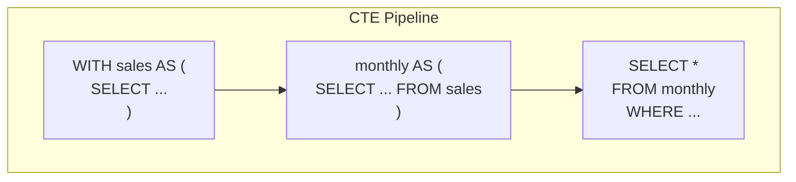
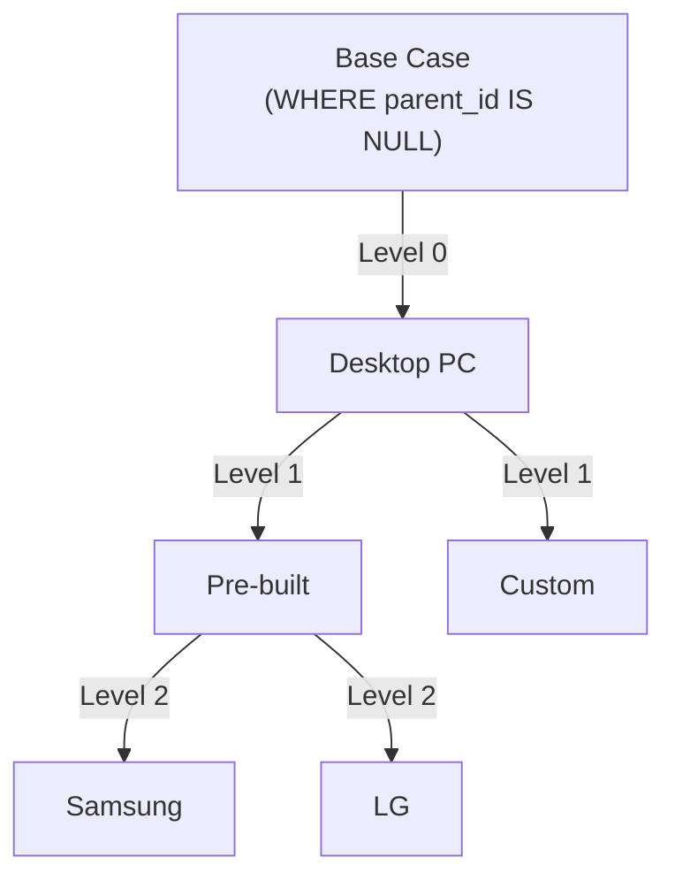
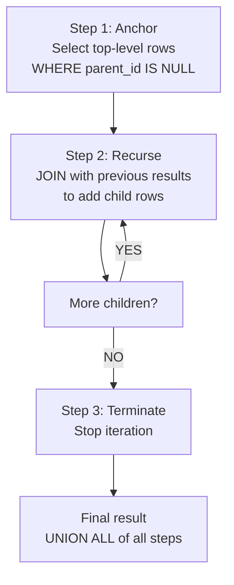

# Lesson 19: CTEs and Recursive CTEs

A Common Table Expression (CTE) is a named temporary result set defined before the main query using the `WITH` keyword. CTEs make complex queries much easier to read and debug. Each CTE is like a named subquery that can be referenced multiple times.





> CTEs split queries into step-by-step stages connected like a pipeline. Recursive CTEs traverse tree structures.


!!! note "Already familiar?"
    If you are comfortable with CTEs (WITH) and recursive CTEs, skip ahead to [Lesson 20: EXISTS](20-exists.md).

## Basic CTE

=== "SQLite"
    ```sql
    WITH monthly_revenue AS (
        SELECT
            SUBSTR(ordered_at, 1, 7) AS year_month,
            SUM(total_amount)        AS revenue,
            COUNT(*)                 AS order_count
        FROM orders
        WHERE status NOT IN ('cancelled', 'returned')
        GROUP BY SUBSTR(ordered_at, 1, 7)
    )
    SELECT
        year_month,
        revenue,
        order_count,
        ROUND(revenue / order_count, 2) AS avg_order_value
    FROM monthly_revenue
    WHERE year_month LIKE '2024%'
    ORDER BY year_month;
    ```

=== "MySQL"
    ```sql
    WITH monthly_revenue AS (
        SELECT
            DATE_FORMAT(ordered_at, '%Y-%m') AS year_month,
            SUM(total_amount)                AS revenue,
            COUNT(*)                         AS order_count
        FROM orders
        WHERE status NOT IN ('cancelled', 'returned')
        GROUP BY DATE_FORMAT(ordered_at, '%Y-%m')
    )
    SELECT
        year_month,
        revenue,
        order_count,
        ROUND(revenue / order_count, 2) AS avg_order_value
    FROM monthly_revenue
    WHERE year_month LIKE '2024%'
    ORDER BY year_month;
    ```

=== "PostgreSQL"
    ```sql
    WITH monthly_revenue AS (
        SELECT
            TO_CHAR(ordered_at, 'YYYY-MM') AS year_month,
            SUM(total_amount)              AS revenue,
            COUNT(*)                       AS order_count
        FROM orders
        WHERE status NOT IN ('cancelled', 'returned')
        GROUP BY TO_CHAR(ordered_at, 'YYYY-MM')
    )
    SELECT
        year_month,
        revenue,
        order_count,
        ROUND(revenue / order_count, 2) AS avg_order_value
    FROM monthly_revenue
    WHERE year_month LIKE '2024%'
    ORDER BY year_month;
    ```

**Result (example):**

| year_month | revenue | order_count | avg_order_value |
|------------|--------:|------------:|----------------:|
| 2024-01 | 147832.40 | 270 | 547.53 |
| 2024-02 | 136290.10 | 251 | 542.99 |
| 2024-03 | 204123.70 | 347 | 588.25 |
| ... | | | |

The CTE name `monthly_revenue` is self-descriptive. It naturally reads as: first compute the monthly totals, then query those results. No need for nested subqueries.

## Multiple CTEs

CTEs can be chained with commas. Later CTEs can reference previously defined CTEs.

```sql
-- 고객 생애 가치(LTV) 세그먼트 분류
WITH customer_orders AS (
    SELECT
        customer_id,
        COUNT(*)          AS order_count,
        SUM(total_amount) AS lifetime_value
    FROM orders
    WHERE status NOT IN ('cancelled', 'returned')
    GROUP BY customer_id
),
customer_segments AS (
    SELECT
        co.customer_id,
        c.name,
        c.grade,
        co.order_count,
        co.lifetime_value,
        CASE
            WHEN co.lifetime_value >= 5000 THEN 'Champion'
            WHEN co.lifetime_value >= 2000 THEN 'Loyal'
            WHEN co.lifetime_value >= 500  THEN 'Regular'
            ELSE 'Occasional'
        END AS segment
    FROM customer_orders AS co
    INNER JOIN customers AS c ON co.customer_id = c.id
)
SELECT
    segment,
    COUNT(*)                    AS customer_count,
    ROUND(AVG(lifetime_value), 2) AS avg_ltv,
    ROUND(AVG(order_count), 1)    AS avg_orders
FROM customer_segments
GROUP BY segment
ORDER BY avg_ltv DESC;
```

**Result (example):**

| segment | customer_count | avg_ltv | avg_orders |
| ---------- | ----------: | ----------: | ----------: |
| 챔피언 | 28939 | 13966442.39 | 13.5 |

## Combining CTEs with Window Functions

CTEs and window functions work well together. A common pattern is to assign ranks in a CTE and filter in the main query.

```sql
-- 회원 등급별 매출 상위 3명
WITH customer_revenue AS (
    SELECT
        c.id,
        c.name,
        c.grade,
        SUM(o.total_amount) AS total_spent
    FROM customers AS c
    INNER JOIN orders AS o ON c.id = o.customer_id
    WHERE o.status NOT IN ('cancelled', 'returned')
    GROUP BY c.id, c.name, c.grade
),
ranked AS (
    SELECT
        *,
        RANK() OVER (PARTITION BY grade ORDER BY total_spent DESC) AS rnk
    FROM customer_revenue
)
SELECT grade, name, total_spent, rnk
FROM ranked
WHERE rnk <= 3
ORDER BY grade, rnk;
```

**Result (example):**

| grade | name | total_spent | rnk |
| ---------- | ---------- | ----------: | ----------: |
| BRONZE | 이정수 | 198123069.0 | 1 |
| BRONZE | 황채원 | 158517555.0 | 2 |
| BRONZE | 이예준 | 149717892.0 | 3 |
| GOLD | 강명자 | 423617698.0 | 1 |
| GOLD | 홍옥순 | 410153190.0 | 2 |
| GOLD | 윤서현 | 399392033.0 | 3 |
| SILVER | 김광수 | 216856926.0 | 1 |
| SILVER | 김광수 | 216126763.0 | 2 |
| ... | ... | ... | ... |

## Recursive CTE — Category Tree Traversal

A Recursive CTE references itself. It is the standard SQL method for traversing hierarchical data like category trees, organization charts, and bills of materials (BOM).



> A recursive CTE consists of an **anchor (base case)** + **recursive member (iteration)** + **termination condition (no more children)**.

The `categories` table has a `parent_id` column that references itself.

=== "SQLite / PostgreSQL"
    ```sql
    -- Traverse the full category tree showing depth and path
    WITH RECURSIVE category_tree AS (
        -- Base case: top-level categories (no parent)
        SELECT
            id,
            name,
            parent_id,
            0             AS depth,
            name          AS path
        FROM categories
        WHERE parent_id IS NULL

        UNION ALL

        -- Recursive case: children of already found nodes
        SELECT
            c.id,
            c.name,
            c.parent_id,
            ct.depth + 1,
            ct.path || ' > ' || c.name
        FROM categories AS c
        INNER JOIN category_tree AS ct ON c.parent_id = ct.id
    )
    SELECT
        SUBSTR('          ', 1, depth * 2) || name AS indented_name,
        depth,
        path
    FROM category_tree
    ORDER BY path;
    ```

=== "MySQL"
    ```sql
    -- Traverse the full category tree showing depth and path
    WITH RECURSIVE category_tree AS (
        -- Base case: top-level categories (no parent)
        SELECT
            id,
            name,
            parent_id,
            0             AS depth,
            name          AS path
        FROM categories
        WHERE parent_id IS NULL

        UNION ALL

        -- Recursive case: children of already found nodes
        SELECT
            c.id,
            c.name,
            c.parent_id,
            ct.depth + 1,
            CONCAT(ct.path, ' > ', c.name)
        FROM categories AS c
        INNER JOIN category_tree AS ct ON c.parent_id = ct.id
    )
    SELECT
        CONCAT(SUBSTR('          ', 1, depth * 2), name) AS indented_name,
        depth,
        path
    FROM category_tree
    ORDER BY path;
    ```

**Result (example):**

| indented_name | depth | path |
| ---------- | ----------: | ---------- |
| CPU | 0 | CPU |
|   AMD | 1 | CPU > AMD |
|   Intel | 1 | CPU > Intel |
| UPS/전원 | 0 | UPS/전원 |
| 그래픽카드 | 0 | 그래픽카드 |
|   AMD | 1 | 그래픽카드 > AMD |
|   NVIDIA | 1 | 그래픽카드 > NVIDIA |
| 네트워크 장비 | 0 | 네트워크 장비 |
| ... | ... | ... |

## Additional Recursive CTE Applications

### Employee Organization Chart (Recursive CTE)

Recursively follow `staff.manager_id` to build the full organization chart.

=== "SQLite / PostgreSQL"
    ```sql
    WITH RECURSIVE org_chart AS (
        -- Base: CEO (no manager)
        SELECT id, name, role, department, manager_id, 0 AS level,
               name AS path
        FROM staff
        WHERE manager_id IS NULL

        UNION ALL

        -- Recursive: employees under each manager
        SELECT s.id, s.name, s.role, s.department, s.manager_id,
               oc.level + 1,
               oc.path || ' > ' || s.name
        FROM staff s
        JOIN org_chart oc ON s.manager_id = oc.id
    )
    SELECT level, path, role, department
    FROM org_chart
    ORDER BY path;
    ```

=== "MySQL"
    ```sql
    WITH RECURSIVE org_chart AS (
        -- Base: CEO (no manager)
        SELECT id, name, role, department, manager_id, 0 AS level,
               name AS path
        FROM staff
        WHERE manager_id IS NULL

        UNION ALL

        -- Recursive: employees under each manager
        SELECT s.id, s.name, s.role, s.department, s.manager_id,
               oc.level + 1,
               CONCAT(oc.path, ' > ', s.name)
        FROM staff s
        JOIN org_chart oc ON s.manager_id = oc.id
    )
    SELECT level, path, role, department
    FROM org_chart
    ORDER BY path;
    ```

### Q&A Thread (Recursive CTE)

Recursively trace the question, answer, and follow-up question chain.

=== "SQLite / PostgreSQL"
    ```sql
    WITH RECURSIVE thread AS (
        SELECT id, content, parent_id, 0 AS depth,
               CAST(id AS TEXT) AS thread_path
        FROM product_qna
        WHERE parent_id IS NULL

        UNION ALL

        SELECT q.id, q.content, q.parent_id, t.depth + 1,
               t.thread_path || '.' || CAST(q.id AS TEXT)
        FROM product_qna q
        JOIN thread t ON q.parent_id = t.id
    )
    SELECT depth, thread_path, SUBSTR('          ', 1, depth * 2) || content AS indented
    FROM thread
    ORDER BY thread_path
    LIMIT 20;
    ```

=== "MySQL"
    ```sql
    WITH RECURSIVE thread AS (
        SELECT id, content, parent_id, 0 AS depth,
               CAST(id AS CHAR) AS thread_path
        FROM product_qna
        WHERE parent_id IS NULL

        UNION ALL

        SELECT q.id, q.content, q.parent_id, t.depth + 1,
               CONCAT(t.thread_path, '.', CAST(q.id AS CHAR))
        FROM product_qna q
        JOIN thread t ON q.parent_id = t.id
    )
    SELECT depth, thread_path, CONCAT(SUBSTR('          ', 1, depth * 2), content) AS indented
    FROM thread
    ORDER BY thread_path
    LIMIT 20;
    ```

**Common real-world scenarios for CTEs:**

- **Hierarchy traversal:** Category trees, organization charts, BOM (recursive CTE)
- **Complex query readability:** Split into step-by-step CTEs for clarity
- **Month sequence generation:** Reports including empty months (generate months 1-12 recursively)
- **Multi-stage analysis:** Implement aggregation -> ratio -> ranking pipelines as CTE chains

## Summary

| Concept | Description | Example |
|------|------|------|
| WITH (CTE) | Named temporary result set | `WITH cte AS (...) SELECT ...` |
| Multiple CTEs | Chain CTEs with commas | `WITH a AS (...), b AS (...)` |
| Recursive CTE | Self-referencing (hierarchy traversal) | `WITH RECURSIVE ... UNION ALL ...` |
| Anchor member | Starting point of recursion (base case) | `WHERE parent_id IS NULL` |
| Recursive member | Expand by JOINing with previous results | `JOIN category_tree ON ...` |

!!! note "Lesson Review Problems"
    These are simple problems to immediately test the concepts learned in this lesson. For comprehensive practice combining multiple concepts, see the [Practice Problems](../exercises/index.md) section.

## Practice Problems
### Problem 1
Use a recursive CTE to generate a month number sequence from 1 to 12 and find the order count for each month of 2024. Months with no orders should show 0. Return `month_num`, `year_month`, `order_count`.

??? success "Answer"
    === "SQLite"
        ```sql
        WITH RECURSIVE months AS (
            SELECT 1 AS month_num
            UNION ALL
            SELECT month_num + 1
            FROM months
            WHERE month_num < 12
        )
        SELECT
            m.month_num,
            '2024-' || SUBSTR('0' || m.month_num, -2) AS year_month,
            COUNT(o.id) AS order_count
        FROM months AS m
        LEFT JOIN orders AS o
            ON SUBSTR(o.ordered_at, 1, 7) = '2024-' || SUBSTR('0' || m.month_num, -2)
            AND o.status NOT IN ('cancelled', 'returned')
        GROUP BY m.month_num
        ORDER BY m.month_num;
        ```

        **Result (example):**

| month_num | year_month | order_count |
| ----------: | ---------- | ----------: |
| 1 | 2024-01 | 3857 |
| 2 | 2024-02 | 4530 |
| 3 | 2024-03 | 4903 |
| 4 | 2024-04 | 4932 |
| 5 | 2024-05 | 5001 |
| 6 | 2024-06 | 3719 |
| 7 | 2024-07 | 4454 |
| 8 | 2024-08 | 4827 |
| ... | ... | ... |


    === "MySQL"
        ```sql
        WITH RECURSIVE months AS (
            SELECT 1 AS month_num
            UNION ALL
            SELECT month_num + 1
            FROM months
            WHERE month_num < 12
        )
        SELECT
            m.month_num,
            CONCAT('2024-', LPAD(m.month_num, 2, '0')) AS year_month,
            COUNT(o.id) AS order_count
        FROM months AS m
        LEFT JOIN orders AS o
            ON DATE_FORMAT(o.ordered_at, '%Y-%m') = CONCAT('2024-', LPAD(m.month_num, 2, '0'))
            AND o.status NOT IN ('cancelled', 'returned')
        GROUP BY m.month_num
        ORDER BY m.month_num;
        ```

    === "PostgreSQL"
        ```sql
        WITH RECURSIVE months AS (
            SELECT 1 AS month_num
            UNION ALL
            SELECT month_num + 1
            FROM months
            WHERE month_num < 12
        )
        SELECT
            m.month_num,
            '2024-' || LPAD(m.month_num::text, 2, '0') AS year_month,
            COUNT(o.id) AS order_count
        FROM months AS m
        LEFT JOIN orders AS o
            ON TO_CHAR(o.ordered_at, 'YYYY-MM') = '2024-' || LPAD(m.month_num::text, 2, '0')
            AND o.status NOT IN ('cancelled', 'returned')
        GROUP BY m.month_num
        ORDER BY m.month_num;
        ```


### Problem 2
Use a CTE to find "at-risk churn customers". These are customers who have ordered at least 3 times but whose last order was more than 180 days ago. Return `customer_id`, `name`, `grade`, `order_count`, `last_order_date`.

??? success "Answer"
    === "SQLite"
        ```sql
        WITH customer_recency AS (
            SELECT
                customer_id,
                COUNT(*)        AS order_count,
                MAX(ordered_at) AS last_order_date
            FROM orders
            WHERE status NOT IN ('cancelled', 'returned')
            GROUP BY customer_id
        )
        SELECT
            c.id    AS customer_id,
            c.name,
            c.grade,
            cr.order_count,
            cr.last_order_date
        FROM customer_recency AS cr
        INNER JOIN customers AS c ON cr.customer_id = c.id
        WHERE cr.order_count >= 3
          AND julianday('now') - julianday(cr.last_order_date) > 180
        ORDER BY cr.last_order_date ASC;
        ```

        **Result (example):**

| customer_id | name | grade | order_count | last_order_date |
| ----------: | ---------- | ---------- | ----------: | ---------- |
| 1761 | 이상훈 | BRONZE | 4 | 2018-09-05 19:29:12 |
| 115 | 배성현 | BRONZE | 4 | 2019-01-13 20:22:06 |
| 4017 | 김옥자 | BRONZE | 3 | 2019-03-10 17:38:26 |
| 2145 | 송은정 | BRONZE | 4 | 2019-03-22 11:02:35 |
| 3410 | 최상현 | BRONZE | 4 | 2019-11-10 20:37:22 |
| 190 | 김명숙 | BRONZE | 9 | 2020-01-11 11:15:01 |
| 2473 | 엄예진 | BRONZE | 3 | 2020-01-18 22:52:32 |
| 437 | 장예지 | BRONZE | 22 | 2020-02-16 10:11:16 |
| ... | ... | ... | ... | ... |


    === "MySQL"
        ```sql
        WITH customer_recency AS (
            SELECT
                customer_id,
                COUNT(*)        AS order_count,
                MAX(ordered_at) AS last_order_date
            FROM orders
            WHERE status NOT IN ('cancelled', 'returned')
            GROUP BY customer_id
        )
        SELECT
            c.id    AS customer_id,
            c.name,
            c.grade,
            cr.order_count,
            cr.last_order_date
        FROM customer_recency AS cr
        INNER JOIN customers AS c ON cr.customer_id = c.id
        WHERE cr.order_count >= 3
          AND DATEDIFF(NOW(), cr.last_order_date) > 180
        ORDER BY cr.last_order_date ASC;
        ```

    === "PostgreSQL"
        ```sql
        WITH customer_recency AS (
            SELECT
                customer_id,
                COUNT(*)        AS order_count,
                MAX(ordered_at) AS last_order_date
            FROM orders
            WHERE status NOT IN ('cancelled', 'returned')
            GROUP BY customer_id
        )
        SELECT
            c.id    AS customer_id,
            c.name,
            c.grade,
            cr.order_count,
            cr.last_order_date
        FROM customer_recency AS cr
        INNER JOIN customers AS c ON cr.customer_id = c.id
        WHERE cr.order_count >= 3
          AND CURRENT_DATE - cr.last_order_date::date > 180
        ORDER BY cr.last_order_date ASC;
        ```


### Problem 3
Use two CTEs to compute monthly revenue for 2024 and calculate month-over-month changes. CTE 1: monthly totals. CTE 2: add previous month values using `LAG`. Main query: return all columns plus `mom_change`, `mom_pct`.

??? success "Answer"
    === "SQLite"
        ```sql
        WITH monthly AS (
            SELECT
                SUBSTR(ordered_at, 1, 7) AS year_month,
                SUM(total_amount)        AS revenue
            FROM orders
            WHERE ordered_at LIKE '2024%'
              AND status NOT IN ('cancelled', 'returned')
            GROUP BY SUBSTR(ordered_at, 1, 7)
        ),
        with_lag AS (
            SELECT
                year_month,
                revenue,
                LAG(revenue) OVER (ORDER BY year_month) AS prev_revenue
            FROM monthly
        )
        SELECT
            year_month,
            revenue,
            prev_revenue,
            ROUND(revenue - prev_revenue, 2) AS mom_change,
            ROUND(100.0 * (revenue - prev_revenue) / prev_revenue, 1) AS mom_pct
        FROM with_lag
        ORDER BY year_month;
        ```

        **Result (example):**

| year_month | revenue | prev_revenue | mom_change | mom_pct |
| ---------- | ----------: | ---------- | ---------- | ---------- |
| 2024-01 | 3807789761.0 | (NULL) | (NULL) | (NULL) |
| 2024-02 | 4701108852.0 | 3807789761.0 | 893319091.0 | 23.5 |
| 2024-03 | 4935663129.0 | 4701108852.0 | 234554277.0 | 5.0 |
| 2024-04 | 4954492231.0 | 4935663129.0 | 18829102.0 | 0.4 |
| 2024-05 | 4912114419.0 | 4954492231.0 | -42377812.0 | -0.9 |
| 2024-06 | 3853868900.0 | 4912114419.0 | -1058245519.0 | -21.5 |
| 2024-07 | 4453107092.0 | 3853868900.0 | 599238192.0 | 15.5 |
| 2024-08 | 4903583071.0 | 4453107092.0 | 450475979.0 | 10.1 |
| ... | ... | ... | ... | ... |


    === "MySQL"
        ```sql
        WITH monthly AS (
            SELECT
                DATE_FORMAT(ordered_at, '%Y-%m') AS year_month,
                SUM(total_amount)                AS revenue
            FROM orders
            WHERE ordered_at >= '2024-01-01'
              AND ordered_at <  '2025-01-01'
              AND status NOT IN ('cancelled', 'returned')
            GROUP BY DATE_FORMAT(ordered_at, '%Y-%m')
        ),
        with_lag AS (
            SELECT
                year_month,
                revenue,
                LAG(revenue) OVER (ORDER BY year_month) AS prev_revenue
            FROM monthly
        )
        SELECT
            year_month,
            revenue,
            prev_revenue,
            ROUND(revenue - prev_revenue, 2) AS mom_change,
            ROUND(100.0 * (revenue - prev_revenue) / prev_revenue, 1) AS mom_pct
        FROM with_lag
        ORDER BY year_month;
        ```

    === "PostgreSQL"
        ```sql
        WITH monthly AS (
            SELECT
                TO_CHAR(ordered_at, 'YYYY-MM') AS year_month,
                SUM(total_amount)              AS revenue
            FROM orders
            WHERE ordered_at >= '2024-01-01'
              AND ordered_at <  '2025-01-01'
              AND status NOT IN ('cancelled', 'returned')
            GROUP BY TO_CHAR(ordered_at, 'YYYY-MM')
        ),
        with_lag AS (
            SELECT
                year_month,
                revenue,
                LAG(revenue) OVER (ORDER BY year_month) AS prev_revenue
            FROM monthly
        )
        SELECT
            year_month,
            revenue,
            prev_revenue,
            ROUND(revenue - prev_revenue, 2) AS mom_change,
            ROUND(100.0 * (revenue - prev_revenue) / prev_revenue, 1) AS mom_pct
        FROM with_lag
        ORDER BY year_month;
        ```


### Problem 4
Use a CTE to compare the average product price per category with the overall average price. Return `category_name`, `avg_price`, `overall_avg`, `diff_from_overall`. Use one CTE for the overall average, then compare with per-category averages in the main query.

??? success "Answer"
    ```sql
    WITH overall AS (
        SELECT ROUND(AVG(price), 2) AS overall_avg
        FROM products
        WHERE is_active = 1
    )
    SELECT
        cat.name AS category_name,
        ROUND(AVG(p.price), 2) AS avg_price,
        o.overall_avg,
        ROUND(AVG(p.price) - o.overall_avg, 2) AS diff_from_overall
    FROM products AS p
    INNER JOIN categories AS cat ON p.category_id = cat.id
    CROSS JOIN overall AS o
    WHERE p.is_active = 1
    GROUP BY cat.id, cat.name, o.overall_avg
    ORDER BY avg_price DESC;
    ```

        **Result (example):**

| category_name | avg_price | overall_avg | diff_from_overall |
| ---------- | ----------: | ----------: | ----------: |
| 맥북 | 3292633.33 | 678774.85 | 2613858.48 |
| 게이밍 노트북 | 2966560.61 | 678774.85 | 2287785.76 |
| NVIDIA | 2429036.96 | 678774.85 | 1750262.11 |
| 조립PC | 2210358.7 | 678774.85 | 1531583.85 |
| 일반 노트북 | 1739673.49 | 678774.85 | 1060898.64 |
| 2in1 | 1565324.44 | 678774.85 | 886549.59 |
| 완제품 | 1504925.68 | 678774.85 | 826150.83 |
| 전문가용 모니터 | 1328097.96 | 678774.85 | 649323.11 |
| ... | ... | ... | ... |


### Problem 5
Use a recursive CTE to find the full path (breadcrumb) of all leaf categories (categories with no children). Return `category_id`, `category_name`, `full_path`.

??? success "Answer"
    === "SQLite / PostgreSQL"
        ```sql
        WITH RECURSIVE category_tree AS (
            SELECT
                id,
                name,
                parent_id,
                name AS full_path
            FROM categories
            WHERE parent_id IS NULL

            UNION ALL

            SELECT
                c.id,
                c.name,
                c.parent_id,
                ct.full_path || ' > ' || c.name
            FROM categories AS c
            INNER JOIN category_tree AS ct ON c.parent_id = ct.id
        )
        SELECT
            ct.id   AS category_id,
            ct.name AS category_name,
            ct.full_path
        FROM category_tree AS ct
        WHERE ct.id NOT IN (SELECT parent_id FROM categories WHERE parent_id IS NOT NULL)
        ORDER BY ct.full_path;
        ```

        **Result (example):**

| category_id | category_name | full_path |
| ----------: | ---------- | ---------- |
| 16 | AMD | CPU > AMD |
| 15 | Intel | CPU > Intel |
| 49 | UPS/전원 | UPS/전원 |
| 29 | AMD | 그래픽카드 > AMD |
| 28 | NVIDIA | 그래픽카드 > NVIDIA |
| 46 | 공유기 | 네트워크 장비 > 공유기 |
| 48 | 랜카드 | 네트워크 장비 > 랜카드 |
| 47 | 허브/스위치 | 네트워크 장비 > 허브/스위치 |
| ... | ... | ... |


    === "MySQL"
        ```sql
        WITH RECURSIVE category_tree AS (
            SELECT
                id,
                name,
                parent_id,
                name AS full_path
            FROM categories
            WHERE parent_id IS NULL

            UNION ALL

            SELECT
                c.id,
                c.name,
                c.parent_id,
                CONCAT(ct.full_path, ' > ', c.name)
            FROM categories AS c
            INNER JOIN category_tree AS ct ON c.parent_id = ct.id
        )
        SELECT
            ct.id   AS category_id,
            ct.name AS category_name,
            ct.full_path
        FROM category_tree AS ct
        WHERE ct.id NOT IN (SELECT parent_id FROM categories WHERE parent_id IS NOT NULL)
        ORDER BY ct.full_path;
        ```


### Problem 6
Traverse the category tree with a recursive CTE, then aggregate the number of subcategories and products for each top-level category. Return `root_category`, `subcategory_count`, `product_count`.

??? success "Answer"
    === "SQLite / PostgreSQL"
        ```sql
        WITH RECURSIVE tree AS (
            SELECT id, name AS root_name, id AS root_id
            FROM categories
            WHERE parent_id IS NULL

            UNION ALL

            SELECT c.id, t.root_name, t.root_id
            FROM categories AS c
            INNER JOIN tree AS t ON c.parent_id = t.id
        )
        SELECT
            t.root_name AS root_category,
            COUNT(DISTINCT t.id) - 1 AS subcategory_count,
            COUNT(DISTINCT p.id)     AS product_count
        FROM tree AS t
        LEFT JOIN products AS p ON p.category_id = t.id
        GROUP BY t.root_id, t.root_name
        ORDER BY product_count DESC;
        ```

        **Result (example):**

| root_category | subcategory_count | product_count |
| ---------- | ----------: | ----------: |
| 노트북 | 4 | 311 |
| 마우스 | 3 | 233 |
| 키보드 | 3 | 213 |
| 저장장치 | 3 | 212 |
| 모니터 | 3 | 208 |
| 데스크톱 PC | 3 | 202 |
| 메인보드 | 2 | 182 |
| 메모리(RAM) | 2 | 167 |
| ... | ... | ... |


    === "MySQL"
        ```sql
        WITH RECURSIVE tree AS (
            SELECT id, name AS root_name, id AS root_id
            FROM categories
            WHERE parent_id IS NULL

            UNION ALL

            SELECT c.id, t.root_name, t.root_id
            FROM categories AS c
            INNER JOIN tree AS t ON c.parent_id = t.id
        )
        SELECT
            t.root_name AS root_category,
            COUNT(DISTINCT t.id) - 1 AS subcategory_count,
            COUNT(DISTINCT p.id)     AS product_count
        FROM tree AS t
        LEFT JOIN products AS p ON p.category_id = t.id
        GROUP BY t.root_id, t.root_name
        ORDER BY product_count DESC;
        ```


### Problem 7
Traverse the staff table organization chart with a recursive CTE to find the depth (level) from the top-level manager (manager_id IS NULL) and the number of direct reports. Return `manager_name`, `level`, `direct_reports`.

??? success "Answer"
    === "SQLite / PostgreSQL"
        ```sql
        WITH RECURSIVE org AS (
            SELECT id, name, manager_id, 0 AS level
            FROM staff
            WHERE manager_id IS NULL

            UNION ALL

            SELECT s.id, s.name, s.manager_id, o.level + 1
            FROM staff AS s
            INNER JOIN org AS o ON s.manager_id = o.id
        )
        SELECT
            m.name AS manager_name,
            m.level,
            COUNT(s.id) AS direct_reports
        FROM org AS m
        LEFT JOIN staff AS s ON s.manager_id = m.id
        GROUP BY m.id, m.name, m.level
        HAVING COUNT(s.id) > 0
        ORDER BY m.level, direct_reports DESC;
        ```

        **Result (example):**

| manager_name | level | direct_reports |
| ---------- | ----------: | ----------: |
| 한민재 | 0 | 8 |
| 박경수 | 1 | 8 |
| 이준혁 | 1 | 5 |
| 장주원 | 1 | 4 |
| 권영희 | 2 | 9 |
| 최영미 | 2 | 6 |
| 김진우 | 2 | 5 |
| 황예준 | 2 | 2 |
| ... | ... | ... |


    === "MySQL"
        ```sql
        WITH RECURSIVE org AS (
            SELECT id, name, manager_id, 0 AS level
            FROM staff
            WHERE manager_id IS NULL

            UNION ALL

            SELECT s.id, s.name, s.manager_id, o.level + 1
            FROM staff AS s
            INNER JOIN org AS o ON s.manager_id = o.id
        )
        SELECT
            m.name AS manager_name,
            m.level,
            COUNT(s.id) AS direct_reports
        FROM org AS m
        LEFT JOIN staff AS s ON s.manager_id = m.id
        GROUP BY m.id, m.name, m.level
        HAVING COUNT(s.id) > 0
        ORDER BY m.level, direct_reports DESC;
        ```


### Problem 8
Use multiple CTEs to calculate the monthly revenue share by payment method. CTE 1: amount per payment method per month. CTE 2: monthly total. Main query: return `year_month`, `method`, `amount`, `monthly_total`, `pct`. Use 2024 data only.

??? success "Answer"
    === "SQLite"
        ```sql
        WITH method_monthly AS (
            SELECT
                SUBSTR(p.paid_at, 1, 7) AS year_month,
                p.method,
                SUM(p.amount) AS amount
            FROM payments AS p
            INNER JOIN orders AS o ON p.order_id = o.id
            WHERE p.paid_at LIKE '2024%'
              AND p.status = 'completed'
            GROUP BY SUBSTR(p.paid_at, 1, 7), p.method
        ),
        monthly_total AS (
            SELECT
                year_month,
                SUM(amount) AS total
            FROM method_monthly
            GROUP BY year_month
        )
        SELECT
            mm.year_month,
            mm.method,
            mm.amount,
            mt.total AS monthly_total,
            ROUND(100.0 * mm.amount / mt.total, 1) AS pct
        FROM method_monthly AS mm
        INNER JOIN monthly_total AS mt ON mm.year_month = mt.year_month
        ORDER BY mm.year_month, mm.amount DESC;
        ```

        **Result (example):**

| year_month | method | amount | monthly_total | pct |
| ---------- | ---------- | ----------: | ----------: | ----------: |
| 2024-01 | card | 1637985623.0 | 3741059908.0 | 43.8 |
| 2024-01 | kakao_pay | 701582674.0 | 3741059908.0 | 18.8 |
| 2024-01 | naver_pay | 604077057.0 | 3741059908.0 | 16.1 |
| 2024-01 | bank_transfer | 397750334.0 | 3741059908.0 | 10.6 |
| 2024-01 | virtual_account | 209801928.0 | 3741059908.0 | 5.6 |
| 2024-01 | point | 189862292.0 | 3741059908.0 | 5.1 |
| 2024-02 | card | 2157466285.0 | 4628277628.0 | 46.6 |
| 2024-02 | kakao_pay | 794741444.0 | 4628277628.0 | 17.2 |
| ... | ... | ... | ... | ... |


    === "MySQL"
        ```sql
        WITH method_monthly AS (
            SELECT
                DATE_FORMAT(p.paid_at, '%Y-%m') AS year_month,
                p.method,
                SUM(p.amount) AS amount
            FROM payments AS p
            INNER JOIN orders AS o ON p.order_id = o.id
            WHERE p.paid_at >= '2024-01-01'
              AND p.paid_at <  '2025-01-01'
              AND p.status = 'completed'
            GROUP BY DATE_FORMAT(p.paid_at, '%Y-%m'), p.method
        ),
        monthly_total AS (
            SELECT
                year_month,
                SUM(amount) AS total
            FROM method_monthly
            GROUP BY year_month
        )
        SELECT
            mm.year_month,
            mm.method,
            mm.amount,
            mt.total AS monthly_total,
            ROUND(100.0 * mm.amount / mt.total, 1) AS pct
        FROM method_monthly AS mm
        INNER JOIN monthly_total AS mt ON mm.year_month = mt.year_month
        ORDER BY mm.year_month, mm.amount DESC;
        ```

    === "PostgreSQL"
        ```sql
        WITH method_monthly AS (
            SELECT
                TO_CHAR(p.paid_at, 'YYYY-MM') AS year_month,
                p.method,
                SUM(p.amount) AS amount
            FROM payments AS p
            INNER JOIN orders AS o ON p.order_id = o.id
            WHERE p.paid_at >= '2024-01-01'
              AND p.paid_at <  '2025-01-01'
              AND p.status = 'completed'
            GROUP BY TO_CHAR(p.paid_at, 'YYYY-MM'), p.method
        ),
        monthly_total AS (
            SELECT
                year_month,
                SUM(amount) AS total
            FROM method_monthly
            GROUP BY year_month
        )
        SELECT
            mm.year_month,
            mm.method,
            mm.amount,
            mt.total AS monthly_total,
            ROUND(100.0 * mm.amount / mt.total, 1) AS pct
        FROM method_monthly AS mm
        INNER JOIN monthly_total AS mt ON mm.year_month = mt.year_month
        ORDER BY mm.year_month, mm.amount DESC;
        ```


### Problem 9
Combine CTEs with window functions to find the top 2 products by review rating in each category. Return `category_name`, `product_name`, `avg_rating`, `review_count`, `rnk`. Only include products with 3 or more reviews.

??? success "Answer"
    ```sql
    WITH product_ratings AS (
        SELECT
            p.id AS product_id,
            p.name AS product_name,
            cat.name AS category_name,
            p.category_id,
            ROUND(AVG(r.rating), 2) AS avg_rating,
            COUNT(r.id) AS review_count
        FROM products AS p
        INNER JOIN categories AS cat ON p.category_id = cat.id
        INNER JOIN reviews AS r ON r.product_id = p.id
        GROUP BY p.id, p.name, cat.name, p.category_id
        HAVING COUNT(r.id) >= 3
    ),
    ranked AS (
        SELECT
            category_name,
            product_name,
            avg_rating,
            review_count,
            RANK() OVER (
                PARTITION BY category_id
                ORDER BY avg_rating DESC
            ) AS rnk
        FROM product_ratings
    )
    SELECT category_name, product_name, avg_rating, review_count, rnk
    FROM ranked
    WHERE rnk <= 2
    ORDER BY category_name, rnk;
    ```

        **Result (example):**

| category_name | product_name | avg_rating | review_count | rnk |
| ---------- | ---------- | ----------: | ----------: | ----------: |
| 2in1 | 레노버 ThinkPad X1 2in1 실버 | 4.8 | 5 | 1 |
| 2in1 | 레노버 IdeaPad Flex 5 블랙 | 4.73 | 11 | 2 |
| AMD | AMD Ryzen 7 7700X 블랙 | 4.4 | 20 | 1 |
| AMD | MSI Radeon RX 7900 XTX GAMING X | 4.83 | 6 | 1 |
| AMD | AMD Ryzen 7 7800X3D | 4.09 | 11 | 2 |
| AMD | AMD Ryzen 9 9950X3D 블랙 | 4.09 | 96 | 2 |
| AMD | MSI Radeon RX 7800 XT GAMING X | 4.6 | 5 | 2 |
| AMD 소켓 | MSI MAG X870E TOMAHAWK WIFI 화이트 | 4.59 | 39 | 1 |
| ... | ... | ... | ... | ... |


### Problem 10
Chain 3 CTEs to build a "product performance dashboard". CTE 1: total units sold and revenue per product. CTE 2: average review rating per product. CTE 3: JOIN both CTEs. Main query: return `product_name`, `units_sold`, `revenue`, `avg_rating` and show the top 10 by revenue.

??? success "Answer"
    ```sql
    WITH sales AS (
        SELECT
            oi.product_id,
            SUM(oi.quantity)              AS units_sold,
            SUM(oi.quantity * oi.unit_price) AS revenue
        FROM order_items AS oi
        INNER JOIN orders AS o ON oi.order_id = o.id
        WHERE o.status IN ('delivered', 'confirmed')
        GROUP BY oi.product_id
    ),
    ratings AS (
        SELECT
            product_id,
            ROUND(AVG(rating), 2) AS avg_rating
        FROM reviews
        GROUP BY product_id
    ),
    combined AS (
        SELECT
            p.name AS product_name,
            COALESCE(s.units_sold, 0) AS units_sold,
            COALESCE(s.revenue, 0)    AS revenue,
            r.avg_rating
        FROM products AS p
        LEFT JOIN sales   AS s ON p.id = s.product_id
        LEFT JOIN ratings AS r ON p.id = r.product_id
        WHERE p.is_active = 1
    )
    SELECT product_name, units_sold, revenue, avg_rating
    FROM combined
    ORDER BY revenue DESC
    LIMIT 10;
    ```

        **Result (example):**

| product_name | units_sold | revenue | avg_rating |
| ---------- | ----------: | ----------: | ----------: |
| MSI GeForce RTX 5070 Ti VENTUS 3X 실버 | 471 | 2299186500.0 | 3.8 |
| MSI GeForce RTX 4070 Ti Super GAMING X | 476 | 2201071600.0 | 3.85 |
| AMD Ryzen 7 7700X 블랙 | 1778 | 1965045600.0 | 3.88 |
| Razer Blade 14 실버 | 362 | 1610393200.0 | 4.21 |
| AMD Ryzen 9 9900X 화이트 | 1916 | 1550427200.0 | 3.9 |
| MSI GeForce RTX 4090 SUPRIM X 화이트 | 406 | 1546738200.0 | 4.13 |
| 기가바이트 RTX 5090 AERO OC | 399 | 1534514100.0 | 3.93 |
| ASUS ROG STRIX RTX 5090 | 427 | 1474174800.0 | 3.76 |
| ... | ... | ... | ... |


### Scoring Guide

| Score | Next Step |
|:----:|----------|
| **9-10** | Move to [Lesson 20: EXISTS](20-exists.md) |
| **7-8** | Review the explanations for incorrect answers, then proceed |
| **Half or less** | Re-read this lesson |
| **3 or fewer** | Start again from [Lesson 18: Window Functions](18-window.md) |

**Problem Areas:**

| Area | Problems |
|------|:--------:|
| Recursive CTE (sequence generation) | 1 |
| Single CTE + filtering | 2, 4 |
| CTE + growth rate comparison | 3 |
| Recursive CTE (tree traversal) | 5, 6, 7 |
| Multiple CTE chaining | 8, 9, 10 |

---
Next: [Lesson 20: EXISTS and Correlated Subqueries](20-exists.md)
