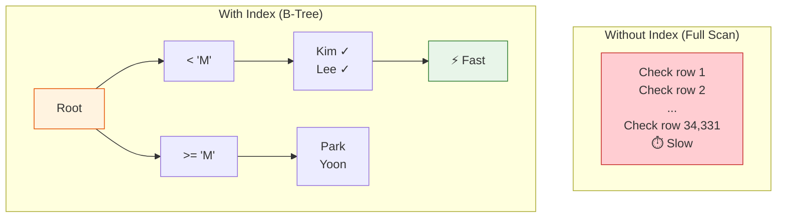

# Lesson 19: Indexes and Query Planning

An index is a data structure that lets SQLite find rows without scanning the entire table. Understanding when indexes help — and when they don't — is the foundation of query performance tuning.



> Without an index, every row is checked (full scan). With an index, B-tree lookup is fast.

## What an Index Does

Without an index, SQLite reads every row in a table to find matches (a **full table scan**). With an index on the search column, it jumps directly to the relevant rows — like a book's index versus reading every page.

```
Table scan:   O(n)   — checks every row
Index lookup: O(log n) — binary search on the index tree
```

For a table with 34,689 orders, a scan checks all 34,689 rows. An index on `customer_id` reduces that to perhaps 5–10 index lookups.

## EXPLAIN QUERY PLAN

`EXPLAIN QUERY PLAN` shows how SQLite plans to execute a query — whether it will scan or use an index.

```sql
-- Check the plan for a common query
EXPLAIN QUERY PLAN
SELECT order_number, total_amount
FROM orders
WHERE customer_id = 42;
```

**Without index — full table scan:**
```
QUERY PLAN
└── SCAN orders
```

**With index on customer_id — index lookup:**
```
QUERY PLAN
└── SEARCH orders USING INDEX idx_orders_customer_id (customer_id=?)
```

## Viewing Existing Indexes

The TechShop database has pre-built indexes on all foreign keys and frequently-queried columns.

```sql
-- List all indexes in the database
SELECT name, tbl_name, sql
FROM sqlite_master
WHERE type = 'index'
  AND sql IS NOT NULL   -- exclude auto-created PRIMARY KEY indexes
ORDER BY tbl_name, name;
```

**Sample result:**

| name | tbl_name | sql |
|------|----------|-----|
| idx_orders_customer_id | orders | CREATE INDEX idx_orders_customer_id ON orders(customer_id) |
| idx_orders_ordered_at | orders | CREATE INDEX idx_orders_ordered_at ON orders(ordered_at) |
| idx_order_items_order_id | order_items | CREATE INDEX ... |
| idx_order_items_product_id | order_items | CREATE INDEX ... |
| idx_reviews_product_id | reviews | CREATE INDEX ... |
| ... | | |

## Seeing SCAN vs. SEARCH

```sql
-- Indexed: fast search
EXPLAIN QUERY PLAN
SELECT * FROM orders
WHERE ordered_at BETWEEN '2024-01-01' AND '2024-12-31';
-- Result: SEARCH orders USING INDEX idx_orders_ordered_at
```

```sql
-- Not indexed: full scan
EXPLAIN QUERY PLAN
SELECT * FROM orders
WHERE notes LIKE '%urgent%';
-- Result: SCAN orders
-- (LIKE '%...%' cannot use a B-tree index due to leading wildcard)
```

## When Indexes Help

| Situation | Index useful? |
|-----------|--------------|
| `WHERE col = ?` on a high-cardinality column | Yes |
| `WHERE col BETWEEN ? AND ?` | Yes |
| `ORDER BY col` (with LIMIT) | Yes |
| `JOIN ON a.id = b.fk_id` | Yes |
| `WHERE col LIKE 'prefix%'` | Yes |
| `WHERE col LIKE '%suffix'` | No — leading wildcard |
| `WHERE UPPER(col) = ?` | No — function on column |
| Small table (< 1,000 rows) | Rarely worth it |
| Bulk INSERT/UPDATE/DELETE | Index slows writes |

## Creating an Index

```sql
-- Create a composite index for a common filter pattern
CREATE INDEX IF NOT EXISTS idx_orders_status_date
ON orders (status, ordered_at);
```

Now a query filtering by both status and date can use this index:

```sql
EXPLAIN QUERY PLAN
SELECT order_number, total_amount
FROM orders
WHERE status = 'confirmed'
  AND ordered_at >= '2024-01-01';
-- SEARCH orders USING INDEX idx_orders_status_date (status=? AND ordered_at>?)
```

## Composite Index Column Order

In a composite index `(a, b)`, the index supports:
- Filter on `a` alone
- Filter on `a` and `b` together
- Sort on `a` (or `a, b`)

But it does **not** help when filtering only on `b`.

```sql
-- This uses the composite index (status, ordered_at)
WHERE status = 'confirmed' AND ordered_at > '2024-01-01'

-- This also uses it (leftmost prefix only)
WHERE status = 'confirmed'

-- This does NOT use it
WHERE ordered_at > '2024-01-01'   -- missing left column
```

## Dropping an Index

```sql
DROP INDEX IF EXISTS idx_orders_status_date;
```

!!! note "Lesson Review"
    Quick exercises to check your understanding of this lesson. For comprehensive practice combining multiple concepts, see the [Exercises](../exercises/) section.

## Practice Exercises

### Exercise 1
Run `EXPLAIN QUERY PLAN` on a query that finds all orders for a specific customer sorted by date. Check whether an index is used. Then run the same check for a query filtering by `notes IS NOT NULL`.

??? success "Answer"
    ```sql
    -- Should use idx_orders_customer_id
    EXPLAIN QUERY PLAN
    SELECT order_number, ordered_at, total_amount
    FROM orders
    WHERE customer_id = 100
    ORDER BY ordered_at DESC;

    -- Likely a full scan (no index on notes)
    EXPLAIN QUERY PLAN
    SELECT order_number, notes
    FROM orders
    WHERE notes IS NOT NULL;
    ```

### Exercise 2
List all indexes in the database using `sqlite_master`. For each index, identify whether it is on a single column or a composite (multi-column) index by examining the `sql` column. How many composite indexes exist?

??? success "Answer"
    ```sql
    SELECT
        name,
        tbl_name,
        sql,
        CASE WHEN sql LIKE '%,%' THEN 'Composite' ELSE 'Single' END AS index_type
    FROM sqlite_master
    WHERE type = 'index'
      AND sql IS NOT NULL
    ORDER BY tbl_name, name;
    ```

---
Next: [Lesson 20: Triggers](20-triggers.md)
