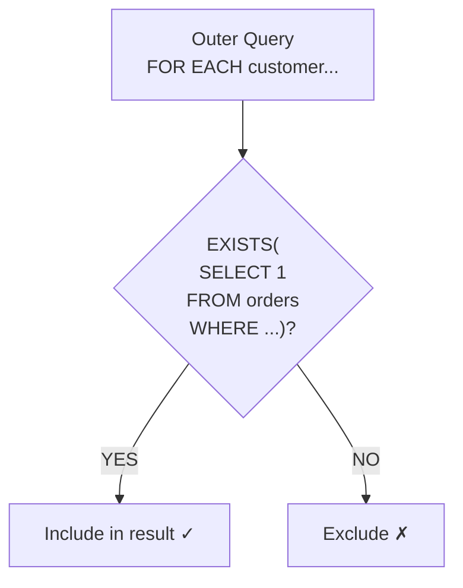
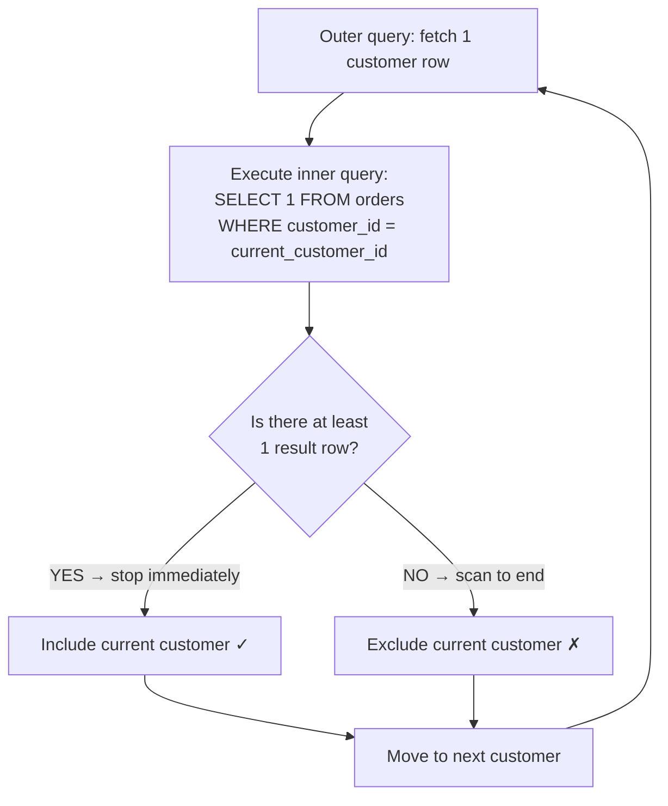

# Lesson 20: EXISTS and Correlated Subqueries

`EXISTS` checks whether a subquery returns at least one row. Unlike `IN`, it stops as soon as the first matching row is found, making it efficient for large datasets and safe in situations where NULL values may be present.



> EXISTS executes the subquery for each row of the outer query and includes the row if a result exists.

**Common real-world scenarios for using EXISTS:**

- **Finding missing data:** Customers with no orders, products with no reviews (NOT EXISTS)
- **Conditional existence checks:** VIP customers with no recent orders (EXISTS + NOT EXISTS)
- **Data integrity:** FK integrity validation, detecting orphan records (NOT EXISTS)
- **Universal negation:** "Products purchased by every customer" (double NOT EXISTS)


!!! note "Already familiar?"
    If you are comfortable with EXISTS, NOT EXISTS, and correlated subqueries, skip ahead to [Lesson 21: SELF/CROSS JOIN](21-self-cross-join.md).

## EXISTS vs. IN

| Characteristic | `IN` | `EXISTS` |
|---------|------|---------|
| Return value | Matching values | True/False |
| NULL safety | Not safe — `NOT IN` fails when NULL is present | Safe |
| Short-circuit evaluation | None | Yes — stops at first match |
| Self-reference | Not possible | Possible — correlated subquery |

## Basic EXISTS

{ .off-glb width="280"  }

```sql
-- Customers who have placed at least one order
SELECT id, name, grade
FROM customers AS c
WHERE EXISTS (
    SELECT 1
    FROM orders AS o
    WHERE o.customer_id = c.id
)
ORDER BY name
LIMIT 8;
```

When the inner query references `c.id` from the outer query, it is called a **Correlated Subquery**. It executes once for each outer row to check whether a matching order exists.

## NOT EXISTS — Finding Missing Data

{ .off-glb width="280"  }

`NOT EXISTS` is a safe alternative to `NOT IN` when the subquery column may contain NULL values.

```sql
-- Customers who have never placed an order (safer than NOT IN)
SELECT id, name, email, created_at
FROM customers AS c
WHERE NOT EXISTS (
    SELECT 1
    FROM orders AS o
    WHERE o.customer_id = c.id
)
ORDER BY created_at DESC
LIMIT 10;
```

**Result (example):**

| id   | name | email                | created_at          |
| ---: | ---- | -------------------- | ------------------- |
| 4933 | 윤예준  | user4933@testmail.kr | 2025-12-30 20:40:58 |
| 5222 | 유동현  | user5222@testmail.kr | 2025-12-30 10:18:14 |
| ...  | ...  | ...                  | ...                 |

```sql
-- Products on someone's wishlist but never purchased
SELECT p.id, p.name, p.price
FROM products AS p
WHERE EXISTS (
    SELECT 1 FROM wishlists AS w WHERE w.product_id = p.id
)
AND NOT EXISTS (
    SELECT 1 FROM order_items AS oi WHERE oi.product_id = p.id
)
ORDER BY p.price DESC;
```

**Result (example):**

| id  | name                   | price  |
| --: | ---------------------- | -----: |
| 260 | 삼성 오디세이 OLED G8        | 693300 |
| 277 | ASRock X870E Taichi 실버 | 583500 |
| ... | ...                    | ...    |

## Correlated Subqueries for Conditional Logic

Using a correlated subquery in the `SELECT` clause, you can check "does a related record exist?" for each row.

```sql
-- Show whether each customer has orders, reviews, and complaints
SELECT
    c.id,
    c.name,
    c.grade,
    CASE WHEN EXISTS (SELECT 1 FROM orders     WHERE customer_id = c.id) THEN 'Yes' ELSE 'No' END AS has_orders,
    CASE WHEN EXISTS (SELECT 1 FROM reviews    WHERE customer_id = c.id) THEN 'Yes' ELSE 'No' END AS has_reviews,
    CASE WHEN EXISTS (SELECT 1 FROM complaints WHERE customer_id = c.id) THEN 'Yes' ELSE 'No' END AS has_complaints
FROM customers AS c
WHERE c.grade IN ('VIP', 'GOLD')
ORDER BY c.name
LIMIT 8;
```

**Result (example):**

| id   | name | grade | has_orders | has_reviews | has_complaints |
| ---: | ---- | ----- | ---------- | ----------- | -------------- |
| 2103 | 강경희  | GOLD  | Yes         | Yes          | Yes             |
| 1492 | 강도윤  | VIP   | Yes         | Yes          | Yes             |
| 2606 | 강도현  | GOLD  | Yes         | Yes          | Yes             |
| ...  | ...  | ...   | ...        | ...         | ...            |

## Multi-Condition EXISTS

```sql
-- Customers who both placed orders and filed complaints in 2024
SELECT c.id, c.name, c.grade
FROM customers AS c
WHERE EXISTS (
    SELECT 1
    FROM orders AS o
    WHERE o.customer_id = c.id
      AND o.ordered_at LIKE '2024%'
)
AND EXISTS (
    SELECT 1
    FROM complaints AS comp
    WHERE comp.customer_id = c.id
)
ORDER BY c.name;
```

## Using EXISTS in HAVING (with Aggregation)

```sql
-- Categories that have at least one product with 50 or more reviews
SELECT
    cat.name    AS category,
    COUNT(p.id) AS product_count
FROM categories AS cat
INNER JOIN products AS p ON p.category_id = cat.id
GROUP BY cat.id, cat.name
HAVING EXISTS (
    SELECT 1
    FROM products  AS p2
    INNER JOIN reviews AS r ON r.product_id = p2.id
    WHERE p2.category_id = cat.id
    GROUP BY p2.id
    HAVING COUNT(r.id) >= 50
)
ORDER BY category;
```

## How EXISTS Executes

To understand why EXISTS is efficient, you need to know its internal behavior.



**Key: Short-circuit Evaluation**

- `EXISTS`: **Stops** as soon as the first matching row is found. Even if a customer has 100 orders, only 1 needs to be checked.
- `IN`: Collects the **entire result** of the subquery first, then compares. The difference is significant with large datasets.
- Why use `SELECT 1`: EXISTS only checks for the **existence** of rows, so there is no need to retrieve column values. `SELECT *` also works, but `SELECT 1` makes the intent clearer.

## The NULL Trap with NOT IN

If the subquery result of `NOT IN` contains **even one NULL**, the entire result becomes empty. This is the primary reason to prefer `NOT EXISTS`.

```sql
-- ❌ Dangerous: if product_id has NULL, result is 0 rows!
SELECT name FROM products
WHERE id NOT IN (SELECT product_id FROM order_items);
-- If even one row has NULL product_id, all comparisons become UNKNOWN → no results

-- ✅ Safe: NOT EXISTS is not affected by NULL
SELECT name FROM products AS p
WHERE NOT EXISTS (
    SELECT 1 FROM order_items AS oi
    WHERE oi.product_id = p.id
);
```

> **Rule:** Use `NOT EXISTS` by default instead of `NOT IN`. Especially when the subquery column may contain NULL, always use `NOT EXISTS`.

## Anti-Join Pattern Comparison

"Finding rows that don't exist" can be implemented in three ways in SQL. Here is a comparison of the pros and cons.

| Pattern | Syntax | NULL Safe | Performance (large data) |
|------|------|:---------:|:----------:|
| `NOT EXISTS` | `WHERE NOT EXISTS (SELECT 1 FROM ... WHERE ...)` | ✅ | Fast |
| `LEFT JOIN + IS NULL` | `LEFT JOIN ... WHERE right.id IS NULL` | ✅ | Fast |
| `NOT IN` | `WHERE col NOT IN (SELECT ...)` | ❌ | Can be slow |

```sql
-- Method 1: NOT EXISTS (recommended)
SELECT c.name FROM customers AS c
WHERE NOT EXISTS (
    SELECT 1 FROM orders AS o WHERE o.customer_id = c.id
);

-- Method 2: LEFT JOIN + IS NULL (equivalent)
SELECT c.name FROM customers AS c
LEFT JOIN orders AS o ON o.customer_id = c.id
WHERE o.id IS NULL;

-- Method 3: NOT IN (NULL risk)
SELECT name FROM customers
WHERE id NOT IN (SELECT customer_id FROM orders);
```

All three queries return the same result, but `NOT IN` returns an empty result if `customer_id` contains NULL. In practice, use **NOT EXISTS** or **LEFT JOIN + IS NULL**.

## Summary

| Concept | Description | Example |
|------|------|------|
| EXISTS | TRUE if subquery returns at least 1 row | `WHERE EXISTS (SELECT 1 FROM ...)` |
| NOT EXISTS | TRUE if subquery returns 0 rows | `WHERE NOT EXISTS (SELECT 1 FROM ...)` |
| Correlated subquery | Inner query references columns from the outer query | `WHERE o.customer_id = c.id` |
| Short-circuit evaluation | EXISTS stops immediately at first match | More efficient than IN for large data |
| NOT IN NULL trap | Entire result disappears when NULL is present | Replace with NOT EXISTS |
| Anti-join | 3 patterns for "finding what doesn't exist" | NOT EXISTS ≈ LEFT JOIN IS NULL > NOT IN |
| HAVING + EXISTS | Add existence conditions to aggregate results | Only groups meeting specific conditions |

!!! note "Lesson Review Problems"
    These are simple problems to immediately test the concepts learned in this lesson. For comprehensive practice combining multiple concepts, see the [Practice Problems](../exercises/index.md) section.

## Practice Problems
### Problem 1
Use `NOT EXISTS` to implement an anti-join to find orders where shipping has been created but delivery is not yet completed (delivered_at IS NULL). Return `order_number`, `ordered_at`, `status`, `carrier`, `shipped_at`.

??? success "Answer"
    ```sql
    SELECT
        o.order_number,
        o.ordered_at,
        o.status,
        s.carrier,
        s.shipped_at
    FROM orders AS o
    INNER JOIN shipping AS s ON s.order_id = o.id
    WHERE NOT EXISTS (
        SELECT 1
        FROM shipping AS s2
        WHERE s2.order_id = o.id
          AND s2.delivered_at IS NOT NULL
    )
    ORDER BY s.shipped_at DESC
    LIMIT 20;
    ```

    **Result (example):**

    | order_number       | ordered_at          | status  | carrier | shipped_at          |
    | ------------------ | ------------------- | ------- | ------- | ------------------- |
    | ORD-20250624-34824 | 2025-06-24 19:12:48 | shipped | 한진택배    | 2025-06-27 19:12:48 |
    | ORD-20250624-34828 | 2025-06-24 19:43:51 | shipped | CJ대한통운  | 2025-06-26 19:43:51 |
    | ORD-20250624-34826 | 2025-06-24 19:48:54 | shipped | 한진택배    | 2025-06-25 19:48:54 |
    | ORD-20250623-34821 | 2025-06-23 19:04:07 | shipped | 한진택배    | 2025-06-25 19:04:07 |
    | ORD-20250622-34810 | 2025-06-22 08:01:21 | shipped | 우체국택배   | 2025-06-25 08:01:21 |
    | ...                | ...                 | ...     | ...     | ...                 |


### Problem 2
Use `EXISTS` with correlated subqueries to find products that have both a 5-star and a 1-star review. Return `product_id`, `product_name`, `price`.

??? success "Answer"
    ```sql
    SELECT
        p.id    AS product_id,
        p.name  AS product_name,
        p.price
    FROM products AS p
    WHERE EXISTS (
        SELECT 1 FROM reviews WHERE product_id = p.id AND rating = 5
    )
    AND EXISTS (
        SELECT 1 FROM reviews WHERE product_id = p.id AND rating = 1
    )
    ORDER BY p.name;
    ```

    **Result (example):**

    | product_id | product_name                        | price  |
    | ---------: | ----------------------------------- | -----: |
    |         44 | AMD Ryzen 9 9900X                   | 244800 |
    |        171 | APC Back-UPS Pro Gaming BGM1500B 블랙 | 408800 |
    |        140 | ASRock B850M Pro RS 블랙              | 201900 |
    |         47 | ASRock B850M Pro RS 실버              | 533600 |
    |        164 | ASRock B850M Pro RS 화이트             | 426500 |
    | ...        | ...                                 | ...    |


### Problem 3
Use correlated subqueries to display the highest-value order information for each staff member. Return `staff_name`, `department`, `max_order_amount`, `max_order_number`. `max_order_number` is the order number matching that amount.

??? success "Answer"
    ```sql
    SELECT
        s.name AS staff_name,
        s.department,
        (SELECT MAX(o.total_amount) FROM orders AS o WHERE o.staff_id = s.id) AS max_order_amount,
        (SELECT o.order_number FROM orders AS o
         WHERE o.staff_id = s.id
         ORDER BY o.total_amount DESC
         LIMIT 1) AS max_order_number
    FROM staff AS s
    WHERE EXISTS (
        SELECT 1 FROM orders WHERE staff_id = s.id
    )
    ORDER BY max_order_amount DESC
    LIMIT 15;
    ```


### Problem 4
Use `NOT EXISTS` to find customers who have never written a review but have placed 5 or more orders. Return `customer_id`, `name`, `grade`, `order_count`.

??? success "Answer"
    ```sql
    SELECT
        c.id AS customer_id,
        c.name,
        c.grade,
        (SELECT COUNT(*) FROM orders WHERE customer_id = c.id
            AND status NOT IN ('cancelled', 'returned')) AS order_count
    FROM customers AS c
    WHERE NOT EXISTS (
        SELECT 1 FROM reviews WHERE customer_id = c.id
    )
    AND (
        SELECT COUNT(*) FROM orders WHERE customer_id = c.id
            AND status NOT IN ('cancelled', 'returned')
    ) >= 5
    ORDER BY order_count DESC
    LIMIT 20;
    ```

    **Result (example):**

    | customer_id | name | grade  | order_count |
    | ----------: | ---- | ------ | ----------: |
    |        3132 | 이진호  | VIP    |          16 |
    |         380 | 김영환  | SILVER |          14 |
    |        2358 | 김민준  | SILVER |          14 |
    |         982 | 남성민  | BRONZE |          13 |
    |        1525 | 배민석  | BRONZE |          13 |
    | ...         | ...  | ...    | ...         |


### Problem 5
Use `EXISTS` to find customers who have paid at least once with every payment method (credit_card, bank_transfer, cash, etc.). Return `customer_id`, `name`. Hint: Compare the number of payment method types with the number of methods used by each customer.

??? success "Answer"
    ```sql
    SELECT c.id AS customer_id, c.name
    FROM customers AS c
    WHERE NOT EXISTS (
        SELECT DISTINCT p2.method
        FROM payments AS p2
        WHERE p2.status = 'completed'

        EXCEPT

        SELECT p.method
        FROM payments AS p
        INNER JOIN orders AS o ON p.order_id = o.id
        WHERE o.customer_id = c.id
          AND p.status = 'completed'
    )
    AND EXISTS (
        SELECT 1
        FROM orders AS o
        WHERE o.customer_id = c.id
    )
    ORDER BY c.name;
    ```

    **Result (example):**

    | customer_id | name |
    | ----------: | ---- |
    |        1492 | 강도윤  |
    |         162 | 강명자  |
    |        2129 | 강미숙  |
    |        1516 | 강민재  |
    |         912 | 강서현  |
    | ...         | ...  |


### Problem 6
Combine `EXISTS` with aggregate conditions to find categories that have at least one product with an average review rating of 4.0 or higher. Return `category_name`, `product_count`.

??? success "Answer"
    ```sql
    SELECT
        cat.name AS category_name,
        COUNT(p.id) AS product_count
    FROM categories AS cat
    INNER JOIN products AS p ON p.category_id = cat.id
    WHERE p.is_active = 1
    GROUP BY cat.id, cat.name
    HAVING EXISTS (
        SELECT 1
        FROM products AS p2
        INNER JOIN reviews AS r ON r.product_id = p2.id
        WHERE p2.category_id = cat.id
        GROUP BY p2.id
        HAVING AVG(r.rating) >= 4.0
    )
    ORDER BY category_name;
    ```

    **Result (example):**

    | category_name | product_count |
    | ------------- | ------------: |
    | 2in1          |             7 |
    | AMD           |             6 |
    | AMD 소켓        |             9 |
    | DDR4          |             5 |
    | DDR5          |             8 |
    | ...           | ...           |


### Problem 7
Find all wishlist products that the customer has **not yet purchased**. Return `customer_name`, `product_name`, `created_at` (wishlist registration date). Use `NOT EXISTS` with a correlated subquery that checks for matching `customer_id` and `product_id` in `order_items` and `orders`.

??? success "Answer"
    ```sql
    SELECT
        c.name  AS customer_name,
        p.name  AS product_name,
        w.created_at
    FROM wishlists AS w
    INNER JOIN customers AS c ON w.customer_id = c.id
    INNER JOIN products  AS p ON w.product_id  = p.id
    WHERE NOT EXISTS (
        SELECT 1
        FROM order_items AS oi
        INNER JOIN orders AS o ON oi.order_id = o.id
        WHERE o.customer_id  = w.customer_id
          AND oi.product_id  = w.product_id
          AND o.status NOT IN ('cancelled', 'returned')
    )
    ORDER BY w.created_at DESC
    LIMIT 20;
    ```

    **Result (example):**

    | customer_name | product_name                                    | created_at          |
    | ------------- | ----------------------------------------------- | ------------------- |
    | 윤예준           | 엡손 L6290 블랙                                     | 2025-12-30 20:40:58 |
    | 나병철           | CORSAIR Dominator Titanium DDR5 32GB 7200MHz 실버 | 2025-12-30 05:21:30 |
    | 김영미           | MSI MEG Ai1300P PCIE5 화이트                       | 2025-12-28 09:52:47 |
    | 김민지           | APC Back-UPS Pro Gaming BGM1500B 블랙             | 2025-12-28 07:10:13 |
    | 김주원           | MSI MEG Z790 ACE 실버                             | 2025-12-26 17:47:03 |
    | ...           | ...                                             | ...                 |


### Problem 8
Use `NOT EXISTS` to find products that were purchased in common by every customer who ordered in 2024. In other words, products where not a single customer who ordered in 2024 failed to purchase them. Return `product_id`, `product_name`.

??? success "Answer"
    ```sql
    SELECT p.id AS product_id, p.name AS product_name
    FROM products AS p
    WHERE NOT EXISTS (
        SELECT c.id
        FROM customers AS c
        WHERE EXISTS (
            SELECT 1 FROM orders AS o
            WHERE o.customer_id = c.id
              AND o.ordered_at LIKE '2024%'
              AND o.status NOT IN ('cancelled', 'returned')
        )
        AND NOT EXISTS (
            SELECT 1
            FROM order_items AS oi
            INNER JOIN orders AS o ON oi.order_id = o.id
            WHERE o.customer_id = c.id
              AND oi.product_id = p.id
              AND o.ordered_at LIKE '2024%'
              AND o.status NOT IN ('cancelled', 'returned')
        )
    )
    ORDER BY p.name;
    ```


### Problem 9
Find customers who have both filed complaints and have return history. Return `customer_id`, `name`, `grade`, `complaint_count`, `return_count`. Use `EXISTS` for filtering, and use subquery aggregation or JOINs for counting.

??? success "Answer"
    ```sql
    SELECT
        c.id    AS customer_id,
        c.name,
        c.grade,
        (SELECT COUNT(*) FROM complaints WHERE customer_id = c.id) AS complaint_count,
        (SELECT COUNT(*) FROM orders AS o
                        INNER JOIN returns AS r ON r.order_id = o.id
                        WHERE o.customer_id = c.id)               AS return_count
    FROM customers AS c
    WHERE EXISTS (
        SELECT 1 FROM complaints WHERE customer_id = c.id
    )
    AND EXISTS (
        SELECT 1
        FROM orders AS o
        INNER JOIN returns AS r ON r.order_id = o.id
        WHERE o.customer_id = c.id
    )
    ORDER BY complaint_count DESC;
    ```

    **Result (example):**

    | customer_id | name | grade | complaint_count | return_count |
    | ----------: | ---- | ----- | --------------: | -----------: |
    |          98 | 이영자  | VIP   |              44 |           13 |
    |          97 | 김병철  | VIP   |              33 |            8 |
    |         227 | 김성민  | VIP   |              26 |            8 |
    |         549 | 이미정  | VIP   |              22 |           11 |
    |         226 | 박정수  | VIP   |              18 |            9 |
    | ...         | ...  | ...   | ...             | ...          |


### Problem 10
Use `EXISTS` to find customers who have ordered products from at least 3 different categories. Return `customer_id`, `name`, `category_count`, sorted by `category_count` descending, limited to 10 rows.

??? success "Answer"
    ```sql
    SELECT
        c.id AS customer_id,
        c.name,
        (
            SELECT COUNT(DISTINCT p.category_id)
            FROM order_items AS oi
            INNER JOIN orders AS o ON oi.order_id = o.id
            INNER JOIN products AS p ON oi.product_id = p.id
            WHERE o.customer_id = c.id
        ) AS category_count
    FROM customers AS c
    WHERE EXISTS (
        SELECT 1
        FROM order_items AS oi
        INNER JOIN orders AS o ON oi.order_id = o.id
        INNER JOIN products AS p ON oi.product_id = p.id
        WHERE o.customer_id = c.id
        GROUP BY o.customer_id
        HAVING COUNT(DISTINCT p.category_id) >= 3
    )
    ORDER BY category_count DESC
    LIMIT 10;
    ```


### Scoring Guide

| Score | Next Step |
|:----:|----------|
| **9-10** | Move to [Lesson 21: SELF/CROSS JOIN](21-self-cross-join.md) |
| **7-8** | Review the explanations for incorrect answers, then proceed |
| **Half or less** | Re-read this lesson |
| **3 or fewer** | Start again from [Lesson 19: CTE](19-cte.md) |

**Problem Areas:**

| Area | Problems |
|------|:--------:|
| NOT EXISTS (anti-join) | 1, 4, 7 |
| EXISTS + correlated subquery | 2, 5, 6 |
| Correlated subquery (scalar) | 3 |
| NOT EXISTS (universal negation) | 8 |
| EXISTS + multiple conditions | 9, 10 |

---
Next: [Lesson 21: SELF JOIN and CROSS JOIN](21-self-cross-join.md)
