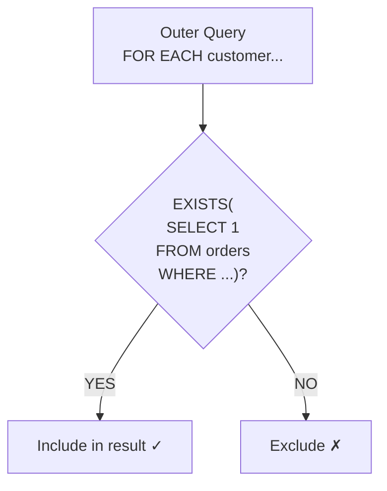

# Lesson 20: EXISTS and Correlated Subqueries

`EXISTS` tests whether a subquery returns any rows at all. Unlike `IN`, it stops as soon as it finds one matching row — making it efficient for large datasets and safe when NULLs might be present.



> EXISTS runs the subquery for each outer row and includes it if any result exists.

## EXISTS vs. IN

| Feature | `IN` | `EXISTS` |
|---------|------|---------|
| Returns | Matching values | True/False |
| NULL safety | Unsafe — `NOT IN` fails with NULLs | Safe |
| Short-circuit | No | Yes — stops at first match |
| Self-referencing | No | Yes — correlated |

## Basic EXISTS

{ .off-glb width="280"  }

```sql
-- Customers who have placed at least one order
SELECT id, name, grade
FROM customers AS c
WHERE EXISTS (
    SELECT 1
    FROM orders AS o
    WHERE o.customer_id = c.id
)
ORDER BY name
LIMIT 8;
```

The inner query references `c.id` from the outer query — this is a **correlated subquery**. It runs once per outer row, checking whether any matching order exists.

## NOT EXISTS — Finding Gaps

{ .off-glb width="280"  }

`NOT EXISTS` is the safe alternative to `NOT IN` when the subquery column might contain NULLs.

```sql
-- Customers who have NEVER placed an order (safer than NOT IN)
SELECT id, name, email, created_at
FROM customers AS c
WHERE NOT EXISTS (
    SELECT 1
    FROM orders AS o
    WHERE o.customer_id = c.id
)
ORDER BY created_at DESC
LIMIT 10;
```

**Result:**

| id   | name | email                | created_at          |
| ---: | ---- | -------------------- | ------------------- |
| 4933 | 윤예준  | user4933@testmail.kr | 2025-12-30 20:40:58 |
| 5222 | 유동현  | user5222@testmail.kr | 2025-12-30 10:18:14 |
| ...  | ...  | ...                  | ...                 |

```sql
-- Products in someone's wishlist that have NEVER been purchased
SELECT p.id, p.name, p.price
FROM products AS p
WHERE EXISTS (
    SELECT 1 FROM wishlists AS w WHERE w.product_id = p.id
)
AND NOT EXISTS (
    SELECT 1 FROM order_items AS oi WHERE oi.product_id = p.id
)
ORDER BY p.price DESC;
```

**Result:**

| id  | name                   | price  |
| --: | ---------------------- | -----: |
| 260 | 삼성 오디세이 OLED G8        | 693300 |
| 277 | ASRock X870E Taichi 실버 | 583500 |
| ... | ...                    | ...    |

## Correlated Subqueries for Conditional Logic

Correlated subqueries in `SELECT` can answer "does this row have a related record?" per row.

```sql
-- Show each customer with flags for order, review, and complaint history
SELECT
    c.id,
    c.name,
    c.grade,
    CASE WHEN EXISTS (SELECT 1 FROM orders     WHERE customer_id = c.id) THEN 'Yes' ELSE 'No' END AS has_orders,
    CASE WHEN EXISTS (SELECT 1 FROM reviews    WHERE customer_id = c.id) THEN 'Yes' ELSE 'No' END AS has_reviews,
    CASE WHEN EXISTS (SELECT 1 FROM complaints WHERE customer_id = c.id) THEN 'Yes' ELSE 'No' END AS has_complaints
FROM customers AS c
WHERE c.grade IN ('VIP', 'GOLD')
ORDER BY c.name
LIMIT 8;
```

**Result:**

| id | name | grade | has_orders | has_reviews | has_complaints |
|---:|------|-------|------------|-------------|----------------|
| 41 | Aaron Cross | GOLD | Yes | Yes | No |
| 88 | Alice Morgan | VIP | Yes | Yes | Yes |
| 102 | Amanda Foster | GOLD | Yes | No | No |
| ... | | | | | |

## EXISTS with Multiple Conditions

```sql
-- Customers who have BOTH an order in 2024 AND a complaint
SELECT c.id, c.name, c.grade
FROM customers AS c
WHERE EXISTS (
    SELECT 1
    FROM orders AS o
    WHERE o.customer_id = c.id
      AND o.ordered_at LIKE '2024%'
)
AND EXISTS (
    SELECT 1
    FROM complaints AS comp
    WHERE comp.customer_id = c.id
)
ORDER BY c.name;
```

## Using EXISTS in HAVING (via Aggregation)

```sql
-- Categories where at least one product has been reviewed 50+ times
SELECT
    cat.name    AS category,
    COUNT(p.id) AS product_count
FROM categories AS cat
INNER JOIN products AS p ON p.category_id = cat.id
GROUP BY cat.id, cat.name
HAVING EXISTS (
    SELECT 1
    FROM products  AS p2
    INNER JOIN reviews AS r ON r.product_id = p2.id
    WHERE p2.category_id = cat.id
    GROUP BY p2.id
    HAVING COUNT(r.id) >= 50
)
ORDER BY category;
```

!!! note "Lesson Review"
    Quick exercises to check your understanding of this lesson. For comprehensive practice combining multiple concepts, see the [Exercises](../exercises/index.md) section.

## Practice Exercises
### Exercise 1
Use `NOT EXISTS` as an anti-join to find orders that have a shipping record but have not yet been delivered (`delivered_at IS NULL`). Return `order_number`, `ordered_at`, `status`, `carrier`, and `shipped_at`.

??? success "Answer"
    ```sql
    SELECT
        o.order_number,
        o.ordered_at,
        o.status,
        s.carrier,
        s.shipped_at
    FROM orders AS o
    INNER JOIN shipping AS s ON s.order_id = o.id
    WHERE NOT EXISTS (
        SELECT 1
        FROM shipping AS s2
        WHERE s2.order_id = o.id
          AND s2.delivered_at IS NOT NULL
    )
    ORDER BY s.shipped_at DESC
    LIMIT 20;
    ```

    **Expected result:**

    | order_number       | ordered_at          | status  | carrier | shipped_at          |
    | ------------------ | ------------------- | ------- | ------- | ------------------- |
    | ORD-20250624-34824 | 2025-06-24 19:12:48 | shipped | 한진택배    | 2025-06-27 19:12:48 |
    | ORD-20250624-34828 | 2025-06-24 19:43:51 | shipped | CJ대한통운  | 2025-06-26 19:43:51 |
    | ORD-20250624-34826 | 2025-06-24 19:48:54 | shipped | 한진택배    | 2025-06-25 19:48:54 |
    | ORD-20250623-34821 | 2025-06-23 19:04:07 | shipped | 한진택배    | 2025-06-25 19:04:07 |
    | ORD-20250622-34810 | 2025-06-22 08:01:21 | shipped | 우체국택배   | 2025-06-25 08:01:21 |
    | ...                | ...                 | ...     | ...     | ...                 |


    **Expected result:**

    | order_number       | ordered_at          | status  | carrier | shipped_at          |
    | ------------------ | ------------------- | ------- | ------- | ------------------- |
    | ORD-20250624-34824 | 2025-06-24 19:12:48 | shipped | 한진택배    | 2025-06-27 19:12:48 |
    | ORD-20250624-34828 | 2025-06-24 19:43:51 | shipped | CJ대한통운  | 2025-06-26 19:43:51 |
    | ORD-20250624-34826 | 2025-06-24 19:48:54 | shipped | 한진택배    | 2025-06-25 19:48:54 |
    | ORD-20250623-34821 | 2025-06-23 19:04:07 | shipped | 한진택배    | 2025-06-25 19:04:07 |
    | ORD-20250622-34810 | 2025-06-22 08:01:21 | shipped | 우체국택배   | 2025-06-25 08:01:21 |
    | ...                | ...                 | ...     | ...     | ...                 |


### Exercise 2
Use `EXISTS` with correlated subqueries to find products that have received both a 5-star and a 1-star review. Return `product_id`, `product_name`, and `price`.

??? success "Answer"
    ```sql
    SELECT
        p.id    AS product_id,
        p.name  AS product_name,
        p.price
    FROM products AS p
    WHERE EXISTS (
        SELECT 1 FROM reviews WHERE product_id = p.id AND rating = 5
    )
    AND EXISTS (
        SELECT 1 FROM reviews WHERE product_id = p.id AND rating = 1
    )
    ORDER BY p.name;
    ```

    **Expected result:**

    | product_id | product_name                        | price  |
    | ---------: | ----------------------------------- | -----: |
    |         44 | AMD Ryzen 9 9900X                   | 244800 |
    |        171 | APC Back-UPS Pro Gaming BGM1500B 블랙 | 408800 |
    |        140 | ASRock B850M Pro RS 블랙              | 201900 |
    |         47 | ASRock B850M Pro RS 실버              | 533600 |
    |        164 | ASRock B850M Pro RS 화이트             | 426500 |
    | ...        | ...                                 | ...    |


    **Expected result:**

    | product_id | product_name                        | price  |
    | ---------: | ----------------------------------- | -----: |
    |         44 | AMD Ryzen 9 9900X                   | 244800 |
    |        171 | APC Back-UPS Pro Gaming BGM1500B 블랙 | 408800 |
    |        140 | ASRock B850M Pro RS 블랙              | 201900 |
    |         47 | ASRock B850M Pro RS 실버              | 533600 |
    |        164 | ASRock B850M Pro RS 화이트             | 426500 |
    | ...        | ...                                 | ...    |


### Exercise 3
Use correlated subqueries to show each staff member alongside their largest order. Return `staff_name`, `department`, `max_order_amount`, and `max_order_number` (the order number matching that highest amount).

??? success "Answer"
    ```sql
    SELECT
        s.name AS staff_name,
        s.department,
        (SELECT MAX(o.total_amount) FROM orders AS o WHERE o.staff_id = s.id) AS max_order_amount,
        (SELECT o.order_number FROM orders AS o
         WHERE o.staff_id = s.id
         ORDER BY o.total_amount DESC
         LIMIT 1) AS max_order_number
    FROM staff AS s
    WHERE EXISTS (
        SELECT 1 FROM orders WHERE staff_id = s.id
    )
    ORDER BY max_order_amount DESC
    LIMIT 15;
    ```


### Exercise 4
Use `NOT EXISTS` to find customers who have placed 5 or more orders but have never written a review. Return `customer_id`, `name`, `grade`, and `order_count`.

??? success "Answer"
    ```sql
    SELECT
        c.id AS customer_id,
        c.name,
        c.grade,
        (SELECT COUNT(*) FROM orders WHERE customer_id = c.id
            AND status NOT IN ('cancelled', 'returned')) AS order_count
    FROM customers AS c
    WHERE NOT EXISTS (
        SELECT 1 FROM reviews WHERE customer_id = c.id
    )
    AND (
        SELECT COUNT(*) FROM orders WHERE customer_id = c.id
            AND status NOT IN ('cancelled', 'returned')
    ) >= 5
    ORDER BY order_count DESC
    LIMIT 20;
    ```

    **Expected result:**

    | customer_id | name | grade  | order_count |
    | ----------: | ---- | ------ | ----------: |
    |        3132 | 이진호  | VIP    |          16 |
    |         380 | 김영환  | SILVER |          14 |
    |        2358 | 김민준  | SILVER |          14 |
    |         982 | 남성민  | BRONZE |          13 |
    |        1525 | 배민석  | BRONZE |          13 |
    | ...         | ...  | ...    | ...         |


    **Expected result:**

    | customer_id | name | grade  | order_count |
    | ----------: | ---- | ------ | ----------: |
    |        3132 | 이진호  | VIP    |          16 |
    |         380 | 김영환  | SILVER |          14 |
    |        2358 | 김민준  | SILVER |          14 |
    |         982 | 남성민  | BRONZE |          13 |
    |        1525 | 배민석  | BRONZE |          13 |
    | ...         | ...  | ...    | ...         |


### Exercise 5
Use `EXISTS` to find customers who have used every available payment method at least once. Return `customer_id` and `name`. Hint: use `NOT EXISTS` with `EXCEPT` to check that no payment method is missing.

??? success "Answer"
    ```sql
    SELECT c.id AS customer_id, c.name
    FROM customers AS c
    WHERE NOT EXISTS (
        SELECT DISTINCT p2.method
        FROM payments AS p2
        WHERE p2.status = 'completed'

        EXCEPT

        SELECT p.method
        FROM payments AS p
        INNER JOIN orders AS o ON p.order_id = o.id
        WHERE o.customer_id = c.id
          AND p.status = 'completed'
    )
    AND EXISTS (
        SELECT 1
        FROM orders AS o
        WHERE o.customer_id = c.id
    )
    ORDER BY c.name;
    ```

    **Expected result:**

    | customer_id | name |
    | ----------: | ---- |
    |        1492 | 강도윤  |
    |         162 | 강명자  |
    |        2129 | 강미숙  |
    |        1516 | 강민재  |
    |         912 | 강서현  |
    | ...         | ...  |


    **Expected result:**

    | customer_id | name |
    | ----------: | ---- |
    |        1492 | 강도윤  |
    |         162 | 강명자  |
    |        2129 | 강미숙  |
    |        1516 | 강민재  |
    |         912 | 강서현  |
    | ...         | ...  |


### Exercise 6
Combine `EXISTS` with an aggregate condition in `HAVING` to find categories that contain at least one product with an average review rating of 4.0 or higher. Return `category_name` and `product_count`.

??? success "Answer"
    ```sql
    SELECT
        cat.name AS category_name,
        COUNT(p.id) AS product_count
    FROM categories AS cat
    INNER JOIN products AS p ON p.category_id = cat.id
    WHERE p.is_active = 1
    GROUP BY cat.id, cat.name
    HAVING EXISTS (
        SELECT 1
        FROM products AS p2
        INNER JOIN reviews AS r ON r.product_id = p2.id
        WHERE p2.category_id = cat.id
        GROUP BY p2.id
        HAVING AVG(r.rating) >= 4.0
    )
    ORDER BY category_name;
    ```

    **Expected result:**

    | category_name | product_count |
    | ------------- | ------------: |
    | 2in1          |             7 |
    | AMD           |             6 |
    | AMD 소켓        |             9 |
    | DDR4          |             5 |
    | DDR5          |             8 |
    | ...           | ...           |


    **Expected result:**

    | category_name | product_count |
    | ------------- | ------------: |
    | 2in1          |             7 |
    | AMD           |             6 |
    | AMD 소켓        |             9 |
    | DDR4          |             5 |
    | DDR5          |             8 |
    | ...           | ...           |


### Exercise 7
Find all wishlist items where the product has **not yet been purchased** by that same customer. Return `customer_name`, `product_name`, and `added_at` (when the item was wishlisted). Use `NOT EXISTS` with a correlated subquery that checks `order_items` + `orders` for a matching `customer_id` and `product_id`.

??? success "Answer"
    ```sql
    SELECT
        c.name  AS customer_name,
        p.name  AS product_name,
        w.created_at
    FROM wishlists AS w
    INNER JOIN customers AS c ON w.customer_id = c.id
    INNER JOIN products  AS p ON w.product_id  = p.id
    WHERE NOT EXISTS (
        SELECT 1
        FROM order_items AS oi
        INNER JOIN orders AS o ON oi.order_id = o.id
        WHERE o.customer_id  = w.customer_id
          AND oi.product_id  = w.product_id
          AND o.status NOT IN ('cancelled', 'returned')
    )
    ORDER BY w.created_at DESC
    LIMIT 20;
    ```

    **Expected result:**

    | customer_name | product_name                                    | created_at          |
    | ------------- | ----------------------------------------------- | ------------------- |
    | 윤예준           | 엡손 L6290 블랙                                     | 2025-12-30 20:40:58 |
    | 나병철           | CORSAIR Dominator Titanium DDR5 32GB 7200MHz 실버 | 2025-12-30 05:21:30 |
    | 김영미           | MSI MEG Ai1300P PCIE5 화이트                       | 2025-12-28 09:52:47 |
    | 김민지           | APC Back-UPS Pro Gaming BGM1500B 블랙             | 2025-12-28 07:10:13 |
    | 김주원           | MSI MEG Z790 ACE 실버                             | 2025-12-26 17:47:03 |
    | ...           | ...                                             | ...                 |


    **Expected result:**

    | customer_name | product_name                                    | created_at          |
    | ------------- | ----------------------------------------------- | ------------------- |
    | 윤예준           | 엡손 L6290 블랙                                     | 2025-12-30 20:40:58 |
    | 나병철           | CORSAIR Dominator Titanium DDR5 32GB 7200MHz 실버 | 2025-12-30 05:21:30 |
    | 김영미           | MSI MEG Ai1300P PCIE5 화이트                       | 2025-12-28 09:52:47 |
    | 김민지           | APC Back-UPS Pro Gaming BGM1500B 블랙             | 2025-12-28 07:10:13 |
    | 김주원           | MSI MEG Z790 ACE 실버                             | 2025-12-26 17:47:03 |
    | ...           | ...                                             | ...                 |


### Exercise 8
Use `NOT EXISTS` to find products that every customer who ordered in 2024 has purchased. In other words, there is no 2024-ordering customer who has NOT bought this product. Return `product_id` and `product_name`.

??? success "Answer"
    ```sql
    SELECT p.id AS product_id, p.name AS product_name
    FROM products AS p
    WHERE NOT EXISTS (
        SELECT c.id
        FROM customers AS c
        WHERE EXISTS (
            SELECT 1 FROM orders AS o
            WHERE o.customer_id = c.id
              AND o.ordered_at LIKE '2024%'
              AND o.status NOT IN ('cancelled', 'returned')
        )
        AND NOT EXISTS (
            SELECT 1
            FROM order_items AS oi
            INNER JOIN orders AS o ON oi.order_id = o.id
            WHERE o.customer_id = c.id
              AND oi.product_id = p.id
              AND o.ordered_at LIKE '2024%'
              AND o.status NOT IN ('cancelled', 'returned')
        )
    )
    ORDER BY p.name;
    ```


### Exercise 9
Identify customers who have submitted a complaint AND have a return on record. Return `customer_id`, `name`, `grade`, `complaint_count`, and `return_count`. Use `EXISTS` for filtering, and subquery aggregation or joins for the counts.

??? success "Answer"
    ```sql
    SELECT
        c.id    AS customer_id,
        c.name,
        c.grade,
        (SELECT COUNT(*) FROM complaints WHERE customer_id = c.id) AS complaint_count,
        (SELECT COUNT(*) FROM orders AS o
                        INNER JOIN returns AS r ON r.order_id = o.id
                        WHERE o.customer_id = c.id)               AS return_count
    FROM customers AS c
    WHERE EXISTS (
        SELECT 1 FROM complaints WHERE customer_id = c.id
    )
    AND EXISTS (
        SELECT 1
        FROM orders AS o
        INNER JOIN returns AS r ON r.order_id = o.id
        WHERE o.customer_id = c.id
    )
    ORDER BY complaint_count DESC;
    ```

    **Expected result:**

    | customer_id | name | grade | complaint_count | return_count |
    | ----------: | ---- | ----- | --------------: | -----------: |
    |          98 | 이영자  | VIP   |              44 |           13 |
    |          97 | 김병철  | VIP   |              33 |            8 |
    |         227 | 김성민  | VIP   |              26 |            8 |
    |         549 | 이미정  | VIP   |              22 |           11 |
    |         226 | 박정수  | VIP   |              18 |            9 |
    | ...         | ...  | ...   | ...             | ...          |


    **Expected result:**

    | customer_id | name | grade | complaint_count | return_count |
    | ----------: | ---- | ----- | --------------: | -----------: |
    |          98 | 이영자  | VIP   |              44 |           13 |
    |          97 | 김병철  | VIP   |              33 |            8 |
    |         227 | 김성민  | VIP   |              26 |            8 |
    |         549 | 이미정  | VIP   |              22 |           11 |
    |         226 | 박정수  | VIP   |              18 |            9 |
    | ...         | ...  | ...   | ...             | ...          |


---
Next: [Lesson 21: Views](21-views.md)
