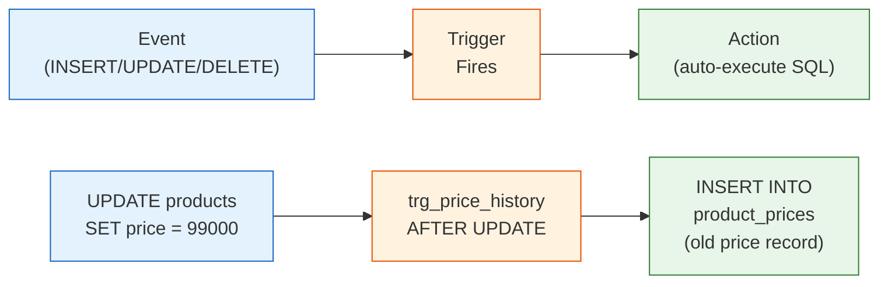

# Lesson 20: Triggers

A **trigger** is a database object that automatically executes a block of SQL in response to a data modification event (`INSERT`, `UPDATE`, or `DELETE`) on a specific table. Triggers enforce business rules, maintain audit trails, and keep derived data in sync — all without application code.



> A trigger automatically executes SQL when an event (INSERT/UPDATE/DELETE) occurs on a table.

Trigger syntax varies significantly across databases. SQLite has the simplest form, MySQL requires a `DELIMITER` change, and PostgreSQL requires a separate function before the trigger definition.

## Trigger Syntax

=== "SQLite"
    ```sql
    CREATE TRIGGER trigger_name
        BEFORE | AFTER | INSTEAD OF
        INSERT | UPDATE | DELETE
        ON table_name
        [WHEN condition]
    BEGIN
        -- SQL statements;
    END;
    ```

=== "MySQL"
    ```sql
    DELIMITER //
    CREATE TRIGGER trigger_name
        BEFORE | AFTER
        INSERT | UPDATE | DELETE
        ON table_name
        FOR EACH ROW
    BEGIN
        -- SQL statements;
    END //
    DELIMITER ;
    ```

=== "PostgreSQL"
    ```sql
    -- Step 1: Create a trigger function
    CREATE OR REPLACE FUNCTION trigger_function_name()
    RETURNS TRIGGER AS $$
    BEGIN
        -- SQL statements;
        RETURN NEW;  -- or RETURN OLD for DELETE triggers
    END;
    $$ LANGUAGE plpgsql;

    -- Step 2: Attach the function to a trigger
    CREATE TRIGGER trigger_name
        BEFORE | AFTER
        INSERT | UPDATE | DELETE
        ON table_name
        FOR EACH ROW
        EXECUTE FUNCTION trigger_function_name();
    ```

- `BEFORE` fires before the row is changed (use to validate or modify)
- `AFTER` fires after the row is changed (use for logging and cascades)
- `NEW` refers to the row being inserted or the new values in an update
- `OLD` refers to the row being deleted or the old values in an update

## TechShop's Built-in Triggers

The database ships with 5 pre-built triggers. Examine them:

```sql
-- List all triggers
SELECT name, tbl_name, sql
FROM sqlite_master
WHERE type = 'trigger'
ORDER BY name;
```

| Trigger | Table | Fires On | Purpose |
|---------|-------|----------|---------|
| `trg_update_product_timestamp` | products | AFTER UPDATE | Sets `updated_at = datetime('now')` automatically |
| `trg_update_customer_timestamp` | customers | AFTER UPDATE | Sets `updated_at = datetime('now')` automatically |
| `trg_earn_points_on_order` | orders | AFTER INSERT | Credits loyalty points when a new order is inserted |
| `trg_adjust_stock_on_order` | order_items | AFTER INSERT | Decrements `products.stock_qty` when an item is ordered |
| `trg_restore_stock_on_cancel` | orders | AFTER UPDATE | Restores `products.stock_qty` when an order is cancelled |

## Inspecting a Trigger's Definition

```sql
-- Read the full SQL of a specific trigger
SELECT sql
FROM sqlite_master
WHERE type = 'trigger'
  AND name = 'trg_adjust_stock_on_order';
```

**Result:**

```sql
CREATE TRIGGER trg_adjust_stock_on_order
AFTER INSERT ON order_items
BEGIN
    UPDATE products
    SET stock_qty  = stock_qty - NEW.quantity,
        updated_at = datetime('now')
    WHERE id = NEW.product_id;
END
```

Every time a row is inserted into `order_items`, this trigger automatically decrements the corresponding product's stock.

```sql
-- Examine the points trigger
SELECT sql
FROM sqlite_master
WHERE type = 'trigger'
  AND name = 'trg_earn_points_on_order';
```

**Result:**

```sql
CREATE TRIGGER trg_earn_points_on_order
AFTER INSERT ON orders
BEGIN
    UPDATE customers
    SET point_balance = point_balance + NEW.point_earned,
        updated_at    = datetime('now')
    WHERE id = NEW.customer_id;
END
```

## Verifying Trigger Behavior

You can confirm a trigger works by observing the before/after state:

```sql
-- Check current stock for product 5
SELECT id, name, stock_qty FROM products WHERE id = 5;
-- Result: stock_qty = 42

-- Insert an order item (trigger fires automatically)
INSERT INTO order_items (order_id, product_id, quantity, unit_price, total_price)
VALUES (99999, 5, 3, 99.99, 299.97);

-- Check stock again — should be 42 - 3 = 39
SELECT id, name, stock_qty FROM products WHERE id = 5;
-- Result: stock_qty = 39
```

## Writing a New Trigger

=== "SQLite"
    ```sql
    -- Audit table for price changes
    CREATE TABLE IF NOT EXISTS price_change_log (
        id          INTEGER PRIMARY KEY AUTOINCREMENT,
        product_id  INTEGER,
        old_price   REAL,
        new_price   REAL,
        changed_at  TEXT DEFAULT (datetime('now'))
    );

    -- Trigger
    CREATE TRIGGER IF NOT EXISTS trg_log_price_change
    AFTER UPDATE OF price ON products
    WHEN OLD.price <> NEW.price
    BEGIN
        INSERT INTO price_change_log (product_id, old_price, new_price)
        VALUES (NEW.id, OLD.price, NEW.price);
    END;
    ```

=== "MySQL"
    ```sql
    -- Audit table for price changes
    CREATE TABLE IF NOT EXISTS price_change_log (
        id          INT AUTO_INCREMENT PRIMARY KEY,
        product_id  INT,
        old_price   DECIMAL(10,2),
        new_price   DECIMAL(10,2),
        changed_at  DATETIME DEFAULT NOW()
    );

    -- Trigger
    DELIMITER //
    CREATE TRIGGER trg_log_price_change
    AFTER UPDATE ON products
    FOR EACH ROW
    BEGIN
        IF OLD.price <> NEW.price THEN
            INSERT INTO price_change_log (product_id, old_price, new_price)
            VALUES (NEW.id, OLD.price, NEW.price);
        END IF;
    END //
    DELIMITER ;
    ```

=== "PostgreSQL"
    ```sql
    -- Audit table for price changes
    CREATE TABLE IF NOT EXISTS price_change_log (
        id          SERIAL PRIMARY KEY,
        product_id  INTEGER,
        old_price   NUMERIC(10,2),
        new_price   NUMERIC(10,2),
        changed_at  TIMESTAMP DEFAULT NOW()
    );

    -- Trigger function
    CREATE OR REPLACE FUNCTION fn_log_price_change()
    RETURNS TRIGGER AS $$
    BEGIN
        IF OLD.price <> NEW.price THEN
            INSERT INTO price_change_log (product_id, old_price, new_price)
            VALUES (NEW.id, OLD.price, NEW.price);
        END IF;
        RETURN NEW;
    END;
    $$ LANGUAGE plpgsql;

    -- Trigger
    CREATE TRIGGER trg_log_price_change
    AFTER UPDATE OF price ON products
    FOR EACH ROW
    EXECUTE FUNCTION fn_log_price_change();
    ```

Now every price update is automatically recorded:

```sql
UPDATE products SET price = 1349.99 WHERE id = 1;

SELECT * FROM price_change_log;
-- product_id=1, old_price=1299.99, new_price=1349.99
```

## Dropping a Trigger

```sql
DROP TRIGGER IF EXISTS trg_log_price_change;
DROP TABLE IF EXISTS price_change_log;
```

## When to Use Triggers

| Good use | Avoid |
|----------|-------|
| Audit logging | Complex business logic (hard to debug) |
| Maintaining `updated_at` timestamps | Triggers that call other triggers excessively |
| Cascading derived data (stock, points) | Replacing application-level validation |
| Enforcing denormalized summaries | Performance-critical write paths |

!!! note "Lesson Review"
    Quick exercises to check your understanding of this lesson. For comprehensive practice combining multiple concepts, see the [Exercises](../exercises/) section.

## Practice Exercises

### Exercise 1
List all 5 built-in triggers using `sqlite_master`. For each trigger, show `name`, `tbl_name`, and whether it fires on `INSERT`, `UPDATE`, or `DELETE` (extract this from the `sql` column using `CASE` with `LIKE`).

??? success "Answer"
    ```sql
    SELECT
        name,
        tbl_name,
        CASE
            WHEN sql LIKE '%AFTER INSERT%'  THEN 'AFTER INSERT'
            WHEN sql LIKE '%AFTER UPDATE%'  THEN 'AFTER UPDATE'
            WHEN sql LIKE '%AFTER DELETE%'  THEN 'AFTER DELETE'
            WHEN sql LIKE '%BEFORE INSERT%' THEN 'BEFORE INSERT'
            WHEN sql LIKE '%BEFORE UPDATE%' THEN 'BEFORE UPDATE'
            WHEN sql LIKE '%BEFORE DELETE%' THEN 'BEFORE DELETE'
        END AS fires_on
    FROM sqlite_master
    WHERE type = 'trigger'
    ORDER BY name;
    ```

### Exercise 2
Study the `trg_restore_stock_on_cancel` trigger by running `SELECT sql FROM sqlite_master WHERE name = 'trg_restore_stock_on_cancel'`. Then verify its logic by querying the stock of any product that appears in a cancelled order — confirm the stock was restored when the cancellation happened.

??? success "Answer"
    ```sql
    -- Step 1: See the trigger definition
    SELECT sql
    FROM sqlite_master
    WHERE type = 'trigger'
      AND name = 'trg_restore_stock_on_cancel';

    -- Step 2: Find a cancelled order with order items
    SELECT o.id AS order_id, oi.product_id, oi.quantity, p.stock_qty
    FROM orders AS o
    INNER JOIN order_items AS oi ON oi.order_id = o.id
    INNER JOIN products    AS p  ON p.id = oi.product_id
    WHERE o.status = 'cancelled'
    LIMIT 5;
    -- The stock_qty should already reflect the restored quantity
    ```

---

You have completed the tutorial series. Ready for a challenge?

Next: [Sales Analysis Exercises](../exercises/advanced-01-sales-analysis.md)
