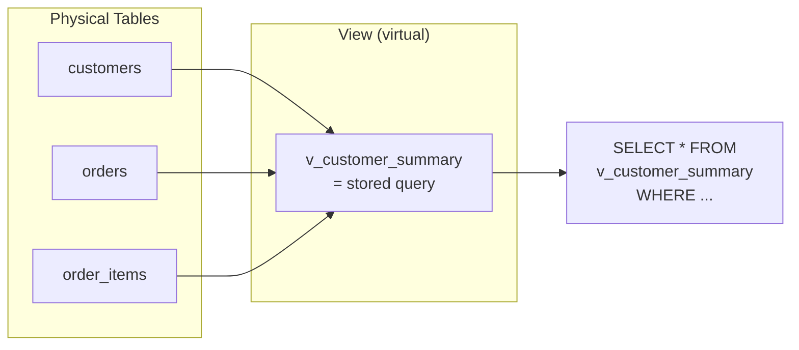

# Lesson 20: Views

A **view** is a saved query stored in the database as a named object. Querying a view feels identical to querying a table, but the underlying SQL runs each time. Views simplify complex queries, enforce consistent business logic, and provide a security layer by hiding raw table details.



> A view is a stored query. It's not a physical table — data is fetched from source tables every time.

## Creating a View

```sql
CREATE VIEW view_name AS
SELECT ...;
```

Once created, query it like a table:

```sql
SELECT * FROM view_name WHERE ...;
```

## TechShop's Built-in Views

The TechShop database ships with 18 pre-built views. Explore them:

=== "SQLite"
    ```sql
    -- List all views in the database
    SELECT name, sql
    FROM sqlite_master
    WHERE type = 'view'
    ORDER BY name;
    ```

=== "MySQL"
    ```sql
    -- List all views in the database
    SELECT TABLE_NAME, VIEW_DEFINITION
    FROM INFORMATION_SCHEMA.VIEWS
    WHERE TABLE_SCHEMA = DATABASE()
    ORDER BY TABLE_NAME;
    ```

=== "PostgreSQL"
    ```sql
    -- List all views in the database
    SELECT viewname, definition
    FROM pg_views
    WHERE schemaname = 'public'
    ORDER BY viewname;
    ```

Here are some highlights:

| View | Description |
|------|-------------|
| `v_order_summary` | Orders with customer name and payment method |
| `v_product_sales` | Products with units sold, revenue, and review stats |
| `v_customer_stats` | Per-customer order count, LTV, and average order value |
| `v_monthly_revenue` | Monthly revenue and order counts |
| `v_category_performance` | Revenue and units sold per category |
| `v_top_customers` | Top 100 customers by lifetime value |
| `v_inventory_status` | Products with stock level classification |
| `v_shipping_performance` | Average delivery times per carrier |

## Querying Views

```sql
-- Use v_order_summary just like a table
SELECT customer_name, order_number, total_amount, payment_method
FROM v_order_summary
WHERE order_status = 'confirmed'
  AND ordered_at LIKE '2024-12%'
ORDER BY total_amount DESC
LIMIT 5;
```

**Result:**

| customer_name | order_number | total_amount | payment_method |
|---------------|--------------|-------------:|----------------|
| Jennifer Martinez | ORD-20241231-09842 | 2349.00 | card |
| Robert Kim | ORD-20241228-09831 | 1899.00 | card |
| Alice Ward | ORD-20241226-09820 | 1299.99 | kakao_pay |
| ... | | | |

```sql
-- Monthly revenue trend using the built-in view
SELECT year_month, revenue, order_count
FROM v_monthly_revenue
WHERE year_month BETWEEN '2022-01' AND '2024-12'
ORDER BY year_month;
```

```sql
-- Inventory status from the view
SELECT product_name, price, stock_qty, stock_status
FROM v_inventory_status
WHERE stock_status IN ('Out of Stock', 'Low Stock')
ORDER BY stock_qty ASC;
```

## Examining a View's Definition

Use the system catalog to inspect the SQL behind any view:

=== "SQLite"
    ```sql
    -- See the SQL that defines v_product_sales
    SELECT sql
    FROM sqlite_master
    WHERE type = 'view'
      AND name = 'v_product_sales';
    ```

=== "MySQL"
    ```sql
    -- See the SQL that defines v_product_sales
    SELECT VIEW_DEFINITION
    FROM INFORMATION_SCHEMA.VIEWS
    WHERE TABLE_SCHEMA = DATABASE()
      AND TABLE_NAME = 'v_product_sales';
    ```

=== "PostgreSQL"
    ```sql
    -- See the SQL that defines v_product_sales
    SELECT definition
    FROM pg_views
    WHERE schemaname = 'public'
      AND viewname = 'v_product_sales';
    ```

**Result (abridged):**

```sql
CREATE VIEW v_product_sales AS
SELECT
    p.id            AS product_id,
    p.name          AS product_name,
    cat.name        AS category,
    p.price,
    COALESCE(SUM(oi.quantity), 0)             AS units_sold,
    COALESCE(SUM(oi.quantity * oi.unit_price), 0) AS total_revenue,
    COUNT(DISTINCT r.id)                      AS review_count,
    ROUND(AVG(r.rating), 2)                   AS avg_rating
FROM products AS p
INNER JOIN categories AS cat ON p.category_id = cat.id
LEFT  JOIN order_items AS oi ON oi.product_id = p.id
LEFT  JOIN reviews     AS r  ON r.product_id  = p.id
GROUP BY p.id, p.name, cat.name, p.price
```

## Building Views on Top of Views

```sql
-- You can filter a view just like any table
SELECT *
FROM v_customer_stats
WHERE order_count >= 10
  AND avg_order_value > 500
ORDER BY lifetime_value DESC
LIMIT 10;
```

## Creating Your Own View

```sql
-- A view for the customer service dashboard
CREATE VIEW v_cs_watchlist AS
SELECT
    c.id            AS customer_id,
    c.name,
    c.email,
    c.grade,
    COUNT(DISTINCT comp.id)  AS open_complaints,
    COUNT(DISTINCT r.id)     AS pending_returns,
    MAX(o.ordered_at)        AS last_order_date
FROM customers AS c
LEFT JOIN complaints AS comp ON comp.customer_id = c.id
    AND comp.status = 'open'
LEFT JOIN orders AS o ON o.customer_id = c.id
LEFT JOIN returns AS r ON r.order_id = o.id
    AND r.status = 'pending'
GROUP BY c.id, c.name, c.email, c.grade
HAVING open_complaints > 0 OR pending_returns > 0;
```

## Dropping a View

```sql
DROP VIEW IF EXISTS v_cs_watchlist;
```

!!! note "Lesson Review"
    Quick exercises to check your understanding of this lesson. For comprehensive practice combining multiple concepts, see the [Exercises](../exercises/index.md) section.

## Practice Exercises

### Exercise 1
Query `v_product_sales` to find the top 10 products by `total_revenue`. Return `product_name`, `category`, `units_sold`, `total_revenue`, and `avg_rating`. Filter for products with at least 5 reviews.

??? success "Answer"
    ```sql
    SELECT
        product_name,
        category,
        units_sold,
        total_revenue,
        avg_rating
    FROM v_product_sales
    WHERE review_count >= 5
    ORDER BY total_revenue DESC
    LIMIT 10;
    ```

### Exercise 2
Use the system catalog to list all 18 views alphabetically. For each view, show only the name. Then pick one view that interests you and inspect its definition.

??? success "Answer"
    === "SQLite"
        ```sql
        -- Step 1: list all views
        SELECT name
        FROM sqlite_master
        WHERE type = 'view'
        ORDER BY name;

        -- Step 2: inspect a specific view (example: v_monthly_revenue)
        SELECT sql
        FROM sqlite_master
        WHERE type = 'view'
          AND name = 'v_monthly_revenue';
        ```

    === "MySQL"
        ```sql
        -- Step 1: list all views
        SELECT TABLE_NAME
        FROM INFORMATION_SCHEMA.VIEWS
        WHERE TABLE_SCHEMA = DATABASE()
        ORDER BY TABLE_NAME;

        -- Step 2: inspect a specific view (example: v_monthly_revenue)
        SELECT VIEW_DEFINITION
        FROM INFORMATION_SCHEMA.VIEWS
        WHERE TABLE_SCHEMA = DATABASE()
          AND TABLE_NAME = 'v_monthly_revenue';
        ```

    === "PostgreSQL"
        ```sql
        -- Step 1: list all views
        SELECT viewname
        FROM pg_views
        WHERE schemaname = 'public'
        ORDER BY viewname;

        -- Step 2: inspect a specific view (example: v_monthly_revenue)
        SELECT definition
        FROM pg_views
        WHERE schemaname = 'public'
          AND viewname = 'v_monthly_revenue';
        ```

### Exercise 3
Query `v_customer_stats` to find customers who placed 5 or more orders and have an average order value of 300 or above. Sort by `lifetime_value` descending.

??? success "Answer"
    ```sql
    SELECT *
    FROM v_customer_stats
    WHERE order_count >= 5
      AND avg_order_value >= 300
    ORDER BY lifetime_value DESC;
    ```

### Exercise 4
Drop the `v_cs_watchlist` view. Write the statement so that it does not raise an error if the view does not exist.

??? success "Answer"
    ```sql
    DROP VIEW IF EXISTS v_cs_watchlist;
    ```

### Exercise 5
Create a view called `v_product_total_sales` that joins `products` and `order_items` to calculate total quantity sold (`total_qty`) and total sales amount (`total_sales`) per product. Include `product_id`, `product_name`, `total_qty`, and `total_sales`.

??? success "Answer"
    ```sql
    CREATE VIEW v_product_total_sales AS
    SELECT
        p.id          AS product_id,
        p.name        AS product_name,
        COALESCE(SUM(oi.quantity), 0)              AS total_qty,
        COALESCE(SUM(oi.quantity * oi.unit_price), 0) AS total_sales
    FROM products AS p
    LEFT JOIN order_items AS oi ON oi.product_id = p.id
    GROUP BY p.id, p.name;
    ```

### Exercise 6
Modify the existing `v_product_total_sales` view to add a `category_name` column by joining the `categories` table. Note that SQLite does not support `CREATE OR REPLACE VIEW`, so the approach differs by database.

??? success "Answer"
    === "SQLite"
        ```sql
        -- SQLite: DROP then re-create
        DROP VIEW IF EXISTS v_product_total_sales;

        CREATE VIEW v_product_total_sales AS
        SELECT
            p.id          AS product_id,
            p.name        AS product_name,
            c.name        AS category_name,
            COALESCE(SUM(oi.quantity), 0)              AS total_qty,
            COALESCE(SUM(oi.quantity * oi.unit_price), 0) AS total_sales
        FROM products AS p
        INNER JOIN categories AS c ON c.id = p.category_id
        LEFT JOIN order_items AS oi ON oi.product_id = p.id
        GROUP BY p.id, p.name, c.name;
        ```

    === "MySQL"
        ```sql
        -- MySQL: CREATE OR REPLACE supported
        CREATE OR REPLACE VIEW v_product_total_sales AS
        SELECT
            p.id          AS product_id,
            p.name        AS product_name,
            c.name        AS category_name,
            COALESCE(SUM(oi.quantity), 0)              AS total_qty,
            COALESCE(SUM(oi.quantity * oi.unit_price), 0) AS total_sales
        FROM products AS p
        INNER JOIN categories AS c ON c.id = p.category_id
        LEFT JOIN order_items AS oi ON oi.product_id = p.id
        GROUP BY p.id, p.name, c.name;
        ```

    === "PostgreSQL"
        ```sql
        -- PostgreSQL: CREATE OR REPLACE supported
        CREATE OR REPLACE VIEW v_product_total_sales AS
        SELECT
            p.id          AS product_id,
            p.name        AS product_name,
            c.name        AS category_name,
            COALESCE(SUM(oi.quantity), 0)              AS total_qty,
            COALESCE(SUM(oi.quantity * oi.unit_price), 0) AS total_sales
        FROM products AS p
        INNER JOIN categories AS c ON c.id = p.category_id
        LEFT JOIN order_items AS oi ON oi.product_id = p.id
        GROUP BY p.id, p.name, c.name;
        ```

### Exercise 7
Create a view `v_category_monthly_revenue` that aggregates monthly revenue by category. Include `category_name`, `year_month` (based on order date, 'YYYY-MM' format), `revenue`, and `order_count`.

??? success "Answer"
    === "SQLite"
        ```sql
        CREATE VIEW v_category_monthly_revenue AS
        SELECT
            c.name                                  AS category_name,
            STRFTIME('%Y-%m', o.ordered_at)         AS year_month,
            SUM(oi.quantity * oi.unit_price)         AS revenue,
            COUNT(DISTINCT o.id)                     AS order_count
        FROM categories AS c
        INNER JOIN products    AS p  ON p.category_id = c.id
        INNER JOIN order_items AS oi ON oi.product_id = p.id
        INNER JOIN orders      AS o  ON o.id = oi.order_id
        GROUP BY c.name, STRFTIME('%Y-%m', o.ordered_at);
        ```

    === "MySQL"
        ```sql
        CREATE VIEW v_category_monthly_revenue AS
        SELECT
            c.name                                  AS category_name,
            DATE_FORMAT(o.ordered_at, '%Y-%m')      AS year_month,
            SUM(oi.quantity * oi.unit_price)         AS revenue,
            COUNT(DISTINCT o.id)                     AS order_count
        FROM categories AS c
        INNER JOIN products    AS p  ON p.category_id = c.id
        INNER JOIN order_items AS oi ON oi.product_id = p.id
        INNER JOIN orders      AS o  ON o.id = oi.order_id
        GROUP BY c.name, DATE_FORMAT(o.ordered_at, '%Y-%m');
        ```

    === "PostgreSQL"
        ```sql
        CREATE VIEW v_category_monthly_revenue AS
        SELECT
            c.name                                  AS category_name,
            TO_CHAR(o.ordered_at, 'YYYY-MM')        AS year_month,
            SUM(oi.quantity * oi.unit_price)         AS revenue,
            COUNT(DISTINCT o.id)                     AS order_count
        FROM categories AS c
        INNER JOIN products    AS p  ON p.category_id = c.id
        INNER JOIN order_items AS oi ON oi.product_id = p.id
        INNER JOIN orders      AS o  ON o.id = oi.order_id
        GROUP BY c.name, TO_CHAR(o.ordered_at, 'YYYY-MM');
        ```

### Exercise 8
Query `v_shipping_performance` to find the carrier with the longest average delivery time. Then use the system catalog to inspect the view's definition and identify which tables and columns it uses.

??? success "Answer"
    === "SQLite"
        ```sql
        -- Step 1: carrier with longest average delivery time
        SELECT *
        FROM v_shipping_performance
        ORDER BY avg_delivery_days DESC
        LIMIT 1;

        -- Step 2: inspect the view definition
        SELECT sql
        FROM sqlite_master
        WHERE type = 'view'
          AND name = 'v_shipping_performance';
        ```

    === "MySQL"
        ```sql
        -- Step 1: carrier with longest average delivery time
        SELECT *
        FROM v_shipping_performance
        ORDER BY avg_delivery_days DESC
        LIMIT 1;

        -- Step 2: inspect the view definition
        SELECT VIEW_DEFINITION
        FROM INFORMATION_SCHEMA.VIEWS
        WHERE TABLE_SCHEMA = DATABASE()
          AND TABLE_NAME = 'v_shipping_performance';
        ```

    === "PostgreSQL"
        ```sql
        -- Step 1: carrier with longest average delivery time
        SELECT *
        FROM v_shipping_performance
        ORDER BY avg_delivery_days DESC
        LIMIT 1;

        -- Step 2: inspect the view definition
        SELECT definition
        FROM pg_views
        WHERE schemaname = 'public'
          AND viewname = 'v_shipping_performance';
        ```

### Exercise 9
Drop all the views you created in exercises 5 through 7.

??? success "Answer"
    ```sql
    DROP VIEW IF EXISTS v_product_total_sales;
    DROP VIEW IF EXISTS v_category_monthly_revenue;
    ```

---
Next: [Lesson 21: Indexes and Query Planning](21-indexes.md)
