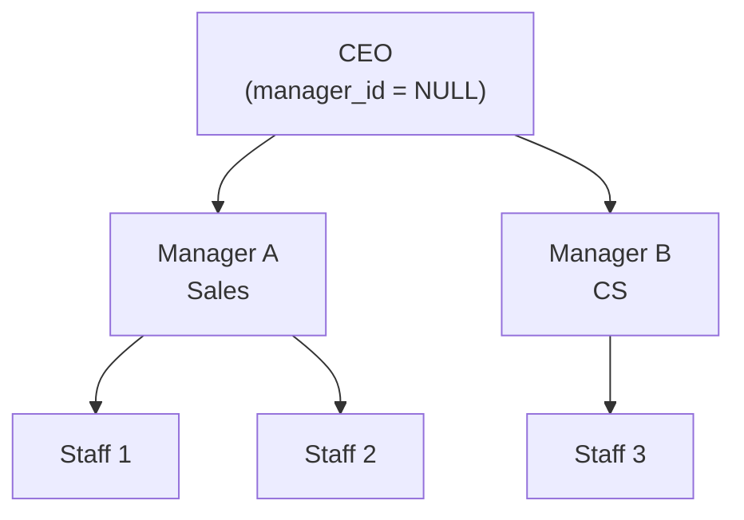

# Lesson 21: SELF JOIN and CROSS JOIN

In [Lessons 8-9](../intermediate/08-inner-join.md), we connected different tables using INNER JOIN and LEFT JOIN. Now we will learn two special JOINs. SELF JOIN connects a table to itself (manager-employee relationships), and CROSS JOIN creates all combinations (dates x categories).

!!! note "Already familiar?"
    If you are comfortable with SELF JOIN and CROSS JOIN, skip ahead to [Lesson 22: Views](22-views.md).



> A Self-JOIN joins a table to itself. The manager_id in the staff table can represent an organization chart.

**Common real-world scenarios for SELF JOIN and CROSS JOIN:**

- **Hierarchical relationships:** Manager-employee, category parent-child (SELF JOIN)
- **Pair comparison:** Analyzing product/customer pairs under same conditions (SELF JOIN + id < id)
- **Complete matrix:** Month x category, grade x payment method reports with no gaps (CROSS JOIN)
- **Ratio calculation:** Attach grand total to every row via CROSS JOIN for % calculation

## SELF JOIN — Joining a Table to Itself

SELF JOIN is not special syntax. Simply JOIN the same table with different aliases.

### Querying Category Hierarchy

The `categories` table references itself via `parent_id`. A SELF JOIN can expand the parent-child relationship.

```sql
-- 카테고리의 부모-자식 관계 조회
SELECT
    child.id,
    child.name       AS category,
    child.depth,
    parent.name      AS parent_category
FROM categories AS child
LEFT JOIN categories AS parent ON child.parent_id = parent.id
ORDER BY child.depth, child.sort_order;
```

**Result (example):**

| id | category | depth | parent_category |
| -: | -------- | ----: | --------------- |
|  1 | 데스크톱 PC  |     0 | (NULL)          |
|  5 | 노트북      |     0 | (NULL)          |
| 10 | 모니터      |     0 | (NULL)          |
| 14 | CPU      |     0 | (NULL)          |
| 17 | 메인보드     |     0 | (NULL)          |
| 20 | 메모리(RAM) |     0 | (NULL)          |
| ... | ...      | ...   | ...             |

Top-level categories (`depth=0`) have NULL `parent_id`, so `parent_category` is also NULL. `LEFT JOIN` is used to include these rows in the results.

### Building Top-Sub Category Paths

A SELF JOIN can build the full path from parent (top category) to child (sub category).

=== "SQLite / PostgreSQL"
    ```sql
    SELECT
        parent.name AS top_category,
        child.name  AS sub_category,
        parent.name || ' > ' || child.name AS full_path
    FROM categories AS child
    INNER JOIN categories AS parent ON child.parent_id = parent.id
    WHERE child.depth = 1
    ORDER BY parent.sort_order, child.sort_order;
    ```

=== "MySQL"
    ```sql
    SELECT
        parent.name AS top_category,
        child.name  AS sub_category,
        CONCAT(parent.name, ' > ', child.name) AS full_path
    FROM categories AS child
    INNER JOIN categories AS parent ON child.parent_id = parent.id
    WHERE child.depth = 1
    ORDER BY parent.sort_order, child.sort_order;
    ```

**Result (example):**

| top_category | sub_category | full_path |
|--------------|--------------|-----------|
| 데스크톱 PC | 완제품 | 데스크톱 PC > 완제품 |
| 데스크톱 PC | 조립PC | 데스크톱 PC > 조립PC |
| 노트북 | 일반 노트북 | 노트북 > 일반 노트북 |
| 노트북 | 게이밍 노트북 | 노트북 > 게이밍 노트북 |
| ... | | |

> **Tip:** SELF JOIN is concise when the hierarchy depth is fixed. For variable depth, use recursive CTEs from Lesson 19.

### Comparing Products Within the Same Category

To compare prices between products in the same category, JOIN the `products` table to itself.

```sql
-- 같은 카테고리에서 가격 차이가 가장 큰 상품 쌍 찾기
SELECT
    p1.name AS product_a,
    p2.name AS product_b,
    p1.price AS price_a,
    p2.price AS price_b,
    ABS(p1.price - p2.price) AS price_diff
FROM products AS p1
INNER JOIN products AS p2
    ON p1.category_id = p2.category_id
   AND p1.id < p2.id  -- 중복 쌍 방지 (A-B만, B-A는 제외)
ORDER BY price_diff DESC
LIMIT 10;
```

The `p1.id < p2.id` condition is key. Without it, both (A, B) and (B, A) would appear, and (A, A) self-pairs would be included.

### Employee Organization Chart (staff.manager_id)

The `staff` table's `manager_id` references `id` in the same table. You can query the employee-manager relationship.

```sql
SELECT
    s.name AS employee,
    s.department,
    s.role,
    m.name AS manager
FROM staff s
LEFT JOIN staff m ON s.manager_id = m.id
ORDER BY s.id;
```

### Product Succession (products.successor_id)

Query discontinued products and their successor models.

```sql
SELECT
    old.name AS discontinued_product,
    old.discontinued_at,
    new.name AS successor_product,
    new.price AS new_price
FROM products old
JOIN products new ON old.successor_id = new.id
WHERE old.successor_id IS NOT NULL
ORDER BY old.discontinued_at;
```

### Product Q&A Thread (product_qna.parent_id)

Display questions and answers on a single row.

```sql
SELECT
    q.id AS question_id,
    q.content AS question,
    a.content AS answer,
    a.created_at AS answered_at
FROM product_qna q
LEFT JOIN product_qna a ON a.parent_id = q.id
WHERE q.parent_id IS NULL  -- top-level questions only
ORDER BY q.created_at DESC
LIMIT 10;
```

---

## CROSS JOIN — Generating All Combinations

{ .off-glb width="440"  }

`CROSS JOIN` combines every row from the left table with every row from the right table. Result rows = left rows x right rows. There is no ON condition.

### Month-Category Matrix

When a revenue report needs to show "months with no data," first create an empty frame with CROSS JOIN, then LEFT JOIN actual data.

=== "SQLite"
    ```sql
    -- 2024 12 months x top-level category matrix
    WITH months AS (
        SELECT '2024-01' AS m UNION ALL SELECT '2024-02'
        UNION ALL SELECT '2024-03' UNION ALL SELECT '2024-04'
        UNION ALL SELECT '2024-05' UNION ALL SELECT '2024-06'
        UNION ALL SELECT '2024-07' UNION ALL SELECT '2024-08'
        UNION ALL SELECT '2024-09' UNION ALL SELECT '2024-10'
        UNION ALL SELECT '2024-11' UNION ALL SELECT '2024-12'
    ),
    top_categories AS (
        SELECT id, name FROM categories WHERE depth = 0
    ),
    monthly_sales AS (
        SELECT
            SUBSTR(o.ordered_at, 1, 7) AS year_month,
            COALESCE(parent.id, cat.id) AS category_id,
            ROUND(SUM(oi.quantity * oi.unit_price), 2) AS revenue
        FROM order_items AS oi
        INNER JOIN orders     AS o      ON oi.order_id   = o.id
        INNER JOIN products   AS p      ON oi.product_id = p.id
        INNER JOIN categories AS cat    ON p.category_id = cat.id
        LEFT  JOIN categories AS parent ON cat.parent_id = parent.id
        WHERE o.ordered_at LIKE '2024%'
          AND o.status NOT IN ('cancelled', 'returned', 'return_requested')
        GROUP BY SUBSTR(o.ordered_at, 1, 7), COALESCE(parent.id, cat.id)
    )
    SELECT
        m.m AS year_month,
        tc.name AS category,
        COALESCE(ms.revenue, 0) AS revenue
    FROM months AS m
    CROSS JOIN top_categories AS tc
    LEFT JOIN monthly_sales AS ms
        ON m.m = ms.year_month AND tc.id = ms.category_id
    ORDER BY m.m, tc.name;
    ```

=== "MySQL"
    ```sql
    WITH months AS (
        SELECT '2024-01' AS m UNION ALL SELECT '2024-02'
        UNION ALL SELECT '2024-03' UNION ALL SELECT '2024-04'
        UNION ALL SELECT '2024-05' UNION ALL SELECT '2024-06'
        UNION ALL SELECT '2024-07' UNION ALL SELECT '2024-08'
        UNION ALL SELECT '2024-09' UNION ALL SELECT '2024-10'
        UNION ALL SELECT '2024-11' UNION ALL SELECT '2024-12'
    ),
    top_categories AS (
        SELECT id, name FROM categories WHERE depth = 0
    ),
    monthly_sales AS (
        SELECT
            DATE_FORMAT(o.ordered_at, '%Y-%m') AS year_month,
            COALESCE(parent.id, cat.id) AS category_id,
            ROUND(SUM(oi.quantity * oi.unit_price), 2) AS revenue
        FROM order_items AS oi
        INNER JOIN orders     AS o      ON oi.order_id   = o.id
        INNER JOIN products   AS p      ON oi.product_id = p.id
        INNER JOIN categories AS cat    ON p.category_id = cat.id
        LEFT  JOIN categories AS parent ON cat.parent_id = parent.id
        WHERE o.ordered_at >= '2024-01-01'
          AND o.ordered_at <  '2025-01-01'
          AND o.status NOT IN ('cancelled', 'returned', 'return_requested')
        GROUP BY DATE_FORMAT(o.ordered_at, '%Y-%m'), COALESCE(parent.id, cat.id)
    )
    SELECT
        m.m AS year_month,
        tc.name AS category,
        COALESCE(ms.revenue, 0) AS revenue
    FROM months AS m
    CROSS JOIN top_categories AS tc
    LEFT JOIN monthly_sales AS ms
        ON m.m = ms.year_month AND tc.id = ms.category_id
    ORDER BY m.m, tc.name;
    ```

=== "PostgreSQL"
    ```sql
    WITH months AS (
        SELECT '2024-01' AS m UNION ALL SELECT '2024-02'
        UNION ALL SELECT '2024-03' UNION ALL SELECT '2024-04'
        UNION ALL SELECT '2024-05' UNION ALL SELECT '2024-06'
        UNION ALL SELECT '2024-07' UNION ALL SELECT '2024-08'
        UNION ALL SELECT '2024-09' UNION ALL SELECT '2024-10'
        UNION ALL SELECT '2024-11' UNION ALL SELECT '2024-12'
    ),
    top_categories AS (
        SELECT id, name FROM categories WHERE depth = 0
    ),
    monthly_sales AS (
        SELECT
            TO_CHAR(o.ordered_at, 'YYYY-MM') AS year_month,
            COALESCE(parent.id, cat.id) AS category_id,
            ROUND(SUM(oi.quantity * oi.unit_price), 2) AS revenue
        FROM order_items AS oi
        INNER JOIN orders     AS o      ON oi.order_id   = o.id
        INNER JOIN products   AS p      ON oi.product_id = p.id
        INNER JOIN categories AS cat    ON p.category_id = cat.id
        LEFT  JOIN categories AS parent ON cat.parent_id = parent.id
        WHERE o.ordered_at >= '2024-01-01'
          AND o.ordered_at <  '2025-01-01'
          AND o.status NOT IN ('cancelled', 'returned', 'return_requested')
        GROUP BY TO_CHAR(o.ordered_at, 'YYYY-MM'), COALESCE(parent.id, cat.id)
    )
    SELECT
        m.m AS year_month,
        tc.name AS category,
        COALESCE(ms.revenue, 0) AS revenue
    FROM months AS m
    CROSS JOIN top_categories AS tc
    LEFT JOIN monthly_sales AS ms
        ON m.m = ms.year_month AND tc.id = ms.category_id
    ORDER BY m.m, tc.name;
    ```

After creating a complete matrix of 12 x N rows with CROSS JOIN, LEFT JOIN attaches actual revenue. Cells with no revenue become 0 via `COALESCE`.

### Calculating Ratios Against Total Revenue

Another CROSS JOIN use case: attach the grand total to every row for ratio calculation.

```sql
-- 각 결제 수단이 전체 매출에서 차지하는 비율
SELECT
    p.method,
    COUNT(*)              AS tx_count,
    ROUND(SUM(p.amount), 2) AS total_amount,
    ROUND(100.0 * SUM(p.amount) / gt.grand_total, 1) AS pct
FROM payments AS p
CROSS JOIN (
    SELECT SUM(amount) AS grand_total
    FROM payments
    WHERE status = 'completed'
) AS gt
WHERE p.status = 'completed'
GROUP BY p.method, gt.grand_total
ORDER BY total_amount DESC;
```

> **Warning:** CROSS JOIN is powerful, but CROSS JOINing large tables causes row explosion. Only use it when one or both sides are small result sets.

### Finding Days with No Orders (calendar CROSS JOIN)

Find days with no orders using the `calendar` table with CROSS JOIN + LEFT JOIN.

```sql
SELECT
    c.date_key,
    c.day_name,
    c.is_weekend,
    c.is_holiday,
    c.holiday_name
FROM calendar c
LEFT JOIN orders o ON DATE(o.ordered_at) = c.date_key
WHERE o.id IS NULL
  AND c.year >= 2024
ORDER BY c.date_key;
```

---

## Summary

| JOIN Type | Description | Common Use Cases |
|-----------|------|----------------|
| SELF JOIN | JOIN the same table with different aliases | Manager-employee, category parent-child, pair comparison under same conditions |
| CROSS JOIN | All combinations of both sides (M x N) | Date x category matrix, ratio against total |
| SELF JOIN + `id < id` | Deduplicate pairs (only A-B, not B-A) | Same department employee pairs, same grade customer pairs |
| CROSS JOIN + LEFT JOIN | Complete report including empty cells | Monthly x category revenue (empty cells = 0) |

---

!!! note "Lesson Review Problems"
    These are simple problems to immediately test the concepts learned in this lesson. For comprehensive practice combining multiple concepts, see the [Practice Problems](../exercises/index.md) section.

## Practice Problems
### Problem 1: Employee-Manager Organization Chart

SELF JOIN the `staff` table to query each employee's name, department, role, and manager name. Include employees with no manager (e.g., CEO).

??? success "Answer"
    ```sql
    SELECT
        s.name       AS employee,
        s.department,
        s.role,
        m.name       AS manager
    FROM staff AS s
    LEFT JOIN staff AS m ON s.manager_id = m.id
    ORDER BY s.department, s.name;
    ```

    **Result (example):**

    | employee | department | role    | manager |
    | -------- | ---------- | ------- | ------- |
    | 박경수      | 경영         | admin   | 한민재     |
    | 장주원      | 경영         | admin   | 한민재     |
    | 한민재      | 경영         | admin   | (NULL)  |
    | 권영희      | 마케팅        | manager | 박경수     |
    | 이준혁      | 영업         | manager | 한민재     |


### Problem 2: Same Department Employee Pairs

Find employee pairs in the same department. Remove duplicate pairs (`id < id`) and display the department name and both employee names.

??? success "Answer"
    ```sql
    SELECT
        s1.department,
        s1.name AS staff_a,
        s2.name AS staff_b
    FROM staff AS s1
    INNER JOIN staff AS s2
        ON s1.department = s2.department
       AND s1.id < s2.id
    ORDER BY s1.department, s1.name;
    ```

    **Result (example):**

    | department | staff_a | staff_b |
    | ---------- | ------- | ------- |
    | 경영         | 장주원     | 박경수     |
    | 경영         | 한민재     | 박경수     |
    | 경영         | 한민재     | 장주원     |


### Problem 3: Same Grade Customer Pairs

Find customer pairs with the same `grade`, removing duplicate pairs (`id < id`). Display grade, customer A name, customer B name, and show only the top 10.

??? success "Answer"
    ```sql
    SELECT
        c1.grade,
        c1.name AS customer_a,
        c2.name AS customer_b
    FROM customers AS c1
    INNER JOIN customers AS c2
        ON c1.grade = c2.grade
       AND c1.id < c2.id
    WHERE c1.is_active = 1
      AND c2.is_active = 1
    ORDER BY c1.grade, c1.name
    LIMIT 10;
    ```

    **Result (example):**

    | grade  | customer_a | customer_b |
    | ------ | ---------- | ---------- |
    | BRONZE | 강건우        | 강성수        |
    | BRONZE | 강건우        | 강성진        |
    | BRONZE | 강건우        | 강성훈        |
    | BRONZE | 강건우        | 강영미        |
    | BRONZE | 강건우        | 강영희        |
    | ...    | ...        | ...        |


### Problem 4: Same Supplier Product Pairs

Find product pairs supplied by the same supplier and display them with price difference. Remove duplicate pairs.

??? success "Answer"
    ```sql
    SELECT
        s.company_name AS supplier,
        p1.name AS product_a,
        p2.name AS product_b,
        p1.price AS price_a,
        p2.price AS price_b,
        ABS(p1.price - p2.price) AS price_diff
    FROM products AS p1
    INNER JOIN products AS p2
        ON p1.supplier_id = p2.supplier_id
       AND p1.id < p2.id
    INNER JOIN suppliers AS s ON p1.supplier_id = s.id
    ORDER BY price_diff DESC
    LIMIT 10;
    ```

    **Result (example):**

    | supplier | product_a             | product_b             | price_a | price_b | price_diff |
    | -------- | --------------------- | --------------------- | ------: | ------: | ---------: |
    | 에이수스코리아  | ASUS PCE-BE92BT       | ASUS ROG Strix GT35   |   48800 | 4314800 |    4266000 |
    | 에이수스코리아  | ASUS ROG Strix GT35   | ASUS PCE-BE92BT 블랙    | 4314800 |   57200 |    4257600 |
    | 에이수스코리아  | ASUS PCE-BE92BT       | ASUS ROG Zephyrus G16 |   48800 | 4284100 |    4235300 |
    | 에이수스코리아  | ASUS ROG Strix GT35   | ASUS XG-C100C 블랙      | 4314800 |   83500 |    4231300 |
    | 에이수스코리아  | ASUS ROG Zephyrus G16 | ASUS PCE-BE92BT 블랙    | 4284100 |   57200 |    4226900 |
    | ...      | ...                   | ...                   | ...     | ...     | ...        |


### Problem 5: Customers with Multiple Shipping Addresses

Find cases where the same customer has ordered to different addresses. (SELF JOIN the `customer_addresses` table)

??? success "Answer"
    ```sql
    SELECT
        c.name,
        a1.address1 AS address_1,
        a2.address1 AS address_2
    FROM customer_addresses AS a1
    INNER JOIN customer_addresses AS a2
        ON a1.customer_id = a2.customer_id
       AND a1.id < a2.id
       AND a1.address1 <> a2.address1
    INNER JOIN customers AS c ON a1.customer_id = c.id
    GROUP BY c.id, c.name, a1.address1, a2.address1
    ORDER BY c.name
    LIMIT 15;
    ```

    **Result (example):**

    | name | address_1                      | address_2                      |
    | ---- | ------------------------------ | ------------------------------ |
    | 강경수  | 경기도 청양군 선릉로 626-76 (중수김최리)     | 강원도 부천시 원미구 서초대14길 929 (정남송김동) |
    | 강경숙  | 경상북도 용인시 테헤란거리 958-21 (정웅박리)   | 전라북도 과천시 선릉6로 지하563 (옥순김리)     |
    | 강경자  | 세종특별자치시 관악구 잠실로 542 (영미최동)     | 서울특별시 용산구 학동길 500-28           |
    | 강경자  | 충청남도 부여군 삼성817길 453-98 (상호박이리) | 서울특별시 용산구 학동길 500-28           |
    | 강경자  | 충청남도 부여군 삼성817길 453-98 (상호박이리) | 세종특별자치시 관악구 잠실로 542 (영미최동)     |
    | ...  | ...                            | ...                            |


### Problem 6: Ratio Calculation with CROSS JOIN

Calculate the percentage (%) each customer grade represents of total active customers. Use CROSS JOIN to attach the total count for calculation. Round to one decimal place.

??? success "Answer"
    ```sql
    SELECT
        grade,
        COUNT(*)  AS grade_count,
        ROUND(100.0 * COUNT(*) / gt.total, 1) AS pct
    FROM customers
    CROSS JOIN (
        SELECT COUNT(*) AS total
        FROM customers
        WHERE is_active = 1
    ) AS gt
    WHERE is_active = 1
    GROUP BY grade, gt.total
    ORDER BY pct DESC;
    ```

    **Result (example):**

    | grade  | grade_count | pct  |
    | ------ | ----------: | ---: |
    | BRONZE |        2548 | 66.8 |
    | GOLD   |         484 | 12.7 |
    | SILVER |         469 | 12.3 |
    | VIP    |         315 |  8.3 |


### Problem 7: Quarter-Payment Method CROSS JOIN Report

Generate all combinations of 4 quarters (`Q1`-`Q4`) and payment methods (`DISTINCT method`) for 2024 using CROSS JOIN, and LEFT JOIN to get the total payment amount for each combination. Display 0 for cells with no payments.

??? success "Answer"
    === "SQLite"
        ```sql
        WITH quarters AS (
            SELECT 'Q1' AS q, '2024-01' AS start_m, '2024-03' AS end_m
            UNION ALL SELECT 'Q2', '2024-04', '2024-06'
            UNION ALL SELECT 'Q3', '2024-07', '2024-09'
            UNION ALL SELECT 'Q4', '2024-10', '2024-12'
        ),
        methods AS (
            SELECT DISTINCT method FROM payments
        ),
        quarterly_payments AS (
            SELECT
                CASE
                    WHEN SUBSTR(paid_at, 6, 2) IN ('01','02','03') THEN 'Q1'
                    WHEN SUBSTR(paid_at, 6, 2) IN ('04','05','06') THEN 'Q2'
                    WHEN SUBSTR(paid_at, 6, 2) IN ('07','08','09') THEN 'Q3'
                    ELSE 'Q4'
                END AS q,
                method,
                SUM(amount) AS total_amount
            FROM payments
            WHERE status = 'completed'
              AND paid_at LIKE '2024%'
            GROUP BY q, method
        )
        SELECT
            qr.q,
            m.method,
            COALESCE(ROUND(qp.total_amount, 2), 0) AS total_amount
        FROM quarters AS qr
        CROSS JOIN methods AS m
        LEFT JOIN quarterly_payments AS qp
            ON qr.q = qp.q AND m.method = qp.method
        ORDER BY qr.q, m.method;
        ```

        **Result (example):**

        | q  | method        | total_amount |
        | -- | ------------- | -----------: |
        | Q1 | bank_transfer |    116631296 |
        | Q1 | card          |    609763898 |
        | Q1 | kakao_pay     |    245675166 |
        | Q1 | naver_pay     |    166861740 |
        | Q1 | point         |     87019317 |
        | ... | ...           | ...          |


    === "MySQL"
        ```sql
        WITH quarters AS (
            SELECT 'Q1' AS q, 1 AS start_m, 3 AS end_m
            UNION ALL SELECT 'Q2', 4, 6
            UNION ALL SELECT 'Q3', 7, 9
            UNION ALL SELECT 'Q4', 10, 12
        ),
        methods AS (
            SELECT DISTINCT method FROM payments
        ),
        quarterly_payments AS (
            SELECT
                CASE
                    WHEN MONTH(paid_at) BETWEEN 1 AND 3 THEN 'Q1'
                    WHEN MONTH(paid_at) BETWEEN 4 AND 6 THEN 'Q2'
                    WHEN MONTH(paid_at) BETWEEN 7 AND 9 THEN 'Q3'
                    ELSE 'Q4'
                END AS q,
                method,
                SUM(amount) AS total_amount
            FROM payments
            WHERE status = 'completed'
              AND paid_at >= '2024-01-01'
              AND paid_at <  '2025-01-01'
            GROUP BY q, method
        )
        SELECT
            qr.q,
            m.method,
            COALESCE(ROUND(qp.total_amount, 2), 0) AS total_amount
        FROM quarters AS qr
        CROSS JOIN methods AS m
        LEFT JOIN quarterly_payments AS qp
            ON qr.q = qp.q AND m.method = qp.method
        ORDER BY qr.q, m.method;
        ```

    === "PostgreSQL"
        ```sql
        WITH quarters AS (
            SELECT 'Q1' AS q, 1 AS start_m, 3 AS end_m
            UNION ALL SELECT 'Q2', 4, 6
            UNION ALL SELECT 'Q3', 7, 9
            UNION ALL SELECT 'Q4', 10, 12
        ),
        methods AS (
            SELECT DISTINCT method FROM payments
        ),
        quarterly_payments AS (
            SELECT
                CASE
                    WHEN EXTRACT(MONTH FROM paid_at) BETWEEN 1 AND 3 THEN 'Q1'
                    WHEN EXTRACT(MONTH FROM paid_at) BETWEEN 4 AND 6 THEN 'Q2'
                    WHEN EXTRACT(MONTH FROM paid_at) BETWEEN 7 AND 9 THEN 'Q3'
                    ELSE 'Q4'
                END AS q,
                method,
                SUM(amount) AS total_amount
            FROM payments
            WHERE status = 'completed'
              AND paid_at >= '2024-01-01'
              AND paid_at <  '2025-01-01'
            GROUP BY q, method
        )
        SELECT
            qr.q,
            m.method,
            COALESCE(ROUND(qp.total_amount, 2), 0) AS total_amount
        FROM quarters AS qr
        CROSS JOIN methods AS m
        LEFT JOIN quarterly_payments AS qp
            ON qr.q = qp.q AND m.method = qp.method
        ORDER BY qr.q, m.method;
        ```

### Problem 8: Month-Supplier CROSS JOIN Report

For each combination of month and supplier in 2024, show the inbound quantity for that month. Display 0 for cells with no inbound.

??? success "Answer"
    === "SQLite"
        ```sql
        WITH months AS (
            SELECT '2024-01' AS m UNION ALL SELECT '2024-02'
            UNION ALL SELECT '2024-03' UNION ALL SELECT '2024-04'
            UNION ALL SELECT '2024-05' UNION ALL SELECT '2024-06'
            UNION ALL SELECT '2024-07' UNION ALL SELECT '2024-08'
            UNION ALL SELECT '2024-09' UNION ALL SELECT '2024-10'
            UNION ALL SELECT '2024-11' UNION ALL SELECT '2024-12'
        ),
        supplier_inbound AS (
            SELECT
                SUBSTR(it.created_at, 1, 7) AS year_month,
                p.supplier_id,
                SUM(it.quantity) AS inbound_qty
            FROM inventory_transactions AS it
            INNER JOIN products AS p ON it.product_id = p.id
            WHERE it.type = 'inbound' AND it.created_at LIKE '2024%'
            GROUP BY SUBSTR(it.created_at, 1, 7), p.supplier_id
        )
        SELECT
            m.m AS year_month,
            s.company_name AS supplier,
            COALESCE(si.inbound_qty, 0) AS inbound_qty
        FROM months AS m
        CROSS JOIN suppliers AS s
        LEFT JOIN supplier_inbound AS si
            ON m.m = si.year_month AND s.id = si.supplier_id
        ORDER BY m.m, s.company_name
        LIMIT 30;
        ```

        **Result (example):**

        | year_month | supplier   | inbound_qty |
        | ---------- | ---------- | ----------: |
        | 2024-01    | AMD코리아     |           0 |
        | 2024-01    | APC코리아     |           0 |
        | 2024-01    | ASRock코리아  |           0 |
        | 2024-01    | HP코리아      |           0 |
        | 2024-01    | LG전자 공식 유통 |           0 |
        | ...        | ...        | ...         |


    === "MySQL"
        ```sql
        WITH months AS (
            SELECT '2024-01' AS m UNION ALL SELECT '2024-02'
            UNION ALL SELECT '2024-03' UNION ALL SELECT '2024-04'
            UNION ALL SELECT '2024-05' UNION ALL SELECT '2024-06'
            UNION ALL SELECT '2024-07' UNION ALL SELECT '2024-08'
            UNION ALL SELECT '2024-09' UNION ALL SELECT '2024-10'
            UNION ALL SELECT '2024-11' UNION ALL SELECT '2024-12'
        ),
        supplier_inbound AS (
            SELECT
                DATE_FORMAT(it.created_at, '%Y-%m') AS year_month,
                p.supplier_id,
                SUM(it.quantity) AS inbound_qty
            FROM inventory_transactions AS it
            INNER JOIN products AS p ON it.product_id = p.id
            WHERE it.type = 'inbound'
              AND it.created_at >= '2024-01-01'
              AND it.created_at <  '2025-01-01'
            GROUP BY DATE_FORMAT(it.created_at, '%Y-%m'), p.supplier_id
        )
        SELECT
            m.m AS year_month,
            s.company_name AS supplier,
            COALESCE(si.inbound_qty, 0) AS inbound_qty
        FROM months AS m
        CROSS JOIN suppliers AS s
        LEFT JOIN supplier_inbound AS si
            ON m.m = si.year_month AND s.id = si.supplier_id
        ORDER BY m.m, s.company_name
        LIMIT 30;
        ```

    === "PostgreSQL"
        ```sql
        WITH months AS (
            SELECT '2024-01' AS m UNION ALL SELECT '2024-02'
            UNION ALL SELECT '2024-03' UNION ALL SELECT '2024-04'
            UNION ALL SELECT '2024-05' UNION ALL SELECT '2024-06'
            UNION ALL SELECT '2024-07' UNION ALL SELECT '2024-08'
            UNION ALL SELECT '2024-09' UNION ALL SELECT '2024-10'
            UNION ALL SELECT '2024-11' UNION ALL SELECT '2024-12'
        ),
        supplier_inbound AS (
            SELECT
                TO_CHAR(it.created_at, 'YYYY-MM') AS year_month,
                p.supplier_id,
                SUM(it.quantity) AS inbound_qty
            FROM inventory_transactions AS it
            INNER JOIN products AS p ON it.product_id = p.id
            WHERE it.type = 'inbound'
              AND it.created_at >= '2024-01-01'
              AND it.created_at <  '2025-01-01'
            GROUP BY TO_CHAR(it.created_at, 'YYYY-MM'), p.supplier_id
        )
        SELECT
            m.m AS year_month,
            s.company_name AS supplier,
            COALESCE(si.inbound_qty, 0) AS inbound_qty
        FROM months AS m
        CROSS JOIN suppliers AS s
        LEFT JOIN supplier_inbound AS si
            ON m.m = si.year_month AND s.id = si.supplier_id
        ORDER BY m.m, s.company_name
        LIMIT 30;
        ```


### Problem 9: Grade-Category CROSS JOIN

Generate all combinations of customer grades (`DISTINCT grade`) and top-level categories (`depth = 0`) using CROSS JOIN, and LEFT JOIN to get the order count for each combination. Display 0 for combinations with no orders.

??? success "Answer"
    ```sql
    WITH grades AS (
        SELECT DISTINCT grade FROM customers WHERE grade IS NOT NULL
    ),
    top_cats AS (
        SELECT id, name FROM categories WHERE depth = 0
    ),
    grade_cat_orders AS (
        SELECT
            c.grade,
            COALESCE(pcat.id, cat.id) AS category_id,
            COUNT(DISTINCT o.id) AS order_count
        FROM orders AS o
        INNER JOIN customers AS c ON o.customer_id = c.id
        INNER JOIN order_items AS oi ON o.id = oi.order_id
        INNER JOIN products AS p ON oi.product_id = p.id
        INNER JOIN categories AS cat ON p.category_id = cat.id
        LEFT  JOIN categories AS pcat ON cat.parent_id = pcat.id
        GROUP BY c.grade, COALESCE(pcat.id, cat.id)
    )
    SELECT
        g.grade,
        tc.name AS category,
        COALESCE(gco.order_count, 0) AS order_count
    FROM grades AS g
    CROSS JOIN top_cats AS tc
    LEFT JOIN grade_cat_orders AS gco
        ON g.grade = gco.grade AND tc.id = gco.category_id
    ORDER BY g.grade, tc.name;
    ```

    **Result (example):**

    | grade  | category | order_count |
    | ------ | -------- | ----------: |
    | BRONZE | CPU      |         853 |
    | BRONZE | UPS/전원   |         132 |
    | BRONZE | 그래픽카드    |         782 |
    | BRONZE | 네트워크 장비  |        1148 |
    | BRONZE | 노트북      |         827 |
    | ...    | ...      | ...         |


### Problem 10: Category Parent-Child Relationship

SELF JOIN the `categories` table to query parent category name (`parent_name`) and child category name (`child_name`). Display `'(최상위)'` as `parent_name` for top-level categories with no parent.

??? success "Answer"
    ```sql
    SELECT
        COALESCE(parent.name, '(최상위)') AS parent_name,
        child.name                       AS child_name,
        child.depth
    FROM categories AS child
    LEFT JOIN categories AS parent ON child.parent_id = parent.id
    ORDER BY parent.name, child.name;
    ```

    **Result (example):**

    | parent_name | child_name | depth |
    | ----------- | ---------- | ----: |
    | (최상위)       | CPU        |     0 |
    | (최상위)       | UPS/전원     |     0 |
    | (최상위)       | 그래픽카드      |     0 |
    | CPU         | AMD        |     1 |
    | CPU         | Intel      |     1 |
    | ...         | ...        | ...   |


### Scoring Guide

| Score | Next Step |
|:----:|----------|
| **9-10** | Move to [Lesson 22: Views](22-views.md) |
| **7-8** | Review the explanations for incorrect answers, then proceed |
| **Half or less** | Re-read this lesson |
| **3 or fewer** | Start again from [Lesson 20: EXISTS](20-exists.md) |

**Problem Areas:**

| Area | Problems |
|------|:--------:|
| SELF JOIN hierarchy/org chart | 1, 10 |
| SELF JOIN deduplicate pairs (id < id) | 2, 3, 4 |
| SELF JOIN address comparison | 5 |
| CROSS JOIN + ratio calculation | 6 |
| CROSS JOIN + CTE + LEFT JOIN matrix | 7, 8, 9 |

---
Next: [Lesson 22: Views](22-views.md)
