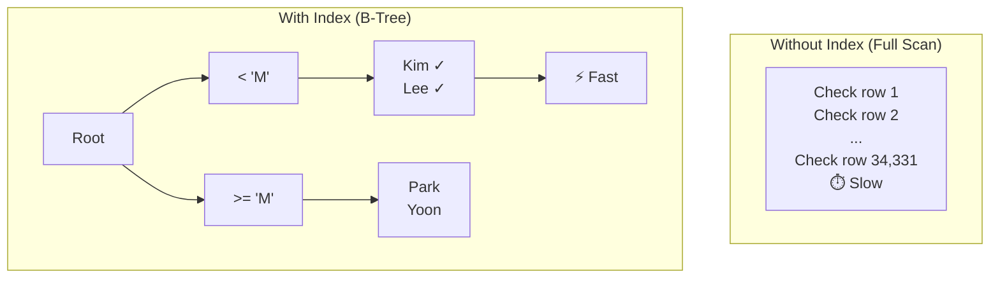

# Lesson 22: Indexes and Query Planning

An index is a data structure that lets SQLite find rows without scanning the entire table. Understanding when indexes help — and when they don't — is the foundation of query performance tuning.



> Without an index, every row is checked (full scan). With an index, B-tree lookup is fast.

{ .off-glb width="560"  }

## What an Index Does

Without an index, SQLite reads every row in a table to find matches (a **full table scan**). With an index on the search column, it jumps directly to the relevant rows — like a book's index versus reading every page.

```
Table scan:   O(n)   — checks every row
Index lookup: O(log n) — binary search on the index tree
```

For a table with 34,689 orders, a scan checks all 34,689 rows. An index on `customer_id` reduces that to perhaps 5–10 index lookups.

## EXPLAIN QUERY PLAN

`EXPLAIN QUERY PLAN` shows how SQLite plans to execute a query — whether it will scan or use an index.

=== "SQLite"
    ```sql
    -- Check the plan for a common query
    EXPLAIN QUERY PLAN
    SELECT order_number, total_amount
    FROM orders
    WHERE customer_id = 42;
    ```

=== "MySQL"
    ```sql
    -- Check the plan for a common query
    EXPLAIN
    SELECT order_number, total_amount
    FROM orders
    WHERE customer_id = 42;
    ```

=== "PostgreSQL"
    ```sql
    -- Check the plan for a common query
    EXPLAIN ANALYZE
    SELECT order_number, total_amount
    FROM orders
    WHERE customer_id = 42;
    ```

**Without index — full table scan:**
```
QUERY PLAN
└── SCAN orders
```

**With index on customer_id — index lookup:**
```
QUERY PLAN
└── SEARCH orders USING INDEX idx_orders_customer_id (customer_id=?)
```

## Viewing Existing Indexes

The TechShop database has pre-built indexes on all foreign keys and frequently-queried columns.

=== "SQLite"
    ```sql
    -- List all indexes in the database
    SELECT name, tbl_name, sql
    FROM sqlite_master
    WHERE type = 'index'
      AND sql IS NOT NULL   -- exclude auto-created PRIMARY KEY indexes
    ORDER BY tbl_name, name;
    ```

=== "MySQL"
    ```sql
    -- List all indexes in the database
    SELECT INDEX_NAME, TABLE_NAME, COLUMN_NAME
    FROM INFORMATION_SCHEMA.STATISTICS
    WHERE TABLE_SCHEMA = DATABASE()
    ORDER BY TABLE_NAME, INDEX_NAME;
    ```

=== "PostgreSQL"
    ```sql
    -- List all indexes in the database
    SELECT indexname, tablename, indexdef
    FROM pg_indexes
    WHERE schemaname = 'public'
    ORDER BY tablename, indexname;
    ```

**Sample result:**

| name | tbl_name | sql |
|------|----------|-----|
| idx_orders_customer_id | orders | CREATE INDEX idx_orders_customer_id ON orders(customer_id) |
| idx_orders_ordered_at | orders | CREATE INDEX idx_orders_ordered_at ON orders(ordered_at) |
| idx_order_items_order_id | order_items | CREATE INDEX ... |
| idx_order_items_product_id | order_items | CREATE INDEX ... |
| idx_reviews_product_id | reviews | CREATE INDEX ... |
| ... | | |

## Seeing SCAN vs. SEARCH

=== "SQLite"
    ```sql
    -- Indexed: fast search
    EXPLAIN QUERY PLAN
    SELECT * FROM orders
    WHERE ordered_at BETWEEN '2024-01-01' AND '2024-12-31';
    -- Result: SEARCH orders USING INDEX idx_orders_ordered_at
    ```

=== "MySQL"
    ```sql
    -- Indexed: fast search
    EXPLAIN
    SELECT * FROM orders
    WHERE ordered_at BETWEEN '2024-01-01' AND '2024-12-31';
    ```

=== "PostgreSQL"
    ```sql
    -- Indexed: fast search
    EXPLAIN ANALYZE
    SELECT * FROM orders
    WHERE ordered_at BETWEEN '2024-01-01' AND '2024-12-31';
    ```

=== "SQLite"
    ```sql
    -- Not indexed: full scan
    EXPLAIN QUERY PLAN
    SELECT * FROM orders
    WHERE notes LIKE '%urgent%';
    -- Result: SCAN orders
    -- (LIKE '%...%' cannot use a B-tree index due to leading wildcard)
    ```

=== "MySQL"
    ```sql
    -- Not indexed: full scan
    EXPLAIN
    SELECT * FROM orders
    WHERE notes LIKE '%urgent%';
    ```

=== "PostgreSQL"
    ```sql
    -- Not indexed: full scan
    EXPLAIN ANALYZE
    SELECT * FROM orders
    WHERE notes LIKE '%urgent%';
    ```

## When Indexes Help

| Situation | Index useful? |
|-----------|--------------|
| `WHERE col = ?` on a high-cardinality column | Yes |
| `WHERE col BETWEEN ? AND ?` | Yes |
| `ORDER BY col` (with LIMIT) | Yes |
| `JOIN ON a.id = b.fk_id` | Yes |
| `WHERE col LIKE 'prefix%'` | Yes |
| `WHERE col LIKE '%suffix'` | No — leading wildcard |
| `WHERE UPPER(col) = ?` | No — function on column |
| Small table (< 1,000 rows) | Rarely worth it |
| Bulk INSERT/UPDATE/DELETE | Index slows writes |

## Creating an Index

```sql
-- Create a composite index for a common filter pattern
CREATE INDEX IF NOT EXISTS idx_orders_status_date
ON orders (status, ordered_at);
```

Now a query filtering by both status and date can use this index:

=== "SQLite"
    ```sql
    EXPLAIN QUERY PLAN
    SELECT order_number, total_amount
    FROM orders
    WHERE status = 'confirmed'
      AND ordered_at >= '2024-01-01';
    -- SEARCH orders USING INDEX idx_orders_status_date (status=? AND ordered_at>?)
    ```

=== "MySQL"
    ```sql
    EXPLAIN
    SELECT order_number, total_amount
    FROM orders
    WHERE status = 'confirmed'
      AND ordered_at >= '2024-01-01';
    ```

=== "PostgreSQL"
    ```sql
    EXPLAIN ANALYZE
    SELECT order_number, total_amount
    FROM orders
    WHERE status = 'confirmed'
      AND ordered_at >= '2024-01-01';
    ```

## Composite Index Column Order

In a composite index `(a, b)`, the index supports:
- Filter on `a` alone
- Filter on `a` and `b` together
- Sort on `a` (or `a, b`)

But it does **not** help when filtering only on `b`.

```sql
-- This uses the composite index (status, ordered_at)
WHERE status = 'confirmed' AND ordered_at > '2024-01-01'

-- This also uses it (leftmost prefix only)
WHERE status = 'confirmed'

-- This does NOT use it
WHERE ordered_at > '2024-01-01'   -- missing left column
```

## Dropping an Index

```sql
DROP INDEX IF EXISTS idx_orders_status_date;
```

!!! note "Lesson Review"
    Quick exercises to check your understanding of this lesson. For comprehensive practice combining multiple concepts, see the [Exercises](../exercises/index.md) section.

## Practice Exercises
### Exercise 1
Drop the `idx_reviews_rating` index you created in Exercise 3.

??? success "Answer"
    === "SQLite"
        ```sql
        DROP INDEX IF EXISTS idx_reviews_rating;
        ```

    === "MySQL"
        ```sql
        DROP INDEX idx_reviews_rating ON reviews;
        ```

    === "PostgreSQL"
        ```sql
        DROP INDEX IF EXISTS idx_reviews_rating;
        ```


### Exercise 2
Create a unique index on the `email` column of the `customers` table. Think about how a unique index differs from a regular index.

??? success "Answer"
    ```sql
    CREATE UNIQUE INDEX IF NOT EXISTS idx_customers_email_unique
    ON customers (email);
    ```
    A unique index prevents duplicate values from being inserted into the column. Beyond improving search performance, it also enforces a data integrity constraint.


### Exercise 3
List all indexes in the database using `sqlite_master`. For each index, identify whether it is on a single column or a composite (multi-column) index by examining the `sql` column. How many composite indexes exist?

??? success "Answer"
    === "SQLite"
        ```sql
        SELECT
            name,
            tbl_name,
            sql,
            CASE WHEN sql LIKE '%,%' THEN 'Composite' ELSE 'Single' END AS index_type
        FROM sqlite_master
        WHERE type = 'index'
          AND sql IS NOT NULL
        ORDER BY tbl_name, name;
        ```

        **Expected result:**

        | name                       | tbl_name   | sql                                                                | index_type |
        | -------------------------- | ---------- | ------------------------------------------------------------------ | ---------- |
        | idx_calendar_year_month    | calendar   | CREATE INDEX idx_calendar_year_month ON calendar(year, month)      | Composite  |
        | idx_cart_items_cart_id     | cart_items | CREATE INDEX idx_cart_items_cart_id ON cart_items(cart_id)         | Single     |
        | idx_carts_customer_id      | carts      | CREATE INDEX idx_carts_customer_id ON carts(customer_id)           | Single     |
        | idx_complaints_category    | complaints | CREATE INDEX idx_complaints_category ON complaints(category)       | Single     |
        | idx_complaints_customer_id | complaints | CREATE INDEX idx_complaints_customer_id ON complaints(customer_id) | Single     |
        | ...                        | ...        | ...                                                                | ...        |


    === "MySQL"
        ```sql
        SELECT
            INDEX_NAME,
            TABLE_NAME,
            GROUP_CONCAT(COLUMN_NAME ORDER BY SEQ_IN_INDEX) AS columns,
            CASE WHEN COUNT(*) > 1 THEN 'Composite' ELSE 'Single' END AS index_type
        FROM INFORMATION_SCHEMA.STATISTICS
        WHERE TABLE_SCHEMA = DATABASE()
        GROUP BY INDEX_NAME, TABLE_NAME
        ORDER BY TABLE_NAME, INDEX_NAME;
        ```

    === "PostgreSQL"
        ```sql
        SELECT
            indexname,
            tablename,
            indexdef,
            CASE WHEN indexdef LIKE '%,%' THEN 'Composite' ELSE 'Single' END AS index_type
        FROM pg_indexes
        WHERE schemaname = 'public'
        ORDER BY tablename, indexname;
        ```


### Exercise 4
Drop both `idx_payments_method_status` (from Exercise 4) and `idx_customers_email_unique` (from Exercise 6) to restore the database to its original state.

??? success "Answer"
    === "SQLite"
        ```sql
        DROP INDEX IF EXISTS idx_payments_method_status;
        DROP INDEX IF EXISTS idx_customers_email_unique;
        ```

    === "MySQL"
        ```sql
        DROP INDEX idx_payments_method_status ON payments;
        DROP INDEX idx_customers_email_unique ON customers;
        ```

    === "PostgreSQL"
        ```sql
        DROP INDEX IF EXISTS idx_payments_method_status;
        DROP INDEX IF EXISTS idx_customers_email_unique;
        ```


### Exercise 5
Run `EXPLAIN QUERY PLAN` on a query that finds all orders for a specific customer sorted by date. Check whether an index is used. Then run the same check for a query filtering by `notes IS NOT NULL`.

??? success "Answer"
    === "SQLite"
        ```sql
        -- Should use idx_orders_customer_id
        EXPLAIN QUERY PLAN
        SELECT order_number, ordered_at, total_amount
        FROM orders
        WHERE customer_id = 100
        ORDER BY ordered_at DESC;

        -- Likely a full scan (no index on notes)
        EXPLAIN QUERY PLAN
        SELECT order_number, notes
        FROM orders
        WHERE notes IS NOT NULL;
        ```

    === "MySQL"
        ```sql
        -- Should use idx_orders_customer_id
        EXPLAIN
        SELECT order_number, ordered_at, total_amount
        FROM orders
        WHERE customer_id = 100
        ORDER BY ordered_at DESC;

        -- Likely a full scan (no index on notes)
        EXPLAIN
        SELECT order_number, notes
        FROM orders
        WHERE notes IS NOT NULL;
        ```

    === "PostgreSQL"
        ```sql
        -- Should use idx_orders_customer_id
        EXPLAIN ANALYZE
        SELECT order_number, ordered_at, total_amount
        FROM orders
        WHERE customer_id = 100
        ORDER BY ordered_at DESC;

        -- Likely a full scan (no index on notes)
        EXPLAIN ANALYZE
        SELECT order_number, notes
        FROM orders
        WHERE notes IS NOT NULL;
        ```


### Exercise 6
Create an index on the `rating` column of the `reviews` table. Then run `EXPLAIN QUERY PLAN` on a query that filters `rating = 5` to verify the index is used.

??? success "Answer"
    === "SQLite"
        ```sql
        CREATE INDEX IF NOT EXISTS idx_reviews_rating
        ON reviews (rating);

        EXPLAIN QUERY PLAN
        SELECT id, product_id, title
        FROM reviews
        WHERE rating = 5;
        -- SEARCH reviews USING INDEX idx_reviews_rating (rating=?)
        ```

    === "MySQL"
        ```sql
        CREATE INDEX idx_reviews_rating
        ON reviews (rating);

        EXPLAIN
        SELECT id, product_id, title
        FROM reviews
        WHERE rating = 5;
        ```

    === "PostgreSQL"
        ```sql
        CREATE INDEX IF NOT EXISTS idx_reviews_rating
        ON reviews (rating);

        EXPLAIN ANALYZE
        SELECT id, product_id, title
        FROM reviews
        WHERE rating = 5;
        ```


### Exercise 7
Create a composite index `idx_payments_method_status` on the `payments` table covering `method` and `status`. Then verify the index is used when querying with `method = 'card' AND status = 'completed'`.

??? success "Answer"
    === "SQLite"
        ```sql
        CREATE INDEX IF NOT EXISTS idx_payments_method_status
        ON payments (method, status);

        EXPLAIN QUERY PLAN
        SELECT id, order_id, amount
        FROM payments
        WHERE method = 'card'
          AND status = 'completed';
        -- SEARCH payments USING INDEX idx_payments_method_status (method=? AND status=?)
        ```

    === "MySQL"
        ```sql
        CREATE INDEX idx_payments_method_status
        ON payments (method, status);

        EXPLAIN
        SELECT id, order_id, amount
        FROM payments
        WHERE method = 'card'
          AND status = 'completed';
        ```

    === "PostgreSQL"
        ```sql
        CREATE INDEX IF NOT EXISTS idx_payments_method_status
        ON payments (method, status);

        EXPLAIN ANALYZE
        SELECT id, order_id, amount
        FROM payments
        WHERE method = 'card'
          AND status = 'completed';
        ```


### Exercise 8
Create a composite index on `orders(customer_id, ordered_at)`. Verify with `EXPLAIN QUERY PLAN` that a query finding a specific customer's orders in 2024 uses this index. Then drop the index.

??? success "Answer"
    === "SQLite"
        ```sql
        CREATE INDEX IF NOT EXISTS idx_orders_customer_date
        ON orders (customer_id, ordered_at);

        -- Verify the composite index is used
        EXPLAIN QUERY PLAN
        SELECT order_number, total_amount
        FROM orders
        WHERE customer_id = 42
          AND ordered_at >= '2024-01-01'
          AND ordered_at < '2025-01-01';
        -- SEARCH orders USING INDEX idx_orders_customer_date (customer_id=? AND ordered_at>? AND ordered_at<?)

        DROP INDEX IF EXISTS idx_orders_customer_date;
        ```

    === "MySQL"
        ```sql
        CREATE INDEX idx_orders_customer_date
        ON orders (customer_id, ordered_at);

        EXPLAIN
        SELECT order_number, total_amount
        FROM orders
        WHERE customer_id = 42
          AND ordered_at >= '2024-01-01'
          AND ordered_at < '2025-01-01';

        DROP INDEX idx_orders_customer_date ON orders;
        ```

    === "PostgreSQL"
        ```sql
        CREATE INDEX IF NOT EXISTS idx_orders_customer_date
        ON orders (customer_id, ordered_at);

        EXPLAIN ANALYZE
        SELECT order_number, total_amount
        FROM orders
        WHERE customer_id = 42
          AND ordered_at >= '2024-01-01'
          AND ordered_at < '2025-01-01';

        DROP INDEX IF EXISTS idx_orders_customer_date;
        ```


### Exercise 9
Run `EXPLAIN QUERY PLAN` on two queries and explain the difference in index usage: (1) `WHERE name LIKE 'Samsung%'` (2) `WHERE name LIKE '%Samsung%'`. Assume there is an index on the `name` column of the `products` table.

??? success "Answer"
    === "SQLite"
        ```sql
        -- First, create an index on the name column
        CREATE INDEX IF NOT EXISTS idx_products_name
        ON products (name);

        -- (1) Prefix search: can use the index
        EXPLAIN QUERY PLAN
        SELECT id, name FROM products
        WHERE name LIKE 'Samsung%';

        -- (2) Contains search: cannot use the index (full scan)
        EXPLAIN QUERY PLAN
        SELECT id, name FROM products
        WHERE name LIKE '%Samsung%';

        -- Cleanup
        DROP INDEX IF EXISTS idx_products_name;
        ```

    === "MySQL"
        ```sql
        CREATE INDEX idx_products_name ON products (name);

        -- (1) Prefix search: can use the index
        EXPLAIN
        SELECT id, name FROM products
        WHERE name LIKE 'Samsung%';

        -- (2) Contains search: cannot use the index (full scan)
        EXPLAIN
        SELECT id, name FROM products
        WHERE name LIKE '%Samsung%';

        DROP INDEX idx_products_name ON products;
        ```

    === "PostgreSQL"
        ```sql
        CREATE INDEX IF NOT EXISTS idx_products_name
        ON products (name);

        -- (1) Prefix search: can use the index
        EXPLAIN ANALYZE
        SELECT id, name FROM products
        WHERE name LIKE 'Samsung%';

        -- (2) Contains search: cannot use the index (full scan)
        EXPLAIN ANALYZE
        SELECT id, name FROM products
        WHERE name LIKE '%Samsung%';

        DROP INDEX IF EXISTS idx_products_name;
        ```
    `LIKE 'prefix%'` can be resolved as a range scan on a B-tree index, but `LIKE '%string%'` has a leading wildcard and requires a full table scan.


---
Next: [Lesson 23: Triggers](23-triggers.md)
