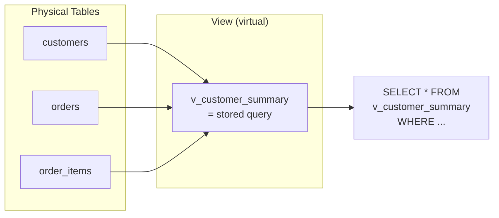

# Lesson 22: Views

**A View** is a stored query saved as a named object in the database. Querying a view works the same as querying a table, but internally the query is executed each time. Views simplify complex queries, enforce consistent business logic, and provide a security layer by hiding raw table details.



> A view is a stored query. It is not a physical table; it fetches data from the original tables each time it is executed.

**Common real-world scenarios for views:**

- **Simplifying complex queries:** Create a view from 4-5 table JOINs for easy querying with `SELECT * FROM v_summary`
- **Security layer:** Provide the analytics team with a view that excludes sensitive columns (passwords, SSN)
- **Consistent business logic:** Define "active customer" in one view and apply the same criteria across all queries
- **Legacy compatibility:** Even if the table structure changes, maintaining the view name prevents existing queries from breaking

The TechShop database comes with 18 pre-installed views. In this lesson, you will learn how to query, create, and manage views.


!!! note "Already familiar?"
    If you are comfortable with views (CREATE VIEW, DROP VIEW), skip ahead to [Lesson 23: Indexes](23-indexes.md).

## Creating a View

```sql
CREATE VIEW view_name AS
SELECT ...;
```

After creation, you can query it like a table:

```sql
SELECT * FROM view_name WHERE ...;
```

## Pre-installed Shop Views

This database provides 18 pre-installed views. Check the list with the following query:

=== "SQLite"
    ```sql
    -- List all views in the database
    SELECT name, sql
    FROM sqlite_master
    WHERE type = 'view'
    ORDER BY name;
    ```

=== "MySQL"
    ```sql
    -- List all views in the database
    SELECT TABLE_NAME, VIEW_DEFINITION
    FROM INFORMATION_SCHEMA.VIEWS
    WHERE TABLE_SCHEMA = DATABASE()
    ORDER BY TABLE_NAME;
    ```

=== "PostgreSQL"
    ```sql
    -- List all views in the database
    SELECT viewname, definition
    FROM pg_views
    WHERE schemaname = 'public'
    ORDER BY viewname;
    ```

Key views:

| View | Description |
|------|-------------|
| `v_order_summary` | Order information including customer name and payment method |
| `v_product_sales` | Per-product sales volume, revenue, and review statistics |
| `v_customer_stats` | Per-customer order count, LTV, average order value |
| `v_monthly_revenue` | Monthly revenue and order count |
| `v_category_performance` | Per-category revenue and sales volume |
| `v_top_customers` | Top 100 customers by LTV |
| `v_inventory_status` | Product information including stock level classification |
## Querying Views

```sql
-- v_order_summary를 테이블처럼 사용
SELECT customer_name, order_number, total_amount, payment_method
FROM v_order_summary
WHERE order_status = 'confirmed'
  AND ordered_at LIKE '2024-12%'
ORDER BY total_amount DESC
LIMIT 5;
```

**Result (example):**

| customer_name | order_number | total_amount | payment_method |
|---------------|--------------|-------------:|----------------|
| 최수아 | ORD-20241231-09842 | 2349.00 | card |
| 박지훈 | ORD-20241228-09831 | 1899.00 | card |
| 이지은 | ORD-20241226-09820 | 1299.99 | kakao_pay |
| ... | | | |

```sql
-- 기본 제공 뷰로 월별 매출 추이 확인
SELECT year_month, revenue, order_count
FROM v_monthly_revenue
WHERE year_month BETWEEN '2022-01' AND '2024-12'
ORDER BY year_month;
```

```sql
-- 뷰로 재고 현황 확인
SELECT product_name, price, stock_qty, stock_status
FROM v_inventory_status
WHERE stock_status IN ('품절', '재고 부족')
ORDER BY stock_qty ASC;
```

## Checking View Definitions

Using the system catalog, you can examine the SQL definition of a view:

=== "SQLite"
    ```sql
    -- Check the SQL that defines the v_product_sales view
    SELECT sql
    FROM sqlite_master
    WHERE type = 'view'
      AND name = 'v_product_sales';
    ```

=== "MySQL"
    ```sql
    -- Check the SQL that defines the v_product_sales view
    SELECT VIEW_DEFINITION
    FROM INFORMATION_SCHEMA.VIEWS
    WHERE TABLE_SCHEMA = DATABASE()
      AND TABLE_NAME = 'v_product_sales';
    ```

=== "PostgreSQL"
    ```sql
    -- Check the SQL that defines the v_product_sales view
    SELECT definition
    FROM pg_views
    WHERE schemaname = 'public'
      AND viewname = 'v_product_sales';
    ```

**Result (summary):**

```sql
CREATE VIEW v_product_sales AS
SELECT
    p.id            AS product_id,
    p.name          AS product_name,
    cat.name        AS category,
    p.price,
    COALESCE(SUM(oi.quantity), 0)             AS units_sold,
    COALESCE(SUM(oi.quantity * oi.unit_price), 0) AS total_revenue,
    COUNT(DISTINCT r.id)                      AS review_count,
    ROUND(AVG(r.rating), 2)                   AS avg_rating
FROM products AS p
INNER JOIN categories AS cat ON p.category_id = cat.id
LEFT  JOIN order_items AS oi ON oi.product_id = p.id
LEFT  JOIN reviews     AS r  ON r.product_id  = p.id
GROUP BY p.id, p.name, cat.name, p.price
```

## Building Views on Top of Views

```sql
-- 뷰를 일반 테이블처럼 필터링할 수 있음
SELECT *
FROM v_customer_stats
WHERE order_count >= 10
  AND avg_order_value > 500
ORDER BY lifetime_value DESC
LIMIT 10;
```

## Creating Your Own Views

```sql
-- 고객 서비스 대시보드용 뷰
CREATE VIEW v_cs_watchlist AS
SELECT
    c.id            AS customer_id,
    c.name,
    c.email,
    c.grade,
    COUNT(DISTINCT comp.id)  AS open_complaints,
    COUNT(DISTINCT r.id)     AS pending_returns,
    MAX(o.ordered_at)        AS last_order_date
FROM customers AS c
LEFT JOIN complaints AS comp ON comp.customer_id = c.id
    AND comp.status = 'open'
LEFT JOIN orders AS o ON o.customer_id = c.id
LEFT JOIN returns AS r ON r.order_id = o.id
    AND r.status = 'pending'
GROUP BY c.id, c.name, c.email, c.grade
HAVING open_complaints > 0 OR pending_returns > 0;
```

## Dropping a View

```sql
DROP VIEW IF EXISTS v_cs_watchlist;
```

## Materialized Views

Regular views execute their internal query each time they are queried. A **Materialized View** physically stores the query result, significantly improving query speed for complex aggregate queries.

### Regular View vs Materialized View

| Aspect | View | Materialized View |
|------|------|-------------------|
| Data storage | No (stores query only) | Yes (stores results) |
| Query speed | Executes query each time | Pre-computed results |
| Data freshness | Always current | Requires REFRESH |
| Disk usage | None | Proportional to result size |
| Index creation | Not possible | Possible (PostgreSQL) |

**Advantages:** Pre-computing complex aggregate queries makes lookups fast.

**Disadvantages:** Changes to source data are not automatically reflected. Manual REFRESH is required.

### Database Support

Support for materialized views varies significantly across databases.

=== "SQLite"
    SQLite does not support materialized views. As an alternative, create a table with `CREATE TABLE ... AS SELECT` (CTAS) and use DROP + re-create when updates are needed.

    ```sql
    -- Create monthly revenue summary table (materialized view alternative)
    CREATE TABLE mv_monthly_summary AS
    SELECT
        STRFTIME('%Y-%m', o.ordered_at) AS year_month,
        COUNT(DISTINCT o.id)            AS order_count,
        SUM(oi.quantity * oi.unit_price) AS revenue
    FROM orders AS o
    INNER JOIN order_items AS oi ON oi.order_id = o.id
    GROUP BY STRFTIME('%Y-%m', o.ordered_at);

    -- When data refresh is needed: DROP and re-create
    DROP TABLE IF EXISTS mv_monthly_summary;
    CREATE TABLE mv_monthly_summary AS
    SELECT
        STRFTIME('%Y-%m', o.ordered_at) AS year_month,
        COUNT(DISTINCT o.id)            AS order_count,
        SUM(oi.quantity * oi.unit_price) AS revenue
    FROM orders AS o
    INNER JOIN order_items AS oi ON oi.order_id = o.id
    GROUP BY STRFTIME('%Y-%m', o.ordered_at);
    ```

=== "MySQL"
    MySQL also does not directly support materialized views. Create a table with CTAS and use the event scheduler for periodic updates.

    ```sql
    -- Create monthly revenue summary table (materialized view alternative)
    CREATE TABLE mv_monthly_summary AS
    SELECT
        DATE_FORMAT(o.ordered_at, '%Y-%m') AS year_month,
        COUNT(DISTINCT o.id)               AS order_count,
        SUM(oi.quantity * oi.unit_price)    AS revenue
    FROM orders AS o
    INNER JOIN order_items AS oi ON oi.order_id = o.id
    GROUP BY DATE_FORMAT(o.ordered_at, '%Y-%m');

    -- Refresh daily at dawn via event scheduler
    CREATE EVENT refresh_monthly_summary
    ON SCHEDULE EVERY 1 DAY
    STARTS CURRENT_DATE + INTERVAL 3 HOUR
    DO
    BEGIN
        TRUNCATE TABLE mv_monthly_summary;
        INSERT INTO mv_monthly_summary
        SELECT
            DATE_FORMAT(o.ordered_at, '%Y-%m') AS year_month,
            COUNT(DISTINCT o.id)               AS order_count,
            SUM(oi.quantity * oi.unit_price)    AS revenue
        FROM orders AS o
        INNER JOIN order_items AS oi ON oi.order_id = o.id
        GROUP BY DATE_FORMAT(o.ordered_at, '%Y-%m');
    END;
    ```

=== "PostgreSQL"
    PostgreSQL natively supports materialized views.

    ```sql
    -- Create monthly revenue summary materialized view
    CREATE MATERIALIZED VIEW mv_monthly_summary AS
    SELECT
        TO_CHAR(o.ordered_at, 'YYYY-MM')  AS year_month,
        COUNT(DISTINCT o.id)              AS order_count,
        SUM(oi.quantity * oi.unit_price)   AS revenue
    FROM orders AS o
    INNER JOIN order_items AS oi ON oi.order_id = o.id
    GROUP BY TO_CHAR(o.ordered_at, 'YYYY-MM');

    -- Indexes can be created on materialized views
    CREATE INDEX idx_mv_monthly_year_month
    ON mv_monthly_summary (year_month);

    -- Refresh data
    REFRESH MATERIALIZED VIEW mv_monthly_summary;

    -- Non-blocking refresh (requires UNIQUE index)
    CREATE UNIQUE INDEX idx_mv_monthly_unique
    ON mv_monthly_summary (year_month);
    REFRESH MATERIALIZED VIEW CONCURRENTLY mv_monthly_summary;

    -- Drop
    DROP MATERIALIZED VIEW IF EXISTS mv_monthly_summary;
    ```

    > The `CONCURRENTLY` option allows querying existing data during refresh. However, it requires a UNIQUE index.

## Summary

| Concept | Description | Example |
|------|------|------|
| CREATE VIEW | Create a stored query | `CREATE VIEW v AS SELECT ...` |
| SELECT FROM view | Query a view like a table | `SELECT * FROM v_summary` |
| CREATE OR REPLACE | Modify a view (PG/MySQL) | `CREATE OR REPLACE VIEW v AS ...` |
| DROP VIEW | Drop a view | `DROP VIEW IF EXISTS v` |
| System catalog | List views | `sqlite_master` / `INFORMATION_SCHEMA` |
| MATERIALIZED VIEW | Physically store results (PG) | `CREATE MATERIALIZED VIEW ...` |

!!! note "Lesson Review Problems"
    These are simple problems to immediately test the concepts learned in this lesson. For comprehensive practice combining multiple concepts, see the [Practice Problems](../exercises/index.md) section.

## Practice Problems
### Problem 1
Query the `v_customer_stats` view to find customers with 5 or more orders and an average order value of 300 or higher, sorted by `lifetime_value` descending.

??? success "Answer"
    ```sql
    SELECT *
    FROM v_customer_stats
    WHERE order_count >= 5
      AND avg_order_value >= 300
    ORDER BY lifetime_value DESC;
    ```


### Problem 2
Drop the `v_cs_watchlist` view, writing it so that no error occurs if the view does not exist.

??? success "Answer"
    ```sql
    DROP VIEW IF EXISTS v_cs_watchlist;
    ```


### Problem 3
Query `v_product_sales` to find the top 10 products by `total_revenue`. Return `product_name`, `category`, `units_sold`, `total_revenue`, `avg_rating`, and include only products with 5 or more reviews.

??? success "Answer"
    ```sql
    SELECT
        product_name,
        category,
        units_sold,
        total_revenue,
        avg_rating
    FROM v_product_sales
    WHERE review_count >= 5
    ORDER BY total_revenue DESC
    LIMIT 10;
    ```


### Problem 4
Use the system catalog to list all 18 views in alphabetical order. Display only the view name. Then pick one view of interest and examine its definition.

??? success "Answer"
    === "SQLite"
        ```sql
        -- Step 1: List all views
        SELECT name
        FROM sqlite_master
        WHERE type = 'view'
        ORDER BY name;

        -- Step 2: Check specific view definition (e.g., v_monthly_revenue)
        SELECT sql
        FROM sqlite_master
        WHERE type = 'view'
          AND name = 'v_monthly_revenue';
        ```

    === "MySQL"
        ```sql
        -- Step 1: List all views
        SELECT TABLE_NAME
        FROM INFORMATION_SCHEMA.VIEWS
        WHERE TABLE_SCHEMA = DATABASE()
        ORDER BY TABLE_NAME;

        -- Step 2: Check specific view definition (e.g., v_monthly_revenue)
        SELECT VIEW_DEFINITION
        FROM INFORMATION_SCHEMA.VIEWS
        WHERE TABLE_SCHEMA = DATABASE()
          AND TABLE_NAME = 'v_monthly_revenue';
        ```

    === "PostgreSQL"
        ```sql
        -- Step 1: List all views
        SELECT viewname
        FROM pg_views
        WHERE schemaname = 'public'
        ORDER BY viewname;

        -- Step 2: Check specific view definition (e.g., v_monthly_revenue)
        SELECT definition
        FROM pg_views
        WHERE schemaname = 'public'
          AND viewname = 'v_monthly_revenue';
        ```


### Problem 5
Query the `v_supplier_performance` view to find the supplier with the highest return rate. Then examine the view definition using the system catalog.

??? success "Answer"
    === "SQLite"
        ```sql
        -- Step 1: Supplier with highest return rate
        SELECT *
        FROM v_supplier_performance
        ORDER BY return_rate_pct DESC
        LIMIT 1;

        -- Step 2: Check view definition
        SELECT sql
        FROM sqlite_master
        WHERE type = 'view'
          AND name = 'v_supplier_performance';
        ```

    === "MySQL"
        ```sql
        SELECT *
        FROM v_supplier_performance
        ORDER BY return_rate_pct DESC
        LIMIT 1;

        SELECT VIEW_DEFINITION
        FROM INFORMATION_SCHEMA.VIEWS
        WHERE TABLE_SCHEMA = DATABASE()
          AND TABLE_NAME = 'v_supplier_performance';
        ```

    === "PostgreSQL"
        ```sql
        SELECT *
        FROM v_supplier_performance
        ORDER BY return_rate_pct DESC
        LIMIT 1;

        SELECT definition
        FROM pg_views
        WHERE schemaname = 'public'
          AND viewname = 'v_supplier_performance';
        ```


### Problem 6
Drop all views created in Problems 5-7.

??? success "Answer"
    ```sql
    DROP VIEW IF EXISTS v_product_total_sales;
    DROP VIEW IF EXISTS v_category_monthly_revenue;
    ```


### Problem 7
Create a view `v_product_total_sales` that JOINs the `products` and `order_items` tables to calculate total units sold (`total_qty`) and total revenue (`total_sales`) per product. Include columns `product_id`, `product_name`, `total_qty`, `total_sales`.

??? success "Answer"
    ```sql
    CREATE VIEW v_product_total_sales AS
    SELECT
        p.id          AS product_id,
        p.name        AS product_name,
        COALESCE(SUM(oi.quantity), 0)              AS total_qty,
        COALESCE(SUM(oi.quantity * oi.unit_price), 0) AS total_sales
    FROM products AS p
    LEFT JOIN order_items AS oi ON oi.product_id = p.id
    GROUP BY p.id, p.name;
    ```


### Problem 8
Modify the existing view `v_product_total_sales` to add a `category_name` column (JOIN with categories table). Since SQLite does not support `CREATE OR REPLACE`, the approach differs by database.

??? success "Answer"
    === "SQLite"
        ```sql
        -- SQLite: DROP and re-create
        DROP VIEW IF EXISTS v_product_total_sales;

        CREATE VIEW v_product_total_sales AS
        SELECT
            p.id          AS product_id,
            p.name        AS product_name,
            c.name        AS category_name,
            COALESCE(SUM(oi.quantity), 0)              AS total_qty,
            COALESCE(SUM(oi.quantity * oi.unit_price), 0) AS total_sales
        FROM products AS p
        INNER JOIN categories AS c ON c.id = p.category_id
        LEFT JOIN order_items AS oi ON oi.product_id = p.id
        GROUP BY p.id, p.name, c.name;
        ```

    === "MySQL"
        ```sql
        -- MySQL: CREATE OR REPLACE supported
        CREATE OR REPLACE VIEW v_product_total_sales AS
        SELECT
            p.id          AS product_id,
            p.name        AS product_name,
            c.name        AS category_name,
            COALESCE(SUM(oi.quantity), 0)              AS total_qty,
            COALESCE(SUM(oi.quantity * oi.unit_price), 0) AS total_sales
        FROM products AS p
        INNER JOIN categories AS c ON c.id = p.category_id
        LEFT JOIN order_items AS oi ON oi.product_id = p.id
        GROUP BY p.id, p.name, c.name;
        ```

    === "PostgreSQL"
        ```sql
        -- PostgreSQL: CREATE OR REPLACE supported
        CREATE OR REPLACE VIEW v_product_total_sales AS
        SELECT
            p.id          AS product_id,
            p.name        AS product_name,
            c.name        AS category_name,
            COALESCE(SUM(oi.quantity), 0)              AS total_qty,
            COALESCE(SUM(oi.quantity * oi.unit_price), 0) AS total_sales
        FROM products AS p
        INNER JOIN categories AS c ON c.id = p.category_id
        LEFT JOIN order_items AS oi ON oi.product_id = p.id
        GROUP BY p.id, p.name, c.name;
        ```


### Problem 9
Create a view `v_category_monthly_revenue` that aggregates monthly revenue by category. Include columns `category_name`, `year_month` (based on order date, 'YYYY-MM' format), `revenue`, `order_count`.

??? success "Answer"
    === "SQLite"
        ```sql
        CREATE VIEW v_category_monthly_revenue AS
        SELECT
            c.name                                  AS category_name,
            STRFTIME('%Y-%m', o.ordered_at)         AS year_month,
            SUM(oi.quantity * oi.unit_price)         AS revenue,
            COUNT(DISTINCT o.id)                     AS order_count
        FROM categories AS c
        INNER JOIN products    AS p  ON p.category_id = c.id
        INNER JOIN order_items AS oi ON oi.product_id = p.id
        INNER JOIN orders      AS o  ON o.id = oi.order_id
        GROUP BY c.name, STRFTIME('%Y-%m', o.ordered_at);
        ```

    === "MySQL"
        ```sql
        CREATE VIEW v_category_monthly_revenue AS
        SELECT
            c.name                                  AS category_name,
            DATE_FORMAT(o.ordered_at, '%Y-%m')      AS year_month,
            SUM(oi.quantity * oi.unit_price)         AS revenue,
            COUNT(DISTINCT o.id)                     AS order_count
        FROM categories AS c
        INNER JOIN products    AS p  ON p.category_id = c.id
        INNER JOIN order_items AS oi ON oi.product_id = p.id
        INNER JOIN orders      AS o  ON o.id = oi.order_id
        GROUP BY c.name, DATE_FORMAT(o.ordered_at, '%Y-%m');
        ```

    === "PostgreSQL"
        ```sql
        CREATE VIEW v_category_monthly_revenue AS
        SELECT
            c.name                                  AS category_name,
            TO_CHAR(o.ordered_at, 'YYYY-MM')        AS year_month,
            SUM(oi.quantity * oi.unit_price)         AS revenue,
            COUNT(DISTINCT o.id)                     AS order_count
        FROM categories AS c
        INNER JOIN products    AS p  ON p.category_id = c.id
        INNER JOIN order_items AS oi ON oi.product_id = p.id
        INNER JOIN orders      AS o  ON o.id = oi.order_id
        GROUP BY c.name, TO_CHAR(o.ordered_at, 'YYYY-MM');
        ```


### Problem 10
Create a materialized view `mv_category_sales` that aggregates total revenue and sales quantity by category. Include columns `category_name`, `total_revenue`, `total_qty`. Use the appropriate method for each database.

??? success "Answer"
    === "SQLite"
        ```sql
        -- SQLite: Create table with CTAS (materialized view alternative)
        CREATE TABLE mv_category_sales AS
        SELECT
            c.name                                  AS category_name,
            COALESCE(SUM(oi.quantity * oi.unit_price), 0) AS total_revenue,
            COALESCE(SUM(oi.quantity), 0)            AS total_qty
        FROM categories AS c
        LEFT JOIN products    AS p  ON p.category_id = c.id
        LEFT JOIN order_items AS oi ON oi.product_id = p.id
        GROUP BY c.name;

        -- Refresh 시: DROP 후 재생성
        DROP TABLE IF EXISTS mv_category_sales;
        CREATE TABLE mv_category_sales AS
        SELECT
            c.name                                  AS category_name,
            COALESCE(SUM(oi.quantity * oi.unit_price), 0) AS total_revenue,
            COALESCE(SUM(oi.quantity), 0)            AS total_qty
        FROM categories AS c
        LEFT JOIN products    AS p  ON p.category_id = c.id
        LEFT JOIN order_items AS oi ON oi.product_id = p.id
        GROUP BY c.name;
        ```

    === "MySQL"
        ```sql
        -- MySQL: Create table with CTAS (materialized view alternative)
        CREATE TABLE mv_category_sales AS
        SELECT
            c.name                                  AS category_name,
            COALESCE(SUM(oi.quantity * oi.unit_price), 0) AS total_revenue,
            COALESCE(SUM(oi.quantity), 0)            AS total_qty
        FROM categories AS c
        LEFT JOIN products    AS p  ON p.category_id = c.id
        LEFT JOIN order_items AS oi ON oi.product_id = p.id
        GROUP BY c.name;

        -- Refresh: TRUNCATE + INSERT
        TRUNCATE TABLE mv_category_sales;
        INSERT INTO mv_category_sales
        SELECT
            c.name                                  AS category_name,
            COALESCE(SUM(oi.quantity * oi.unit_price), 0) AS total_revenue,
            COALESCE(SUM(oi.quantity), 0)            AS total_qty
        FROM categories AS c
        LEFT JOIN products    AS p  ON p.category_id = c.id
        LEFT JOIN order_items AS oi ON oi.product_id = p.id
        GROUP BY c.name;
        ```

    === "PostgreSQL"
        ```sql
        -- PostgreSQL: Native materialized view
        CREATE MATERIALIZED VIEW mv_category_sales AS
        SELECT
            c.name                                  AS category_name,
            COALESCE(SUM(oi.quantity * oi.unit_price), 0) AS total_revenue,
            COALESCE(SUM(oi.quantity), 0)            AS total_qty
        FROM categories AS c
        LEFT JOIN products    AS p  ON p.category_id = c.id
        LEFT JOIN order_items AS oi ON oi.product_id = p.id
        GROUP BY c.name;

        -- Refresh
        REFRESH MATERIALIZED VIEW mv_category_sales;
        ```


### Scoring Guide

| Score | Next Step |
|:----:|----------|
| **9-10** | Move to [Lesson 23: Indexes](23-indexes.md) |
| **7-8** | Review the explanations for incorrect answers, then proceed |
| **Half or less** | Re-read this lesson |
| **3 or fewer** | Start again from [Lesson 21: SELF/CROSS JOIN](21-self-cross-join.md) |

**Problem Areas:**

| Area | Problems |
|------|:--------:|
| View querying (SELECT FROM view) | 1, 3, 5 |
| View deletion (DROP VIEW) | 2, 6 |
| System catalog (view list) | 4 |
| CREATE VIEW | 7, 9 |
| ALTER VIEW (modify) | 8 |
| MATERIALIZED VIEW | 10 |

---
Next: [Lesson 23: Indexes and Query Execution Plans](23-indexes.md)
