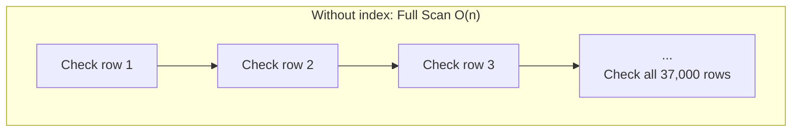
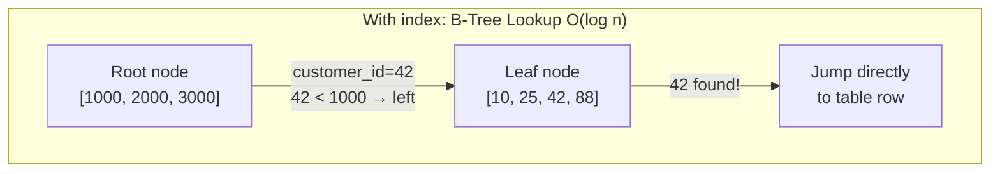

# Lesson 23: Indexes and Query Execution Plans

An Index is a data structure that allows the database to find rows quickly without scanning the entire table. Understanding when indexes help and when they do not is the foundation of query performance tuning.





> A full scan checks all 37,000 rows. A B-Tree index reaches the desired row in 2-3 levels of traversal.

{ .off-glb width="560"  }


!!! note "Already familiar?"
    If you are comfortable with creating/dropping indexes and EXPLAIN, skip ahead to [Lesson 24: Triggers](24-triggers.md).

## The Role of Indexes

Without an index, the database must read every row in the table to find matching rows (**Full Table Scan**). With an index on the search column, it jumps directly to the relevant rows. It is like the difference between using a book index and reading from beginning to end.

```
Table Scan:   O(n)      — Check every row
Index Lookup:  O(log n)  — Binary search through index tree
```

Scanning a table with 34,689 orders checks all 34,689 rows. With an index on `customer_id`, this is reduced to 5-10 index lookups.

## EXPLAIN QUERY PLAN

`EXPLAIN QUERY PLAN` shows how the database plans to execute a query, i.e., whether it will scan or use an index.

=== "SQLite"
    ```sql
    -- Check execution plan for a frequently used query
    EXPLAIN QUERY PLAN
    SELECT order_number, total_amount
    FROM orders
    WHERE customer_id = 42;
    ```

=== "MySQL"
    ```sql
    -- Check execution plan for a frequently used query
    EXPLAIN
    SELECT order_number, total_amount
    FROM orders
    WHERE customer_id = 42;
    ```

=== "PostgreSQL"
    ```sql
    -- Check execution plan for a frequently used query
    EXPLAIN ANALYZE
    SELECT order_number, total_amount
    FROM orders
    WHERE customer_id = 42;
    ```

**No index — Full Table Scan:**
```
QUERY PLAN
└── SCAN orders
```

**customer_id index present — Index Lookup:**
```
QUERY PLAN
└── SEARCH orders USING INDEX idx_orders_customer_id (customer_id=?)
```

## Checking Existing Indexes

This database has pre-created indexes on all foreign keys and frequently queried columns.

=== "SQLite"
    ```sql
    -- List all indexes in the database
    SELECT name, tbl_name, sql
    FROM sqlite_master
    WHERE type = 'index'
      AND sql IS NOT NULL   -- Exclude auto-generated PRIMARY KEY indexes
    ORDER BY tbl_name, name;
    ```

=== "MySQL"
    ```sql
    -- List all indexes in the database
    SELECT INDEX_NAME, TABLE_NAME, COLUMN_NAME
    FROM INFORMATION_SCHEMA.STATISTICS
    WHERE TABLE_SCHEMA = DATABASE()
    ORDER BY TABLE_NAME, INDEX_NAME;
    ```

=== "PostgreSQL"
    ```sql
    -- List all indexes in the database
    SELECT indexname, tablename, indexdef
    FROM pg_indexes
    WHERE schemaname = 'public'
    ORDER BY tablename, indexname;
    ```

**Result example:**

| name | tbl_name | sql |
|------|----------|-----|
| idx_orders_customer_id | orders | CREATE INDEX idx_orders_customer_id ON orders(customer_id) |
| idx_orders_ordered_at | orders | CREATE INDEX idx_orders_ordered_at ON orders(ordered_at) |
| idx_order_items_order_id | order_items | CREATE INDEX ... |
| idx_order_items_product_id | order_items | CREATE INDEX ... |
| idx_reviews_product_id | reviews | CREATE INDEX ... |
| ... | | |

## SCAN vs. SEARCH Comparison

=== "SQLite"
    ```sql
    -- Index present: fast search
    EXPLAIN QUERY PLAN
    SELECT * FROM orders
    WHERE ordered_at BETWEEN '2024-01-01' AND '2024-12-31';
    -- Result: SEARCH orders USING INDEX idx_orders_ordered_at
    ```

=== "MySQL"
    ```sql
    -- Index present: fast search
    EXPLAIN
    SELECT * FROM orders
    WHERE ordered_at BETWEEN '2024-01-01' AND '2024-12-31';
    ```

=== "PostgreSQL"
    ```sql
    -- Index present: fast search
    EXPLAIN ANALYZE
    SELECT * FROM orders
    WHERE ordered_at BETWEEN '2024-01-01' AND '2024-12-31';
    ```

=== "SQLite"
    ```sql
    -- No index: full scan
    EXPLAIN QUERY PLAN
    SELECT * FROM orders
    WHERE notes LIKE '%긴급%';
    -- Result: SCAN orders
    -- (LIKE '%...' with leading wildcard cannot use a B-tree index)
    ```

=== "MySQL"
    ```sql
    -- No index: full scan
    EXPLAIN
    SELECT * FROM orders
    WHERE notes LIKE '%긴급%';
    ```

=== "PostgreSQL"
    ```sql
    -- No index: full scan
    EXPLAIN ANALYZE
    SELECT * FROM orders
    WHERE notes LIKE '%긴급%';
    ```

## When Indexes Help

| Situation | Index Effect |
|-----------|--------------|
| `WHERE col = ?` on high-cardinality column | Yes |
| `WHERE col BETWEEN ? AND ?` | Yes |
| `ORDER BY col` (with LIMIT) | Yes |
| `JOIN ON a.id = b.fk_id` | Yes |
| `WHERE col LIKE 'prefix%'` | Yes |
| `WHERE col LIKE '%suffix'` | No — leading wildcard |
| `WHERE UPPER(col) = ?` | No — function applied to column |
| Small tables (under 1,000 rows) | Minimal effect |
| Bulk INSERT/UPDATE/DELETE | Indexes slow down writes |

## Creating Indexes

```sql
-- 자주 사용하는 필터 패턴을 위한 복합 인덱스 생성
CREATE INDEX IF NOT EXISTS idx_orders_status_date
ON orders (status, ordered_at);
```

Now queries that filter by both status and date can take advantage of this index:

=== "SQLite"
    ```sql
    EXPLAIN QUERY PLAN
    SELECT order_number, total_amount
    FROM orders
    WHERE status = 'confirmed'
      AND ordered_at >= '2024-01-01';
    -- SEARCH orders USING INDEX idx_orders_status_date (status=? AND ordered_at>?)
    ```

=== "MySQL"
    ```sql
    EXPLAIN
    SELECT order_number, total_amount
    FROM orders
    WHERE status = 'confirmed'
      AND ordered_at >= '2024-01-01';
    ```

=== "PostgreSQL"
    ```sql
    EXPLAIN ANALYZE
    SELECT order_number, total_amount
    FROM orders
    WHERE status = 'confirmed'
      AND ordered_at >= '2024-01-01';
    ```

## Column Order in Composite Indexes

A composite index `(a, b)` supports the following cases:
- Filter on `a` alone
- Filter on both `a` and `b`
- Sort by `a` (or by `a, b`)

However, it **does not help** when filtering on `b` alone.

```sql
-- Composite index (status, ordered_at) can be used
WHERE status = 'confirmed' AND ordered_at > '2024-01-01'

-- Left prefix only also works
WHERE status = 'confirmed'

-- Cannot be used in this case (left column missing)
WHERE ordered_at > '2024-01-01'
```

## Covering Index

A covering index is one where **all columns needed by the query are included in the index itself**, so results can be returned from the index alone without accessing the table. This is called an **Index-Only Scan**.

A typical index lookup goes through two steps:

1. **Find row location in index** (B-tree traversal)
2. **Read remaining columns from table** (random I/O)

A covering index skips step 2, which makes a significant performance difference especially with large datasets.

=== "SQLite"
    ```sql
    -- If queries frequently search by customer_id and retrieve only ordered_at and total_amount:
    CREATE INDEX IF NOT EXISTS idx_orders_covering
    ON orders (customer_id, ordered_at, total_amount);

    -- This query can be answered from the index alone (no table access needed)
    EXPLAIN QUERY PLAN
    SELECT ordered_at, total_amount
    FROM orders
    WHERE customer_id = 42;
    -- Expected result: SEARCH orders USING COVERING INDEX idx_orders_covering (customer_id=?)

    -- Cleanup
    DROP INDEX IF EXISTS idx_orders_covering;
    ```

=== "MySQL"
    ```sql
    -- If queries frequently search by customer_id and retrieve only ordered_at and total_amount:
    CREATE INDEX idx_orders_covering
    ON orders (customer_id, ordered_at, total_amount);

    -- If "Using index" appears in EXPLAIN Extra column, covering index is used
    EXPLAIN
    SELECT ordered_at, total_amount
    FROM orders
    WHERE customer_id = 42;

    -- Cleanup
    DROP INDEX idx_orders_covering ON orders;
    ```

=== "PostgreSQL"
    ```sql
    -- PostgreSQL uses INCLUDE clause for a more explicit covering index
    CREATE INDEX IF NOT EXISTS idx_orders_covering
    ON orders (customer_id) INCLUDE (ordered_at, total_amount);

    -- If "Index Only Scan" appears, success
    EXPLAIN ANALYZE
    SELECT ordered_at, total_amount
    FROM orders
    WHERE customer_id = 42;

    -- Cleanup
    DROP INDEX IF EXISTS idx_orders_covering;
    ```

!!! tip "Covering Index Design Principles"
    - Place **WHERE clause columns first**, SELECT-only columns last.
    - PostgreSQL's `INCLUDE` clause stores columns not used for search only in index leaves, optimizing index size.
    - Including too many columns increases index size and degrades write performance. Apply only to frequently executed core queries.

## Partial Index

A partial index indexes **only a subset of rows** in a table. Add a `WHERE` clause to the `CREATE INDEX` statement to include only rows meeting the condition.

When only a subset of the table is frequently queried, a partial index is **smaller and has lower update costs** than a regular index.

!!! warning "Database Support"
    - **SQLite** (3.8.0+): Supported
    - **PostgreSQL**: Supported
    - **MySQL/MariaDB**: **Not supported** — Use Generated Column + regular index as an alternative

=== "SQLite"
    ```sql
    -- Index only active products (rows where is_active = 1)
    CREATE INDEX IF NOT EXISTS idx_active_products
    ON products (name) WHERE is_active = 1;

    -- Partial index used for active product search
    EXPLAIN QUERY PLAN
    SELECT id, name, price
    FROM products
    WHERE is_active = 1 AND name LIKE '삼성%';
    -- SEARCH products USING INDEX idx_active_products (name>? AND name<?)

    -- Cleanup
    DROP INDEX IF EXISTS idx_active_products;
    ```

=== "PostgreSQL"
    ```sql
    -- Index only active products
    CREATE INDEX IF NOT EXISTS idx_active_products
    ON products (name) WHERE is_active = true;

    -- Index only pending orders (a subset of all orders)
    CREATE INDEX IF NOT EXISTS idx_pending_orders
    ON orders (customer_id, ordered_at) WHERE status = 'pending';

    EXPLAIN ANALYZE
    SELECT order_number, ordered_at
    FROM orders
    WHERE status = 'pending' AND customer_id = 42;

    -- Cleanup
    DROP INDEX IF EXISTS idx_active_products;
    DROP INDEX IF EXISTS idx_pending_orders;
    ```

!!! tip "Partial Index Use Cases"
    | Scenario | Partial Index Condition |
    |---------|-----------------|
    | Active product search | `WHERE is_active = 1` |
    | Pending order lookup | `WHERE status = 'pending'` |
    | Recent reviews only | `WHERE created_at >= '2024-01-01'` |
    | Search non-NULL values only | `WHERE notes IS NOT NULL` |

## Dropping Indexes

```sql
DROP INDEX IF EXISTS idx_orders_status_date;
```

**Common real-world scenarios for indexes:**

- **Query performance:** Index columns used in WHERE, JOIN, ORDER BY
- **Covering index:** Include SELECT columns of frequently executed queries
- **Partial index:** Index only active data to save space
- **Composite index:** Optimize column order for multi-condition queries

## Summary

| Concept | Description | Example |
|------|------|------|
| CREATE INDEX | Create an index | `CREATE INDEX idx ON t(col)` |
| UNIQUE INDEX | Index preventing duplicates | `CREATE UNIQUE INDEX ...` |
| Composite index | Multi-column index (left-prefix rule) | `ON t(a, b, c)` |
| Covering index | Includes SELECT columns -> Index-Only Scan | `ON t(a) INCLUDE (b, c)` |
| Partial index | Index only a subset via WHERE condition | `ON t(col) WHERE active=1` |
| EXPLAIN | Check execution plan | `EXPLAIN QUERY PLAN SELECT ...` |
| DROP INDEX | Drop an index | `DROP INDEX IF EXISTS idx` |

!!! note "Lesson Review Problems"
    These are simple problems to immediately test the concepts learned in this lesson. For comprehensive practice combining multiple concepts, see the [Practice Problems](../exercises/index.md) section.

## Practice Problems
### Problem 1
Drop the `idx_reviews_rating` index created in Problem 3.

??? success "Answer"
    === "SQLite"
        ```sql
        DROP INDEX IF EXISTS idx_reviews_rating;
        ```

    === "MySQL"
        ```sql
        DROP INDEX idx_reviews_rating ON reviews;
        ```

    === "PostgreSQL"
        ```sql
        DROP INDEX IF EXISTS idx_reviews_rating;
        ```


### Problem 2
Create a unique index (`UNIQUE INDEX`) on the `email` column of the `customers` table. Think about how a unique index differs from a regular index.

??? success "Answer"
    ```sql
    CREATE UNIQUE INDEX IF NOT EXISTS idx_customers_email_unique
    ON customers (email);
    ```
    A unique index prevents duplicate values from being inserted into the column. Besides improving search performance, it also serves as a data integrity constraint.


### Problem 3
Use `sqlite_master` to list all indexes in the database. For each index, examine the `sql` column to determine whether it is a single-column index or a composite (multi-column) index. How many composite indexes are there?

??? success "Answer"
    === "SQLite"
        ```sql
        SELECT
            name,
            tbl_name,
            sql,
            CASE WHEN sql LIKE '%,%' THEN 'composite' ELSE 'single' END AS index_type
        FROM sqlite_master
        WHERE type = 'index'
          AND sql IS NOT NULL
        ORDER BY tbl_name, name;
        ```

        **Result (example):**

        | name                       | tbl_name   | sql                                                                | index_type |
        | -------------------------- | ---------- | ------------------------------------------------------------------ | ---------- |
        | idx_calendar_year_month    | calendar   | CREATE INDEX idx_calendar_year_month ON calendar(year, month)      | 복합         |
        | idx_cart_items_cart_id     | cart_items | CREATE INDEX idx_cart_items_cart_id ON cart_items(cart_id)         | 단일         |
        | idx_carts_customer_id      | carts      | CREATE INDEX idx_carts_customer_id ON carts(customer_id)           | 단일         |
        | idx_complaints_category    | complaints | CREATE INDEX idx_complaints_category ON complaints(category)       | 단일         |
        | idx_complaints_customer_id | complaints | CREATE INDEX idx_complaints_customer_id ON complaints(customer_id) | 단일         |
        | ...                        | ...        | ...                                                                | ...        |


    === "MySQL"
        ```sql
        SELECT
            INDEX_NAME,
            TABLE_NAME,
            GROUP_CONCAT(COLUMN_NAME ORDER BY SEQ_IN_INDEX) AS columns,
            CASE WHEN COUNT(*) > 1 THEN 'composite' ELSE 'single' END AS index_type
        FROM INFORMATION_SCHEMA.STATISTICS
        WHERE TABLE_SCHEMA = DATABASE()
        GROUP BY INDEX_NAME, TABLE_NAME
        ORDER BY TABLE_NAME, INDEX_NAME;
        ```

    === "PostgreSQL"
        ```sql
        SELECT
            indexname,
            tablename,
            indexdef,
            CASE WHEN indexdef LIKE '%,%' THEN 'composite' ELSE 'single' END AS index_type
        FROM pg_indexes
        WHERE schemaname = 'public'
        ORDER BY tablename, indexname;
        ```


### Problem 4
Drop the `idx_payments_method_status` index created in Problem 4 and the `idx_customers_email_unique` index created in Problem 6 to restore the original state.

??? success "Answer"
    === "SQLite"
        ```sql
        DROP INDEX IF EXISTS idx_payments_method_status;
        DROP INDEX IF EXISTS idx_customers_email_unique;
        ```

    === "MySQL"
        ```sql
        DROP INDEX idx_payments_method_status ON payments;
        DROP INDEX idx_customers_email_unique ON customers;
        ```

    === "PostgreSQL"
        ```sql
        DROP INDEX IF EXISTS idx_payments_method_status;
        DROP INDEX IF EXISTS idx_customers_email_unique;
        ```


### Problem 5
Run `EXPLAIN QUERY PLAN` on a query that finds a specific customer's orders sorted by date. Check if an index is used. Then do the same check for a query filtering by `notes IS NOT NULL`.

??? success "Answer"
    === "SQLite"
        ```sql
        -- Should use the idx_orders_customer_id index
        EXPLAIN QUERY PLAN
        SELECT order_number, ordered_at, total_amount
        FROM orders
        WHERE customer_id = 100
        ORDER BY ordered_at DESC;

        -- No index on notes, likely full scan
        EXPLAIN QUERY PLAN
        SELECT order_number, notes
        FROM orders
        WHERE notes IS NOT NULL;
        ```

    === "MySQL"
        ```sql
        -- Should use the idx_orders_customer_id index
        EXPLAIN
        SELECT order_number, ordered_at, total_amount
        FROM orders
        WHERE customer_id = 100
        ORDER BY ordered_at DESC;

        -- No index on notes, likely full scan
        EXPLAIN
        SELECT order_number, notes
        FROM orders
        WHERE notes IS NOT NULL;
        ```

    === "PostgreSQL"
        ```sql
        -- Should use the idx_orders_customer_id index
        EXPLAIN ANALYZE
        SELECT order_number, ordered_at, total_amount
        FROM orders
        WHERE customer_id = 100
        ORDER BY ordered_at DESC;

        -- No index on notes, likely full scan
        EXPLAIN ANALYZE
        SELECT order_number, notes
        FROM orders
        WHERE notes IS NOT NULL;
        ```


### Problem 6
Create an index on the `rating` column of the `reviews` table. Then run `EXPLAIN QUERY PLAN` on a query that retrieves reviews with `rating = 5` to verify the index is being used.

??? success "Answer"
    === "SQLite"
        ```sql
        CREATE INDEX IF NOT EXISTS idx_reviews_rating
        ON reviews (rating);

        EXPLAIN QUERY PLAN
        SELECT id, product_id, title
        FROM reviews
        WHERE rating = 5;
        -- SEARCH reviews USING INDEX idx_reviews_rating (rating=?)
        ```

    === "MySQL"
        ```sql
        CREATE INDEX idx_reviews_rating
        ON reviews (rating);

        EXPLAIN
        SELECT id, product_id, title
        FROM reviews
        WHERE rating = 5;
        ```

    === "PostgreSQL"
        ```sql
        CREATE INDEX IF NOT EXISTS idx_reviews_rating
        ON reviews (rating);

        EXPLAIN ANALYZE
        SELECT id, product_id, title
        FROM reviews
        WHERE rating = 5;
        ```


### Problem 7
Create a composite index `idx_payments_method_status` on the `payments` table combining the `method` and `status` columns. Then verify the index is used when querying with `method = 'card' AND status = 'completed'`.

??? success "Answer"
    === "SQLite"
        ```sql
        CREATE INDEX IF NOT EXISTS idx_payments_method_status
        ON payments (method, status);

        EXPLAIN QUERY PLAN
        SELECT id, order_id, amount
        FROM payments
        WHERE method = 'card'
          AND status = 'completed';
        -- SEARCH payments USING INDEX idx_payments_method_status (method=? AND status=?)
        ```

    === "MySQL"
        ```sql
        CREATE INDEX idx_payments_method_status
        ON payments (method, status);

        EXPLAIN
        SELECT id, order_id, amount
        FROM payments
        WHERE method = 'card'
          AND status = 'completed';
        ```

    === "PostgreSQL"
        ```sql
        CREATE INDEX IF NOT EXISTS idx_payments_method_status
        ON payments (method, status);

        EXPLAIN ANALYZE
        SELECT id, order_id, amount
        FROM payments
        WHERE method = 'card'
          AND status = 'completed';
        ```


### Problem 8
Create a composite index on the `orders` table combining `customer_id` and `ordered_at`, and verify the execution plan uses this index when querying a specific customer's 2024 orders. Drop the index after verification.

??? success "Answer"
    === "SQLite"
        ```sql
        CREATE INDEX IF NOT EXISTS idx_orders_customer_date
        ON orders (customer_id, ordered_at);

        -- Verify composite index usage
        EXPLAIN QUERY PLAN
        SELECT order_number, total_amount
        FROM orders
        WHERE customer_id = 42
          AND ordered_at >= '2024-01-01'
          AND ordered_at < '2025-01-01';
        -- SEARCH orders USING INDEX idx_orders_customer_date (customer_id=? AND ordered_at>? AND ordered_at<?)

        DROP INDEX IF EXISTS idx_orders_customer_date;
        ```

    === "MySQL"
        ```sql
        CREATE INDEX idx_orders_customer_date
        ON orders (customer_id, ordered_at);

        EXPLAIN
        SELECT order_number, total_amount
        FROM orders
        WHERE customer_id = 42
          AND ordered_at >= '2024-01-01'
          AND ordered_at < '2025-01-01';

        DROP INDEX idx_orders_customer_date ON orders;
        ```

    === "PostgreSQL"
        ```sql
        CREATE INDEX IF NOT EXISTS idx_orders_customer_date
        ON orders (customer_id, ordered_at);

        EXPLAIN ANALYZE
        SELECT order_number, total_amount
        FROM orders
        WHERE customer_id = 42
          AND ordered_at >= '2024-01-01'
          AND ordered_at < '2025-01-01';

        DROP INDEX IF EXISTS idx_orders_customer_date;
        ```


### Problem 9
Run `EXPLAIN QUERY PLAN` on each of the following two queries and explain the difference in index usage: (1) `WHERE name LIKE '삼성%'` (2) `WHERE name LIKE '%삼성%'`. Assume an index exists on the `name` column of the `products` table.

??? success "Answer"
    === "SQLite"
        ```sql
        -- First create index on name column
        CREATE INDEX IF NOT EXISTS idx_products_name
        ON products (name);

        -- (1) Prefix search: index can be used
        EXPLAIN QUERY PLAN
        SELECT id, name FROM products
        WHERE name LIKE '삼성%';

        -- (2) Middle search: index cannot be used (full scan)
        EXPLAIN QUERY PLAN
        SELECT id, name FROM products
        WHERE name LIKE '%삼성%';

        -- Cleanup
        DROP INDEX IF EXISTS idx_products_name;
        ```

    === "MySQL"
        ```sql
        CREATE INDEX idx_products_name ON products (name);

        -- (1) Prefix search: index can be used
        EXPLAIN
        SELECT id, name FROM products
        WHERE name LIKE '삼성%';

        -- (2) Middle search: index cannot be used (full scan)
        EXPLAIN
        SELECT id, name FROM products
        WHERE name LIKE '%삼성%';

        DROP INDEX idx_products_name ON products;
        ```

    === "PostgreSQL"
        ```sql
        CREATE INDEX IF NOT EXISTS idx_products_name
        ON products (name);

        -- (1) Prefix search: index can be used
        EXPLAIN ANALYZE
        SELECT id, name FROM products
        WHERE name LIKE '삼성%';

        -- (2) Middle search: index cannot be used (full scan)
        EXPLAIN ANALYZE
        SELECT id, name FROM products
        WHERE name LIKE '%삼성%';

        DROP INDEX IF EXISTS idx_products_name;
        ```
    `LIKE 'prefix%'` can be handled as a B-tree index range search, but `LIKE '%string%'` has a leading wildcard and cannot utilize the index, requiring a full table scan.


### Problem 10
Verify the impact of indexes on write performance. Create an index on the `name` column of the `products` table, INSERT a test row, DELETE it, then drop the index. Explain the effect of indexes on INSERT performance.

??? success "Answer"
    ```sql
    -- 1. Create index
    CREATE INDEX IF NOT EXISTS idx_products_name
    ON products (name);

    -- 2. Insert test row (index is also updated)
    INSERT INTO products (sku, name, brand, category_id, supplier_id, price, cost_price, stock_qty, is_active, created_at, updated_at)
    VALUES ('SKU-TEST-IDX', '인덱스 테스트 상품', 'Test', 1, 1, 10000, 5000, 10, 1, datetime('now'), datetime('now'));

    -- 3. Cleanup
    DELETE FROM products WHERE sku = 'SKU-TEST-IDX';
    DROP INDEX IF EXISTS idx_products_name;
    ```

    **Explanation:** When indexes exist, INSERT/UPDATE/DELETE operations must also update the indexes, slowing down writes. Indexes improve read performance but add write costs, so they should only be created selectively on frequently queried columns.


### Problem 11
Create a covering index on the `orders` table including `customer_id`, `ordered_at`, `total_amount` columns. Then run `EXPLAIN QUERY PLAN` on a query that retrieves only `ordered_at` and `total_amount` for a specific customer to verify **COVERING INDEX** (Index-Only Scan) is used. Drop the index after verification.

??? success "Answer"
    === "SQLite"
        ```sql
        CREATE INDEX IF NOT EXISTS idx_orders_covering
        ON orders (customer_id, ordered_at, total_amount);

        -- Verify COVERING INDEX usage
        EXPLAIN QUERY PLAN
        SELECT ordered_at, total_amount
        FROM orders
        WHERE customer_id = 42;
        -- Expected result: SEARCH orders USING COVERING INDEX idx_orders_covering (customer_id=?)

        DROP INDEX IF EXISTS idx_orders_covering;
        ```

    === "MySQL"
        ```sql
        CREATE INDEX idx_orders_covering
        ON orders (customer_id, ordered_at, total_amount);

        -- If "Using index" appears in Extra column, covering index is used
        EXPLAIN
        SELECT ordered_at, total_amount
        FROM orders
        WHERE customer_id = 42;

        DROP INDEX idx_orders_covering ON orders;
        ```

    === "PostgreSQL"
        ```sql
        -- PostgreSQL uses INCLUDE for covering indexes
        CREATE INDEX IF NOT EXISTS idx_orders_covering
        ON orders (customer_id) INCLUDE (ordered_at, total_amount);

        -- If "Index Only Scan" appears, success
        EXPLAIN ANALYZE
        SELECT ordered_at, total_amount
        FROM orders
        WHERE customer_id = 42;

        DROP INDEX IF EXISTS idx_orders_covering;
        ```

    **Key point:** When the execution plan shows `COVERING INDEX` in SQLite, `Using index` in MySQL Extra, or `Index Only Scan` in PostgreSQL, it means results were returned from the index alone without table access. This is because all columns in the SELECT clause are included in the index.


### Scoring Guide

| Score | Next Step |
|:----:|----------|
| **10-11** | Move to [Lesson 24: Triggers](24-triggers.md) |
| **8-9** | Review the explanations for incorrect answers, then proceed |
| **Half or less** | Re-read this lesson |
| **3 or fewer** | Start again from [Lesson 22: Views](22-views.md) |

**Problem Areas:**

| Area | Problems |
|------|:--------:|
| Index deletion (DROP INDEX) | 1, 4 |
| UNIQUE INDEX creation | 2 |
| Index list query (metadata) | 3 |
| EXPLAIN QUERY PLAN basics | 5 |
| Single index creation + EXPLAIN | 6 |
| Composite index creation + EXPLAIN | 7, 8 |
| LIKE prefix vs middle search | 9 |
| Indexes and write performance | 10 |
| Covering index (Index-Only Scan) | 11 |

---
Next: [Lesson 24: Triggers](24-triggers.md)
