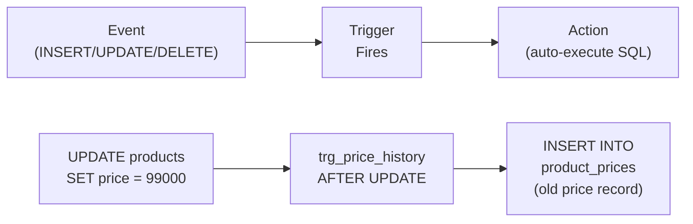

# Lesson 23: Triggers

A **trigger** is a database object that automatically executes a block of SQL in response to a data modification event (`INSERT`, `UPDATE`, or `DELETE`) on a specific table. Triggers enforce business rules, maintain audit trails, and keep derived data in sync — all without application code.



> A trigger automatically executes SQL when an event (INSERT/UPDATE/DELETE) occurs on a table.

Trigger syntax varies significantly across databases. SQLite has the simplest form, MySQL requires a `DELIMITER` change, and PostgreSQL requires a separate function before the trigger definition.

## Trigger Syntax

=== "SQLite"
    ```sql
    CREATE TRIGGER trigger_name
        BEFORE | AFTER | INSTEAD OF
        INSERT | UPDATE | DELETE
        ON table_name
        [WHEN condition]
    BEGIN
        -- SQL statements;
    END;
    ```

=== "MySQL"
    ```sql
    DELIMITER //
    CREATE TRIGGER trigger_name
        BEFORE | AFTER
        INSERT | UPDATE | DELETE
        ON table_name
        FOR EACH ROW
    BEGIN
        -- SQL statements;
    END //
    DELIMITER ;
    ```

=== "PostgreSQL"
    ```sql
    -- Step 1: Create a trigger function
    CREATE OR REPLACE FUNCTION trigger_function_name()
    RETURNS TRIGGER AS $$
    BEGIN
        -- SQL statements;
        RETURN NEW;  -- or RETURN OLD for DELETE triggers
    END;
    $$ LANGUAGE plpgsql;

    -- Step 2: Attach the function to a trigger
    CREATE TRIGGER trigger_name
        BEFORE | AFTER
        INSERT | UPDATE | DELETE
        ON table_name
        FOR EACH ROW
        EXECUTE FUNCTION trigger_function_name();
    ```

- `BEFORE` fires before the row is changed (use to validate or modify)
- `AFTER` fires after the row is changed (use for logging and cascades)
- `NEW` refers to the row being inserted or the new values in an update
- `OLD` refers to the row being deleted or the old values in an update

## TechShop's Built-in Triggers

The database ships with 5 pre-built triggers. Examine them:

=== "SQLite"
    ```sql
    -- List all triggers
    SELECT name, tbl_name, sql
    FROM sqlite_master
    WHERE type = 'trigger'
    ORDER BY name;
    ```

=== "MySQL"
    ```sql
    -- List all triggers
    SELECT TRIGGER_NAME, EVENT_OBJECT_TABLE, ACTION_STATEMENT
    FROM INFORMATION_SCHEMA.TRIGGERS
    WHERE TRIGGER_SCHEMA = DATABASE()
    ORDER BY TRIGGER_NAME;
    ```

=== "PostgreSQL"
    ```sql
    -- List all triggers
    SELECT tgname, relname, pg_get_triggerdef(t.oid)
    FROM pg_trigger t
    JOIN pg_class c ON t.tgrelid = c.oid
    WHERE NOT t.tgisinternal
    ORDER BY tgname;
    ```

| Trigger | Table | Fires On | Purpose |
|---------|-------|----------|---------|
| `trg_update_product_timestamp` | products | AFTER UPDATE | Sets `updated_at = datetime('now')` automatically |
| `trg_update_customer_timestamp` | customers | AFTER UPDATE | Sets `updated_at = datetime('now')` automatically |
| `trg_earn_points_on_order` | orders | AFTER INSERT | Credits loyalty points when a new order is inserted |
| `trg_adjust_stock_on_order` | order_items | AFTER INSERT | Decrements `products.stock_qty` when an item is ordered |
| `trg_restore_stock_on_cancel` | orders | AFTER UPDATE | Restores `products.stock_qty` when an order is cancelled |

## Inspecting a Trigger's Definition

=== "SQLite"
    ```sql
    -- Read the full SQL of a specific trigger
    SELECT sql
    FROM sqlite_master
    WHERE type = 'trigger'
      AND name = 'trg_adjust_stock_on_order';
    ```

=== "MySQL"
    ```sql
    -- Read the full SQL of a specific trigger
    SHOW CREATE TRIGGER trg_adjust_stock_on_order;
    ```

=== "PostgreSQL"
    ```sql
    -- Read the full SQL of a specific trigger
    SELECT pg_get_triggerdef(oid)
    FROM pg_trigger
    WHERE tgname = 'trg_adjust_stock_on_order';
    ```

**Result:**

```sql
CREATE TRIGGER trg_adjust_stock_on_order
AFTER INSERT ON order_items
BEGIN
    UPDATE products
    SET stock_qty  = stock_qty - NEW.quantity,
        updated_at = datetime('now')
    WHERE id = NEW.product_id;
END
```

Every time a row is inserted into `order_items`, this trigger automatically decrements the corresponding product's stock.

=== "SQLite"
    ```sql
    -- Examine the points trigger
    SELECT sql
    FROM sqlite_master
    WHERE type = 'trigger'
      AND name = 'trg_earn_points_on_order';
    ```

=== "MySQL"
    ```sql
    -- Examine the points trigger
    SHOW CREATE TRIGGER trg_earn_points_on_order;
    ```

=== "PostgreSQL"
    ```sql
    -- Examine the points trigger
    SELECT pg_get_triggerdef(oid)
    FROM pg_trigger
    WHERE tgname = 'trg_earn_points_on_order';
    ```

**Result:**

```sql
CREATE TRIGGER trg_earn_points_on_order
AFTER INSERT ON orders
BEGIN
    UPDATE customers
    SET point_balance = point_balance + NEW.point_earned,
        updated_at    = datetime('now')
    WHERE id = NEW.customer_id;
END
```

## Verifying Trigger Behavior

You can confirm a trigger works by observing the before/after state:

```sql
-- Check current stock for product 5
SELECT id, name, stock_qty FROM products WHERE id = 5;
-- Result: stock_qty = 42

-- Insert an order item (trigger fires automatically)
INSERT INTO order_items (order_id, product_id, quantity, unit_price, total_price)
VALUES (99999, 5, 3, 99.99, 299.97);

-- Check stock again — should be 42 - 3 = 39
SELECT id, name, stock_qty FROM products WHERE id = 5;
-- Result: stock_qty = 39
```

## Writing a New Trigger

=== "SQLite"
    ```sql
    -- Audit table for price changes
    CREATE TABLE IF NOT EXISTS price_change_log (
        id          INTEGER PRIMARY KEY AUTOINCREMENT,
        product_id  INTEGER,
        old_price   REAL,
        new_price   REAL,
        changed_at  TEXT DEFAULT (datetime('now'))
    );

    -- Trigger
    CREATE TRIGGER IF NOT EXISTS trg_log_price_change
    AFTER UPDATE OF price ON products
    WHEN OLD.price <> NEW.price
    BEGIN
        INSERT INTO price_change_log (product_id, old_price, new_price)
        VALUES (NEW.id, OLD.price, NEW.price);
    END;
    ```

=== "MySQL"
    ```sql
    -- Audit table for price changes
    CREATE TABLE IF NOT EXISTS price_change_log (
        id          INT AUTO_INCREMENT PRIMARY KEY,
        product_id  INT,
        old_price   DECIMAL(10,2),
        new_price   DECIMAL(10,2),
        changed_at  DATETIME DEFAULT NOW()
    );

    -- Trigger
    DELIMITER //
    CREATE TRIGGER trg_log_price_change
    AFTER UPDATE ON products
    FOR EACH ROW
    BEGIN
        IF OLD.price <> NEW.price THEN
            INSERT INTO price_change_log (product_id, old_price, new_price)
            VALUES (NEW.id, OLD.price, NEW.price);
        END IF;
    END //
    DELIMITER ;
    ```

=== "PostgreSQL"
    ```sql
    -- Audit table for price changes
    CREATE TABLE IF NOT EXISTS price_change_log (
        id          SERIAL PRIMARY KEY,
        product_id  INTEGER,
        old_price   NUMERIC(10,2),
        new_price   NUMERIC(10,2),
        changed_at  TIMESTAMP DEFAULT NOW()
    );

    -- Trigger function
    CREATE OR REPLACE FUNCTION fn_log_price_change()
    RETURNS TRIGGER AS $$
    BEGIN
        IF OLD.price <> NEW.price THEN
            INSERT INTO price_change_log (product_id, old_price, new_price)
            VALUES (NEW.id, OLD.price, NEW.price);
        END IF;
        RETURN NEW;
    END;
    $$ LANGUAGE plpgsql;

    -- Trigger
    CREATE TRIGGER trg_log_price_change
    AFTER UPDATE OF price ON products
    FOR EACH ROW
    EXECUTE FUNCTION fn_log_price_change();
    ```

Now every price update is automatically recorded:

```sql
UPDATE products SET price = 1349.99 WHERE id = 1;

SELECT * FROM price_change_log;
-- product_id=1, old_price=1299.99, new_price=1349.99
```

## Dropping a Trigger

```sql
DROP TRIGGER IF EXISTS trg_log_price_change;
DROP TABLE IF EXISTS price_change_log;
```

## When to Use Triggers

| Good use | Avoid |
|----------|-------|
| Audit logging | Complex business logic (hard to debug) |
| Maintaining `updated_at` timestamps | Triggers that call other triggers excessively |
| Cascading derived data (stock, points) | Replacing application-level validation |
| Enforcing denormalized summaries | Performance-critical write paths |

!!! note "Lesson Review"
    Quick exercises to check your understanding of this lesson. For comprehensive practice combining multiple concepts, see the [Exercises](../exercises/index.md) section.

## Practice Exercises
### Exercise 1
Query the system catalog to retrieve the full SQL definition of the `trg_earn_points_on_order` trigger. Explain which table it fires on, what event triggers it, and which table it modifies.

??? success "Answer"
    === "SQLite"
        ```sql
        SELECT sql
        FROM sqlite_master
        WHERE type = 'trigger'
          AND name = 'trg_earn_points_on_order';
        ```

    === "MySQL"
        ```sql
        SHOW CREATE TRIGGER trg_earn_points_on_order;
        ```

    === "PostgreSQL"
        ```sql
        SELECT pg_get_triggerdef(oid)
        FROM pg_trigger
        WHERE tgname = 'trg_earn_points_on_order';
        ```
    This trigger fires on the `orders` table when a new row is INSERTed. It modifies the `customers` table by increasing `point_balance` by the value of `NEW.point_earned`.


### Exercise 2
Write a trigger `trg_log_expensive_price_change` that uses a WHEN condition to log price changes only when the new price is 1,000,000 or above. Assume the `price_change_log` table already exists.

??? success "Answer"
    === "SQLite"
        ```sql
        CREATE TRIGGER IF NOT EXISTS trg_log_expensive_price_change
        AFTER UPDATE OF price ON products
        WHEN NEW.price >= 1000000 AND OLD.price <> NEW.price
        BEGIN
            INSERT INTO price_change_log (product_id, old_price, new_price)
            VALUES (NEW.id, OLD.price, NEW.price);
        END;
        ```

    === "MySQL"
        ```sql
        DELIMITER //
        CREATE TRIGGER trg_log_expensive_price_change
        AFTER UPDATE ON products
        FOR EACH ROW
        BEGIN
            IF NEW.price >= 1000000 AND OLD.price <> NEW.price THEN
                INSERT INTO price_change_log (product_id, old_price, new_price)
                VALUES (NEW.id, OLD.price, NEW.price);
            END IF;
        END //
        DELIMITER ;
        ```

    === "PostgreSQL"
        ```sql
        CREATE OR REPLACE FUNCTION fn_log_expensive_price_change()
        RETURNS TRIGGER AS $$
        BEGIN
            IF NEW.price >= 1000000 AND OLD.price <> NEW.price THEN
                INSERT INTO price_change_log (product_id, old_price, new_price)
                VALUES (NEW.id, OLD.price, NEW.price);
            END IF;
            RETURN NEW;
        END;
        $$ LANGUAGE plpgsql;

        CREATE TRIGGER trg_log_expensive_price_change
        AFTER UPDATE OF price ON products
        FOR EACH ROW
        EXECUTE FUNCTION fn_log_expensive_price_change();
        ```


### Exercise 3
Write an AFTER INSERT trigger `trg_review_created_at` on the `reviews` table that automatically sets `created_at` to the current timestamp when a new review is inserted.

??? success "Answer"
    === "SQLite"
        ```sql
        CREATE TRIGGER IF NOT EXISTS trg_review_created_at
        AFTER INSERT ON reviews
        WHEN NEW.created_at IS NULL
        BEGIN
            UPDATE reviews
            SET created_at = datetime('now')
            WHERE id = NEW.id;
        END;
        ```

    === "MySQL"
        ```sql
        DELIMITER //
        CREATE TRIGGER trg_review_created_at
        BEFORE INSERT ON reviews
        FOR EACH ROW
        BEGIN
            IF NEW.created_at IS NULL THEN
                SET NEW.created_at = NOW();
            END IF;
        END //
        DELIMITER ;
        ```

    === "PostgreSQL"
        ```sql
        CREATE OR REPLACE FUNCTION fn_review_created_at()
        RETURNS TRIGGER AS $$
        BEGIN
            IF NEW.created_at IS NULL THEN
                NEW.created_at := NOW();
            END IF;
            RETURN NEW;
        END;
        $$ LANGUAGE plpgsql;

        CREATE TRIGGER trg_review_created_at
        BEFORE INSERT ON reviews
        FOR EACH ROW
        EXECUTE FUNCTION fn_review_created_at();
        ```


### Exercise 4
List all 5 built-in triggers using the system catalog (`sqlite_master` in SQLite). For each trigger, show the name, target table, and whether it fires on `INSERT`, `UPDATE`, or `DELETE`.

??? success "Answer"
    === "SQLite"
        ```sql
        SELECT
            name,
            tbl_name,
            CASE
                WHEN sql LIKE '%AFTER INSERT%'  THEN 'AFTER INSERT'
                WHEN sql LIKE '%AFTER UPDATE%'  THEN 'AFTER UPDATE'
                WHEN sql LIKE '%AFTER DELETE%'  THEN 'AFTER DELETE'
                WHEN sql LIKE '%BEFORE INSERT%' THEN 'BEFORE INSERT'
                WHEN sql LIKE '%BEFORE UPDATE%' THEN 'BEFORE UPDATE'
                WHEN sql LIKE '%BEFORE DELETE%' THEN 'BEFORE DELETE'
            END AS fires_on
        FROM sqlite_master
        WHERE type = 'trigger'
        ORDER BY name;
        ```

        **Expected result:**

        | name                      | tbl_name  | fires_on     |
        | ------------------------- | --------- | ------------ |
        | trg_customers_updated_at  | customers | AFTER UPDATE |
        | trg_orders_updated_at     | orders    | AFTER UPDATE |
        | trg_product_price_history | products  | AFTER UPDATE |
        | trg_products_updated_at   | products  | AFTER UPDATE |
        | trg_reviews_updated_at    | reviews   | AFTER UPDATE |


    === "MySQL"
        ```sql
        SELECT
            TRIGGER_NAME,
            EVENT_OBJECT_TABLE,
            CONCAT(ACTION_TIMING, ' ', EVENT_MANIPULATION) AS fires_on
        FROM INFORMATION_SCHEMA.TRIGGERS
        WHERE TRIGGER_SCHEMA = DATABASE()
        ORDER BY TRIGGER_NAME;
        ```

    === "PostgreSQL"
        ```sql
        SELECT
            tgname,
            relname,
            CASE
                WHEN tgtype & 2  > 0 THEN 'BEFORE'
                WHEN tgtype & 64 > 0 THEN 'INSTEAD OF'
                ELSE 'AFTER'
            END || ' ' ||
            CASE
                WHEN tgtype & 4  > 0 THEN 'INSERT'
                WHEN tgtype & 8  > 0 THEN 'DELETE'
                WHEN tgtype & 16 > 0 THEN 'UPDATE'
            END AS fires_on
        FROM pg_trigger t
        JOIN pg_class c ON t.tgrelid = c.oid
        WHERE NOT t.tgisinternal
        ORDER BY tgname;
        ```


### Exercise 5
Write a BEFORE DELETE trigger `trg_prevent_staff_delete` on the `staff` table that prevents deletion if the staff member has active (non-delivered, non-cancelled) orders.

??? success "Answer"
    === "SQLite"
        ```sql
        CREATE TRIGGER IF NOT EXISTS trg_prevent_staff_delete
        BEFORE DELETE ON staff
        WHEN (SELECT COUNT(*) FROM orders WHERE staff_id = OLD.id AND status NOT IN ('delivered', 'cancelled')) > 0
        BEGIN
            SELECT RAISE(ABORT, 'Cannot delete staff with active orders.');
        END;
        ```

    === "MySQL"
        ```sql
        DELIMITER //
        CREATE TRIGGER trg_prevent_staff_delete
        BEFORE DELETE ON staff
        FOR EACH ROW
        BEGIN
            DECLARE active_orders INT;
            SELECT COUNT(*) INTO active_orders
            FROM orders
            WHERE staff_id = OLD.id
              AND status NOT IN ('delivered', 'cancelled');
            IF active_orders > 0 THEN
                SIGNAL SQLSTATE '45000'
                SET MESSAGE_TEXT = 'Cannot delete staff with active orders.';
            END IF;
        END //
        DELIMITER ;
        ```

    === "PostgreSQL"
        ```sql
        CREATE OR REPLACE FUNCTION fn_prevent_staff_delete()
        RETURNS TRIGGER AS $$
        BEGIN
            IF (SELECT COUNT(*) FROM orders WHERE staff_id = OLD.id AND status NOT IN ('delivered', 'cancelled')) > 0 THEN
                RAISE EXCEPTION 'Cannot delete staff with active orders.';
            END IF;
            RETURN OLD;
        END;
        $$ LANGUAGE plpgsql;

        CREATE TRIGGER trg_prevent_staff_delete
        BEFORE DELETE ON staff
        FOR EACH ROW
        EXECUTE FUNCTION fn_prevent_staff_delete();
        ```


### Exercise 6
Implement an audit log for customer grade changes. First, create a `grade_change_log` table with columns `customer_id`, `old_grade`, `new_grade`, and `changed_at`. Then write an AFTER UPDATE trigger on the `customers` table that records grade changes using `OLD` and `NEW` references.

??? success "Answer"
    === "SQLite"
        ```sql
        CREATE TABLE IF NOT EXISTS grade_change_log (
            id          INTEGER PRIMARY KEY AUTOINCREMENT,
            customer_id INTEGER,
            old_grade   TEXT,
            new_grade   TEXT,
            changed_at  TEXT DEFAULT (datetime('now'))
        );

        CREATE TRIGGER IF NOT EXISTS trg_log_grade_change
        AFTER UPDATE OF grade ON customers
        WHEN OLD.grade <> NEW.grade
        BEGIN
            INSERT INTO grade_change_log (customer_id, old_grade, new_grade)
            VALUES (NEW.id, OLD.grade, NEW.grade);
        END;
        ```

    === "MySQL"
        ```sql
        CREATE TABLE IF NOT EXISTS grade_change_log (
            id          INT AUTO_INCREMENT PRIMARY KEY,
            customer_id INT,
            old_grade   VARCHAR(20),
            new_grade   VARCHAR(20),
            changed_at  DATETIME DEFAULT NOW()
        );

        DELIMITER //
        CREATE TRIGGER trg_log_grade_change
        AFTER UPDATE ON customers
        FOR EACH ROW
        BEGIN
            IF OLD.grade <> NEW.grade THEN
                INSERT INTO grade_change_log (customer_id, old_grade, new_grade)
                VALUES (NEW.id, OLD.grade, NEW.grade);
            END IF;
        END //
        DELIMITER ;
        ```

    === "PostgreSQL"
        ```sql
        CREATE TABLE IF NOT EXISTS grade_change_log (
            id          SERIAL PRIMARY KEY,
            customer_id INTEGER,
            old_grade   VARCHAR(20),
            new_grade   VARCHAR(20),
            changed_at  TIMESTAMP DEFAULT NOW()
        );

        CREATE OR REPLACE FUNCTION fn_log_grade_change()
        RETURNS TRIGGER AS $$
        BEGIN
            IF OLD.grade <> NEW.grade THEN
                INSERT INTO grade_change_log (customer_id, old_grade, new_grade)
                VALUES (NEW.id, OLD.grade, NEW.grade);
            END IF;
            RETURN NEW;
        END;
        $$ LANGUAGE plpgsql;

        CREATE TRIGGER trg_log_grade_change
        AFTER UPDATE OF grade ON customers
        FOR EACH ROW
        EXECUTE FUNCTION fn_log_grade_change();
        ```


### Exercise 7
Drop all triggers and tables you created in exercises 3 through 6 to restore the database to its original state.

??? success "Answer"
    === "SQLite"
        ```sql
        DROP TRIGGER IF EXISTS trg_review_created_at;
        DROP TRIGGER IF EXISTS trg_log_grade_change;
        DROP TRIGGER IF EXISTS trg_prevent_staff_delete;
        DROP TRIGGER IF EXISTS trg_log_expensive_price_change;
        DROP TABLE IF EXISTS grade_change_log;
        ```

    === "MySQL"
        ```sql
        DROP TRIGGER IF EXISTS trg_review_created_at;
        DROP TRIGGER IF EXISTS trg_log_grade_change;
        DROP TRIGGER IF EXISTS trg_prevent_staff_delete;
        DROP TRIGGER IF EXISTS trg_log_expensive_price_change;
        DROP TABLE IF EXISTS grade_change_log;
        ```

    === "PostgreSQL"
        ```sql
        DROP TRIGGER IF EXISTS trg_review_created_at ON reviews;
        DROP TRIGGER IF EXISTS trg_log_grade_change ON customers;
        DROP TRIGGER IF EXISTS trg_prevent_staff_delete ON staff;
        DROP TRIGGER IF EXISTS trg_log_expensive_price_change ON products;
        DROP FUNCTION IF EXISTS fn_review_created_at();
        DROP FUNCTION IF EXISTS fn_log_grade_change();
        DROP FUNCTION IF EXISTS fn_prevent_staff_delete();
        DROP FUNCTION IF EXISTS fn_log_expensive_price_change();
        DROP TABLE IF EXISTS grade_change_log;
        ```


### Exercise 8
Study the `trg_restore_stock_on_cancel` trigger by querying its definition from the system catalog (`sqlite_master` in SQLite). Then verify its logic by querying the stock of any product that appears in a cancelled order -- confirm the stock was restored when the cancellation happened.

??? success "Answer"
    === "SQLite"
        ```sql
        -- Step 1: See the trigger definition
        SELECT sql
        FROM sqlite_master
        WHERE type = 'trigger'
          AND name = 'trg_restore_stock_on_cancel';

        -- Step 2: Find a cancelled order with order items
        SELECT o.id AS order_id, oi.product_id, oi.quantity, p.stock_qty
        FROM orders AS o
        INNER JOIN order_items AS oi ON oi.order_id = o.id
        INNER JOIN products    AS p  ON p.id = oi.product_id
        WHERE o.status = 'cancelled'
        LIMIT 5;
        -- The stock_qty should already reflect the restored quantity
        ```

    === "MySQL"
        ```sql
        -- Step 1: See the trigger definition
        SHOW CREATE TRIGGER trg_restore_stock_on_cancel;

        -- Step 2: Find a cancelled order with order items
        SELECT o.id AS order_id, oi.product_id, oi.quantity, p.stock_qty
        FROM orders AS o
        INNER JOIN order_items AS oi ON oi.order_id = o.id
        INNER JOIN products    AS p  ON p.id = oi.product_id
        WHERE o.status = 'cancelled'
        LIMIT 5;
        -- The stock_qty should already reflect the restored quantity
        ```

    === "PostgreSQL"
        ```sql
        -- Step 1: See the trigger definition
        SELECT pg_get_triggerdef(oid)
        FROM pg_trigger
        WHERE tgname = 'trg_restore_stock_on_cancel';

        -- Step 2: Find a cancelled order with order items
        SELECT o.id AS order_id, oi.product_id, oi.quantity, p.stock_qty
        FROM orders AS o
        INNER JOIN order_items AS oi ON oi.order_id = o.id
        INNER JOIN products    AS p  ON p.id = oi.product_id
        WHERE o.status = 'cancelled'
        LIMIT 5;
        -- The stock_qty should already reflect the restored quantity
        ```


---

You have completed the tutorial series. Ready for a challenge?

Next: [Lesson 24: Querying JSON Data](24-json.md)
