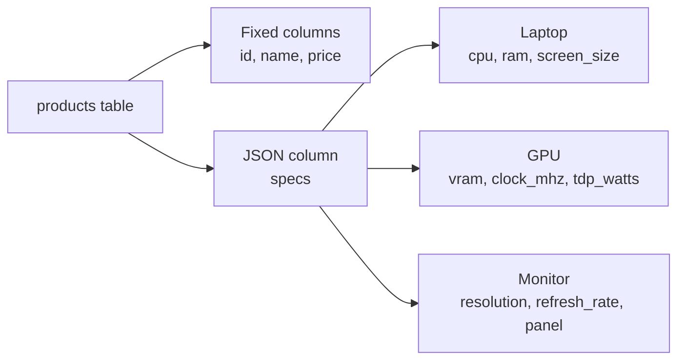

# Lesson 24: Querying JSON Data

Relational databases manage data with fixed schemas. But what about data like product specifications, where each category has different attributes? Laptops need `screen_size`, `cpu`, and `battery_hours`, while graphics cards need `vram`, `clock_mhz`, and `tdp_watts`. Creating separate columns for every category would fill the table with dozens of NULL columns.

**JSON columns** solve this problem. You can store flexible attributes without modifying the schema.



> The `products.specs` column is a TEXT type that stores JSON strings. SQL functions can extract and filter values inside the JSON.

## The products.specs Column

The `products` table in this database has a `specs` column. The JSON structure varies by category:

```sql
-- Examine specs for a few products
SELECT name, specs
FROM products
WHERE specs IS NOT NULL
LIMIT 3;
```

**Laptop example:**
```json
{"screen_size": "15.6 inch", "cpu": "Intel Core i7-13700H", "ram": "16GB", "storage": "512GB SSD", "battery_hours": 10}
```

**GPU example:**
```json
{"vram": "16GB", "clock_mhz": 2100, "tdp_watts": 300}
```

**Monitor example:**
```json
{"screen_size": "27 inch", "resolution": "QHD", "refresh_rate": 144, "panel": "IPS"}
```

## Extracting JSON Values

The syntax for extracting specific keys from JSON differs across databases.

=== "SQLite"
    ```sql
    -- Using json_extract function
    SELECT
        name,
        json_extract(specs, '$.cpu')     AS cpu,
        json_extract(specs, '$.ram')     AS ram,
        json_extract(specs, '$.storage') AS storage
    FROM products
    WHERE specs IS NOT NULL
      AND json_extract(specs, '$.cpu') IS NOT NULL
    LIMIT 5;

    -- Using ->> operator (SQLite 3.38+, returns text)
    SELECT
        name,
        specs->>'$.cpu' AS cpu,
        specs->>'$.ram' AS ram
    FROM products
    WHERE specs IS NOT NULL
      AND specs->>'$.cpu' IS NOT NULL
    LIMIT 5;
    ```

=== "MySQL"
    ```sql
    -- Using JSON_EXTRACT function
    SELECT
        name,
        JSON_EXTRACT(specs, '$.cpu')     AS cpu,
        JSON_EXTRACT(specs, '$.ram')     AS ram,
        JSON_EXTRACT(specs, '$.storage') AS storage
    FROM products
    WHERE specs IS NOT NULL
      AND JSON_EXTRACT(specs, '$.cpu') IS NOT NULL
    LIMIT 5;

    -- Using ->> operator (returns unquoted text)
    SELECT
        name,
        specs->>'$.cpu' AS cpu,
        specs->>'$.ram' AS ram
    FROM products
    WHERE specs IS NOT NULL
      AND specs->>'$.cpu' IS NOT NULL
    LIMIT 5;
    ```

=== "PostgreSQL"
    ```sql
    -- Using ->> operator (returns text)
    SELECT
        name,
        specs->>'cpu'     AS cpu,
        specs->>'ram'     AS ram,
        specs->>'storage' AS storage
    FROM products
    WHERE specs IS NOT NULL
      AND specs->>'cpu' IS NOT NULL
    LIMIT 5;

    -- Using jsonb_extract_path_text function
    SELECT
        name,
        jsonb_extract_path_text(specs, 'cpu') AS cpu,
        jsonb_extract_path_text(specs, 'ram') AS ram
    FROM products
    WHERE specs IS NOT NULL
      AND jsonb_extract_path_text(specs, 'cpu') IS NOT NULL
    LIMIT 5;
    ```

**Key differences:**

| Feature | SQLite | MySQL | PostgreSQL |
|---------|--------|-------|------------|
| Path syntax | `'$.key'` | `'$.key'` | `'key'` |
| Function | `json_extract()` | `JSON_EXTRACT()` | `jsonb_extract_path_text()` |
| Text operator | `->>'$.key'` | `->>'$.key'` | `->>'key'` |
| JSON operator | `->'$.key'` | `->'$.key'` | `->'key'` |

> The `->` operator returns a JSON type, while `->>` returns a text type. For comparisons in WHERE clauses, you typically use `->>` (text).

## JSON in WHERE Clauses

You can filter rows based on JSON values.

=== "SQLite"
    ```sql
    -- Find products with 32GB RAM
    SELECT name, price, specs->>'$.ram' AS ram
    FROM products
    WHERE specs->>'$.ram' = '32GB';

    -- Laptops with 10+ hours of battery
    SELECT name, price, json_extract(specs, '$.battery_hours') AS battery
    FROM products
    WHERE json_extract(specs, '$.battery_hours') >= 10
    ORDER BY json_extract(specs, '$.battery_hours') DESC;
    ```

=== "MySQL"
    ```sql
    -- Find products with 32GB RAM
    SELECT name, price, specs->>'$.ram' AS ram
    FROM products
    WHERE specs->>'$.ram' = '32GB';

    -- Laptops with 10+ hours of battery
    SELECT name, price, JSON_EXTRACT(specs, '$.battery_hours') AS battery
    FROM products
    WHERE JSON_EXTRACT(specs, '$.battery_hours') >= 10
    ORDER BY JSON_EXTRACT(specs, '$.battery_hours') DESC;
    ```

=== "PostgreSQL"
    ```sql
    -- Find products with 32GB RAM
    SELECT name, price, specs->>'ram' AS ram
    FROM products
    WHERE specs->>'ram' = '32GB';

    -- Laptops with 10+ hours of battery
    SELECT name, price, (specs->>'battery_hours')::int AS battery
    FROM products
    WHERE (specs->>'battery_hours')::int >= 10
    ORDER BY (specs->>'battery_hours')::int DESC;
    ```

!!! warning "PostgreSQL Type Casting"
    In PostgreSQL, the `->>` operator always returns text. For numeric comparisons, you must explicitly cast with `::int` or `::numeric`. SQLite and MySQL perform automatic type conversion.

## JSON Aggregation

JSON values can be used in GROUP BY and aggregate functions.

=== "SQLite"
    ```sql
    -- Product count and average price by CPU
    SELECT
        specs->>'$.cpu' AS cpu,
        COUNT(*)        AS product_count,
        ROUND(AVG(price)) AS avg_price
    FROM products
    WHERE specs->>'$.cpu' IS NOT NULL
    GROUP BY specs->>'$.cpu'
    ORDER BY product_count DESC;
    ```

=== "MySQL"
    ```sql
    -- Product count and average price by CPU
    SELECT
        specs->>'$.cpu' AS cpu,
        COUNT(*)        AS product_count,
        ROUND(AVG(price)) AS avg_price
    FROM products
    WHERE specs->>'$.cpu' IS NOT NULL
    GROUP BY specs->>'$.cpu'
    ORDER BY product_count DESC;
    ```

=== "PostgreSQL"
    ```sql
    -- Product count and average price by CPU
    SELECT
        specs->>'cpu' AS cpu,
        COUNT(*)      AS product_count,
        ROUND(AVG(price)) AS avg_price
    FROM products
    WHERE specs->>'cpu' IS NOT NULL
    GROUP BY specs->>'cpu'
    ORDER BY product_count DESC;
    ```

=== "SQLite"
    ```sql
    -- Average monitor price by resolution
    SELECT
        specs->>'$.resolution' AS resolution,
        COUNT(*)               AS cnt,
        ROUND(AVG(price))      AS avg_price,
        MIN(price)             AS min_price,
        MAX(price)             AS max_price
    FROM products
    WHERE specs->>'$.resolution' IS NOT NULL
    GROUP BY specs->>'$.resolution'
    ORDER BY avg_price DESC;
    ```

=== "MySQL"
    ```sql
    -- Average monitor price by resolution
    SELECT
        specs->>'$.resolution' AS resolution,
        COUNT(*)               AS cnt,
        ROUND(AVG(price))      AS avg_price,
        MIN(price)             AS min_price,
        MAX(price)             AS max_price
    FROM products
    WHERE specs->>'$.resolution' IS NOT NULL
    GROUP BY specs->>'$.resolution'
    ORDER BY avg_price DESC;
    ```

=== "PostgreSQL"
    ```sql
    -- Average monitor price by resolution
    SELECT
        specs->>'resolution' AS resolution,
        COUNT(*)             AS cnt,
        ROUND(AVG(price))    AS avg_price,
        MIN(price)           AS min_price,
        MAX(price)           AS max_price
    FROM products
    WHERE specs->>'resolution' IS NOT NULL
    GROUP BY specs->>'resolution'
    ORDER BY avg_price DESC;
    ```

## Listing JSON Keys

You can discover which keys exist in a JSON object.

=== "SQLite"
    ```sql
    -- List all distinct keys using json_each
    SELECT DISTINCT j.key
    FROM products, json_each(products.specs) AS j
    WHERE products.specs IS NOT NULL
    ORDER BY j.key;
    ```

=== "MySQL"
    ```sql
    -- JSON_KEYS returns a key array
    SELECT DISTINCT JSON_KEYS(specs) AS spec_keys
    FROM products
    WHERE specs IS NOT NULL
    LIMIT 10;
    ```

=== "PostgreSQL"
    ```sql
    -- jsonb_object_keys lists keys
    SELECT DISTINCT k
    FROM products, jsonb_object_keys(specs) AS k
    WHERE specs IS NOT NULL
    ORDER BY k;
    ```

## Modifying JSON Values

You can update specific keys or add new keys to existing JSON data.

=== "SQLite"
    ```sql
    -- json_set: update value (adds key if missing)
    UPDATE products
    SET specs = json_set(specs, '$.ram', '32GB')
    WHERE id = 1;

    -- json_insert: add only if key doesn't exist (no-op if exists)
    UPDATE products
    SET specs = json_insert(specs, '$.color', 'Silver')
    WHERE id = 1;

    -- json_remove: delete a key
    UPDATE products
    SET specs = json_remove(specs, '$.color')
    WHERE id = 1;
    ```

=== "MySQL"
    ```sql
    -- JSON_SET: update value (adds key if missing)
    UPDATE products
    SET specs = JSON_SET(specs, '$.ram', '32GB')
    WHERE id = 1;

    -- JSON_INSERT: add only if key doesn't exist (no-op if exists)
    UPDATE products
    SET specs = JSON_INSERT(specs, '$.color', 'Silver')
    WHERE id = 1;

    -- JSON_REMOVE: delete a key
    UPDATE products
    SET specs = JSON_REMOVE(specs, '$.color')
    WHERE id = 1;
    ```

=== "PostgreSQL"
    ```sql
    -- jsonb_set: update value (third arg true = add if missing)
    UPDATE products
    SET specs = jsonb_set(specs, '{ram}', '"32GB"')
    WHERE id = 1;

    -- || operator: add/merge keys
    UPDATE products
    SET specs = specs || '{"color": "Silver"}'::jsonb
    WHERE id = 1;

    -- - operator: delete a key
    UPDATE products
    SET specs = specs - 'color'
    WHERE id = 1;
    ```

**JSON modification function comparison:**

| Action | SQLite | MySQL | PostgreSQL |
|--------|--------|-------|------------|
| Set/update | `json_set()` | `JSON_SET()` | `jsonb_set()` |
| Insert only | `json_insert()` | `JSON_INSERT()` | `\|\|` operator |
| Remove | `json_remove()` | `JSON_REMOVE()` | `-` operator |

## JSON vs Normalization

JSON columns are powerful but not a silver bullet.

| Criteria | JSON Column | Separate Table (Normalized) |
|----------|------------|----------------------------|
| **Flexibility** | Add/remove attributes without schema changes | Requires ALTER TABLE |
| **Query performance** | Limited index support | Regular indexes, fast lookups |
| **Data integrity** | CHECK constraints are difficult | FK, NOT NULL, UNIQUE available |
| **Good for** | Category-specific attributes, settings, metadata | Core data frequently searched/joined |
| **Bad for** | Columns used in every JOIN/GROUP BY | Attributes that vary widely and change often |

> **Rule of thumb:** If a value is frequently used in WHERE or JOIN, make it a regular column. If it is supplementary data that is only displayed or occasionally filtered, JSON is a good fit.

!!! note "Lesson Review"
    Quick exercises to check your understanding of this lesson. For comprehensive practice combining multiple concepts, see the [Exercises](../exercises/index.md) section.

## Practice Exercises
### Exercise 1
Find all products with `'16GB'` RAM. Show the name, price, and RAM value, sorted by price in descending order.

??? success "Answer"
    === "SQLite"
        ```sql
        SELECT name, price, specs->>'$.ram' AS ram
        FROM products
        WHERE specs->>'$.ram' = '16GB'
        ORDER BY price DESC;
        ```

        **Expected result:**

        | name                                                             | price   | ram  |
        | ---------------------------------------------------------------- | ------: | ---- |
        | ASUS ROG Zephyrus G16                                            | 4284100 | 16GB |
        | ASUS ROG Strix G16CH 화이트                                         | 2988700 | 16GB |
        | HP EliteBook 840 G10 블랙 [특별 한정판 에디션] 무상 보증 3년 연장 + 전용 파우치 증정 이벤트 | 2389100 | 16GB |
        | Razer Blade 18                                                   | 2349600 | 16GB |
        | LG 그램 17 실버                                                      | 2336200 | 16GB |
        | ...                                                              | ...     | ...  |


        **Expected result:**

        | name                                                             | price   | ram  |
        | ---------------------------------------------------------------- | ------: | ---- |
        | ASUS ROG Zephyrus G16                                            | 4284100 | 16GB |
        | ASUS ROG Strix G16CH 화이트                                         | 2988700 | 16GB |
        | HP EliteBook 840 G10 블랙 [특별 한정판 에디션] 무상 보증 3년 연장 + 전용 파우치 증정 이벤트 | 2389100 | 16GB |
        | Razer Blade 18                                                   | 2349600 | 16GB |
        | LG 그램 17 실버                                                      | 2336200 | 16GB |
        | ...                                                              | ...     | ...  |


    === "MySQL"
        ```sql
        SELECT name, price, specs->>'$.ram' AS ram
        FROM products
        WHERE specs->>'$.ram' = '16GB'
        ORDER BY price DESC;
        ```

    === "PostgreSQL"
        ```sql
        SELECT name, price, specs->>'ram' AS ram
        FROM products
        WHERE specs->>'ram' = '16GB'
        ORDER BY price DESC;
        ```


### Exercise 2
Extract the product name and CPU value from the `products` table where the `specs` column is not NULL. Show only products that have a CPU value, and limit the results to 5 rows.

??? success "Answer"
    === "SQLite"
        ```sql
        SELECT name, specs->>'$.cpu' AS cpu
        FROM products
        WHERE specs IS NOT NULL
          AND specs->>'$.cpu' IS NOT NULL
        LIMIT 5;
        ```

        **Expected result:**

        | name                     | cpu                  |
        | ------------------------ | -------------------- |
        | Razer Blade 18 블랙        | Apple M3             |
        | LG 일체형PC 27V70Q 실버       | Intel Core i5-13600K |
        | Razer Blade 18 화이트       | Intel Core i9-13900H |
        | 한성 보스몬스터 DX9900 실버       | AMD Ryzen 5 7600X    |
        | ASUS ROG Strix G16CH 화이트 | AMD Ryzen 5 7600X    |


        **Expected result:**

        | name                     | cpu                  |
        | ------------------------ | -------------------- |
        | Razer Blade 18 블랙        | Apple M3             |
        | LG 일체형PC 27V70Q 실버       | Intel Core i5-13600K |
        | Razer Blade 18 화이트       | Intel Core i9-13900H |
        | 한성 보스몬스터 DX9900 실버       | AMD Ryzen 5 7600X    |
        | ASUS ROG Strix G16CH 화이트 | AMD Ryzen 5 7600X    |


    === "MySQL"
        ```sql
        SELECT name, specs->>'$.cpu' AS cpu
        FROM products
        WHERE specs IS NOT NULL
          AND specs->>'$.cpu' IS NOT NULL
        LIMIT 5;
        ```

    === "PostgreSQL"
        ```sql
        SELECT name, specs->>'cpu' AS cpu
        FROM products
        WHERE specs IS NOT NULL
          AND specs->>'cpu' IS NOT NULL
        LIMIT 5;
        ```


### Exercise 3
List all distinct keys used in the `specs` column across all products, in alphabetical order.

??? success "Answer"
    === "SQLite"
        ```sql
        SELECT DISTINCT j.key
        FROM products, json_each(products.specs) AS j
        WHERE products.specs IS NOT NULL
        ORDER BY j.key;
        ```

        **Expected result:**

        | key             |
        | --------------- |
        | base_clock_ghz  |
        | battery_hours   |
        | boost_clock_ghz |
        | capacity_gb     |
        | clock_mhz       |
        | ...             |


        **Expected result:**

        | key             |
        | --------------- |
        | base_clock_ghz  |
        | battery_hours   |
        | boost_clock_ghz |
        | capacity_gb     |
        | clock_mhz       |
        | ...             |


    === "MySQL"
        ```sql
        SELECT DISTINCT jk.key_name
        FROM products,
             JSON_TABLE(
                 JSON_KEYS(specs), '$[*]'
                 COLUMNS (key_name VARCHAR(100) PATH '$')
             ) AS jk
        WHERE specs IS NOT NULL
        ORDER BY jk.key_name;
        ```

    === "PostgreSQL"
        ```sql
        SELECT DISTINCT k
        FROM products, jsonb_object_keys(specs) AS k
        WHERE specs IS NOT NULL
        ORDER BY k;
        ```


### Exercise 4
Among products that have a `cpu` key in their specs, find the 3 most expensive ones. Show the name, CPU, and price.

??? success "Answer"
    === "SQLite"
        ```sql
        SELECT name, specs->>'$.cpu' AS cpu, price
        FROM products
        WHERE specs->>'$.cpu' IS NOT NULL
        ORDER BY price DESC
        LIMIT 3;
        ```

        **Expected result:**

        | name                  | cpu                  | price   |
        | --------------------- | -------------------- | ------: |
        | ASUS ROG Strix GT35   | Intel Core i7-13700K | 4314800 |
        | ASUS ROG Zephyrus G16 | Apple M3             | 4284100 |
        | Razer Blade 18 블랙     | Intel Core i7-13700H | 4182100 |


        **Expected result:**

        | name                  | cpu                  | price   |
        | --------------------- | -------------------- | ------: |
        | ASUS ROG Strix GT35   | Intel Core i7-13700K | 4314800 |
        | ASUS ROG Zephyrus G16 | Apple M3             | 4284100 |
        | Razer Blade 18 블랙     | Intel Core i7-13700H | 4182100 |


    === "MySQL"
        ```sql
        SELECT name, specs->>'$.cpu' AS cpu, price
        FROM products
        WHERE specs->>'$.cpu' IS NOT NULL
        ORDER BY price DESC
        LIMIT 3;
        ```

    === "PostgreSQL"
        ```sql
        SELECT name, specs->>'cpu' AS cpu, price
        FROM products
        WHERE specs->>'cpu' IS NOT NULL
        ORDER BY price DESC
        LIMIT 3;
        ```


### Exercise 5
Find laptops with a battery life of 12 hours or more. Show the name, price, and battery hours, sorted by battery hours descending.

??? success "Answer"
    === "SQLite"
        ```sql
        SELECT
            name,
            price,
            json_extract(specs, '$.battery_hours') AS battery_hours
        FROM products
        WHERE json_extract(specs, '$.battery_hours') >= 12
        ORDER BY json_extract(specs, '$.battery_hours') DESC;
        ```

    === "MySQL"
        ```sql
        SELECT
            name,
            price,
            JSON_EXTRACT(specs, '$.battery_hours') AS battery_hours
        FROM products
        WHERE JSON_EXTRACT(specs, '$.battery_hours') >= 12
        ORDER BY JSON_EXTRACT(specs, '$.battery_hours') DESC;
        ```

    === "PostgreSQL"
        ```sql
        SELECT
            name,
            price,
            (specs->>'battery_hours')::int AS battery_hours
        FROM products
        WHERE (specs->>'battery_hours')::int >= 12
        ORDER BY (specs->>'battery_hours')::int DESC;
        ```


### Exercise 6
Find GPU products with VRAM of `'16GB'` or more. Show the name, price, VRAM, and TDP (power consumption), sorted by TDP ascending.

??? success "Answer"
    === "SQLite"
        ```sql
        SELECT
            name,
            price,
            specs->>'$.vram'      AS vram,
            json_extract(specs, '$.tdp_watts') AS tdp_watts
        FROM products
        WHERE specs->>'$.vram' IN ('16GB', '24GB')
        ORDER BY json_extract(specs, '$.tdp_watts');
        ```

    === "MySQL"
        ```sql
        SELECT
            name,
            price,
            specs->>'$.vram'      AS vram,
            JSON_EXTRACT(specs, '$.tdp_watts') AS tdp_watts
        FROM products
        WHERE specs->>'$.vram' IN ('16GB', '24GB')
        ORDER BY JSON_EXTRACT(specs, '$.tdp_watts');
        ```

    === "PostgreSQL"
        ```sql
        SELECT
            name,
            price,
            specs->>'vram'      AS vram,
            (specs->>'tdp_watts')::int AS tdp_watts
        FROM products
        WHERE specs->>'vram' IN ('16GB', '24GB')
        ORDER BY (specs->>'tdp_watts')::int;
        ```


### Exercise 7
Write an UPDATE statement to add a `"color"` key with value `"Space Gray"` to the specs of product ID 1. Then query the product to verify the addition.

??? success "Answer"
    === "SQLite"
        ```sql
        -- Add the key
        UPDATE products
        SET specs = json_set(specs, '$.color', 'Space Gray')
        WHERE id = 1;

        -- Verify
        SELECT name, specs->>'$.color' AS color
        FROM products
        WHERE id = 1;
        ```

    === "MySQL"
        ```sql
        -- Add the key
        UPDATE products
        SET specs = JSON_SET(specs, '$.color', 'Space Gray')
        WHERE id = 1;

        -- Verify
        SELECT name, specs->>'$.color' AS color
        FROM products
        WHERE id = 1;
        ```

    === "PostgreSQL"
        ```sql
        -- Add the key
        UPDATE products
        SET specs = specs || '{"color": "Space Gray"}'::jsonb
        WHERE id = 1;

        -- Verify
        SELECT name, specs->>'color' AS color
        FROM products
        WHERE id = 1;
        ```


### Exercise 8
Write an UPDATE statement to remove the `"color"` key added in Exercise 8 from the specs of product ID 1. Verify the removal.

??? success "Answer"
    === "SQLite"
        ```sql
        -- Remove the key
        UPDATE products
        SET specs = json_remove(specs, '$.color')
        WHERE id = 1;

        -- Verify (should be NULL)
        SELECT name, specs->>'$.color' AS color
        FROM products
        WHERE id = 1;
        ```

    === "MySQL"
        ```sql
        -- Remove the key
        UPDATE products
        SET specs = JSON_REMOVE(specs, '$.color')
        WHERE id = 1;

        -- Verify (should be NULL)
        SELECT name, specs->>'$.color' AS color
        FROM products
        WHERE id = 1;
        ```

    === "PostgreSQL"
        ```sql
        -- Remove the key
        UPDATE products
        SET specs = specs - 'color'
        WHERE id = 1;

        -- Verify (should be NULL)
        SELECT name, specs->>'color' AS color
        FROM products
        WHERE id = 1;
        ```


### Exercise 9
Group products that have a `screen_size` key in their specs by screen size. Show the product count and average price for each group, sorted by product count descending.

??? success "Answer"
    === "SQLite"
        ```sql
        SELECT
            specs->>'$.screen_size' AS screen_size,
            COUNT(*)                AS product_count,
            ROUND(AVG(price))       AS avg_price
        FROM products
        WHERE specs->>'$.screen_size' IS NOT NULL
        GROUP BY specs->>'$.screen_size'
        ORDER BY product_count DESC;
        ```

        **Expected result:**

        | screen_size | product_count | avg_price |
        | ----------- | ------------: | --------: |
        | 14 inch     |            13 |   2264508 |
        | 27 inch     |            12 |   1167542 |
        | 15.6 inch   |            10 |   1947630 |
        | 32 inch     |             6 |   1001150 |
        | 16 inch     |             6 |   2453700 |
        | ...         | ...           | ...       |


        **Expected result:**

        | screen_size | product_count | avg_price |
        | ----------- | ------------: | --------: |
        | 14 inch     |            13 |   2264508 |
        | 27 inch     |            12 |   1167542 |
        | 15.6 inch   |            10 |   1947630 |
        | 32 inch     |             6 |   1001150 |
        | 16 inch     |             6 |   2453700 |
        | ...         | ...           | ...       |


    === "MySQL"
        ```sql
        SELECT
            specs->>'$.screen_size' AS screen_size,
            COUNT(*)                AS product_count,
            ROUND(AVG(price))       AS avg_price
        FROM products
        WHERE specs->>'$.screen_size' IS NOT NULL
        GROUP BY specs->>'$.screen_size'
        ORDER BY product_count DESC;
        ```

    === "PostgreSQL"
        ```sql
        SELECT
            specs->>'screen_size' AS screen_size,
            COUNT(*)              AS product_count,
            ROUND(AVG(price))     AS avg_price
        FROM products
        WHERE specs->>'screen_size' IS NOT NULL
        GROUP BY specs->>'screen_size'
        ORDER BY product_count DESC;
        ```


### Exercise 10
Aggregate monitors by panel type (`panel`). Show the product count, average refresh rate (`refresh_rate`), and maximum refresh rate for each panel type.

??? success "Answer"
    === "SQLite"
        ```sql
        SELECT
            specs->>'$.panel'                             AS panel,
            COUNT(*)                                      AS product_count,
            ROUND(AVG(json_extract(specs, '$.refresh_rate'))) AS avg_refresh_rate,
            MAX(json_extract(specs, '$.refresh_rate'))    AS max_refresh_rate
        FROM products
        WHERE specs->>'$.panel' IS NOT NULL
        GROUP BY specs->>'$.panel'
        ORDER BY avg_refresh_rate DESC;
        ```

    === "MySQL"
        ```sql
        SELECT
            specs->>'$.panel'                                   AS panel,
            COUNT(*)                                            AS product_count,
            ROUND(AVG(JSON_EXTRACT(specs, '$.refresh_rate')))   AS avg_refresh_rate,
            MAX(JSON_EXTRACT(specs, '$.refresh_rate'))           AS max_refresh_rate
        FROM products
        WHERE specs->>'$.panel' IS NOT NULL
        GROUP BY specs->>'$.panel'
        ORDER BY avg_refresh_rate DESC;
        ```

    === "PostgreSQL"
        ```sql
        SELECT
            specs->>'panel'                                   AS panel,
            COUNT(*)                                          AS product_count,
            ROUND(AVG((specs->>'refresh_rate')::int))         AS avg_refresh_rate,
            MAX((specs->>'refresh_rate')::int)                AS max_refresh_rate
        FROM products
        WHERE specs->>'panel' IS NOT NULL
        GROUP BY specs->>'panel'
        ORDER BY avg_refresh_rate DESC;
        ```


---

With JSON functions, you can enjoy the flexibility of dynamic data structures alongside the power of relational queries.

Next: [Lesson 25: Stored Procedures](25-stored-procedures.md)
