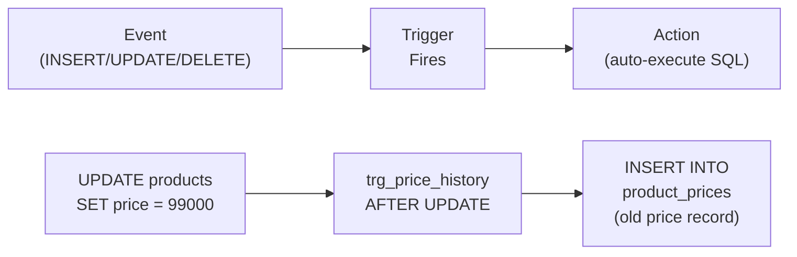

# Lesson 24: Triggers

**A Trigger** is a database object that automatically executes a SQL block when a data change event (`INSERT`, `UPDATE`, `DELETE`) occurs on a specific table. Triggers enforce business rules, maintain audit trails, and synchronize derived data. All of this can be handled without application code.



> A trigger automatically executes SQL when an event (INSERT/UPDATE/DELETE) occurs on a table.

**Common real-world scenarios for triggers:**

- **Audit logs:** Automatically record who changed what data and when (price change history, grade change history)
- **Derived data sync:** Automatically restore stock on order cancellation, automatically award points on review submission
- **Enhanced data integrity:** Apply complex business rules that cannot be expressed with CHECK constraints

The TechShop database comes with 5 pre-installed triggers. In this lesson, you will learn how triggers are structured, how to create new triggers, and how to analyze existing ones.

Trigger syntax varies significantly across databases. SQLite is the simplest, MySQL requires `DELIMITER` changes, and PostgreSQL requires creating a separate function first.


!!! note "Already familiar?"
    If you are comfortable with triggers (AFTER INSERT/UPDATE/DELETE, OLD/NEW), skip ahead to [Lesson 25: JSON](25-json.md).

## Trigger Syntax

=== "SQLite"
    ```sql
    CREATE TRIGGER trigger_name
        BEFORE | AFTER | INSTEAD OF
        INSERT | UPDATE | DELETE
        ON table_name
        [WHEN condition]
    BEGIN
        -- SQL statements;
    END;
    ```

=== "MySQL"
    ```sql
    DELIMITER //
    CREATE TRIGGER trigger_name
        BEFORE | AFTER
        INSERT | UPDATE | DELETE
        ON table_name
        FOR EACH ROW
    BEGIN
        -- SQL statements;
    END //
    DELIMITER ;
    ```

=== "PostgreSQL"
    ```sql
    -- Step 1: Create a trigger function
    CREATE OR REPLACE FUNCTION trigger_function_name()
    RETURNS TRIGGER AS $$
    BEGIN
        -- SQL statements;
        RETURN NEW;  -- or RETURN OLD for DELETE triggers
    END;
    $$ LANGUAGE plpgsql;

    -- Step 2: Attach the function to a trigger
    CREATE TRIGGER trigger_name
        BEFORE | AFTER
        INSERT | UPDATE | DELETE
        ON table_name
        FOR EACH ROW
        EXECUTE FUNCTION trigger_function_name();
    ```

- `BEFORE` -- Executes before the row is changed (used for validation or value modification)
- `AFTER` -- Executes after the row is changed (used for logging and cascading)
- `NEW` -- References the inserted row or new values after UPDATE
- `OLD` -- References the deleted row or previous values before UPDATE

## Pre-installed Triggers

This database includes 5 pre-installed triggers. Check them as follows:

=== "SQLite"
    ```sql
    -- List all triggers
    SELECT name, tbl_name, sql
    FROM sqlite_master
    WHERE type = 'trigger'
    ORDER BY name;
    ```

=== "MySQL"
    ```sql
    -- List all triggers
    SELECT TRIGGER_NAME, EVENT_OBJECT_TABLE, ACTION_STATEMENT
    FROM INFORMATION_SCHEMA.TRIGGERS
    WHERE TRIGGER_SCHEMA = DATABASE()
    ORDER BY TRIGGER_NAME;
    ```

=== "PostgreSQL"
    ```sql
    -- List all triggers
    SELECT tgname, relname, pg_get_triggerdef(t.oid)
    FROM pg_trigger t
    JOIN pg_class c ON t.tgrelid = c.oid
    WHERE NOT t.tgisinternal
    ORDER BY tgname;
    ```

| Trigger | Table | Fires On | Purpose |
|---------|-------|----------|---------|
| `trg_update_product_timestamp` | products | AFTER UPDATE | Auto-set `updated_at = datetime('now')` |
| `trg_update_customer_timestamp` | customers | AFTER UPDATE | Auto-set `updated_at = datetime('now')` |
| `trg_earn_points_on_order` | orders | AFTER INSERT | Award loyalty points on new order insert |
| `trg_adjust_stock_on_order` | order_items | AFTER INSERT | Decrease `products.stock_qty` on order item insert |
| `trg_restore_stock_on_cancel` | orders | AFTER UPDATE | Restore `products.stock_qty` on order cancellation |

## Checking Trigger Definitions

=== "SQLite"
    ```sql
    -- Check full SQL of a specific trigger
    SELECT sql
    FROM sqlite_master
    WHERE type = 'trigger'
      AND name = 'trg_adjust_stock_on_order';
    ```

=== "MySQL"
    ```sql
    -- Check full SQL of a specific trigger
    SHOW CREATE TRIGGER trg_adjust_stock_on_order;
    ```

=== "PostgreSQL"
    ```sql
    -- Check full SQL of a specific trigger
    SELECT pg_get_triggerdef(oid)
    FROM pg_trigger
    WHERE tgname = 'trg_adjust_stock_on_order';
    ```

**Result (example):**

```sql
CREATE TRIGGER trg_adjust_stock_on_order
AFTER INSERT ON order_items
BEGIN
    UPDATE products
    SET stock_qty  = stock_qty - NEW.quantity,
        updated_at = datetime('now')
    WHERE id = NEW.product_id;
END
```

Each time a row is inserted into `order_items`, this trigger automatically deducts the stock of the corresponding product.

=== "SQLite"
    ```sql
    -- Check points trigger
    SELECT sql
    FROM sqlite_master
    WHERE type = 'trigger'
      AND name = 'trg_earn_points_on_order';
    ```

=== "MySQL"
    ```sql
    -- Check points trigger
    SHOW CREATE TRIGGER trg_earn_points_on_order;
    ```

=== "PostgreSQL"
    ```sql
    -- Check points trigger
    SELECT pg_get_triggerdef(oid)
    FROM pg_trigger
    WHERE tgname = 'trg_earn_points_on_order';
    ```

**Result (example):**

```sql
CREATE TRIGGER trg_earn_points_on_order
AFTER INSERT ON orders
BEGIN
    UPDATE customers
    SET point_balance = point_balance + NEW.point_earned,
        updated_at    = datetime('now')
    WHERE id = NEW.customer_id;
END
```

## Verifying Trigger Behavior

You can verify triggers work correctly by observing the state before and after changes:

```sql
-- Check current stock of product 5
SELECT id, name, stock_qty FROM products WHERE id = 5;
-- 결과: stock_qty = 42

-- Insert order item (trigger fires automatically)
INSERT INTO order_items (order_id, product_id, quantity, unit_price, total_price)
VALUES (99999, 5, 3, 99.99, 299.97);

-- Re-check stock — should be 42 - 3 = 39
SELECT id, name, stock_qty FROM products WHERE id = 5;
-- 결과: stock_qty = 39
```

## Writing New Triggers

=== "SQLite"
    ```sql
    -- Audit table for price changes
    CREATE TABLE IF NOT EXISTS price_change_log (
        id          INTEGER PRIMARY KEY AUTOINCREMENT,
        product_id  INTEGER,
        old_price   REAL,
        new_price   REAL,
        changed_at  TEXT DEFAULT (datetime('now'))
    );

    -- Trigger
    CREATE TRIGGER IF NOT EXISTS trg_log_price_change
    AFTER UPDATE OF price ON products
    WHEN OLD.price <> NEW.price
    BEGIN
        INSERT INTO price_change_log (product_id, old_price, new_price)
        VALUES (NEW.id, OLD.price, NEW.price);
    END;
    ```

=== "MySQL"
    ```sql
    -- Audit table for price changes
    CREATE TABLE IF NOT EXISTS price_change_log (
        id          INT AUTO_INCREMENT PRIMARY KEY,
        product_id  INT,
        old_price   DECIMAL(10,2),
        new_price   DECIMAL(10,2),
        changed_at  DATETIME DEFAULT NOW()
    );

    -- Trigger
    DELIMITER //
    CREATE TRIGGER trg_log_price_change
    AFTER UPDATE ON products
    FOR EACH ROW
    BEGIN
        IF OLD.price <> NEW.price THEN
            INSERT INTO price_change_log (product_id, old_price, new_price)
            VALUES (NEW.id, OLD.price, NEW.price);
        END IF;
    END //
    DELIMITER ;
    ```

=== "PostgreSQL"
    ```sql
    -- Audit table for price changes
    CREATE TABLE IF NOT EXISTS price_change_log (
        id          SERIAL PRIMARY KEY,
        product_id  INTEGER,
        old_price   NUMERIC(10,2),
        new_price   NUMERIC(10,2),
        changed_at  TIMESTAMP DEFAULT NOW()
    );

    -- Trigger function
    CREATE OR REPLACE FUNCTION fn_log_price_change()
    RETURNS TRIGGER AS $$
    BEGIN
        IF OLD.price <> NEW.price THEN
            INSERT INTO price_change_log (product_id, old_price, new_price)
            VALUES (NEW.id, OLD.price, NEW.price);
        END IF;
        RETURN NEW;
    END;
    $$ LANGUAGE plpgsql;

    -- Trigger
    CREATE TRIGGER trg_log_price_change
    AFTER UPDATE OF price ON products
    FOR EACH ROW
    EXECUTE FUNCTION fn_log_price_change();
    ```

Now every price change is automatically recorded:

```sql
UPDATE products SET price = 1349.99 WHERE id = 1;

SELECT * FROM price_change_log;
-- product_id=1, old_price=1299.99, new_price=1349.99
```

## Dropping Triggers

```sql
DROP TRIGGER IF EXISTS trg_log_price_change;
DROP TABLE IF EXISTS price_change_log;
```

## Trigger Usage Guide

| Recommended Use | Avoid |
|----------|-------|
| Audit logs | Complex business logic (hard to debug) |
| Maintaining `updated_at` timestamps | Triggers excessively invoking other triggers |
| Cascading derived data (stock, points) | Replacing application-level validation |
| Maintaining denormalized summary data | Write-performance-critical paths |

## Summary

| Concept | Description | Example |
|------|------|------|
| CREATE TRIGGER | Create a trigger | `CREATE TRIGGER trg AFTER INSERT ON t` |
| BEFORE / AFTER | Execution timing before/after event | `BEFORE UPDATE`, `AFTER DELETE` |
| OLD / NEW | Reference row before/after change | `OLD.price`, `NEW.status` |
| WHEN condition | Execute only under specific conditions | `WHEN NEW.price <> OLD.price` |
| RAISE(ABORT) | Raise error from trigger (SQLite) | `SELECT RAISE(ABORT, '메시지')` |
| DROP TRIGGER | Drop a trigger | `DROP TRIGGER IF EXISTS trg` |
| System catalog | Query trigger list | `sqlite_master WHERE type='trigger'` |

!!! note "Lesson Review Problems"
    These are simple problems to immediately test the concepts learned in this lesson. For comprehensive practice combining multiple concepts, see the [Practice Problems](../exercises/index.md) section.

## Practice Problems
### Problem 1
Query the full SQL definition of the `trg_earn_points_on_order` trigger from the system catalog. Explain which table it fires on, which event triggers it, and which table it modifies.

??? success "Answer"
    === "SQLite"
        ```sql
        SELECT sql
        FROM sqlite_master
        WHERE type = 'trigger'
          AND name = 'trg_earn_points_on_order';
        ```

    === "MySQL"
        ```sql
        SHOW CREATE TRIGGER trg_earn_points_on_order;
        ```

    === "PostgreSQL"
        ```sql
        SELECT pg_get_triggerdef(oid)
        FROM pg_trigger
        WHERE tgname = 'trg_earn_points_on_order';
        ```
    This trigger fires when a new row is INSERTed into the `orders` table, and increases the `customers` table's `point_balance` by `NEW.point_earned`.


### Problem 2
Using a WHEN condition, write a trigger `trg_log_expensive_price_change` that logs only when a product price is changed to 1,000,000 or more. Assume the `price_change_log` table already exists.

??? success "Answer"
    === "SQLite"
        ```sql
        CREATE TRIGGER IF NOT EXISTS trg_log_expensive_price_change
        AFTER UPDATE OF price ON products
        WHEN NEW.price >= 1000000 AND OLD.price <> NEW.price
        BEGIN
            INSERT INTO price_change_log (product_id, old_price, new_price)
            VALUES (NEW.id, OLD.price, NEW.price);
        END;
        ```

    === "MySQL"
        ```sql
        DELIMITER //
        CREATE TRIGGER trg_log_expensive_price_change
        AFTER UPDATE ON products
        FOR EACH ROW
        BEGIN
            IF NEW.price >= 1000000 AND OLD.price <> NEW.price THEN
                INSERT INTO price_change_log (product_id, old_price, new_price)
                VALUES (NEW.id, OLD.price, NEW.price);
            END IF;
        END //
        DELIMITER ;
        ```

    === "PostgreSQL"
        ```sql
        CREATE OR REPLACE FUNCTION fn_log_expensive_price_change()
        RETURNS TRIGGER AS $$
        BEGIN
            IF NEW.price >= 1000000 AND OLD.price <> NEW.price THEN
                INSERT INTO price_change_log (product_id, old_price, new_price)
                VALUES (NEW.id, OLD.price, NEW.price);
            END IF;
            RETURN NEW;
        END;
        $$ LANGUAGE plpgsql;

        CREATE TRIGGER trg_log_expensive_price_change
        AFTER UPDATE OF price ON products
        FOR EACH ROW
        EXECUTE FUNCTION fn_log_expensive_price_change();
        ```


### Problem 3
Write an AFTER INSERT trigger `trg_review_created_at` that automatically sets the review's `created_at` to the current time when a new review is registered.

??? success "Answer"
    === "SQLite"
        ```sql
        CREATE TRIGGER IF NOT EXISTS trg_review_created_at
        AFTER INSERT ON reviews
        WHEN NEW.created_at IS NULL
        BEGIN
            UPDATE reviews
            SET created_at = datetime('now')
            WHERE id = NEW.id;
        END;
        ```

    === "MySQL"
        ```sql
        DELIMITER //
        CREATE TRIGGER trg_review_created_at
        BEFORE INSERT ON reviews
        FOR EACH ROW
        BEGIN
            IF NEW.created_at IS NULL THEN
                SET NEW.created_at = NOW();
            END IF;
        END //
        DELIMITER ;
        ```

    === "PostgreSQL"
        ```sql
        CREATE OR REPLACE FUNCTION fn_review_created_at()
        RETURNS TRIGGER AS $$
        BEGIN
            IF NEW.created_at IS NULL THEN
                NEW.created_at := NOW();
            END IF;
            RETURN NEW;
        END;
        $$ LANGUAGE plpgsql;

        CREATE TRIGGER trg_review_created_at
        BEFORE INSERT ON reviews
        FOR EACH ROW
        EXECUTE FUNCTION fn_review_created_at();
        ```


### Problem 4
Use the system catalog (`sqlite_master` for SQLite) to list all 5 pre-installed triggers. For each trigger, display the name, target table, and whether it fires on `INSERT`, `UPDATE`, or `DELETE` based on the trigger definition.

??? success "Answer"
    === "SQLite"
        ```sql
        SELECT
            name,
            tbl_name,
            CASE
                WHEN sql LIKE '%AFTER INSERT%'  THEN 'AFTER INSERT'
                WHEN sql LIKE '%AFTER UPDATE%'  THEN 'AFTER UPDATE'
                WHEN sql LIKE '%AFTER DELETE%'  THEN 'AFTER DELETE'
                WHEN sql LIKE '%BEFORE INSERT%' THEN 'BEFORE INSERT'
                WHEN sql LIKE '%BEFORE UPDATE%' THEN 'BEFORE UPDATE'
                WHEN sql LIKE '%BEFORE DELETE%' THEN 'BEFORE DELETE'
            END AS fires_on
        FROM sqlite_master
        WHERE type = 'trigger'
        ORDER BY name;
        ```

        **Result (example):**

| name | tbl_name | fires_on |
| ---------- | ---------- | ---------- |
| trg_customers_updated_at | customers | AFTER UPDATE |
| trg_orders_updated_at | orders | AFTER UPDATE |
| trg_product_price_history | products | AFTER UPDATE |
| trg_products_updated_at | products | AFTER UPDATE |
| trg_reviews_updated_at | reviews | AFTER UPDATE |
| ... | ... | ... |


    === "MySQL"
        ```sql
        SELECT
            TRIGGER_NAME,
            EVENT_OBJECT_TABLE,
            CONCAT(ACTION_TIMING, ' ', EVENT_MANIPULATION) AS fires_on
        FROM INFORMATION_SCHEMA.TRIGGERS
        WHERE TRIGGER_SCHEMA = DATABASE()
        ORDER BY TRIGGER_NAME;
        ```

    === "PostgreSQL"
        ```sql
        SELECT
            tgname,
            relname,
            CASE
                WHEN tgtype & 2  > 0 THEN 'BEFORE'
                WHEN tgtype & 64 > 0 THEN 'INSTEAD OF'
                ELSE 'AFTER'
            END || ' ' ||
            CASE
                WHEN tgtype & 4  > 0 THEN 'INSERT'
                WHEN tgtype & 8  > 0 THEN 'DELETE'
                WHEN tgtype & 16 > 0 THEN 'UPDATE'
            END AS fires_on
        FROM pg_trigger t
        JOIN pg_class c ON t.tgrelid = c.oid
        WHERE NOT t.tgisinternal
        ORDER BY tgname;
        ```


### Problem 5
Write a BEFORE DELETE trigger `trg_prevent_staff_delete` that checks whether the employee has active orders before deletion, and prevents the deletion if they do.

??? success "Answer"
    === "SQLite"
        ```sql
        CREATE TRIGGER IF NOT EXISTS trg_prevent_staff_delete
        BEFORE DELETE ON staff
        WHEN (SELECT COUNT(*) FROM orders WHERE staff_id = OLD.id AND status NOT IN ('delivered', 'cancelled')) > 0
        BEGIN
            SELECT RAISE(ABORT, 'Cannot delete staff with active orders.');
        END;
        ```

    === "MySQL"
        ```sql
        DELIMITER //
        CREATE TRIGGER trg_prevent_staff_delete
        BEFORE DELETE ON staff
        FOR EACH ROW
        BEGIN
            DECLARE active_orders INT;
            SELECT COUNT(*) INTO active_orders
            FROM orders
            WHERE staff_id = OLD.id
              AND status NOT IN ('delivered', 'cancelled');
            IF active_orders > 0 THEN
                SIGNAL SQLSTATE '45000'
                SET MESSAGE_TEXT = 'Cannot delete staff with active orders.';
            END IF;
        END //
        DELIMITER ;
        ```

    === "PostgreSQL"
        ```sql
        CREATE OR REPLACE FUNCTION fn_prevent_staff_delete()
        RETURNS TRIGGER AS $$
        BEGIN
            IF (SELECT COUNT(*) FROM orders WHERE staff_id = OLD.id AND status NOT IN ('delivered', 'cancelled')) > 0 THEN
                RAISE EXCEPTION 'Cannot delete staff with active orders.';
            END IF;
            RETURN OLD;
        END;
        $$ LANGUAGE plpgsql;

        CREATE TRIGGER trg_prevent_staff_delete
        BEFORE DELETE ON staff
        FOR EACH ROW
        EXECUTE FUNCTION fn_prevent_staff_delete();
        ```


### Problem 6
Implement an audit log that records changes when a customer grade (`grade`) is modified. First create a `grade_change_log` table (`customer_id`, `old_grade`, `new_grade`, `changed_at`), then write an AFTER UPDATE trigger on the `customers` table. Use `OLD` and `NEW` to record the before/after grades.

??? success "Answer"
    === "SQLite"
        ```sql
        CREATE TABLE IF NOT EXISTS grade_change_log (
            id          INTEGER PRIMARY KEY AUTOINCREMENT,
            customer_id INTEGER,
            old_grade   TEXT,
            new_grade   TEXT,
            changed_at  TEXT DEFAULT (datetime('now'))
        );

        CREATE TRIGGER IF NOT EXISTS trg_log_grade_change
        AFTER UPDATE OF grade ON customers
        WHEN OLD.grade <> NEW.grade
        BEGIN
            INSERT INTO grade_change_log (customer_id, old_grade, new_grade)
            VALUES (NEW.id, OLD.grade, NEW.grade);
        END;
        ```

    === "MySQL"
        ```sql
        CREATE TABLE IF NOT EXISTS grade_change_log (
            id          INT AUTO_INCREMENT PRIMARY KEY,
            customer_id INT,
            old_grade   VARCHAR(20),
            new_grade   VARCHAR(20),
            changed_at  DATETIME DEFAULT NOW()
        );

        DELIMITER //
        CREATE TRIGGER trg_log_grade_change
        AFTER UPDATE ON customers
        FOR EACH ROW
        BEGIN
            IF OLD.grade <> NEW.grade THEN
                INSERT INTO grade_change_log (customer_id, old_grade, new_grade)
                VALUES (NEW.id, OLD.grade, NEW.grade);
            END IF;
        END //
        DELIMITER ;
        ```

    === "PostgreSQL"
        ```sql
        CREATE TABLE IF NOT EXISTS grade_change_log (
            id          SERIAL PRIMARY KEY,
            customer_id INTEGER,
            old_grade   VARCHAR(20),
            new_grade   VARCHAR(20),
            changed_at  TIMESTAMP DEFAULT NOW()
        );

        CREATE OR REPLACE FUNCTION fn_log_grade_change()
        RETURNS TRIGGER AS $$
        BEGIN
            IF OLD.grade <> NEW.grade THEN
                INSERT INTO grade_change_log (customer_id, old_grade, new_grade)
                VALUES (NEW.id, OLD.grade, NEW.grade);
            END IF;
            RETURN NEW;
        END;
        $$ LANGUAGE plpgsql;

        CREATE TRIGGER trg_log_grade_change
        AFTER UPDATE OF grade ON customers
        FOR EACH ROW
        EXECUTE FUNCTION fn_log_grade_change();
        ```


### Problem 7
Drop all triggers and tables created in Problems 3-6 to restore the original state.

??? success "Answer"
    === "SQLite"
        ```sql
        DROP TRIGGER IF EXISTS trg_review_created_at;
        DROP TRIGGER IF EXISTS trg_log_grade_change;
        DROP TRIGGER IF EXISTS trg_prevent_staff_delete;
        DROP TRIGGER IF EXISTS trg_log_expensive_price_change;
        DROP TABLE IF EXISTS grade_change_log;
        ```

    === "MySQL"
        ```sql
        DROP TRIGGER IF EXISTS trg_review_created_at;
        DROP TRIGGER IF EXISTS trg_log_grade_change;
        DROP TRIGGER IF EXISTS trg_prevent_staff_delete;
        DROP TRIGGER IF EXISTS trg_log_expensive_price_change;
        DROP TABLE IF EXISTS grade_change_log;
        ```

    === "PostgreSQL"
        ```sql
        DROP TRIGGER IF EXISTS trg_review_created_at ON reviews;
        DROP TRIGGER IF EXISTS trg_log_grade_change ON customers;
        DROP TRIGGER IF EXISTS trg_prevent_staff_delete ON staff;
        DROP TRIGGER IF EXISTS trg_log_expensive_price_change ON products;
        DROP FUNCTION IF EXISTS fn_review_created_at();
        DROP FUNCTION IF EXISTS fn_log_grade_change();
        DROP FUNCTION IF EXISTS fn_prevent_staff_delete();
        DROP FUNCTION IF EXISTS fn_log_expensive_price_change();
        DROP TABLE IF EXISTS grade_change_log;
        ```


### Problem 8
Query the definition of the `trg_restore_stock_on_cancel` trigger from the system catalog (`sqlite_master` for SQLite). Then query the stock of products included in cancelled orders to verify that stock was correctly restored at the time of cancellation.

??? success "Answer"
    === "SQLite"
        ```sql
        -- Step 1: Check trigger definition
        SELECT sql
        FROM sqlite_master
        WHERE type = 'trigger'
          AND name = 'trg_restore_stock_on_cancel';

        -- Step 2: Check cancelled orders and their products
        SELECT o.id AS order_id, oi.product_id, oi.quantity, p.stock_qty
        FROM orders AS o
        INNER JOIN order_items AS oi ON oi.order_id = o.id
        INNER JOIN products    AS p  ON p.id = oi.product_id
        WHERE o.status = 'cancelled'
        LIMIT 5;
        -- stock_qty should already reflect the restored quantity
        ```

    === "MySQL"
        ```sql
        -- Step 1: Check trigger definition
        SHOW CREATE TRIGGER trg_restore_stock_on_cancel;

        -- Step 2: Check cancelled orders and their products
        SELECT o.id AS order_id, oi.product_id, oi.quantity, p.stock_qty
        FROM orders AS o
        INNER JOIN order_items AS oi ON oi.order_id = o.id
        INNER JOIN products    AS p  ON p.id = oi.product_id
        WHERE o.status = 'cancelled'
        LIMIT 5;
        -- stock_qty should already reflect the restored quantity
        ```

    === "PostgreSQL"
        ```sql
        -- Step 1: Check trigger definition
        SELECT pg_get_triggerdef(oid)
        FROM pg_trigger
        WHERE tgname = 'trg_restore_stock_on_cancel';

        -- Step 2: Check cancelled orders and their products
        SELECT o.id AS order_id, oi.product_id, oi.quantity, p.stock_qty
        FROM orders AS o
        INNER JOIN order_items AS oi ON oi.order_id = o.id
        INNER JOIN products    AS p  ON p.id = oi.product_id
        WHERE o.status = 'cancelled'
        LIMIT 5;
        -- stock_qty should already reflect the restored quantity
        ```


### Problem 9
Write an AFTER INSERT trigger `trg_log_high_value_order` that records to the `high_value_orders_log` table when an order of 5,000,000 or more is placed. First create the log table (`order_id`, `total_amount`, `logged_at`).

??? success "Answer"
    === "SQLite"
        ```sql
        CREATE TABLE IF NOT EXISTS high_value_orders_log (
            id           INTEGER PRIMARY KEY AUTOINCREMENT,
            order_id     INTEGER,
            total_amount REAL,
            logged_at    TEXT DEFAULT (datetime('now'))
        );

        CREATE TRIGGER IF NOT EXISTS trg_log_high_value_order
        AFTER INSERT ON orders
        WHEN NEW.total_amount >= 5000000
        BEGIN
            INSERT INTO high_value_orders_log (order_id, total_amount)
            VALUES (NEW.id, NEW.total_amount);
        END;
        ```

    === "MySQL"
        ```sql
        CREATE TABLE IF NOT EXISTS high_value_orders_log (
            id           INT AUTO_INCREMENT PRIMARY KEY,
            order_id     INT,
            total_amount DECIMAL(12,2),
            logged_at    DATETIME DEFAULT NOW()
        );

        DELIMITER //
        CREATE TRIGGER trg_log_high_value_order
        AFTER INSERT ON orders
        FOR EACH ROW
        BEGIN
            IF NEW.total_amount >= 5000000 THEN
                INSERT INTO high_value_orders_log (order_id, total_amount)
                VALUES (NEW.id, NEW.total_amount);
            END IF;
        END //
        DELIMITER ;
        ```

    === "PostgreSQL"
        ```sql
        CREATE TABLE IF NOT EXISTS high_value_orders_log (
            id           SERIAL PRIMARY KEY,
            order_id     INTEGER,
            total_amount NUMERIC(12,2),
            logged_at    TIMESTAMP DEFAULT NOW()
        );

        CREATE OR REPLACE FUNCTION fn_log_high_value_order()
        RETURNS TRIGGER AS $$
        BEGIN
            IF NEW.total_amount >= 5000000 THEN
                INSERT INTO high_value_orders_log (order_id, total_amount)
                VALUES (NEW.id, NEW.total_amount);
            END IF;
            RETURN NEW;
        END;
        $$ LANGUAGE plpgsql;

        CREATE TRIGGER trg_log_high_value_order
        AFTER INSERT ON orders
        FOR EACH ROW
        EXECUTE FUNCTION fn_log_high_value_order();
        ```


### Problem 10
Drop all triggers/tables created in this lesson, including the trigger and table from Problem 9 and `trg_log_expensive_price_change` from Problem 2, to restore the original state. After dropping, verify via system catalog that no user-defined triggers remain.

??? success "Answer"
    === "SQLite"
        ```sql
        -- Drop triggers created in exercises
        DROP TRIGGER IF EXISTS trg_log_high_value_order;
        DROP TRIGGER IF EXISTS trg_review_created_at;
        DROP TRIGGER IF EXISTS trg_log_grade_change;
        DROP TRIGGER IF EXISTS trg_prevent_staff_delete;
        DROP TRIGGER IF EXISTS trg_log_expensive_price_change;

        -- Drop tables created in exercises
        DROP TABLE IF EXISTS high_value_orders_log;
        DROP TABLE IF EXISTS grade_change_log;

        -- Verify only pre-installed triggers remain
        SELECT name, tbl_name FROM sqlite_master
        WHERE type = 'trigger'
        ORDER BY name;
        ```

    === "MySQL"
        ```sql
        DROP TRIGGER IF EXISTS trg_log_high_value_order;
        DROP TRIGGER IF EXISTS trg_review_created_at;
        DROP TRIGGER IF EXISTS trg_log_grade_change;
        DROP TRIGGER IF EXISTS trg_prevent_staff_delete;
        DROP TRIGGER IF EXISTS trg_log_expensive_price_change;
        DROP TABLE IF EXISTS high_value_orders_log;
        DROP TABLE IF EXISTS grade_change_log;

        SELECT TRIGGER_NAME, EVENT_OBJECT_TABLE
        FROM INFORMATION_SCHEMA.TRIGGERS
        WHERE TRIGGER_SCHEMA = DATABASE()
        ORDER BY TRIGGER_NAME;
        ```

    === "PostgreSQL"
        ```sql
        DROP TRIGGER IF EXISTS trg_log_high_value_order ON orders;
        DROP TRIGGER IF EXISTS trg_review_created_at ON reviews;
        DROP TRIGGER IF EXISTS trg_log_grade_change ON customers;
        DROP TRIGGER IF EXISTS trg_prevent_staff_delete ON staff;
        DROP TRIGGER IF EXISTS trg_log_expensive_price_change ON products;
        DROP FUNCTION IF EXISTS fn_log_high_value_order();
        DROP FUNCTION IF EXISTS fn_review_created_at();
        DROP FUNCTION IF EXISTS fn_log_grade_change();
        DROP FUNCTION IF EXISTS fn_prevent_staff_delete();
        DROP FUNCTION IF EXISTS fn_log_expensive_price_change();
        DROP TABLE IF EXISTS high_value_orders_log;
        DROP TABLE IF EXISTS grade_change_log;

        SELECT tgname, relname
        FROM pg_trigger t
        JOIN pg_class c ON t.tgrelid = c.oid
        WHERE NOT t.tgisinternal
        ORDER BY tgname;
        ```


### Scoring Guide

| Score | Next Step |
|:----:|----------|
| **9-10** | Move to [Lesson 25: JSON](25-json.md) |
| **7-8** | Review the explanations for incorrect answers, then proceed |
| **Half or less** | Re-read this lesson |
| **3 or fewer** | Start again from [Lesson 23: Indexes](23-indexes.md) |

**Problem Areas:**

| Area | Problems |
|------|:--------:|
| System catalog (trigger query) | 1, 4, 8 |
| WHEN conditional trigger | 2, 9 |
| AFTER INSERT trigger | 3 |
| BEFORE DELETE prevention trigger | 5 |
| Audit log (AFTER UPDATE) | 6 |
| Cleanup (DROP TRIGGER) | 7, 10 |

---
Next: [Lesson 25: JSON Data Queries](25-json.md)
