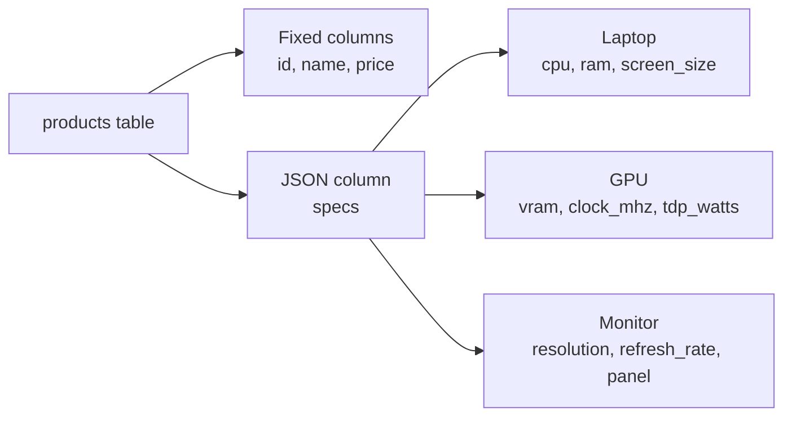

# Lesson 25: JSON Data Queries

Relational databases manage data with a fixed schema. But how do you store data like product specifications where attributes differ by category? Laptops need `screen_size`, `cpu`, `battery_hours`, while graphics cards need `vram`, `clock_mhz`, `tdp_watts`. Creating separate columns per category would fill the table with dozens of NULL columns.

**JSON columns** solve this problem. You can store flexible attributes without changing the schema.

**Common real-world scenarios for JSON columns:**

- **Product specs:** Different attributes per category (CPU, RAM, screen size, VRAM, etc.)
- **Settings/configuration:** Flexible data like per-user UI settings, notification preferences
- **External API responses:** Store raw external data whose structure changes frequently
- **Event logs:** Log data where each event has different fields

TechShop's `products.specs` column stores each product's technical specifications in JSON format. In this lesson, you will learn how to extract, filter, and modify JSON values.



> The `products.specs` column is TEXT type but stores JSON strings. You can extract and filter values inside JSON using SQL functions.


!!! note "Already familiar?"
    If you are comfortable with json_extract, json_set, and JSON aggregation, skip ahead to [Lesson 26: Stored Procedures](26-stored-procedures.md).

## The products.specs Column

This database's `products` table has a `specs` column. The JSON structure stored varies by category:

```sql
-- 노트북 상품의 specs 확인
SELECT name, specs
FROM products
WHERE specs IS NOT NULL
LIMIT 3;
```

**Laptop example:**
```json
{"screen_size": "15.6 inch", "cpu": "Intel Core i7-13700H", "ram": "16GB", "storage": "512GB SSD", "battery_hours": 10}
```

**GPU example:**
```json
{"vram": "16GB", "clock_mhz": 2100, "tdp_watts": 300}
```

**Monitor example:**
```json
{"screen_size": "27 inch", "resolution": "QHD", "refresh_rate": 144, "panel": "IPS"}
```

## Extracting JSON Values

The syntax for extracting specific key values from JSON differs by database.

=== "SQLite"
    ```sql
    -- Using json_extract function
    SELECT
        name,
        json_extract(specs, '$.cpu')     AS cpu,
        json_extract(specs, '$.ram')     AS ram,
        json_extract(specs, '$.storage') AS storage
    FROM products
    WHERE specs IS NOT NULL
      AND json_extract(specs, '$.cpu') IS NOT NULL
    LIMIT 5;

    -- ->> operator (SQLite 3.38+, returns as text)
    SELECT
        name,
        specs->>'$.cpu' AS cpu,
        specs->>'$.ram' AS ram
    FROM products
    WHERE specs IS NOT NULL
      AND specs->>'$.cpu' IS NOT NULL
    LIMIT 5;
    ```

=== "MySQL"
    ```sql
    -- Using JSON_EXTRACT function
    SELECT
        name,
        JSON_EXTRACT(specs, '$.cpu')     AS cpu,
        JSON_EXTRACT(specs, '$.ram')     AS ram,
        JSON_EXTRACT(specs, '$.storage') AS storage
    FROM products
    WHERE specs IS NOT NULL
      AND JSON_EXTRACT(specs, '$.cpu') IS NOT NULL
    LIMIT 5;

    -- ->> operator (returns unquoted text)
    SELECT
        name,
        specs->>'$.cpu' AS cpu,
        specs->>'$.ram' AS ram
    FROM products
    WHERE specs IS NOT NULL
      AND specs->>'$.cpu' IS NOT NULL
    LIMIT 5;
    ```

=== "PostgreSQL"
    ```sql
    -- ->> operator (returns as text)
    SELECT
        name,
        specs->>'cpu'     AS cpu,
        specs->>'ram'     AS ram,
        specs->>'storage' AS storage
    FROM products
    WHERE specs IS NOT NULL
      AND specs->>'cpu' IS NOT NULL
    LIMIT 5;

    -- jsonb_extract_path_text function
    SELECT
        name,
        jsonb_extract_path_text(specs, 'cpu') AS cpu,
        jsonb_extract_path_text(specs, 'ram') AS ram
    FROM products
    WHERE specs IS NOT NULL
      AND jsonb_extract_path_text(specs, 'cpu') IS NOT NULL
    LIMIT 5;
    ```

**Key differences:**

| Feature | SQLite | MySQL | PostgreSQL |
|------|--------|-------|------------|
| Path syntax | `'$.key'` | `'$.key'` | `'key'` |
| Function | `json_extract()` | `JSON_EXTRACT()` | `jsonb_extract_path_text()` |
| Text extraction operator | `->>'$.key'` | `->>'$.key'` | `->>'key'` |
| JSON extraction operator | `->'$.key'` | `->'$.key'` | `->'key'` |

> The `->` operator returns JSON type, and the `->>` operator returns text type. For comparisons in WHERE clauses, `->>` (text) is usually used.

## JSON WHERE Conditions

You can filter rows by JSON values.

=== "SQLite"
    ```sql
    -- Find products with 32GB RAM
    SELECT name, price, specs->>'$.ram' AS ram
    FROM products
    WHERE specs->>'$.ram' = '32GB';

    -- Laptops with 10+ hours battery
    SELECT name, price, json_extract(specs, '$.battery_hours') AS battery
    FROM products
    WHERE json_extract(specs, '$.battery_hours') >= 10
    ORDER BY json_extract(specs, '$.battery_hours') DESC;
    ```

=== "MySQL"
    ```sql
    -- Find products with 32GB RAM
    SELECT name, price, specs->>'$.ram' AS ram
    FROM products
    WHERE specs->>'$.ram' = '32GB';

    -- Laptops with 10+ hours battery
    SELECT name, price, JSON_EXTRACT(specs, '$.battery_hours') AS battery
    FROM products
    WHERE JSON_EXTRACT(specs, '$.battery_hours') >= 10
    ORDER BY JSON_EXTRACT(specs, '$.battery_hours') DESC;
    ```

=== "PostgreSQL"
    ```sql
    -- Find products with 32GB RAM
    SELECT name, price, specs->>'ram' AS ram
    FROM products
    WHERE specs->>'ram' = '32GB';

    -- Laptops with 10+ hours battery
    SELECT name, price, (specs->>'battery_hours')::int AS battery
    FROM products
    WHERE (specs->>'battery_hours')::int >= 10
    ORDER BY (specs->>'battery_hours')::int DESC;
    ```

!!! warning "PostgreSQL Type Casting"
    In PostgreSQL, the `->>` operator always returns text. For numeric comparisons, explicit casting with `::int` or `::numeric` is needed. SQLite and MySQL perform automatic type conversion.

## JSON Aggregation

JSON values can be used with GROUP BY and aggregate functions.

=== "SQLite"
    ```sql
    -- Product count and average price by CPU
    SELECT
        specs->>'$.cpu' AS cpu,
        COUNT(*)        AS product_count,
        ROUND(AVG(price)) AS avg_price
    FROM products
    WHERE specs->>'$.cpu' IS NOT NULL
    GROUP BY specs->>'$.cpu'
    ORDER BY product_count DESC;
    ```

=== "MySQL"
    ```sql
    -- Product count and average price by CPU
    SELECT
        specs->>'$.cpu' AS cpu,
        COUNT(*)        AS product_count,
        ROUND(AVG(price)) AS avg_price
    FROM products
    WHERE specs->>'$.cpu' IS NOT NULL
    GROUP BY specs->>'$.cpu'
    ORDER BY product_count DESC;
    ```

=== "PostgreSQL"
    ```sql
    -- Product count and average price by CPU
    SELECT
        specs->>'cpu' AS cpu,
        COUNT(*)      AS product_count,
        ROUND(AVG(price)) AS avg_price
    FROM products
    WHERE specs->>'cpu' IS NOT NULL
    GROUP BY specs->>'cpu'
    ORDER BY product_count DESC;
    ```

=== "SQLite"
    ```sql
    -- Average monitor price by resolution
    SELECT
        specs->>'$.resolution' AS resolution,
        COUNT(*)               AS cnt,
        ROUND(AVG(price))      AS avg_price,
        MIN(price)             AS min_price,
        MAX(price)             AS max_price
    FROM products
    WHERE specs->>'$.resolution' IS NOT NULL
    GROUP BY specs->>'$.resolution'
    ORDER BY avg_price DESC;
    ```

=== "MySQL"
    ```sql
    -- Average monitor price by resolution
    SELECT
        specs->>'$.resolution' AS resolution,
        COUNT(*)               AS cnt,
        ROUND(AVG(price))      AS avg_price,
        MIN(price)             AS min_price,
        MAX(price)             AS max_price
    FROM products
    WHERE specs->>'$.resolution' IS NOT NULL
    GROUP BY specs->>'$.resolution'
    ORDER BY avg_price DESC;
    ```

=== "PostgreSQL"
    ```sql
    -- Average monitor price by resolution
    SELECT
        specs->>'resolution' AS resolution,
        COUNT(*)             AS cnt,
        ROUND(AVG(price))    AS avg_price,
        MIN(price)           AS min_price,
        MAX(price)           AS max_price
    FROM products
    WHERE specs->>'resolution' IS NOT NULL
    GROUP BY specs->>'resolution'
    ORDER BY avg_price DESC;
    ```

## Listing JSON Keys

Here is how to check which keys exist in a JSON object.

=== "SQLite"
    ```sql
    -- List all JSON keys with json_each
    SELECT DISTINCT j.key
    FROM products, json_each(products.specs) AS j
    WHERE products.specs IS NOT NULL
    ORDER BY j.key;
    ```

=== "MySQL"
    ```sql
    -- Return key array with JSON_KEYS
    SELECT DISTINCT JSON_KEYS(specs) AS spec_keys
    FROM products
    WHERE specs IS NOT NULL
    LIMIT 10;
    ```

=== "PostgreSQL"
    ```sql
    -- List keys with jsonb_object_keys
    SELECT DISTINCT k
    FROM products, jsonb_object_keys(specs) AS k
    WHERE specs IS NOT NULL
    ORDER BY k;
    ```

## Modifying JSON Values

You can change specific keys in existing JSON data or add new keys.

=== "SQLite"
    ```sql
    -- json_set: modify value (add if key missing)
    UPDATE products
    SET specs = json_set(specs, '$.ram', '32GB')
    WHERE id = 1;

    -- json_insert: add only if key missing (ignore if exists)
    UPDATE products
    SET specs = json_insert(specs, '$.color', 'Silver')
    WHERE id = 1;

    -- json_remove: delete key
    UPDATE products
    SET specs = json_remove(specs, '$.color')
    WHERE id = 1;
    ```

=== "MySQL"
    ```sql
    -- JSON_SET: modify value (add if key missing)
    UPDATE products
    SET specs = JSON_SET(specs, '$.ram', '32GB')
    WHERE id = 1;

    -- JSON_INSERT: add only if key missing (ignore if exists)
    UPDATE products
    SET specs = JSON_INSERT(specs, '$.color', 'Silver')
    WHERE id = 1;

    -- JSON_REMOVE: delete key
    UPDATE products
    SET specs = JSON_REMOVE(specs, '$.color')
    WHERE id = 1;
    ```

=== "PostgreSQL"
    ```sql
    -- jsonb_set: modify value (add if key missing when third arg is true)
    UPDATE products
    SET specs = jsonb_set(specs, '{ram}', '"32GB"')
    WHERE id = 1;

    -- || operator: add/merge keys
    UPDATE products
    SET specs = specs || '{"color": "Silver"}'::jsonb
    WHERE id = 1;

    -- - operator: delete key
    UPDATE products
    SET specs = specs - 'color'
    WHERE id = 1;
    ```

**JSON modification function comparison:**

| Operation | SQLite | MySQL | PostgreSQL |
|------|--------|-------|------------|
| Modify/Add | `json_set()` | `JSON_SET()` | `jsonb_set()` |
| Add only | `json_insert()` | `JSON_INSERT()` | `\|\|` 연산자 |
| Delete | `json_remove()` | `JSON_REMOVE()` | `-` 연산자 |

## JSON vs Normalization

JSON columns are powerful but not a silver bullet.

| Criterion | JSON Column | Separate Table (Normalized) |
|------|-----------|---------------------|
| **Flexibility** | Add/remove attributes without schema changes | ALTER TABLE required |
| **Query performance** | Limited index support | Regular indexes, fast lookups |
| **Data integrity** | CHECK constraints difficult | FK, NOT NULL, UNIQUE possible |
| **Good fit** | Per-category attributes, settings, metadata | Core data frequently searched/joined |
| **Poor fit** | Columns used in every JOIN/GROUP BY | Variable attributes that change frequently |

> **Rule of thumb:** If a value is frequently used in WHERE clauses or JOINs, separate it into a regular column. For supplementary attributes that are only displayed or occasionally filtered, JSON is appropriate.

## Summary

| Concept | Description | Example |
|------|------|------|
| json_extract | Extract JSON value | `json_extract(specs, '$.cpu')` |
| -> / ->> | Shorthand operators (MySQL/PG) | `specs->>'cpu'` |
| json_each | Iterate JSON key-value pairs | `json_each(specs)` |
| json_set | Add/modify JSON value | `json_set(specs, '$.color', 'black')` |
| json_remove | Delete JSON key | `json_remove(specs, '$.tdp_watts')` |
| JSON + GROUP BY | Aggregate by JSON value | `GROUP BY json_extract(specs, '$.ram')` |
| JSON + WHERE | Filter by JSON value | `WHERE json_extract(specs, '$.cpu') LIKE '%Ryzen%'` |

!!! note "Lesson Review Problems"
    These are simple problems to immediately test the concepts learned in this lesson. For comprehensive practice combining multiple concepts, see the [Practice Problems](../exercises/index.md) section.

## Practice Problems
### Problem 1
Query the name, price, and RAM value of products with RAM `'16GB'`. Sort by price descending.

??? success "Answer"
    === "SQLite"
        ```sql
        SELECT name, price, specs->>'$.ram' AS ram
        FROM products
        WHERE specs->>'$.ram' = '16GB'
        ORDER BY price DESC;
        ```

        **Result (example):**

| name | price | ram |
| ---------- | ----------: | ---------- |
| ASUS ROG Strix G16CH White | 3671500.0 | 16GB |
| ASUS ROG Zephyrus G16 | 3429900.0 | 16GB |
| HP EliteBook 840 G10 Black [Special Limited Edition] Extended 3-year warranty + exclusive carrying case included | 2080300.0 | 16GB |
| ASUS ExpertBook B5 White | 2068800.0 | 16GB |
| Lenovo ThinkPad X1 2in1 Silver | 1866100.0 | 16GB |
| Razer Blade 18 | 1806800.0 | 16GB |
| Jooyon Rionine R7 System | 1800000.0 | 16GB |
| LG Gram 17 Silver | 1697400.0 | 16GB |
| ... | ... | ... |


    === "MySQL"
        ```sql
        SELECT name, price, specs->>'$.ram' AS ram
        FROM products
        WHERE specs->>'$.ram' = '16GB'
        ORDER BY price DESC;
        ```

    === "PostgreSQL"
        ```sql
        SELECT name, price, specs->>'ram' AS ram
        FROM products
        WHERE specs->>'ram' = '16GB'
        ORDER BY price DESC;
        ```


### Problem 2
Extract the name and CPU value from products in the `products` table where the `specs` column is not NULL. Show only products with a CPU value and limit results to 5.

??? success "Answer"
    === "SQLite"
        ```sql
        SELECT name, specs->>'$.cpu' AS cpu
        FROM products
        WHERE specs IS NOT NULL
          AND specs->>'$.cpu' IS NOT NULL
        LIMIT 5;
        ```

        **Result (example):**

| name | cpu |
| ---------- | ---------- |
| Razer Blade 18 Black | Apple M3 |
| LG All-in-One PC 27V70Q Silver | Intel Core i5-13600K |
| Razer Blade 18 White | Intel Core i9-13900H |
| Hansung BossMonster DX9900 Silver | AMD Ryzen 5 7600X |
| ASUS ROG Strix G16CH White | AMD Ryzen 5 7600X |
| ... | ... |


    === "MySQL"
        ```sql
        SELECT name, specs->>'$.cpu' AS cpu
        FROM products
        WHERE specs IS NOT NULL
          AND specs->>'$.cpu' IS NOT NULL
        LIMIT 5;
        ```

    === "PostgreSQL"
        ```sql
        SELECT name, specs->>'cpu' AS cpu
        FROM products
        WHERE specs IS NOT NULL
          AND specs->>'cpu' IS NOT NULL
        LIMIT 5;
        ```


### Problem 3
Query all unique keys used in the `specs` column in alphabetical order.

??? success "Answer"
    === "SQLite"
        ```sql
        SELECT DISTINCT j.key
        FROM products, json_each(products.specs) AS j
        WHERE products.specs IS NOT NULL
        ORDER BY j.key;
        ```

        **Result (example):**

| key |
| ---------- |
| base_clock_ghz |
| battery_hours |
| boost_clock_ghz |
| capacity_gb |
| clock_mhz |
| cores |
| cpu |
| gpu |
| ... |


    === "MySQL"
        ```sql
        SELECT DISTINCT jk.key_name
        FROM products,
             JSON_TABLE(
                 JSON_KEYS(specs), '$[*]'
                 COLUMNS (key_name VARCHAR(100) PATH '$')
             ) AS jk
        WHERE specs IS NOT NULL
        ORDER BY jk.key_name;
        ```

    === "PostgreSQL"
        ```sql
        SELECT DISTINCT k
        FROM products, jsonb_object_keys(specs) AS k
        WHERE specs IS NOT NULL
        ORDER BY k;
        ```


### Problem 4
Among products with a `cpu` key in `specs`, query the name, CPU, and price of the 3 most expensive products.

??? success "Answer"
    === "SQLite"
        ```sql
        SELECT name, specs->>'$.cpu' AS cpu, price
        FROM products
        WHERE specs->>'$.cpu' IS NOT NULL
        ORDER BY price DESC
        LIMIT 3;
        ```

        **Result (example):**

| name | cpu | price |
| ---------- | ---------- | ----------: |
| MacBook Air 15 M3 Silver | Intel Core i9-13900H | 5481100.0 |
| Razer Blade 18 Black | Intel Core i7-13700H | 4353100.0 |
| Razer Blade 16 Silver | AMD Ryzen 9 7945HX | 3702900.0 |


    === "MySQL"
        ```sql
        SELECT name, specs->>'$.cpu' AS cpu, price
        FROM products
        WHERE specs->>'$.cpu' IS NOT NULL
        ORDER BY price DESC
        LIMIT 3;
        ```

    === "PostgreSQL"
        ```sql
        SELECT name, specs->>'cpu' AS cpu, price
        FROM products
        WHERE specs->>'cpu' IS NOT NULL
        ORDER BY price DESC
        LIMIT 3;
        ```


### Problem 5
Query the name, price, and battery life of laptops with 12 or more hours of battery life. Sort by battery life descending.

??? success "Answer"
    === "SQLite"
        ```sql
        SELECT
            name,
            price,
            json_extract(specs, '$.battery_hours') AS battery_hours
        FROM products
        WHERE json_extract(specs, '$.battery_hours') >= 12
        ORDER BY json_extract(specs, '$.battery_hours') DESC;
        ```

    === "MySQL"
        ```sql
        SELECT
            name,
            price,
            JSON_EXTRACT(specs, '$.battery_hours') AS battery_hours
        FROM products
        WHERE JSON_EXTRACT(specs, '$.battery_hours') >= 12
        ORDER BY JSON_EXTRACT(specs, '$.battery_hours') DESC;
        ```

    === "PostgreSQL"
        ```sql
        SELECT
            name,
            price,
            (specs->>'battery_hours')::int AS battery_hours
        FROM products
        WHERE (specs->>'battery_hours')::int >= 12
        ORDER BY (specs->>'battery_hours')::int DESC;
        ```


### Problem 6
Query the name, price, VRAM, and TDP (power consumption) of GPU products with VRAM of `'16GB'` or more. Sort by TDP ascending.

??? success "Answer"
    === "SQLite"
        ```sql
        SELECT
            name,
            price,
            specs->>'$.vram'      AS vram,
            json_extract(specs, '$.tdp_watts') AS tdp_watts
        FROM products
        WHERE specs->>'$.vram' IN ('16GB', '24GB')
        ORDER BY json_extract(specs, '$.tdp_watts');
        ```

    === "MySQL"
        ```sql
        SELECT
            name,
            price,
            specs->>'$.vram'      AS vram,
            JSON_EXTRACT(specs, '$.tdp_watts') AS tdp_watts
        FROM products
        WHERE specs->>'$.vram' IN ('16GB', '24GB')
        ORDER BY JSON_EXTRACT(specs, '$.tdp_watts');
        ```

    === "PostgreSQL"
        ```sql
        SELECT
            name,
            price,
            specs->>'vram'      AS vram,
            (specs->>'tdp_watts')::int AS tdp_watts
        FROM products
        WHERE specs->>'vram' IN ('16GB', '24GB')
        ORDER BY (specs->>'tdp_watts')::int;
        ```


### Problem 7
Write an UPDATE statement to add a `"color"` key with value `"Space Gray"` to the specs of product ID 1. Then query to verify the added value.

??? success "Answer"
    === "SQLite"
        ```sql
        -- Add key
        UPDATE products
        SET specs = json_set(specs, '$.color', 'Space Gray')
        WHERE id = 1;

        -- Verify
        SELECT name, specs->>'$.color' AS color
        FROM products
        WHERE id = 1;
        ```

    === "MySQL"
        ```sql
        -- Add key
        UPDATE products
        SET specs = JSON_SET(specs, '$.color', 'Space Gray')
        WHERE id = 1;

        -- Verify
        SELECT name, specs->>'$.color' AS color
        FROM products
        WHERE id = 1;
        ```

    === "PostgreSQL"
        ```sql
        -- Add key
        UPDATE products
        SET specs = specs || '{"color": "Space Gray"}'::jsonb
        WHERE id = 1;

        -- Verify
        SELECT name, specs->>'color' AS color
        FROM products
        WHERE id = 1;
        ```


### Problem 8
Write an UPDATE statement to delete the `"color"` key from product ID 1's specs that was added in Problem 7. Then verify it was deleted.

??? success "Answer"
    === "SQLite"
        ```sql
        -- Delete key
        UPDATE products
        SET specs = json_remove(specs, '$.color')
        WHERE id = 1;

        -- Verify (NULL이어야 함)
        SELECT name, specs->>'$.color' AS color
        FROM products
        WHERE id = 1;
        ```

    === "MySQL"
        ```sql
        -- Delete key
        UPDATE products
        SET specs = JSON_REMOVE(specs, '$.color')
        WHERE id = 1;

        -- Verify (NULL이어야 함)
        SELECT name, specs->>'$.color' AS color
        FROM products
        WHERE id = 1;
        ```

    === "PostgreSQL"
        ```sql
        -- Delete key
        UPDATE products
        SET specs = specs - 'color'
        WHERE id = 1;

        -- Verify (NULL이어야 함)
        SELECT name, specs->>'color' AS color
        FROM products
        WHERE id = 1;
        ```


### Problem 9
Group products with a `screen_size` key in `specs` by screen size, and query the product count and average price for each group. Sort by product count descending.

??? success "Answer"
    === "SQLite"
        ```sql
        SELECT
            specs->>'$.screen_size' AS screen_size,
            COUNT(*)                AS product_count,
            ROUND(AVG(price))       AS avg_price
        FROM products
        WHERE specs->>'$.screen_size' IS NOT NULL
        GROUP BY specs->>'$.screen_size'
        ORDER BY product_count DESC;
        ```

        **Result (example):**

| screen_size | product_count | avg_price |
| ---------- | ----------: | ----------: |
| 14 inch | 13 | 2112669.0 |
| 27 inch | 12 | 1085900.0 |
| 15.6 inch | 10 | 1765740.0 |
| 32 inch | 6 | 970783.0 |
| 16 inch | 6 | 2522717.0 |
| 24 inch | 4 | 1194175.0 |
| ... | ... | ... |


    === "MySQL"
        ```sql
        SELECT
            specs->>'$.screen_size' AS screen_size,
            COUNT(*)                AS product_count,
            ROUND(AVG(price))       AS avg_price
        FROM products
        WHERE specs->>'$.screen_size' IS NOT NULL
        GROUP BY specs->>'$.screen_size'
        ORDER BY product_count DESC;
        ```

    === "PostgreSQL"
        ```sql
        SELECT
            specs->>'screen_size' AS screen_size,
            COUNT(*)              AS product_count,
            ROUND(AVG(price))     AS avg_price
        FROM products
        WHERE specs->>'screen_size' IS NOT NULL
        GROUP BY specs->>'screen_size'
        ORDER BY product_count DESC;
        ```


### Problem 10
Aggregate product count, average refresh rate (`refresh_rate`), and max refresh rate by monitor panel type (`panel`).

??? success "Answer"
    === "SQLite"
        ```sql
        SELECT
            specs->>'$.panel'                             AS panel,
            COUNT(*)                                      AS product_count,
            ROUND(AVG(json_extract(specs, '$.refresh_rate'))) AS avg_refresh_rate,
            MAX(json_extract(specs, '$.refresh_rate'))    AS max_refresh_rate
        FROM products
        WHERE specs->>'$.panel' IS NOT NULL
        GROUP BY specs->>'$.panel'
        ORDER BY avg_refresh_rate DESC;
        ```

    === "MySQL"
        ```sql
        SELECT
            specs->>'$.panel'                                   AS panel,
            COUNT(*)                                            AS product_count,
            ROUND(AVG(JSON_EXTRACT(specs, '$.refresh_rate')))   AS avg_refresh_rate,
            MAX(JSON_EXTRACT(specs, '$.refresh_rate'))           AS max_refresh_rate
        FROM products
        WHERE specs->>'$.panel' IS NOT NULL
        GROUP BY specs->>'$.panel'
        ORDER BY avg_refresh_rate DESC;
        ```

    === "PostgreSQL"
        ```sql
        SELECT
            specs->>'panel'                                   AS panel,
            COUNT(*)                                          AS product_count,
            ROUND(AVG((specs->>'refresh_rate')::int))         AS avg_refresh_rate,
            MAX((specs->>'refresh_rate')::int)                AS max_refresh_rate
        FROM products
        WHERE specs->>'panel' IS NOT NULL
        GROUP BY specs->>'panel'
        ORDER BY avg_refresh_rate DESC;
        ```


### Scoring Guide

| Score | Next Step |
|:----:|----------|
| **9-10** | Move to [Lesson 26: Stored Procedures](26-stored-procedures.md) |
| **7-8** | Review the explanations for incorrect answers, then proceed |
| **Half or less** | Re-read this lesson |
| **3 or fewer** | Start again from [Lesson 24: Triggers](24-triggers.md) |

**Problem Areas:**

| Area | Problems |
|------|:--------:|
| JSON value extraction | 1, 4 |
| NULL check + JSON | 2, 5 |
| JSON key listing | 3 |
| JSON aggregation (GROUP BY) | 6, 9, 10 |
| JSON modification (add/delete) | 7, 8 |

---
Next: [Lesson 26: Stored Procedures](26-stored-procedures.md)
