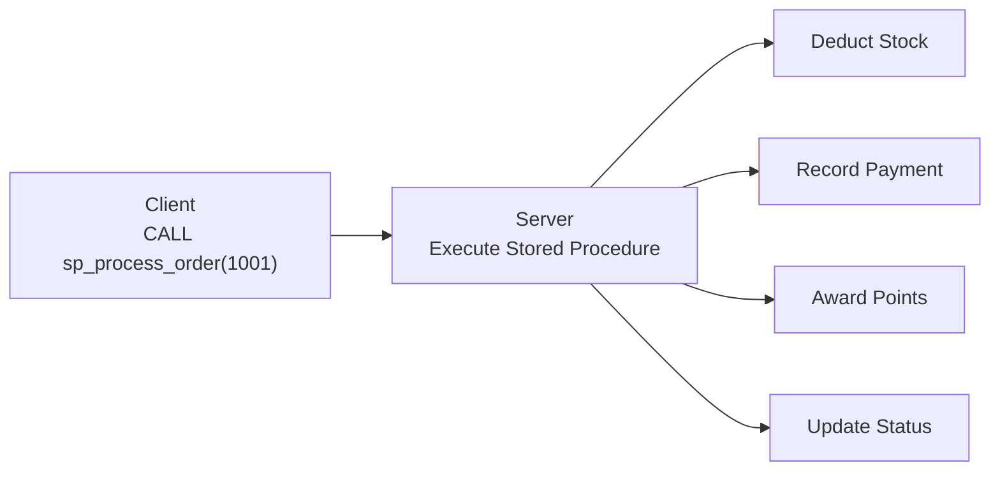

# Lesson 25: Stored Procedures and Functions

A **stored procedure** is a precompiled block of SQL saved on the database server and invoked on demand. By encapsulating repetitive tasks you gain **performance**, **security**, and **reusability** in one package.



> A stored procedure bundles multiple SQL statements under a single name and executes them on the server. This reduces network round-trips and centralizes business logic.

!!! warning "SQLite Note"
    SQLite does not support stored procedures. In SQLite environments, you can achieve similar effects with **views**, **triggers**, and **application-level logic**. This lesson covers **MySQL** and **PostgreSQL** only.

## Benefits of Stored Procedures

| Benefit | Description |
|---------|-------------|
| **Performance** | Reuses parsed/compiled execution plans. Fewer network round-trips |
| **Security** | Grant EXECUTE on the procedure instead of direct table access |
| **Reusability** | Multiple applications call the same business logic |
| **Maintainability** | Change the procedure once and all clients reflect the update |

## Procedures vs Functions

| Aspect | Procedure | Function |
|--------|-----------|----------|
| Return value | None, or via OUT parameters | Must `RETURNS` a value |
| Use in SELECT | No | Yes (`SELECT fn_name(...)`) |
| Invocation | `CALL procedure_name(...)` | `SELECT function_name(...)` |
| Transactions | Can COMMIT/ROLLBACK internally (MySQL) | Limited |

## Basic Syntax

=== "MySQL"
    ```sql
    DELIMITER //
    CREATE PROCEDURE procedure_name(
        IN  param1 INT,
        OUT param2 VARCHAR(100)
    )
    BEGIN
        -- SQL statements;
    END //
    DELIMITER ;

    -- Call
    CALL procedure_name(1, @result);
    SELECT @result;
    ```

=== "PostgreSQL"
    ```sql
    -- Procedure (PostgreSQL 11+)
    CREATE OR REPLACE PROCEDURE procedure_name(
        IN  param1 INT,
        INOUT param2 VARCHAR(100)
    )
    LANGUAGE plpgsql
    AS $$
    BEGIN
        -- SQL statements;
    END;
    $$;

    -- Call
    CALL procedure_name(1, NULL);
    ```

!!! tip "MySQL's DELIMITER"
    The MySQL client treats semicolons (`;`) as statement terminators. Since procedure bodies also contain semicolons, you temporarily change the delimiter to `//`, write the body, then restore the original delimiter.

## Parameter Types

| Type | Direction | Description |
|------|-----------|-------------|
| `IN` | Input only | Pass a value when calling (default) |
| `OUT` | Output only | Set inside the procedure, returned to caller |
| `INOUT` | Both | Receives input, modifies it, returns the result |

=== "MySQL"
    ```sql
    DELIMITER //
    CREATE PROCEDURE sp_get_customer_stats(
        IN  p_customer_id INT,
        OUT p_order_count INT,
        OUT p_total_spent DECIMAL(12,2)
    )
    BEGIN
        SELECT COUNT(*), COALESCE(SUM(total_amount), 0)
        INTO p_order_count, p_total_spent
        FROM orders
        WHERE customer_id = p_customer_id
          AND status <> 'cancelled';
    END //
    DELIMITER ;

    -- Call
    CALL sp_get_customer_stats(100, @cnt, @total);
    SELECT @cnt AS order_count, @total AS total_spent;
    ```

=== "PostgreSQL"
    ```sql
    CREATE OR REPLACE FUNCTION fn_get_customer_stats(
        p_customer_id INT,
        OUT p_order_count INT,
        OUT p_total_spent NUMERIC(12,2)
    )
    LANGUAGE plpgsql
    AS $$
    BEGIN
        SELECT COUNT(*), COALESCE(SUM(total_amount), 0)
        INTO p_order_count, p_total_spent
        FROM orders
        WHERE customer_id = p_customer_id
          AND status <> 'cancelled';
    END;
    $$;

    -- Call
    SELECT * FROM fn_get_customer_stats(100);
    ```

## Variables and Control Flow

### Variable Declaration and Assignment

=== "MySQL"
    ```sql
    DELIMITER //
    CREATE PROCEDURE sp_classify_customer(
        IN  p_customer_id INT,
        OUT p_grade VARCHAR(20)
    )
    BEGIN
        DECLARE v_total DECIMAL(12,2);

        SELECT COALESCE(SUM(total_amount), 0)
        INTO v_total
        FROM orders
        WHERE customer_id = p_customer_id
          AND status <> 'cancelled';

        IF v_total >= 5000000 THEN
            SET p_grade = 'VIP';
        ELSEIF v_total >= 1000000 THEN
            SET p_grade = 'GOLD';
        ELSEIF v_total >= 300000 THEN
            SET p_grade = 'SILVER';
        ELSE
            SET p_grade = 'BRONZE';
        END IF;
    END //
    DELIMITER ;
    ```

=== "PostgreSQL"
    ```sql
    CREATE OR REPLACE FUNCTION fn_classify_customer(
        p_customer_id INT
    )
    RETURNS VARCHAR(20)
    LANGUAGE plpgsql
    AS $$
    DECLARE
        v_total NUMERIC(12,2);
    BEGIN
        SELECT COALESCE(SUM(total_amount), 0)
        INTO v_total
        FROM orders
        WHERE customer_id = p_customer_id
          AND status <> 'cancelled';

        IF v_total >= 5000000 THEN
            RETURN 'VIP';
        ELSIF v_total >= 1000000 THEN
            RETURN 'GOLD';
        ELSIF v_total >= 300000 THEN
            RETURN 'SILVER';
        ELSE
            RETURN 'BRONZE';
        END IF;
    END;
    $$;

    -- Usage
    SELECT fn_classify_customer(100);
    ```

### WHILE Loop

=== "MySQL"
    ```sql
    DELIMITER //
    CREATE PROCEDURE sp_batch_update_grades()
    BEGIN
        DECLARE v_done INT DEFAULT 0;
        DECLARE v_cust_id INT;
        DECLARE v_grade VARCHAR(20);

        DECLARE cur CURSOR FOR
            SELECT id FROM customers;
        DECLARE CONTINUE HANDLER FOR NOT FOUND SET v_done = 1;

        OPEN cur;

        read_loop: LOOP
            FETCH cur INTO v_cust_id;
            IF v_done THEN
                LEAVE read_loop;
            END IF;

            CALL sp_classify_customer(v_cust_id, @new_grade);

            UPDATE customers
            SET grade = @new_grade
            WHERE id = v_cust_id;
        END LOOP;

        CLOSE cur;
    END //
    DELIMITER ;
    ```

=== "PostgreSQL"
    ```sql
    CREATE OR REPLACE PROCEDURE sp_batch_update_grades()
    LANGUAGE plpgsql
    AS $$
    DECLARE
        rec RECORD;
        v_grade VARCHAR(20);
    BEGIN
        FOR rec IN SELECT id FROM customers LOOP
            v_grade := fn_classify_customer(rec.id);

            UPDATE customers
            SET grade = v_grade
            WHERE id = rec.id;
        END LOOP;
    END;
    $$;

    -- Call
    CALL sp_batch_update_grades();
    ```

## Cursors

A cursor iterates through a result set one row at a time. Cursors are useful for batch processing or when per-row conditional logic is required.

=== "MySQL"
    ```sql
    DELIMITER //
    CREATE PROCEDURE sp_deactivate_dormant_customers(
        IN p_months INT
    )
    BEGIN
        DECLARE v_done INT DEFAULT 0;
        DECLARE v_cust_id INT;
        DECLARE v_count INT DEFAULT 0;

        DECLARE cur CURSOR FOR
            SELECT c.id
            FROM customers AS c
            WHERE c.is_active = 1
              AND NOT EXISTS (
                  SELECT 1 FROM orders AS o
                  WHERE o.customer_id = c.id
                    AND o.order_date >= DATE_SUB(CURDATE(), INTERVAL p_months MONTH)
              );

        DECLARE CONTINUE HANDLER FOR NOT FOUND SET v_done = 1;

        OPEN cur;

        deactivate_loop: LOOP
            FETCH cur INTO v_cust_id;
            IF v_done THEN
                LEAVE deactivate_loop;
            END IF;

            UPDATE customers
            SET is_active = 0
            WHERE id = v_cust_id;

            SET v_count = v_count + 1;
        END LOOP;

        CLOSE cur;

        SELECT v_count AS deactivated_count;
    END //
    DELIMITER ;
    ```

=== "PostgreSQL"
    ```sql
    CREATE OR REPLACE FUNCTION fn_deactivate_dormant_customers(
        p_months INT
    )
    RETURNS INT
    LANGUAGE plpgsql
    AS $$
    DECLARE
        v_cust_id INT;
        v_count INT := 0;
        cur CURSOR FOR
            SELECT c.id
            FROM customers AS c
            WHERE c.is_active = TRUE
              AND NOT EXISTS (
                  SELECT 1 FROM orders AS o
                  WHERE o.customer_id = c.id
                    AND o.order_date >= CURRENT_DATE - (p_months || ' months')::INTERVAL
              );
    BEGIN
        OPEN cur;
        LOOP
            FETCH cur INTO v_cust_id;
            EXIT WHEN NOT FOUND;

            UPDATE customers
            SET is_active = FALSE
            WHERE id = v_cust_id;

            v_count := v_count + 1;
        END LOOP;
        CLOSE cur;

        RETURN v_count;
    END;
    $$;

    -- Deactivate customers with no orders in 6+ months
    SELECT fn_deactivate_dormant_customers(6);
    ```

## Practical Examples

### Example 1: Monthly Sales Report

=== "MySQL"
    ```sql
    DELIMITER //
    CREATE PROCEDURE sp_monthly_sales_report(
        IN p_year INT,
        IN p_month INT
    )
    BEGIN
        SELECT
            DATE_FORMAT(o.order_date, '%Y-%m-%d') AS order_date,
            COUNT(DISTINCT o.id) AS order_count,
            SUM(oi.quantity) AS items_sold,
            SUM(oi.total_price) AS revenue
        FROM orders AS o
        INNER JOIN order_items AS oi ON oi.order_id = o.id
        WHERE YEAR(o.order_date) = p_year
          AND MONTH(o.order_date) = p_month
          AND o.status <> 'cancelled'
        GROUP BY DATE_FORMAT(o.order_date, '%Y-%m-%d')
        ORDER BY order_date;
    END //
    DELIMITER ;

    -- Call: December 2024 report
    CALL sp_monthly_sales_report(2024, 12);
    ```

=== "PostgreSQL"
    ```sql
    CREATE OR REPLACE FUNCTION fn_monthly_sales_report(
        p_year INT,
        p_month INT
    )
    RETURNS TABLE (
        order_date DATE,
        order_count BIGINT,
        items_sold BIGINT,
        revenue NUMERIC
    )
    LANGUAGE plpgsql
    AS $$
    BEGIN
        RETURN QUERY
        SELECT
            o.order_date::DATE,
            COUNT(DISTINCT o.id),
            SUM(oi.quantity)::BIGINT,
            SUM(oi.total_price)
        FROM orders AS o
        INNER JOIN order_items AS oi ON oi.order_id = o.id
        WHERE EXTRACT(YEAR FROM o.order_date) = p_year
          AND EXTRACT(MONTH FROM o.order_date) = p_month
          AND o.status <> 'cancelled'
        GROUP BY o.order_date::DATE
        ORDER BY o.order_date::DATE;
    END;
    $$;

    -- Call: December 2024 report
    SELECT * FROM fn_monthly_sales_report(2024, 12);
    ```

### Example 2: Batch Customer Grade Refresh

=== "MySQL"
    ```sql
    DELIMITER //
    CREATE PROCEDURE sp_refresh_customer_grades()
    BEGIN
        -- VIP: 5,000,000+ spent
        UPDATE customers AS c
        SET grade = 'VIP'
        WHERE (
            SELECT COALESCE(SUM(o.total_amount), 0)
            FROM orders AS o
            WHERE o.customer_id = c.id AND o.status <> 'cancelled'
        ) >= 5000000;

        -- GOLD: 1,000,000+ spent
        UPDATE customers AS c
        SET grade = 'GOLD'
        WHERE grade <> 'VIP'
          AND (
            SELECT COALESCE(SUM(o.total_amount), 0)
            FROM orders AS o
            WHERE o.customer_id = c.id AND o.status <> 'cancelled'
        ) >= 1000000;

        -- SILVER: 300,000+ spent
        UPDATE customers AS c
        SET grade = 'SILVER'
        WHERE grade NOT IN ('VIP', 'GOLD')
          AND (
            SELECT COALESCE(SUM(o.total_amount), 0)
            FROM orders AS o
            WHERE o.customer_id = c.id AND o.status <> 'cancelled'
        ) >= 300000;

        -- BRONZE: everyone else
        UPDATE customers
        SET grade = 'BRONZE'
        WHERE grade NOT IN ('VIP', 'GOLD', 'SILVER');

        SELECT grade, COUNT(*) AS customer_count
        FROM customers
        GROUP BY grade
        ORDER BY FIELD(grade, 'VIP', 'GOLD', 'SILVER', 'BRONZE');
    END //
    DELIMITER ;

    CALL sp_refresh_customer_grades();
    ```

=== "PostgreSQL"
    ```sql
    CREATE OR REPLACE PROCEDURE sp_refresh_customer_grades()
    LANGUAGE plpgsql
    AS $$
    BEGIN
        UPDATE customers AS c
        SET grade = CASE
            WHEN t.total_spent >= 5000000 THEN 'VIP'
            WHEN t.total_spent >= 1000000 THEN 'GOLD'
            WHEN t.total_spent >=  300000 THEN 'SILVER'
            ELSE 'BRONZE'
        END
        FROM (
            SELECT customer_id, COALESCE(SUM(total_amount), 0) AS total_spent
            FROM orders
            WHERE status <> 'cancelled'
            GROUP BY customer_id
        ) AS t
        WHERE c.id = t.customer_id;

        -- Customers with no order history
        UPDATE customers
        SET grade = 'BRONZE'
        WHERE id NOT IN (SELECT DISTINCT customer_id FROM orders);
    END;
    $$;

    CALL sp_refresh_customer_grades();
    ```

### Example 3: Order Processing Procedure (with Transaction)

=== "MySQL"
    ```sql
    DELIMITER //
    CREATE PROCEDURE sp_process_order(
        IN p_order_id INT
    )
    BEGIN
        DECLARE v_status VARCHAR(20);
        DECLARE EXIT HANDLER FOR SQLEXCEPTION
        BEGIN
            ROLLBACK;
            SIGNAL SQLSTATE '45000'
            SET MESSAGE_TEXT = 'Order processing failed. Transaction rolled back.';
        END;

        -- Check current status
        SELECT status INTO v_status
        FROM orders
        WHERE id = p_order_id;

        IF v_status IS NULL THEN
            SIGNAL SQLSTATE '45000'
            SET MESSAGE_TEXT = 'Order not found.';
        END IF;

        IF v_status <> 'pending' THEN
            SIGNAL SQLSTATE '45000'
            SET MESSAGE_TEXT = 'Only pending orders can be processed.';
        END IF;

        START TRANSACTION;

        -- Update order status
        UPDATE orders
        SET status = 'processing'
        WHERE id = p_order_id;

        -- Update payment status
        UPDATE payments
        SET status = 'completed',
            paid_at = NOW()
        WHERE order_id = p_order_id
          AND status = 'pending';

        -- Create shipping record
        INSERT INTO shipping (order_id, status, shipped_at)
        VALUES (p_order_id, 'preparing', NOW());

        COMMIT;

        SELECT 'Order processed successfully.' AS result;
    END //
    DELIMITER ;

    CALL sp_process_order(1001);
    ```

=== "PostgreSQL"
    ```sql
    CREATE OR REPLACE PROCEDURE sp_process_order(
        p_order_id INT
    )
    LANGUAGE plpgsql
    AS $$
    DECLARE
        v_status VARCHAR(20);
    BEGIN
        -- Check current status
        SELECT status INTO v_status
        FROM orders
        WHERE id = p_order_id;

        IF v_status IS NULL THEN
            RAISE EXCEPTION 'Order not found: %', p_order_id;
        END IF;

        IF v_status <> 'pending' THEN
            RAISE EXCEPTION 'Only pending orders can be processed. Current: %', v_status;
        END IF;

        -- Update order status
        UPDATE orders
        SET status = 'processing'
        WHERE id = p_order_id;

        -- Update payment status
        UPDATE payments
        SET status = 'completed',
            paid_at = NOW()
        WHERE order_id = p_order_id
          AND status = 'pending';

        -- Create shipping record
        INSERT INTO shipping (order_id, status, shipped_at)
        VALUES (p_order_id, 'preparing', NOW());

        -- PostgreSQL auto-manages the transaction within CALL
        RAISE NOTICE 'Order % processed successfully.', p_order_id;
    END;
    $$;

    CALL sp_process_order(1001);
    ```

## Writing Functions

Functions return a value and can be used directly inside `SELECT` statements.

=== "MySQL"
    ```sql
    DELIMITER //
    CREATE FUNCTION fn_order_total(
        p_order_id INT
    )
    RETURNS DECIMAL(12,2)
    DETERMINISTIC
    READS SQL DATA
    BEGIN
        DECLARE v_total DECIMAL(12,2);

        SELECT COALESCE(SUM(total_price), 0)
        INTO v_total
        FROM order_items
        WHERE order_id = p_order_id;

        RETURN v_total;
    END //
    DELIMITER ;

    -- Use inside SELECT
    SELECT
        id,
        order_date,
        fn_order_total(id) AS calculated_total
    FROM orders
    WHERE customer_id = 100
    ORDER BY order_date DESC
    LIMIT 5;
    ```

=== "PostgreSQL"
    ```sql
    CREATE OR REPLACE FUNCTION fn_order_total(
        p_order_id INT
    )
    RETURNS NUMERIC(12,2)
    LANGUAGE plpgsql
    AS $$
    DECLARE
        v_total NUMERIC(12,2);
    BEGIN
        SELECT COALESCE(SUM(total_price), 0)
        INTO v_total
        FROM order_items
        WHERE order_id = p_order_id;

        RETURN v_total;
    END;
    $$;

    -- Use inside SELECT
    SELECT
        id,
        order_date,
        fn_order_total(id) AS calculated_total
    FROM orders
    WHERE customer_id = 100
    ORDER BY order_date DESC
    LIMIT 5;
    ```

## Managing Procedures

### Listing

=== "MySQL"
    ```sql
    -- List procedures in the current database
    SHOW PROCEDURE STATUS WHERE Db = DATABASE();

    -- List functions
    SHOW FUNCTION STATUS WHERE Db = DATABASE();
    ```

=== "PostgreSQL"
    ```sql
    -- List user-defined procedures and functions
    SELECT routine_name, routine_type, data_type
    FROM information_schema.routines
    WHERE routine_schema = 'public'
    ORDER BY routine_type, routine_name;
    ```

### Viewing Definitions

=== "MySQL"
    ```sql
    SHOW CREATE PROCEDURE sp_monthly_sales_report;
    SHOW CREATE FUNCTION fn_order_total;
    ```

=== "PostgreSQL"
    ```sql
    -- View function/procedure source code
    SELECT prosrc
    FROM pg_proc
    WHERE proname = 'fn_order_total';
    ```

### Dropping

=== "MySQL"
    ```sql
    DROP PROCEDURE IF EXISTS sp_monthly_sales_report;
    DROP FUNCTION IF EXISTS fn_order_total;
    ```

=== "PostgreSQL"
    ```sql
    DROP PROCEDURE IF EXISTS sp_process_order(INT);
    DROP FUNCTION IF EXISTS fn_order_total(INT);
    ```

### Granting Privileges

=== "MySQL"
    ```sql
    -- Grant execute permission to a specific user
    GRANT EXECUTE ON PROCEDURE sp_process_order TO 'app_user'@'%';
    ```

=== "PostgreSQL"
    ```sql
    -- Grant execute permission to a specific user
    GRANT EXECUTE ON FUNCTION fn_order_total(INT) TO app_user;
    ```

## Best Practices

| Recommended | Avoid |
|-------------|-------|
| Clear naming (`sp_`, `fn_` prefixes) | Overly long procedures (break them up) |
| Include error handling (HANDLER/EXCEPTION) | Putting all business logic in procedures |
| Validate parameters | Overusing cursors (use set operations instead) |
| Use transactions for atomicity | Complex nested calls without debugging |
| Comment purpose and parameters | Excessive dynamic SQL (SQL injection risk) |

!!! note "Lesson Review"
    Quick exercises to check your understanding of this lesson. For comprehensive practice combining multiple concepts, see the [Exercises](../exercises/index.md) section.

## Practice Exercises
### Exercise 1
Write a query to view the definition of the `fn_customer_grade` function created in the earlier exercises.

??? success "Answer"
    === "MySQL"
        ```sql
        SHOW CREATE FUNCTION fn_customer_grade;
        ```

    === "PostgreSQL"
        ```sql
        SELECT prosrc
        FROM pg_proc
        WHERE proname = 'fn_customer_grade';
        ```


### Exercise 2
Write a query to list all stored procedures and functions registered in the current database. Display the name and type (PROCEDURE/FUNCTION).

??? success "Answer"
    === "MySQL"
        ```sql
        SELECT
            ROUTINE_NAME,
            ROUTINE_TYPE
        FROM INFORMATION_SCHEMA.ROUTINES
        WHERE ROUTINE_SCHEMA = DATABASE()
        ORDER BY ROUTINE_TYPE, ROUTINE_NAME;
        ```

    === "PostgreSQL"
        ```sql
        SELECT
            routine_name,
            routine_type
        FROM information_schema.routines
        WHERE routine_schema = 'public'
        ORDER BY routine_type, routine_name;
        ```


### Exercise 3
Write a procedure that accepts an order ID, raises an error if the order does not exist, and sets the order status to `'cancelled'` if it does.

??? success "Answer"
    === "MySQL"
        ```sql
        DELIMITER //
        CREATE PROCEDURE sp_cancel_order(
            IN p_order_id INT
        )
        BEGIN
            DECLARE v_exists INT;

            SELECT COUNT(*) INTO v_exists
            FROM orders
            WHERE id = p_order_id;

            IF v_exists = 0 THEN
                SIGNAL SQLSTATE '45000'
                SET MESSAGE_TEXT = 'Order not found.';
            END IF;

            UPDATE orders
            SET status = 'cancelled'
            WHERE id = p_order_id;
        END //
        DELIMITER ;

        CALL sp_cancel_order(9999);
        ```

    === "PostgreSQL"
        ```sql
        CREATE OR REPLACE PROCEDURE sp_cancel_order(
            p_order_id INT
        )
        LANGUAGE plpgsql
        AS $$
        BEGIN
            IF NOT EXISTS (SELECT 1 FROM orders WHERE id = p_order_id) THEN
                RAISE EXCEPTION 'Order not found: %', p_order_id;
            END IF;

            UPDATE orders
            SET status = 'cancelled'
            WHERE id = p_order_id;
        END;
        $$;

        CALL sp_cancel_order(9999);
        ```


### Exercise 4
Write a procedure (MySQL) or function (PostgreSQL) that accepts a category ID and returns the product count, average price, and maximum price for that category.

??? success "Answer"
    === "MySQL"
        ```sql
        DELIMITER //
        CREATE PROCEDURE sp_category_stats(
            IN  p_category_id INT,
            OUT p_product_count INT,
            OUT p_avg_price DECIMAL(10,2),
            OUT p_max_price DECIMAL(10,2)
        )
        BEGIN
            SELECT COUNT(*), AVG(price), MAX(price)
            INTO p_product_count, p_avg_price, p_max_price
            FROM products
            WHERE category_id = p_category_id;
        END //
        DELIMITER ;

        CALL sp_category_stats(1, @cnt, @avg, @max);
        SELECT @cnt AS product_count, @avg AS avg_price, @max AS max_price;
        ```

    === "PostgreSQL"
        ```sql
        CREATE OR REPLACE FUNCTION fn_category_stats(
            p_category_id INT,
            OUT p_product_count INT,
            OUT p_avg_price NUMERIC(10,2),
            OUT p_max_price NUMERIC(10,2)
        )
        LANGUAGE plpgsql
        AS $$
        BEGIN
            SELECT COUNT(*), AVG(price), MAX(price)
            INTO p_product_count, p_avg_price, p_max_price
            FROM products
            WHERE category_id = p_category_id;
        END;
        $$;

        SELECT * FROM fn_category_stats(1);
        ```


### Exercise 5
Using IF/ELSE, write a function that accepts a product ID and quantity. If stock is sufficient, deduct it and return 'OK'. If insufficient, return 'INSUFFICIENT STOCK'.

??? success "Answer"
    === "MySQL"
        ```sql
        DELIMITER //
        CREATE FUNCTION fn_deduct_stock(
            p_product_id INT,
            p_quantity INT
        )
        RETURNS VARCHAR(50)
        DETERMINISTIC
        MODIFIES SQL DATA
        BEGIN
            DECLARE v_stock INT;

            SELECT stock_qty INTO v_stock
            FROM products
            WHERE id = p_product_id;

            IF v_stock IS NULL THEN
                RETURN 'PRODUCT NOT FOUND';
            ELSEIF v_stock < p_quantity THEN
                RETURN 'INSUFFICIENT STOCK';
            ELSE
                UPDATE products
                SET stock_qty = stock_qty - p_quantity
                WHERE id = p_product_id;
                RETURN 'OK';
            END IF;
        END //
        DELIMITER ;

        SELECT fn_deduct_stock(1, 5);
        ```

    === "PostgreSQL"
        ```sql
        CREATE OR REPLACE FUNCTION fn_deduct_stock(
            p_product_id INT,
            p_quantity INT
        )
        RETURNS VARCHAR(50)
        LANGUAGE plpgsql
        AS $$
        DECLARE
            v_stock INT;
        BEGIN
            SELECT stock_qty INTO v_stock
            FROM products
            WHERE id = p_product_id;

            IF v_stock IS NULL THEN
                RETURN 'PRODUCT NOT FOUND';
            ELSIF v_stock < p_quantity THEN
                RETURN 'INSUFFICIENT STOCK';
            ELSE
                UPDATE products
                SET stock_qty = stock_qty - p_quantity
                WHERE id = p_product_id;
                RETURN 'OK';
            END IF;
        END;
        $$;

        SELECT fn_deduct_stock(1, 5);
        ```


### Exercise 6
Write a procedure that accepts a start date and end date, and returns the daily order count and total revenue for that period.

??? success "Answer"
    === "MySQL"
        ```sql
        DELIMITER //
        CREATE PROCEDURE sp_daily_sales(
            IN p_start_date DATE,
            IN p_end_date DATE
        )
        BEGIN
            SELECT
                DATE(o.order_date) AS sale_date,
                COUNT(*) AS order_count,
                SUM(o.total_amount) AS daily_revenue
            FROM orders AS o
            WHERE o.order_date >= p_start_date
              AND o.order_date < DATE_ADD(p_end_date, INTERVAL 1 DAY)
              AND o.status <> 'cancelled'
            GROUP BY DATE(o.order_date)
            ORDER BY sale_date;
        END //
        DELIMITER ;

        CALL sp_daily_sales('2024-12-01', '2024-12-31');
        ```

    === "PostgreSQL"
        ```sql
        CREATE OR REPLACE FUNCTION fn_daily_sales(
            p_start_date DATE,
            p_end_date DATE
        )
        RETURNS TABLE (
            sale_date DATE,
            order_count BIGINT,
            daily_revenue NUMERIC
        )
        LANGUAGE plpgsql
        AS $$
        BEGIN
            RETURN QUERY
            SELECT
                o.order_date::DATE,
                COUNT(*),
                SUM(o.total_amount)
            FROM orders AS o
            WHERE o.order_date >= p_start_date
              AND o.order_date < p_end_date + 1
              AND o.status <> 'cancelled'
            GROUP BY o.order_date::DATE
            ORDER BY o.order_date::DATE;
        END;
        $$;

        SELECT * FROM fn_daily_sales('2024-12-01', '2024-12-31');
        ```


### Exercise 7
Write a **function** that accepts a customer ID and returns their grade as a string. Use total order amount thresholds: 5,000,000+ is 'VIP', 1,000,000+ is 'GOLD', 300,000+ is 'SILVER', otherwise 'BRONZE'.

??? success "Answer"
    === "MySQL"
        ```sql
        DELIMITER //
        CREATE FUNCTION fn_customer_grade(
            p_customer_id INT
        )
        RETURNS VARCHAR(20)
        DETERMINISTIC
        READS SQL DATA
        BEGIN
            DECLARE v_total DECIMAL(12,2);

            SELECT COALESCE(SUM(total_amount), 0)
            INTO v_total
            FROM orders
            WHERE customer_id = p_customer_id
              AND status <> 'cancelled';

            IF v_total >= 5000000 THEN
                RETURN 'VIP';
            ELSEIF v_total >= 1000000 THEN
                RETURN 'GOLD';
            ELSEIF v_total >= 300000 THEN
                RETURN 'SILVER';
            ELSE
                RETURN 'BRONZE';
            END IF;
        END //
        DELIMITER ;

        -- Test
        SELECT id, name, fn_customer_grade(id) AS grade
        FROM customers
        LIMIT 10;
        ```

    === "PostgreSQL"
        ```sql
        CREATE OR REPLACE FUNCTION fn_customer_grade(
            p_customer_id INT
        )
        RETURNS VARCHAR(20)
        LANGUAGE plpgsql
        AS $$
        DECLARE
            v_total NUMERIC(12,2);
        BEGIN
            SELECT COALESCE(SUM(total_amount), 0)
            INTO v_total
            FROM orders
            WHERE customer_id = p_customer_id
              AND status <> 'cancelled';

            IF v_total >= 5000000 THEN
                RETURN 'VIP';
            ELSIF v_total >= 1000000 THEN
                RETURN 'GOLD';
            ELSIF v_total >= 300000 THEN
                RETURN 'SILVER';
            ELSE
                RETURN 'BRONZE';
            END IF;
        END;
        $$;

        -- Test
        SELECT id, name, fn_customer_grade(id) AS grade
        FROM customers
        LIMIT 10;
        ```


### Exercise 8
Drop all procedures and functions you created in exercises 1 through 5 to restore the database to its original state.

??? success "Answer"
    === "MySQL"
        ```sql
        DROP PROCEDURE IF EXISTS sp_category_stats;
        DROP FUNCTION IF EXISTS fn_customer_grade;
        DROP PROCEDURE IF EXISTS sp_cancel_order;
        DROP FUNCTION IF EXISTS fn_deduct_stock;
        DROP PROCEDURE IF EXISTS sp_daily_sales;
        ```

    === "PostgreSQL"
        ```sql
        DROP FUNCTION IF EXISTS fn_category_stats(INT);
        DROP FUNCTION IF EXISTS fn_customer_grade(INT);
        DROP PROCEDURE IF EXISTS sp_cancel_order(INT);
        DROP FUNCTION IF EXISTS fn_deduct_stock(INT, INT);
        DROP FUNCTION IF EXISTS fn_daily_sales(DATE, DATE);
        ```


---

Next: [Sales Analysis Exercises](../exercises/advanced-01-sales-analysis.md)
