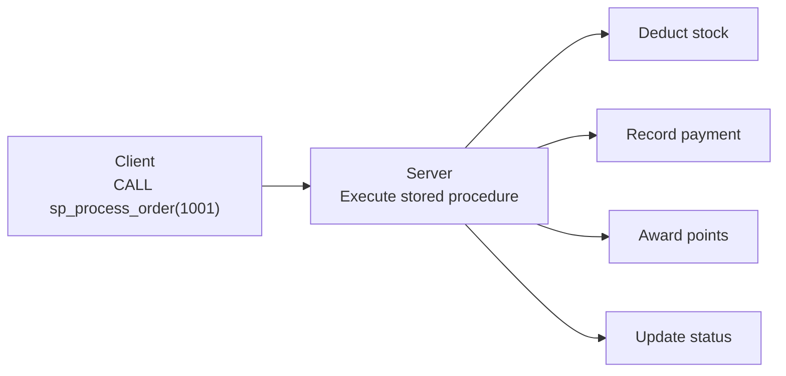

# Lesson 26: Stored Procedures and Functions

**A Stored Procedure** is a SQL block pre-stored on the database server and called when needed. By encapsulating repetitive tasks, you can simultaneously achieve **performance**, **security**, and **reusability**.



> A stored procedure bundles multiple SQL statements under one name and executes them on the server. It reduces network round-trips and centralizes business logic management.

**Common real-world scenarios for stored procedures:**

- **Encapsulating repetitive logic:** Bundle order processing, grade updates, settlements into a single SP call
- **Permission separation:** Grant only SP execution privileges without direct table access
- **Transaction guarantees:** Process multiple table modifications as one atomic unit
- **Performance:** Reuse compiled execution plans (MySQL/PG)

!!! warning "SQLite Note"
    SQLite does not support stored procedures. In SQLite environments, similar effects can be achieved with **Views**, **Triggers**, and **application-level logic**. This lesson is for **MySQL** and **PostgreSQL** only.


!!! note "Already familiar?"
    If you are comfortable with stored procedures and functions, skip ahead to [Practice Problems](../exercises/index.md).

## Advantages of Stored Procedures

| Advantage | Description |
|------|------|
| **Performance** | Reuse parsed/compiled execution plans. Reduce network round-trips |
| **Security** | Grant only procedure execution privileges without direct table access |
| **Reusability** | Call the same business logic from multiple applications |
| **Maintenance** | When logic changes, modifying the procedure reflects across all clients |

## Procedure vs Function

| Aspect | Procedure | Function |
|------|---------------------|-----------------|
| Return value | None or via OUT parameter | Must return via `RETURNS` |
| Use in SELECT | Not possible | Possible (`SELECT fn_name(...)`) |
| Invocation | `CALL procedure_name(...)` | `SELECT function_name(...)` |
| Transaction | COMMIT/ROLLBACK inside (MySQL) | Limited |

## Basic Syntax

=== "MySQL"
    ```sql
    DELIMITER //
    CREATE PROCEDURE procedure_name(
        IN  param1 INT,
        OUT param2 VARCHAR(100)
    )
    BEGIN
        -- SQL statements;
    END //
    DELIMITER ;

    -- Call
    CALL procedure_name(1, @result);
    SELECT @result;
    ```

=== "PostgreSQL"
    ```sql
    -- Procedure (PostgreSQL 11+)
    CREATE OR REPLACE PROCEDURE procedure_name(
        IN  param1 INT,
        INOUT param2 VARCHAR(100)
    )
    LANGUAGE plpgsql
    AS $$
    BEGIN
        -- SQL statements;
    END;
    $$;

    -- Call
    CALL procedure_name(1, NULL);
    ```

!!! tip "MySQL DELIMITER"
    The MySQL client recognizes semicolons (`;`) as statement terminators. Since the procedure body also contains semicolons, temporarily change the delimiter to `//`, write the body, then restore the original delimiter.

## Parameter Types

| Type | Direction | Description |
|------|------|------|
| `IN` | Input only | Pass value when calling (default) |
| `OUT` | Output only | Set value inside procedure, caller receives it |
| `INOUT` | Input/Output | Receive input, modify, and return |

=== "MySQL"
    ```sql
    DELIMITER //
    CREATE PROCEDURE sp_get_customer_stats(
        IN  p_customer_id INT,
        OUT p_order_count INT,
        OUT p_total_spent DECIMAL(12,2)
    )
    BEGIN
        SELECT COUNT(*), COALESCE(SUM(total_amount), 0)
        INTO p_order_count, p_total_spent
        FROM orders
        WHERE customer_id = p_customer_id
          AND status <> 'cancelled';
    END //
    DELIMITER ;

    -- Call
    CALL sp_get_customer_stats(100, @cnt, @total);
    SELECT @cnt AS order_count, @total AS total_spent;
    ```

=== "PostgreSQL"
    ```sql
    CREATE OR REPLACE FUNCTION fn_get_customer_stats(
        p_customer_id INT,
        OUT p_order_count INT,
        OUT p_total_spent NUMERIC(12,2)
    )
    LANGUAGE plpgsql
    AS $$
    BEGIN
        SELECT COUNT(*), COALESCE(SUM(total_amount), 0)
        INTO p_order_count, p_total_spent
        FROM orders
        WHERE customer_id = p_customer_id
          AND status <> 'cancelled';
    END;
    $$;

    -- Call
    SELECT * FROM fn_get_customer_stats(100);
    ```

## Variables and Control Flow

### Variable Declaration and Assignment

=== "MySQL"
    ```sql
    DELIMITER //
    CREATE PROCEDURE sp_classify_customer(
        IN  p_customer_id INT,
        OUT p_grade VARCHAR(20)
    )
    BEGIN
        DECLARE v_total DECIMAL(12,2);

        SELECT COALESCE(SUM(total_amount), 0)
        INTO v_total
        FROM orders
        WHERE customer_id = p_customer_id
          AND status <> 'cancelled';

        IF v_total >= 5000000 THEN
            SET p_grade = 'VIP';
        ELSEIF v_total >= 1000000 THEN
            SET p_grade = 'GOLD';
        ELSEIF v_total >= 300000 THEN
            SET p_grade = 'SILVER';
        ELSE
            SET p_grade = 'BRONZE';
        END IF;
    END //
    DELIMITER ;
    ```

=== "PostgreSQL"
    ```sql
    CREATE OR REPLACE FUNCTION fn_classify_customer(
        p_customer_id INT
    )
    RETURNS VARCHAR(20)
    LANGUAGE plpgsql
    AS $$
    DECLARE
        v_total NUMERIC(12,2);
    BEGIN
        SELECT COALESCE(SUM(total_amount), 0)
        INTO v_total
        FROM orders
        WHERE customer_id = p_customer_id
          AND status <> 'cancelled';

        IF v_total >= 5000000 THEN
            RETURN 'VIP';
        ELSIF v_total >= 1000000 THEN
            RETURN 'GOLD';
        ELSIF v_total >= 300000 THEN
            RETURN 'SILVER';
        ELSE
            RETURN 'BRONZE';
        END IF;
    END;
    $$;

    -- Usage
    SELECT fn_classify_customer(100);
    ```

### WHILE Loop

=== "MySQL"
    ```sql
    DELIMITER //
    CREATE PROCEDURE sp_batch_update_grades()
    BEGIN
        DECLARE v_done INT DEFAULT 0;
        DECLARE v_cust_id INT;
        DECLARE v_grade VARCHAR(20);

        DECLARE cur CURSOR FOR
            SELECT id FROM customers;
        DECLARE CONTINUE HANDLER FOR NOT FOUND SET v_done = 1;

        OPEN cur;

        read_loop: LOOP
            FETCH cur INTO v_cust_id;
            IF v_done THEN
                LEAVE read_loop;
            END IF;

            CALL sp_classify_customer(v_cust_id, @new_grade);

            UPDATE customers
            SET grade = @new_grade
            WHERE id = v_cust_id;
        END LOOP;

        CLOSE cur;
    END //
    DELIMITER ;
    ```

=== "PostgreSQL"
    ```sql
    CREATE OR REPLACE PROCEDURE sp_batch_update_grades()
    LANGUAGE plpgsql
    AS $$
    DECLARE
        rec RECORD;
        v_grade VARCHAR(20);
    BEGIN
        FOR rec IN SELECT id FROM customers LOOP
            v_grade := fn_classify_customer(rec.id);

            UPDATE customers
            SET grade = v_grade
            WHERE id = rec.id;
        END LOOP;
    END;
    $$;

    -- Call
    CALL sp_batch_update_grades();
    ```

## CURSOR

A Cursor is a mechanism that processes a query result set **one row at a time**. Standard SQL operates on sets, but cursors allow row-by-row processing.

### Database Support

| DB | Cursor Support | Notes |
|----|:--------:|------|
| SQLite | :x: | No cursor since stored procedures are not supported |
| MySQL | :white_check_mark: | `DECLARE CURSOR` — only inside stored procedures |
| PostgreSQL | :white_check_mark: | `DECLARE CURSOR` + `FOR record IN query LOOP` shorthand |

### Basic Cursor Pattern

Cursors are always used in 4 steps:

```
DECLARE → OPEN → FETCH (loop) → CLOSE
```

1. **DECLARE** — Define the SELECT query for the cursor to execute
2. **OPEN** — Execute the query and prepare the result set
3. **FETCH** — Pull one row at a time into variables (loop)
4. **CLOSE** — Close the cursor and release resources

### Example: Deactivating Dormant Customers

=== "MySQL"
    ```sql
    DELIMITER //
    CREATE PROCEDURE sp_deactivate_dormant_customers(
        IN p_months INT
    )
    BEGIN
        DECLARE v_done INT DEFAULT 0;
        DECLARE v_cust_id INT;
        DECLARE v_count INT DEFAULT 0;

        -- 1. DECLARE: Define cursor
        DECLARE cur CURSOR FOR
            SELECT c.id
            FROM customers AS c
            WHERE c.is_active = 1
              AND NOT EXISTS (
                  SELECT 1 FROM orders AS o
                  WHERE o.customer_id = c.id
                    AND o.order_date >= DATE_SUB(CURDATE(), INTERVAL p_months MONTH)
              );

        -- NOT FOUND handler: set v_done = 1 when no more rows to FETCH
        DECLARE CONTINUE HANDLER FOR NOT FOUND SET v_done = 1;

        -- 2. OPEN: Execute cursor
        OPEN cur;

        -- 3. FETCH: Process one row at a time
        deactivate_loop: LOOP
            FETCH cur INTO v_cust_id;
            IF v_done THEN
                LEAVE deactivate_loop;
            END IF;

            UPDATE customers
            SET is_active = 0
            WHERE id = v_cust_id;

            SET v_count = v_count + 1;
        END LOOP;

        -- 4. CLOSE: Release cursor
        CLOSE cur;

        SELECT v_count AS deactivated_count;
    END //
    DELIMITER ;
    ```

=== "PostgreSQL (explicit cursor)"
    ```sql
    CREATE OR REPLACE FUNCTION fn_deactivate_dormant_customers(
        p_months INT
    )
    RETURNS INT
    LANGUAGE plpgsql
    AS $$
    DECLARE
        v_cust_id INT;
        v_count INT := 0;
        cur CURSOR FOR
            SELECT c.id
            FROM customers AS c
            WHERE c.is_active = TRUE
              AND NOT EXISTS (
                  SELECT 1 FROM orders AS o
                  WHERE o.customer_id = c.id
                    AND o.order_date >= CURRENT_DATE - (p_months || ' months')::INTERVAL
              );
    BEGIN
        OPEN cur;
        LOOP
            FETCH cur INTO v_cust_id;
            EXIT WHEN NOT FOUND;

            UPDATE customers
            SET is_active = FALSE
            WHERE id = v_cust_id;

            v_count := v_count + 1;
        END LOOP;
        CLOSE cur;

        RETURN v_count;
    END;
    $$;

    -- Deactivate customers with no orders for 6+ months
    SELECT fn_deactivate_dormant_customers(6);
    ```

=== "PostgreSQL (FOR-IN shorthand)"
PostgreSQL can use cursors implicitly with the `FOR record IN query LOOP` syntax. No need to write DECLARE/OPEN/FETCH/CLOSE directly, making it much more concise.

    ```sql
    CREATE OR REPLACE FUNCTION fn_deactivate_dormant_customers(
        p_months INT
    )
    RETURNS INT
    LANGUAGE plpgsql
    AS $$
    DECLARE
        rec RECORD;
        v_count INT := 0;
    BEGIN
        -- FOR-IN automatically manages the cursor internally
        FOR rec IN
            SELECT c.id
            FROM customers AS c
            WHERE c.is_active = TRUE
              AND NOT EXISTS (
                  SELECT 1 FROM orders AS o
                  WHERE o.customer_id = c.id
                    AND o.order_date >= CURRENT_DATE - (p_months || ' months')::INTERVAL
              )
        LOOP
            UPDATE customers
            SET is_active = FALSE
            WHERE id = rec.id;

            v_count := v_count + 1;
        END LOOP;

        RETURN v_count;
    END;
    $$;
    ```

!!! warning "Cursor Usage Caution"
    Cursors process rows one at a time, so they are **much slower than set operations (UPDATE ... WHERE ...)**. In practice, the above example should be solved with a single UPDATE:
    ```sql
    UPDATE customers SET is_active = FALSE
    WHERE is_active = TRUE
      AND id NOT IN (SELECT customer_id FROM orders WHERE order_date >= ...);
    ```
    Use cursors only when set operations cannot solve the problem, such as when **different logic must branch per row** or **external system calls** are needed.

## Practical Examples

### Example 1: Monthly Sales Report

=== "MySQL"
    ```sql
    DELIMITER //
    CREATE PROCEDURE sp_monthly_sales_report(
        IN p_year INT,
        IN p_month INT
    )
    BEGIN
        SELECT
            DATE_FORMAT(o.order_date, '%Y-%m-%d') AS order_date,
            COUNT(DISTINCT o.id) AS order_count,
            SUM(oi.quantity) AS items_sold,
            SUM(oi.total_price) AS revenue
        FROM orders AS o
        INNER JOIN order_items AS oi ON oi.order_id = o.id
        WHERE YEAR(o.order_date) = p_year
          AND MONTH(o.order_date) = p_month
          AND o.status <> 'cancelled'
        GROUP BY DATE_FORMAT(o.order_date, '%Y-%m-%d')
        ORDER BY order_date;
    END //
    DELIMITER ;

    -- Call: December 2024 report
    CALL sp_monthly_sales_report(2024, 12);
    ```

=== "PostgreSQL"
    ```sql
    CREATE OR REPLACE FUNCTION fn_monthly_sales_report(
        p_year INT,
        p_month INT
    )
    RETURNS TABLE (
        order_date DATE,
        order_count BIGINT,
        items_sold BIGINT,
        revenue NUMERIC
    )
    LANGUAGE plpgsql
    AS $$
    BEGIN
        RETURN QUERY
        SELECT
            o.order_date::DATE,
            COUNT(DISTINCT o.id),
            SUM(oi.quantity)::BIGINT,
            SUM(oi.total_price)
        FROM orders AS o
        INNER JOIN order_items AS oi ON oi.order_id = o.id
        WHERE EXTRACT(YEAR FROM o.order_date) = p_year
          AND EXTRACT(MONTH FROM o.order_date) = p_month
          AND o.status <> 'cancelled'
        GROUP BY o.order_date::DATE
        ORDER BY o.order_date::DATE;
    END;
    $$;

    -- Call: December 2024 report
    SELECT * FROM fn_monthly_sales_report(2024, 12);
    ```

### Example 2: Bulk Customer Grade Update

=== "MySQL"
    ```sql
    DELIMITER //
    CREATE PROCEDURE sp_refresh_customer_grades()
    BEGIN
        -- VIP: 5,000,000 or more
        UPDATE customers AS c
        SET grade = 'VIP'
        WHERE (
            SELECT COALESCE(SUM(o.total_amount), 0)
            FROM orders AS o
            WHERE o.customer_id = c.id AND o.status <> 'cancelled'
        ) >= 5000000;

        -- GOLD: 1,000,000 or more
        UPDATE customers AS c
        SET grade = 'GOLD'
        WHERE grade <> 'VIP'
          AND (
            SELECT COALESCE(SUM(o.total_amount), 0)
            FROM orders AS o
            WHERE o.customer_id = c.id AND o.status <> 'cancelled'
        ) >= 1000000;

        -- SILVER: 300,000 or more
        UPDATE customers AS c
        SET grade = 'SILVER'
        WHERE grade NOT IN ('VIP', 'GOLD')
          AND (
            SELECT COALESCE(SUM(o.total_amount), 0)
            FROM orders AS o
            WHERE o.customer_id = c.id AND o.status <> 'cancelled'
        ) >= 300000;

        -- BRONZE: the rest
        UPDATE customers
        SET grade = 'BRONZE'
        WHERE grade NOT IN ('VIP', 'GOLD', 'SILVER');

        SELECT grade, COUNT(*) AS customer_count
        FROM customers
        GROUP BY grade
        ORDER BY FIELD(grade, 'VIP', 'GOLD', 'SILVER', 'BRONZE');
    END //
    DELIMITER ;

    CALL sp_refresh_customer_grades();
    ```

=== "PostgreSQL"
    ```sql
    CREATE OR REPLACE PROCEDURE sp_refresh_customer_grades()
    LANGUAGE plpgsql
    AS $$
    BEGIN
        UPDATE customers AS c
        SET grade = CASE
            WHEN t.total_spent >= 5000000 THEN 'VIP'
            WHEN t.total_spent >= 1000000 THEN 'GOLD'
            WHEN t.total_spent >=  300000 THEN 'SILVER'
            ELSE 'BRONZE'
        END
        FROM (
            SELECT customer_id, COALESCE(SUM(total_amount), 0) AS total_spent
            FROM orders
            WHERE status <> 'cancelled'
            GROUP BY customer_id
        ) AS t
        WHERE c.id = t.customer_id;

        -- Customers with no order history
        UPDATE customers
        SET grade = 'BRONZE'
        WHERE id NOT IN (SELECT DISTINCT customer_id FROM orders);
    END;
    $$;

    CALL sp_refresh_customer_grades();
    ```

### Example 3: Order Processing Procedure (Transaction)

=== "MySQL"
    ```sql
    DELIMITER //
    CREATE PROCEDURE sp_process_order(
        IN p_order_id INT
    )
    BEGIN
        DECLARE v_status VARCHAR(20);
        DECLARE EXIT HANDLER FOR SQLEXCEPTION
        BEGIN
            ROLLBACK;
            SIGNAL SQLSTATE '45000'
            SET MESSAGE_TEXT = 'Order processing failed. Transaction rolled back.';
        END;

        -- Check current status
        SELECT status INTO v_status
        FROM orders
        WHERE id = p_order_id;

        IF v_status IS NULL THEN
            SIGNAL SQLSTATE '45000'
            SET MESSAGE_TEXT = 'Order not found.';
        END IF;

        IF v_status <> 'pending' THEN
            SIGNAL SQLSTATE '45000'
            SET MESSAGE_TEXT = 'Only pending orders can be processed.';
        END IF;

        START TRANSACTION;

        -- Change order status
        UPDATE orders
        SET status = 'processing'
        WHERE id = p_order_id;

        -- Check and update payment status
        UPDATE payments
        SET status = 'completed',
            paid_at = NOW()
        WHERE order_id = p_order_id
          AND status = 'pending';

        -- Create shipping record
        INSERT INTO shipping (order_id, status, shipped_at)
        VALUES (p_order_id, 'preparing', NOW());

        COMMIT;

        SELECT 'Order processed successfully.' AS result;
    END //
    DELIMITER ;

    CALL sp_process_order(1001);
    ```

=== "PostgreSQL"
    ```sql
    CREATE OR REPLACE PROCEDURE sp_process_order(
        p_order_id INT
    )
    LANGUAGE plpgsql
    AS $$
    DECLARE
        v_status VARCHAR(20);
    BEGIN
        -- Check current status
        SELECT status INTO v_status
        FROM orders
        WHERE id = p_order_id;

        IF v_status IS NULL THEN
            RAISE EXCEPTION 'Order not found: %', p_order_id;
        END IF;

        IF v_status <> 'pending' THEN
            RAISE EXCEPTION 'Only pending orders can be processed. Current: %', v_status;
        END IF;

        -- Change order status
        UPDATE orders
        SET status = 'processing'
        WHERE id = p_order_id;

        -- Check and update payment status
        UPDATE payments
        SET status = 'completed',
            paid_at = NOW()
        WHERE order_id = p_order_id
          AND status = 'pending';

        -- Create shipping record
        INSERT INTO shipping (order_id, status, shipped_at)
        VALUES (p_order_id, 'preparing', NOW());

        -- PostgreSQL auto-transaction within CALL
        RAISE NOTICE 'Order % processed successfully.', p_order_id;
    END;
    $$;

    CALL sp_process_order(1001);
    ```

## Writing Functions

Functions return values, so they can be used directly inside `SELECT` statements.

=== "MySQL"
    ```sql
    DELIMITER //
    CREATE FUNCTION fn_order_total(
        p_order_id INT
    )
    RETURNS DECIMAL(12,2)
    DETERMINISTIC
    READS SQL DATA
    BEGIN
        DECLARE v_total DECIMAL(12,2);

        SELECT COALESCE(SUM(total_price), 0)
        INTO v_total
        FROM order_items
        WHERE order_id = p_order_id;

        RETURN v_total;
    END //
    DELIMITER ;

    -- Use inside SELECT
    SELECT
        id,
        order_date,
        fn_order_total(id) AS calculated_total
    FROM orders
    WHERE customer_id = 100
    ORDER BY order_date DESC
    LIMIT 5;
    ```

=== "PostgreSQL"
    ```sql
    CREATE OR REPLACE FUNCTION fn_order_total(
        p_order_id INT
    )
    RETURNS NUMERIC(12,2)
    LANGUAGE plpgsql
    AS $$
    DECLARE
        v_total NUMERIC(12,2);
    BEGIN
        SELECT COALESCE(SUM(total_price), 0)
        INTO v_total
        FROM order_items
        WHERE order_id = p_order_id;

        RETURN v_total;
    END;
    $$;

    -- Use inside SELECT
    SELECT
        id,
        order_date,
        fn_order_total(id) AS calculated_total
    FROM orders
    WHERE customer_id = 100
    ORDER BY order_date DESC
    LIMIT 5;
    ```

## Managing Procedures

### Listing

=== "MySQL"
    ```sql
    -- List procedures in current database
    SHOW PROCEDURE STATUS WHERE Db = DATABASE();

    -- List functions
    SHOW FUNCTION STATUS WHERE Db = DATABASE();
    ```

=== "PostgreSQL"
    ```sql
    -- List user-defined procedures/functions
    SELECT routine_name, routine_type, data_type
    FROM information_schema.routines
    WHERE routine_schema = 'public'
    ORDER BY routine_type, routine_name;
    ```

### Checking Definitions

=== "MySQL"
    ```sql
    SHOW CREATE PROCEDURE sp_monthly_sales_report;
    SHOW CREATE FUNCTION fn_order_total;
    ```

=== "PostgreSQL"
    ```sql
    -- Function/procedure source code
    SELECT prosrc
    FROM pg_proc
    WHERE proname = 'fn_order_total';
    ```

### Dropping

=== "MySQL"
    ```sql
    DROP PROCEDURE IF EXISTS sp_monthly_sales_report;
    DROP FUNCTION IF EXISTS fn_order_total;
    ```

=== "PostgreSQL"
    ```sql
    DROP PROCEDURE IF EXISTS sp_process_order(INT);
    DROP FUNCTION IF EXISTS fn_order_total(INT);
    ```

### Granting Privileges

=== "MySQL"
    ```sql
    -- Grant procedure execution privilege to a specific user
    GRANT EXECUTE ON PROCEDURE sp_process_order TO 'app_user'@'%';
    ```

=== "PostgreSQL"
    ```sql
    -- Grant function execution privilege to a specific user
    GRANT EXECUTE ON FUNCTION fn_order_total(INT) TO app_user;
    ```

## Best Practices

| Recommended | Avoid |
|------|----------------|
| Use clear names (`sp_`, `fn_` prefix) | Overly long procedures (need splitting) |
| Include error handling (HANDLER/EXCEPTION) | Putting all business logic in procedures |
| Validate parameters | Cursor overuse (when set operations can replace) |
| Ensure atomicity with transactions | Complex nested calls without debugging |
| Comment purpose and parameters | Dynamic SQL overuse (SQL injection risk) |
| Prefer set operations, cursors as last resort | Cursor overuse (when UPDATE/DELETE WHERE can replace) |

## Summary

| Concept | Description | Example |
|------|------|------|
| CREATE PROCEDURE | Create a procedure (MySQL) | `CREATE PROCEDURE sp_name(IN p INT)` |
| CREATE FUNCTION | Create a function (returns value) | `CREATE FUNCTION fn_name(...) RETURNS ...` |
| CALL | Call a procedure | `CALL sp_process_order(1001)` |
| IN / OUT parameters | Input/output parameters | `IN p_id INT, OUT p_result TEXT` |
| Error handling | SIGNAL (MySQL) / RAISE (PG) | `SIGNAL SQLSTATE '45000'` |
| CURSOR | Row-by-row iteration | `DECLARE cur CURSOR FOR SELECT ...` |
| DROP PROCEDURE | Drop a procedure | `DROP PROCEDURE IF EXISTS sp_name` |

!!! note "Lesson Review Problems"
    These are simple problems to immediately test the concepts learned in this lesson. For comprehensive practice combining multiple concepts, see the [Practice Problems](../exercises/index.md) section.

## Practice Problems
### Problem 1
Write a query to retrieve the definition of the function `fn_order_total` created in Problems 1-5.

??? success "Answer"
    === "MySQL"
        ```sql
        SHOW CREATE FUNCTION fn_customer_grade;
        ```

    === "PostgreSQL"
        ```sql
        SELECT prosrc
        FROM pg_proc
        WHERE proname = 'fn_customer_grade';
        ```


### Problem 2
Write a query to list all stored procedures and functions registered in the current database. Display the name and type (PROCEDURE/FUNCTION).

??? success "Answer"
    === "MySQL"
        ```sql
        SELECT
            ROUTINE_NAME,
            ROUTINE_TYPE
        FROM INFORMATION_SCHEMA.ROUTINES
        WHERE ROUTINE_SCHEMA = DATABASE()
        ORDER BY ROUTINE_TYPE, ROUTINE_NAME;
        ```

    === "PostgreSQL"
        ```sql
        SELECT
            routine_name,
            routine_type
        FROM information_schema.routines
        WHERE routine_schema = 'public'
        ORDER BY routine_type, routine_name;
        ```


### Problem 3
Write a procedure that takes an order ID, raises an error if the order does not exist, and changes the order status to `'cancelled'` if it does.

??? success "Answer"
    === "MySQL"
        ```sql
        DELIMITER //
        CREATE PROCEDURE sp_cancel_order(
            IN p_order_id INT
        )
        BEGIN
            DECLARE v_exists INT;

            SELECT COUNT(*) INTO v_exists
            FROM orders
            WHERE id = p_order_id;

            IF v_exists = 0 THEN
                SIGNAL SQLSTATE '45000'
                SET MESSAGE_TEXT = 'Order not found.';
            END IF;

            UPDATE orders
            SET status = 'cancelled'
            WHERE id = p_order_id;
        END //
        DELIMITER ;

        CALL sp_cancel_order(9999);
        ```

    === "PostgreSQL"
        ```sql
        CREATE OR REPLACE PROCEDURE sp_cancel_order(
            p_order_id INT
        )
        LANGUAGE plpgsql
        AS $$
        BEGIN
            IF NOT EXISTS (SELECT 1 FROM orders WHERE id = p_order_id) THEN
                RAISE EXCEPTION 'Order not found: %', p_order_id;
            END IF;

            UPDATE orders
            SET status = 'cancelled'
            WHERE id = p_order_id;
        END;
        $$;

        CALL sp_cancel_order(9999);
        ```


### Problem 4
Write a procedure (MySQL) or function (PostgreSQL) that takes a category ID and returns the product count, average price, and maximum price for that category.

??? success "Answer"
    === "MySQL"
        ```sql
        DELIMITER //
        CREATE PROCEDURE sp_category_stats(
            IN  p_category_id INT,
            OUT p_product_count INT,
            OUT p_avg_price DECIMAL(10,2),
            OUT p_max_price DECIMAL(10,2)
        )
        BEGIN
            SELECT COUNT(*), AVG(price), MAX(price)
            INTO p_product_count, p_avg_price, p_max_price
            FROM products
            WHERE category_id = p_category_id;
        END //
        DELIMITER ;

        CALL sp_category_stats(1, @cnt, @avg, @max);
        SELECT @cnt AS product_count, @avg AS avg_price, @max AS max_price;
        ```

    === "PostgreSQL"
        ```sql
        CREATE OR REPLACE FUNCTION fn_category_stats(
            p_category_id INT,
            OUT p_product_count INT,
            OUT p_avg_price NUMERIC(10,2),
            OUT p_max_price NUMERIC(10,2)
        )
        LANGUAGE plpgsql
        AS $$
        BEGIN
            SELECT COUNT(*), AVG(price), MAX(price)
            INTO p_product_count, p_avg_price, p_max_price
            FROM products
            WHERE category_id = p_category_id;
        END;
        $$;

        SELECT * FROM fn_category_stats(1);
        ```


### Problem 5
Using IF/ELSE, write a function that takes a product ID and quantity, deducts stock and returns 'OK' if sufficient, or returns 'INSUFFICIENT STOCK' if not.

??? success "Answer"
    === "MySQL"
        ```sql
        DELIMITER //
        CREATE FUNCTION fn_deduct_stock(
            p_product_id INT,
            p_quantity INT
        )
        RETURNS VARCHAR(50)
        DETERMINISTIC
        MODIFIES SQL DATA
        BEGIN
            DECLARE v_stock INT;

            SELECT stock_qty INTO v_stock
            FROM products
            WHERE id = p_product_id;

            IF v_stock IS NULL THEN
                RETURN 'PRODUCT NOT FOUND';
            ELSEIF v_stock < p_quantity THEN
                RETURN 'INSUFFICIENT STOCK';
            ELSE
                UPDATE products
                SET stock_qty = stock_qty - p_quantity
                WHERE id = p_product_id;
                RETURN 'OK';
            END IF;
        END //
        DELIMITER ;

        SELECT fn_deduct_stock(1, 5);
        ```

    === "PostgreSQL"
        ```sql
        CREATE OR REPLACE FUNCTION fn_deduct_stock(
            p_product_id INT,
            p_quantity INT
        )
        RETURNS VARCHAR(50)
        LANGUAGE plpgsql
        AS $$
        DECLARE
            v_stock INT;
        BEGIN
            SELECT stock_qty INTO v_stock
            FROM products
            WHERE id = p_product_id;

            IF v_stock IS NULL THEN
                RETURN 'PRODUCT NOT FOUND';
            ELSIF v_stock < p_quantity THEN
                RETURN 'INSUFFICIENT STOCK';
            ELSE
                UPDATE products
                SET stock_qty = stock_qty - p_quantity
                WHERE id = p_product_id;
                RETURN 'OK';
            END IF;
        END;
        $$;

        SELECT fn_deduct_stock(1, 5);
        ```


### Problem 6
Write a procedure that takes two dates (start date, end date) and returns the daily order count and revenue total for that period.

??? success "Answer"
    === "MySQL"
        ```sql
        DELIMITER //
        CREATE PROCEDURE sp_daily_sales(
            IN p_start_date DATE,
            IN p_end_date DATE
        )
        BEGIN
            SELECT
                DATE(o.order_date) AS sale_date,
                COUNT(*) AS order_count,
                SUM(o.total_amount) AS daily_revenue
            FROM orders AS o
            WHERE o.order_date >= p_start_date
              AND o.order_date < DATE_ADD(p_end_date, INTERVAL 1 DAY)
              AND o.status <> 'cancelled'
            GROUP BY DATE(o.order_date)
            ORDER BY sale_date;
        END //
        DELIMITER ;

        CALL sp_daily_sales('2024-12-01', '2024-12-31');
        ```

    === "PostgreSQL"
        ```sql
        CREATE OR REPLACE FUNCTION fn_daily_sales(
            p_start_date DATE,
            p_end_date DATE
        )
        RETURNS TABLE (
            sale_date DATE,
            order_count BIGINT,
            daily_revenue NUMERIC
        )
        LANGUAGE plpgsql
        AS $$
        BEGIN
            RETURN QUERY
            SELECT
                o.order_date::DATE,
                COUNT(*),
                SUM(o.total_amount)
            FROM orders AS o
            WHERE o.order_date >= p_start_date
              AND o.order_date < p_end_date + 1
              AND o.status <> 'cancelled'
            GROUP BY o.order_date::DATE
            ORDER BY o.order_date::DATE;
        END;
        $$;

        SELECT * FROM fn_daily_sales('2024-12-01', '2024-12-31');
        ```


### Problem 7
Write a **function** that takes a customer ID and returns the customer's grade as a string. Based on total order amount: 5,000,000+ is 'VIP', 1,000,000+ is 'GOLD', 300,000+ is 'SILVER', otherwise 'BRONZE'.

??? success "Answer"
    === "MySQL"
        ```sql
        DELIMITER //
        CREATE FUNCTION fn_customer_grade(
            p_customer_id INT
        )
        RETURNS VARCHAR(20)
        DETERMINISTIC
        READS SQL DATA
        BEGIN
            DECLARE v_total DECIMAL(12,2);

            SELECT COALESCE(SUM(total_amount), 0)
            INTO v_total
            FROM orders
            WHERE customer_id = p_customer_id
              AND status <> 'cancelled';

            IF v_total >= 5000000 THEN
                RETURN 'VIP';
            ELSEIF v_total >= 1000000 THEN
                RETURN 'GOLD';
            ELSEIF v_total >= 300000 THEN
                RETURN 'SILVER';
            ELSE
                RETURN 'BRONZE';
            END IF;
        END //
        DELIMITER ;

        -- Test
        SELECT id, name, fn_customer_grade(id) AS grade
        FROM customers
        LIMIT 10;
        ```

    === "PostgreSQL"
        ```sql
        CREATE OR REPLACE FUNCTION fn_customer_grade(
            p_customer_id INT
        )
        RETURNS VARCHAR(20)
        LANGUAGE plpgsql
        AS $$
        DECLARE
            v_total NUMERIC(12,2);
        BEGIN
            SELECT COALESCE(SUM(total_amount), 0)
            INTO v_total
            FROM orders
            WHERE customer_id = p_customer_id
              AND status <> 'cancelled';

            IF v_total >= 5000000 THEN
                RETURN 'VIP';
            ELSIF v_total >= 1000000 THEN
                RETURN 'GOLD';
            ELSIF v_total >= 300000 THEN
                RETURN 'SILVER';
            ELSE
                RETURN 'BRONZE';
            END IF;
        END;
        $$;

        -- Test
        SELECT id, name, fn_customer_grade(id) AS grade
        FROM customers
        LIMIT 10;
        ```


### Problem 8
Drop all procedures and functions created in Problems 1-5 to restore the original state.

??? success "Answer"
    === "MySQL"
        ```sql
        DROP PROCEDURE IF EXISTS sp_category_stats;
        DROP FUNCTION IF EXISTS fn_customer_grade;
        DROP PROCEDURE IF EXISTS sp_cancel_order;
        DROP FUNCTION IF EXISTS fn_deduct_stock;
        DROP PROCEDURE IF EXISTS sp_daily_sales;
        ```

    === "PostgreSQL"
        ```sql
        DROP FUNCTION IF EXISTS fn_category_stats(INT);
        DROP FUNCTION IF EXISTS fn_customer_grade(INT);
        DROP PROCEDURE IF EXISTS sp_cancel_order(INT);
        DROP FUNCTION IF EXISTS fn_deduct_stock(INT, INT);
        DROP FUNCTION IF EXISTS fn_daily_sales(DATE, DATE);
        ```


### Problem 9
Write a procedure that takes an order ID and returns the order details (order number, customer name, product name, quantity, unit price). Raise an error if the order does not exist.

??? success "Answer"
    === "MySQL"
        ```sql
        DELIMITER //
        CREATE PROCEDURE sp_order_details(
            IN p_order_id INT
        )
        BEGIN
            IF NOT EXISTS (SELECT 1 FROM orders WHERE id = p_order_id) THEN
                SIGNAL SQLSTATE '45000'
                SET MESSAGE_TEXT = 'Order not found.';
            END IF;

            SELECT
                o.order_number,
                c.name AS customer_name,
                p.name AS product_name,
                oi.quantity,
                oi.unit_price
            FROM orders AS o
            INNER JOIN customers AS c ON o.customer_id = c.id
            INNER JOIN order_items AS oi ON oi.order_id = o.id
            INNER JOIN products AS p ON oi.product_id = p.id
            WHERE o.id = p_order_id;
        END //
        DELIMITER ;

        CALL sp_order_details(1);
        ```

    === "PostgreSQL"
        ```sql
        CREATE OR REPLACE FUNCTION fn_order_details(
            p_order_id INT
        )
        RETURNS TABLE (
            order_number TEXT,
            customer_name TEXT,
            product_name TEXT,
            quantity INT,
            unit_price NUMERIC
        )
        LANGUAGE plpgsql
        AS $$
        BEGIN
            IF NOT EXISTS (SELECT 1 FROM orders WHERE id = p_order_id) THEN
                RAISE EXCEPTION 'Order not found: %', p_order_id;
            END IF;

            RETURN QUERY
            SELECT
                o.order_number::TEXT,
                c.name::TEXT,
                p.name::TEXT,
                oi.quantity::INT,
                oi.unit_price
            FROM orders AS o
            INNER JOIN customers AS c ON o.customer_id = c.id
            INNER JOIN order_items AS oi ON oi.order_id = o.id
            INNER JOIN products AS p ON oi.product_id = p.id
            WHERE o.id = p_order_id;
        END;
        $$;

        SELECT * FROM fn_order_details(1);
        ```


### Problem 10
Drop all procedures and functions created in Problems 3-9 to restore the original state. After dropping, verify via system catalog that no user-defined procedures/functions remain.

??? success "Answer"
    === "MySQL"
        ```sql
        DROP PROCEDURE IF EXISTS sp_cancel_order;
        DROP PROCEDURE IF EXISTS sp_category_stats;
        DROP FUNCTION IF EXISTS fn_deduct_stock;
        DROP PROCEDURE IF EXISTS sp_daily_sales;
        DROP FUNCTION IF EXISTS fn_customer_grade;
        DROP PROCEDURE IF EXISTS sp_order_details;

        -- Verify
        SELECT ROUTINE_NAME, ROUTINE_TYPE
        FROM INFORMATION_SCHEMA.ROUTINES
        WHERE ROUTINE_SCHEMA = DATABASE()
        ORDER BY ROUTINE_TYPE, ROUTINE_NAME;
        ```

    === "PostgreSQL"
        ```sql
        DROP PROCEDURE IF EXISTS sp_cancel_order(INT);
        DROP FUNCTION IF EXISTS fn_category_stats(INT);
        DROP FUNCTION IF EXISTS fn_deduct_stock(INT, INT);
        DROP FUNCTION IF EXISTS fn_daily_sales(DATE, DATE);
        DROP FUNCTION IF EXISTS fn_customer_grade(INT);
        DROP FUNCTION IF EXISTS fn_order_details(INT);

        -- Verify
        SELECT routine_name, routine_type
        FROM information_schema.routines
        WHERE routine_schema = 'public'
        ORDER BY routine_type, routine_name;
        ```


### Problem 11
Using a cursor, write a procedure (MySQL) or function (PostgreSQL) that iterates through all products, changes `is_active` to `FALSE` (or 0) for products with `stock_qty` of 0, and returns the count of deactivated products.

??? success "Answer"
    === "MySQL"
        ```sql
        DELIMITER //
        CREATE PROCEDURE sp_deactivate_out_of_stock(
            OUT p_count INT
        )
        BEGIN
            DECLARE v_done INT DEFAULT 0;
            DECLARE v_product_id INT;
            DECLARE v_stock INT;

            DECLARE cur CURSOR FOR
                SELECT id, stock_qty FROM products WHERE is_active = 1;
            DECLARE CONTINUE HANDLER FOR NOT FOUND SET v_done = 1;

            SET p_count = 0;

            OPEN cur;

            read_loop: LOOP
                FETCH cur INTO v_product_id, v_stock;
                IF v_done THEN
                    LEAVE read_loop;
                END IF;

                IF v_stock = 0 THEN
                    UPDATE products
                    SET is_active = 0
                    WHERE id = v_product_id;

                    SET p_count = p_count + 1;
                END IF;
            END LOOP;

            CLOSE cur;
        END //
        DELIMITER ;

        CALL sp_deactivate_out_of_stock(@cnt);
        SELECT @cnt AS deactivated_count;
        ```

    === "PostgreSQL"
        ```sql
        CREATE OR REPLACE FUNCTION fn_deactivate_out_of_stock()
        RETURNS INT
        LANGUAGE plpgsql
        AS $$
        DECLARE
            rec RECORD;
            v_count INT := 0;
        BEGIN
            FOR rec IN SELECT id, stock_qty FROM products WHERE is_active = TRUE
            LOOP
                IF rec.stock_qty = 0 THEN
                    UPDATE products
                    SET is_active = FALSE
                    WHERE id = rec.id;

                    v_count := v_count + 1;
                END IF;
            END LOOP;

            RETURN v_count;
        END;
        $$;

        SELECT fn_deactivate_out_of_stock();
        ```

    > This problem is intended for cursor usage practice. In practice, it should be solved with a single statement: `UPDATE products SET is_active = FALSE WHERE stock_qty = 0 AND is_active = TRUE;`


### Scoring Guide

| Score | Next Step |
|:----:|----------|
| **10-11** | Congratulations! Try the [Practice Problems](../exercises/index.md) |
| **8-9** | Review the explanations for incorrect answers, then proceed to practice problems |
| **Half or less** | Re-read this lesson |
| **3 or fewer** | Start again from [Lesson 25: JSON](25-json.md) |

**Problem Areas:**

| Area | Problems |
|------|:--------:|
| Definition query (system catalog) | 1, 2 |
| Error handling (SIGNAL/RAISE) | 3, 9 |
| OUT parameters | 4 |
| IF/ELSE branching logic | 5, 7 |
| Date parameters + result set | 6 |
| Cleanup (DROP) | 8, 10 |
| CURSOR | 11 |

---
Next: [Practice Problems](../exercises/index.md)
