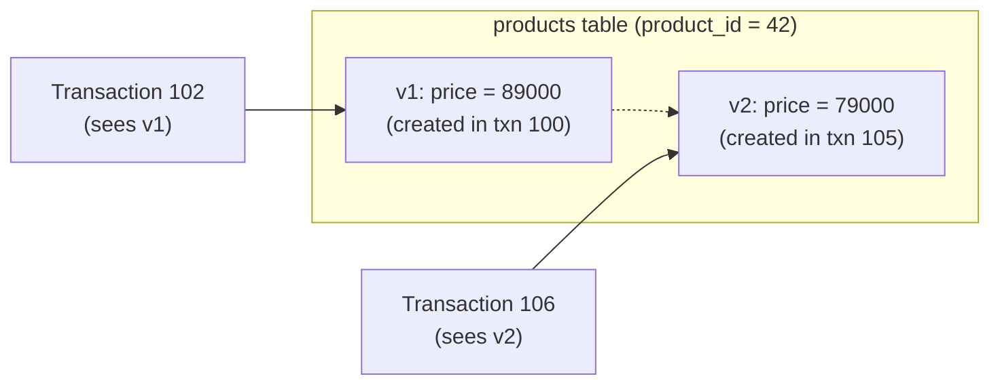

# DBA Basics -- Concurrency and Isolation Levels

In [Lesson 17](../intermediate/17-transactions.md), you learned about ACID properties and transaction basics (BEGIN / COMMIT / ROLLBACK). This appendix goes a step further, covering the problems that arise **when multiple users access the database simultaneously** and how to solve them.

!!! info "Target Databases"
    SQLite uses a single-writer connection model by default (write serialization even in WAL mode), so this appendix focuses on **MySQL / PostgreSQL**.

---

## 3 Concurrency Problems

When multiple transactions execute simultaneously, the following three problems can occur depending on the isolation level.

### Dirty Read

Reading **uncommitted** changes from another transaction.

```
Time    Transaction A (Warehouse Staff)     Transaction B (Order Processing)
-----  --------------------------------  --------------------------------
t1     UPDATE products
       SET stock = 0
       WHERE product_id = 42;
t2                                        SELECT stock FROM products
                                          WHERE product_id = 42;
                                          -> 0 (reads uncommitted value!)
t3     ROLLBACK;                          -- A rolled back, but B already
                                          -- rejected the order based on stock = 0
```

> Transaction B made a decision based on a change that never existed. This is a **Dirty Read**.

### Non-Repeatable Read

**Reading the same row twice within the same transaction and getting different values.**

```
Time    Transaction A (Report Generation)   Transaction B (Price Change)
-----  --------------------------------  --------------------------------
t1     SELECT price FROM products
       WHERE product_id = 42;
       -> 89,000
t2                                        UPDATE products
                                          SET price = 79000
                                          WHERE product_id = 42;
                                          COMMIT;
t3     SELECT price FROM products
       WHERE product_id = 42;
       -> 79,000 (same row, different value!)
```

> The report shows 89,000 in the first part and 79,000 in the later part. From Transaction A's perspective, **data is inconsistent**.

### Phantom Read

**The number of rows changes** when querying with the same condition.

```
Time    Transaction A (Sales Summary)       Transaction B (New Order)
-----  --------------------------------  --------------------------------
t1     SELECT COUNT(*) FROM orders
       WHERE order_date = '2025-04-11';
       -> 150 rows
t2                                        INSERT INTO orders (...)
                                          VALUES (...);  -- 4/11 order
                                          COMMIT;
t3     SELECT COUNT(*) FROM orders
       WHERE order_date = '2025-04-11';
       -> 151 rows (phantom row appeared!)
```

> Non-Repeatable Read is when **an existing row's value** changes, while Phantom Read is when **rows themselves are added/deleted**.

---

## 4 Isolation Levels

The SQL standard defines 4 isolation levels based on how much of the above problems are allowed.

| Isolation Level | Dirty Read | Non-Repeatable Read | Phantom Read | Concurrency |
|-----------------|:----------:|:-------------------:|:------------:|:-----------:|
| **READ UNCOMMITTED** | Possible | Possible | Possible | High |
| **READ COMMITTED** | Prevented | Possible | Possible | ^ |
| **REPEATABLE READ** | Prevented | Prevented | Possible | v |
| **SERIALIZABLE** | Prevented | Prevented | Prevented | Low |

- Higher levels offer **better concurrency but weaker data consistency**, while lower levels offer **stronger consistency but less concurrency**.
- Most web applications work fine with READ COMMITTED or REPEATABLE READ.

### Default Isolation Levels

| Database | Default |
|----------|---------|
| MySQL (InnoDB) | REPEATABLE READ |
| PostgreSQL | READ COMMITTED |
| SQL Server | READ COMMITTED |
| Oracle | READ COMMITTED |

### Setting Isolation Level

=== "MySQL"

    ```sql
    -- Check current session isolation level
    SELECT @@transaction_isolation;

    -- Change at session level
    SET SESSION TRANSACTION ISOLATION LEVEL READ COMMITTED;

    -- Change for next transaction only
    SET TRANSACTION ISOLATION LEVEL SERIALIZABLE;
    ```

=== "PostgreSQL"

    ```sql
    -- Check current isolation level
    SHOW transaction_isolation;

    -- Change for current transaction
    BEGIN;
    SET TRANSACTION ISOLATION LEVEL REPEATABLE READ;
    -- ... queries ...
    COMMIT;
    ```

---

## MVCC (Multi-Version Concurrency Control)

MySQL (InnoDB) and PostgreSQL manage concurrency using **MVCC**. The core idea is simple:

> **When modifying data, don't overwrite the existing version -- create a new version.**



- Each transaction sees a **snapshot** as of its start time.
- Reads (SELECT) fetch data from their own snapshot without locks.
- Only writes (UPDATE/DELETE) acquire locks on the affected rows.

This allows **reads and writes to not block each other**, maintaining high concurrency.

---

## Locks

While MVCC resolves read conflicts, **write-write conflicts** still need to be managed with locks.

### Row Lock vs Table Lock

| Lock Scope | Description | Concurrency |
|------------|-------------|:-----------:|
| Row Lock | Locks only the row being modified. Default for InnoDB and PostgreSQL | High |
| Table Lock | Locks the entire table. Default for MyISAM, occurs during DDL | Low |

> Normal INSERT/UPDATE/DELETE operations only produce **row locks**. Table locks are used for DDL like ALTER TABLE or explicit `LOCK TABLE` commands.

### Deadlock

A state where two transactions are **each waiting for the lock held by the other, forever**.

```
Time    Transaction A                       Transaction B
-----  --------------------------------  --------------------------------
t1     UPDATE orders SET ...
       WHERE order_id = 1;
       (acquires lock on order_id=1)
t2                                        UPDATE orders SET ...
                                          WHERE order_id = 2;
                                          (acquires lock on order_id=2)
t3     UPDATE orders SET ...
       WHERE order_id = 2;
       -> waiting (B holds the lock)
t4                                        UPDATE orders SET ...
                                          WHERE order_id = 1;
                                          -> waiting (A holds the lock)
                                          DEADLOCK!
```

The database automatically detects deadlocks and **force-rolls back one transaction (victim selection)** to resolve the situation. The rolled-back transaction receives an error, and the application must implement retry logic.

!!! tip "Deadlock Prevention Tips"
    - **Keep transactions short.** The shorter the lock hold time, the lower the chance of conflicts.
    - **Access tables/rows in the same order.** If both A and B access order_id 1 then 2, deadlock won't occur.
    - **Avoid external API calls or waiting for user input inside transactions.**

---

## Summary

| Concept | Key Takeaway |
|---------|-------------|
| Dirty Read | Reading uncommitted data |
| Non-Repeatable Read | Re-reading the same row yields a different value |
| Phantom Read | Same query condition returns a different row count |
| READ UNCOMMITTED | Allows all problems, rarely used |
| READ COMMITTED | Prevents only Dirty Read (PG/Oracle/MSSQL default) |
| REPEATABLE READ | Only allows Phantoms (MySQL default) |
| SERIALIZABLE | Prevents all problems, lowest concurrency |
| MVCC | Snapshot-based -- reads don't block writes |
| Row Lock | Locks only the row being modified (InnoDB, PG default) |
| Deadlock | Mutual lock wait -- DB auto-detects and rolls back one side |

!!! quote "Go Back"
    [Lesson 17: Transactions and ACID](../intermediate/17-transactions.md)
