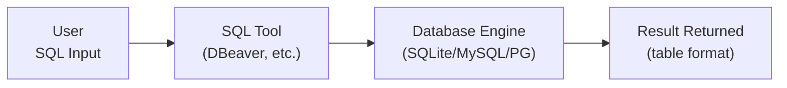
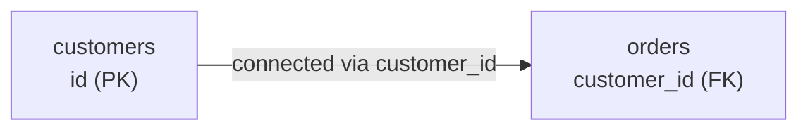

# Lesson 0: Introduction to Databases and SQL

This lesson is a starting point for those new to SQL. We proceed in the order of concept, practice, and terminology review.

!!! note "Already familiar?"
    If you already know the concepts of databases, SQL, tables, PK/FK, skip this lesson and go directly to [Lesson 1: SELECT Basics](01-select.md).

---

## What Is a Database?

### Why Not Just Use a Spreadsheet?

Imagine managing a customer list in a spreadsheet at work. It works fine at first. But over time:

- When you reach 50,000 customers, the file gets heavy and takes 30 seconds just to open
- The marketing team and CS team **cannot** edit the same file simultaneously
- If someone accidentally breaks a formula, the entire dataset is ruined
- To find "VIP customers over 30 who ordered this month," you need to apply multiple filters

A **database** fundamentally solves these problems:

| Spreadsheet Limitation | Database Solution |
|------------------------|-------------------|
| Slows down with tens of thousands of records | Searches millions to billions of records quickly |
| Cannot edit simultaneously | Multiple people can read and write at the same time |
| Data breaks from mistakes | Constraints prevent invalid data |
| Hard to find with complex conditions | Extract precisely with a single SQL statement |
| Everything in one file | Separated into tables and connected by relationships |

Websites, online stores, banks, hospitals, games -- behind almost every piece of software that handles data, there is a database.

### Why Split into Multiple Tables?

In a database, instead of putting all data in one big spreadsheet, data is stored **split across multiple tables**. Let's compare using TechShop data:

**Bad example -- everything in one table:**

| order_number | customer_name | customer_email | product_name | price |
|---------|---------|----------|--------|------|
| ORD-001 | 정준호 | jjh0001@testmail.kr | Laptop | 1,200,000 |
| ORD-002 | 정준호 | jjh0001@testmail.kr | Mouse | 35,000 |
| ORD-003 | 김민재 | kmj0002@testmail.kr | Keyboard | 89,000 |

If 정준호's email changes? You'd have to update **both** orders ORD-001 and ORD-002. If there are 100 orders, you'd have to update 100 places.

**Good example -- separated tables:**

**customers table:**

| id | name | email |
|---:|------|-------|
| 1 | 정준호 | jjh0001@testmail.kr |
| 2 | 김민재 | kmj0002@testmail.kr |

**orders table:**

| id | customer_id | total_amount |
|---:|:-----------:|-----------:|
| 1 | 1 | 1,200,000 |
| 2 | 1 | 35,000 |
| 3 | 2 | 89,000 |

If the email changes, you update **only one place** in the customers table. Since `customer_id` in the orders table points to `id` in the customers table, the relationship is automatically maintained.

This is the core of a **relational database** (RDBMS):

- **Reduces duplication** -- customer information is stored in only one place
- **Maintains consistency** -- only one place needs to be updated
- **Enables flexible combinations** -- tables can be joined as needed

---

## What Is SQL?

**SQL** (Structured Query Language, pronounced "ess-queue-ell" or "sequel") is the language for communicating with databases.

When you want to say "Show me the names and emails of customers with VIP grade," in SQL you write:

```sql
SELECT name, email
FROM customers
WHERE grade = 'VIP';
```

**SELECT** (show me) **FROM** (from where) **WHERE** (condition) -- it reads like an English sentence. SQL is the closest to natural language among programming languages.

### What SQL Can Do

| What you want to do | SQL Command | TechShop Example |
|---------------------|-------------|------------------|
| Retrieve data | `SELECT` | VIP customer list, this month's revenue |
| Add data | `INSERT` | Register new customer, create order |
| Modify data | `UPDATE` | Change price, upgrade grade |
| Delete data | `DELETE` | Remove withdrawn customer |

These four operations are called **CRUD** (Create, Read, Update, Delete) and form the core of SQL.

### How Is SQL Executed?

When you first encounter SQL, you might wonder "where do I type this?" The flow is simple:



1. You type a SQL statement in a **SQL tool** (DBeaver, DB Browser, etc.)
2. The tool sends the SQL to the **database engine**
3. The engine parses and executes the SQL, then **returns the result**
4. The result is displayed on screen in table format

### Why Learn SQL?

- **Universality** -- Used across almost all databases: MySQL, PostgreSQL, SQLite, Oracle, etc. Learn it once, use it anywhere
- **Demand** -- Developers, data analysts, marketers, PMs -- nearly every role in the IT industry requires SQL
- **Efficiency** -- Tasks that take 30 minutes in a spreadsheet can be done in 1 second with a single SQL statement
- **History** -- A proven technology that has been in use for over 50 years since the 1970s. It is unlikely to disappear

> **Key takeaway:** Learning SQL means learning **how to ask questions of your data**.

---

## Try It Yourself -- Your First Query

This tutorial uses the database of a fictional e-commerce store called **TechShop**. It is a 10-year-old online shop selling computers and peripherals, containing realistic data including customers, products, orders, payments, shipping, reviews, and more. The full structure can be found at [Database Schema](../schema/index.md).

You don't need to know the syntax yet. Copy the query below into your SQL tool and run it:

```sql
-- Retrieve 3 customers
SELECT id, name, email, grade
FROM customers
LIMIT 3;
```

| id | name | email | grade |
| -: | ---- | ----- | ----- |
| 1 | 정준호 | jjh0001@testmail.kr | SILVER |
| 2 | 김민재 | kmj0002@testmail.kr | GOLD |
| 3 | 진정자 | jjj0003@testmail.kr | NORMAL |

This means "show me the id, name, email, and grade columns from the customers table, limited to 3 rows." If you got a result, congratulations -- you just ran your first SQL query!

!!! tip "If no result appears"
    Make sure you have completed the database creation and SQL tool setup in [Getting Started](../setup/index.md).

---

## Breaking Down the Result

Let's review the result from the first query and define our terminology.


| Term | Meaning | In the result above |
| ---- | ------- | -------------------|
| **Table** | A unit that stores data | `customers` (the whole thing) |
| **Column** | A vertical line -- one attribute | The `id` column: 1, 2, 3 |
| **Row** | A horizontal line -- one record | `1, 정준호, jjh0001@testmail.kr, SILVER` |
| **Cell** | A single value where a row and column meet | First row of the id column -> `1` |

### Data Types

Each column has a defined kind of data it can store:

| Kind | Representative Type | In the result above |
| ---- | ------------------- | -------------------|
| Integer | `INTEGER` | `id` (1, 2, 3) |
| String | `TEXT` | `name`, `email`, `grade` |
| Decimal | `REAL` | Price, amount (in other tables) |
| Date | `TEXT`/`DATE` | Signup date, order date (in other tables) |

### NULL -- "No Value"

There is one more important concept in databases: **NULL**.

NULL means **"the value is missing."** It is different from 0 or an empty string (''):

| Value | Meaning | TechShop Example |
|-------|---------|------------------|
| `0` | A value of the number 0 exists | Point balance is 0 won -- the balance has been confirmed |
| `''` | A value of an empty string exists | The memo is empty -- the memo field exists |
| `NULL` | No value at all (unknown) | Date of birth was not entered -- age is unknown |

In TechShop's `customers` table:

- Customers with NULL `birth_date` -- customers who did not enter their date of birth (about 15%)
- Customers with NULL `gender` -- customers who did not select a gender (about 10%)
- Customers with NULL `last_login_at` -- customers who have never logged in

You will learn how to properly handle NULL in [Lesson 6: Handling NULL](06-null.md).

---

## Connecting Tables -- PK and FK

Earlier we said "tables are separated and connected by relationships." Let's see how they connect.

### Primary Key

The `id` column in the result we just queried had the numbers 1, 2, 3. This is the **primary key (PK)**. It is a column that uniquely identifies each row.

- `id = 2` points to **only one person**, 김민재
- Even if there are multiple people named "김민재," they can be precisely distinguished by `id`
- No two rows can have the same `id`, and no row can lack an `id`

### Foreign Key

The `customer_id` in the `orders` table points to `id` in the `customers` table. This is the **foreign key (FK)**.

| orders.id | customer_id (FK) | total_amount |
|----------:|-----------------:|-------------:|
| 1 | **1** | 350,000 |
| 2 | **1** | 89,000 |
| 3 | **2** | 1,200,000 |

Orders 1 and 2 with `customer_id = 1` belong to 정준호. The fact that one customer can have multiple orders is called a **1:N (one-to-many) relationship**.



### PK and FK Summary

| | Primary Key (PK) | Foreign Key (FK) |
|-| ----------------- | ---------------- |
| TechShop example | `customers.id` | `orders.customer_id` |
| Role | Uniquely identifies each row | Points to a row in another table |
| Duplicates | Not allowed | Allowed (1 customer can have multiple orders) |
| NULL | Not allowed | Allowed |

!!! tip "For now, just remember this"
    **"Each table has a unique number (PK), and references another table's number (FK) to connect them."** You will learn how to create PKs and FKs in [Lesson 16: DDL](../intermediate/16-ddl.md).

---

## Summary

| Concept | One-Line Summary | TechShop Example |
|---------|-----------------|------------------|
| Database | A system for managing large amounts of data safely and quickly | All data of the TechShop store |
| SQL | A language for querying databases | `SELECT name FROM customers WHERE grade = 'VIP'` |
| Table | A unit that stores data in rows and columns | `customers`, `orders`, `products` |
| Relational DB | A structure that separates tables and connects them by relationships to reduce duplication | customers + orders separation |
| PK | A column that uniquely identifies each row | `customers.id = 2` -> only 김민재 |
| FK | A column that references another table's PK to create a relationship | `orders.customer_id -> customers.id` |
| NULL | No value (different from 0 or empty string) | Customers who did not enter their date of birth |

In the next lesson, we will learn `SELECT` in earnest. Building on the first query you just tried, you will master how to retrieve data freely.

---

!!! note "Lesson Review Problems"
    These are simple problems to immediately check the concepts learned in this lesson.

### Problem 1
Which of the following is **NOT** an appropriate reason to use a database?

- (A) It can quickly search through millions of records
- (B) Multiple people can read and write data simultaneously
- (C) File size is always smaller than a spreadsheet
- (D) Complex conditions can be extracted precisely with SQL

??? success "Answer"
    **(C) File size is always smaller than a spreadsheet**

    The advantages of databases are large-scale processing, concurrent access, complex condition searching, and data safety. There is no guarantee that file size is always smaller.

### Problem 2
Which of the following is **NOT** one of the four basic SQL operations (CRUD)?

- (A) SELECT
- (B) INSERT
- (C) SORT
- (D) DELETE

??? success "Answer"
    **(C) SORT**

    CRUD stands for Create (INSERT), Read (SELECT), Update (UPDATE), Delete (DELETE). Sorting is done with the `ORDER BY` clause, but it is not a standalone CRUD operation.

### Problem 3
In the following table, how many **rows** and how many **columns** are there?

| id | name | email | grade |
| -: | ---- | ----- | ----- |
| 1 | 정준호 | jjh0001@testmail.kr | SILVER |
| 2 | 김민재 | kmj0002@testmail.kr | GOLD |
| 3 | 진정자 | jjj0003@testmail.kr | NORMAL |

- (A) 3 rows, 4 columns
- (B) 4 rows, 4 columns
- (C) 3 rows, 3 columns
- (D) 12 rows, 1 column

??? success "Answer"
    **(A) 3 rows, 4 columns**

    The header (id, name, email, grade) contains column names, so it is not counted as a row. There are 3 data rows (정준호, 김민재, 진정자) and 4 columns (id, name, email, grade).

### Problem 4
The `id` column of the `customers` table is a primary key (PK). Which of the following is **NOT** a characteristic of a primary key?

- (A) It uniquely identifies each row
- (B) It cannot have a NULL value
- (C) Multiple primary keys can be created in one table
- (D) It cannot have duplicate values

??? success "Answer"
    **(C) Multiple primary keys can be created in one table**

    A primary key is limited to one per table. What can be created in multiples is foreign keys (FK).

### Problem 5
The `customer_id` in the `orders` table references the `id` in the `customers` table. What is `customer_id`?

- (A) Primary Key
- (B) Foreign Key
- (C) Data Type
- (D) Table Name

??? success "Answer"
    **(B) Foreign Key**

    A column that references the primary key of another table is called a foreign key. `customer_id` references `customers.id` to indicate "which customer this order belongs to."

### Problem 6
One customer can place multiple orders, and each order belongs to only one customer. What is this type of relationship called?

- (A) 1:1 relationship
- (B) 1:N relationship
- (C) N:N relationship
- (D) No relationship

??? success "Answer"
    **(B) 1:N relationship (one-to-many)**

    Since one customer (1) can have multiple orders (N), it is a 1:N relationship.

### Problem 7
In the `customers` table, some customers have a NULL `birth_date` column. What does NULL mean?

- (A) The date of birth is 0000-00-00
- (B) The date of birth is an empty string ('')
- (C) There is no date of birth value (not entered)
- (D) The date of birth is today's date

??? success "Answer"
    **(C) There is no date of birth value (not entered)**

    NULL is different from 0 or an empty string. It means "the value itself does not exist." NULL occurs when a customer has not entered their date of birth.

### Problem 8
Which of the following is **NOT** an appropriate reason for splitting data into multiple tables in a relational database?

- (A) To reduce data duplication
- (B) Because consistency is maintained by updating only one place
- (C) To use more storage space
- (D) To flexibly combine tables as needed

??? success "Answer"
    **(C) To use more storage space**

    Splitting tables reduces duplication, which actually saves storage space.

### Problem 9
In the `customers` table, the data type of `id` is `INTEGER` and the data type of `name` is `TEXT`. Which value **cannot** be stored in an `INTEGER` column?

- (A) 42
- (B) 0
- (C) -7
- (D) '김민재'

??? success "Answer"
    **(D) '김민재'**

    `INTEGER` can only store integers. The string '김민재' must be stored in a `TEXT` type column.

### Problem 10
What is the correct interpretation of the SQL statement `SELECT name, email FROM customers WHERE grade = 'VIP';`?

- (A) It deletes the customers table
- (B) It retrieves the name and email of customers with VIP grade from the customers table
- (C) It changes all customer grades to VIP in the customers table
- (D) It adds a VIP customer to the customers table

??? success "Answer"
    **(B) It retrieves the name and email of customers with VIP grade from the customers table**

    `SELECT` is a command to retrieve data. `FROM` specifies which table, and `WHERE` specifies which condition to filter by.

### Scoring Guide

Check your next step based on the number of correct answers:

| Score | Level | Next Step |
|:-----:|-------|-----------|
| **9-10** | Ready | Go directly to [Lesson 1: SELECT Basics](01-select.md) |
| **7-8** | Almost ready | Re-read the explanations for questions you got wrong, review the relevant sections, then proceed to Lesson 1 |
| **4-6** | Core concepts lacking | Read this lesson again from the beginning. Focus especially on the sections where you got questions wrong |
| **0-3** | Start from basics | Read this lesson again slowly and refer to the supplementary materials below first |

**Problem Areas:**

| Area | Problems | Review Section |
|------|:--------:|----------------|
| Database concepts | 1, 8 | [What Is a Database?](#what-is-a-database) |
| SQL basics | 2, 10 | [What Is SQL?](#what-is-sql) |
| Table structure | 3, 9 | [Breaking Down the Result](#breaking-down-the-result) |
| PK and FK | 4, 5, 6 | [Connecting Tables -- PK and FK](#connecting-tables----pk-and-fk) |
| NULL | 7 | [NULL -- "No Value"](#null----no-value) |

---
Next: [Lesson 1: SELECT Basics](01-select.md)
