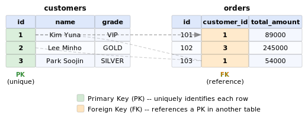

# Lesson 0: Introduction to Databases and SQL

Before writing your first query, let's understand what databases are, how they organize data, and why SQL exists. This lesson covers the foundational concepts you'll build on throughout the tutorial.


## What is SQL?

**SQL** (Structured Query Language) is a language designed for communicating with databases. Think of it as a way to ask questions about data and get precise answers back.

SQL was born at IBM in the 1970s and has since become the most widely used language for working with data. Nearly every major database system supports it:

| Database       | Type         | Common Use                    |
| -------------- | ------------ | ----------------------------- |
| SQLite         | Embedded     | Mobile apps, small projects   |
| MySQL          | Server-based | Web applications              |
| PostgreSQL     | Server-based | Complex applications, analytics |
| SQL Server     | Server-based | Enterprise systems            |
| Oracle         | Server-based | Large-scale enterprise        |

Despite minor dialect differences, the core SQL you learn works across all of them.

SQL breaks down into four main operations:

| Operation  | Purpose              | Example                         |
| ---------- | -------------------- | ------------------------------- |
| `SELECT`   | Read data            | Show me all VIP customers       |
| `INSERT`   | Add new data         | Register a new customer         |
| `UPDATE`   | Modify existing data | Change a customer's grade       |
| `DELETE`   | Remove data          | Delete a cancelled order        |

This tutorial focuses primarily on `SELECT` -- the most frequently used operation and the foundation of everything else.


## What is an RDBMS?

An **RDBMS** (Relational Database Management System) stores data in **tables** that can be linked to each other through **relationships**. If you've ever used a spreadsheet, you already have the right mental model -- a database table looks a lot like a sheet in Excel or Google Sheets.

The key difference: in a spreadsheet, data lives in isolated sheets. In an RDBMS, tables are connected. A `customers` table links to an `orders` table, which links to `products`. This web of relationships is what makes relational databases powerful.


The diagram above shows four connected tables from our tutorial database. Arrows indicate how one table references another. You'll learn exactly how these connections work in the sections below.


## Tables, Rows, and Columns

Every table in a database has the same structure:

- **Table** -- a collection of related data (like one sheet in a workbook)
- **Column** -- a single attribute (like `name`, `email`, or `grade`)
- **Row** -- one complete record (like one customer)
- **Cell** -- the value where a specific row and column meet


Here's what a few rows from the `customers` table look like:

```sql
SELECT id, name, email, grade
FROM customers
LIMIT 3;
```

| id | name         | email             | grade  |
| -: | ------------ | ----------------- | ------ |
|  1 | Kim Yuna     | user1@testmail.kr | VIP    |
|  2 | Lee Minho    | user2@testmail.kr | GOLD   |
|  3 | Park Soojin  | user3@testmail.kr | SILVER |

Each row is one customer. Each column describes one attribute of that customer. The `id` column gives every row a unique number -- which brings us to primary keys.


## Primary Key (PK)

A **primary key** is a column (or set of columns) that uniquely identifies each row in a table. It has two strict rules:

1. **No duplicates** -- every value must be unique
2. **No NULLs** -- every row must have a value

In most tables, the primary key is a column called `id` that auto-increments: 1, 2, 3, ...

| id (PK) | name         | email             |
| ------: | ------------ | ----------------- |
|       1 | Kim Yuna     | user1@testmail.kr |
|       2 | Lee Minho    | user2@testmail.kr |
|       3 | Park Soojin  | user3@testmail.kr |

Why does this matter? Because when another table needs to refer to a specific customer, it can use the `id` value. There's no ambiguity -- `id = 1` always means exactly one customer.


## Foreign Key (FK)

A **foreign key** is a column that references a primary key in another table. It's the mechanism that creates relationships between tables.

Consider the `orders` table:

| id | customer_id (FK) | order_date | total_amount |
| -: | ---------------: | ---------- | -----------: |
|  1 |                1 | 2024-01-15 |        89000 |
|  2 |                3 | 2024-01-16 |       245000 |
|  3 |                1 | 2024-02-01 |        54000 |

The `customer_id` column is a foreign key pointing to `customers.id`. Order #1 and order #3 both have `customer_id = 1`, meaning they belong to Kim Yuna.



Foreign keys enforce **referential integrity** -- you can't create an order with `customer_id = 999` if no customer with `id = 999` exists. The database itself prevents orphaned records.


## Primary Key vs. Foreign Key

| Aspect          | Primary Key (PK)                       | Foreign Key (FK)                         |
| --------------- | -------------------------------------- | ---------------------------------------- |
| Purpose         | Uniquely identify each row             | Link to a row in another table           |
| Duplicates      | Not allowed                            | Allowed (many orders for one customer)   |
| NULL            | Not allowed                            | Sometimes allowed                        |
| Per table       | Exactly one                            | Zero or more                             |
| Example         | `customers.id`                         | `orders.customer_id`                     |


## Data Types Overview

Every column has a **data type** that defines what kind of values it can hold. The most common types:

| Category | Types                    | Example Values              |
| -------- | ------------------------ | --------------------------- |
| Numbers  | INTEGER, REAL, DECIMAL   |        42, 3.14, 1299000    |
| Text     | TEXT, VARCHAR, CHAR      | 'Kim Yuna', 'VIP'          |
| Dates    | DATE, DATETIME, TIMESTAMP | '2024-01-15', '2024-01-15 09:30:00' |
| Boolean  | BOOLEAN                  | TRUE, FALSE                 |

The exact type names vary slightly between databases. You'll learn the details in Lesson 15 when we cover DDL (Data Definition Language). For now, just know that columns are typed -- a number column won't accept text, and a date column expects properly formatted dates.


## The Tutorial Database: TechShop

Throughout this tutorial, you'll work with **TechShop** -- a fictional e-commerce store that sells computers and peripherals. The database simulates 10 years of business operations with realistic data.

**Scale:**

- **30 tables**, **687,000+ rows** of data
- Customers, orders, products, reviews, payments, shipping, inventory, and more

**Core data flow:**

```
customers --> orders --> order_items --> products
                |                         |
                v                         v
            payments                   reviews
```

A customer places an order. The order contains one or more items, each linked to a product. A payment is recorded for the order. After receiving their products, customers may leave reviews.

This is a realistic schema -- not a toy example. The patterns you learn here apply directly to real-world databases you'll encounter in production.

---

!!! note "Lesson Review"
    Quick exercises to check your understanding of this lesson. For comprehensive practice combining multiple concepts, see the [Exercises](../exercises/index.md) section.


### Exercise 1

Which of the following is **NOT** a characteristic of a primary key?

A. Every value must be unique  
B. NULL values are not allowed  
C. A table can have multiple primary keys  
D. It identifies each row uniquely  

??? success "Answer"
    **C. A table can have multiple primary keys.**

    A table has exactly one primary key. While a primary key can consist of multiple columns (called a composite key), the table still has only one primary key constraint. Options A, B, and D are all true characteristics.


### Exercise 2

In the `orders` table, `customer_id` references `customers.id`. What type of key is `customer_id`?

A. Primary key  
B. Foreign key  
C. Composite key  
D. Unique key  

??? success "Answer"
    **B. Foreign key.**

    A column that references a primary key in another table is called a foreign key. It creates a relationship between the two tables -- in this case, linking each order to the customer who placed it.


### Exercise 3

Look at these two rows from the `orders` table:

| id | customer_id | total_amount |
| -: | ----------: | -----------: |
|  1 |           5 |        89000 |
|  2 |           5 |       124000 |

What can you conclude from `customer_id = 5` appearing twice?

A. There is an error -- foreign keys cannot have duplicate values  
B. Customer #5 placed two separate orders  
C. The two orders are for the same product  
D. The orders table has two primary keys  

??? success "Answer"
    **B. Customer #5 placed two separate orders.**

    Foreign keys can have duplicate values -- that's how one-to-many relationships work. One customer can have many orders. Each row still has a unique `id` (the primary key), but `customer_id` is a foreign key and duplicates are perfectly normal.


### Exercise 4

Which SQL operation would you use to find all orders placed in January 2024?

A. INSERT  
B. UPDATE  
C. SELECT  
D. DELETE  

??? success "Answer"
    **C. SELECT.**

    SELECT is used to read (query) data from the database. You would write something like `SELECT * FROM orders WHERE order_date BETWEEN '2024-01-01' AND '2024-01-31'`. INSERT adds new data, UPDATE modifies existing data, and DELETE removes data.


### Exercise 5

In a database table, what is the correct term for a single value located at the intersection of one row and one column?

A. Record  
B. Field  
C. Cell  
D. Tuple  

??? success "Answer"
    **C. Cell.**

    A cell is the value where a specific row and column intersect -- just like in a spreadsheet. A record (or tuple) refers to an entire row, and a field generally refers to a column definition.


---
Next: [Lesson 1: SELECT Basics](01-select.md)
