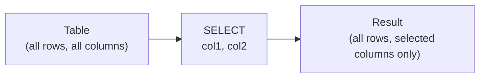

# Lesson 1: SELECT Basics

In Lesson 0, you ran `SELECT id, name, email, grade FROM customers LIMIT 3`. In this lesson, we will learn `SELECT` in depth.

`SELECT` is the most frequently used command in SQL. It **retrieves specific columns from a table**.



!!! note "Already familiar?"
    If you already know SELECT, AS, and DISTINCT, move on to [Lesson 2: Filtering with WHERE](02-where.md).

---

## Retrieving All Columns -- SELECT *

`SELECT *` retrieves **all columns** from the table. It is useful for quickly scanning what data exists in a table.

```sql
SELECT * FROM categories;
```

**Result:**

| id | parent_id | name | slug | depth | sort_order | is_active | created_at | updated_at |
| ----------: | ---------- | ---------- | ---------- | ----------: | ----------: | ----------: | ---------- | ---------- |
| 1 | (NULL) | Desktop PC | desktop-pc | 0 | 1 | 1 | 2016-01-01 00:00:00 | 2016-01-01 00:00:00 |
| 2 | 1 | Pre-built | desktop-prebuilt | 1 | 1 | 1 | 2016-01-01 00:00:00 | 2016-01-01 00:00:00 |
| 3 | 1 | Custom Build | desktop-custom | 1 | 2 | 1 | 2016-01-01 00:00:00 | 2016-01-01 00:00:00 |
| 4 | 1 | Barebone | desktop-barebone | 1 | 3 | 1 | 2016-01-01 00:00:00 | 2016-01-01 00:00:00 |
| 5 | (NULL) | Laptop | laptop | 0 | 2 | 1 | 2016-01-01 00:00:00 | 2016-01-01 00:00:00 |
| 6 | 5 | General Laptop | laptop-general | 1 | 1 | 1 | 2016-01-01 00:00:00 | 2016-01-01 00:00:00 |
| 7 | 5 | Gaming Laptop | laptop-gaming | 1 | 2 | 1 | 2016-01-01 00:00:00 | 2016-01-01 00:00:00 |
| 8 | 5 | 2-in-1 | laptop-2in1 | 1 | 3 | 1 | 2016-01-01 00:00:00 | 2016-01-01 00:00:00 |
| ... | ... | ... | ... | ... | ... | ... | ... | ... |

!!! warning "SELECT * is for learning"
    `SELECT *` retrieves all columns, so it can be slow on large tables. In practice, develop the habit of **specifying only the columns you need**. From here on in this tutorial, we will specify columns directly.

---

## Retrieving Specific Columns

By listing column names directly, you can view **only the columns you want** in a clean format.

Let's revisit the query from Lesson 0:

```sql
SELECT name, price, stock_qty
FROM products;
```

**Result:**

| name | price | stock_qty |
| ---------- | ----------: | ----------: |
| Razer Blade 18 Black | 2987500.0 | 107 |
| MSI GeForce RTX 4070 Ti Super GAMING X | 1744000.0 | 499 |
| Samsung DDR4 32GB PC4-25600 | 43500.0 | 359 |
| Dell U2724D | 894100.0 | 337 |
| G.SKILL Trident Z5 DDR5 64GB 6000MHz White | 167000.0 | 59 |
| MSI Radeon RX 9070 VENTUS 3X White | 383100.0 | 460 |
| Samsung DDR5 32GB PC5-38400 | 211800.0 | 340 |
| Logitech G715 White | 131500.0 | 341 |
| ... | ... | ... |

The result is much easier to read than `SELECT *`. **The column order in the result also follows the order listed in SELECT**.

```sql
-- Changing the order changes the result order
SELECT stock_qty, name, price
FROM products;
```

| stock_qty | name | price |
| --------: | ---- | ----: |
| 107 | Razer Blade 18 블랙 | 2987500 |
| ... | ... | ... |

---

## Column Aliases (AS)

### Why Aliases Are Needed

If the result column is named `stock_qty`, someone who doesn't know the code might not understand what it means. Using `AS`, you can **change the column name displayed in the result**.

```sql
SELECT
    name      AS product_name,
    price     AS sale_price,
    stock_qty AS inventory
FROM products;
```

**Result:**

| product_name | sale_price | inventory |
| ---------- | ----------: | ----------: |
| Razer Blade 18 Black | 2987500.0 | 107 |
| MSI GeForce RTX 4070 Ti Super GAMING X | 1744000.0 | 499 |
| Samsung DDR4 32GB PC4-25600 | 43500.0 | 359 |
| Dell U2724D | 894100.0 | 337 |
| G.SKILL Trident Z5 DDR5 64GB 6000MHz White | 167000.0 | 59 |
| MSI Radeon RX 9070 VENTUS 3X White | 383100.0 | 460 |
| Samsung DDR5 32GB PC5-38400 | 211800.0 | 340 |
| Logitech G715 White | 131500.0 | 341 |
| ... | ... | ... |

!!! info "Aliases only affect the result"
    `AS` does not change the actual column name in the table. It only changes **the name displayed in the result**.

### Adding Aliases to Calculations

Aliases are particularly useful for naming calculation results. Without an alias, the column name becomes the expression itself, like `price * 0.9`.

```sql
SELECT
    name,
    price,
    price * 0.9 AS discounted_price
FROM products;
```

**Result:**

| name | price | discounted_price |
| ---------- | ----------: | ----------: |
| Razer Blade 18 Black | 2987500.0 | 2688750.0 |
| MSI GeForce RTX 4070 Ti Super GAMING X | 1744000.0 | 1569600.0 |
| Samsung DDR4 32GB PC4-25600 | 43500.0 | 39150.0 |
| Dell U2724D | 894100.0 | 804690.0 |
| G.SKILL Trident Z5 DDR5 64GB 6000MHz White | 167000.0 | 150300.0 |
| MSI Radeon RX 9070 VENTUS 3X White | 383100.0 | 344790.0 |
| Samsung DDR5 32GB PC5-38400 | 211800.0 | 190620.0 |
| Logitech G715 White | 131500.0 | 118350.0 |
| ... | ... | ... |

### String Literal Columns

You can also add **fixed values** to the result that don't exist in the actual table:

```sql
SELECT
    name,
    price,
    'KRW' AS currency
FROM products;
```

| name | price | currency |
| ---- | ----: | --- |
| Razer Blade 18 블랙 | 2987500 | KRW |
| ... | ... | ... |

## Table Aliases

`AS` can be used to assign aliases to **tables** as well as columns. It may seem unnecessary now since we are using only one table, but it becomes essential in Lesson 7 (JOIN) when combining multiple tables.

```sql
-- Assign the alias p to the products table
SELECT p.name, p.price
FROM products AS p;
```

You can write `p.name` instead of `products.name` for brevity. `AS` can be omitted:

```sql
-- AS omitted (same result)
SELECT p.name, p.price
FROM products p;
```

!!! tip "Good to know in advance"
    In Lesson 7, you will write things like `SELECT p.name, c.name FROM products p JOIN categories c ON ...`. If both tables have a `name` column, you must distinguish them as `p.name` and `c.name`. For now, just remember that "you can assign aliases to tables too."

---

## Arithmetic Operations

You can perform arithmetic operations inside SELECT. They only appear in the result and do not change the original data.

| Operator | Meaning | Example |
|:--------:|---------|---------|
| `+` | Addition | `price + shipping_fee` |
| `-` | Subtraction | `price - cost_price` |
| `*` | Multiplication | `price * 1.1` (10% increase) |
| `/` | Division | `price / 1000` (in thousands) |
| `%` | Modulo | `id % 2` (odd/even check) |

```sql
SELECT
    name,
    price,
    cost_price,
    price - cost_price AS margin
FROM products;
```

| name | price | cost_price | margin |
| ---- | ----: | ---------: | ---: |
| Razer Blade 18 블랙 | 2987500 | 3086700 | -99200 |
| MSI GeForce RTX 4070 Ti Super GAMING X | 1744000 | 1360300 | 383700 |
| 삼성 DDR4 32GB PC4-25600 | 49100 | 37900 | 11200 |
| ... | ... | ... | ... |

> The first product's margin is **negative** (-99200). Cases where the cost exceeds the selling price do exist in real data.

---

## DISTINCT -- Removing Duplicates

### When to Use It

Use it when you want to know "what values exist in this column." For example, to find out the types of membership grades at TechShop:

```sql
SELECT DISTINCT grade
FROM customers;
```

**Result:**

| grade |
| ---------- |
| BRONZE |
| GOLD |
| VIP |
| SILVER |

You can see there are 4 grades. Without DISTINCT, all 5,230 rows would be output.

### NULL Is Treated as One Value

```sql
SELECT DISTINCT gender
FROM customers;
```

| gender |
| ------ |
| M |
| (NULL) |
| F |

The NULL we learned about in Lesson 0 appears here. Since some customers did not enter their gender, NULL is included as one unique value.

### DISTINCT on Multiple Columns

DISTINCT removes duplicates based on the **combination of the listed columns**:

```sql
SELECT DISTINCT grade, gender
FROM customers;
```

| grade | gender |
| ----- | ------ |
| BRONZE | M |
| BRONZE | F |
| BRONZE | (NULL) |
| SILVER | M |
| SILVER | F |
| ... | ... |

Only rows with unique combinations of `grade` and `gender` remain.

---

## Summary

| Syntax | Meaning | Example |
|--------|---------|---------|
| `SELECT *` | Retrieve all columns | `SELECT * FROM products` |
| `SELECT col1, col2` | Retrieve specific columns only | `SELECT name, price FROM products` |
| `AS alias` | Change result column name | `SELECT name AS product_name` |
| `FROM table AS t` | Table alias (required for JOINs) | `FROM products p` |
| Arithmetic operations | Calculation result as a column | `SELECT price * 0.9 AS discounted_price` |
| `DISTINCT` | Remove duplicates | `SELECT DISTINCT grade FROM customers` |

---

!!! note "Lesson Review Problems"
    These are simple problems to immediately check the concepts learned in this lesson. For comprehensive practice combining multiple concepts, see the [Practice Problems](../exercises/index.md) section.

### Problem 1
Retrieve all columns from the `categories` table.

??? success "Answer"
    ```sql
    SELECT * FROM categories;
    ```

    | id | parent_id | name | slug | depth | sort_order | is_active | created_at | updated_at |
    | -: | --------: | ---- | ---- | ----: | ---------: | --------: | ---------- | ---------- |
    | 1 | (NULL) | 데스크톱 PC | desktop-pc | 0 | 1 | 1 | 2016-01-01 00:00:00 | 2016-01-01 00:00:00 |
    | ... | ... | ... | ... | ... | ... | ... | ... | ... |

### Problem 2
Retrieve only `name` and `price` from the `products` table.

??? success "Answer"
    ```sql
    SELECT name, price FROM products;
    ```

    | name | price |
    | ---- | ----: |
    | Razer Blade 18 블랙 | 2987500 |
    | ... | ... |

### Problem 3
Retrieve `department`, `role`, `name` in that order from the `staff` table.

??? success "Answer"
    ```sql
    SELECT department, role, name
    FROM staff;
    ```

    | department | role | name |
    | ---------- | ---- | ---- |
    | 경영 | admin | 한민재 |
    | ... | ... | ... |

### Problem 4
Retrieve `name`, `email`, `grade` from the `customers` table with aliases `customer_name`, `email_address`, `tier`.

??? success "Answer"
    ```sql
    SELECT
        name  AS customer_name,
        email AS email_address,
        grade AS tier
    FROM customers;
    ```

    | customer_name | email_address | tier |
    | ----- | ----- | --- |
    | 정준호 | jjh0001@testmail.kr | SILVER |
    | ... | ... | ... |

### Problem 5
Retrieve `name`, `price` from the `products` table, and add a 10% discounted price with the alias `discounted_price`.

??? success "Answer"
    ```sql
    SELECT
        name,
        price,
        price * 0.9 AS discounted_price
    FROM products;
    ```

    | name | price | discounted_price |
    | ---- | ----: | ----: |
    | Razer Blade 18 블랙 | 2987500 | 2688750 |
    | ... | ... | ... |

### Problem 6
Retrieve `name`, `price`, `cost_price` from the `products` table, and add the margin (`price - cost_price`) and margin rate (`(price - cost_price) * 100 / price`) with aliases `margin` and `margin_rate`.

??? success "Answer"
    ```sql
    SELECT
        name,
        price,
        cost_price,
        price - cost_price                  AS margin,
        (price - cost_price) * 100 / price  AS margin_rate
    FROM products;
    ```

    | name | price | cost_price | margin | margin_rate |
    | ---- | ----: | ---------: | ---: | ----: |
    | Razer Blade 18 블랙 | 2987500 | 3086700 | -99200 | -3 |
    | MSI GeForce RTX 4070 Ti Super GAMING X | 1744000 | 1360300 | 383700 | 22 |
    | ... | ... | ... | ... | ... |

### Problem 7
Retrieve the unique `status` values from the `orders` table.

??? success "Answer"
    ```sql
    SELECT DISTINCT status
    FROM orders;
    ```

    | status |
    | ------ |
    | cancelled |
    | confirmed |
    | delivered |
    | paid |
    | pending |
    | ... |

### Problem 8
Retrieve the unique `method` values from the `payments` table to see what payment methods TechShop supports.

??? success "Answer"
    ```sql
    SELECT DISTINCT method
    FROM payments;
    ```

    | method |
    | ------ |
    | card |
    | point |
    | kakao_pay |
    | bank_transfer |
    | naver_pay |
    | virtual_account |

### Problem 9
Retrieve `name`, `price`, `stock_qty` from the `products` table, and add `price * stock_qty` with the alias `inventory_value`.

??? success "Answer"
    ```sql
    SELECT
        name,
        price,
        stock_qty,
        price * stock_qty AS inventory_value
    FROM products;
    ```

    | name | price | stock_qty | inventory_value |
    | ---- | ----: | --------: | ------: |
    | Razer Blade 18 블랙 | 2987500 | 107 | 319662500 |
    | MSI GeForce RTX 4070 Ti Super GAMING X | 1744000 | 499 | 870256000 |
    | ... | ... | ... | ... |

### Problem 10
Retrieve the unique combinations of `grade` and `gender` from the `customers` table. How many combinations are there?

??? success "Answer"
    ```sql
    SELECT DISTINCT grade, gender
    FROM customers;
    ```

    | grade | gender |
    | ----- | ------ |
    | BRONZE | M |
    | BRONZE | F |
    | BRONZE | (NULL) |
    | SILVER | M |
    | SILVER | F |
    | SILVER | (NULL) |
    | GOLD | M |
    | GOLD | F |
    | GOLD | (NULL) |
    | VIP | M |
    | VIP | F |
    | VIP | (NULL) |

    4 grades x 3 genders (M, F, NULL) = **12 combinations**.

### Scoring Guide

| Score | Next Step |
|:-----:|-----------|
| **9-10** | Move to [Lesson 2: Filtering with WHERE](02-where.md) |
| **7-8** | Review the explanations for incorrect answers, then proceed to Lesson 2 |
| **4-6** | Read this lesson again |
| **0-3** | Start over from [Lesson 0](00-introduction.md) |

**Problem Areas:**

| Area | Problems |
|------|:--------:|
| SELECT * / specific columns | 1, 2, 3 |
| AS (aliases) | 4, 5, 6 |
| DISTINCT | 7, 8, 10 |
| Arithmetic operations | 5, 6, 9 |

---
Next: [Lesson 2: Filtering with WHERE](02-where.md)
