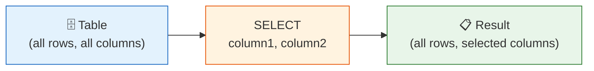

# Lesson 1: SELECT Basics

The `SELECT` statement is the foundation of SQL. It retrieves data from one or more tables, letting you specify exactly which columns to return and how they appear.



> **Concept:** SELECT picks only the columns you want from a table.

## SELECT All Columns

Use `SELECT *` to fetch every column from a table. This is great for quick exploration.

```sql
SELECT * FROM products;
```

**Result:**

| id | sku | name | category_id | supplier_id | price | stock_qty | is_active | ... |
|----|-----|------|-------------|-------------|-------|-----------|-----------|-----|
| 1 | SKU-0001 | Dell XPS 15 Laptop | 3 | 12 | 1299.99 | 42 | 1 | ... |
| 2 | SKU-0002 | Logitech MX Master 3 | 8 | 7 | 99.99 | 156 | 1 | ... |
| 3 | SKU-0003 | Samsung 27" Monitor | 5 | 3 | 449.99 | 38 | 1 | ... |
| ... | | | | | | | | |

> **Tip:** `SELECT *` pulls all columns, which can be slow on large tables. In production, list only the columns you need.

## SELECT Specific Columns

Listing column names returns only what you ask for — cleaner results, less data transferred.

```sql
SELECT name, price, stock_qty
FROM products;
```

**Result:**

| name | price | stock_qty |
|------|-------|-----------|
| Dell XPS 15 Laptop | 1299.99 | 42 |
| Logitech MX Master 3 | 99.99 | 156 |
| Samsung 27" Monitor | 449.99 | 38 |
| ... | | |

## Column Aliases (AS)

Use `AS` to rename a column in the output. Aliases improve readability and are required when expressions would otherwise have no name.

```sql
SELECT
    name        AS product_name,
    price       AS unit_price,
    stock_qty   AS in_stock
FROM products;
```

**Result:**

| product_name | unit_price | in_stock |
|--------------|------------|----------|
| Dell XPS 15 Laptop | 1299.99 | 42 |
| Logitech MX Master 3 | 99.99 | 156 |
| Samsung 27" Monitor | 449.99 | 38 |
| ... | | |

You can also alias expressions:

```sql
SELECT
    name,
    price * 1.1 AS price_with_tax
FROM products;
```

**Result:**

| name | price_with_tax |
|------|----------------|
| Dell XPS 15 Laptop | 1429.989 |
| Logitech MX Master 3 | 109.989 |
| ... | |

## DISTINCT

`DISTINCT` removes duplicate values from the result. Useful to see unique values in a column.

```sql
-- How many unique customer grades exist?
SELECT DISTINCT grade
FROM customers;
```

**Result:**

| grade |
|-------|
| BRONZE |
| SILVER |
| GOLD |
| VIP |

```sql
-- Unique gender values (including NULL)
SELECT DISTINCT gender
FROM customers;
```

**Result:**

| gender |
|--------|
| M |
| F |
| (NULL) |

## Combining Techniques

```sql
-- Unique active/inactive statuses for customers
SELECT DISTINCT is_active AS status
FROM customers
ORDER BY is_active;
```

**Result:**

| status |
|--------|
| 0 |
| 1 |

!!! note "Lesson Review"
    Quick exercises to check your understanding of this lesson. For comprehensive practice combining multiple concepts, see the [Exercises](../exercises/) section.

## Practice Exercises

### Exercise 1
List every customer's `name`, `email`, and `grade`. Give the columns the aliases `full_name`, `email_address`, and `membership_tier`.

??? success "Answer"
    ```sql
    SELECT
        name        AS full_name,
        email       AS email_address,
        grade       AS membership_tier
    FROM customers;
    ```

### Exercise 2
Show all distinct `method` values from the `payments` table to find out which payment methods TechShop accepts.

??? success "Answer"
    ```sql
    SELECT DISTINCT method
    FROM payments;
    ```

### Exercise 3
Select `name`, `price`, and `stock_qty` from `products`. Add a computed column called `inventory_value` that equals `price * stock_qty`.

??? success "Answer"
    ```sql
    SELECT
        name,
        price,
        stock_qty,
        price * stock_qty AS inventory_value
    FROM products;
    ```

---
Next: [Lesson 2: Filtering with WHERE](02-where.md)
