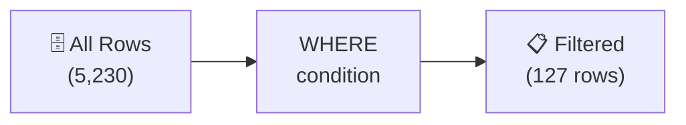

# Lesson 2: Filtering Data with WHERE

In Lesson 1, we retrieved desired columns with SELECT. But all rows were returned, right? With WHERE, you can pick out only the rows that match your conditions.

!!! note "Already familiar?"
    If you already know WHERE, comparison operators, AND/OR, IN, BETWEEN, LIKE, and IS NULL, skip ahead to [Lesson 3: Sorting and Pagination](03-sort-limit.md).

The `WHERE` clause includes only the rows that satisfy the condition in the result. Without `WHERE`, all rows from the table are returned. Using `WHERE` is essential for extracting meaningful data in practice.



> **Concept:** WHERE filters out only the rows that match the condition. It is like extracting only 127 VIP members from a total of 5,230.

## Comparison Operators

| Operator | Meaning |
|----------|---------|
| `=` | Equal to |
| `<>` or `!=` | Not equal to |
| `<`, `<=` | Less than, less than or equal to |
| `>`, `>=` | Greater than, greater than or equal to |

```sql
-- = : Retrieve only VIP grade customers
SELECT name, grade FROM customers
WHERE grade = 'VIP';
```

```sql
-- <> : Customers who are not VIP (!= has the same meaning)
SELECT name, grade FROM customers
WHERE grade <> 'VIP';
```

```sql
-- > : Products priced over 1 million won
SELECT name, price FROM products
WHERE price > 1000000;
```

```sql
-- >= : Products with 500 or more in stock
SELECT name, stock_qty FROM products
WHERE stock_qty >= 500;
```

```sql
-- < : Low-price products under 50,000 won
SELECT name, price FROM products
WHERE price < 50000;
```

```sql
-- <= : Customers with point balance of 0 or less
SELECT name, point_balance FROM customers
WHERE point_balance <= 0;
```

**`>` result example:**

| name | price |
| ---- | ----: |
| Razer Blade 18 블랙 | 2987500 |
| MSI GeForce RTX 4070 Ti Super GAMING X | 1744000 |
| ... | ... |

!!! tip "Most commonly used operators"
    In practice, `=` (filter for a specific value) and `<>` (exclude a specific value) are the most common. Example: `WHERE status = 'confirmed'`, `WHERE status <> 'cancelled'`

---

## AND / OR

`AND` includes the row when both conditions are true; `OR` includes it when at least one is true.

```sql
-- Active products priced between 100,000 and 500,000 won
SELECT name, price
FROM products
WHERE is_active = 1
  AND price >= 100000
  AND price <= 500000;
```

**Result:**

| name | price |
| ---------- | ----------: |
| G.SKILL Trident Z5 DDR5 64GB 6000MHz White | 167000.0 |
| MSI Radeon RX 9070 VENTUS 3X White | 383100.0 |
| Samsung DDR5 32GB PC5-38400 | 211800.0 |
| Logitech G715 White | 131500.0 |
| be quiet! Light Base 900 | 106200.0 |
| MSI MAG X870E TOMAHAWK WIFI White | 425400.0 |
| NZXT Kraken Elite 240 RGB Silver | 323500.0 |
| TP-Link Archer AX55 Black | 344000.0 |
| ... | ... |

```sql
-- VIP or GOLD grade customers
SELECT name, email, grade
FROM customers
WHERE grade = 'VIP'
   OR grade = 'GOLD';
```

> **Tip:** When using `AND` and `OR` together, use parentheses to clarify precedence.
> `WHERE (grade = 'VIP' OR grade = 'GOLD') AND is_active = 1`

## IN

`IN` provides a concise way to express multiple `OR` conditions on the same column.

```sql
-- Retrieve GOLD or VIP customers (IN is more concise)
SELECT name, grade
FROM customers
WHERE grade IN ('GOLD', 'VIP');
```

**Result:**

| name | grade |
| ---------- | ---------- |
| Danny Johnson | GOLD |
| Adam Moore | VIP |
| Virginia Steele | GOLD |
| John Stark | GOLD |
| Michael Velasquez | GOLD |
| Cynthia Bryant | VIP |
| Heather Gonzalez MD | GOLD |
| Donald Watts | GOLD |
| ... | ... |

```sql
-- Retrieve orders with completed statuses
SELECT order_number, status, total_amount
FROM orders
WHERE status IN ('delivered', 'confirmed', 'returned');
```

## BETWEEN

`BETWEEN` is a range condition that includes both endpoints. It is equivalent to `>= min AND <= max`.

```sql
-- Products priced between 50,000 and 200,000 won
SELECT name, price
FROM products
WHERE price BETWEEN 50000 AND 200000;
```

**Result:**

| name | price |
| ---------- | ----------: |
| G.SKILL Trident Z5 DDR5 64GB 6000MHz White | 167000.0 |
| Logitech G715 White | 131500.0 |
| be quiet! Light Base 900 | 106200.0 |
| TP-Link TG-3468 Silver | 58400.0 |
| be quiet! Pure Power 12 M 850W White | 185100.0 |
| Logitech K580 | 67800.0 |
| Seagate Fast SSD 1TB Silver | 171900.0 |
| SteelSeries Prime Wireless Black | 89800.0 |
| ... | ... |

```sql
-- Orders placed in Q1 2024
SELECT order_number, ordered_at, total_amount
FROM orders
WHERE ordered_at BETWEEN '2024-01-01' AND '2024-03-31 23:59:59';
```

## LIKE

`LIKE` matches text patterns. It uses two wildcards:

| Wildcard | Meaning | Example |
|:--------:|---------|---------|
| `%` | Zero or more arbitrary characters | `'%Gaming%'` -> "Gaming" anywhere |
| `_` | Exactly one character | `'_민재'` -> 2-character names ending with "민재" |

### % examples -- contains, starts with, ends with

```sql
-- Products with "Gaming" in the name
SELECT name, price
FROM products
WHERE name LIKE '%Gaming%';
```

| name | price |
| ---- | ----: |
| MSI GeForce RTX 4070 Ti Super GAMING X | 1744000 |
| ASUS TUF Gaming RTX 5080 화이트 | 3812000 |
| ... | ... |

```sql
-- Emails ending with testmail.kr domain
SELECT name, email FROM customers
WHERE email LIKE '%@testmail.kr';
```

```sql
-- Products starting with "삼성"
SELECT name, price FROM products
WHERE name LIKE '삼성%';
```

### _ examples -- exactly one character

```sql
-- Customers with exactly 3-character names (1 surname + 2 given name)
SELECT name, email FROM customers
WHERE name LIKE '___';
```

| name | email |
| ---- | ----- |
| 정준호 | jjh0001@testmail.kr |
| 김민재 | kmj0002@testmail.kr |
| ... | ... |

```sql
-- Products with SKU starting with "LA-" followed by a 3-character category code
SELECT name, sku FROM products
WHERE sku LIKE 'LA-___-%';
```

!!! tip "Case sensitivity"
    SQLite's LIKE is case-insensitive for English characters (`'%gaming%'` and `'%Gaming%'` return the same result). MySQL is case-insensitive by default, while PostgreSQL is case-sensitive. To ignore case in PostgreSQL, use `ILIKE`.

---

## IS NULL / IS NOT NULL

NULL means "unknown" or "absent." It is different from 0 or an empty string. For NULL comparisons, you must use `IS NULL` instead of `= NULL`.

```sql
-- Customers who have not registered their date of birth
SELECT name, email
FROM customers
WHERE birth_date IS NULL;
```

**Result:**

| name | email |
| ---------- | ---------- |
| Ashley Jones | user7@testmail.kr |
| Andrew Reeves | user13@testmail.kr |
| Martha Murphy | user14@testmail.kr |
| Heather Gonzalez MD | user21@testmail.kr |
| Barbara White | user24@testmail.kr |
| Donald Watts | user27@testmail.kr |
| Angela Barrera | user36@testmail.kr |
| Dana Miles | user38@testmail.kr |
| ... | ... |

```sql
-- Orders that have shipping notes
SELECT order_number, notes
FROM orders
WHERE notes IS NOT NULL;
```

## Summary

| Keyword | Description | Example |
|---------|-------------|---------|
| `=`, `<>`, `<`, `>`, `<=`, `>=` | Comparison operators | `WHERE price >= 100000` |
| `AND` / `OR` | Combine multiple conditions | `WHERE grade = 'VIP' AND is_active = 1` |
| `IN` | Match one of several values | `WHERE grade IN ('GOLD', 'VIP')` |
| `BETWEEN` | Range condition (both endpoints included) | `WHERE price BETWEEN 100000 AND 500000` |
| `LIKE` | Text pattern matching (`%` any string, `_` one character) | `WHERE name LIKE '%Gaming%'` |
| `IS NULL` / `IS NOT NULL` | Check for NULL (`= NULL` does not work) | `WHERE birth_date IS NULL` |

!!! note "Lesson Review Problems"
    These are simple problems to immediately check the concepts learned in this lesson. For comprehensive practice combining multiple concepts, see the [Practice Problems](../exercises/index.md) section.

## Practice Problems

### Problem 1
Find female customers (`gender = 'F'`) with SILVER or GOLD grade. Return `name`, `grade`, and `point_balance`.

??? success "Answer"
    ```sql
    SELECT name, grade, point_balance
    FROM customers
    WHERE gender = 'F'
      AND grade IN ('SILVER', 'GOLD');
    ```

    **Result (example):**

| name | grade | point_balance |
| ---------- | ---------- | ----------: |
| Virginia Steele | GOLD | 930784 |
| Tyler Rodriguez | SILVER | 306268 |
| John Stark | GOLD | 286912 |
| Diana Ferguson | GOLD | 310498 |
| Nancy Smith | GOLD | 290330 |
| Donna George | SILVER | 570129 |
| Michelle Golden | SILVER | 231707 |
| Blake Williams | GOLD | 222643 |
| ... | ... | ... |


### Problem 2
Retrieve active products (`is_active = 1`) priced between 200,000 and 800,000 won. Return `name` and `price`, sorted by price descending.

??? success "Answer"
    ```sql
    SELECT name, price
    FROM products
    WHERE is_active = 1
      AND price BETWEEN 200000 AND 800000
    ORDER BY price DESC;
    ```

### Problem 3
Find customers whose gender is unknown (NULL) and who also have no last login record (`last_login_at IS NULL`). Return `name` and `created_at`.

??? success "Answer"
    ```sql
    SELECT name, created_at
    FROM customers
    WHERE gender IS NULL
      AND last_login_at IS NULL;
    ```

    **Result (example):**

| name | created_at |
| ---------- | ---------- |
| Terry Miller DVM | 2016-02-23 17:09:54 |
| Mary Barrett | 2017-05-04 04:39:09 |
| Kara Good | 2019-04-21 10:06:38 |
| Cameron Oconnor | 2019-05-18 00:02:05 |
| Madeline Hernandez | 2020-11-10 21:56:36 |
| Tara Hoffman | 2020-04-25 04:05:37 |
| Sandra Flynn | 2020-12-10 21:16:30 |
| Paul Ramsey | 2020-10-23 15:03:46 |
| ... | ... |


### Problem 4
Retrieve the `name` and `price` of products priced at 1 million won or more.

??? success "Answer"
    ```sql
    SELECT name, price
    FROM products
    WHERE price >= 1000000;
    ```

    **Result (example):**

| name | price |
| ---------- | ----------: |
| Razer Blade 18 Black | 2987500.0 |
| MSI GeForce RTX 4070 Ti Super GAMING X | 1744000.0 |
| LG All-in-One PC 27V70Q Silver | 1093200.0 |
| Razer Blade 18 White | 2483600.0 |
| ASUS ROG Strix G16CH White | 3671500.0 |
| Hansung BossMonster DX5800 Black | 1129400.0 |
| ASUS TUF Gaming RTX 5080 White | 4526600.0 |
| HP Envy x360 15 Silver | 1214600.0 |
| ... | ... |


### Problem 5
Retrieve the `name` and `stock_qty` of products that are not out of stock (`stock_qty <> 0`).

??? success "Answer"
    ```sql
    SELECT name, stock_qty
    FROM products
    WHERE stock_qty <> 0;
    ```

    **Result (example):**

| name | stock_qty |
| ---------- | ----------: |
| Razer Blade 18 Black | 107 |
| MSI GeForce RTX 4070 Ti Super GAMING X | 499 |
| Samsung DDR4 32GB PC4-25600 | 359 |
| Dell U2724D | 337 |
| G.SKILL Trident Z5 DDR5 64GB 6000MHz White | 59 |
| MSI Radeon RX 9070 VENTUS 3X White | 460 |
| Samsung DDR5 32GB PC5-38400 | 340 |
| Logitech G715 White | 341 |
| ... | ... |


### Problem 6
From the `customers` table, retrieve the `name` and `point_balance` of GOLD grade customers whose point balance is between 500 and 2000.

??? success "Answer"
    ```sql
    SELECT name, point_balance
    FROM customers
    WHERE grade = 'GOLD'
      AND point_balance BETWEEN 500 AND 2000;
    ```

### Problem 7
Retrieve the `order_number` and `status` of orders with status `'pending'` or `'processing'`. Use the `IN` operator.

??? success "Answer"
    ```sql
    SELECT order_number, status
    FROM orders
    WHERE status IN ('pending', 'processing');
    ```

    **Result (example):**

| order_number | status |
| ---------- | ---------- |
| ORD-20251212-37108 | pending |
| ORD-20251228-37466 | pending |
| ORD-20251228-37467 | pending |
| ORD-20251228-37468 | pending |
| ORD-20251228-37469 | pending |
| ORD-20251228-37471 | pending |
| ORD-20251228-37472 | pending |
| ORD-20251228-37473 | pending |
| ... | ... |


### Problem 8
Retrieve the `name` and `price` of products whose name ends with "Keyboard".

??? success "Answer"
    ```sql
    SELECT name, price
    FROM products
    WHERE name LIKE '%Keyboard';
    ```

### Problem 9
From the `staff` table, retrieve the `name` and `department` of active employees (`is_active = 1`) whose `department` is not `'Sales'`.

??? success "Answer"
    ```sql
    SELECT name, department
    FROM staff
    WHERE is_active = 1
      AND department <> 'Sales';
    ```

    **Result (example):**

| name | department |
| ---------- | ---------- |
| Michael Thomas | Management |
| Michael Mcguire | Management |
| Jonathan Smith | Management |
| Nicole Hamilton | Marketing |


### Problem 10
From the `customers` table, retrieve the `name`, `grade`, `point_balance`, and `is_active` of customers who are VIP grade and inactive (`is_active = 0`), or whose point balance is 5000 or more. Use parentheses to clarify the condition precedence.

??? success "Answer"
    ```sql
    SELECT name, grade, point_balance, is_active
    FROM customers
    WHERE (grade = 'VIP' AND is_active = 0)
       OR point_balance >= 5000;
    ```

    **Result (example):**

| name | grade | point_balance | is_active |
| ---------- | ---------- | ----------: | ----------: |
| Danny Johnson | GOLD | 664723 | 1 |
| Adam Moore | VIP | 1564015 | 1 |
| Virginia Steele | GOLD | 930784 | 1 |
| Jared Vazquez | SILVER | 963430 | 1 |
| Tyler Rodriguez | SILVER | 306268 | 1 |
| John Stark | GOLD | 286912 | 1 |
| Michael Velasquez | GOLD | 499365 | 1 |
| Martha Murphy | BRONZE | 274101 | 1 |
| ... | ... | ... | ... |


### Scoring Guide

| Score | Next Step |
|:-----:|-----------|
| **9-10** | Move to [Lesson 3: Sorting and Pagination](03-sort-limit.md) |
| **7-8** | Review the explanations for incorrect answers, then proceed to Lesson 3 |
| **5 or fewer** | Read this lesson again |
| **3 or fewer** | Start over from [Lesson 1: SELECT Basics](01-select.md) |

**Problem Areas:**

| Area | Problems |
|------|:--------:|
| AND / IN | 1 |
| BETWEEN | 2, 6 |
| IS NULL | 3 |
| Comparison operators (>=, <>) | 4, 5 |
| IN | 7 |
| LIKE | 8 |
| AND / negation comparison | 9 |
| OR / parentheses precedence | 10 |

---
Next: [Lesson 3: Sorting and Pagination](03-sort-limit.md)
