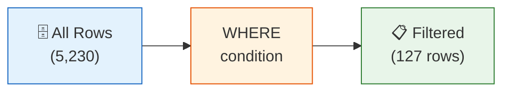

# Lesson 2: Filtering with WHERE

The `WHERE` clause narrows your results to only the rows that satisfy a condition. Without it, every row in the table is returned. Mastering `WHERE` is essential for answering real business questions.



> **Concept:** WHERE filters rows by condition. Like extracting 127 VIP customers from 5,230 total.

## Comparison Operators

| Operator | Meaning |
|----------|---------|
| `=` | Equal |
| `<>` or `!=` | Not equal |
| `<`, `<=` | Less than, less than or equal |
| `>`, `>=` | Greater than, greater than or equal |

```sql
-- Products priced over $500
SELECT name, price
FROM products
WHERE price > 500;
```

**Result:**

| name | price |
|------|-------|
| Dell XPS 15 Laptop | 1299.99 |
| Samsung 27" Monitor | 449.99 |
| ASUS ROG Gaming Desktop | 1899.00 |
| ... | |

```sql
-- Only active products
SELECT name, price, stock_qty
FROM products
WHERE is_active = 1;
```

## AND / OR

Combine conditions with `AND` (both must be true) and `OR` (either must be true).

```sql
-- Active products priced between $100 and $500
SELECT name, price
FROM products
WHERE is_active = 1
  AND price >= 100
  AND price <= 500;
```

**Result:**

| name | price |
|------|-------|
| Samsung 27" Monitor | 449.99 |
| Corsair 16GB DDR5 RAM | 129.99 |
| WD Black 1TB SSD | 189.99 |
| ... | |

```sql
-- VIP or GOLD customers
SELECT name, email, grade
FROM customers
WHERE grade = 'VIP'
   OR grade = 'GOLD';
```

> **Tip:** Use parentheses when mixing `AND` and `OR` to make precedence explicit.
> `WHERE (grade = 'VIP' OR grade = 'GOLD') AND is_active = 1`

## IN

`IN` is a shortcut for multiple `OR` conditions on the same column.

```sql
-- Customers who are GOLD or VIP (cleaner with IN)
SELECT name, grade
FROM customers
WHERE grade IN ('GOLD', 'VIP');
```

**Result:**

| name | grade |
|------|-------|
| Jennifer Martinez | VIP |
| Robert Kim | GOLD |
| Sarah Johnson | VIP |
| ... | |

```sql
-- Orders in terminal states
SELECT order_number, status, total_amount
FROM orders
WHERE status IN ('delivered', 'confirmed', 'returned');
```

## BETWEEN

`BETWEEN` tests for an inclusive range — equivalent to `>= low AND <= high`.

```sql
-- Products priced from $50 to $200
SELECT name, price
FROM products
WHERE price BETWEEN 50 AND 200;
```

**Result:**

| name | price |
|------|-------|
| Logitech MX Master 3 | 99.99 |
| Corsair 16GB DDR5 RAM | 129.99 |
| WD Black 1TB SSD | 189.99 |
| ... | |

```sql
-- Orders placed in Q1 2024
SELECT order_number, ordered_at, total_amount
FROM orders
WHERE ordered_at BETWEEN '2024-01-01' AND '2024-03-31 23:59:59';
```

## LIKE

`LIKE` matches text patterns. `%` matches any sequence of characters; `_` matches exactly one character.

```sql
-- Products whose name contains "Gaming"
SELECT name, price
FROM products
WHERE name LIKE '%Gaming%';
```

**Result:**

| name | price |
|------|-------|
| ASUS ROG Gaming Desktop | 1899.00 |
| Razer BlackWidow Gaming Keyboard | 149.99 |
| SteelSeries Gaming Headset | 79.99 |
| ... | |

```sql
-- Customers whose email is on testmail.com
SELECT name, email
FROM customers
WHERE email LIKE '%@testmail.com';
```

## IS NULL / IS NOT NULL

NULL means "unknown" or "missing." You cannot use `= NULL` — you must use `IS NULL`.

```sql
-- Customers with no birth date on file
SELECT name, email
FROM customers
WHERE birth_date IS NULL;
```

**Result:**

| name | email |
|------|-------|
| Alex Chen | alex.chen@testmail.com |
| Maria Santos | m.santos@testmail.com |
| ... | |

```sql
-- Orders that have delivery instructions
SELECT order_number, notes
FROM orders
WHERE notes IS NOT NULL;
```

!!! note "Lesson Review"
    Quick exercises to check your understanding of this lesson. For comprehensive practice combining multiple concepts, see the [Exercises](../exercises/) section.

## Practice Exercises

### Exercise 1
Find all female customers (`gender = 'F'`) who hold a SILVER or GOLD membership grade. Return their `name`, `grade`, and `point_balance`.

??? success "Answer"
    ```sql
    SELECT name, grade, point_balance
    FROM customers
    WHERE gender = 'F'
      AND grade IN ('SILVER', 'GOLD');
    ```

### Exercise 2
List products that are active (`is_active = 1`) and priced between $200 and $800. Return `name` and `price`, ordered by price descending.

??? success "Answer"
    ```sql
    SELECT name, price
    FROM products
    WHERE is_active = 1
      AND price BETWEEN 200 AND 800
    ORDER BY price DESC;
    ```

### Exercise 3
Find all customers whose gender is unknown (NULL) and who have never logged in (`last_login_at IS NULL`). Return their `name` and `created_at`.

??? success "Answer"
    ```sql
    SELECT name, created_at
    FROM customers
    WHERE gender IS NULL
      AND last_login_at IS NULL;
    ```

---
Next: [Lesson 3: Sorting and Pagination](03-sort-limit.md)
