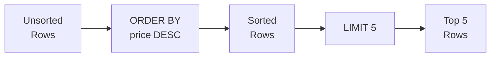

# Lesson 3: Sorting and Pagination

SQL rows have no guaranteed order unless you ask for one. `ORDER BY` lets you sort results by one or more columns, while `LIMIT` and `OFFSET` let you page through large result sets efficiently.



> **Concept:** ORDER BY sorts the rows, then LIMIT takes the top N.

## ORDER BY — Single Column

Append `ASC` (ascending, the default) or `DESC` (descending) after the column name.

```sql
-- Cheapest products first
SELECT name, price
FROM products
WHERE is_active = 1
ORDER BY price ASC;
```

**Result:**

| name                            | price |
| ------------------------------- | ----: |
| TP-Link TG-3468 블랙              | 13100 |
| Microsoft Ergonomic Keyboard 실버 | 23000 |
| TP-Link Archer TBE400E 화이트      | 23300 |
| ...                             | ...   |

```sql
-- Most expensive products first
SELECT name, price
FROM products
WHERE is_active = 1
ORDER BY price DESC;
```

**Result:**

| name                                                          | price   |
| ------------------------------------------------------------- | ------: |
| ASUS ROG Strix GT35                                           | 4314800 |
| ASUS Dual RTX 5070 Ti [특별 한정판 에디션] 저소음 설계, 에너지 효율 1등급, 친환경 포장 | 4226200 |
| Razer Blade 18 블랙                                             | 4182100 |
| ...                                                           | ...     |

## ORDER BY — Multiple Columns

Rows are sorted by the first column, then ties are broken by the second, and so on.

```sql
-- Sort by grade, then alphabetically within each grade
SELECT name, grade, point_balance
FROM customers
WHERE is_active = 1
ORDER BY grade ASC, name ASC;
```

**Result:**

| name | grade  | point_balance |
| ---- | ------ | ------------: |
| 강건우  | BRONZE |             0 |
| 강경자  | BRONZE |        139947 |
| 강광수  | BRONZE |             0 |
| ...  | ...    | ...           |

```sql
-- Most recent orders first, then by total amount descending for ties
SELECT order_number, ordered_at, total_amount
FROM orders
ORDER BY ordered_at DESC, total_amount DESC;
```

**Result:**

| order_number       | ordered_at          | total_amount |
| ------------------ | ------------------- | -----------: |
| ORD-20250630-34900 | 2025-06-30 23:02:18 |      1483000 |
| ORD-20250630-34905 | 2025-06-30 22:33:25 |       152600 |
| ORD-20250630-34903 | 2025-06-30 20:51:27 |       401800 |
| ...                | ...                 | ...          |

## LIMIT

`LIMIT n` returns at most `n` rows. Combine with `ORDER BY` to get meaningful "top N" results.

```sql
-- Top 5 most expensive active products
SELECT name, price
FROM products
WHERE is_active = 1
ORDER BY price DESC
LIMIT 5;
```

**Result:**

| name                                                          | price   |
| ------------------------------------------------------------- | ------: |
| ASUS ROG Strix GT35                                           | 4314800 |
| ASUS Dual RTX 5070 Ti [특별 한정판 에디션] 저소음 설계, 에너지 효율 1등급, 친환경 포장 | 4226200 |
| Razer Blade 18 블랙                                             | 4182100 |
| Razer Blade 16 실버                                             | 4123800 |
| MacBook Air 15 M3 실버                                          | 3774700 |

## OFFSET — Pagination

{ .off-glb width="480"  }

`OFFSET n` skips the first `n` rows before starting to return results. Combined with `LIMIT`, this implements page-based navigation.

```sql
-- Page 1: rows 1–10
SELECT name, price
FROM products
WHERE is_active = 1
ORDER BY name ASC
LIMIT 10 OFFSET 0;

-- Page 2: rows 11–20
SELECT name, price
FROM products
WHERE is_active = 1
ORDER BY name ASC
LIMIT 10 OFFSET 10;

-- Page 3: rows 21–30
SELECT name, price
FROM products
WHERE is_active = 1
ORDER BY name ASC
LIMIT 10 OFFSET 20;
```

**Page 1 Result:**

| name | price |
|------|------:|
| ASUS ProArt Studiobook 16 | 2099.00 |
| ASUS ROG Gaming Desktop | 1899.00 |
| ASUS ROG Swift 27" Monitor | 799.00 |
| ASUS TUF Gaming Laptop | 1099.00 |
| ... | |

> **Formula:** `OFFSET = (page_number - 1) * page_size`

## Ordering NULL Values

In SQLite, `NULL` sorts before other values in `ASC` order and after them in `DESC` order.

```sql
-- Customers ordered by birth_date; NULLs appear first
SELECT name, birth_date
FROM customers
ORDER BY birth_date ASC
LIMIT 5;
```

**Result:**

| name | birth_date |
| ---- | ---------- |
| 김명자  | (NULL)     |
| 김정식  | (NULL)     |
| ...  | ...        |

!!! note "Lesson Review"
    Quick exercises to check your understanding of this lesson. For comprehensive practice combining multiple concepts, see the [Exercises](../exercises/index.md) section.

## Practice Exercises

### Exercise 1
Find the 10 most recently placed orders. Return `order_number`, `ordered_at`, `status`, and `total_amount`.

??? success "Answer"
    ```sql
    SELECT order_number, ordered_at, status, total_amount
    FROM orders
    ORDER BY ordered_at DESC
    LIMIT 10;
    ```

    **Expected result:**

    | order_number       | ordered_at          | status    | total_amount |
    | ------------------ | ------------------- | --------- | -----------: |
    | ORD-20250630-34900 | 2025-06-30 23:02:18 | pending   |      1483000 |
    | ORD-20250630-34905 | 2025-06-30 22:33:25 | pending   |       152600 |
    | ORD-20250630-34903 | 2025-06-30 20:51:27 | cancelled |       401800 |
    | ORD-20250630-34899 | 2025-06-30 19:05:22 | pending   |       167500 |
    | ORD-20250630-34896 | 2025-06-30 16:48:11 | pending   |      1646400 |
    | ...                | ...                 | ...       | ...          |


### Exercise 2
List all products sorted first by `stock_qty` ascending (lowest stock first), then by `price` descending as a tiebreaker. Return `name`, `stock_qty`, and `price`. Limit to 20 rows.

??? success "Answer"
    ```sql
    SELECT name, stock_qty, price
    FROM products
    ORDER BY stock_qty ASC, price DESC
    LIMIT 20;
    ```

    **Expected result:**

    | name                        | stock_qty | price  |
    | --------------------------- | --------: | -----: |
    | Arctic Freezer 36 A-RGB 화이트 |         0 |  31400 |
    | 삼성 SPA-KFG0BUB              |         4 |  26200 |
    | 삼성 DDR4 32GB PC4-25600      |         6 | 114400 |
    | Norton AntiVirus Plus       |         8 |  57000 |
    | 로지텍 G502 HERO 실버            |         8 |  47900 |
    | ...                         | ...       | ...    |


### Exercise 3
Implement page 3 of a product catalog (10 items per page), sorted alphabetically by product name. Only include active products.

??? success "Answer"
    ```sql
    SELECT name, price, stock_qty
    FROM products
    WHERE is_active = 1
    ORDER BY name ASC
    LIMIT 10 OFFSET 20;
    ```

    **Expected result:**

    | name                          | price   | stock_qty |
    | ----------------------------- | ------: | --------: |
    | ASUS PCE-BE92BT               |   48800 |       351 |
    | ASUS PCE-BE92BT 블랙            |   57200 |        74 |
    | ASUS ROG MAXIMUS Z890 HERO 블랙 | 1048400 |       419 |
    | ASUS ROG STRIX RX 7900 XTX 실버 | 1267300 |       312 |
    | ASUS ROG Strix G16CH 실버       | 1609400 |        28 |
    | ...                           | ...     | ...       |


### Exercise 4
Find the 5 customers with the highest point balance. Return `name`, `grade`, and `point_balance`.

??? success "Answer"
    ```sql
    SELECT name, grade, point_balance
    FROM customers
    ORDER BY point_balance DESC
    LIMIT 5;
    ```

    **Expected result:**

    | name | grade | point_balance |
    | ---- | ----- | ------------: |
    | 박정수  | VIP   |       3341740 |
    | 강명자  | VIP   |       2908232 |
    | 김병철  | VIP   |       2818474 |
    | 이영자  | VIP   |       2772254 |
    | 이미정  | VIP   |       2282481 |


### Exercise 5
List `name` and `price` from `products`, sorted by price ascending. When prices are equal, sort alphabetically by name.

??? success "Answer"
    ```sql
    SELECT name, price
    FROM products
    ORDER BY price ASC, name ASC;
    ```

    **Expected result:**

    | name                            | price |
    | ------------------------------- | ----: |
    | TP-Link TG-3468 블랙              | 13100 |
    | 로지텍 MX Anywhere 3S 블랙           | 18400 |
    | Microsoft Ergonomic Keyboard 실버 | 23000 |
    | TP-Link Archer TBE400E 화이트      | 23300 |
    | 삼성 SPA-KFG0BUB                  | 26200 |
    | ...                             | ...   |


### Exercise 6
Select `name`, `price`, and `cost_price` from `products`, sorted by margin (`price - cost_price`) in descending order. Return only the top 10 rows.

??? success "Answer"
    ```sql
    SELECT name, price, cost_price
    FROM products
    ORDER BY price - cost_price DESC
    LIMIT 10;
    ```

    **Expected result:**

    | name                  | price   | cost_price |
    | --------------------- | ------: | ---------: |
    | Razer Blade 16 실버     | 4123800 |    2886700 |
    | ASUS ROG Zephyrus G16 | 4284100 |    3084600 |
    | BenQ PD3225U          | 2500400 |    1312500 |
    | Razer Blade 18 블랙     | 4182100 |    3047200 |
    | ASUS ROG Strix GT35   | 4314800 |    3236100 |
    | ...                   | ...     | ...        |


### Exercise 7
From `reviews`, select `product_id`, `rating`, and `created_at`. Sort by most recent first and return the 2nd page (5 items per page, i.e., rows 6 through 10).

??? success "Answer"
    ```sql
    SELECT product_id, rating, created_at
    FROM reviews
    ORDER BY created_at DESC
    LIMIT 5 OFFSET 5;
    ```

    **Expected result:**

    | product_id | rating | created_at          |
    | ---------: | -----: | ------------------- |
    |        111 |      4 | 2025-07-07 08:04:36 |
    |         90 |      2 | 2025-07-05 19:12:59 |
    |        243 |      4 | 2025-07-05 08:38:27 |
    |        185 |      5 | 2025-07-05 00:42:20 |
    |        247 |      4 | 2025-07-04 20:49:23 |


### Exercise 8
List `name`, `department`, and `hired_at` from the `staff` table. Sort by department alphabetically, then within each department by hire date ascending (longest-tenured first).

??? success "Answer"
    ```sql
    SELECT name, department, hired_at
    FROM staff
    ORDER BY department ASC, hired_at ASC;
    ```

    **Expected result:**

    | name | department | hired_at   |
    | ---- | ---------- | ---------- |
    | 한민재  | 경영         | 2016-05-23 |
    | 장주원  | 경영         | 2017-08-20 |
    | 박경수  | 경영         | 2022-10-12 |
    | 권영희  | 마케팅        | 2024-08-05 |
    | 이준혁  | 영업         | 2022-03-02 |


### Exercise 9
Select `name` and `birth_date` from `customers`, sorted so that customers with a NULL birth date appear last. Non-NULL rows should be sorted by birth date ascending.

=== "SQLite"
    ??? success "Answer"
        ```sql
        SELECT name, birth_date
        FROM customers
        ORDER BY birth_date IS NULL ASC, birth_date ASC;
        ```

=== "MySQL"
    ??? success "Answer"
        ```sql
        SELECT name, birth_date
        FROM customers
        ORDER BY birth_date IS NULL ASC, birth_date ASC;
        ```

=== "PostgreSQL"
    ??? success "Answer"
        ```sql
        SELECT name, birth_date
        FROM customers
        ORDER BY birth_date ASC NULLS LAST;
        ```

### Exercise 10
Select `order_number`, `total_amount`, and `ordered_at` from `orders`. Sort by amount descending, breaking ties by most recent order first. Return only the top 15 rows.

??? success "Answer"
    ```sql
    SELECT order_number, total_amount, ordered_at
    FROM orders
    ORDER BY total_amount DESC, ordered_at DESC
    LIMIT 15;
    ```

---
Next: [Lesson 4: Aggregate Functions](04-aggregates.md)
