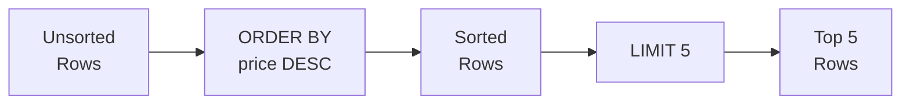

# Lesson 3: Sorting and Pagination

In Lesson 2, we filtered rows with WHERE. But the results came in no particular order, right? You can sort with ORDER BY and retrieve only the top N rows with LIMIT.

!!! note "Already familiar?"
    If you already know ORDER BY, LIMIT, and OFFSET, skip ahead to [Lesson 4: Aggregate Functions](04-aggregates.md).

The row order of SQL results is not guaranteed unless explicitly specified. You can sort by one or more columns using `ORDER BY`, and use `LIMIT` and `OFFSET` to browse large result sets page by page.



> **Concept:** ORDER BY sorts the rows, then LIMIT clips the top N.

## ORDER BY -- Single Column

Append `ASC` (ascending, default) or `DESC` (descending) after the column name.

```sql
-- Sort products from lowest price
SELECT name, price
FROM products
WHERE is_active = 1
ORDER BY price ASC;
```

**Result:**

| name | price |
| ---------- | ----------: |
| TP-Link TG-3468 Black | 18500.0 |
| Samsung SPA-KFG0BUB Silver | 21900.0 |
| Arctic Freezer 36 A-RGB White | 23000.0 |
| Arctic Freezer 36 A-RGB White | 29900.0 |
| TP-Link Archer TBE400E White | 30200.0 |
| Samsung SPA-KFG0BUB | 30700.0 |
| TP-Link TL-SG1016D Silver | 36100.0 |
| Microsoft Bluetooth Keyboard White | 36800.0 |
| ... | ... |

```sql
-- Sort products from highest price
SELECT name, price
FROM products
WHERE is_active = 1
ORDER BY price DESC;
```

**Result:**

| name | price |
| ---------- | ----------: |
| MacBook Air 15 M3 Silver | 5481100.0 |
| ASUS Dual RTX 5070 Ti [Special Limited Edition] Low-noise design, energy efficiency rated, eco-friendly packaging | 4496700.0 |
| Razer Blade 18 Black | 4353100.0 |
| Razer Blade 16 Silver | 3702900.0 |
| ASUS ROG Strix G16CH White | 3671500.0 |
| ASUS ROG Strix GT35 | 3296800.0 |
| Razer Blade 18 Black | 2987500.0 |
| ASUS Dual RTX 4060 Ti Black | 2674800.0 |
| ... | ... |

## ORDER BY -- Multiple Columns

Sorts by the first column first, then by the second column when values are equal.

```sql
-- Sort by grade, then alphabetically by name within each grade
SELECT name, grade, point_balance
FROM customers
WHERE is_active = 1
ORDER BY grade ASC, name ASC;
```

**Result:**

| name | grade | point_balance |
| ---------- | ---------- | ----------: |
| Aaron Carr | BRONZE | 27530 |
| Aaron Cooper | BRONZE | 4626 |
| Aaron Cortez | BRONZE | 0 |
| Aaron Green | BRONZE | 19933 |
| Aaron Grimes | BRONZE | 135596 |
| Aaron Meyer | BRONZE | 0 |
| Aaron Price | BRONZE | 307352 |
| Aaron Wells | BRONZE | 2428 |
| ... | ... | ... |

```sql
-- Sort by most recent order first; for the same timestamp, by amount descending
SELECT order_number, ordered_at, total_amount
FROM orders
ORDER BY ordered_at DESC, total_amount DESC;
```

**Result:**

| order_number | ordered_at | total_amount |
| ---------- | ---------- | ----------: |
| ORD-20251231-37555 | 2025-12-31 22:25:39 | 74800.0 |
| ORD-20251231-37543 | 2025-12-31 21:40:27 | 134100.0 |
| ORD-20251231-37552 | 2025-12-31 20:00:48 | 254300.0 |
| ORD-20251231-37548 | 2025-12-31 18:43:56 | 187700.0 |
| ORD-20251231-37542 | 2025-12-31 18:00:24 | 155700.0 |
| ORD-20251231-37546 | 2025-12-31 15:43:23 | 198300.0 |
| ORD-20251231-37547 | 2025-12-31 15:33:05 | 335000.0 |
| ORD-20251231-37556 | 2025-12-31 15:08:54 | 153900.0 |
| ... | ... | ... |

## LIMIT

`LIMIT n` returns at most `n` rows. When used with `ORDER BY`, it meaningfully extracts the "top N" results.

```sql
-- The 5 most expensive active products
SELECT name, price
FROM products
WHERE is_active = 1
ORDER BY price DESC
LIMIT 5;
```

**Result:**

| name | price |
| ---------- | ----------: |
| MacBook Air 15 M3 Silver | 5481100.0 |
| ASUS Dual RTX 5070 Ti [Special Limited Edition] Low-noise design, energy efficiency rated, eco-friendly packaging | 4496700.0 |
| Razer Blade 18 Black | 4353100.0 |
| Razer Blade 16 Silver | 3702900.0 |
| ASUS ROG Strix G16CH White | 3671500.0 |
| ... | ... |

## OFFSET -- Pagination

{ .off-glb width="480"  }

`OFFSET n` skips the first `n` rows and returns the rest. When used with `LIMIT`, you can implement page-based browsing.

```sql
-- Page 1: rows 1-10
SELECT name, price
FROM products
WHERE is_active = 1
ORDER BY name ASC
LIMIT 10 OFFSET 0;

-- Page 2: rows 11-20
SELECT name, price
FROM products
WHERE is_active = 1
ORDER BY name ASC
LIMIT 10 OFFSET 10;

-- Page 3: rows 21-30
SELECT name, price
FROM products
WHERE is_active = 1
ORDER BY name ASC
LIMIT 10 OFFSET 20;
```

**Page 1 result:**

| name | price |
|------|------:|
| ASUS ProArt Studiobook 16 | 2099.00 |
| ASUS ROG Gaming Desktop | 1899.00 |
| ASUS ROG Swift 27" Monitor | 799.00 |
| ASUS TUF Gaming Laptop | 1099.00 |
| ... | |

> **Formula:** `OFFSET = (page number - 1) x page size`

## NULL Sort Order

In SQLite, NULLs come before other values with `ASC` sorting and after with `DESC` sorting.

```sql
-- When sorting birth_date ascending, NULLs appear first
SELECT name, birth_date
FROM customers
ORDER BY birth_date ASC
LIMIT 5;
```

**Result:**

| name | birth_date |
| ---------- | ---------- |
| Ashley Jones | (NULL) |
| Andrew Reeves | (NULL) |
| Martha Murphy | (NULL) |
| Heather Gonzalez MD | (NULL) |
| Barbara White | (NULL) |
| ... | ... |

## Summary

| Keyword | Description | Example |
|---------|-------------|---------|
| `ORDER BY col ASC` | Ascending sort (default) | `ORDER BY price ASC` |
| `ORDER BY col DESC` | Descending sort | `ORDER BY price DESC` |
| Multiple column sort | If the first column is equal, sort by the second | `ORDER BY grade ASC, name ASC` |
| `LIMIT n` | Return at most n rows | `LIMIT 5` |
| `OFFSET n` | Skip the first n rows | `LIMIT 10 OFFSET 20` (page 3) |
| NULL sorting | SQLite: NULLs first with ASC, last with DESC | `ORDER BY birth_date IS NULL ASC, birth_date ASC` |

!!! note "Lesson Review Problems"
    These are simple problems to immediately check the concepts learned in this lesson. For comprehensive practice combining multiple concepts, see the [Practice Problems](../exercises/index.md) section.

## Practice Problems

### Problem 1
Find the 10 most recently placed orders. Return `order_number`, `ordered_at`, `status`, and `total_amount`.

??? success "Answer"
    ```sql
    SELECT order_number, ordered_at, status, total_amount
    FROM orders
    ORDER BY ordered_at DESC
    LIMIT 10;
    ```

    **Result (example):**

| order_number | ordered_at | status | total_amount |
| ---------- | ---------- | ---------- | ----------: |
| ORD-20251231-37555 | 2025-12-31 22:25:39 | pending | 74800.0 |
| ORD-20251231-37543 | 2025-12-31 21:40:27 | pending | 134100.0 |
| ORD-20251231-37552 | 2025-12-31 20:00:48 | pending | 254300.0 |
| ORD-20251231-37548 | 2025-12-31 18:43:56 | pending | 187700.0 |
| ORD-20251231-37542 | 2025-12-31 18:00:24 | pending | 155700.0 |
| ORD-20251231-37546 | 2025-12-31 15:43:23 | pending | 198300.0 |
| ORD-20251231-37547 | 2025-12-31 15:33:05 | pending | 335000.0 |
| ORD-20251231-37556 | 2025-12-31 15:08:54 | pending | 153900.0 |
| ... | ... | ... | ... |


### Problem 2
Sort all products by `stock_qty` ascending (lowest stock first); for equal stock, sort by `price` descending. Return `name`, `stock_qty`, and `price`, limited to 20 rows.

??? success "Answer"
    ```sql
    SELECT name, stock_qty, price
    FROM products
    ORDER BY stock_qty ASC, price DESC
    LIMIT 20;
    ```

    **Result (example):**

| name | stock_qty | price |
| ---------- | ----------: | ----------: |
| Arctic Freezer 36 A-RGB White | 0 | 23000.0 |
| Samsung SPA-KFG0BUB | 4 | 30700.0 |
| Samsung DDR4 32GB PC4-25600 | 6 | 91000.0 |
| Logitech G502 HERO Silver | 8 | 71100.0 |
| Norton AntiVirus Plus | 8 | 69700.0 |
| Intel Core Ultra 7 265K White | 15 | 170200.0 |
| ASUS ROG Strix Scar 16 | 18 | 2452500.0 |
| MSI MPG X870E CARBON WIFI Black | 21 | 555500.0 |
| ... | ... | ... |


### Problem 3
Retrieve page 3 (10 items per page) of the active product catalog sorted alphabetically by product name.

??? success "Answer"
    ```sql
    SELECT name, price, stock_qty
    FROM products
    WHERE is_active = 1
    ORDER BY name ASC
    LIMIT 10 OFFSET 20;
    ```

    **Result (example):**

| name | price | stock_qty |
| ---------- | ----------: | ----------: |
| ASUS PCE-BE92BT | 47200.0 | 351 |
| ASUS PCE-BE92BT Black | 74900.0 | 74 |
| ASUS ROG MAXIMUS Z890 HERO Black | 1150400.0 | 419 |
| ASUS ROG STRIX RX 7900 XTX Silver | 1281600.0 | 312 |
| ASUS ROG Strix G16CH Silver | 1879100.0 | 28 |
| ASUS ROG Strix G16CH White | 3671500.0 | 201 |
| ASUS ROG Strix GT35 | 3296800.0 | 455 |
| ASUS ROG Strix Scar 16 | 2452500.0 | 18 |
| ... | ... | ... |


### Problem 4
Retrieve the `name`, `grade`, and `point_balance` of the top 5 customers with the most points from the `customers` table.

??? success "Answer"
    ```sql
    SELECT name, grade, point_balance
    FROM customers
    ORDER BY point_balance DESC
    LIMIT 5;
    ```

    **Result (example):**

| name | grade | point_balance |
| ---------- | ---------- | ----------: |
| Allen Snyder | VIP | 3955828 |
| Jason Rivera | VIP | 3518880 |
| Brenda Garcia | VIP | 2450166 |
| Courtney Huff | VIP | 2383491 |
| James Banks | VIP | 2297542 |
| ... | ... | ... |


### Problem 5
Retrieve `name` and `price` from the `products` table sorted by price ascending. For equal prices, sort by product name alphabetically.

??? success "Answer"
    ```sql
    SELECT name, price
    FROM products
    ORDER BY price ASC, name ASC;
    ```

    **Result (example):**

| name | price |
| ---------- | ----------: |
| TP-Link TG-3468 Black | 18500.0 |
| Samsung SPA-KFG0BUB Silver | 21900.0 |
| Arctic Freezer 36 A-RGB White | 23000.0 |
| Arctic Freezer 36 A-RGB White | 29900.0 |
| TP-Link Archer TBE400E White | 30200.0 |
| Samsung SPA-KFG0BUB | 30700.0 |
| Logitech MK470 Black | 31800.0 |
| Logitech MX Anywhere 3S Black | 33600.0 |
| ... | ... |


### Problem 6
Retrieve `name`, `price`, and `cost_price` from the `products` table, sorted by margin (`price - cost_price`) in descending order. Return only the top 10.

??? success "Answer"
    ```sql
    SELECT name, price, cost_price
    FROM products
    ORDER BY price - cost_price DESC
    LIMIT 10;
    ```

    **Result (example):**

| name | price | cost_price |
| ---------- | ----------: | ----------: |
| MacBook Air 15 M3 Silver | 5481100.0 | 3205400.0 |
| ASUS TUF Gaming RTX 5080 White | 4526600.0 | 3037100.0 |
| Razer Blade 18 Black | 4353100.0 | 3047200.0 |
| ASUS Dual RTX 5070 Ti [Special Limited Edition] Low-noise design, energy efficiency rated, eco-friendly packaging | 4496700.0 | 3296400.0 |
| ASUS ROG Strix G16CH White | 3671500.0 | 2480900.0 |
| ASUS Dual RTX 4060 Ti Black | 2674800.0 | 1562700.0 |
| ASUS ROG Strix Scar 16 | 2452500.0 | 1561200.0 |
| ASUS ExpertBook B5 White | 2068800.0 | 1216600.0 |
| ... | ... | ... |


### Problem 7
Retrieve `product_id`, `rating`, and `created_at` from the `reviews` table, sorted by most recent review first, returning the 6th through 10th reviews (page 2, 5 per page).

??? success "Answer"
    ```sql
    SELECT product_id, rating, created_at
    FROM reviews
    ORDER BY created_at DESC
    LIMIT 5 OFFSET 5;
    ```

    **Result (example):**

| product_id | rating | created_at |
| ----------: | ----------: | ---------- |
| 227 | 5 | 2026-01-11 21:02:15 |
| 210 | 2 | 2026-01-11 15:23:03 |
| 257 | 2 | 2026-01-10 09:56:48 |
| 8 | 4 | 2026-01-09 20:41:38 |
| 273 | 5 | 2026-01-07 20:55:20 |
| ... | ... | ... |


### Problem 8
Retrieve `name`, `department`, and `hired_at` from the `staff` table. Sort by department name alphabetically; within the same department, sort by hire date with longest-tenured employees first.

??? success "Answer"
    ```sql
    SELECT name, department, hired_at
    FROM staff
    ORDER BY department ASC, hired_at ASC;
    ```

    **Result (example):**

| name | department | hired_at |
| ---------- | ---------- | ---------- |
| Michael Thomas | Management | 2016-05-23 |
| Michael Mcguire | Management | 2017-08-20 |
| Jonathan Smith | Management | 2022-10-12 |
| Nicole Hamilton | Marketing | 2024-08-05 |
| Jaime Phelps | Sales | 2022-03-02 |
| ... | ... | ... |


### Problem 9
Retrieve `name` and `birth_date` from the `customers` table, with customers whose birth date is NULL appearing at the very end. Non-NULL customers should be sorted by birth date ascending.

=== "SQLite"
    ??? success "Answer"
        ```sql
        SELECT name, birth_date
        FROM customers
        ORDER BY birth_date IS NULL ASC, birth_date ASC;
        ```

=== "MySQL"
    ??? success "Answer"
        ```sql
        SELECT name, birth_date
        FROM customers
        ORDER BY birth_date IS NULL ASC, birth_date ASC;
        ```

=== "PostgreSQL"
    ??? success "Answer"
        ```sql
        SELECT name, birth_date
        FROM customers
        ORDER BY birth_date ASC NULLS LAST;
        ```

### Problem 10
Retrieve `order_number`, `total_amount`, and `ordered_at` from the `orders` table. Sort by order amount descending; for equal amounts, most recent order first. Return only the top 15.

??? success "Answer"
    ```sql
    SELECT order_number, total_amount, ordered_at
    FROM orders
    ORDER BY total_amount DESC, ordered_at DESC
    LIMIT 15;
    ```

    **Result (example):**

| order_number | total_amount | ordered_at |
| ---------- | ----------: | ---------- |
| ORD-20201121-08810 | 50867500.0 | 2020-11-21 12:04:42 |
| ORD-20250305-32265 | 46820024.0 | 2025-03-05 09:01:08 |
| ORD-20230523-22331 | 46094971.0 | 2023-05-23 08:50:55 |
| ORD-20200209-05404 | 43677500.0 | 2020-02-09 23:36:36 |
| ORD-20221231-20394 | 43585700.0 | 2022-12-31 21:35:59 |
| ORD-20251218-37240 | 38626400.0 | 2025-12-18 17:09:12 |
| ORD-20220106-15263 | 37987600.0 | 2022-01-06 17:24:14 |
| ORD-20200820-07684 | 37518200.0 | 2020-08-20 19:00:29 |
| ... | ... | ... |


### Scoring Guide

| Score | Next Step |
|:-----:|-----------|
| **9-10** | Move to [Lesson 4: Aggregate Functions](04-aggregates.md) |
| **7-8** | Review the explanations for incorrect answers, then proceed to Lesson 4 |
| **5 or fewer** | Read this lesson again |
| **3 or fewer** | Start over from [Lesson 2: Filtering with WHERE](02-where.md) |

**Problem Areas:**

| Area | Problems |
|------|:--------:|
| ORDER BY DESC + LIMIT | 1, 4 |
| Multiple column sort (ASC/DESC) | 2, 5, 8 |
| LIMIT + OFFSET (pagination) | 3, 7 |
| ORDER BY expression + LIMIT | 6 |
| NULL sort handling | 9 |
| Multiple sort + LIMIT | 10 |

---
Next: [Lesson 4: Aggregate Functions](04-aggregates.md)
