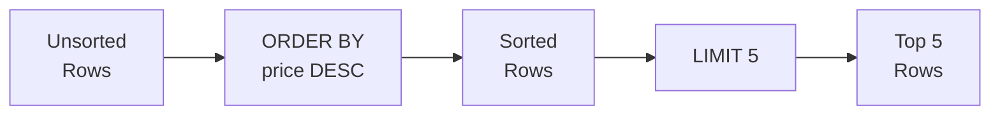

# Lesson 3: Sorting and Pagination

SQL rows have no guaranteed order unless you ask for one. `ORDER BY` lets you sort results by one or more columns, while `LIMIT` and `OFFSET` let you page through large result sets efficiently.



> **Concept:** ORDER BY sorts the rows, then LIMIT takes the top N.

## ORDER BY — Single Column

Append `ASC` (ascending, the default) or `DESC` (descending) after the column name.

```sql
-- Cheapest products first
SELECT name, price
FROM products
WHERE is_active = 1
ORDER BY price ASC;
```

**Result:**

| name | price |
|------|------:|
| USB-C Cable 2m | 9.99 |
| Microfiber Cleaning Kit | 12.99 |
| Screen Protector 15" | 14.99 |
| ... | |

```sql
-- Most expensive products first
SELECT name, price
FROM products
WHERE is_active = 1
ORDER BY price DESC;
```

**Result:**

| name | price |
|------|------:|
| ASUS ProArt 32" 4K Monitor | 2199.00 |
| Dell XPS 17 Laptop | 1999.00 |
| ASUS ROG Gaming Desktop | 1899.00 |
| ... | |

## ORDER BY — Multiple Columns

Rows are sorted by the first column, then ties are broken by the second, and so on.

```sql
-- Sort by grade, then alphabetically within each grade
SELECT name, grade, point_balance
FROM customers
WHERE is_active = 1
ORDER BY grade ASC, name ASC;
```

**Result:**

| name | grade | point_balance |
|------|-------|--------------:|
| Aaron Brooks | BRONZE | 120 |
| Alice Ward | BRONZE | 450 |
| Amanda Lee | BRONZE | 80 |
| ... | | |
| ... | SILVER | ... |

```sql
-- Most recent orders first, then by total amount descending for ties
SELECT order_number, ordered_at, total_amount
FROM orders
ORDER BY ordered_at DESC, total_amount DESC;
```

**Result:**

| order_number | ordered_at | total_amount |
|--------------|------------|-------------:|
| ORD-20241231-09842 | 2024-12-31 23:58:01 | 2349.00 |
| ORD-20241231-09841 | 2024-12-31 23:41:17 | 149.99 |
| ORD-20241231-09840 | 2024-12-31 22:59:44 | 89.99 |
| ... | | |

## LIMIT

`LIMIT n` returns at most `n` rows. Combine with `ORDER BY` to get meaningful "top N" results.

```sql
-- Top 5 most expensive active products
SELECT name, price
FROM products
WHERE is_active = 1
ORDER BY price DESC
LIMIT 5;
```

**Result:**

| name | price |
|------|------:|
| ASUS ProArt 32" 4K Monitor | 2199.00 |
| Dell XPS 17 Laptop | 1999.00 |
| ASUS ROG Gaming Desktop | 1899.00 |
| MacBook Pro 16" M3 | 1799.00 |
| Dell XPS 15 Laptop | 1299.99 |

## OFFSET — Pagination

{ .off-glb width="480"  }

`OFFSET n` skips the first `n` rows before starting to return results. Combined with `LIMIT`, this implements page-based navigation.

```sql
-- Page 1: rows 1–10
SELECT name, price
FROM products
WHERE is_active = 1
ORDER BY name ASC
LIMIT 10 OFFSET 0;

-- Page 2: rows 11–20
SELECT name, price
FROM products
WHERE is_active = 1
ORDER BY name ASC
LIMIT 10 OFFSET 10;

-- Page 3: rows 21–30
SELECT name, price
FROM products
WHERE is_active = 1
ORDER BY name ASC
LIMIT 10 OFFSET 20;
```

**Page 1 Result:**

| name | price |
|------|------:|
| ASUS ProArt Studiobook 16 | 2099.00 |
| ASUS ROG Gaming Desktop | 1899.00 |
| ASUS ROG Swift 27" Monitor | 799.00 |
| ASUS TUF Gaming Laptop | 1099.00 |
| ... | |

> **Formula:** `OFFSET = (page_number - 1) * page_size`

## Ordering NULL Values

In SQLite, `NULL` sorts before other values in `ASC` order and after them in `DESC` order.

```sql
-- Customers ordered by birth_date; NULLs appear first
SELECT name, birth_date
FROM customers
ORDER BY birth_date ASC
LIMIT 5;
```

**Result:**

| name | birth_date |
|------|------------|
| Alex Chen | (NULL) |
| Maria Santos | (NULL) |
| ... | (NULL) |
| Robert Kim | 1955-03-12 |
| ... | |

!!! note "Lesson Review"
    Quick exercises to check your understanding of this lesson. For comprehensive practice combining multiple concepts, see the [Exercises](../exercises/index.md) section.

## Practice Exercises

### Exercise 1
Find the 10 most recently placed orders. Return `order_number`, `ordered_at`, `status`, and `total_amount`.

??? success "Answer"
    ```sql
    SELECT order_number, ordered_at, status, total_amount
    FROM orders
    ORDER BY ordered_at DESC
    LIMIT 10;
    ```

### Exercise 2
List all products sorted first by `stock_qty` ascending (lowest stock first), then by `price` descending as a tiebreaker. Return `name`, `stock_qty`, and `price`. Limit to 20 rows.

??? success "Answer"
    ```sql
    SELECT name, stock_qty, price
    FROM products
    ORDER BY stock_qty ASC, price DESC
    LIMIT 20;
    ```

### Exercise 3
Implement page 3 of a product catalog (10 items per page), sorted alphabetically by product name. Only include active products.

??? success "Answer"
    ```sql
    SELECT name, price, stock_qty
    FROM products
    WHERE is_active = 1
    ORDER BY name ASC
    LIMIT 10 OFFSET 20;
    ```

### Exercise 4
Find the 5 customers with the highest point balance. Return `name`, `grade`, and `point_balance`.

??? success "Answer"
    ```sql
    SELECT name, grade, point_balance
    FROM customers
    ORDER BY point_balance DESC
    LIMIT 5;
    ```

### Exercise 5
List `name` and `price` from `products`, sorted by price ascending. When prices are equal, sort alphabetically by name.

??? success "Answer"
    ```sql
    SELECT name, price
    FROM products
    ORDER BY price ASC, name ASC;
    ```

### Exercise 6
Select `name`, `price`, and `cost_price` from `products`, sorted by margin (`price - cost_price`) in descending order. Return only the top 10 rows.

??? success "Answer"
    ```sql
    SELECT name, price, cost_price
    FROM products
    ORDER BY price - cost_price DESC
    LIMIT 10;
    ```

### Exercise 7
From `reviews`, select `product_id`, `rating`, and `created_at`. Sort by most recent first and return the 2nd page (5 items per page, i.e., rows 6 through 10).

??? success "Answer"
    ```sql
    SELECT product_id, rating, created_at
    FROM reviews
    ORDER BY created_at DESC
    LIMIT 5 OFFSET 5;
    ```

### Exercise 8
List `name`, `department`, and `hired_at` from the `staff` table. Sort by department alphabetically, then within each department by hire date ascending (longest-tenured first).

??? success "Answer"
    ```sql
    SELECT name, department, hired_at
    FROM staff
    ORDER BY department ASC, hired_at ASC;
    ```

### Exercise 9
Select `name` and `birth_date` from `customers`, sorted so that customers with a NULL birth date appear last. Non-NULL rows should be sorted by birth date ascending.

=== "SQLite"
    ??? success "Answer"
        ```sql
        SELECT name, birth_date
        FROM customers
        ORDER BY birth_date IS NULL ASC, birth_date ASC;
        ```

=== "MySQL"
    ??? success "Answer"
        ```sql
        SELECT name, birth_date
        FROM customers
        ORDER BY birth_date IS NULL ASC, birth_date ASC;
        ```

=== "PostgreSQL"
    ??? success "Answer"
        ```sql
        SELECT name, birth_date
        FROM customers
        ORDER BY birth_date ASC NULLS LAST;
        ```

### Exercise 10
Select `order_number`, `total_amount`, and `ordered_at` from `orders`. Sort by amount descending, breaking ties by most recent order first. Return only the top 15 rows.

??? success "Answer"
    ```sql
    SELECT order_number, total_amount, ordered_at
    FROM orders
    ORDER BY total_amount DESC, ordered_at DESC
    LIMIT 15;
    ```

---
Next: [Lesson 4: Aggregate Functions](04-aggregates.md)
