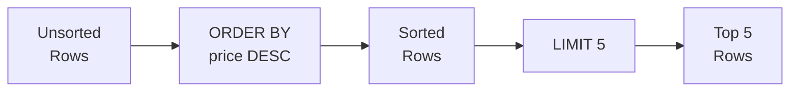

# Lesson 3: Sorting and Pagination

In Lesson 2, we filtered rows with WHERE. But the results came in no particular order, right? You can sort with ORDER BY and retrieve only the top N rows with LIMIT.

!!! note "Already familiar?"
    If you already know ORDER BY, LIMIT, and OFFSET, skip ahead to [Lesson 4: Aggregate Functions](04-aggregates.md).

The row order of SQL results is not guaranteed unless explicitly specified. You can sort by one or more columns using `ORDER BY`, and use `LIMIT` and `OFFSET` to browse large result sets page by page.



> **Concept:** ORDER BY sorts the rows, then LIMIT clips the top N.

## ORDER BY -- Single Column

Append `ASC` (ascending, default) or `DESC` (descending) after the column name.

```sql
-- Sort products from lowest price
SELECT name, price
FROM products
WHERE is_active = 1
ORDER BY price ASC;
```

**Result:**

| name | price |
| ---------- | ----------: |
| TP-Link TL-SG108 실버 | 16500.0 |
| TP-Link TG-3468 블랙 | 19800.0 |
| 삼성 무선 키보드 Trio 500 화이트 | 20300.0 |
| TP-Link TL-SG1016D 화이트 | 20300.0 |
| 로지텍 G502 HERO 실버 | 20300.0 |
| Razer Cobra 실버 | 20300.0 |
| TP-Link Archer TX55E 실버 | 20500.0 |
| 로지텍 G402 | 20500.0 |
| ... | ... |

```sql
-- Sort products from highest price
SELECT name, price
FROM products
WHERE is_active = 1
ORDER BY price DESC;
```

**Result:**

| name | price |
| ---------- | ----------: |
| Razer Blade 14 블랙 | 7495200.0 |
| Razer Blade 16 블랙 | 5634900.0 |
| Razer Blade 16 | 5518300.0 |
| Razer Blade 18 | 5450500.0 |
| Razer Blade 14 | 5339100.0 |
| Razer Blade 16 실버 | 5127500.0 |
| Razer Blade 18 화이트 | 4913500.0 |
| MSI GeForce RTX 5070 Ti VENTUS 3X 실버 | 4881500.0 |
| ... | ... |

## ORDER BY -- Multiple Columns

Sorts by the first column first, then by the second column when values are equal.

```sql
-- Sort by grade, then alphabetically by name within each grade
SELECT name, grade, point_balance
FROM customers
WHERE is_active = 1
ORDER BY grade ASC, name ASC;
```

**Result:**

| name | grade | point_balance |
| ---------- | ---------- | ----------: |
| 강건우 | BRONZE | 25290 |
| 강건우 | BRONZE | 89281 |
| 강건우 | BRONZE | 51511 |
| 강건우 | BRONZE | 1728 |
| 강경수 | BRONZE | 52847 |
| 강경수 | BRONZE | 402 |
| 강경수 | BRONZE | 81691 |
| 강경수 | BRONZE | 0 |
| ... | ... | ... |

```sql
-- Sort by most recent order first; for the same timestamp, by amount descending
SELECT order_number, ordered_at, total_amount
FROM orders
ORDER BY ordered_at DESC, total_amount DESC;
```

**Result:**

| order_number | ordered_at | total_amount |
| ---------- | ---------- | ----------: |
| ORD-20251211-413965 | 2026-01-01 08:40:57 | 409600.0 |
| ORD-20251226-416837 | 2026-01-01 06:40:57 | 1169700.0 |
| ORD-20251231-417734 | 2025-12-31 23:28:51 | 2076300.0 |
| ORD-20251231-417696 | 2025-12-31 23:26:03 | 814400.0 |
| ORD-20251231-417737 | 2025-12-31 23:17:28 | 550600.0 |
| ORD-20251231-417735 | 2025-12-31 23:12:47 | 35000.0 |
| ORD-20251231-417677 | 2025-12-31 23:09:05 | 2002473.0 |
| ORD-20251231-417764 | 2025-12-31 23:00:56 | 42700.0 |
| ... | ... | ... |

## LIMIT

`LIMIT n` returns at most `n` rows. When used with `ORDER BY`, it meaningfully extracts the "top N" results.

```sql
-- The 5 most expensive active products
SELECT name, price
FROM products
WHERE is_active = 1
ORDER BY price DESC
LIMIT 5;
```

**Result:**

| name | price |
| ---------- | ----------: |
| Razer Blade 14 블랙 | 7495200.0 |
| Razer Blade 16 블랙 | 5634900.0 |
| Razer Blade 16 | 5518300.0 |
| Razer Blade 18 | 5450500.0 |
| Razer Blade 14 | 5339100.0 |
| ... | ... |

## OFFSET -- Pagination

{ .off-glb width="480"  }

`OFFSET n` skips the first `n` rows and returns the rest. When used with `LIMIT`, you can implement page-based browsing.

```sql
-- Page 1: rows 1-10
SELECT name, price
FROM products
WHERE is_active = 1
ORDER BY name ASC
LIMIT 10 OFFSET 0;

-- Page 2: rows 11-20
SELECT name, price
FROM products
WHERE is_active = 1
ORDER BY name ASC
LIMIT 10 OFFSET 10;

-- Page 3: rows 21-30
SELECT name, price
FROM products
WHERE is_active = 1
ORDER BY name ASC
LIMIT 10 OFFSET 20;
```

**Page 1 result:**

| name | price |
|------|------:|
| ASUS ProArt Studiobook 16 | 2099.00 |
| ASUS ROG Gaming Desktop | 1899.00 |
| ASUS ROG Swift 27" Monitor | 799.00 |
| ASUS TUF Gaming Laptop | 1099.00 |
| ... | |

> **Formula:** `OFFSET = (page number - 1) x page size`

## NULL Sort Order

In SQLite, NULLs come before other values with `ASC` sorting and after with `DESC` sorting.

```sql
-- When sorting birth_date ascending, NULLs appear first
SELECT name, birth_date
FROM customers
ORDER BY birth_date ASC
LIMIT 5;
```

**Result:**

| name | birth_date |
| ---------- | ---------- |
| 김명자 | (NULL) |
| 김정식 | (NULL) |
| 윤순옥 | (NULL) |
| 이서연 | (NULL) |
| 강민석 | (NULL) |
| ... | ... |

## Summary

| Keyword | Description | Example |
|---------|-------------|---------|
| `ORDER BY col ASC` | Ascending sort (default) | `ORDER BY price ASC` |
| `ORDER BY col DESC` | Descending sort | `ORDER BY price DESC` |
| Multiple column sort | If the first column is equal, sort by the second | `ORDER BY grade ASC, name ASC` |
| `LIMIT n` | Return at most n rows | `LIMIT 5` |
| `OFFSET n` | Skip the first n rows | `LIMIT 10 OFFSET 20` (page 3) |
| NULL sorting | SQLite: NULLs first with ASC, last with DESC | `ORDER BY birth_date IS NULL ASC, birth_date ASC` |

!!! note "Lesson Review Problems"
    These are simple problems to immediately check the concepts learned in this lesson. For comprehensive practice combining multiple concepts, see the [Practice Problems](../exercises/index.md) section.

## Practice Problems

### Problem 1
Find the 10 most recently placed orders. Return `order_number`, `ordered_at`, `status`, and `total_amount`.

??? success "Answer"
    ```sql
    SELECT order_number, ordered_at, status, total_amount
    FROM orders
    ORDER BY ordered_at DESC
    LIMIT 10;
    ```

    **Result (example):**

| order_number | ordered_at | status | total_amount |
| ---------- | ---------- | ---------- | ----------: |
| ORD-20251211-413965 | 2026-01-01 08:40:57 | pending | 409600.0 |
| ORD-20251226-416837 | 2026-01-01 06:40:57 | pending | 1169700.0 |
| ORD-20251231-417734 | 2025-12-31 23:28:51 | pending | 2076300.0 |
| ORD-20251231-417696 | 2025-12-31 23:26:03 | return_requested | 814400.0 |
| ORD-20251231-417737 | 2025-12-31 23:17:28 | pending | 550600.0 |
| ORD-20251231-417735 | 2025-12-31 23:12:47 | pending | 35000.0 |
| ORD-20251231-417677 | 2025-12-31 23:09:05 | pending | 2002473.0 |
| ORD-20251231-417764 | 2025-12-31 23:00:56 | pending | 42700.0 |
| ... | ... | ... | ... |


### Problem 2
Sort all products by `stock_qty` ascending (lowest stock first); for equal stock, sort by `price` descending. Return `name`, `stock_qty`, and `price`, limited to 20 rows.

??? success "Answer"
    ```sql
    SELECT name, stock_qty, price
    FROM products
    ORDER BY stock_qty ASC, price DESC
    LIMIT 20;
    ```

    **Result (example):**

| name | stock_qty | price |
| ---------- | ----------: | ----------: |
| 한컴오피스 2024 기업용 실버 | 0 | 391200.0 |
| WD My Passport 2TB 블랙 | 0 | 329100.0 |
| 삼성 DDR5 32GB PC5-38400 실버 | 0 | 158000.0 |
| 삼성 DDR4 16GB PC4-25600 | 0 | 73600.0 |
| Arctic Freezer 36 A-RGB 화이트 | 0 | 27400.0 |
| Dell S2425HS 블랙 | 1 | 667900.0 |
| Dell U2723QE 실버 | 1 | 396300.0 |
| Arctic Liquid Freezer III 240 | 1 | 189300.0 |
| ... | ... | ... |


### Problem 3
Retrieve page 3 (10 items per page) of the active product catalog sorted alphabetically by product name.

??? success "Answer"
    ```sql
    SELECT name, price, stock_qty
    FROM products
    WHERE is_active = 1
    ORDER BY name ASC
    LIMIT 10 OFFSET 20;
    ```

    **Result (example):**

| name | price | stock_qty |
| ---------- | ----------: | ----------: |
| APC Back-UPS Pro BR1500G 실버 | 340300.0 | 292 |
| APC Back-UPS Pro BR1500G 화이트 | 233800.0 | 497 |
| APC Back-UPS Pro BR1500G 화이트 | 495000.0 | 241 |
| APC Back-UPS Pro Gaming BGM1500B 블랙 | 624300.0 | 393 |
| APC Back-UPS Pro Gaming BGM1500B 화이트 | 449500.0 | 22 |
| APC Smart-UPS SMT1500 | 561700.0 | 220 |
| APC Smart-UPS SMT1500 블랙 | 396600.0 | 217 |
| APC Smart-UPS SMT1500 블랙 | 137100.0 | 165 |
| ... | ... | ... |


### Problem 4
Retrieve the `name`, `grade`, and `point_balance` of the top 5 customers with the most points from the `customers` table.

??? success "Answer"
    ```sql
    SELECT name, grade, point_balance
    FROM customers
    ORDER BY point_balance DESC
    LIMIT 5;
    ```

    **Result (example):**

| name | grade | point_balance |
| ---------- | ---------- | ----------: |
| 박정수 | VIP | 6344986 |
| 정유진 | VIP | 6255658 |
| 이미정 | VIP | 5999946 |
| 김상철 | VIP | 5406032 |
| 문영숙 | VIP | 4947814 |
| ... | ... | ... |


### Problem 5
Retrieve `name` and `price` from the `products` table sorted by price ascending. For equal prices, sort by product name alphabetically.

??? success "Answer"
    ```sql
    SELECT name, price
    FROM products
    ORDER BY price ASC, name ASC;
    ```

    **Result (example):**

| name | price |
| ---------- | ----------: |
| TP-Link TL-SG108 실버 | 16500.0 |
| 로지텍 M100r | 17300.0 |
| 넷기어 GS308 블랙 | 17400.0 |
| TP-Link TL-SG108E | 18000.0 |
| 로지텍 G502 HERO [특별 한정판 에디션] 무상 보증 3년 연장 + 전용 파우치 증정 이벤트 | 19400.0 |
| TP-Link TG-3468 블랙 | 19800.0 |
| TP-Link TL-SG108 | 20100.0 |
| Razer Cobra 실버 | 20300.0 |
| ... | ... |


### Problem 6
Retrieve `name`, `price`, and `cost_price` from the `products` table, sorted by margin (`price - cost_price`) in descending order. Return only the top 10.

??? success "Answer"
    ```sql
    SELECT name, price, cost_price
    FROM products
    ORDER BY price - cost_price DESC
    LIMIT 10;
    ```

    **Result (example):**

| name | price | cost_price |
| ---------- | ----------: | ----------: |
| Razer Blade 14 블랙 | 7495200.0 | 4161000.0 |
| MacBook Air 13 M4 | 4449200.0 | 2451900.0 |
| Razer Blade 16 | 5518300.0 | 3703300.0 |
| MSI GeForce RTX 5070 Ti VENTUS 3X 실버 | 4881500.0 | 3168100.0 |
| Razer Blade 18 화이트 | 4913500.0 | 3251900.0 |
| Razer Blade 16 화이트 | 5503500.0 | 3852400.0 |
| Razer Blade 18 | 5450500.0 | 3815300.0 |
| MacBook Pro 14 M4 Pro | 4237400.0 | 2624000.0 |
| ... | ... | ... |


### Problem 7
Retrieve `product_id`, `rating`, and `created_at` from the `reviews` table, sorted by most recent review first, returning the 6th through 10th reviews (page 2, 5 per page).

??? success "Answer"
    ```sql
    SELECT product_id, rating, created_at
    FROM reviews
    ORDER BY created_at DESC
    LIMIT 5 OFFSET 5;
    ```

    **Result (example):**

| product_id | rating | created_at |
| ----------: | ----------: | ---------- |
| 2616 | 2 | 2026-01-18 08:05:26 |
| 2724 | 4 | 2026-01-17 16:45:41 |
| 2736 | 4 | 2026-01-17 13:50:31 |
| 2183 | 5 | 2026-01-17 12:41:28 |
| 2273 | 4 | 2026-01-17 10:12:45 |
| ... | ... | ... |


### Problem 8
Retrieve `name`, `department`, and `hired_at` from the `staff` table. Sort by department name alphabetically; within the same department, sort by hire date with longest-tenured employees first.

??? success "Answer"
    ```sql
    SELECT name, department, hired_at
    FROM staff
    ORDER BY department ASC, hired_at ASC;
    ```

    **Result (example):**

| name | department | hired_at |
| ---------- | ---------- | ---------- |
| 김옥자 | CS | 2017-06-11 |
| 이현준 | CS | 2022-05-17 |
| 이순자 | CS | 2023-03-12 |
| 김영일 | 개발 | 2020-05-03 |
| 김현주 | 개발 | 2024-09-04 |
| 한민재 | 경영 | 2016-05-23 |
| 심정식 | 경영 | 2017-04-20 |
| 장주원 | 경영 | 2017-08-20 |
| ... | ... | ... |


### Problem 9
Retrieve `name` and `birth_date` from the `customers` table, with customers whose birth date is NULL appearing at the very end. Non-NULL customers should be sorted by birth date ascending.

=== "SQLite"
    ??? success "Answer"
        ```sql
        SELECT name, birth_date
        FROM customers
        ORDER BY birth_date IS NULL ASC, birth_date ASC;
        ```

=== "MySQL"
    ??? success "Answer"
        ```sql
        SELECT name, birth_date
        FROM customers
        ORDER BY birth_date IS NULL ASC, birth_date ASC;
        ```

=== "PostgreSQL"
    ??? success "Answer"
        ```sql
        SELECT name, birth_date
        FROM customers
        ORDER BY birth_date ASC NULLS LAST;
        ```

### Problem 10
Retrieve `order_number`, `total_amount`, and `ordered_at` from the `orders` table. Sort by order amount descending; for equal amounts, most recent order first. Return only the top 15.

??? success "Answer"
    ```sql
    SELECT order_number, total_amount, ordered_at
    FROM orders
    ORDER BY total_amount DESC, ordered_at DESC
    LIMIT 15;
    ```

    **Result (example):**

| order_number | total_amount | ordered_at |
| ---------- | ----------: | ---------- |
| ORD-20230408-248697 | 71906300.0 | 2023-04-08 16:24:03 |
| ORD-20240218-293235 | 68948100.0 | 2024-02-18 20:53:49 |
| ORD-20240822-323378 | 64332900.0 | 2024-08-22 13:20:32 |
| ORD-20180516-26809 | 63466900.0 | 2018-05-16 06:29:52 |
| ORD-20200429-82365 | 61889000.0 | 2020-04-29 21:21:06 |
| ORD-20230626-259827 | 61811500.0 | 2023-06-26 10:03:37 |
| ORD-20160730-03977 | 60810900.0 | 2016-07-30 19:12:23 |
| ORD-20251230-417476 | 60038800.0 | 2025-12-30 09:47:24 |
| ... | ... | ... |


### Scoring Guide

| Score | Next Step |
|:-----:|-----------|
| **9-10** | Move to [Lesson 4: Aggregate Functions](04-aggregates.md) |
| **7-8** | Review the explanations for incorrect answers, then proceed to Lesson 4 |
| **5 or fewer** | Read this lesson again |
| **3 or fewer** | Start over from [Lesson 2: Filtering with WHERE](02-where.md) |

**Problem Areas:**

| Area | Problems |
|------|:--------:|
| ORDER BY DESC + LIMIT | 1, 4 |
| Multiple column sort (ASC/DESC) | 2, 5, 8 |
| LIMIT + OFFSET (pagination) | 3, 7 |
| ORDER BY expression + LIMIT | 6 |
| NULL sort handling | 9 |
| Multiple sort + LIMIT | 10 |

---
Next: [Lesson 4: Aggregate Functions](04-aggregates.md)
