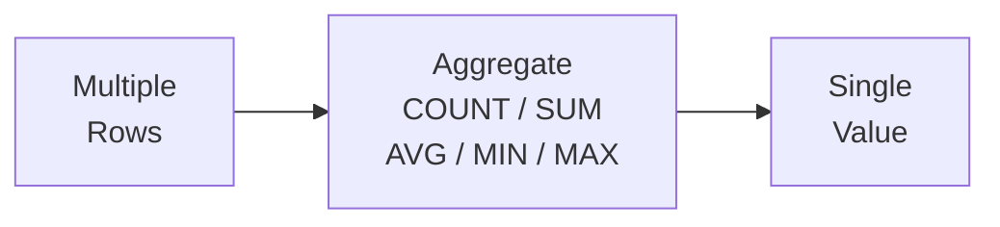

# Lesson 4: Aggregate Functions

In Lesson 3, we sorted results with ORDER BY and LIMIT to get the top N rows. This time, we learn aggregate functions that summarize multiple rows into a single number, such as "how many total customers are there" or "what is the average order amount."

!!! note "Already familiar?"
    If you already know COUNT, COUNT(DISTINCT), SUM, AVG, MIN, and MAX, skip ahead to [Lesson 5: GROUP BY](05-group-by.md).



> **Concept:** Aggregate functions summarize multiple rows into a single value.

## COUNT

`COUNT(*)` counts the total number of rows in the result. `COUNT(column)` counts the number of non-NULL values in that column.

```sql
-- Total number of customers
SELECT COUNT(*) AS total_customers
FROM customers;
```

**Result:**

| total_customers |
| ----------: |
| 52300 |

```sql
-- Compare customer counts by birth date registration
SELECT
    COUNT(*)           AS total_customers,
    COUNT(birth_date)  AS with_birth_date,
    COUNT(*) - COUNT(birth_date) AS missing_birth_date
FROM customers;
```

**Result:**

| total_customers | with_birth_date | missing_birth_date |
| ----------: | ----------: | ----------: |
| 52300 | 44507 | 7793 |

### COUNT(DISTINCT) -- Unique Value Count

`COUNT(DISTINCT column)` counts the number of values **after removing duplicates**. Use it when you want to know "how many distinct types exist."

```sql
-- Number of unique customers who have placed orders
SELECT
    COUNT(*)                    AS total_orders,
    COUNT(DISTINCT customer_id) AS unique_customers
FROM orders;
```

**Result:**

| total_orders | unique_customers |
| ----------: | ----------: |
| 417803 | 29230 |

There are 34,908 orders, but only 4,985 unique customers have placed orders, since one customer can place multiple orders.

```sql
-- Number of brands TechShop carries
SELECT COUNT(DISTINCT brand) AS brand_count
FROM products;
```

---

## SUM

`SUM` calculates the total of a numeric column. NULL values are ignored.

```sql
-- Total revenue from completed orders
SELECT SUM(total_amount) AS total_revenue
FROM orders
WHERE status IN ('delivered', 'confirmed');
```

**Result:**

| total_revenue |
| ----------: |
| 393749378848.0 |

```sql
-- Total points held by active customers
SELECT SUM(point_balance) AS total_points_outstanding
FROM customers
WHERE is_active = 1;
```

**Result:**

| total_points_outstanding |
| ----------: |
| 3840575170 |

## AVG

`AVG` returns the arithmetic mean, excluding NULL values from the calculation.

```sql
-- Average price and average stock of active products
SELECT
    AVG(price)     AS avg_price,
    AVG(stock_qty) AS avg_stock
FROM products
WHERE is_active = 1;
```

**Result:**

| avg_price | avg_stock |
| ----------: | ----------: |
| 678774.8505747126 | 250.53793103448277 |

```sql
-- Average order amount excluding cancellations and returns
SELECT AVG(total_amount) AS avg_order_value
FROM orders
WHERE status NOT IN ('cancelled', 'returned');
```

**Result:**

| avg_order_value |
| ----------: |
| 1034451.993859959 |

## ROUND -- Rounding

`AVG` results can have many decimal places. Use `ROUND(value, digits)` to round to the desired number of decimal places.

```sql
-- Average review rating rounded to 1 decimal place
SELECT
    AVG(rating)          AS avg_raw,
    ROUND(AVG(rating), 1) AS avg_rounded
FROM reviews;
```

**Result:**

| avg_raw | avg_rounded |
| ----------: | ----------: |
| 3.903090491521336 | 3.9 |

```sql
-- Average product price rounded to the nearest whole number
SELECT ROUND(AVG(price), 0) AS avg_price
FROM products;
```

| avg_price |
| --------: |
| 665405 |

### Integer Division Caution

In SQLite, **integer / integer = integer**. The decimal part is truncated:

```sql
-- Problem: trying to calculate the review rate...
SELECT
    COUNT(*)                    AS total_orders,
    (SELECT COUNT(*) FROM reviews) AS total_reviews,
    (SELECT COUNT(*) FROM reviews) / COUNT(*) AS review_rate
FROM orders;
```

| total_orders | total_reviews | review_rate |
| -----------: | ------------: | ----------: |
| 34908 | 7945 | **0** |

7945 / 34908 = 0.2275... but because of integer division, it becomes **0**. The fix:

```sql
-- Fix: multiply by a float (1.0)
SELECT ROUND((SELECT COUNT(*) FROM reviews) * 1.0 / COUNT(*) * 100, 1) AS review_rate_pct
FROM orders;
```

| review_rate_pct |
| --------------: |
| 22.8 |

!!! tip "What about MySQL/PostgreSQL?"
    MySQL and PostgreSQL preserve decimal places even in integer division, so this issue does not occur. This is a SQLite-specific caveat.

---

## MIN and MAX

`MIN` and `MAX` find the smallest and largest values in a column.

```sql
-- Lowest and highest prices among active products
SELECT
    MIN(price) AS cheapest,
    MAX(price) AS most_expensive
FROM products
WHERE is_active = 1;
```

**Result:**

| cheapest | most_expensive |
| ----------: | ----------: |
| 16500.0 | 7495200.0 |

```sql
-- First and most recent order dates
SELECT
    MIN(ordered_at) AS first_order,
    MAX(ordered_at) AS latest_order
FROM orders;
```

**Result:**

| first_order | latest_order |
| ---------- | ---------- |
| 2016-01-02 13:54:14 | 2026-01-01 08:40:57 |

## Using Multiple Aggregate Functions Together

You can use multiple aggregate functions in a single `SELECT`.

```sql
-- TechShop review statistics summary
SELECT
    COUNT(*)                    AS total_reviews,
    AVG(rating)                 AS avg_rating,
    MIN(rating)                 AS lowest_rating,
    MAX(rating)                 AS highest_rating,
    SUM(CASE WHEN rating = 5 THEN 1 ELSE 0 END) AS five_star_count
FROM reviews;
```

**Result:**

| total_reviews | avg_rating | lowest_rating | highest_rating | five_star_count |
| ----------: | ----------: | ----------: | ----------: | ----------: |
| 95357 | 3.903090491521336 | 1 | 5 | 38460 |

## Aggregate Functions and NULL

Aggregate functions **silently ignore** NULL values. This is an important behavior:

```sql
-- About 15% of customers have NULL birth_date
SELECT
    COUNT(*)           AS total,
    COUNT(birth_date)  AS with_birth,
    AVG(CASE
        WHEN birth_date IS NOT NULL
        THEN 2025 - CAST(SUBSTR(birth_date, 1, 4) AS INTEGER)
    END) AS avg_age
FROM customers;
```

| total | with_birth | avg_age |
| ----: | ---------: | ------: |
| 5230 | 4450 | 39.2 |

- `COUNT(*)` = 5,230 (all rows including NULL)
- `COUNT(birth_date)` = 4,450 (excluding NULL)
- `AVG` = calculated only for the 4,450 with data (780 with NULL are excluded)

!!! warning "NULL can skew results"
    `AVG(age based on birth_date)` is the average only for people who entered their birth date. It may differ from the actual average age of all customers. When aggregating columns with many NULLs, always compare `COUNT(*)` and `COUNT(column)` to check the NULL ratio.

---

## Summary

| Function | Description | Example |
|----------|-------------|---------|
| `COUNT(*)` | Total row count (includes NULL) | `SELECT COUNT(*) FROM orders` |
| `COUNT(column)` | Row count excluding NULL | `COUNT(birth_date)` |
| `COUNT(DISTINCT column)` | Unique value count | `COUNT(DISTINCT customer_id)` |
| `SUM(column)` | Sum (ignores NULL) | `SUM(total_amount)` |
| `AVG(column)` | Average (ignores NULL) | `AVG(price)` |
| `ROUND(value, N)` | Round to N decimal places | `ROUND(AVG(price), 0)` |
| `MIN(column)` | Minimum value | `MIN(price)` |
| `MAX(column)` | Maximum value | `MAX(price)` |
| Integer division | SQLite: integer / integer = integer | Multiply by `* 1.0` to convert to float |
| NULL handling | Aggregate functions ignore NULL | Compare `COUNT(*)` and `COUNT(column)` |

!!! note "Lesson Review Problems"
    These are simple problems to immediately check the concepts learned in this lesson. For comprehensive practice combining multiple concepts, see the [Practice Problems](../exercises/index.md) section.

## Practice Problems
### Problem 1
Calculate the average review rating from the `reviews` table, rounded to 2 decimal places. Use the alias `avg_rating`.

??? success "Answer"
    ```sql
    SELECT ROUND(AVG(rating), 2) AS avg_rating
    FROM reviews;
    ```

    **Result (example):**

| avg_rating |
| ----------: |
| 3.9 |


### Problem 2
Calculate the total revenue (sum of `total_amount`) from completed orders (`status` is `'delivered'` or `'confirmed'`) in the `orders` table. Use the alias `total_revenue`.

??? success "Answer"
    ```sql
    SELECT SUM(total_amount) AS total_revenue
    FROM orders
    WHERE status IN ('delivered', 'confirmed');
    ```

    **Result (example):**

| total_revenue |
| ----------: |
| 393749378848.0 |


### Problem 3
From the `customers` table, find the total number of customers and the number of customers with a registered `birth_date`. Use the aliases `total_customers` and `with_birth_date`.

??? success "Answer"
    ```sql
    SELECT
        COUNT(*)          AS total_customers,
        COUNT(birth_date) AS with_birth_date
    FROM customers;
    ```

    **Result (example):**

| total_customers | with_birth_date |
| ----------: | ----------: |
| 52300 | 44507 |


### Problem 4
Count the number of currently active products at TechShop and calculate their total inventory value (sum of `price * stock_qty`).

??? success "Answer"
    ```sql
    SELECT
        COUNT(*)                AS active_product_count,
        SUM(price * stock_qty)  AS total_inventory_value
    FROM products
    WHERE is_active = 1;
    ```

    **Result (example):**

| active_product_count | total_inventory_value |
| ----------: | ----------: |
| 2175 | 375495851400.0 |


### Problem 5
Calculate the average, minimum, and maximum `total_amount` for orders that were not cancelled or returned. Use the aliases `avg_order`, `min_order`, and `max_order`.

??? success "Answer"
    ```sql
    SELECT
        AVG(total_amount) AS avg_order,
        MIN(total_amount) AS min_order,
        MAX(total_amount) AS max_order
    FROM orders
    WHERE status NOT IN ('cancelled', 'returned', 'return_requested');
    ```

    **Result (example):**

| avg_order | min_order | max_order |
| ----------: | ----------: | ----------: |
| 1027943.4813606213 | 13262.0 | 71906300.0 |


### Problem 6
From the `products` table, calculate the average price (`avg_price`, 0 decimal places), average cost (`avg_cost`, 0 decimal places), and average margin rate (`avg_margin_pct`, 1 decimal place) of active products in a single query. Margin rate = `(price - cost_price) / price * 100`, and you should compute the average of each product's margin rate.

??? success "Answer"
    ```sql
    SELECT
        ROUND(AVG(price), 0)                          AS avg_price,
        ROUND(AVG(cost_price), 0)                           AS avg_cost,
        ROUND(AVG((price - cost_price) / price * 100), 1)   AS avg_margin_pct
    FROM products
    WHERE is_active = 1;
    ```

    **Result (example):**

| avg_price | avg_cost | avg_margin_pct |
| ----------: | ----------: | ----------: |
| 678775.0 | 519733.0 | 23.3 |


### Problem 7
From the `products` table, find the minimum price, maximum price, and price range for active products (`is_active = 1`). Use the aliases `min_price`, `max_price`, and `price_range`.

??? success "Answer"
    ```sql
    SELECT
        MIN(price)             AS min_price,
        MAX(price)             AS max_price,
        MAX(price) - MIN(price) AS price_range
    FROM products
    WHERE is_active = 1;
    ```

    **Result (example):**

| min_price | max_price | price_range |
| ----------: | ----------: | ----------: |
| 16500.0 | 7495200.0 | 7478700.0 |


### Problem 8
From the `order_items` table, find the total row count, total quantity sum (`quantity`), average unit price (`unit_price`, 2 decimal places), and maximum quantity. Use the aliases `total_items`, `total_qty`, `avg_unit_price`, and `max_qty`.

??? success "Answer"
    ```sql
    SELECT
        COUNT(*)                    AS total_items,
        SUM(quantity)               AS total_qty,
        ROUND(AVG(unit_price), 2)   AS avg_unit_price,
        MAX(quantity)               AS max_qty
    FROM order_items;
    ```

    **Result (example):**

| total_items | total_qty | avg_unit_price | max_qty |
| ----------: | ----------: | ----------: | ----------: |
| 1015189 | 1117997 | 406547.0 | 10 |


### Problem 9
From the `payments` table, find the count, total amount, average amount (0 decimal places), and minimum/maximum amounts for completed payments (`status = 'completed'`) in a single query. Use the aliases `payment_count`, `total_amount`, `avg_amount`, `min_amount`, and `max_amount`.

??? success "Answer"
    ```sql
    SELECT
        COUNT(*)              AS payment_count,
        SUM(amount)           AS total_amount,
        ROUND(AVG(amount), 0) AS avg_amount,
        MIN(amount)           AS min_amount,
        MAX(amount)           AS max_amount
    FROM payments
    WHERE status = 'completed';
    ```

    **Result (example):**

| payment_count | total_amount | avg_amount | min_amount | max_amount |
| ----------: | ----------: | ----------: | ----------: | ----------: |
| 383883 | 394593947687.0 | 1027902.0 | 13262.0 | 71906300.0 |


### Problem 10
How many orders have a shipping note (`notes`), and what percentage of total orders is that? Return `orders_with_notes`, `total_orders`, and `pct_with_notes` (1 decimal place).

??? success "Answer"
    ```sql
    SELECT
        COUNT(CASE WHEN notes IS NOT NULL THEN 1 END)  AS orders_with_notes,
        COUNT(*)                                        AS total_orders,
        ROUND(
            100.0 * COUNT(CASE WHEN notes IS NOT NULL THEN 1 END) / COUNT(*),
            1
        ) AS pct_with_notes
    FROM orders;
    ```

    **Result (example):**

| orders_with_notes | total_orders | pct_with_notes |
| ----------: | ----------: | ----------: |
| 146327 | 417803 | 35.0 |


### Scoring Guide

| Score | Next Step |
|:-----:|-----------|
| **9-10** | Move to [Lesson 5: GROUP BY](05-group-by.md) |
| **7-8** | Review the explanations for incorrect answers, then proceed to Lesson 5 |
| **5 or fewer** | Read this lesson again |
| **3 or fewer** | Start over from [Lesson 3: Sorting and Pagination](03-sort-limit.md) |

**Problem Areas:**

| Area | Problems |
|------|:--------:|
| AVG / ROUND | 1, 6 |
| SUM | 2, 4 |
| COUNT / COUNT(col) | 3 |
| MIN / MAX | 5, 7 |
| Combined aggregates (COUNT, SUM, AVG, MAX) | 8, 9 |
| CASE + COUNT (NULL ratio) | 10 |

---
Next: [Lesson 5: GROUP BY and HAVING](05-group-by.md)
