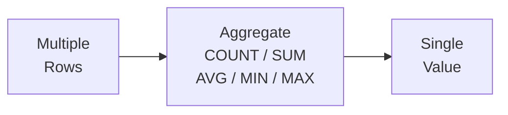

# Lesson 4: Aggregate Functions

Aggregate functions collapse many rows into a single summary value. They are the building blocks for reports, dashboards, and business metrics.



> **Concept:** Aggregate functions summarize many rows into a single value.

## COUNT

`COUNT(*)` counts every row in the result. `COUNT(column)` counts non-NULL values in that column.

```sql
-- Total number of customers
SELECT COUNT(*) AS total_customers
FROM customers;
```

**Result:**

| total_customers |
| --------------: |
|            5230 |

```sql
-- Customers who provided their birth date
SELECT
    COUNT(*)           AS total_customers,
    COUNT(birth_date)  AS with_birth_date,
    COUNT(*) - COUNT(birth_date) AS missing_birth_date
FROM customers;
```

**Result:**

| total_customers | with_birth_date | missing_birth_date |
| --------------: | --------------: | -----------------: |
|            5230 |            4450 |                780 |

## SUM

`SUM` totals a numeric column. NULL values are ignored.

```sql
-- Total revenue across all completed orders
SELECT SUM(total_amount) AS total_revenue
FROM orders
WHERE status IN ('delivered', 'confirmed');
```

**Result:**

| total_revenue |
| ------------: |
|   32371516748 |

```sql
-- Total points currently held by all customers
SELECT SUM(point_balance) AS total_points_outstanding
FROM customers
WHERE is_active = 1;
```

**Result:**

| total_points_outstanding |
| -----------------------: |
|                315697474 |

## AVG

`AVG` returns the arithmetic mean, ignoring NULLs.

```sql
-- Average product price
SELECT
    AVG(price)     AS avg_price,
    AVG(stock_qty) AS avg_stock
FROM products
WHERE is_active = 1;
```

**Result:**

| avg_price | avg_stock |
| --------: | --------: |
| 665404.59 |    272.41 |

```sql
-- Average order value
SELECT AVG(total_amount) AS avg_order_value
FROM orders
WHERE status NOT IN ('cancelled', 'returned');
```

**Result:**

| avg_order_value |
| --------------: |
|      1014478.57 |

## MIN and MAX

`MIN` and `MAX` find the smallest and largest values in a column.

```sql
-- Price range for active products
SELECT
    MIN(price) AS cheapest,
    MAX(price) AS most_expensive
FROM products
WHERE is_active = 1;
```

**Result:**

| cheapest | most_expensive |
| -------: | -------------: |
|    13100 |        4314800 |

```sql
-- Earliest and latest order dates
SELECT
    MIN(ordered_at) AS first_order,
    MAX(ordered_at) AS latest_order
FROM orders;
```

**Result:**

| first_order         | latest_order        |
| ------------------- | ------------------- |
| 2016-01-09 10:19:26 | 2025-06-30 23:02:18 |

## Combining Multiple Aggregates

You can use several aggregates in the same `SELECT`:

```sql
-- Review statistics for TechShop
SELECT
    COUNT(*)                    AS total_reviews,
    AVG(rating)                 AS avg_rating,
    MIN(rating)                 AS lowest_rating,
    MAX(rating)                 AS highest_rating,
    SUM(CASE WHEN rating = 5 THEN 1 ELSE 0 END) AS five_star_count
FROM reviews;
```

**Result:**

| total_reviews | avg_rating | lowest_rating | highest_rating | five_star_count |
| ------------: | ---------: | ------------: | -------------: | --------------: |
|          7945 |       3.91 |             1 |              5 |            3221 |

!!! note "Lesson Review"
    Quick exercises to check your understanding of this lesson. For comprehensive practice combining multiple concepts, see the [Exercises](../exercises/index.md) section.

## Practice Exercises

### Exercise 1
Count how many **active** products TechShop currently carries, and find the total inventory value (sum of `price * stock_qty`) for those products.

??? success "Answer"
    ```sql
    SELECT
        COUNT(*)                AS active_product_count,
        SUM(price * stock_qty)  AS total_inventory_value
    FROM products
    WHERE is_active = 1;
    ```

    **Expected result:**

    | active_product_count | total_inventory_value |
    | -------------------: | --------------------: |
    |                  218 |           39496278500 |


### Exercise 2
Calculate the average, minimum, and maximum `total_amount` for orders that were not cancelled or returned. Use aliases `avg_order`, `min_order`, and `max_order`.

??? success "Answer"
    ```sql
    SELECT
        AVG(total_amount) AS avg_order,
        MIN(total_amount) AS min_order,
        MAX(total_amount) AS max_order
    FROM orders
    WHERE status NOT IN ('cancelled', 'returned', 'return_requested');
    ```

    **Expected result:**

    | avg_order | min_order | max_order |
    | --------: | --------: | --------: |
    | 1007109.8 |     10910 |  58039800 |


### Exercise 3
Count the total number of customers and the number of customers who have a `birth_date` registered. Use aliases `total_customers` and `with_birth_date`.

??? success "Answer"
    ```sql
    SELECT
        COUNT(*)          AS total_customers,
        COUNT(birth_date) AS with_birth_date
    FROM customers;
    ```

    **Expected result:**

    | total_customers | with_birth_date |
    | --------------: | --------------: |
    |            5230 |            4450 |


### Exercise 4
Find the total revenue (`SUM` of `total_amount`) from completed orders (status is `'delivered'` or `'confirmed'`). Use the alias `total_revenue`.

??? success "Answer"
    ```sql
    SELECT SUM(total_amount) AS total_revenue
    FROM orders
    WHERE status IN ('delivered', 'confirmed');
    ```

    **Expected result:**

    | total_revenue |
    | ------------: |
    |   32371516748 |


### Exercise 5
Calculate the average review rating from the `reviews` table, rounded to 2 decimal places. Use the alias `avg_rating`.

??? success "Answer"
    ```sql
    SELECT ROUND(AVG(rating), 2) AS avg_rating
    FROM reviews;
    ```

    **Expected result:**

    | avg_rating |
    | ---------: |
    |       3.91 |


### Exercise 6
Find the minimum price, maximum price, and the price range (difference between max and min) for active products (`is_active = 1`). Use aliases `min_price`, `max_price`, and `price_range`.

??? success "Answer"
    ```sql
    SELECT
        MIN(price)             AS min_price,
        MAX(price)             AS max_price,
        MAX(price) - MIN(price) AS price_range
    FROM products
    WHERE is_active = 1;
    ```

    **Expected result:**

    | min_price | max_price | price_range |
    | --------: | --------: | ----------: |
    |     13100 |   4314800 |     4301700 |


### Exercise 7
How many orders have delivery instructions (`notes IS NOT NULL`)? What percentage of all orders is that? Return `orders_with_notes`, `total_orders`, and `pct_with_notes` (rounded to 1 decimal place).

??? success "Answer"
    ```sql
    SELECT
        COUNT(CASE WHEN notes IS NOT NULL THEN 1 END)  AS orders_with_notes,
        COUNT(*)                                        AS total_orders,
        ROUND(
            100.0 * COUNT(CASE WHEN notes IS NOT NULL THEN 1 END) / COUNT(*),
            1
        ) AS pct_with_notes
    FROM orders;
    ```

    **Expected result:**

    | orders_with_notes | total_orders | pct_with_notes |
    | ----------------: | -----------: | -------------: |
    |             12365 |        34908 |           35.4 |


### Exercise 8
For active products, calculate the average price (rounded to 0 decimals), average cost_price (rounded to 0 decimals), and average margin percentage (rounded to 1 decimal). Margin = `(price - cost_price) / price * 100`. Compute the average of each product's margin. Use aliases `avg_price`, `avg_cost`, `avg_margin_pct`.

??? success "Answer"
    ```sql
    SELECT
        ROUND(AVG(price), 0)                          AS avg_price,
        ROUND(AVG(cost_price), 0)                           AS avg_cost,
        ROUND(AVG((price - cost_price) / price * 100), 1)   AS avg_margin_pct
    FROM products
    WHERE is_active = 1;
    ```

    **Expected result:**

    | avg_price | avg_cost | avg_margin_pct |
    | --------: | -------: | -------------: |
    |    665405 |   504305 |           22.9 |


### Exercise 9
From the `order_items` table, find the total number of rows, total quantity sum, average unit price (2 decimals), and the maximum quantity in a single line item. Use aliases `total_items`, `total_qty`, `avg_unit_price`, `max_qty`.

??? success "Answer"
    ```sql
    SELECT
        COUNT(*)                    AS total_items,
        SUM(quantity)               AS total_qty,
        ROUND(AVG(unit_price), 2)   AS avg_unit_price,
        MAX(quantity)               AS max_qty
    FROM order_items;
    ```

    **Expected result:**

    | total_items | total_qty | avg_unit_price | max_qty |
    | ----------: | --------: | -------------: | ------: |
    |       84270 |     93356 |      398818.65 |      10 |


### Exercise 10
For completed payments (`status = 'completed'`) in the `payments` table, calculate the count, total amount, average amount (0 decimals), minimum, and maximum in a single query. Use aliases `payment_count`, `total_amount`, `avg_amount`, `min_amount`, `max_amount`.

??? success "Answer"
    ```sql
    SELECT
        COUNT(*)              AS payment_count,
        SUM(amount)           AS total_amount,
        ROUND(AVG(amount), 0) AS avg_amount,
        MIN(amount)           AS min_amount,
        MAX(amount)           AS max_amount
    FROM payments
    WHERE status = 'completed';
    ```

    **Expected result:**

    | payment_count | total_amount | avg_amount | min_amount | max_amount |
    | ------------: | -----------: | ---------: | ---------: | ---------: |
    |         32171 |  32403716933 |    1007234 |      10910 |   58039800 |


---
Next: [Lesson 5: GROUP BY and HAVING](05-group-by.md)
