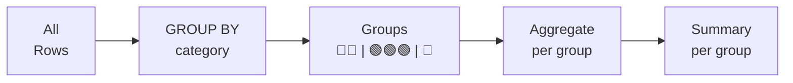

# Lesson 5: GROUP BY and HAVING

In Lesson 4, we summarized entire datasets with COUNT, SUM, AVG, etc. But what if you want to aggregate by group, like "customer count by grade" or "revenue by month"? Use GROUP BY.

!!! note "Already familiar?"
    If you already know GROUP BY, multi-column grouping, and HAVING, skip ahead to [Lesson 6: Handling NULL](06-null.md).



> **Concept:** GROUP BY groups rows together and applies aggregate functions to each group.

## GROUP BY -- Single Column

```sql
-- Customer count by membership grade
SELECT
    grade,
    COUNT(*) AS customer_count
FROM customers
GROUP BY grade;
```

**Result:**

| grade | customer_count |
| ---------- | ----------: |
| BRONZE | 38150 |
| GOLD | 5159 |
| SILVER | 5105 |
| VIP | 3886 |

The database gathers rows with the same `grade` value into a single bucket, then counts the rows in each bucket.

```sql
-- Order count and revenue total by order status
SELECT
    status,
    COUNT(*)           AS order_count,
    SUM(total_amount)  AS total_revenue
FROM orders
GROUP BY status
ORDER BY total_revenue DESC;
```

**Result:**

| status | order_count | total_revenue |
| ---------- | ----------: | ----------: |
| confirmed | 382081 | 392629443801.0 |
| cancelled | 21018 | 22079238470.0 |
| return_requested | 6125 | 8839120776.0 |
| returned | 6071 | 8750957343.0 |
| delivered | 1029 | 1119935047.0 |
| pending | 706 | 741807866.0 |
| shipped | 453 | 518561734.0 |
| preparing | 153 | 170900996.0 |
| ... | ... | ... |

## GROUP BY -- Multiple Columns

Grouping by two or more columns allows for more granular breakdowns.

```sql
-- Customer count by grade and gender
SELECT
    grade,
    gender,
    COUNT(*) AS cnt
FROM customers
WHERE gender IS NOT NULL
GROUP BY grade, gender
ORDER BY grade, gender;
```

**Result:**

| grade | gender | cnt |
| ---------- | ---------- | ----------: |
| BRONZE | F | 12614 |
| BRONZE | M | 21359 |
| GOLD | F | 1433 |
| GOLD | M | 3316 |
| SILVER | F | 1491 |
| SILVER | M | 3171 |
| VIP | F | 940 |
| VIP | M | 2744 |
| ... | ... | ... |

## Monthly Order Aggregation

By extracting the year-month from a date column, you can group by month.

=== "SQLite"
    ```sql
    -- Monthly order count and revenue for 2024
    SELECT
        SUBSTR(ordered_at, 1, 7) AS year_month,
        COUNT(*)                 AS order_count,
        SUM(total_amount)        AS monthly_revenue
    FROM orders
    WHERE ordered_at LIKE '2024%'
    GROUP BY SUBSTR(ordered_at, 1, 7)
    ORDER BY year_month;
    ```

=== "MySQL"
    ```sql
    -- Monthly order count and revenue for 2024
    SELECT
        DATE_FORMAT(ordered_at, '%Y-%m') AS year_month,
        COUNT(*)                         AS order_count,
        SUM(total_amount)                AS monthly_revenue
    FROM orders
    WHERE ordered_at >= '2024-01-01'
      AND ordered_at <  '2025-01-01'
    GROUP BY DATE_FORMAT(ordered_at, '%Y-%m')
    ORDER BY year_month;
    ```

=== "PostgreSQL"
    ```sql
    -- Monthly order count and revenue for 2024
    SELECT
        TO_CHAR(ordered_at, 'YYYY-MM') AS year_month,
        COUNT(*)                       AS order_count,
        SUM(total_amount)              AS monthly_revenue
    FROM orders
    WHERE ordered_at >= '2024-01-01'
      AND ordered_at <  '2025-01-01'
    GROUP BY TO_CHAR(ordered_at, 'YYYY-MM')
    ORDER BY year_month;
    ```

**Result:**

| year_month | order_count | monthly_revenue |
|------------|------------:|----------------:|
| 2024-01 | 312 | 178432.50 |
| 2024-02 | 289 | 162890.20 |
| 2024-03 | 405 | 238741.90 |
| ... | | |

## HAVING

`HAVING` filters after grouping and uses aggregate values as conditions. Think of it as `WHERE` for groups.

```sql
-- Only show grades with more than 500 customers
SELECT
    grade,
    COUNT(*) AS customer_count
FROM customers
GROUP BY grade
HAVING COUNT(*) > 500;
```

**Result:**

| grade | customer_count |
| ---------- | ----------: |
| BRONZE | 38150 |
| GOLD | 5159 |
| SILVER | 5105 |
| VIP | 3886 |

```sql
-- Categories with 10+ active products and average price over $100
SELECT
    category_id,
    COUNT(*)   AS product_count,
    AVG(price) AS avg_price
FROM products
WHERE is_active = 1
GROUP BY category_id
HAVING COUNT(*) >= 10
   AND AVG(price) > 100
ORDER BY avg_price DESC;
```

**Result:**

| category_id | product_count | avg_price |
| ----------: | ----------: | ----------: |
| 9 | 21 | 3292633.3333333335 |
| 7 | 99 | 2966560.606060606 |
| 28 | 46 | 2429036.9565217393 |
| 3 | 46 | 2210358.695652174 |
| 6 | 83 | 1739673.4939759036 |
| 8 | 45 | 1565324.4444444445 |
| 2 | 74 | 1504925.6756756757 |
| 13 | 49 | 1328097.9591836734 |
| ... | ... | ... |

## WHERE vs. HAVING

| Clause | Filters | Applied when |
|--------|---------|--------------|
| `WHERE` | Individual rows | Before grouping |
| `HAVING` | Groups | After grouping |

```sql
-- WHERE filters rows first, then HAVING filters groups
SELECT
    grade,
    AVG(point_balance) AS avg_points
FROM customers
WHERE is_active = 1          -- Exclude inactive customers (row level)
GROUP BY grade
HAVING AVG(point_balance) > 500;  -- Only grades with average points over 500
```

## Summary

| Syntax | Description | Example |
|--------|-------------|---------|
| `GROUP BY column` | Group by a single column | `GROUP BY grade` |
| `GROUP BY col1, col2` | Subdivide by multiple columns | `GROUP BY grade, gender` |
| `HAVING condition` | Filter after grouping (based on aggregate values) | `HAVING COUNT(*) > 500` |
| `WHERE` vs `HAVING` | WHERE filters rows (before grouping), HAVING filters groups (after grouping) | |

!!! note "Lesson Review Problems"
    These are simple problems to immediately check the concepts learned in this lesson. For comprehensive practice combining multiple concepts, see the [Practice Problems](../exercises/index.md) section.

## Practice Problems

### Problem 1
Aggregate the order count by `status`. Show only statuses with more than 1,000 orders, sorted by count descending.

??? success "Answer"
    ```sql
    SELECT
        status,
        COUNT(*) AS order_count
    FROM orders
    GROUP BY status
    HAVING COUNT(*) > 1000
    ORDER BY order_count DESC;
    ```

    **Result (example):**

| status | order_count |
| ---------- | ----------: |
| confirmed | 382081 |
| cancelled | 21018 |
| return_requested | 6125 |
| returned | 6071 |
| delivered | 1029 |
| ... | ... |


### Problem 2
From the `payments` table, find the total collected amount and transaction count by payment method (`method`). Sort by total amount descending.

??? success "Answer"
    ```sql
    SELECT
        method,
        COUNT(*)       AS transaction_count,
        SUM(amount)    AS total_collected
    FROM payments
    WHERE status = 'completed'
    GROUP BY method
    ORDER BY total_collected DESC;
    ```

    **Result (example):**

| method | transaction_count | total_collected |
| ---------- | ----------: | ----------: |
| card | 172644 | 177755027447.0 |
| kakao_pay | 76533 | 78373726984.0 |
| naver_pay | 57725 | 59384559811.0 |
| bank_transfer | 38667 | 39692289969.0 |
| point | 19247 | 19966562723.0 |
| virtual_account | 19067 | 19421780753.0 |
| ... | ... | ... |


### Problem 3
From the `customers` table, find the average `point_balance` by `grade`. Sort by average points descending.

??? success "Answer"
    ```sql
    SELECT
        grade,
        AVG(point_balance) AS avg_points
    FROM customers
    GROUP BY grade
    ORDER BY avg_points DESC;
    ```

    **Result (example):**

| grade | avg_points |
| ---------- | ----------: |
| VIP | 437736.85666495113 |
| GOLD | 166187.96743554954 |
| SILVER | 104672.13143976494 |
| BRONZE | 19601.960419397117 |


### Problem 4
Group by both `grade` and `gender` from the `customers` table and count customers. Include rows where `gender` is NULL.

??? success "Answer"
    ```sql
    SELECT
        grade,
        gender,
        COUNT(*) AS customer_count
    FROM customers
    GROUP BY grade, gender
    ORDER BY grade, gender;
    ```

    **Result (example):**

| grade | gender | customer_count |
| ---------- | ---------- | ----------: |
| BRONZE | (NULL) | 4177 |
| BRONZE | F | 12614 |
| BRONZE | M | 21359 |
| GOLD | (NULL) | 410 |
| GOLD | F | 1433 |
| GOLD | M | 3316 |
| SILVER | (NULL) | 443 |
| SILVER | F | 1491 |
| ... | ... | ... |


### Problem 5
From the `reviews` table, find the review count by `rating`. Show only ratings with 100 or more reviews, sorted by `rating`.

??? success "Answer"
    ```sql
    SELECT
        rating,
        COUNT(*) AS review_count
    FROM reviews
    GROUP BY rating
    HAVING COUNT(*) >= 100
    ORDER BY rating;
    ```

    **Result (example):**

| rating | review_count |
| ----------: | ----------: |
| 1 | 4762 |
| 2 | 9512 |
| 3 | 14391 |
| 4 | 28232 |
| 5 | 38460 |
| ... | ... |


### Problem 6
From the `orders` table, considering only active orders (`status NOT IN ('cancelled', 'returned')`), find the count and average amount (0 decimal places) by `status`. Show only statuses where the average amount exceeds 300.

??? success "Answer"
    ```sql
    SELECT
        status,
        COUNT(*)                    AS order_count,
        ROUND(AVG(total_amount), 0) AS avg_amount
    FROM orders
    WHERE status NOT IN ('cancelled', 'returned')
    GROUP BY status
    HAVING AVG(total_amount) > 300
    ORDER BY avg_amount DESC;
    ```

    **Result (example):**

| status | order_count | avg_amount |
| ---------- | ----------: | ----------: |
| return_requested | 6125 | 1443122.0 |
| shipped | 453 | 1144728.0 |
| preparing | 153 | 1117000.0 |
| delivered | 1029 | 1088372.0 |
| pending | 706 | 1050719.0 |
| confirmed | 382081 | 1027608.0 |
| paid | 167 | 928779.0 |
| ... | ... | ... |


### Problem 7
From the 2023-2024 `orders` data, find months where monthly revenue exceeded $500,000. Return `year_month` and `monthly_revenue` sorted by date.

??? success "Answer"
    === "SQLite"
        ```sql
        SELECT
            SUBSTR(ordered_at, 1, 7) AS year_month,
            SUM(total_amount)        AS monthly_revenue
        FROM orders
        WHERE ordered_at BETWEEN '2023-01-01' AND '2024-12-31 23:59:59'
          AND status NOT IN ('cancelled', 'returned')
        GROUP BY SUBSTR(ordered_at, 1, 7)
        HAVING SUM(total_amount) > 500000
        ORDER BY year_month;
        ```

        **Result (example):**

| year_month | monthly_revenue |
| ---------- | ----------: |
| 2023-01 | 3271703186.0 |
| 2023-02 | 3915639006.0 |
| 2023-03 | 4939077954.0 |
| 2023-04 | 4797530375.0 |
| 2023-05 | 4115530865.0 |
| 2023-06 | 3520005441.0 |
| 2023-07 | 3257340549.0 |
| 2023-08 | 4354477595.0 |
| ... | ... |


    === "MySQL"
        ```sql
        SELECT
            DATE_FORMAT(ordered_at, '%Y-%m') AS year_month,
            SUM(total_amount)                AS monthly_revenue
        FROM orders
        WHERE ordered_at >= '2023-01-01'
          AND ordered_at <  '2025-01-01'
          AND status NOT IN ('cancelled', 'returned')
        GROUP BY DATE_FORMAT(ordered_at, '%Y-%m')
        HAVING SUM(total_amount) > 500000
        ORDER BY year_month;
        ```

    === "PostgreSQL"
        ```sql
        SELECT
            TO_CHAR(ordered_at, 'YYYY-MM') AS year_month,
            SUM(total_amount)              AS monthly_revenue
        FROM orders
        WHERE ordered_at >= '2023-01-01'
          AND ordered_at <  '2025-01-01'
          AND status NOT IN ('cancelled', 'returned')
        GROUP BY TO_CHAR(ordered_at, 'YYYY-MM')
        HAVING SUM(total_amount) > 500000
        ORDER BY year_month;
        ```

### Problem 8
From the `payments` table, find the number of unique orders per payment method using `COUNT(DISTINCT order_id)`. Sort by unique order count descending.

??? success "Answer"
    ```sql
    SELECT
        method,
        COUNT(DISTINCT order_id) AS unique_orders
    FROM payments
    GROUP BY method
    ORDER BY unique_orders DESC;
    ```

    **Result (example):**

| method | unique_orders |
| ---------- | ----------: |
| card | 187835 |
| kakao_pay | 83308 |
| naver_pay | 62837 |
| bank_transfer | 42062 |
| point | 20975 |
| virtual_account | 20786 |
| ... | ... |


### Problem 9
From the `orders` table, find the order count and total revenue by year. Exclude cancelled/returned orders.

??? success "Answer"
    === "SQLite"
        ```sql
        SELECT
            SUBSTR(ordered_at, 1, 4) AS order_year,
            COUNT(*)                 AS order_count,
            SUM(total_amount)        AS yearly_revenue
        FROM orders
        WHERE status NOT IN ('cancelled', 'returned')
        GROUP BY SUBSTR(ordered_at, 1, 4)
        ORDER BY order_year;
        ```

        **Result (example):**

| order_year | order_count | yearly_revenue |
| ---------- | ----------: | ----------: |
| 2016 | 7002 | 7186536080.0 |
| 2017 | 10710 | 11188959996.0 |
| 2018 | 19356 | 20309091899.0 |
| 2019 | 26981 | 28328279035.0 |
| 2020 | 43749 | 45447183212.0 |
| 2021 | 56519 | 58065333224.0 |
| 2022 | 55414 | 57233324746.0 |
| 2023 | 47910 | 49710423204.0 |
| ... | ... | ... |


    === "MySQL"
        ```sql
        SELECT
            YEAR(ordered_at)  AS order_year,
            COUNT(*)          AS order_count,
            SUM(total_amount) AS yearly_revenue
        FROM orders
        WHERE status NOT IN ('cancelled', 'returned')
        GROUP BY YEAR(ordered_at)
        ORDER BY order_year;
        ```

    === "PostgreSQL"
        ```sql
        SELECT
            EXTRACT(YEAR FROM ordered_at)::int AS order_year,
            COUNT(*)                           AS order_count,
            SUM(total_amount)                  AS yearly_revenue
        FROM orders
        WHERE status NOT IN ('cancelled', 'returned')
        GROUP BY EXTRACT(YEAR FROM ordered_at)
        ORDER BY order_year;
        ```

### Problem 10
From the `products` table, find the product count, average price (0 decimal places), and total stock (`stock_qty` sum) by `category_id`. Show only categories with 5 or more products and an average price of 50 or higher, sorted by product count descending.

??? success "Answer"
    ```sql
    SELECT
        category_id,
        COUNT(*)                 AS product_count,
        ROUND(AVG(price), 0)     AS avg_price,
        SUM(stock_qty)           AS total_stock
    FROM products
    GROUP BY category_id
    HAVING COUNT(*) >= 5
       AND AVG(price) >= 50
    ORDER BY product_count DESC;
    ```

    **Result (example):**

| category_id | product_count | avg_price | total_stock |
| ----------: | ----------: | ----------: | ----------: |
| 43 | 135 | 248917.0 | 31088 |
| 30 | 120 | 203971.0 | 29632 |
| 31 | 116 | 161962.0 | 25661 |
| 6 | 115 | 1730655.0 | 28946 |
| 42 | 115 | 120864.0 | 29387 |
| 7 | 113 | 2930866.0 | 29777 |
| 36 | 112 | 176021.0 | 30221 |
| 44 | 104 | 390027.0 | 27069 |
| ... | ... | ... | ... |


### Scoring Guide

| Score | Next Step |
|:-----:|-----------|
| **9-10** | Move to [Lesson 6: Handling NULL](06-null.md) |
| **7-8** | Review the explanations for incorrect answers, then proceed to Lesson 6 |
| **5 or fewer** | Read this lesson again |
| **3 or fewer** | Start over from [Lesson 4: Aggregate Functions](04-aggregates.md) |

**Problem Areas:**

| Area | Problems |
|------|:--------:|
| GROUP BY + HAVING | 1, 5 |
| GROUP BY single column | 2, 3 |
| GROUP BY multiple columns | 4 |
| WHERE + GROUP BY + HAVING | 6 |
| GROUP BY + HAVING (date filter) | 7 |
| COUNT(DISTINCT) | 8 |
| GROUP BY (date function) + WHERE | 9 |
| HAVING multiple conditions | 10 |

---
Next: [Lesson 6: Handling NULL](06-null.md)
