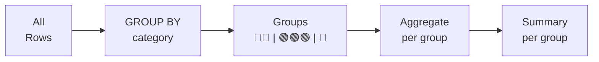

# Lesson 5: GROUP BY and HAVING

`GROUP BY` divides rows into groups and applies aggregate functions to each group separately. `HAVING` then filters those groups — it is the `WHERE` for aggregated results.



> **Concept:** GROUP BY groups rows together, then applies aggregates to each group.

## GROUP BY — Single Column

```sql
-- How many customers in each membership grade?
SELECT
    grade,
    COUNT(*) AS customer_count
FROM customers
GROUP BY grade;
```

**Result:**

| grade | customer_count |
|-------|---------------:|
| BRONZE | 2614 |
| SILVER | 1569 |
| GOLD | 785 |
| VIP | 262 |

The database collects all rows that share the same `grade` value into a bucket, then counts the rows in each bucket.

```sql
-- Total revenue by order status
SELECT
    status,
    COUNT(*)           AS order_count,
    SUM(total_amount)  AS total_revenue
FROM orders
GROUP BY status
ORDER BY total_revenue DESC;
```

**Result:**

| status | order_count | total_revenue |
|--------|------------:|--------------:|
| confirmed | 8423 | 7291847.20 |
| delivered | 6812 | 5904329.10 |
| shipped | 4103 | 3287650.88 |
| cancelled | 3891 | 0.00 |
| ... | | |

## GROUP BY — Multiple Columns

Group by two or more columns to create finer-grained segments.

```sql
-- Count customers by grade AND gender
SELECT
    grade,
    gender,
    COUNT(*) AS cnt
FROM customers
WHERE gender IS NOT NULL
GROUP BY grade, gender
ORDER BY grade, gender;
```

**Result:**

| grade | gender | cnt |
|-------|--------|----:|
| BRONZE | F | 922 |
| BRONZE | M | 1580 |
| GOLD | F | 271 |
| GOLD | M | 494 |
| SILVER | F | 543 |
| SILVER | M | 990 |
| VIP | F | 91 |
| VIP | M | 163 |

## Monthly Order Counts

Extract the year-month from a date column to group by month.

=== "SQLite"
    ```sql
    -- Monthly order count for 2024
    SELECT
        SUBSTR(ordered_at, 1, 7) AS year_month,
        COUNT(*)                 AS order_count,
        SUM(total_amount)        AS monthly_revenue
    FROM orders
    WHERE ordered_at LIKE '2024%'
    GROUP BY SUBSTR(ordered_at, 1, 7)
    ORDER BY year_month;
    ```

=== "MySQL"
    ```sql
    -- Monthly order count for 2024
    SELECT
        DATE_FORMAT(ordered_at, '%Y-%m') AS year_month,
        COUNT(*)                         AS order_count,
        SUM(total_amount)                AS monthly_revenue
    FROM orders
    WHERE ordered_at >= '2024-01-01'
      AND ordered_at <  '2025-01-01'
    GROUP BY DATE_FORMAT(ordered_at, '%Y-%m')
    ORDER BY year_month;
    ```

=== "PostgreSQL"
    ```sql
    -- Monthly order count for 2024
    SELECT
        TO_CHAR(ordered_at, 'YYYY-MM') AS year_month,
        COUNT(*)                       AS order_count,
        SUM(total_amount)              AS monthly_revenue
    FROM orders
    WHERE ordered_at >= '2024-01-01'
      AND ordered_at <  '2025-01-01'
    GROUP BY TO_CHAR(ordered_at, 'YYYY-MM')
    ORDER BY year_month;
    ```

**Result:**

| year_month | order_count | monthly_revenue |
|------------|------------:|----------------:|
| 2024-01 | 312 | 178432.50 |
| 2024-02 | 289 | 162890.20 |
| 2024-03 | 405 | 238741.90 |
| ... | | |

## HAVING

`HAVING` filters after grouping, operating on aggregate values. Think of it as `WHERE` for groups.

```sql
-- Grades with more than 500 customers
SELECT
    grade,
    COUNT(*) AS customer_count
FROM customers
GROUP BY grade
HAVING COUNT(*) > 500;
```

**Result:**

| grade | customer_count |
|-------|---------------:|
| BRONZE | 2614 |
| SILVER | 1569 |

```sql
-- Categories with at least 10 active products and avg price over $100
SELECT
    category_id,
    COUNT(*)   AS product_count,
    AVG(price) AS avg_price
FROM products
WHERE is_active = 1
GROUP BY category_id
HAVING COUNT(*) >= 10
   AND AVG(price) > 100
ORDER BY avg_price DESC;
```

**Result:**

| category_id | product_count | avg_price |
|------------:|--------------:|----------:|
| 3 | 22 | 987.45 |
| 5 | 18 | 412.30 |
| 2 | 15 | 248.90 |
| ... | | |

## WHERE vs. HAVING

| Clause | Filters | Timing |
|--------|---------|--------|
| `WHERE` | Individual rows | Before grouping |
| `HAVING` | Groups | After grouping |

```sql
-- WHERE filters rows first, HAVING filters groups after
SELECT
    grade,
    AVG(point_balance) AS avg_points
FROM customers
WHERE is_active = 1          -- exclude inactive customers (row-level)
GROUP BY grade
HAVING AVG(point_balance) > 500;  -- only grades where avg points > 500
```

!!! note "Lesson Review"
    Quick exercises to check your understanding of this lesson. For comprehensive practice combining multiple concepts, see the [Exercises](../exercises/index.md) section.

## Practice Exercises

### Exercise 1
Count the number of orders for each `status` value. Show only statuses that have more than 1,000 orders, ordered by count descending.

??? success "Answer"
    ```sql
    SELECT
        status,
        COUNT(*) AS order_count
    FROM orders
    GROUP BY status
    HAVING COUNT(*) > 1000
    ORDER BY order_count DESC;
    ```

### Exercise 2
For each `method` in the `payments` table, calculate the total `amount` collected and the number of transactions. Order by total amount descending.

??? success "Answer"
    ```sql
    SELECT
        method,
        COUNT(*)       AS transaction_count,
        SUM(amount)    AS total_collected
    FROM payments
    WHERE status = 'completed'
    GROUP BY method
    ORDER BY total_collected DESC;
    ```

### Exercise 3
Calculate the average `point_balance` for each `grade` in the `customers` table. Sort by average points descending.

??? success "Answer"
    ```sql
    SELECT
        grade,
        AVG(point_balance) AS avg_points
    FROM customers
    GROUP BY grade
    ORDER BY avg_points DESC;
    ```

### Exercise 4
Group customers by both `grade` and `gender`, and count the number of customers in each combination. Include rows where `gender` is NULL.

??? success "Answer"
    ```sql
    SELECT
        grade,
        gender,
        COUNT(*) AS customer_count
    FROM customers
    GROUP BY grade, gender
    ORDER BY grade, gender;
    ```

### Exercise 5
Count the number of reviews for each `rating` value in the `reviews` table. Show only ratings that have 100 or more reviews. Sort by `rating`.

??? success "Answer"
    ```sql
    SELECT
        rating,
        COUNT(*) AS review_count
    FROM reviews
    GROUP BY rating
    HAVING COUNT(*) >= 100
    ORDER BY rating;
    ```

### Exercise 6
For active orders only (`status NOT IN ('cancelled', 'returned')`), find the count and average amount (rounded to 0 decimals) per `status`. Show only statuses where the average amount exceeds 300.

??? success "Answer"
    ```sql
    SELECT
        status,
        COUNT(*)                    AS order_count,
        ROUND(AVG(total_amount), 0) AS avg_amount
    FROM orders
    WHERE status NOT IN ('cancelled', 'returned')
    GROUP BY status
    HAVING AVG(total_amount) > 300
    ORDER BY avg_amount DESC;
    ```

### Exercise 7
Find all months (from the `orders` table) in 2023 and 2024 where monthly revenue exceeded $500,000. Return `year_month` and `monthly_revenue`, sorted chronologically.

??? success "Answer"
    === "SQLite"
        ```sql
        SELECT
            SUBSTR(ordered_at, 1, 7) AS year_month,
            SUM(total_amount)        AS monthly_revenue
        FROM orders
        WHERE ordered_at BETWEEN '2023-01-01' AND '2024-12-31 23:59:59'
          AND status NOT IN ('cancelled', 'returned')
        GROUP BY SUBSTR(ordered_at, 1, 7)
        HAVING SUM(total_amount) > 500000
        ORDER BY year_month;
        ```

    === "MySQL"
        ```sql
        SELECT
            DATE_FORMAT(ordered_at, '%Y-%m') AS year_month,
            SUM(total_amount)                AS monthly_revenue
        FROM orders
        WHERE ordered_at >= '2023-01-01'
          AND ordered_at <  '2025-01-01'
          AND status NOT IN ('cancelled', 'returned')
        GROUP BY DATE_FORMAT(ordered_at, '%Y-%m')
        HAVING SUM(total_amount) > 500000
        ORDER BY year_month;
        ```

    === "PostgreSQL"
        ```sql
        SELECT
            TO_CHAR(ordered_at, 'YYYY-MM') AS year_month,
            SUM(total_amount)              AS monthly_revenue
        FROM orders
        WHERE ordered_at >= '2023-01-01'
          AND ordered_at <  '2025-01-01'
          AND status NOT IN ('cancelled', 'returned')
        GROUP BY TO_CHAR(ordered_at, 'YYYY-MM')
        HAVING SUM(total_amount) > 500000
        ORDER BY year_month;
        ```

### Exercise 8
Find the number of unique orders per payment `method` in the `payments` table using `COUNT(DISTINCT order_id)`. Sort by unique order count descending.

??? success "Answer"
    ```sql
    SELECT
        method,
        COUNT(DISTINCT order_id) AS unique_orders
    FROM payments
    GROUP BY method
    ORDER BY unique_orders DESC;
    ```

### Exercise 9
Calculate yearly order count and total revenue from the `orders` table. Exclude cancelled and returned orders.

??? success "Answer"
    === "SQLite"
        ```sql
        SELECT
            SUBSTR(ordered_at, 1, 4) AS order_year,
            COUNT(*)                 AS order_count,
            SUM(total_amount)        AS yearly_revenue
        FROM orders
        WHERE status NOT IN ('cancelled', 'returned')
        GROUP BY SUBSTR(ordered_at, 1, 4)
        ORDER BY order_year;
        ```

    === "MySQL"
        ```sql
        SELECT
            YEAR(ordered_at)  AS order_year,
            COUNT(*)          AS order_count,
            SUM(total_amount) AS yearly_revenue
        FROM orders
        WHERE status NOT IN ('cancelled', 'returned')
        GROUP BY YEAR(ordered_at)
        ORDER BY order_year;
        ```

    === "PostgreSQL"
        ```sql
        SELECT
            EXTRACT(YEAR FROM ordered_at)::int AS order_year,
            COUNT(*)                           AS order_count,
            SUM(total_amount)                  AS yearly_revenue
        FROM orders
        WHERE status NOT IN ('cancelled', 'returned')
        GROUP BY EXTRACT(YEAR FROM ordered_at)
        ORDER BY order_year;
        ```

### Exercise 10
For each `category_id` in the `products` table, find the product count, average price (0 decimals), and total stock (`stock_qty` sum). Show only categories with 5 or more products and average price of at least 50. Sort by product count descending.

??? success "Answer"
    ```sql
    SELECT
        category_id,
        COUNT(*)                 AS product_count,
        ROUND(AVG(price), 0)     AS avg_price,
        SUM(stock_qty)           AS total_stock
    FROM products
    GROUP BY category_id
    HAVING COUNT(*) >= 5
       AND AVG(price) >= 50
    ORDER BY product_count DESC;
    ```

---
Next: [Lesson 6: Working with NULL](06-null.md)
