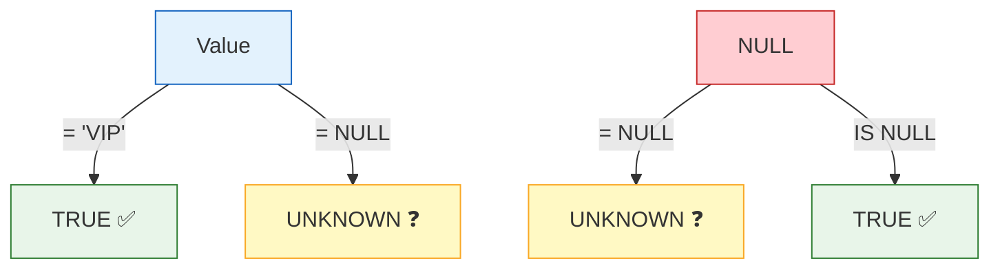

# Lesson 6: Working with NULL

`NULL` represents an unknown or missing value. It is not zero, not an empty string — it is the absence of a value. Understanding NULL is critical because it behaves differently from every other value in SQL.



> **Concept:** NULL means 'no value'. = NULL always returns UNKNOWN, so use IS NULL instead.

## NULL is Not Equal to Anything

You cannot compare NULL with `=` or `<>`. These comparisons always return `NULL` (unknown), never `TRUE`.

```sql
-- WRONG: this returns no rows!
SELECT name FROM customers WHERE birth_date = NULL;

-- CORRECT: use IS NULL
SELECT name FROM customers WHERE birth_date IS NULL;
```

```sql
-- Customers whose gender is known
SELECT name, gender
FROM customers
WHERE gender IS NOT NULL
LIMIT 5;
```

**Result:**

| name | gender |
|------|--------|
| Jennifer Martinez | F |
| Robert Kim | M |
| Sarah Johnson | F |
| David Park | M |
| ... | |

## IS NULL and IS NOT NULL

```sql
-- Orders without delivery notes
SELECT order_number, total_amount
FROM orders
WHERE notes IS NULL
LIMIT 5;
```

**Result:**

| order_number | total_amount |
|--------------|--------------|
| ORD-20150314-00001 | 249.98 |
| ORD-20150314-00002 | 1399.99 |
| ORD-20150315-00003 | 59.99 |
| ... | |

```sql
-- Orders that were NOT handled by any staff member
SELECT order_number, status
FROM orders
WHERE staff_id IS NULL
  AND status IN ('return_requested', 'returned', 'complaints')
LIMIT 5;
```

## COALESCE

`COALESCE(a, b, c, ...)` returns the first non-NULL argument. It is the standard way to substitute a default value for NULL.

```sql
-- Show gender or 'Not Specified' when gender is NULL
SELECT
    name,
    COALESCE(gender, 'Not Specified') AS gender_display
FROM customers
LIMIT 8;
```

**Result:**

| name | gender_display |
|------|----------------|
| Jennifer Martinez | F |
| Alex Chen | Not Specified |
| Robert Kim | M |
| Maria Santos | Not Specified |
| Sarah Johnson | F |
| ... | |

```sql
-- Use notes or a default message
SELECT
    order_number,
    COALESCE(notes, 'No special instructions') AS delivery_note
FROM orders
LIMIT 5;
```

**Result:**

| order_number | delivery_note |
|--------------|---------------|
| ORD-20150314-00001 | No special instructions |
| ORD-20150314-00002 | Leave at front door |
| ORD-20150315-00003 | No special instructions |
| ... | |

## NULLIF

`NULLIF(a, b)` returns NULL when `a` equals `b`, otherwise returns `a`. It is often used to avoid division-by-zero errors.

```sql
-- Safe percentage: avoid division by zero
SELECT
    grade,
    COUNT(*) AS total,
    COUNT(CASE WHEN is_active = 0 THEN 1 END) AS inactive,
    ROUND(
        100.0 * COUNT(CASE WHEN is_active = 0 THEN 1 END)
              / NULLIF(COUNT(*), 0),
        1
    ) AS pct_inactive
FROM customers
GROUP BY grade;
```

**Result:**

| grade | total | inactive | pct_inactive |
|-------|-------|----------|--------------|
| BRONZE | 2614 | 182 | 7.0 |
| SILVER | 1569 | 94 | 6.0 |
| GOLD | 785 | 31 | 3.9 |
| VIP | 262 | 7 | 2.7 |

## NULL in Aggregates

Aggregate functions (`SUM`, `AVG`, `COUNT(column)`, `MIN`, `MAX`) silently ignore NULL values. This can cause surprises.

```sql
-- Comparing COUNT(*) vs COUNT(birth_date)
SELECT
    COUNT(*)           AS all_customers,
    COUNT(birth_date)  AS customers_with_dob,
    AVG(
        CAST(SUBSTR(birth_date, 1, 4) AS INTEGER)
    )                  AS avg_birth_year
FROM customers;
```

**Result:**

| all_customers | customers_with_dob | avg_birth_year |
|---------------|--------------------|----------------|
| 5230 | 4445 | 1982.3 |

> The `AVG` is calculated only over the 4,445 rows that have a birth date — the 785 NULLs are excluded automatically.

## NULL in Expressions

Any arithmetic involving NULL produces NULL.

```sql
-- NULL propagates through math
SELECT
    1 + NULL,       -- NULL
    NULL * 100,     -- NULL
    'hello' || NULL -- NULL (string concatenation too)
```

Use `COALESCE` to guard against this:

```sql
-- Calculate age in years, treating NULL birth_date as unknown
SELECT
    name,
    birth_date,
    COALESCE(
        CAST((julianday('now') - julianday(birth_date)) / 365.25 AS INTEGER),
        -1
    ) AS age_years
FROM customers
LIMIT 5;
```

!!! note "Lesson Review"
    Quick exercises to check your understanding of this lesson. For comprehensive practice combining multiple concepts, see the [Exercises](../exercises/) section.

## Practice Exercises

### Exercise 1
Count how many customers are missing a birth date, have no recorded gender, and have never logged in. Show separate counts for each condition plus the total customer count.

??? success "Answer"
    ```sql
    SELECT
        COUNT(*)                                         AS total_customers,
        COUNT(*) - COUNT(birth_date)                    AS missing_birth_date,
        COUNT(*) - COUNT(gender)                        AS missing_gender,
        SUM(CASE WHEN last_login_at IS NULL THEN 1 ELSE 0 END) AS never_logged_in
    FROM customers;
    ```

### Exercise 2
List all orders where `staff_id IS NULL` (no customer service rep assigned). For each order show `order_number`, `status`, and the notes — but replace NULL notes with the text `'—'`.

??? success "Answer"
    ```sql
    SELECT
        order_number,
        status,
        COALESCE(notes, '—') AS notes
    FROM orders
    WHERE staff_id IS NULL
    ORDER BY ordered_at DESC
    LIMIT 20;
    ```

### Exercise 3
For each membership `grade`, show how many customers have a known gender vs. an unknown gender. Use `COALESCE(gender, 'Unknown')` as the grouping column.

??? success "Answer"
    ```sql
    SELECT
        grade,
        COALESCE(gender, 'Unknown') AS gender_status,
        COUNT(*) AS customer_count
    FROM customers
    GROUP BY grade, COALESCE(gender, 'Unknown')
    ORDER BY grade, gender_status;
    ```

---
Next: [Lesson 7: INNER JOIN](../intermediate/07-inner-join.md)
