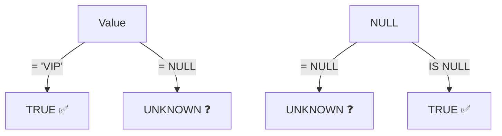
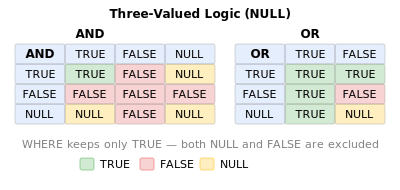

# Lesson 6: Handling NULL

In Lesson 0, we briefly introduced NULL -- it means "no value." In this lesson, we learn how NULL behaves specially in SQL and how to handle it safely.

!!! note "Already familiar?"
    If you already know IS NULL, COALESCE, NULLIF, and NULL propagation, skip ahead to [Lesson 7: CASE Expressions](07-case.md).



> **Concept:** NULL is "no value." = NULL always returns UNKNOWN, so you must use IS NULL.

## NULL Is Not Equal to Anything

You cannot compare NULL with `=` or `<>`. Such comparisons always return `NULL` (unknown) and never become `TRUE`.

```sql
-- Wrong: returns no rows!
SELECT name FROM customers WHERE birth_date = NULL;

-- Correct: use IS NULL
SELECT name FROM customers WHERE birth_date IS NULL;
```

```sql
-- Retrieve customers with confirmed gender
SELECT name, gender
FROM customers
WHERE gender IS NOT NULL
LIMIT 5;
```

**Result:**

| name | gender |
| ---------- | ---------- |
| Joshua Atkins | M |
| Adam Moore | M |
| Virginia Steele | F |
| Jared Vazquez | M |
| Benjamin Skinner | M |
| ... | ... |

## IS NULL and IS NOT NULL

```sql
-- Orders without shipping notes
SELECT order_number, total_amount
FROM orders
WHERE notes IS NULL
LIMIT 5;
```

**Result:**

| order_number | total_amount |
| ---------- | ----------: |
| ORD-20160101-00001 | 167000.0 |
| ORD-20160102-00003 | 704800.0 |
| ORD-20160103-00004 | 167000.0 |
| ORD-20160105-00008 | 916600.0 |
| ORD-20160106-00009 | 167000.0 |
| ... | ... |

```sql
-- Return/complaint orders without an assigned staff member
SELECT order_number, status
FROM orders
WHERE staff_id IS NULL
  AND status IN ('return_requested', 'returned', 'complaints')
LIMIT 5;
```

## COALESCE

`COALESCE(a, b, c, ...)` returns the first non-NULL argument. It is the most widely used method for displaying a default value instead of NULL.

```sql
-- Display 'Not provided' when gender is NULL
SELECT
    name,
    COALESCE(gender, 'Not provided') AS gender_display
FROM customers
LIMIT 8;
```

**Result:**

| name | gender_display |
| ---------- | ---------- |
| Joshua Atkins | M |
| Danny Johnson | Not provided |
| Adam Moore | M |
| Virginia Steele | F |
| Jared Vazquez | M |
| Benjamin Skinner | M |
| Ashley Jones | F |
| Tyler Rodriguez | F |
| ... | ... |

```sql
-- Display a default message when there are no shipping notes
SELECT
    order_number,
    COALESCE(notes, 'No special instructions') AS delivery_note
FROM orders
LIMIT 5;
```

**Result:**

| order_number | delivery_note |
| ---------- | ---------- |
| ORD-20160101-00001 | No special instructions |
| ORD-20160102-00002 | Deliver to the office front desk |
| ORD-20160102-00003 | No special instructions |
| ORD-20160103-00004 | No special instructions |
| ORD-20160103-00005 | Do not ring the bell (baby sleeping) |
| ... | ... |

## NULLIF

`NULLIF(a, b)` returns NULL if `a` equals `b`, otherwise returns `a`. It is often used to prevent division by zero errors.

```sql
-- Prevent division by zero: safe ratio calculation
SELECT
    grade,
    COUNT(*) AS total,
    COUNT(CASE WHEN is_active = 0 THEN 1 END) AS inactive,
    ROUND(
        100.0 * COUNT(CASE WHEN is_active = 0 THEN 1 END)
              / NULLIF(COUNT(*), 0),
        1
    ) AS pct_inactive
FROM customers
GROUP BY grade;
```

**Result:**

| grade | total | inactive | pct_inactive |
| ---------- | ----------: | ----------: | ----------: |
| BRONZE | 3859 | 1570 | 40.7 |
| GOLD | 524 | 0 | 0.0 |
| SILVER | 479 | 0 | 0.0 |
| VIP | 368 | 0 | 0.0 |

## Aggregate Functions and NULL

Aggregate functions (`SUM`, `AVG`, `COUNT(column)`, `MIN`, `MAX`) silently ignore NULL values. Be careful, as this can produce unexpected results.

=== "SQLite"
    ```sql
    -- Compare COUNT(*) and COUNT(birth_date)
    SELECT
        COUNT(*)           AS all_customers,
        COUNT(birth_date)  AS customers_with_dob,
        AVG(
            CAST(SUBSTR(birth_date, 1, 4) AS INTEGER)
        )                  AS avg_birth_year
    FROM customers;
    ```

=== "MySQL"
    ```sql
    SELECT
        COUNT(*)           AS all_customers,
        COUNT(birth_date)  AS customers_with_dob,
        AVG(YEAR(birth_date)) AS avg_birth_year
    FROM customers;
    ```

=== "PostgreSQL"
    ```sql
    SELECT
        COUNT(*)           AS all_customers,
        COUNT(birth_date)  AS customers_with_dob,
        AVG(EXTRACT(YEAR FROM birth_date))::numeric(6,1) AS avg_birth_year
    FROM customers;
    ```

**Result:**

| all_customers | customers_with_dob | avg_birth_year |
|--------------:|-------------------:|---------------:|
| 5230 | 4445 | 1982.3 |

> `AVG` is calculated only for the 4,445 customers who have a birth date. The 785 with NULL are automatically excluded.

## NULL Propagation in Expressions

{ .off-glb width="400" }

Arithmetic operations involving NULL produce NULL as the result.

```sql
-- NULL propagates through operations
SELECT
    1 + NULL,       -- NULL
    NULL * 100,     -- NULL
    'hello' || NULL -- NULL (string concatenation too)
```

Use `COALESCE` to prevent NULL propagation.

=== "SQLite"
    ```sql
    -- If birth_date is NULL, treat age as -1
    SELECT
        name,
        birth_date,
        COALESCE(
            CAST((julianday('now') - julianday(birth_date)) / 365.25 AS INTEGER),
            -1
        ) AS age_years
    FROM customers
    LIMIT 5;
    ```

=== "MySQL"
    ```sql
    SELECT
        name,
        birth_date,
        COALESCE(
            TIMESTAMPDIFF(YEAR, birth_date, CURDATE()),
            -1
        ) AS age_years
    FROM customers
    LIMIT 5;
    ```

=== "PostgreSQL"
    ```sql
    SELECT
        name,
        birth_date,
        COALESCE(
            EXTRACT(YEAR FROM AGE(CURRENT_DATE, birth_date))::int,
            -1
        ) AS age_years
    FROM customers
    LIMIT 5;
    ```

## Summary

| Syntax | Description | Example |
|--------|-------------|---------|
| `IS NULL` | Check if a value is NULL | `WHERE birth_date IS NULL` |
| `IS NOT NULL` | Check if a value is not NULL | `WHERE gender IS NOT NULL` |
| `COALESCE(a, b, ...)` | Return the first non-NULL value | `COALESCE(gender, 'Not provided')` |
| `NULLIF(a, b)` | Return NULL if a = b (prevents division by zero) | `price / NULLIF(stock_qty, 0)` |
| Aggregates and NULL | SUM, AVG, COUNT(column), etc. ignore NULL | `AVG` calculates excluding NULL rows |
| NULL propagation | NULL + number = NULL | `1 + NULL -> NULL` |

!!! note "Lesson Review Problems"
    These are simple problems to immediately check the concepts learned in this lesson. For comprehensive practice combining multiple concepts, see the [Practice Problems](../exercises/index.md) section.

## Practice Problems
### Problem 1
From the `staff` table, retrieve the `name`, `department`, and `role` of employees whose `manager_id` is NULL (top-level managers).

??? success "Answer"
    ```sql
    SELECT name, department, role
    FROM staff
    WHERE manager_id IS NULL;
    ```

    **Result (example):**

| name | department | role |
| ---------- | ---------- | ---------- |
| Michael Thomas | Management | admin |


### Problem 2
From the `customers` table, retrieve the `name` and `email` of customers whose `phone` is NULL. If `email` is also NULL, replace it with `'No contact info'`.

??? success "Answer"
    ```sql
    SELECT
        name,
        COALESCE(email, 'No contact info') AS email
    FROM customers
    WHERE phone IS NULL;
    ```


### Problem 3
Using `NULLIF`, safely calculate the price-to-stock ratio for products in the `products` table where `stock_qty` might be 0. Return `name`, `price`, `stock_qty`, and `price / NULLIF(stock_qty, 0)` with the alias `price_per_unit`. Limit the result to 5 rows.

??? success "Answer"
    ```sql
    SELECT
        name,
        price,
        stock_qty,
        price / NULLIF(stock_qty, 0) AS price_per_unit
    FROM products
    LIMIT 5;
    ```

    **Result (example):**

| name | price | stock_qty | price_per_unit |
| ---------- | ----------: | ----------: | ----------: |
| Razer Blade 18 Black | 2987500.0 | 107 | 27920.560747663552 |
| MSI GeForce RTX 4070 Ti Super GAMING X | 1744000.0 | 499 | 3494.9899799599198 |
| Samsung DDR4 32GB PC4-25600 | 43500.0 | 359 | 121.16991643454038 |
| Dell U2724D | 894100.0 | 337 | 2653.1157270029676 |
| G.SKILL Trident Z5 DDR5 64GB 6000MHz White | 167000.0 | 59 | 2830.508474576271 |
| ... | ... | ... | ... |


### Problem 4
From the `customers` table, retrieve the `name`, `email`, and `created_at` of customers whose `last_login_at` is NULL. Replace NULL `email` with `'None'` and NULL `created_at` with `'Unknown'`. Limit the result to 10 rows.

??? success "Answer"
    ```sql
    SELECT
        name,
        COALESCE(email, 'None')        AS email,
        COALESCE(created_at, 'Unknown') AS created_at
    FROM customers
    WHERE last_login_at IS NULL
    LIMIT 10;
    ```

    **Result (example):**

| name | email | created_at |
| ---------- | ---------- | ---------- |
| Sara Harvey | user25@testmail.kr | 2016-02-03 04:18:52 |
| Terry Miller DVM | user43@testmail.kr | 2016-02-23 17:09:54 |
| Russell Castillo | user66@testmail.kr | 2016-05-07 02:57:58 |
| Tony Jones | user77@testmail.kr | 2016-04-29 00:44:20 |
| Amy Smith | user80@testmail.kr | 2016-08-13 13:52:58 |
| Tonya Torres | user101@testmail.kr | 2017-04-08 22:00:58 |
| Paula Allen | user107@testmail.kr | 2017-12-01 07:23:31 |
| Steven Bailey | user113@testmail.kr | 2017-07-09 04:23:22 |
| ... | ... | ... |


### Problem 5
Retrieve all orders without an assigned staff member (`staff_id IS NULL`). Display `order_number`, `status`, and `notes`, replacing NULL notes with `'—'`.

??? success "Answer"
    ```sql
    SELECT
        order_number,
        status,
        COALESCE(notes, '—') AS notes
    FROM orders
    WHERE staff_id IS NULL
    ORDER BY ordered_at DESC
    LIMIT 20;
    ```

    **Result (example):**

| order_number | status | notes |
| ---------- | ---------- | ---------- |
| ORD-20251231-37555 | pending | — |
| ORD-20251231-37543 | pending | Please knock gently |
| ORD-20251231-37552 | pending | — |
| ORD-20251231-37548 | pending | — |
| ORD-20251231-37542 | pending | Deliver to the office front desk |
| ORD-20251231-37546 | pending | Leave with the doorman/concierge |
| ORD-20251231-37547 | pending | Handle with care — fragile |
| ORD-20251231-37556 | pending | — |
| ... | ... | ... |


### Problem 6
Query the number of customers with confirmed gender and those with unspecified gender, by membership `grade`. Use `COALESCE(gender, 'Unknown')` as the grouping basis.

??? success "Answer"
    ```sql
    SELECT
        grade,
        COALESCE(gender, 'Unknown') AS gender_status,
        COUNT(*) AS customer_count
    FROM customers
    GROUP BY grade, COALESCE(gender, 'Unknown')
    ORDER BY grade, gender_status;
    ```

    **Result (example):**

| grade | gender_status | customer_count |
| ---------- | ---------- | ----------: |
| BRONZE | F | 1302 |
| BRONZE | M | 2128 |
| BRONZE | Unknown | 429 |
| GOLD | F | 140 |
| GOLD | M | 343 |
| GOLD | Unknown | 41 |
| SILVER | F | 141 |
| SILVER | M | 293 |
| ... | ... | ... |


### Problem 7
From the `orders` table, count the number of orders where `cancelled_at` is NULL (not cancelled) and where it is NOT NULL (cancelled). Use the aliases `not_cancelled` and `cancelled`.

??? success "Answer"
    ```sql
    SELECT
        COUNT(CASE WHEN cancelled_at IS NULL THEN 1 END)     AS not_cancelled,
        COUNT(CASE WHEN cancelled_at IS NOT NULL THEN 1 END) AS cancelled
    FROM orders;
    ```

    **Result (example):**

| not_cancelled | cancelled |
| ----------: | ----------: |
| 35698 | 1859 |


### Problem 8
From the `products` table, find the number of products with NULL `weight_grams` and the total product count, then calculate the NULL percentage (1 decimal place). Use the aliases `total_products`, `missing_weight`, and `pct_missing`.

??? success "Answer"
    ```sql
    SELECT
        COUNT(*)                                AS total_products,
        COUNT(*) - COUNT(weight_grams)                AS missing_weight,
        ROUND(100.0 * (COUNT(*) - COUNT(weight_grams)) / COUNT(*), 1) AS pct_missing
    FROM products;
    ```

    **Result (example):**

| total_products | missing_weight | pct_missing |
| ----------: | ----------: | ----------: |
| 280 | 12 | 4.3 |


### Problem 9
From the `reviews` table, calculate the average `rating` for reviews where `content` is NULL and where it is NOT NULL. Display `COUNT(*)` and `AVG(rating)` together.

??? success "Answer"
    ```sql
    SELECT
        CASE WHEN content IS NULL THEN 'No Content' ELSE 'Has Content' END AS content_status,
        COUNT(*)        AS review_count,
        AVG(rating)     AS avg_rating
    FROM reviews
    GROUP BY CASE WHEN content IS NULL THEN 'No Content' ELSE 'Has Content' END;
    ```

    **Result (example):**

| content_status | review_count | avg_rating |
| ---------- | ----------: | ----------: |
| Has Content | 7708 | 3.9021795537104307 |
| No Content | 838 | 3.9307875894988067 |


### Problem 10
Find the count of customers missing birth date, gender, and login history respectively, along with the total customer count.

??? success "Answer"
    ```sql
    SELECT
        COUNT(*)                                         AS total_customers,
        COUNT(*) - COUNT(birth_date)                    AS missing_birth_date,
        COUNT(*) - COUNT(gender)                        AS missing_gender,
        SUM(CASE WHEN last_login_at IS NULL THEN 1 ELSE 0 END) AS never_logged_in
    FROM customers;
    ```

    **Result (example):**

| total_customers | missing_birth_date | missing_gender | never_logged_in |
| ----------: | ----------: | ----------: | ----------: |
| 5230 | 738 | 529 | 281 |


### Scoring Guide

| Score | Next Step |
|:-----:|-----------|
| **9-10** | Move to [Lesson 7: CASE Expressions](07-case.md) |
| **7-8** | Review the explanations for incorrect answers, then proceed to the next lesson |
| **5 or fewer** | Read this lesson again |
| **3 or fewer** | Start over from [Lesson 5: GROUP BY](05-group-by.md) |

**Problem Areas:**

| Area | Problems |
|------|:--------:|
| IS NULL | 1, 5 |
| COALESCE | 2, 4 |
| NULLIF | 3 |
| COALESCE + GROUP BY | 6 |
| Aggregates and NULL (CASE + COUNT) | 7, 8 |
| NULL group comparison (AVG + IS NULL) | 9 |
| NULL propagation (multi-column missing aggregation) | 10 |

---
Next: [Lesson 7: CASE Expressions](07-case.md)
