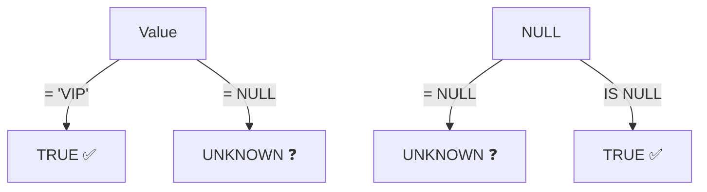

# Lesson 6: Working with NULL

`NULL` represents an unknown or missing value. It is not zero, not an empty string — it is the absence of a value. Understanding NULL is critical because it behaves differently from every other value in SQL.



> **Concept:** NULL means 'no value'. = NULL always returns UNKNOWN, so use IS NULL instead.

## NULL is Not Equal to Anything

You cannot compare NULL with `=` or `<>`. These comparisons always return `NULL` (unknown), never `TRUE`.

```sql
-- WRONG: this returns no rows!
SELECT name FROM customers WHERE birth_date = NULL;

-- CORRECT: use IS NULL
SELECT name FROM customers WHERE birth_date IS NULL;
```

```sql
-- Customers whose gender is known
SELECT name, gender
FROM customers
WHERE gender IS NOT NULL
LIMIT 5;
```

**Result:**

| name | gender |
| ---- | ------ |
| 정준호  | M      |
| 김민재  | M      |
| 진정자  | F      |
| 이정수  | M      |
| ...  | ...    |

## IS NULL and IS NOT NULL

```sql
-- Orders without delivery notes
SELECT order_number, total_amount
FROM orders
WHERE notes IS NULL
LIMIT 5;
```

**Result:**

| order_number       | total_amount |
| ------------------ | -----------: |
| ORD-20160101-00001 |       130700 |
| ORD-20160102-00003 |       265400 |
| ORD-20160103-00004 |       130700 |
| ...                | ...          |

```sql
-- Orders that were NOT handled by any staff member
SELECT order_number, status
FROM orders
WHERE staff_id IS NULL
  AND status IN ('return_requested', 'returned', 'complaints')
LIMIT 5;
```

## COALESCE

`COALESCE(a, b, c, ...)` returns the first non-NULL argument. It is the standard way to substitute a default value for NULL.

```sql
-- Show gender or 'Not Specified' when gender is NULL
SELECT
    name,
    COALESCE(gender, 'Not Specified') AS gender_display
FROM customers
LIMIT 8;
```

**Result:**

| name | gender_display |
|------|----------------|
| Jennifer Martinez | F |
| Alex Chen | Not Specified |
| Robert Kim | M |
| Maria Santos | Not Specified |
| Sarah Johnson | F |
| ... | |

```sql
-- Use notes or a default message
SELECT
    order_number,
    COALESCE(notes, 'No special instructions') AS delivery_note
FROM orders
LIMIT 5;
```

**Result:**

| order_number       | delivery_note           |
| ------------------ | ----------------------- |
| ORD-20160101-00001 | No special instructions |
| ORD-20160102-00002 | 1층 로비에 놓아주세요            |
| ORD-20160102-00003 | No special instructions |
| ...                | ...                     |

## NULLIF

`NULLIF(a, b)` returns NULL when `a` equals `b`, otherwise returns `a`. It is often used to avoid division-by-zero errors.

```sql
-- Safe percentage: avoid division by zero
SELECT
    grade,
    COUNT(*) AS total,
    COUNT(CASE WHEN is_active = 0 THEN 1 END) AS inactive,
    ROUND(
        100.0 * COUNT(CASE WHEN is_active = 0 THEN 1 END)
              / NULLIF(COUNT(*), 0),
        1
    ) AS pct_inactive
FROM customers
GROUP BY grade;
```

**Result:**

| grade  | total | inactive | pct_inactive |
| ------ | ----: | -------: | -----------: |
| BRONZE |  3962 |     1414 |         35.7 |
| GOLD   |   484 |        0 |            0 |
| SILVER |   469 |        0 |            0 |
| VIP    |   315 |        0 |            0 |

## NULL in Aggregates

Aggregate functions (`SUM`, `AVG`, `COUNT(column)`, `MIN`, `MAX`) silently ignore NULL values. This can cause surprises.

=== "SQLite"
    ```sql
    -- Comparing COUNT(*) vs COUNT(birth_date)
    SELECT
        COUNT(*)           AS all_customers,
        COUNT(birth_date)  AS customers_with_dob,
        AVG(
            CAST(SUBSTR(birth_date, 1, 4) AS INTEGER)
        )                  AS avg_birth_year
    FROM customers;
    ```

=== "MySQL"
    ```sql
    SELECT
        COUNT(*)           AS all_customers,
        COUNT(birth_date)  AS customers_with_dob,
        AVG(YEAR(birth_date)) AS avg_birth_year
    FROM customers;
    ```

=== "PostgreSQL"
    ```sql
    SELECT
        COUNT(*)           AS all_customers,
        COUNT(birth_date)  AS customers_with_dob,
        AVG(EXTRACT(YEAR FROM birth_date))::numeric(6,1) AS avg_birth_year
    FROM customers;
    ```

**Result:**

| all_customers | customers_with_dob | avg_birth_year |
|--------------:|-------------------:|---------------:|
| 5230 | 4445 | 1982.3 |

> The `AVG` is calculated only over the 4,445 rows that have a birth date — the 785 NULLs are excluded automatically.

## NULL in Expressions

{ .off-glb width="400" }

Any arithmetic involving NULL produces NULL.

```sql
-- NULL propagates through math
SELECT
    1 + NULL,       -- NULL
    NULL * 100,     -- NULL
    'hello' || NULL -- NULL (string concatenation too)
```

Use `COALESCE` to guard against this:

=== "SQLite"
    ```sql
    -- Calculate age in years, treating NULL birth_date as unknown
    SELECT
        name,
        birth_date,
        COALESCE(
            CAST((julianday('now') - julianday(birth_date)) / 365.25 AS INTEGER),
            -1
        ) AS age_years
    FROM customers
    LIMIT 5;
    ```

=== "MySQL"
    ```sql
    SELECT
        name,
        birth_date,
        COALESCE(
            TIMESTAMPDIFF(YEAR, birth_date, CURDATE()),
            -1
        ) AS age_years
    FROM customers
    LIMIT 5;
    ```

=== "PostgreSQL"
    ```sql
    SELECT
        name,
        birth_date,
        COALESCE(
            EXTRACT(YEAR FROM AGE(CURRENT_DATE, birth_date))::int,
            -1
        ) AS age_years
    FROM customers
    LIMIT 5;
    ```

!!! note "Lesson Review"
    Quick exercises to check your understanding of this lesson. For comprehensive practice combining multiple concepts, see the [Exercises](../exercises/index.md) section.

## Practice Exercises
### Exercise 1
Find the top-level managers in the `staff` table — employees whose `manager_id` is NULL. Show their `name`, `department`, and `role`.

??? success "Answer"
    ```sql
    SELECT name, department, role
    FROM staff
    WHERE manager_id IS NULL;
    ```

    **Expected result:**

    | name | department | role  |
    | ---- | ---------- | ----- |
    | 한민재  | 경영         | admin |


### Exercise 2
Find customers whose `phone` is NULL. Show their `name` and `email`, but replace NULL emails with `'No contact'` using COALESCE.

??? success "Answer"
    ```sql
    SELECT
        name,
        COALESCE(email, 'No contact') AS email
    FROM customers
    WHERE phone IS NULL;
    ```


### Exercise 3
Use `NULLIF` to safely calculate a price-per-unit ratio for products. Return `name`, `price`, `stock_qty`, and `price / NULLIF(stock_qty, 0)` as `price_per_unit`. Limit to 5 rows.

??? success "Answer"
    ```sql
    SELECT
        name,
        price,
        stock_qty,
        price / NULLIF(stock_qty, 0) AS price_per_unit
    FROM products
    LIMIT 5;
    ```

    **Expected result:**

    | name                                     | price   | stock_qty | price_per_unit |
    | ---------------------------------------- | ------: | --------: | -------------: |
    | Razer Blade 18 블랙                        | 2987500 |       107 |       27920.56 |
    | MSI GeForce RTX 4070 Ti Super GAMING X   | 1744000 |       499 |        3494.99 |
    | 삼성 DDR4 32GB PC4-25600                   |   49100 |       359 |         136.77 |
    | Dell U2724D                              |  853600 |       337 |        2532.94 |
    | G.SKILL Trident Z5 DDR5 64GB 6000MHz 화이트 |  130700 |        59 |        2215.25 |


### Exercise 4
List customers who have never logged in (`last_login_at IS NULL`). Show `name`, `email`, and `created_at`, replacing NULL `email` with `'N/A'` and NULL `created_at` with `'Unknown'`. Limit to 10 rows.

??? success "Answer"
    ```sql
    SELECT
        name,
        COALESCE(email, 'N/A')       AS email,
        COALESCE(created_at, 'Unknown') AS created_at
    FROM customers
    WHERE last_login_at IS NULL
    LIMIT 10;
    ```

    **Expected result:**

    | name | email              | created_at          |
    | ---- | ------------------ | ------------------- |
    | 윤준영  | user25@testmail.kr | 2016-02-03 04:18:52 |
    | 이영식  | user43@testmail.kr | 2016-02-23 17:09:54 |
    | 송서준  | user66@testmail.kr | 2016-05-07 02:57:58 |
    | 김지우  | user77@testmail.kr | 2016-04-29 00:44:20 |
    | 박아름  | user80@testmail.kr | 2016-08-13 13:52:58 |
    | ...  | ...                | ...                 |


### Exercise 5
List all orders where `staff_id IS NULL` (no customer service rep assigned). For each order show `order_number`, `status`, and the notes — but replace NULL notes with the text `'—'`.

??? success "Answer"
    ```sql
    SELECT
        order_number,
        status,
        COALESCE(notes, '—') AS notes
    FROM orders
    WHERE staff_id IS NULL
    ORDER BY ordered_at DESC
    LIMIT 20;
    ```

    **Expected result:**

    | order_number       | status    | notes              |
    | ------------------ | --------- | ------------------ |
    | ORD-20250630-34900 | pending   | 문 앞에 놓아주세요         |
    | ORD-20250630-34905 | pending   | —                  |
    | ORD-20250630-34903 | cancelled | 오후 2시 이후 배송 부탁드립니다 |
    | ORD-20250630-34899 | pending   | 배송 전 연락 부탁합니다      |
    | ORD-20250630-34896 | pending   | 경비실에 맡겨주세요         |
    | ...                | ...       | ...                |


### Exercise 6
For each membership `grade`, show how many customers have a known gender vs. an unknown gender. Use `COALESCE(gender, 'Unknown')` as the grouping column.

??? success "Answer"
    ```sql
    SELECT
        grade,
        COALESCE(gender, 'Unknown') AS gender_status,
        COUNT(*) AS customer_count
    FROM customers
    GROUP BY grade, COALESCE(gender, 'Unknown')
    ORDER BY grade, gender_status;
    ```

    **Expected result:**

    | grade  | gender_status | customer_count |
    | ------ | ------------- | -------------: |
    | BRONZE | F             |           1332 |
    | BRONZE | M             |           2194 |
    | BRONZE | Unknown       |            436 |
    | GOLD   | F             |            136 |
    | GOLD   | M             |            316 |
    | ...    | ...           | ...            |


### Exercise 7
Count how many orders in the `orders` table have a NULL `cancelled_at` (not cancelled) and how many have a non-NULL `cancelled_at` (cancelled). Use aliases `not_cancelled` and `cancelled`.

??? success "Answer"
    ```sql
    SELECT
        COUNT(CASE WHEN cancelled_at IS NULL THEN 1 END)     AS not_cancelled,
        COUNT(CASE WHEN cancelled_at IS NOT NULL THEN 1 END) AS cancelled
    FROM orders;
    ```

    **Expected result:**

    | not_cancelled | cancelled |
    | ------------: | --------: |
    |         33154 |      1754 |


### Exercise 8
From the `products` table, count the total products, how many are missing a `weight_grams`, and what percentage that is (1 decimal place). Use aliases `total_products`, `missing_weight`, `pct_missing`.

??? success "Answer"
    ```sql
    SELECT
        COUNT(*)                                AS total_products,
        COUNT(*) - COUNT(weight_grams)                AS missing_weight,
        ROUND(100.0 * (COUNT(*) - COUNT(weight_grams)) / COUNT(*), 1) AS pct_missing
    FROM products;
    ```

    **Expected result:**

    | total_products | missing_weight | pct_missing |
    | -------------: | -------------: | ----------: |
    |            280 |             12 |         4.3 |


### Exercise 9
In the `reviews` table, compare the average `rating` of reviews that have `content` (not NULL) vs. reviews without content (NULL). Show `COUNT(*)` and `AVG(rating)` for each group.

??? success "Answer"
    ```sql
    SELECT
        CASE WHEN content IS NULL THEN 'No Content' ELSE 'Has Content' END AS content_status,
        COUNT(*)        AS review_count,
        AVG(rating)     AS avg_rating
    FROM reviews
    GROUP BY CASE WHEN content IS NULL THEN 'No Content' ELSE 'Has Content' END;
    ```

    **Expected result:**

    | content_status | review_count | avg_rating |
    | -------------- | -----------: | ---------: |
    | Has Content    |         7156 |       3.91 |
    | No Content     |          789 |       3.93 |


### Exercise 10
Count how many customers are missing a birth date, have no recorded gender, and have never logged in. Show separate counts for each condition plus the total customer count.

??? success "Answer"
    ```sql
    SELECT
        COUNT(*)                                         AS total_customers,
        COUNT(*) - COUNT(birth_date)                    AS missing_birth_date,
        COUNT(*) - COUNT(gender)                        AS missing_gender,
        SUM(CASE WHEN last_login_at IS NULL THEN 1 ELSE 0 END) AS never_logged_in
    FROM customers;
    ```


---
Next: [Lesson 7: INNER JOIN](../intermediate/07-inner-join.md)
