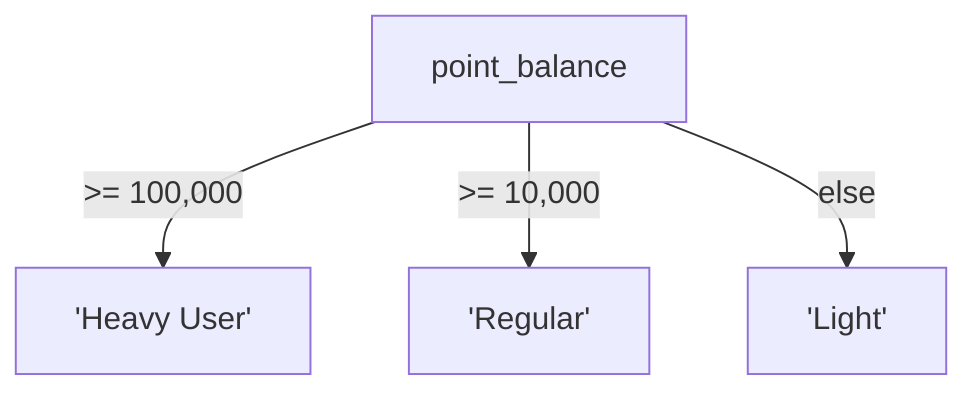

# Lesson 7: CASE Expressions

When querying data, you sometimes want to display different values based on conditions, like "if the price is 1 million won or more, label it 'Premium'; otherwise, 'Standard'." CASE expressions let you do conditional branching within SQL.

!!! note "Already familiar?"
    If you are comfortable with CASE WHEN, pivoting, and categorization, skip ahead to [Lesson 8: INNER JOIN](../intermediate/08-inner-join.md).

`CASE` is SQL's conditional expression, similar to `if/else` in programming languages. It can handle value conversion, label creation, data bucketing, and conditional aggregation all within a single query.



> CASE is SQL's if-else. It evaluates conditions from top to bottom in order.

## Simple CASE

A simple CASE compares a single column value against fixed values.

```sql
-- Convert order status codes to readable labels
SELECT
    order_number,
    total_amount,
    CASE status
        WHEN 'pending'          THEN 'Awaiting Payment'
        WHEN 'paid'             THEN 'Payment Complete'
        WHEN 'preparing'        THEN 'Preparing'
        WHEN 'shipped'          THEN 'Shipped'
        WHEN 'delivered'        THEN 'Delivered'
        WHEN 'confirmed'        THEN 'Purchase Confirmed'
        WHEN 'cancelled'        THEN 'Cancelled'
        WHEN 'return_requested' THEN 'Return Requested'
        WHEN 'returned'         THEN 'Returned'
        ELSE status
    END AS status_label
FROM orders
ORDER BY ordered_at DESC
LIMIT 5;
```

**Result:**

| order_number | total_amount | status_label |
| ---------- | ----------: | ---------- |
| ORD-20251231-37555 | 74800.0 | Awaiting Payment |
| ORD-20251231-37543 | 134100.0 | Awaiting Payment |
| ORD-20251231-37552 | 254300.0 | Awaiting Payment |
| ORD-20251231-37548 | 187700.0 | Awaiting Payment |
| ORD-20251231-37542 | 155700.0 | Awaiting Payment |
| ... | ... | ... |

## Searched CASE

A searched CASE evaluates independent `WHEN` conditions, providing full flexibility for comparisons and expressions.

```sql
-- Classify products by price tier
SELECT
    name,
    price,
    CASE
        WHEN price < 50           THEN 'Budget'
        WHEN price BETWEEN 50 AND 199.99  THEN 'Mid-range'
        WHEN price BETWEEN 200 AND 799.99 THEN 'High-end'
        ELSE 'Premium'
    END AS price_tier
FROM products
WHERE is_active = 1
ORDER BY price ASC
LIMIT 10;
```

**Result:**

| name | price | price_tier |
| ---------- | ----------: | ---------- |
| TP-Link TG-3468 Black | 18500.0 | Premium |
| Samsung SPA-KFG0BUB Silver | 21900.0 | Premium |
| Arctic Freezer 36 A-RGB White | 23000.0 | Premium |
| Arctic Freezer 36 A-RGB White | 29900.0 | Premium |
| TP-Link Archer TBE400E White | 30200.0 | Premium |
| Samsung SPA-KFG0BUB | 30700.0 | Premium |
| TP-Link TL-SG1016D Silver | 36100.0 | Premium |
| Microsoft Bluetooth Keyboard White | 36800.0 | Premium |
| ... | ... | ... |

## Using CASE for Age Group Classification

=== "SQLite"
    ```sql
    -- Classify customers by generation
    SELECT
        name,
        birth_date,
        CASE
            WHEN birth_date IS NULL THEN 'Unknown'
            WHEN CAST(SUBSTR(birth_date, 1, 4) AS INTEGER) >= 1997 THEN 'Gen Z'
            WHEN CAST(SUBSTR(birth_date, 1, 4) AS INTEGER) >= 1981 THEN 'Millennial'
            WHEN CAST(SUBSTR(birth_date, 1, 4) AS INTEGER) >= 1965 THEN 'Gen X'
            ELSE 'Baby Boomer+'
        END AS generation
    FROM customers
    LIMIT 8;
    ```

=== "MySQL"
    ```sql
    SELECT
        name,
        birth_date,
        CASE
            WHEN birth_date IS NULL THEN 'Unknown'
            WHEN YEAR(birth_date) >= 1997 THEN 'Gen Z'
            WHEN YEAR(birth_date) >= 1981 THEN 'Millennial'
            WHEN YEAR(birth_date) >= 1965 THEN 'Gen X'
            ELSE 'Baby Boomer+'
        END AS generation
    FROM customers
    LIMIT 8;
    ```

=== "PostgreSQL"
    ```sql
    SELECT
        name,
        birth_date,
        CASE
            WHEN birth_date IS NULL THEN 'Unknown'
            WHEN EXTRACT(YEAR FROM birth_date) >= 1997 THEN 'Gen Z'
            WHEN EXTRACT(YEAR FROM birth_date) >= 1981 THEN 'Millennial'
            WHEN EXTRACT(YEAR FROM birth_date) >= 1965 THEN 'Gen X'
            ELSE 'Baby Boomer+'
        END AS generation
    FROM customers
    LIMIT 8;
    ```

**Result:**

| name | birth_date | generation |
|------|------------|------------|
| 김민수 | 1989-04-12 | Millennial |
| 이지은 | (NULL) | Unknown |
| 박서준 | 1972-08-27 | Gen X |
| 최유리 | 2000-01-15 | Gen Z |
| ... | | |

## CASE in GROUP BY and Aggregation

`CASE` can be used as a grouping expression or within aggregate functions.

```sql
-- Product count by price tier
SELECT
    CASE
        WHEN price < 50           THEN 'Budget (under 50K)'
        WHEN price BETWEEN 50 AND 199.99  THEN 'Mid-range (50K-200K)'
        WHEN price BETWEEN 200 AND 799.99 THEN 'High-end (200K-800K)'
        ELSE 'Premium (800K+)'
    END AS price_tier,
    COUNT(*)   AS product_count,
    AVG(price) AS avg_price
FROM products
WHERE is_active = 1
GROUP BY price_tier
ORDER BY avg_price;
```

**Result:**

| price_tier | product_count | avg_price |
| ---------- | ----------: | ----------: |
| Premium (800K+) | 218 | 659594.495412844 |

=== "SQLite"
    ```sql
    -- Pivot: display order status counts as columns
    SELECT
        SUBSTR(ordered_at, 1, 7) AS year_month,
        COUNT(CASE WHEN status = 'confirmed' THEN 1 END) AS confirmed,
        COUNT(CASE WHEN status = 'cancelled' THEN 1 END) AS cancelled,
        COUNT(CASE WHEN status = 'returned'  THEN 1 END) AS returned,
        COUNT(*) AS total
    FROM orders
    WHERE ordered_at LIKE '2024%'
    GROUP BY SUBSTR(ordered_at, 1, 7)
    ORDER BY year_month;
    ```

=== "MySQL"
    ```sql
    SELECT
        DATE_FORMAT(ordered_at, '%Y-%m') AS year_month,
        COUNT(CASE WHEN status = 'confirmed' THEN 1 END) AS confirmed,
        COUNT(CASE WHEN status = 'cancelled' THEN 1 END) AS cancelled,
        COUNT(CASE WHEN status = 'returned'  THEN 1 END) AS returned,
        COUNT(*) AS total
    FROM orders
    WHERE ordered_at >= '2024-01-01'
      AND ordered_at <  '2025-01-01'
    GROUP BY DATE_FORMAT(ordered_at, '%Y-%m')
    ORDER BY year_month;
    ```

=== "PostgreSQL"
    ```sql
    SELECT
        TO_CHAR(ordered_at, 'YYYY-MM') AS year_month,
        COUNT(CASE WHEN status = 'confirmed' THEN 1 END) AS confirmed,
        COUNT(CASE WHEN status = 'cancelled' THEN 1 END) AS cancelled,
        COUNT(CASE WHEN status = 'returned'  THEN 1 END) AS returned,
        COUNT(*) AS total
    FROM orders
    WHERE ordered_at >= '2024-01-01'
      AND ordered_at <  '2025-01-01'
    GROUP BY TO_CHAR(ordered_at, 'YYYY-MM')
    ORDER BY year_month;
    ```

**Result:**

| year_month | confirmed | cancelled | returned | total |
|------------|----------:|----------:|---------:|------:|
| 2024-01 | 198 | 42 | 12 | 312 |
| 2024-02 | 183 | 38 | 9 | 289 |
| 2024-03 | 261 | 57 | 14 | 405 |
| ... | | | | |

## CASE in ORDER BY

You can sort by a calculated expression.

```sql
-- Sort active statuses first, completed statuses last
SELECT order_number, status, total_amount
FROM orders
ORDER BY
    CASE status
        WHEN 'pending'   THEN 1
        WHEN 'paid'      THEN 2
        WHEN 'preparing' THEN 3
        WHEN 'shipped'   THEN 4
        ELSE 5
    END,
    total_amount DESC
LIMIT 10;
```

## Summary

| Concept | Description | Example |
|---------|-------------|---------|
| Simple CASE | Compare one value against multiple fixed values | `CASE status WHEN 'pending' THEN 'Awaiting' ...` |
| Searched CASE | Evaluate independent conditions in order | `CASE WHEN price < 50 THEN 'Budget' ...` |
| ELSE | Default value when no conditions match | `ELSE 'Other' END` |
| GROUP BY + CASE | Group by CASE result and aggregate | `GROUP BY CASE WHEN ... END` |
| Conditional aggregation (pivot) | Use CASE inside aggregate functions for conditional counts/sums | `COUNT(CASE WHEN status = 'ok' THEN 1 END)` |
| ORDER BY + CASE | Custom sort by calculated expression | `ORDER BY CASE WHEN ... THEN 1 ...` |

!!! note "Lesson Review Problems"
    These are simple problems to immediately check the concepts learned in this lesson. For comprehensive practice combining multiple concepts, see the [Practice Problems](../exercises/index.md) section.

## Practice Problems
### Problem 1
Display `'No memo'` when the order's `notes` column is NULL. Use a CASE expression to return `order_number`, `status`, and `memo` (show `'No memo'` if notes is NULL, otherwise show the notes value). Limit to the 15 most recent orders.

??? success "Answer"
    ```sql
    SELECT
        order_number,
        status,
        CASE
            WHEN notes IS NULL THEN 'No memo'
            ELSE notes
        END AS memo
    FROM orders
    ORDER BY ordered_at DESC
    LIMIT 15;
    ```

    **Result (example):**

| order_number | status | memo |
| ---------- | ---------- | ---------- |
| ORD-20251231-37555 | pending | No memo |
| ORD-20251231-37543 | pending | Please knock gently |
| ORD-20251231-37552 | pending | No memo |
| ORD-20251231-37548 | pending | No memo |
| ORD-20251231-37542 | pending | Deliver to the office front desk |
| ORD-20251231-37546 | pending | Leave with the doorman/concierge |
| ORD-20251231-37547 | pending | Handle with care — fragile |
| ORD-20251231-37556 | pending | No memo |
| ... | ... | ... |


### Problem 2
Sort the `staff` list so that employees with `role` = `'manager'` come first, then `'staff'`, then all others last. Within the same role, sort by `name` ascending. Return `name`, `department`, and `role`, including only active employees.

??? success "Answer"
    ```sql
    SELECT name, department, role
    FROM staff
    WHERE is_active = 1
    ORDER BY
        CASE role
            WHEN 'manager' THEN 1
            WHEN 'staff'   THEN 2
            ELSE 3
        END,
        name ASC;
    ```

    **Result (example):**

| name | department | role |
| ---------- | ---------- | ---------- |
| Jaime Phelps | Sales | manager |
| Nicole Hamilton | Marketing | manager |
| Jonathan Smith | Management | admin |
| Michael Mcguire | Management | admin |
| Michael Thomas | Management | admin |
| ... | ... | ... |


### Problem 3
Convert payment methods (`payments.method`) to labels using a simple CASE: `'card'` -> `'Credit Card'`, `'bank_transfer'` -> `'Bank Transfer'`, `'cash'` -> `'Cash'`, all others -> `'Other'`. Return `id`, `amount`, and `method_label`, limited to 10 rows.

??? success "Answer"
    ```sql
    SELECT
        id,
        amount,
        CASE method
            WHEN 'card'          THEN 'Credit Card'
            WHEN 'bank_transfer' THEN 'Bank Transfer'
            WHEN 'cash'          THEN 'Cash'
            ELSE 'Other'
        END AS method_label
    FROM payments
    LIMIT 10;
    ```

    **Result (example):**

| id | amount | method_label |
| ----------: | ----------: | ---------- |
| 1 | 167000.0 | Credit Card |
| 2 | 211800.0 | Credit Card |
| 3 | 704800.0 | Credit Card |
| 4 | 167000.0 | Credit Card |
| 5 | 534490.0 | Other |
| 6 | 167000.0 | Credit Card |
| 7 | 687400.0 | Credit Card |
| 8 | 916600.0 | Other |
| ... | ... | ... |


### Problem 4
Add a `stock_status` column to the product list: `stock_qty = 0` -> `'Out of Stock'`, `1-10` -> `'Low Stock'`, `11-100` -> `'In Stock'`, over 100 -> `'Well Stocked'`. Return `name`, `stock_qty`, and `stock_status` for all active products.

??? success "Answer"
    ```sql
    SELECT
        name,
        stock_qty,
        CASE
            WHEN stock_qty = 0         THEN 'Out of Stock'
            WHEN stock_qty <= 10       THEN 'Low Stock'
            WHEN stock_qty <= 100      THEN 'In Stock'
            ELSE 'Well Stocked'
        END AS stock_status
    FROM products
    WHERE is_active = 1
    ORDER BY stock_qty ASC;
    ```

    **Result (example):**

| name | stock_qty | stock_status |
| ---------- | ----------: | ---------- |
| Arctic Freezer 36 A-RGB White | 0 | Out of Stock |
| Samsung SPA-KFG0BUB | 4 | Low Stock |
| Logitech G502 HERO Silver | 8 | Low Stock |
| ASUS ROG Strix Scar 16 | 18 | In Stock |
| MSI MPG X870E CARBON WIFI Black | 21 | In Stock |
| LG 27UQ85R Black | 26 | In Stock |
| ASUS ROG Strix G16CH Silver | 28 | In Stock |
| Fractal Design Define 7 White | 30 | In Stock |
| ... | ... | ... |


### Problem 5
Create a generational distribution report: count how many active customers are in each generation (Gen Z: born 1997 or later, Millennial: 1981-1996, Gen X: 1965-1980, Baby Boomer+: before 1965, Unknown: birth_date is NULL). Return `generation` and `customer_count`.

??? success "Answer"
    === "SQLite"
        ```sql
        SELECT
            CASE
                WHEN birth_date IS NULL THEN 'Unknown'
                WHEN CAST(SUBSTR(birth_date, 1, 4) AS INTEGER) >= 1997 THEN 'Gen Z'
                WHEN CAST(SUBSTR(birth_date, 1, 4) AS INTEGER) >= 1981 THEN 'Millennial'
                WHEN CAST(SUBSTR(birth_date, 1, 4) AS INTEGER) >= 1965 THEN 'Gen X'
                ELSE 'Baby Boomer+'
            END AS generation,
            COUNT(*) AS customer_count
        FROM customers
        WHERE is_active = 1
        GROUP BY generation
        ORDER BY customer_count DESC;
        ```

        **Result (example):**

| generation | customer_count |
| ---------- | ----------: |
| Millennial | 1762 |
| Gen Z | 776 |
| Gen X | 561 |
| Unknown | 497 |
| Baby Boomer+ | 64 |
| ... | ... |


    === "MySQL"
        ```sql
        SELECT
            CASE
                WHEN birth_date IS NULL THEN 'Unknown'
                WHEN YEAR(birth_date) >= 1997 THEN 'Gen Z'
                WHEN YEAR(birth_date) >= 1981 THEN 'Millennial'
                WHEN YEAR(birth_date) >= 1965 THEN 'Gen X'
                ELSE 'Baby Boomer+'
            END AS generation,
            COUNT(*) AS customer_count
        FROM customers
        WHERE is_active = 1
        GROUP BY generation
        ORDER BY customer_count DESC;
        ```

    === "PostgreSQL"
        ```sql
        SELECT
            CASE
                WHEN birth_date IS NULL THEN 'Unknown'
                WHEN EXTRACT(YEAR FROM birth_date) >= 1997 THEN 'Gen Z'
                WHEN EXTRACT(YEAR FROM birth_date) >= 1981 THEN 'Millennial'
                WHEN EXTRACT(YEAR FROM birth_date) >= 1965 THEN 'Gen X'
                ELSE 'Baby Boomer+'
            END AS generation,
            COUNT(*) AS customer_count
        FROM customers
        WHERE is_active = 1
        GROUP BY generation
        ORDER BY customer_count DESC;
        ```


### Problem 6
Convert review `rating` values to text labels: 5 -> `'Excellent'`, 4 -> `'Good'`, 3 -> `'Average'`, 2 -> `'Poor'`, 1 -> `'Terrible'`. Find the review count and average rating per label. Return `rating_label`, `review_count`, and `avg_rating` sorted by `avg_rating` descending.

??? success "Answer"
    ```sql
    SELECT
        CASE rating
            WHEN 5 THEN 'Excellent'
            WHEN 4 THEN 'Good'
            WHEN 3 THEN 'Average'
            WHEN 2 THEN 'Poor'
            WHEN 1 THEN 'Terrible'
        END AS rating_label,
        COUNT(*)            AS review_count,
        ROUND(AVG(rating), 2) AS avg_rating
    FROM reviews
    GROUP BY rating
    ORDER BY avg_rating DESC;
    ```

    **Result (example):**

| rating_label | review_count | avg_rating |
| ---------- | ----------: | ----------: |
| Excellent | 3433 | 5.0 |
| Good | 2575 | 4.0 |
| Average | 1265 | 3.0 |
| Poor | 839 | 2.0 |
| Terrible | 434 | 1.0 |
| ... | ... | ... |


### Problem 7
Classify customer `point_balance` into 3 tiers: 100,000+ as `'Heavy User'`, 10,000+ as `'Regular'`, others as `'Light'`. Aggregate the customer count per tier for each `grade`. Return `grade`, `heavy_count`, `regular_count`, and `light_count`.

??? success "Answer"
    ```sql
    SELECT
        grade,
        COUNT(CASE WHEN point_balance >= 100000 THEN 1 END) AS heavy_count,
        COUNT(CASE WHEN point_balance >= 10000
                    AND point_balance < 100000 THEN 1 END) AS regular_count,
        COUNT(CASE WHEN point_balance < 10000 THEN 1 END)  AS light_count
    FROM customers
    WHERE is_active = 1
    GROUP BY grade
    ORDER BY grade;
    ```

    **Result (example):**

| grade | heavy_count | regular_count | light_count |
| ---------- | ----------: | ----------: | ----------: |
| BRONZE | 187 | 597 | 1505 |
| GOLD | 231 | 293 | 0 |
| SILVER | 130 | 289 | 60 |
| VIP | 293 | 75 | 0 |


### Problem 8
Aggregate order count and total revenue by order amount tier (`total_amount`: under 100K -> `'Small'`, 100K to under 500K -> `'Medium'`, 500K+ -> `'Large'`), and sort with large orders on top. Return `amount_tier`, `order_count`, and `total_revenue`.

??? success "Answer"
    ```sql
    SELECT
        CASE
            WHEN total_amount < 100      THEN 'Small'
            WHEN total_amount < 500      THEN 'Medium'
            ELSE 'Large'
        END AS amount_tier,
        COUNT(*)          AS order_count,
        SUM(total_amount) AS total_revenue
    FROM orders
    WHERE status NOT IN ('cancelled', 'returned')
    GROUP BY amount_tier
    ORDER BY
        CASE
            WHEN total_amount < 100 THEN 3
            WHEN total_amount < 500 THEN 2
            ELSE 1
        END;
    ```

    **Result (example):**

| amount_tier | order_count | total_revenue |
| ---------- | ----------: | ----------: |
| Large | 35205 | 35580915707.0 |


### Problem 9
Pivot the payment outcome by method: count `'Success'` (status = `'completed'`) and `'Failure'` (all others) for each method. Return `method`, `success_count`, `fail_count`, and `success_rate` (1 decimal place), sorted by success rate descending.

??? success "Answer"
    ```sql
    SELECT
        method,
        COUNT(CASE WHEN status = 'completed' THEN 1 END) AS success_count,
        COUNT(CASE WHEN status != 'completed' THEN 1 END) AS fail_count,
        ROUND(
            COUNT(CASE WHEN status = 'completed' THEN 1 END) * 100.0
            / COUNT(*),
            1
        ) AS success_rate
    FROM payments
    GROUP BY method
    ORDER BY success_rate DESC;
    ```

    **Result (example):**

| method | success_count | fail_count | success_rate |
| ---------- | ----------: | ----------: | ----------: |
| card | 15556 | 1285 | 92.4 |
| naver_pay | 5270 | 445 | 92.2 |
| bank_transfer | 3429 | 289 | 92.2 |
| point | 1770 | 151 | 92.1 |
| kakao_pay | 6886 | 600 | 92.0 |
| virtual_account | 1705 | 171 | 90.9 |
| ... | ... | ... | ... |


### Problem 10
Calculate each product's quarterly revenue for 2024 as separate columns (`q1_revenue`, `q2_revenue`, `q3_revenue`, `q4_revenue`). Use conditional aggregation (`SUM(CASE WHEN ... THEN ... END)`), include only products with 2024 sales, and return the top 10 by total 2024 revenue descending.

??? success "Answer"
    ```sql
    SELECT
        p.name AS product_name,
        SUM(CASE WHEN o.ordered_at BETWEEN '2024-01-01' AND '2024-03-31 23:59:59'
                 THEN oi.quantity * oi.unit_price ELSE 0 END) AS q1_revenue,
        SUM(CASE WHEN o.ordered_at BETWEEN '2024-04-01' AND '2024-06-30 23:59:59'
                 THEN oi.quantity * oi.unit_price ELSE 0 END) AS q2_revenue,
        SUM(CASE WHEN o.ordered_at BETWEEN '2024-07-01' AND '2024-09-30 23:59:59'
                 THEN oi.quantity * oi.unit_price ELSE 0 END) AS q3_revenue,
        SUM(CASE WHEN o.ordered_at BETWEEN '2024-10-01' AND '2024-12-31 23:59:59'
                 THEN oi.quantity * oi.unit_price ELSE 0 END) AS q4_revenue
    FROM order_items AS oi
    INNER JOIN orders    AS o ON oi.order_id   = o.id
    INNER JOIN products  AS p ON oi.product_id = p.id
    WHERE o.ordered_at LIKE '2024%'
      AND o.status NOT IN ('cancelled', 'returned')
    GROUP BY p.id, p.name
    ORDER BY (q1_revenue + q2_revenue + q3_revenue + q4_revenue) DESC
    LIMIT 10;
    ```

    **Result (example):**

| product_name | q1_revenue | q2_revenue | q3_revenue | q4_revenue |
| ---------- | ----------: | ----------: | ----------: | ----------: |
| Razer Blade 18 Black | 47884100.0 | 56590300.0 | 26118600.0 | 39177900.0 |
| Razer Blade 16 Silver | 51840600.0 | 40731900.0 | 14811600.0 | 29623200.0 |
| MacBook Air 15 M3 Silver | 0 | 27405500.0 | 60292100.0 | 43848800.0 |
| ASUS Dual RTX 4060 Ti Black | 24073200.0 | 24073200.0 | 16048800.0 | 48146400.0 |
| ASUS Dual RTX 5070 Ti Silver | 24660000.0 | 24660000.0 | 35510400.0 | 22687200.0 |
| ASUS ROG Swift PG32UCDM Silver | 20793300.0 | 37806000.0 | 22683600.0 | 13232100.0 |
| Razer Blade 18 Black | 23900000.0 | 8962500.0 | 44812500.0 | 14937500.0 |
| ASUS ROG Strix Scar 16 | 17167500.0 | 24525000.0 | 24525000.0 | 22072500.0 |
| ... | ... | ... | ... | ... |


### Scoring Guide

| Score | Next Step |
|:-----:|-----------|
| **9-10** | Move to [Lesson 8: INNER JOIN](../intermediate/08-inner-join.md) |
| **7-8** | Review the explanations for incorrect answers, then proceed to the next lesson |
| **Half or fewer** | Read this lesson again |
| **3 or fewer** | Start over from [Lesson 6: Handling NULL](06-null.md) |

**Problem Areas:**

| Area | Problems |
|------|:--------:|
| CASE + NULL handling | 1 |
| ORDER BY + CASE custom sort | 2, 8 |
| Simple CASE value conversion | 3, 6 |
| Searched CASE categorization | 4 |
| CASE + GROUP BY aggregation | 5 |
| Conditional aggregation (COUNT/SUM + CASE pivot) | 7, 9, 10 |

---
Next: [Lesson 8: INNER JOIN](../intermediate/08-inner-join.md)
