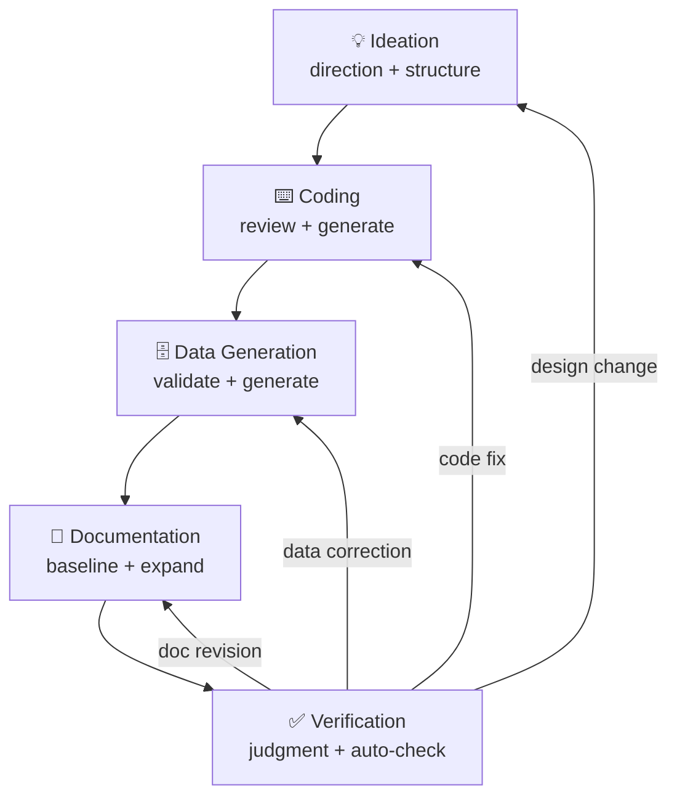

# SQL Tutorial <small>v{{version}}</small> <small style="font-size:0.5em; color:gray;">{{date}}</small>

A hands-on SQL tutorial using a realistic **e-commerce database** (30 tables · 687K rows).

Learn SQL by querying 10 years of business data from **TechShop**, a fictional online store selling computers and peripherals. **26 lessons and 270 exercises** take you from basics to advanced, with every query running against real data.
**SQLite, MySQL, and PostgreSQL** are supported side by side — every example and exercise includes tabs for all three databases.

## About the Author

**Youngje Ahn** (civilian7@gmail.com) · **Fullbit Computing** · **CEO**

I first touched programming in 1983 with an 8-bit computer and BASIC, and have been a professional programmer since 1989. I've built software across finance, government, healthcare, IoT, and real estate. I work with many languages, but Delphi has been my primary tool for over 30 years — since version 1.0. I run [Delmadang](https://cafe.naver.com/delmadang), a Korean Delphi community.

Online, I go by **"시골프로그래머"** (Country Programmer) — a name I picked up while living a rural life after moving to Hongcheon, Gangwon Province. Then AI reignited the creative drive I hadn't felt since my twenties, and I moved back to the city. I now run Fullbit Computing in Hanam, Gyeonggi Province, where I'm developing **ezQuery**, a general-purpose query browser.

For ideas, bug reports, or any questions, please reach out at [civilian7@gmail.com](mailto:civilian7@gmail.com).

!!! note "What is ezQuery?"
    **ezQuery** is a general-purpose query browser that manages SQLite, MySQL, PostgreSQL, Oracle, SQL Server, and more through a single interface. It features a Monaco-based SQL editor, table designer, ERD viewer, and AI assistant. This tutorial's database will be included as a built-in sample. Currently in development — will be released on [GitHub](https://github.com/civilian7).

## Why I Built This

This tutorial started as a sample database for **ezQuery**. While working on it, I was reminded of a frustration from my junior days — **wanting to learn SQL but having no realistic data to practice with, anywhere**. So I grew it beyond a simple sample into a full tutorial, and I'm sharing it in the hope that it helps someone facing the same struggle.

## AI Collaboration

This tutorial was built in collaboration with **[Claude](https://claude.ai)** (Anthropic). Data model, generator code, lessons, exercises, DB-specific DDL/views/stored procedures, and this documentation itself — AI was involved at every stage.

However, nothing was used as-is from AI output. Each step had a clear division of labor:

| Stage | Human | AI |
|-------|-------|-----|
| Ideation | Set direction, define requirements | Propose structure, draft initial design |
| Coding | Review, revise, run, debug | Generate code, convert DB syntax |
| Data | Validate business logic | Generate and transform data at scale |
| Documentation | Write the first lesson (baseline) | Learn the pattern, expand the rest |
| Verification | Final judgment | Auto-check numeric mismatches, broken links, DDL differences |

This cycle was repeated hundreds of times, improving quality with each iteration.

The human focuses on **"is this right?"**, the AI handles **"fast and many."** This combination made it possible to complete work in a fraction of the time it would have taken alone.

## Why Python?

My primary languages are Delphi and C/C++, but the data generator is written in Python.

- **Faker library** — The only practical choice for generating realistic localized data (Korean names, addresses, phone numbers) by locale
- **Low barrier to entry** — The target audience is primarily SQL learners who may not be familiar with Delphi, and Delphi requires a commercial license. A single `pip install` should be all it takes
- **Cross-platform** — Runs identically on Windows, macOS, and Linux
- **AI collaboration efficiency** — Python is the language AI handles best. Code generation, refactoring, and debugging are all maximally productive

Choose the right tool for the job. For a one-time data generation task, Python's rich ecosystem and accessibility made it the optimal choice.

## Why This Tutorial?

SQL is hard to learn from a book. Memorizing syntax doesn't teach you to write queries, and 10-row samples don't build real-world intuition. This tutorial is designed to be **learned by doing**.

**Realistic data** — 687K rows of a growing online store over 10 years, complete with revenue trends, holiday peaks, customer churn, NULLs, and outliers. Not textbook-clean data — the kind you actually encounter at work.

**Three databases at once** — Solve the same problem in SQLite, MySQL, and PostgreSQL. Compare DB-specific syntax with a single tab switch, so you build SQL skills that aren't locked to one vendor.

**Data you control** — A seed-based generator is included. Adjust scale, language, and noise freely. Use the tutorial data as-is, or create your own.

| Typical Textbook | This Tutorial |
|------------------|---------------|
| Syntax only, no practice data | **687K rows** with 10 years of growth curves, seasonality, and behavior patterns |
| Single DB only | **SQLite, MySQL, PostgreSQL** — same problem, three databases |
| Answers only | **270 exercises** with full solutions, explanations, and result tables |
| Fixed data, no customization | **Seed-based generator** — adjust scale, language, and noise freely |
| Syntax-first approach | Hands-on practice through **real e-commerce business scenarios** |
| One language | Data and docs in both **Korean and English** |

## Supported Databases

This tutorial supports three databases simultaneously. Each has a different character — choose one or try all three.

### SQLite

A single file *is* the database. No server installation needed, and it works out of the box with Python's standard library. This is the tutorial's default DB.

| Strengths | Limitations |
|-----------|------------|
| Zero install, deploy by file copy | Single-writer limitation |
| Lightweight and fast (embedded) | No user management or access control |
| Supports most of the SQL standard | No stored procedures |
| Embeddable in mobile/desktop apps | Not suited for high-concurrency workloads |

### MySQL / MariaDB

The world's most widely used open-source RDBMS. It's the de facto standard for web services. MariaDB is a fork-compatible alternative — this tutorial's MySQL SQL runs on MariaDB as-is.

| Strengths | Limitations |
|-----------|------------|
| Rich ecosystem, broad hosting support | Some SQL standard gaps (e.g. no FULL OUTER JOIN) |
| Excellent read performance, easy replication | Subquery optimization weaker than PG |
| Convenient features (ENUM, AUTO_INCREMENT) | CHECK constraints only enforced since 8.0.16+ |
| AWS RDS, Cloud SQL, etc. | Window functions require 8.0+ |

### PostgreSQL

The most standards-compliant open-source RDBMS. Excels at complex queries, JSON processing, and extensibility. Especially popular in data analytics and geospatial (PostGIS).

| Strengths | Limitations |
|-----------|------------|
| Best SQL standard compliance | Slightly slower for simple reads vs MySQL |
| Rich types: JSONB, arrays, ranges | Configuration can be complex for beginners |
| Native Materialized Views, partitioning | Replication setup more involved than MySQL |
| PL/pgSQL, custom types, extension modules | Less web hosting support than MySQL |

### Future Database Support

Currently supporting SQLite, MySQL, and PostgreSQL. The following databases are planned for future releases.

| Database | Status | Notes |
|----------|:------:|-------|
| Oracle | Planned | #1 enterprise market share, PL/SQL |
| SQL Server | Planned | .NET ecosystem, T-SQL |
| DB2 | Under review | Legacy in finance/government |
| CUBRID | Under review | Korean open-source RDBMS |
| Tibero | Under review | Korean commercial RDBMS, Oracle-compatible |

The generator's architecture separates DB-specific exporters as plugins — adding a new DB only requires writing a DDL/data conversion module. Contributions are welcome.

## What You'll Learn

### Beginner — 7 Lessons · 62 Exercises

Learn the most fundamental SQL syntax. After this stage, you can query, filter, sort, and aggregate data from a single table. No programming experience required.

| # | Lesson | What You Learn | What You Can Do |
|:-:|--------|---------------|-----------------|
| 00 | Introduction to Databases & SQL | DB concepts, tables/rows/columns | Understand DB structure, run queries in a SQL tool |
| 01 | SELECT Basics | Column selection, aliases, DISTINCT | Retrieve specific columns from a table |
| 02 | Filtering with WHERE | Comparison, AND/OR, IN, LIKE, BETWEEN | Extract rows matching conditions |
| 03 | Sorting & Limiting | ORDER BY, LIMIT, OFFSET | Sort results and get top N rows |
| 04 | Aggregate Functions | COUNT, SUM, AVG, MIN, MAX | Calculate summary statistics |
| 05 | GROUP BY & HAVING | Grouping, group-level filtering | Analyze data by category, month, etc. |
| 06 | NULL Handling | IS NULL, COALESCE, IFNULL | Handle missing values correctly |

### Intermediate — 11 Lessons · 84 Exercises

Combine multiple tables and transform data. After this stage, you can write most SQL needed in practice — JOINs, subqueries, DML, DDL, and transactions.

| # | Lesson | What You Learn | What You Can Do |
|:-:|--------|---------------|-----------------|
| 07 | INNER JOIN | ON conditions, multi-table joins | Combine orders + customers + products in one query |
| 08 | LEFT JOIN | Outer joins, NULL matching | Find customers without orders, products without reviews |
| 09 | Subqueries | Scalar, inline view, WHERE clause | Extract products above average price, top buyers |
| 10 | CASE Expressions | Branching, pivoting, categorization | Classify by price range, pivot rows to columns |
| 11 | Date & Time Functions | Extraction, calculation, DB differences | Monthly revenue trends, days between signup and first order |
| 12 | String Functions | SUBSTR, REPLACE, CONCAT | Extract email domains, format product names |
| 13 | UNION | Set union, INTERSECT, EXCEPT | Merge multiple query results into one |
| 14 | INSERT, UPDATE, DELETE | Data manipulation (DML) | Register customers, bulk update prices, clean data |
| 15 | DDL | CREATE TABLE, ALTER, constraints | Create/modify tables, set PK/FK/CHECK |
| 16 | Transactions & ACID | BEGIN, COMMIT, ROLLBACK | Process order + payment atomically, rollback on failure |
| 17 | SELF JOIN & CROSS JOIN | Self-reference, Cartesian product | Manager hierarchy, date × category combinations |

### Advanced — 8 Lessons · 124 Exercises

Analytical queries, performance tuning, and database design at a professional level. After this stage, you can compute rankings and running totals with window functions, read execution plans, design indexes, and write stored procedures.

| # | Lesson | What You Learn | What You Can Do |
|:-:|--------|---------------|-----------------|
| 18 | Window Functions | ROW_NUMBER, RANK, LAG/LEAD | Rankings, month-over-month growth, running totals |
| 19 | CTE & Recursive CTE | WITH clause, recursive traversal | Readable complex queries, category tree traversal |
| 20 | EXISTS & Correlated Subqueries | EXISTS/NOT EXISTS patterns | Check if related data exists under conditions |
| 21 | Views | CREATE VIEW, Materialized Views | Save and reuse complex queries as views |
| 22 | Indexes & Performance | EXPLAIN, index design | Find slow query causes and fix with indexes |
| 23 | Triggers | BEFORE/AFTER triggers | Auto-record history and validate on data changes |
| 24 | JSON Data | JSON extraction, DB-specific functions | Extract values from JSON columns, conditional search |
| 25 | Stored Procedures | PL/pgSQL, MySQL procedures | Encapsulate business logic inside the database |

### Exercises — 23 Sets · 270 Problems

Apply what you learned through real business scenarios.

**Beginner Exercises (4 sets · 62 problems)**

| Set | Focus |
|-----|-------|
| Product Exploration | SELECT, WHERE, ORDER BY on the product catalog |
| Customer Analysis | Grade filtering, aggregate statistics on customers |
| Order Basics | GROUP BY, HAVING to summarize order data |
| Fill in the Blanks | Complete partial SQL statements to reinforce syntax |

**Intermediate Exercises (7 sets · 84 problems)**

| Set | Focus |
|-----|-------|
| JOIN Master | INNER/LEFT/RIGHT JOIN combos for multi-table analysis |
| Date & Time Analysis | Monthly trends, day-of-week patterns, interval math |
| Subqueries & Transformations | Inline views, EXISTS, CASE-based transformations |
| Constraints | PK, FK, CHECK, UNIQUE constraint behavior |
| Transactions | COMMIT/ROLLBACK scenarios, concurrency issues |
| SQL Debugging | Find and fix intentional errors in queries |
| Data Quality | Detect NULLs, duplicates, referential integrity violations |

**Advanced Exercises (12 sets · 124 problems)**

| Set | Focus |
|-----|-------|
| Sales Analysis | Window functions for growth rates, moving averages, running totals |
| Customer Segmentation | RFM analysis, cohorts, grade migration patterns |
| Inventory Management | Stock tracking, safety stock, ABC classification |
| CS Performance | Per-agent throughput, resolution rate, SLA compliance |
| Real-World Patterns | Pivots, gap detection, consecutive ranges, missing data |
| Normalization | 1NF–3NF identification, denormalization trade-offs |
| Business Scenarios | Complex queries for real business decision-making |
| Query Optimization | EXPLAIN analysis, index design, query refactoring |
| Interview Prep | Frequently asked SQL problems in technical interviews |
| Advanced Analytics | Recursive CTEs, JSON queries, complex window functions |
| Challenge | High-difficulty problems combining multiple concepts |
| Explain Plans | Interpreting EXPLAIN output, identifying bottlenecks |

---

## Learning Tips

Follow lessons **in order**. Each one builds on the previous.

- **Type queries yourself** — you retain more by typing than by copy-pasting.
- **Always do the review exercises** — each lesson ends with problems that test the key concepts.
- **Modify queries** — change conditions, add columns, break them on purpose. Understanding *why* the result changes is the real learning.
- **Solve the same problem multiple ways** — try subqueries, JOINs, and CTEs for the same result. You'll discover the strengths and trade-offs of each approach.
- **Read error messages** — SQL errors usually tell you exactly what went wrong and where. Read the message before searching for a fix.
- **Try other databases** — run the same queries on MySQL and PostgreSQL after learning with SQLite. Use the **DB tabs** in each lesson to compare syntax.

### Suggested Study Plans

Adjust to your own pace. Based on 1–2 hours per day.

=== "2 Weeks (Intensive)"

    For those who want to cover everything quickly. 2+ hours/day.

    | Week | Days | Content |
    |:----:|------|---------|
    | 1 | 1–3 | Beginner lessons 00–06 + beginner exercises |
    | | 4–5 | Intermediate lessons 07–12 (JOIN, subqueries, CASE, date/string) |
    | | 6–7 | Intermediate lessons 13–17 (UNION, DML, DDL, transactions) + exercises |
    | 2 | 1–3 | Advanced lessons 18–21 (window functions, CTE, EXISTS, views) |
    | | 4–5 | Advanced lessons 22–25 (indexes, triggers, JSON, SP) |
    | | 6–7 | Advanced exercises deep dive |

=== "4 Weeks (Standard)"

    Recommended for working professionals and students. 1 hour/day, 5 days/week.

    | Week | Days | Content |
    |:----:|------|---------|
    | 1 | Mon–Fri | Beginner lessons 00–06 + beginner exercises |
    | 2 | Mon–Wed | Intermediate lessons 07–11 (JOIN, subqueries, CASE, date/time) |
    | | Thu–Fri | Intermediate lessons 12–14 (string, UNION, DML) |
    | 3 | Mon–Wed | Intermediate lessons 15–17 (DDL, transactions, SELF/CROSS JOIN) + exercises |
    | | Thu–Fri | Advanced lessons 18–19 (window functions, CTE) |
    | 4 | Mon–Wed | Advanced lessons 20–25 (EXISTS, views, indexes, triggers, JSON, SP) |
    | | Thu–Fri | Advanced exercises deep dive |

=== "8 Weeks (Relaxed)"

    For absolute beginners. 30 min–1 hour/day, 3–4 days/week.

    | Week | Content |
    |:----:|---------|
    | 1–2 | Beginner lessons 00–06 (1 lesson/day) |
    | 3 | Beginner exercises (4 sets) + review |
    | 4–5 | Intermediate lessons 07–12 (JOIN through string functions) |
    | 6 | Intermediate lessons 13–17 (UNION through SELF JOIN) + exercises |
    | 7 | Advanced lessons 18–25 |
    | 8 | Advanced exercises deep dive + full review |

---

## License

- **Tutorial docs and generated data** — [CC BY 4.0](https://creativecommons.org/licenses/by/4.0/) (free to use, modify, and redistribute with attribution)
- **Source code** (generator, scripts, etc.) — [MIT License](https://opensource.org/licenses/MIT)

[Get Started →](getting-started.md){ .md-button .md-button--primary }
[Schema Reference →](schema/index.md){ .md-button }
