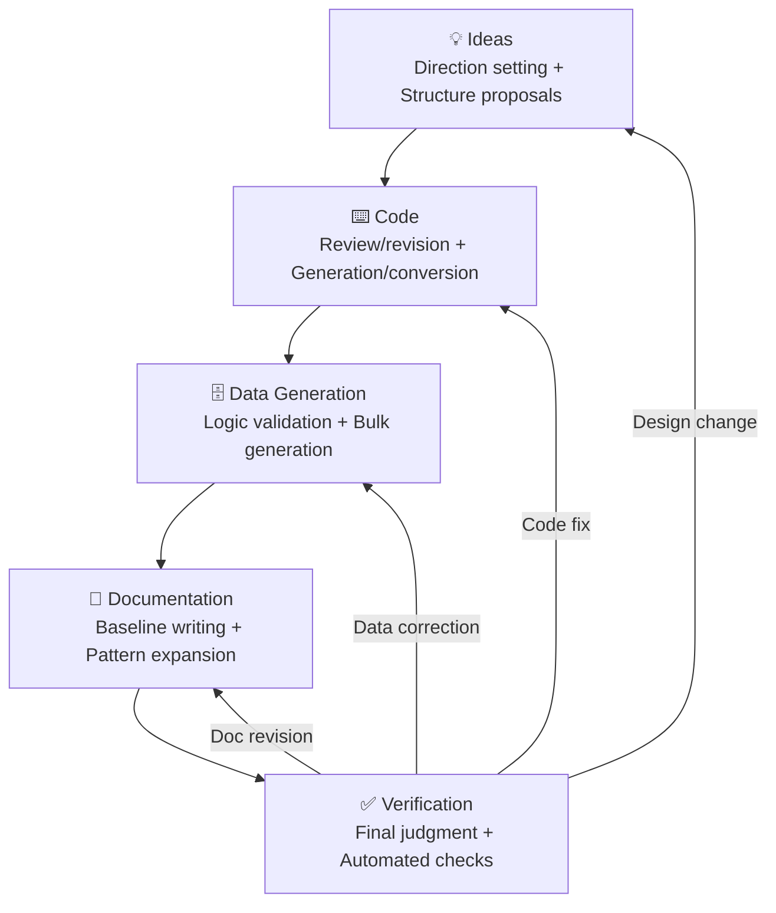

# SQL Tutorial <small>v{{version}}</small> <small style="font-size:0.5em; color:gray;">{{date}}</small>

A hands-on SQL tutorial using a realistic **e-commerce database** (30 tables · 680K rows).

Learn SQL by querying 10 years of business data from **TechShop**, a fictional online store selling computers and peripherals. Progress systematically through **26 lessons · 270 exercises**, from basics to advanced topics.
Supports **SQLite, MySQL, and PostgreSQL** simultaneously — all examples and exercises include DB-specific tabs for comparison.

## About the Author

**Youngje Ahn** (civilian7@gmail.com) · **Fullbit Computing** · **CEO**

I first encountered programming in 1983 with an 8-bit computer and BASIC, and have been a professional programmer since 1989. Over the years, I've worked across finance, government, healthcare, IoT, and real estate, building programs in many languages. Among them, Delphi has been my primary language for over 30 years, starting from version 1.0. I run the Delphi community [Delmadang](https://cafe.naver.com/delmadang).

Online, I go by **"Country Programmer"** — a name I adopted while living in the countryside of Hongcheon, Gangwon Province. After encountering AI, the creative drive I had in my twenties came rushing back, and I moved back to the city. I currently run Fullbit Computing in Hanam, Gyeonggi Province, developing a universal query browser called **ezQuery**.

For feature suggestions, bug reports, or inquiries, please contact [civilian7@gmail.com](mailto:civilian7@gmail.com).

!!! note "What is ezQuery?"
    **ezQuery** is a universal query browser that manages multiple databases — SQLite, MySQL, PostgreSQL, Oracle, SQL Server, Tibero, and more — through a single interface. Built with Delphi, it uses **DirectX (Direct2D)** rendering to smoothly display large datasets.

    - **Fast** — Native binary + DirectX rendering for instant scrolling through hundreds of thousands of rows
    - **Keyboard-friendly** — Monaco editor-based SQL editor with shortcut-driven workflow
    - **AI Assistant** — AI that automatically recognizes schema context for SQL generation, error correction, and execution plan analysis
    - **All-in-one** — Table designer, ERD viewer, visual query builder, data import/export
    - **Multi-DB** — Designed from the ground up with a DB abstraction layer, making it easy to add new databases
    - **Multilingual** — Supports Korean and English by default, with architecture designed for easy addition of other languages

    We plan to include this tutorial's database as a sample. The product is currently in development, and we'll announce it separately upon release. We plan to offer a free **Community Edition** and a paid **Pro Edition** with advanced features.

## Why I Created This Tutorial

It started while creating a sample database for **ezQuery**. As I worked on it, I recalled the frustrations of my junior days — **wanting to learn SQL but having nowhere to practice with real data**. So I expanded it beyond a simple sample into a proper tutorial, and I'm sharing it in hopes of helping anyone with the same struggle.

## Collaboration with AI

This tutorial was created in collaboration with **[Claude](https://claude.ai)** (Anthropic). From the data model, generator code, lessons, exercises, DB-specific DDL/views/stored procedures, to this document itself — every step involved working with AI.

However, we didn't simply use AI-generated output as-is. At each stage, roles were clearly divided:

| Stage | Human | AI |
|-------|-------|-----|
| Ideas | Direction setting, requirements definition | Structure proposals, initial drafts |
| Code | Review/revision, execution/debugging | Code generation, DB syntax conversion |
| Data | Business logic validation | Bulk data generation/conversion |
| Documentation | Wrote the first lesson directly (baseline) | Pattern learning, then expanding the rest |
| Verification | Final judgment | Automated checking of number mismatches, broken links, DDL differences |

We repeated this cycle hundreds of times to improve quality.

The human focuses on **"Is this correct?"** while the AI handles **"fast and at scale."** Thanks to this combination, work that would have taken months alone was completed in a much shorter time.

## Why Python?

My primary languages are Delphi and C/C++, but the data generator is written in Python.

- **Faker library** — The only option for generating realistic fake data (Korean names, addresses, phone numbers) by locale
- **Minimal barrier to entry** — Readers are here to learn SQL. They may not know Delphi and have no reason to purchase a commercial license. With Python, anyone can start with a single `pip install`
- **Cross-platform** — Works identically on Windows, macOS, and Linux
- **AI collaboration efficiency** — Python is the language AI handles best. Collaboration speed is maximized at every stage: code generation, refactoring, and debugging

The right tool for the right job. For a one-time task like data generation, Python — with its rich ecosystem and high accessibility — was the optimal choice.

## Why This Tutorial?

SQL is hard to learn from books alone. Memorizing syntax doesn't enable you to write queries, and 10-row samples don't build real-world intuition. This tutorial is a **"learn by querying"** resource.

**Realistic data** — 680K rows of data from a growing online store over 10 years includes sales growth trends, year-end peaks, customer churn, NULLs, and outliers. Not textbook-clean data, but the real thing you encounter in practice.

**Three databases at once** — Solve the same problems in SQLite, MySQL, and PostgreSQL. Compare DB-specific syntax with a single tab switch, building SQL skills that aren't tied to any particular database.

**Data you build yourself** — A seed-based generator is included, letting you freely adjust data size, language, and noise. You can use the tutorial's data as-is or create your own.

| Traditional Resources | This Tutorial |
|-----------------------|--------------|
| Syntax explanations only, no practice data | **680K rows** with 10-year growth curves, seasonality, and customer behavior |
| Covers only one DB | **SQLite, MySQL, PostgreSQL** — same problems across three DBs |
| Answers only | Full answers + explanations + result tables for all **270 problems** |
| Fixed data, no customization | **Seed-based generator** — freely adjust size, language, and noise |
| Grammar-listing format | Practice centered on shopping mall **business scenarios** |
| English or Korean only | Both data and documentation in **Korean/English** |

## Supported Databases { #supported-databases }

This tutorial supports three databases simultaneously. Each has different characteristics — choose based on your needs, or try all three.

### SQLite

A single file is the database. No server installation needed — you can use it immediately with just the Python standard library, no `pip install` required. This is the default DB for this tutorial.

| Pros | Cons |
|------|------|
| No installation needed, deploy by copying a file | Limited concurrent writes (single writer) |
| Lightweight and fast (embedded) | No user management or access control |
| Supports most of the SQL standard | No stored procedure support |
| Embedded in mobile and desktop apps | Not suitable for large-scale concurrent access |

### MySQL / MariaDB

The world's most widely used open-source RDBMS. It's the standard for web services, and MariaDB is a compatible fork of MySQL. The MySQL SQL in this tutorial runs as-is on MariaDB.

| Pros | Cons |
|------|------|
| Rich ecosystem, hosting support | Some SQL standard non-compliance (FULL OUTER JOIN, etc.) |
| Excellent read performance, easy replication | Subquery optimization weaker than PG |
| Convenience features like ENUM, AUTO_INCREMENT | CHECK constraints only enforced from 8.0.16+ |
| Cloud support: AWS RDS, Cloud SQL, etc. | Window functions only from 8.0+ |

### PostgreSQL

The open-source RDBMS with the highest standards compliance. It excels in complex queries, JSON processing, and extensibility, and is especially popular in data analytics and geospatial (PostGIS) domains.

| Pros | Cons |
|------|------|
| Highest SQL standard compliance | May be slightly slower than MySQL for simple reads |
| Rich types: JSONB, arrays, range types | Configuration somewhat complex for beginners |
| Native Materialized Views, partitioning | Default replication setup more complex than MySQL |
| PL/pgSQL, custom types, extension modules | Less web hosting support than MySQL |

### Future Support Plans

Currently supporting SQLite, MySQL, and PostgreSQL, we plan to add support for the following databases in the future.

| Database | Status | Notes |
|----------|:------:|-------|
| Oracle | Planned | #1 enterprise market share, PL/SQL |
| SQL Server | Planned | .NET ecosystem, T-SQL |
| DB2 | Under review | Legacy in finance and government |
| CUBRID | Under review | Korean open-source RDBMS |
| Tibero | Under review | Korean commercial RDBMS, Oracle-compatible |

The data generator's architecture separates DB-specific exporters as plugins, so adding a new DB only requires writing DDL/data conversion modules. Contributions are welcome.

## What You'll Learn

### Beginner — 7 Lessons · 62 Problems

Learn the most fundamental SQL syntax. After this stage, you'll be able to query, filter, sort, and aggregate data from a single table. No programming experience required to start.

| # | Lesson | What You Learn | What You Can Do |
|:-:|--------|----------------|----------------|
| 00 | Introduction to Databases and SQL | DB concepts, tables/rows/columns | Understand DB structure and run queries in a SQL tool |
| 01 | SELECT Basics | Column selection, aliases, DISTINCT | Select only the columns you need |
| 02 | Filtering with WHERE | Comparison operators, AND/OR, IN, LIKE, BETWEEN | Extract only rows matching conditions |
| 03 | Sorting and Paging | ORDER BY, LIMIT, OFFSET | Sort results in desired order and extract top N rows |
| 04 | Aggregate Functions | COUNT, SUM, AVG, MIN, MAX | Calculate summary statistics: totals, sums, averages |
| 05 | GROUP BY and HAVING | Group-level aggregation, group filtering | Analyze by category, month, or other groupings |
| 06 | NULL Handling | IS NULL, COALESCE, IFNULL | Properly handle empty values and set defaults |

### Intermediate — 11 Lessons · 84 Problems

Combine multiple tables and transform/manipulate data. After this stage, you'll be able to write most SQL needed in practice — covering JOINs, subqueries, DML, DDL, and transactions.

| # | Lesson | What You Learn | What You Can Do |
|:-:|--------|----------------|----------------|
| 07 | INNER JOIN | ON conditions, multiple JOINs | Combine orders + customers + products in a single query |
| 08 | LEFT JOIN | Outer joins, NULL matching | Find customers with no orders, products with no reviews |
| 09 | Subqueries | Scalar, inline views, WHERE clause | Extract products above average price, top buyers |
| 10 | CASE Expressions | Conditional branching, pivoting, categorization | Classify by price range, convert rows to columns |
| 11 | Date/Time Functions | Extraction, calculation, formatting, DB differences | Monthly sales trends, days from signup to first order |
| 12 | String Functions | SUBSTR, REPLACE, CONCAT | Extract email domains, process product names |
| 13 | UNION | Union, INTERSECT, EXCEPT | Combine results from multiple queries |
| 14 | INSERT, UPDATE, DELETE | Data insertion, modification, deletion | Register new customers, bulk price changes, data cleanup |
| 15 | DDL | CREATE TABLE, ALTER, constraints | Create/modify tables, set PK/FK/CHECK |
| 16 | Transactions and ACID | BEGIN, COMMIT, ROLLBACK | Process orders + payments atomically, rollback on failure |
| 17 | SELF JOIN and CROSS JOIN | Self-reference, Cartesian product | Query manager hierarchies, generate date × category combinations |

### Advanced — 8 Lessons · 124 Problems

Expand to production-level analytical queries, performance tuning, and DB design. After this stage, you'll be able to calculate rankings, cumulative totals, and moving averages with window functions, read execution plans, design indexes, and write stored procedures.

| # | Lesson | What You Learn | What You Can Do |
|:-:|--------|----------------|----------------|
| 18 | Window Functions | ROW_NUMBER, RANK, LAG/LEAD | Ranking, month-over-month growth, cumulative sums |
| 19 | CTEs and Recursive CTEs | WITH clause, recursive hierarchy traversal | Make complex queries readable, traverse category trees |
| 20 | EXISTS and Correlated Subqueries | EXISTS/NOT EXISTS patterns | Determine existence of related data matching conditions |
| 21 | Views | CREATE VIEW, Materialized View | Save frequently-used complex queries as views for reuse |
| 22 | Indexes and Performance | EXPLAIN, index design | Find causes of slow queries and improve with indexes |
| 23 | Triggers | BEFORE/AFTER triggers | Automatically log history and validate on data changes |
| 24 | JSON Data Queries | JSON extraction/filtering, DB differences | Extract values from JSON columns, conditional searches |
| 25 | Stored Procedures | PL/pgSQL, MySQL procedures | Encapsulate business logic inside the database |

### Exercises — 23 Sets · 270 Problems

Apply the syntax learned in lessons to real business data. Every problem includes an answer, explanation, and result table.

### Beginner Exercises (4 Sets · 62 Problems)

Practice SELECT, WHERE, aggregation, GROUP BY, and NULL from beginner lessons (00-06) with real data. Build the ability to accurately extract desired data from a single table.

| Set | Required Knowledge | Purpose | What You Gain |
|-----|-------------------|---------|---------------|
| Product Search | SELECT, WHERE, ORDER BY, LIMIT | Search products with various condition combinations | Practical sense for filtering, sorting, and paging |
| Customer Analysis | Aggregate functions, GROUP BY, HAVING | Calculate customer statistics by tier, gender, signup channel | Ability to analyze data by grouping |
| Order Basics | GROUP BY, HAVING, date filtering | Summarize order data by period and status | Aggregate queries that form the basis of business reports |
| Fill in the Blanks | All beginner topics | Complete incomplete SQL by filling in blanks | Solidify syntax structures in your mind |

### Intermediate Exercises (7 Sets · 84 Problems)

Combine JOINs, subqueries, CASE, DML, DDL, and transactions from intermediate lessons (07-17). Build practical ability to combine, transform, and manipulate data across multiple tables.

| Set | Required Knowledge | Purpose | What You Gain |
|-----|-------------------|---------|---------------|
| JOIN Master | INNER/LEFT/RIGHT JOIN | Combine orders + customers + products + payments in various ways | Ability to judge which JOIN to use when |
| Date/Time Analysis | Date functions, GROUP BY | Monthly sales trends, day-of-week patterns, period calculations | Practical patterns for working with time-series data |
| Subqueries & Transformations | Subqueries, EXISTS, CASE | Above-average products, tier classification, data transformation | Ability to solve complex conditions within queries |
| Constraint Experience | DDL, PK/FK/CHECK/UNIQUE | Try INSERTs that violate constraints and observe errors | Understanding how constraints ensure data integrity |
| Transactions | BEGIN, COMMIT, ROLLBACK | Experience success/failure scenarios firsthand | Feel the meaning of atomicity and the need for rollback |
| SQL Debugging | All intermediate topics | Find and fix intentionally broken queries | Debugging ability to read errors and identify causes |
| Data Quality Checks | NULL, JOIN, aggregation | Detect NULLs, duplicates, and referential integrity violations | Practical patterns for verifying data consistency |

### Advanced Exercises (12 Sets · 124 Problems)

Apply window functions, CTEs, EXISTS, views, indexes, triggers, JSON, and stored procedures from advanced lessons (18-25) to production-level business scenarios — covering analytical report writing, performance tuning, and technical interview preparation.

| Set | Required Knowledge | Purpose | What You Gain |
|-----|-------------------|---------|---------------|
| Sales Analysis | Window functions, CTE | Monthly growth rates, moving averages, cumulative sales | Sales analysis queries suitable for executive reports |
| Customer Segmentation | NTILE, CTE, CASE, JOIN | RFM analysis, cohorts, tier migration patterns | Customer classification techniques used in marketing targeting |
| Inventory Management | Window functions, subqueries | Track in/out movements, safety stock calculation, ABC classification | Inventory management queries used by operations teams |
| CS Performance Analysis | JOIN, aggregation, date functions | Per-agent throughput, resolution rates, SLA compliance | Ability to measure CS team performance numerically |
| Practical SQL Patterns | Window functions, CTE, CASE | Pivoting, gap detection, consecutive ranges, missing data imputation | Patterns for solving common real-world challenges |
| Understanding Normalization | DDL, FK, design concepts | Identify 1NF-3NF, denormalization trade-offs | Ability to judge table design principles and exceptions |
| Business Scenarios | Full range, composite | Write composite queries for real business decisions | Ability to answer "What can we learn from this data?" |
| Query Optimization | EXPLAIN, indexes | EXPLAIN analysis, index design, query refactoring | Ability to find and fix causes of slow queries |
| Interview Prep | Full range | Commonly asked SQL problems in technical interviews | Confidence to write queries in front of an interviewer |
| Advanced Analytics | Recursive CTE, JSON, window functions | Hierarchy traversal, JSON processing, composite analysis | Ability to use advanced SQL features fluently |
| Challenge Problems | Full range, composite | High-difficulty problems combining multiple concepts | Ability to solve complex requirements as queries under time pressure |
| Execution Plan Analysis | EXPLAIN, indexes, join strategies | Read EXPLAIN output and identify bottlenecks | Ability to diagnose "why a query is slow" |

---

## Study Tips

Follow the lessons **in numerical order**. Each lesson builds on what was covered before.

- **Type it yourself** — Typing by hand sticks in memory better than copy-pasting.
- **Always solve the review problems** — Each lesson ends with problems that check the key concepts.
- **Modify the queries** — Change conditions, add columns, or intentionally cause errors. Understanding why the results change is the key.
- **Write the same result in different ways** — Try different approaches using subqueries, JOINs, CTEs, etc. to feel the pros and cons of each syntax.
- **Get in the habit of reading error messages** — SQL error messages usually pinpoint the cause and location precisely. Read the message before searching online.
- **Run on other DBs too** — Running queries learned in SQLite on MySQL and PostgreSQL helps you feel the differences. Use the **DB-specific tabs** in each lesson.

### Recommended Study Schedule

Adjust to your own pace. Based on 1-2 hours per day.

=== "2 Weeks (Intensive)"

    For those who want to quickly cover everything. When you can invest 2+ hours per day.

    | Week | Days | Content |
    |:----:|------|---------|
    | 1 | Days 1-3 | Beginner lessons 00-06 + Beginner exercises |
    | | Days 4-5 | Intermediate lessons 07-12 (JOIN, subqueries, CASE, date/string) |
    | | Days 6-7 | Intermediate lessons 13-17 (UNION, DML, DDL, transactions) + Intermediate exercises |
    | 2 | Days 1-3 | Advanced lessons 18-21 (window functions, CTE, EXISTS, views) |
    | | Days 4-5 | Advanced lessons 22-25 (indexes, triggers, JSON, SP) |
    | | Days 6-7 | Intensive advanced exercises |

=== "4 Weeks (Standard)"

    Recommended for working professionals and students. 1 hour/day, 5 days/week.

    | Week | Days | Content |
    |:----:|------|---------|
    | 1 | Mon-Fri | Beginner lessons 00-06 + Beginner exercises |
    | 2 | Mon-Wed | Intermediate lessons 07-11 (JOIN, subqueries, CASE, date/time) |
    | | Thu-Fri | Intermediate lessons 12-14 (string, UNION, DML) |
    | 3 | Mon-Wed | Intermediate lessons 15-17 (DDL, transactions, SELF/CROSS JOIN) + Intermediate exercises |
    | | Thu-Fri | Advanced lessons 18-19 (window functions, CTE) |
    | 4 | Mon-Wed | Advanced lessons 20-25 (EXISTS, views, indexes, triggers, JSON, SP) |
    | | Thu-Fri | Intensive advanced exercises |

=== "8 Weeks (Relaxed)"

    For those new to SQL. 30 min - 1 hour/day, 3-4 days/week.

    | Week | Content |
    |:----:|---------|
    | Weeks 1-2 | Beginner lessons 00-06 (1 lesson/day) |
    | Week 3 | Beginner exercises (4 sets) + Review |
    | Weeks 4-5 | Intermediate lessons 07-12 (JOIN - string functions) |
    | Week 6 | Intermediate lessons 13-17 (UNION - SELF JOIN) + Intermediate exercises |
    | Week 7 | Advanced lessons 18-25 |
    | Week 8 | Intensive advanced exercises + Full review |

---

## License

- **Tutorial documents and generated data** — [CC BY 4.0](https://creativecommons.org/licenses/by/4.0/) (free to use, modify, and redistribute with attribution)
- **Source code** (generator, scripts, etc.) — [MIT License](https://opensource.org/licenses/MIT)

## Changelog

| Version | Date | Key Changes |
|:-------:|:----:|-------------|
| v2.1 | 2026-04-11 | Document structure overhaul (schema/setup split), 18 MySQL/PG views added, expanded to 15 stored procedures, trigger/view/SP flowcharts, DB selection guide, study schedule |
| v2.0 | 2026-04-01 | Full renewal — 30 tables, 3 DB simultaneous support, 270 exercises, Korean/English support, seed-based generator |
| v1.0 | 2025-12-01 | Initial release — SQLite only, 10 tables, basic lessons |

[Get Started →](setup/index.md){ .md-button .md-button--primary }
