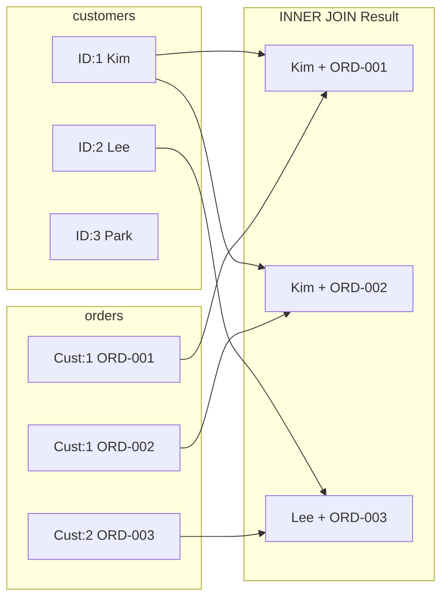

# Lesson 7: INNER JOIN

A `JOIN` combines rows from two or more tables based on a related column. `INNER JOIN` returns only the rows where a match exists in **both** tables — unmatched rows are excluded entirely.



> INNER JOIN returns only rows that match in both tables. Park (ID:3) has no orders and is excluded.

{ .off-glb width="300"  }

## Joining Two Tables

The syntax is `FROM table_a INNER JOIN table_b ON table_a.key = table_b.key`. The `ON` clause specifies the matching condition.

```sql
-- Show orders with customer names
SELECT
    o.order_number,
    c.name        AS customer_name,
    o.status,
    o.total_amount
FROM orders AS o
INNER JOIN customers AS c ON o.customer_id = c.id
ORDER BY o.ordered_at DESC
LIMIT 5;
```

**Result:**

| order_number | customer_name | status | total_amount |
|--------------|---------------|--------|-------------:|
| ORD-20241231-09842 | Jennifer Martinez | confirmed | 2349.00 |
| ORD-20241231-09841 | David Park | delivered | 149.99 |
| ORD-20241231-09840 | Sarah Johnson | shipped | 89.99 |
| ORD-20241230-09839 | Robert Kim | confirmed | 749.00 |
| ORD-20241230-09838 | Alex Chen | cancelled | 329.97 |

> **Table aliases** (`o`, `c`) shorten the query and make `ON` conditions easier to read. They are optional but strongly recommended when joining multiple tables.

## Why INNER JOIN Excludes Non-Matches

If a customer has never placed an order, they do not appear in this result — there is no matching row in `orders`. Similarly, an order cannot exist without a customer (due to the foreign key constraint), so all orders will match.

```sql
-- Confirm: all orders have a matching customer
SELECT COUNT(*) AS orders_without_customer
FROM orders o
LEFT JOIN customers c ON o.customer_id = c.id
WHERE c.id IS NULL;
```

## Joining Three or More Tables

Chain additional `JOIN` clauses. Each one links to a table already in scope.

```sql
-- Order items with product name and category name
SELECT
    oi.id           AS item_id,
    o.order_number,
    p.name          AS product_name,
    cat.name        AS category,
    oi.quantity,
    oi.unit_price
FROM order_items AS oi
INNER JOIN orders     AS o   ON oi.order_id   = o.id
INNER JOIN products   AS p   ON oi.product_id = p.id
INNER JOIN categories AS cat ON p.category_id = cat.id
ORDER BY o.ordered_at DESC
LIMIT 6;
```

**Result:**

| item_id | order_number       | product_name                                     | category | quantity | unit_price |
| ------: | ------------------ | ------------------------------------------------ | -------- | -------: | ---------: |
|   84249 | ORD-20250630-34900 | AMD Ryzen 9 9900X                                | AMD      |        1 |     244800 |
|   84250 | ORD-20250630-34900 | 기가바이트 X870 AORUS ELITE AX 실버                     | AMD 소켓   |        1 |     429700 |
|   84251 | ORD-20250630-34900 | TeamGroup T-Force Delta RGB DDR5 32GB 6000MHz 실버 | DDR5     |        1 |     178800 |
|   84252 | ORD-20250630-34900 | SK하이닉스 Platinum P41 1TB                          | SSD      |        1 |     217400 |
| ...     | ...                | ...                                              | ...      | ...      | ...        |

## Aggregating After Joining

Join first, then aggregate. The joined table gives you the columns you need for grouping.

```sql
-- Total revenue per product category
SELECT
    cat.name        AS category,
    COUNT(DISTINCT o.id) AS order_count,
    SUM(oi.quantity)     AS units_sold,
    SUM(oi.quantity * oi.unit_price) AS gross_revenue
FROM order_items AS oi
INNER JOIN orders     AS o   ON oi.order_id   = o.id
INNER JOIN products   AS p   ON oi.product_id = p.id
INNER JOIN categories AS cat ON p.category_id = cat.id
WHERE o.status IN ('delivered', 'confirmed')
GROUP BY cat.name
ORDER BY gross_revenue DESC
LIMIT 8;
```

**Result:**

| category | order_count | units_sold | gross_revenue |
| -------- | ----------: | ---------: | ------------: |
| 게이밍 노트북  |        1526 |       1578 |    5079102000 |
| 게이밍 모니터  |        1986 |       2129 |    2774777100 |
| AMD      |        2976 |       3443 |    2588771300 |
| ...      | ...         | ...        | ...           |

## Filtering Across Joined Tables

You can apply `WHERE` conditions to any table in the join.

```sql
-- VIP customer orders over $1,000 in 2024
SELECT
    c.name          AS customer_name,
    o.order_number,
    o.total_amount,
    o.ordered_at
FROM orders AS o
INNER JOIN customers AS c ON o.customer_id = c.id
WHERE c.grade = 'VIP'
  AND o.total_amount > 1000
  AND o.ordered_at LIKE '2024%'
ORDER BY o.total_amount DESC;
```

!!! note "Lesson Review"
    Quick exercises to check your understanding of this lesson. For comprehensive practice combining multiple concepts, see the [Exercises](../exercises/index.md) section.

## Practice Exercises

### Exercise 1
List each review with the customer's `name` and the product's `name`. Return `review_id`, `customer_name`, `product_name`, `rating`, and `created_at`. Sort by `rating` descending, then `created_at` descending. Limit to 10 rows.

??? success "Answer"
    ```sql
    SELECT
        r.id          AS review_id,
        c.name        AS customer_name,
        p.name        AS product_name,
        r.rating,
        r.created_at
    FROM reviews AS r
    INNER JOIN customers AS c ON r.customer_id = c.id
    INNER JOIN products  AS p ON r.product_id  = p.id
    ORDER BY r.rating DESC, r.created_at DESC
    LIMIT 10;
    ```

    **Expected result:**

    | review_id | customer_name | product_name                     | rating | created_at          |
    | --------: | ------------- | -------------------------------- | -----: | ------------------- |
    |      7935 | 안지원           | 녹투아 NH-D15 G2 실버                 |      5 | 2025-07-14 13:30:30 |
    |      7943 | 박종수           | 시소닉 VERTEX GX-1200 화이트           |      5 | 2025-07-10 13:58:14 |
    |      7942 | 이승민           | MSI Radeon RX 9070 VENTUS 3X 화이트 |      5 | 2025-07-08 22:13:45 |
    |      7917 | 김재현           | SteelSeries Arctis Nova 1 실버     |      5 | 2025-07-05 00:42:20 |
    |      7941 | 곽은지           | 필립스 27E1N5300AE 화이트              |      5 | 2025-07-02 19:10:28 |
    | ...       | ...           | ...                              | ...    | ...                 |


### Exercise 2
For each payment method, count how many distinct customers have used it. Return `method` and `unique_customers`, sorted by `unique_customers` descending.

??? success "Answer"
    ```sql
    SELECT
        p.method,
        COUNT(DISTINCT o.customer_id) AS unique_customers
    FROM payments AS p
    INNER JOIN orders AS o ON p.order_id = o.id
    WHERE p.status = 'completed'
    GROUP BY p.method
    ORDER BY unique_customers DESC;
    ```

    **Expected result:**

    | method        | unique_customers |
    | ------------- | ---------------: |
    | card          |             2212 |
    | kakao_pay     |             1694 |
    | naver_pay     |             1532 |
    | bank_transfer |             1240 |
    | point         |              858 |
    | ...           | ...              |


### Exercise 3
Find the top 5 customers by total amount spent (sum of `total_amount` for non-cancelled, non-returned orders). Return `customer_name`, `grade`, `order_count`, and `total_spent`.

??? success "Answer"
    ```sql
    SELECT
        c.name   AS customer_name,
        c.grade,
        COUNT(o.id)         AS order_count,
        SUM(o.total_amount) AS total_spent
    FROM orders AS o
    INNER JOIN customers AS c ON o.customer_id = c.id
    WHERE o.status NOT IN ('cancelled', 'returned', 'return_requested')
    GROUP BY c.id, c.name, c.grade
    ORDER BY total_spent DESC
    LIMIT 5;
    ```

    **Expected result:**

    | customer_name | grade | order_count | total_spent |
    | ------------- | ----- | ----------: | ----------: |
    | 박정수           | VIP   |         305 |   339169936 |
    | 강명자           | VIP   |         240 |   296857745 |
    | 김병철           | VIP   |         319 |   291265567 |
    | 이영자           | VIP   |         316 |   284642204 |
    | 이미정           | VIP   |         210 |   233243838 |


### Exercise 4
Show the `order_number`, `customer_name`, and `status` for orders whose status is `'shipped'`. Sort by `ordered_at` descending and limit to 10 rows.

??? success "Answer"
    ```sql
    SELECT
        o.order_number,
        c.name   AS customer_name,
        o.status
    FROM orders AS o
    INNER JOIN customers AS c ON o.customer_id = c.id
    WHERE o.status = 'shipped'
    ORDER BY o.ordered_at DESC
    LIMIT 10;
    ```

    **Expected result:**

    | order_number       | customer_name | status  |
    | ------------------ | ------------- | ------- |
    | ORD-20250624-34826 | 황정자           | shipped |
    | ORD-20250624-34828 | 조현주           | shipped |
    | ORD-20250624-34824 | 김보람           | shipped |
    | ORD-20250623-34821 | 박민재           | shipped |
    | ORD-20250623-34811 | 김현주           | shipped |
    | ...                | ...           | ...     |


### Exercise 5
Join the `shipping` and `orders` tables to list delivered shipments. Return `order_number`, `carrier`, `tracking_number`, and `delivered_at`. Sort by `delivered_at` descending and limit to 10 rows.

??? success "Answer"
    ```sql
    SELECT
        o.order_number,
        s.carrier,
        s.tracking_number,
        s.delivered_at
    FROM shipping AS s
    INNER JOIN orders AS o ON s.order_id = o.id
    WHERE s.status = 'delivered'
    ORDER BY s.delivered_at DESC
    LIMIT 10;
    ```

    **Expected result:**

    | order_number       | carrier | tracking_number | delivered_at        |
    | ------------------ | ------- | --------------: | ------------------- |
    | ORD-20250624-34830 | CJ대한통운  |    103333059906 | 2025-07-01 20:10:25 |
    | ORD-20250624-34829 | 로젠택배    |    614503009436 | 2025-06-30 18:35:39 |
    | ORD-20250622-34800 | 우체국택배   |    416412176078 | 2025-06-29 21:54:10 |
    | ORD-20250623-34813 | CJ대한통운  |    262906125281 | 2025-06-29 18:51:58 |
    | ORD-20250624-34825 | CJ대한통운  |    467378588800 | 2025-06-28 22:21:44 |
    | ...                | ...     | ...             | ...                 |


### Exercise 6
From `order_items`, show the product name (`products.name`), supplier name (`suppliers.company_name`), quantity, and unit price. Join three tables and sort by unit price descending. Limit to 10 rows.

??? success "Answer"
    ```sql
    SELECT
        p.name          AS product_name,
        sup.company_name AS supplier_name,
        oi.quantity,
        oi.unit_price
    FROM order_items AS oi
    INNER JOIN products  AS p   ON oi.product_id  = p.id
    INNER JOIN suppliers AS sup ON p.supplier_id   = sup.id
    ORDER BY oi.unit_price DESC
    LIMIT 10;
    ```

    **Expected result:**

    | product_name        | supplier_name | quantity | unit_price |
    | ------------------- | ------------- | -------: | ---------: |
    | ASUS ROG Strix GT35 | 에이수스코리아       |        1 |    4314800 |
    | ASUS ROG Strix GT35 | 에이수스코리아       |        1 |    4314800 |
    | ASUS ROG Strix GT35 | 에이수스코리아       |        1 |    4314800 |
    | ASUS ROG Strix GT35 | 에이수스코리아       |        1 |    4314800 |
    | ASUS ROG Strix GT35 | 에이수스코리아       |        9 |    4314800 |
    | ...                 | ...           | ...      | ...        |


### Exercise 7
For each supplier, find the total number of orders containing their products (`order_count`) and the total quantity sold (`total_qty`). Return `company_name`, `order_count`, and `total_qty`, sorted by `total_qty` descending.

??? success "Answer"
    ```sql
    SELECT
        sup.company_name,
        COUNT(DISTINCT oi.order_id) AS order_count,
        SUM(oi.quantity)            AS total_qty
    FROM order_items AS oi
    INNER JOIN products  AS p   ON oi.product_id = p.id
    INNER JOIN suppliers AS sup ON p.supplier_id  = sup.id
    GROUP BY sup.id, sup.company_name
    ORDER BY total_qty DESC;
    ```

    **Expected result:**

    | company_name | order_count | total_qty |
    | ------------ | ----------: | --------: |
    | 삼성전자 공식 유통   |        6587 |      7743 |
    | 로지텍코리아       |        6238 |      7573 |
    | 서린시스테크       |        4842 |      6278 |
    | 스틸시리즈코리아     |        4755 |      5483 |
    | 에이수스코리아      |        4611 |      5242 |
    | ...          | ...         | ...       |


### Exercise 8
For each staff member, count the orders they handled (`order_count`) and total revenue (`total_revenue`). Exclude cancelled and returned orders. Return `staff_name`, `department`, `order_count`, and `total_revenue`. Sort by `total_revenue` descending and limit to 10.

??? success "Answer"
    ```sql
    SELECT
        st.name        AS staff_name,
        st.department,
        COUNT(o.id)         AS order_count,
        SUM(o.total_amount) AS total_revenue
    FROM orders AS o
    INNER JOIN staff AS st ON o.staff_id = st.id
    WHERE o.status NOT IN ('cancelled', 'returned', 'return_requested')
    GROUP BY st.id, st.name, st.department
    ORDER BY total_revenue DESC
    LIMIT 10;
    ```

---
Next: [Lesson 8: LEFT JOIN](08-left-join.md)
