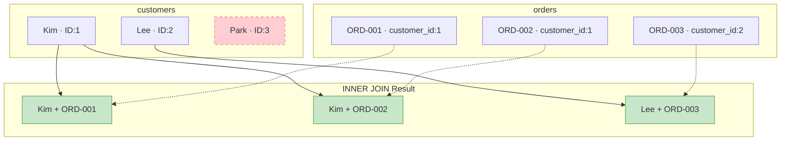

# Lesson 8: INNER JOIN

So far, we've only queried data from a single table. But in practice, you often need to combine data from multiple tables, like finding 'the name of the customer who placed an order'. In this lesson, you'll learn how to connect tables using INNER JOIN.

!!! note "Already familiar?"
    If you're comfortable with INNER JOIN, ON conditions, and multi-table JOINs, skip ahead to [Lesson 9: LEFT JOIN](09-left-join.md).

`JOIN` combines rows from two or more tables based on related columns. `INNER JOIN` returns only the rows that match in **both** tables -- unmatched rows are excluded from the result.



> **INNER JOIN** returns only rows that match in both tables. Park (ID:3) has no orders, so they are excluded from the result.

{ .off-glb width="300"  }

## Joining Two Tables

The syntax is `FROM table_a INNER JOIN table_b ON table_a.key = table_b.key`. The `ON` clause specifies the matching condition.

```sql
-- Query orders with customer names
SELECT
    o.order_number,
    c.name        AS customer_name,
    o.status,
    o.total_amount
FROM orders AS o
INNER JOIN customers AS c ON o.customer_id = c.id
ORDER BY o.ordered_at DESC
LIMIT 5;
```

**Result:**

| order_number | customer_name | status | total_amount |
| ---------- | ---------- | ---------- | ----------: |
| ORD-20251211-413965 | 송광수 | pending | 409600.0 |
| ORD-20251226-416837 | 송광수 | pending | 1169700.0 |
| ORD-20251231-417734 | 류미숙 | pending | 2076300.0 |
| ORD-20251231-417696 | 김영미 | return_requested | 814400.0 |
| ORD-20251231-417737 | 이영미 | pending | 550600.0 |
| ... | ... | ... | ... |

> **Table aliases** (`o`, `c`) make queries shorter and `ON` conditions easier to read. While not required, they are strongly recommended when joining multiple tables.

## Why INNER JOIN Excludes Unmatched Rows

Customers who have never placed an order do not appear in the result -- because there is no matching row in `orders`. Conversely, thanks to foreign key constraints, every order must have a customer, so all orders are matched.

```sql
-- Check: Are there any orders without a customer?
SELECT COUNT(*) AS orders_without_customer
FROM orders o
LEFT JOIN customers c ON o.customer_id = c.id
WHERE c.id IS NULL;
```

## Joining Three or More Tables

Chain additional `JOIN` clauses. Each one connects to the already-combined tables.

```sql
-- Include product name and category name in order items
SELECT
    oi.id           AS item_id,
    o.order_number,
    p.name          AS product_name,
    cat.name        AS category,
    oi.quantity,
    oi.unit_price
FROM order_items AS oi
INNER JOIN orders     AS o   ON oi.order_id   = o.id
INNER JOIN products   AS p   ON oi.product_id = p.id
INNER JOIN categories AS cat ON p.category_id = cat.id
ORDER BY o.ordered_at DESC
LIMIT 6;
```

**Result:**

| item_id | order_number | product_name | category | quantity | unit_price |
| ----------: | ---------- | ---------- | ---------- | ----------: | ----------: |
| 1005850 | ORD-20251211-413965 | Windows 11 Pro | OS | 1 | 409600.0 |
| 1012839 | ORD-20251226-416837 | MSI Radeon RX 7800 XT GAMING X 실버 | AMD | 1 | 994000.0 |
| 1012840 | ORD-20251226-416837 | Razer Huntsman V3 Pro Mini 화이트 | 기계식 | 1 | 175700.0 |
| 1015035 | ORD-20251231-417734 | NZXT Kraken 240 실버 | 수랭 | 1 | 169800.0 |
| 1015036 | ORD-20251231-417734 | BenQ PD2725U | 전문가용 모니터 | 1 | 1596100.0 |
| 1015037 | ORD-20251231-417734 | Razer Huntsman V3 Pro 실버 | 기계식 | 1 | 251300.0 |
| ... | ... | ... | ... | ... | ... |

## Aggregation After JOIN

Perform the join first, then aggregate. You can use columns from joined tables for grouping.

```sql
-- Total revenue by product category
SELECT
    cat.name        AS category,
    COUNT(DISTINCT o.id) AS order_count,
    SUM(oi.quantity)     AS units_sold,
    SUM(oi.quantity * oi.unit_price) AS gross_revenue
FROM order_items AS oi
INNER JOIN orders     AS o   ON oi.order_id   = o.id
INNER JOIN products   AS p   ON oi.product_id = p.id
INNER JOIN categories AS cat ON p.category_id = cat.id
WHERE o.status IN ('delivered', 'confirmed')
GROUP BY cat.name
ORDER BY gross_revenue DESC
LIMIT 8;
```

**Result:**

| category | order_count | units_sold | gross_revenue |
| ---------- | ----------: | ----------: | ----------: |
| 게이밍 노트북 | 17165 | 17775 | 50574480000.0 |
| NVIDIA | 16987 | 17503 | 38502234300.0 |
| AMD | 36412 | 42099 | 33886162000.0 |
| 일반 노트북 | 17571 | 18400 | 30788049100.0 |
| 게이밍 모니터 | 19005 | 19862 | 23766598100.0 |
| 스피커/헤드셋 | 57394 | 64568 | 15688151400.0 |
| Intel 소켓 | 33557 | 37092 | 14834738600.0 |
| 2in1 | 8739 | 9176 | 14628870400.0 |
| ... | ... | ... | ... |

## Filtering Joined Tables

You can apply `WHERE` conditions to any table participating in the join.

```sql
-- Orders over 1,000,000 from VIP customers in 2024
SELECT
    c.name          AS customer_name,
    o.order_number,
    o.total_amount,
    o.ordered_at
FROM orders AS o
INNER JOIN customers AS c ON o.customer_id = c.id
WHERE c.grade = 'VIP'
  AND o.total_amount > 1000
  AND o.ordered_at LIKE '2024%'
ORDER BY o.total_amount DESC;
```

## Summary

| Concept | Description | Example |
|------|------|------|
| INNER JOIN | Returns only matching rows from both tables | `FROM orders INNER JOIN customers ON ...` |
| ON clause | Specifies the join condition (typically FK = PK) | `ON o.customer_id = c.id` |
| Table alias | Assigns a short name to a table | `orders AS o`, `customers AS c` |
| Multi-table JOIN | Chain multiple JOINs to join 3+ tables | `INNER JOIN products AS p ON ...` |
| JOIN + aggregation | Aggregate with GROUP BY after joining | `SUM(oi.quantity * oi.unit_price)` |
| JOIN + WHERE | Apply filters to any joined table | `WHERE c.grade = 'VIP'` |

!!! note "Lesson Review Problems"
    These are simple problems to immediately test the concepts from this lesson. For comprehensive practice combining multiple concepts, see the [Practice Problems](../exercises/index.md) section.

## Practice Problems

### Problem 1
Query each review with the customer's `name` and product's `name`. Return `review_id`, `customer_name`, `product_name`, `rating`, `created_at`, sorted by `rating` descending then `created_at` descending, limited to 10 rows.

??? success "Answer"
    ```sql
    SELECT
        r.id          AS review_id,
        c.name        AS customer_name,
        p.name        AS product_name,
        r.rating,
        r.created_at
    FROM reviews AS r
    INNER JOIN customers AS c ON r.customer_id = c.id
    INNER JOIN products  AS p ON r.product_id  = p.id
    ORDER BY r.rating DESC, r.created_at DESC
    LIMIT 10;
    ```

    **Result (example):**

| review_id | customer_name | product_name | rating | created_at |
| ----------: | ---------- | ---------- | ----------: | ---------- |
| 95346 | 성민지 | Keychron K6 Pro 실버 | 5 | 2026-01-19 14:32:43 |
| 95352 | 김지은 | Windows 11 Pro for Workstations 화이트 | 5 | 2026-01-18 22:59:14 |
| 95329 | 안정숙 | 엡손 L3260 블랙 | 5 | 2026-01-17 12:41:28 |
| 95256 | 오예은 | MSI MAG X870E TOMAHAWK WIFI | 5 | 2026-01-16 19:31:49 |
| 95304 | 조미경 | 로지텍 M750 화이트 | 5 | 2026-01-16 09:52:54 |
| 95290 | 송영진 | Arctic Freezer 36 | 5 | 2026-01-15 19:31:49 |
| 95254 | 김재호 | Ducky One 3 Mini 화이트 | 5 | 2026-01-14 22:26:41 |
| 95332 | 강경자 | 로지텍 K580 화이트 | 5 | 2026-01-14 14:19:57 |
| ... | ... | ... | ... | ... |


### Problem 2
Find the number of unique customers per payment method. Return `method` and `unique_customers`, sorted by `unique_customers` descending.

??? success "Answer"
    ```sql
    SELECT
        p.method,
        COUNT(DISTINCT o.customer_id) AS unique_customers
    FROM payments AS p
    INNER JOIN orders AS o ON p.order_id = o.id
    WHERE p.status = 'completed'
    GROUP BY p.method
    ORDER BY unique_customers DESC;
    ```

    **Result (example):**

| method | unique_customers |
| ---------- | ----------: |
| card | 24417 |
| kakao_pay | 18635 |
| naver_pay | 16800 |
| bank_transfer | 13859 |
| virtual_account | 9566 |
| point | 9377 |
| ... | ... |


### Problem 3
Find the top 5 customers by total purchase amount (sum of `total_amount` excluding cancelled/returned orders). Return `customer_name`, `grade`, `order_count`, `total_spent`.

??? success "Answer"
    ```sql
    SELECT
        c.name   AS customer_name,
        c.grade,
        COUNT(o.id)         AS order_count,
        SUM(o.total_amount) AS total_spent
    FROM orders AS o
    INNER JOIN customers AS c ON o.customer_id = c.id
    WHERE o.status NOT IN ('cancelled', 'returned', 'return_requested')
    GROUP BY c.id, c.name, c.grade
    ORDER BY total_spent DESC
    LIMIT 5;
    ```

    **Result (example):**

| customer_name | grade | order_count | total_spent |
| ---------- | ---------- | ----------: | ----------: |
| 박정수 | VIP | 651 | 650074070.0 |
| 정유진 | VIP | 537 | 636930622.0 |
| 이미정 | VIP | 516 | 610700757.0 |
| 김상철 | VIP | 508 | 556233023.0 |
| 문영숙 | VIP | 539 | 514443352.0 |
| ... | ... | ... | ... |


### Problem 4
Query `order_number`, `customer_name`, and `status`, filtering only orders with status `'shipped'`. Sort by `ordered_at` descending and limit to 10 rows.

??? success "Answer"
    ```sql
    SELECT
        o.order_number,
        c.name   AS customer_name,
        o.status
    FROM orders AS o
    INNER JOIN customers AS c ON o.customer_id = c.id
    WHERE o.status = 'shipped'
    ORDER BY o.ordered_at DESC
    LIMIT 10;
    ```

    **Result (example):**

| order_number | customer_name | status |
| ---------- | ---------- | ---------- |
| ORD-20251225-416644 | 배순자 | shipped |
| ORD-20251225-416701 | 윤민서 | shipped |
| ORD-20251225-416643 | 김정숙 | shipped |
| ORD-20251225-416703 | 이지현 | shipped |
| ORD-20251225-416637 | 김은영 | shipped |
| ORD-20251225-416653 | 이준서 | shipped |
| ORD-20251225-416617 | 김서현 | shipped |
| ORD-20251225-416710 | 송진우 | shipped |
| ... | ... | ... |


### Problem 5
Join the `shipping` and `orders` tables to query `order_number`, `carrier`, `tracking_number`, and `delivered_at` for delivered orders. Sort by `delivered_at` descending and limit to 10 rows.

??? success "Answer"
    ```sql
    SELECT
        o.order_number,
        s.carrier,
        s.tracking_number,
        s.delivered_at
    FROM shipping AS s
    INNER JOIN orders AS o ON s.order_id = o.id
    WHERE s.status = 'delivered'
    ORDER BY s.delivered_at DESC
    LIMIT 10;
    ```

    **Result (example):**

| order_number | carrier | tracking_number | delivered_at |
| ---------- | ---------- | ---------- | ---------- |
| ORD-20251225-416704 | 한진택배 | 701588090253 | 2026-01-01 22:43:08 |
| ORD-20251225-416550 | CJ대한통운 | 351306420479 | 2026-01-01 22:14:41 |
| ORD-20251225-416613 | 한진택배 | 546653191029 | 2026-01-01 16:37:19 |
| ORD-20251225-416538 | CJ대한통운 | 943122890721 | 2026-01-01 16:08:52 |
| ORD-20251225-416700 | 로젠택배 | 274924906373 | 2026-01-01 15:48:04 |
| ORD-20251225-416555 | CJ대한통운 | 558581065191 | 2026-01-01 15:04:18 |
| ORD-20251225-416610 | 우체국택배 | 444971555001 | 2026-01-01 14:50:31 |
| ORD-20251225-416570 | 로젠택배 | 831575445354 | 2026-01-01 14:26:55 |
| ... | ... | ... | ... |


### Problem 6
Query product name (`products.name`), supplier name (`suppliers.company_name`), quantity, and unit price from `order_items`. Join 3 tables and sort by unit price descending, limited to 10 rows.

??? success "Answer"
    ```sql
    SELECT
        p.name          AS product_name,
        sup.company_name AS supplier_name,
        oi.quantity,
        oi.unit_price
    FROM order_items AS oi
    INNER JOIN products  AS p   ON oi.product_id  = p.id
    INNER JOIN suppliers AS sup ON p.supplier_id   = sup.id
    ORDER BY oi.unit_price DESC
    LIMIT 10;
    ```

    **Result (example):**

| product_name | supplier_name | quantity | unit_price |
| ---------- | ---------- | ----------: | ----------: |
| Razer Blade 14 블랙 | 레이저코리아 | 1 | 7495200.0 |
| Razer Blade 14 블랙 | 레이저코리아 | 1 | 7495200.0 |
| Razer Blade 14 블랙 | 레이저코리아 | 1 | 7495200.0 |
| Razer Blade 14 블랙 | 레이저코리아 | 1 | 7495200.0 |
| Razer Blade 14 블랙 | 레이저코리아 | 1 | 7495200.0 |
| Razer Blade 14 블랙 | 레이저코리아 | 1 | 7495200.0 |
| Razer Blade 14 블랙 | 레이저코리아 | 1 | 7495200.0 |
| Razer Blade 14 블랙 | 레이저코리아 | 1 | 7495200.0 |
| ... | ... | ... | ... |


### Problem 7
Find the total order count (`order_count`) and total quantity sold (`total_qty`) per supplier. Return `company_name`, `order_count`, `total_qty`, sorted by `total_qty` descending.

??? success "Answer"
    ```sql
    SELECT
        sup.company_name,
        COUNT(DISTINCT oi.order_id) AS order_count,
        SUM(oi.quantity)            AS total_qty
    FROM order_items AS oi
    INNER JOIN products  AS p   ON oi.product_id = p.id
    INNER JOIN suppliers AS sup ON p.supplier_id  = sup.id
    GROUP BY sup.id, sup.company_name
    ORDER BY total_qty DESC;
    ```

    **Result (example):**

| company_name | order_count | total_qty |
| ---------- | ----------: | ----------: |
| 로지텍코리아 | 71624 | 86965 |
| 삼성전자 공식 유통 | 69606 | 83177 |
| 서린시스테크 | 59482 | 76168 |
| 에이수스코리아 | 54752 | 63117 |
| 레이저코리아 | 51184 | 60940 |
| MSI코리아 | 45763 | 53561 |
| 앱솔루트 테크놀로지 | 40081 | 48150 |
| 마이크로소프트코리아 | 32890 | 39329 |
| ... | ... | ... |


### Problem 8
Find the order count (`order_count`) and total revenue (`total_revenue`) per assigned staff member. Exclude cancelled/returned orders. Return `staff_name`, `department`, `order_count`, `total_revenue`. Sort by `total_revenue` descending and return the top 10.

??? success "Answer"
    ```sql
    SELECT
        st.name        AS staff_name,
        st.department,
        COUNT(o.id)         AS order_count,
        SUM(o.total_amount) AS total_revenue
    FROM orders AS o
    INNER JOIN staff AS st ON o.staff_id = st.id
    WHERE o.status NOT IN ('cancelled', 'returned', 'return_requested')
    GROUP BY st.id, st.name, st.department
    ORDER BY total_revenue DESC
    LIMIT 10;
    ```

### Problem 9
Query the reviewer's name (`customers.name`), reviewed product name (`products.name`), rating, and review date (`reviews.created_at`). Only include reviews with a rating of 5. Sort by `reviews.created_at` descending and limit to 10 rows.

??? success "Answer"
    ```sql
    SELECT
        c.name        AS customer_name,
        p.name        AS product_name,
        r.rating,
        r.created_at
    FROM reviews AS r
    INNER JOIN customers AS c ON r.customer_id = c.id
    INNER JOIN products  AS p ON r.product_id  = p.id
    WHERE r.rating = 5
    ORDER BY r.created_at DESC
    LIMIT 10;
    ```


### Problem 10
Find the total order amount (`total_revenue`) and order count (`order_count`) per category. Return `categories.name`, `order_count`, `total_revenue`, targeting only top-level categories (`depth = 0`). Sort by `total_revenue` descending.

??? success "Answer"
    ```sql
    SELECT
        cat.name       AS category_name,
        COUNT(DISTINCT o.id) AS order_count,
        SUM(oi.quantity * oi.unit_price) AS total_revenue
    FROM order_items AS oi
    INNER JOIN orders     AS o   ON oi.order_id   = o.id
    INNER JOIN products   AS p   ON oi.product_id = p.id
    INNER JOIN categories AS cat ON p.category_id = cat.id
    WHERE cat.depth = 0
    ORDER BY total_revenue DESC;
    ```


### Scoring Guide

| Score | Next Step |
|:----:|----------|
| **9-10** | Move on to [Lesson 9: LEFT JOIN](09-left-join.md) |
| **7-8** | Review the explanations for incorrect answers, then proceed |
| **Half or fewer** | Re-read this lesson |
| **3 or fewer** | Start again from [Lesson 7: CASE Expressions](../beginner/07-case.md) |

**Problem Areas:**

| Area | Problems |
|------|:--------:|
| Multi-table JOIN | 1, 6 |
| JOIN + aggregation (COUNT/SUM) | 2, 7 |
| JOIN + status filter + aggregation | 3, 8 |
| 2-table JOIN + WHERE filter | 4, 5 |
| 3-table JOIN + WHERE filter | 9 |
| JOIN + GROUP BY + aggregation | 10 |

---
Next: [Lesson 9: LEFT JOIN](09-left-join.md)
