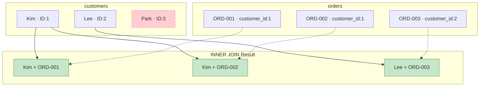

# Lesson 8: INNER JOIN

So far, we've only queried data from a single table. But in practice, you often need to combine data from multiple tables, like finding 'the name of the customer who placed an order'. In this lesson, you'll learn how to connect tables using INNER JOIN.

!!! note "Already familiar?"
    If you're comfortable with INNER JOIN, ON conditions, and multi-table JOINs, skip ahead to [Lesson 9: LEFT JOIN](09-left-join.md).

`JOIN` combines rows from two or more tables based on related columns. `INNER JOIN` returns only the rows that match in **both** tables -- unmatched rows are excluded from the result.



> **INNER JOIN** returns only rows that match in both tables. Park (ID:3) has no orders, so they are excluded from the result.

{ .off-glb width="300"  }

## Joining Two Tables

The syntax is `FROM table_a INNER JOIN table_b ON table_a.key = table_b.key`. The `ON` clause specifies the matching condition.

```sql
-- Query orders with customer names
SELECT
    o.order_number,
    c.name        AS customer_name,
    o.status,
    o.total_amount
FROM orders AS o
INNER JOIN customers AS c ON o.customer_id = c.id
ORDER BY o.ordered_at DESC
LIMIT 5;
```

**Result:**

| order_number | customer_name | status | total_amount |
| ---------- | ---------- | ---------- | ----------: |
| ORD-20251231-37555 | Angel Jones | pending | 74800.0 |
| ORD-20251231-37543 | Carla Watson | pending | 134100.0 |
| ORD-20251231-37552 | Martin Hanson | pending | 254300.0 |
| ORD-20251231-37548 | Lucas Johnson | pending | 187700.0 |
| ORD-20251231-37542 | Adam Moore | pending | 155700.0 |
| ... | ... | ... | ... |

> **Table aliases** (`o`, `c`) make queries shorter and `ON` conditions easier to read. While not required, they are strongly recommended when joining multiple tables.

## Why INNER JOIN Excludes Unmatched Rows

Customers who have never placed an order do not appear in the result -- because there is no matching row in `orders`. Conversely, thanks to foreign key constraints, every order must have a customer, so all orders are matched.

```sql
-- Check: Are there any orders without a customer?
SELECT COUNT(*) AS orders_without_customer
FROM orders o
LEFT JOIN customers c ON o.customer_id = c.id
WHERE c.id IS NULL;
```

## Joining Three or More Tables

Chain additional `JOIN` clauses. Each one connects to the already-combined tables.

```sql
-- Include product name and category name in order items
SELECT
    oi.id           AS item_id,
    o.order_number,
    p.name          AS product_name,
    cat.name        AS category,
    oi.quantity,
    oi.unit_price
FROM order_items AS oi
INNER JOIN orders     AS o   ON oi.order_id   = o.id
INNER JOIN products   AS p   ON oi.product_id = p.id
INNER JOIN categories AS cat ON p.category_id = cat.id
ORDER BY o.ordered_at DESC
LIMIT 6;
```

**Result:**

| item_id | order_number | product_name | category | quantity | unit_price |
| ----------: | ---------- | ---------- | ---------- | ----------: | ----------: |
| 91101 | ORD-20251231-37555 | Norton AntiVirus Plus Silver | Security | 1 | 74800.0 |
| 91080 | ORD-20251231-37543 | Hancom Office 2024 Enterprise White | Office | 1 | 134100.0 |
| 91096 | ORD-20251231-37552 | Hancom Office 2024 Enterprise White | Office | 1 | 134100.0 |
| 91097 | ORD-20251231-37552 | NZXT Kraken 240 Silver | Liquid Cooling | 1 | 120200.0 |
| 91092 | ORD-20251231-37548 | Samsung 990 EVO Plus 1TB White | SSD | 1 | 187700.0 |
| 91079 | ORD-20251231-37542 | Logitech G PRO X2 Superstrike Black | Gaming | 1 | 155700.0 |
| ... | ... | ... | ... | ... | ... |

## Aggregation After JOIN

Perform the join first, then aggregate. You can use columns from joined tables for grouping.

```sql
-- Total revenue by product category
SELECT
    cat.name        AS category,
    COUNT(DISTINCT o.id) AS order_count,
    SUM(oi.quantity)     AS units_sold,
    SUM(oi.quantity * oi.unit_price) AS gross_revenue
FROM order_items AS oi
INNER JOIN orders     AS o   ON oi.order_id   = o.id
INNER JOIN products   AS p   ON oi.product_id = p.id
INNER JOIN categories AS cat ON p.category_id = cat.id
WHERE o.status IN ('delivered', 'confirmed')
GROUP BY cat.name
ORDER BY gross_revenue DESC
LIMIT 8;
```

**Result:**

| category | order_count | units_sold | gross_revenue |
| ---------- | ----------: | ----------: | ----------: |
| Gaming Laptop | 1534 | 1586 | 4671979900.0 |
| AMD | 3309 | 3867 | 3007936300.0 |
| NVIDIA | 1529 | 1577 | 2672535800.0 |
| Gaming Monitor | 2199 | 2317 | 2636507300.0 |
| General Laptop | 1288 | 1303 | 2315576700.0 |
| 2-in-1 | 1179 | 1236 | 1844966800.0 |
| Intel Socket | 2943 | 3275 | 1495665600.0 |
| AMD Socket | 2862 | 3172 | 1458653400.0 |
| ... | ... | ... | ... |

## Filtering Joined Tables

You can apply `WHERE` conditions to any table participating in the join.

```sql
-- Orders over 1,000,000 from VIP customers in 2024
SELECT
    c.name          AS customer_name,
    o.order_number,
    o.total_amount,
    o.ordered_at
FROM orders AS o
INNER JOIN customers AS c ON o.customer_id = c.id
WHERE c.grade = 'VIP'
  AND o.total_amount > 1000
  AND o.ordered_at LIKE '2024%'
ORDER BY o.total_amount DESC;
```

## Summary

| Concept | Description | Example |
|------|------|------|
| INNER JOIN | Returns only matching rows from both tables | `FROM orders INNER JOIN customers ON ...` |
| ON clause | Specifies the join condition (typically FK = PK) | `ON o.customer_id = c.id` |
| Table alias | Assigns a short name to a table | `orders AS o`, `customers AS c` |
| Multi-table JOIN | Chain multiple JOINs to join 3+ tables | `INNER JOIN products AS p ON ...` |
| JOIN + aggregation | Aggregate with GROUP BY after joining | `SUM(oi.quantity * oi.unit_price)` |
| JOIN + WHERE | Apply filters to any joined table | `WHERE c.grade = 'VIP'` |

!!! note "Lesson Review Problems"
    These are simple problems to immediately test the concepts from this lesson. For comprehensive practice combining multiple concepts, see the [Practice Problems](../exercises/index.md) section.

## Practice Problems

### Problem 1
Query each review with the customer's `name` and product's `name`. Return `review_id`, `customer_name`, `product_name`, `rating`, `created_at`, sorted by `rating` descending then `created_at` descending, limited to 10 rows.

??? success "Answer"
    ```sql
    SELECT
        r.id          AS review_id,
        c.name        AS customer_name,
        p.name        AS product_name,
        r.rating,
        r.created_at
    FROM reviews AS r
    INNER JOIN customers AS c ON r.customer_id = c.id
    INNER JOIN products  AS p ON r.product_id  = p.id
    ORDER BY r.rating DESC, r.created_at DESC
    LIMIT 10;
    ```

    **Result (example):**

| review_id | customer_name | product_name | rating | created_at |
| ----------: | ---------- | ---------- | ----------: | ---------- |
| 8535 | Jonathan Landry | Norton AntiVirus Plus Silver | 5 | 2026-01-13 12:09:18 |
| 8530 | Christine Maxwell | Netgear GS308 Silver | 5 | 2026-01-11 21:02:15 |
| 8541 | Jill Dalton | Arctic Liquid Freezer III Pro 420 A-RGB Silver | 5 | 2026-01-07 20:55:20 |
| 8517 | Stanley Long | ASUS Dual RTX 5070 Ti Silver | 5 | 2026-01-07 09:24:04 |
| 8536 | Mary Thomas | be quiet! Dark Power 13 1000W | 5 | 2026-01-06 21:29:23 |
| 8502 | Roy Castro | TP-Link TL-SG108 | 5 | 2026-01-06 15:27:04 |
| 8527 | Tiffany Graham | Microsoft Ergonomic Keyboard Silver | 5 | 2026-01-04 18:00:26 |
| 8488 | Samuel Jones | Kingston FURY Renegade DDR5 32GB 7200MHz Black | 5 | 2026-01-03 10:58:26 |
| ... | ... | ... | ... | ... |


### Problem 2
Find the number of unique customers per payment method. Return `method` and `unique_customers`, sorted by `unique_customers` descending.

??? success "Answer"
    ```sql
    SELECT
        p.method,
        COUNT(DISTINCT o.customer_id) AS unique_customers
    FROM payments AS p
    INNER JOIN orders AS o ON p.order_id = o.id
    WHERE p.status = 'completed'
    GROUP BY p.method
    ORDER BY unique_customers DESC;
    ```

    **Result (example):**

| method | unique_customers |
| ---------- | ----------: |
| card | 2316 |
| kakao_pay | 1777 |
| naver_pay | 1598 |
| bank_transfer | 1332 |
| virtual_account | 923 |
| point | 892 |
| ... | ... |


### Problem 3
Find the top 5 customers by total purchase amount (sum of `total_amount` excluding cancelled/returned orders). Return `customer_name`, `grade`, `order_count`, `total_spent`.

??? success "Answer"
    ```sql
    SELECT
        c.name   AS customer_name,
        c.grade,
        COUNT(o.id)         AS order_count,
        SUM(o.total_amount) AS total_spent
    FROM orders AS o
    INNER JOIN customers AS c ON o.customer_id = c.id
    WHERE o.status NOT IN ('cancelled', 'returned', 'return_requested')
    GROUP BY c.id, c.name, c.grade
    ORDER BY total_spent DESC
    LIMIT 5;
    ```

    **Result (example):**

| customer_name | grade | order_count | total_spent |
| ---------- | ---------- | ----------: | ----------: |
| Allen Snyder | VIP | 303 | 403448758.0 |
| Jason Rivera | VIP | 342 | 366385931.0 |
| Brenda Garcia | VIP | 249 | 253180338.0 |
| Courtney Huff | VIP | 223 | 244604910.0 |
| Ronald Arellano | VIP | 219 | 235775349.0 |
| ... | ... | ... | ... |


### Problem 4
Query `order_number`, `customer_name`, and `status`, filtering only orders with status `'shipped'`. Sort by `ordered_at` descending and limit to 10 rows.

??? success "Answer"
    ```sql
    SELECT
        o.order_number,
        c.name   AS customer_name,
        o.status
    FROM orders AS o
    INNER JOIN customers AS c ON o.customer_id = c.id
    WHERE o.status = 'shipped'
    ORDER BY o.ordered_at DESC
    LIMIT 10;
    ```

    **Result (example):**

| order_number | customer_name | status |
| ---------- | ---------- | ---------- |
| ORD-20251225-37416 | Rebecca Schneider | shipped |
| ORD-20251225-37402 | Jim Shannon | shipped |
| ORD-20251225-37410 | Drew Valencia | shipped |
| ORD-20251225-37403 | William Johnson | shipped |
| ORD-20251225-37411 | Daniel Mendez | shipped |
| ORD-20251225-37408 | Christine Johnson | shipped |
| ORD-20251225-37406 | Robert Mitchell | shipped |
| ORD-20251225-37407 | Jesse Villanueva | shipped |
| ... | ... | ... |


### Problem 5
Join the `shipping` and `orders` tables to query `order_number`, `carrier`, `tracking_number`, and `delivered_at` for delivered orders. Sort by `delivered_at` descending and limit to 10 rows.

??? success "Answer"
    ```sql
    SELECT
        o.order_number,
        s.carrier,
        s.tracking_number,
        s.delivered_at
    FROM shipping AS s
    INNER JOIN orders AS o ON s.order_id = o.id
    WHERE s.status = 'delivered'
    ORDER BY s.delivered_at DESC
    LIMIT 10;
    ```

    **Result (example):**

| order_number | carrier | tracking_number | delivered_at |
| ---------- | ---------- | ---------- | ---------- |
| ORD-20251225-37399 | USPS | 376080377423 | 2026-01-01 23:36:22 |
| ORD-20251225-37404 | UPS | 652516112449 | 2026-01-01 22:02:51 |
| ORD-20251225-37414 | FedEx | 100421839710 | 2026-01-01 13:49:43 |
| ORD-20251225-37413 | OnTrac | 543173530520 | 2025-12-31 14:25:31 |
| ORD-20251225-37412 | OnTrac | 456720771228 | 2025-12-30 22:50:46 |
| ORD-20251224-37387 | OnTrac | 339128234015 | 2025-12-30 19:29:43 |
| ORD-20251225-37401 | UPS | 187550547718 | 2025-12-30 12:03:50 |
| ORD-20251224-37396 | UPS | 318330010876 | 2025-12-30 09:46:21 |
| ... | ... | ... | ... |


### Problem 6
Query product name (`products.name`), supplier name (`suppliers.company_name`), quantity, and unit price from `order_items`. Join 3 tables and sort by unit price descending, limited to 10 rows.

??? success "Answer"
    ```sql
    SELECT
        p.name          AS product_name,
        sup.company_name AS supplier_name,
        oi.quantity,
        oi.unit_price
    FROM order_items AS oi
    INNER JOIN products  AS p   ON oi.product_id  = p.id
    INNER JOIN suppliers AS sup ON p.supplier_id   = sup.id
    ORDER BY oi.unit_price DESC
    LIMIT 10;
    ```

    **Result (example):**

| product_name | supplier_name | quantity | unit_price |
| ---------- | ---------- | ----------: | ----------: |
| MacBook Air 15 M3 Silver | Apple Corp. | 1 | 5481100.0 |
| MacBook Air 15 M3 Silver | Apple Corp. | 1 | 5481100.0 |
| MacBook Air 15 M3 Silver | Apple Corp. | 1 | 5481100.0 |
| MacBook Air 15 M3 Silver | Apple Corp. | 1 | 5481100.0 |
| MacBook Air 15 M3 Silver | Apple Corp. | 1 | 5481100.0 |
| MacBook Air 15 M3 Silver | Apple Corp. | 1 | 5481100.0 |
| MacBook Air 15 M3 Silver | Apple Corp. | 1 | 5481100.0 |
| MacBook Air 15 M3 Silver | Apple Corp. | 1 | 5481100.0 |
| ... | ... | ... | ... |


### Problem 7
Find the total order count (`order_count`) and total quantity sold (`total_qty`) per supplier. Return `company_name`, `order_count`, `total_qty`, sorted by `total_qty` descending.

??? success "Answer"
    ```sql
    SELECT
        sup.company_name,
        COUNT(DISTINCT oi.order_id) AS order_count,
        SUM(oi.quantity)            AS total_qty
    FROM order_items AS oi
    INNER JOIN products  AS p   ON oi.product_id = p.id
    INNER JOIN suppliers AS sup ON p.supplier_id  = sup.id
    GROUP BY sup.id, sup.company_name
    ORDER BY total_qty DESC;
    ```

    **Result (example):**

| company_name | order_count | total_qty |
| ---------- | ----------: | ----------: |
| Logitech Corp. | 7106 | 8580 |
| Samsung Official Distribution | 7169 | 8557 |
| Seorin Systech | 5143 | 6547 |
| SteelSeries Corp. | 5014 | 5772 |
| ASUS Corp. | 4945 | 5696 |
| be quiet! Corp. | 3516 | 4325 |
| MSI Corp. | 3531 | 4055 |
| ASRock Corp. | 3435 | 3900 |
| ... | ... | ... |


### Problem 8
Find the order count (`order_count`) and total revenue (`total_revenue`) per assigned staff member. Exclude cancelled/returned orders. Return `staff_name`, `department`, `order_count`, `total_revenue`. Sort by `total_revenue` descending and return the top 10.

??? success "Answer"
    ```sql
    SELECT
        st.name        AS staff_name,
        st.department,
        COUNT(o.id)         AS order_count,
        SUM(o.total_amount) AS total_revenue
    FROM orders AS o
    INNER JOIN staff AS st ON o.staff_id = st.id
    WHERE o.status NOT IN ('cancelled', 'returned', 'return_requested')
    GROUP BY st.id, st.name, st.department
    ORDER BY total_revenue DESC
    LIMIT 10;
    ```

### Problem 9
Query the reviewer's name (`customers.name`), reviewed product name (`products.name`), rating, and review date (`reviews.created_at`). Only include reviews with a rating of 5. Sort by `reviews.created_at` descending and limit to 10 rows.

??? success "Answer"
    ```sql
    SELECT
        c.name        AS customer_name,
        p.name        AS product_name,
        r.rating,
        r.created_at
    FROM reviews AS r
    INNER JOIN customers AS c ON r.customer_id = c.id
    INNER JOIN products  AS p ON r.product_id  = p.id
    WHERE r.rating = 5
    ORDER BY r.created_at DESC
    LIMIT 10;
    ```


### Problem 10
Find the total order amount (`total_revenue`) and order count (`order_count`) per category. Return `categories.name`, `order_count`, `total_revenue`, targeting only top-level categories (`depth = 0`). Sort by `total_revenue` descending.

??? success "Answer"
    ```sql
    SELECT
        cat.name       AS category_name,
        COUNT(DISTINCT o.id) AS order_count,
        SUM(oi.quantity * oi.unit_price) AS total_revenue
    FROM order_items AS oi
    INNER JOIN orders     AS o   ON oi.order_id   = o.id
    INNER JOIN products   AS p   ON oi.product_id = p.id
    INNER JOIN categories AS cat ON p.category_id = cat.id
    WHERE cat.depth = 0
    ORDER BY total_revenue DESC;
    ```


### Scoring Guide

| Score | Next Step |
|:----:|----------|
| **9-10** | Move on to [Lesson 9: LEFT JOIN](09-left-join.md) |
| **7-8** | Review the explanations for incorrect answers, then proceed |
| **Half or fewer** | Re-read this lesson |
| **3 or fewer** | Start again from [Lesson 7: CASE Expressions](../beginner/07-case.md) |

**Problem Areas:**

| Area | Problems |
|------|:--------:|
| Multi-table JOIN | 1, 6 |
| JOIN + aggregation (COUNT/SUM) | 2, 7 |
| JOIN + status filter + aggregation | 3, 8 |
| 2-table JOIN + WHERE filter | 4, 5 |
| 3-table JOIN + WHERE filter | 9 |
| JOIN + GROUP BY + aggregation | 10 |

---
Next: [Lesson 9: LEFT JOIN](09-left-join.md)
