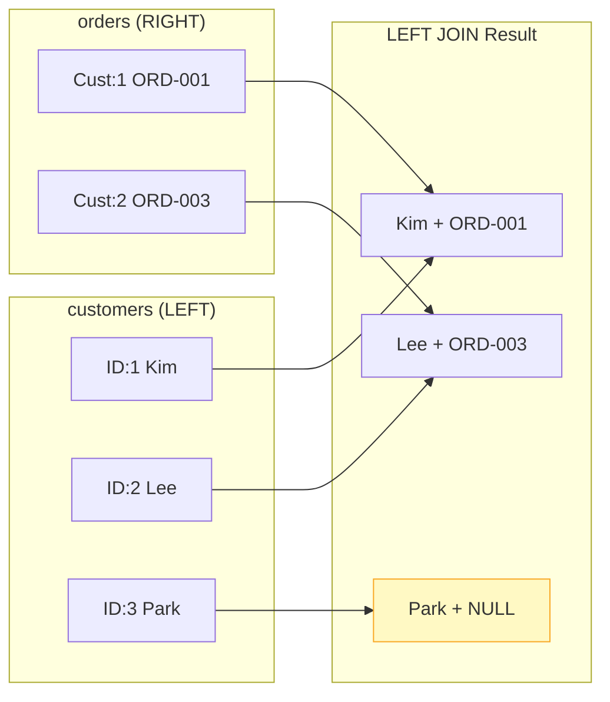

# Lesson 8: LEFT JOIN

`LEFT JOIN` returns **all rows from the left table**, plus matched rows from the right table. When there is no match, the right-side columns are filled with `NULL`. This is essential for finding records that lack a related record — a very common real-world need.



> LEFT JOIN keeps all rows from the left table. Missing matches on the right become NULL.

## Basic LEFT JOIN

```sql
-- All products, whether or not they have been reviewed
SELECT
    p.name          AS product_name,
    p.price,
    r.rating,
    r.created_at    AS reviewed_at
FROM products AS p
LEFT JOIN reviews AS r ON p.id = r.product_id
ORDER BY p.name
LIMIT 8;
```

**Result:**

| product_name | price | rating | reviewed_at |
|--------------|-------|--------|-------------|
| ASUS ProArt 32" 4K Monitor | 2199.00 | 5 | 2023-08-14 |
| ASUS ProArt 32" 4K Monitor | 2199.00 | 4 | 2024-01-22 |
| ASUS ROG Gaming Desktop | 1899.00 | 5 | 2022-11-03 |
| ASUS TUF Gaming Laptop | 1099.00 | (NULL) | (NULL) |
| Belkin USB-C Hub | 49.99 | (NULL) | (NULL) |
| ... | | | |

The `ASUS TUF Gaming Laptop` and `Belkin USB-C Hub` have no reviews, so their `rating` and `reviewed_at` are `NULL`.

## Finding Non-Matching Rows

The classic "anti-join" pattern: `LEFT JOIN` then filter for `WHERE right_table.id IS NULL`. This finds rows in the left table with **no** corresponding row in the right table.

```sql
-- Products that have NEVER been reviewed
SELECT
    p.id,
    p.name,
    p.price
FROM products AS p
LEFT JOIN reviews AS r ON p.id = r.product_id
WHERE r.id IS NULL
ORDER BY p.name;
```

**Result:**

| id | name | price |
|----|------|-------|
| 47 | ASUS TUF Gaming Laptop | 1099.00 |
| 83 | Belkin USB-C Hub | 49.99 |
| 116 | Corsair K60 RGB Keyboard | 89.99 |
| ... | | |

```sql
-- Customers who have NEVER placed an order
SELECT
    c.id,
    c.name,
    c.email,
    c.created_at
FROM customers AS c
LEFT JOIN orders AS o ON c.id = o.customer_id
WHERE o.id IS NULL
ORDER BY c.created_at DESC
LIMIT 10;
```

**Result:**

| id | name | email | created_at |
|----|------|-------|------------|
| 5228 | Tyler Brooks | t.brooks@testmail.com | 2024-12-28 |
| 5221 | Grace Liu | g.liu@testmail.com | 2024-12-19 |
| ... | | | |

> These are likely very new customers who have browsed but not yet purchased.

## LEFT JOIN with Aggregation

Use `COUNT(right_table.id)` instead of `COUNT(*)` to count only matched rows — NULL columns don't contribute to the count.

```sql
-- Every product with its review count and average rating
SELECT
    p.name          AS product_name,
    p.price,
    COUNT(r.id)     AS review_count,
    ROUND(AVG(r.rating), 2) AS avg_rating
FROM products AS p
LEFT JOIN reviews AS r ON p.id = r.product_id
WHERE p.is_active = 1
GROUP BY p.id, p.name, p.price
ORDER BY review_count DESC
LIMIT 10;
```

**Result:**

| product_name | price | review_count | avg_rating |
|--------------|-------|--------------|------------|
| Dell XPS 15 Laptop | 1299.99 | 87 | 4.21 |
| Logitech MX Master 3 | 99.99 | 74 | 4.56 |
| Samsung 27" Monitor | 449.99 | 68 | 4.03 |
| ... | | | |

```sql
-- Customers with order statistics (including those with 0 orders)
SELECT
    c.name,
    c.grade,
    COUNT(o.id)         AS order_count,
    COALESCE(SUM(o.total_amount), 0) AS lifetime_value
FROM customers AS c
LEFT JOIN orders AS o ON c.id = o.customer_id
    AND o.status NOT IN ('cancelled', 'returned')
GROUP BY c.id, c.name, c.grade
ORDER BY lifetime_value DESC
LIMIT 8;
```

> Notice the extra `AND` condition inside the `ON` clause rather than `WHERE`. This keeps all customers in the result — a `WHERE` would filter out customers with no orders.

**Result:**

| name | grade | order_count | lifetime_value |
|------|-------|-------------|----------------|
| Jennifer Martinez | VIP | 48 | 64291.50 |
| Robert Kim | VIP | 41 | 52884.20 |
| ... | | | |

## Multiple LEFT JOINs

```sql
-- Orders with optional shipping and payment info
SELECT
    o.order_number,
    o.status,
    o.total_amount,
    s.carrier,
    s.tracking_number,
    p.method         AS payment_method
FROM orders AS o
LEFT JOIN shipping AS s ON s.order_id = o.id
LEFT JOIN payments AS p ON p.order_id = o.id
WHERE o.ordered_at LIKE '2024-12%'
LIMIT 5;
```

!!! note "Lesson Review"
    Quick exercises to check your understanding of this lesson. For comprehensive practice combining multiple concepts, see the [Exercises](../exercises/) section.

## Practice Exercises

### Exercise 1
Find all customers who have items in their wishlist but have **never placed an order**. Return `customer_name`, `email`, and `wishlist_items` (count of wishlist entries). Order by `wishlist_items` descending.

??? success "Answer"
    ```sql
    SELECT
        c.name  AS customer_name,
        c.email,
        COUNT(w.id) AS wishlist_items
    FROM customers AS c
    LEFT JOIN orders    AS o ON c.id = o.customer_id
    INNER JOIN wishlists AS w ON c.id = w.customer_id
    WHERE o.id IS NULL
    GROUP BY c.id, c.name, c.email
    ORDER BY wishlist_items DESC;
    ```

### Exercise 2
For every product, show its name, price, total units sold (`SUM(order_items.quantity)`), and the number of distinct orders it appeared in. Include products that have **never been ordered** (show 0 for those). Limit to 20 rows, sorted by units sold descending.

??? success "Answer"
    ```sql
    SELECT
        p.name              AS product_name,
        p.price,
        COALESCE(SUM(oi.quantity), 0)    AS units_sold,
        COUNT(DISTINCT oi.order_id)       AS order_appearances
    FROM products AS p
    LEFT JOIN order_items AS oi ON p.id = oi.product_id
    GROUP BY p.id, p.name, p.price
    ORDER BY units_sold DESC
    LIMIT 20;
    ```

### Exercise 3
Find all active products that have **no inventory transactions** recorded in the `inventory_transactions` table. Return `product_id`, `name`, and `stock_qty`.

??? success "Answer"
    ```sql
    SELECT
        p.id        AS product_id,
        p.name,
        p.stock_qty
    FROM products AS p
    LEFT JOIN inventory_transactions AS it ON p.id = it.product_id
    WHERE p.is_active = 1
      AND it.id IS NULL
    ORDER BY p.name;
    ```

---
Next: [Lesson 9: Subqueries](09-subqueries.md)
