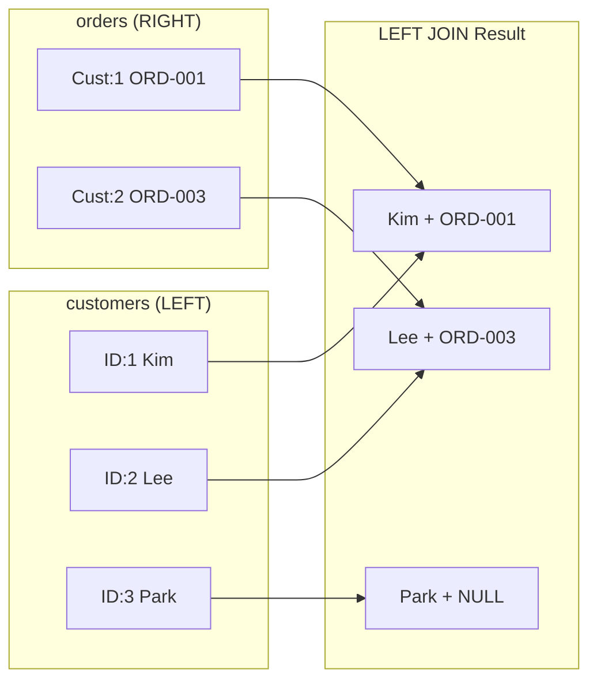
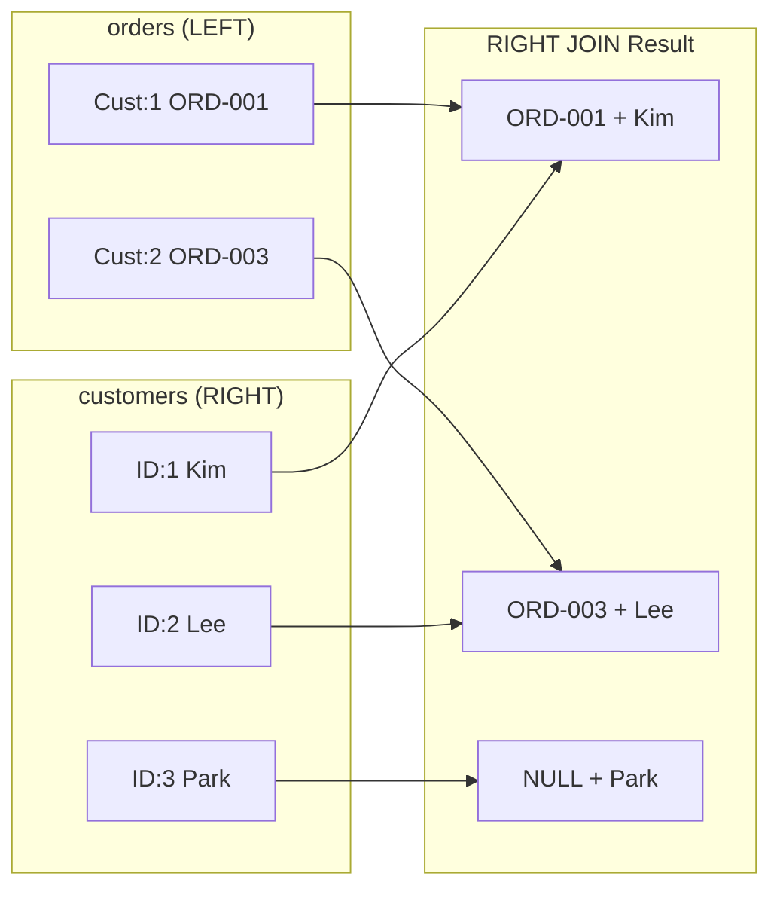
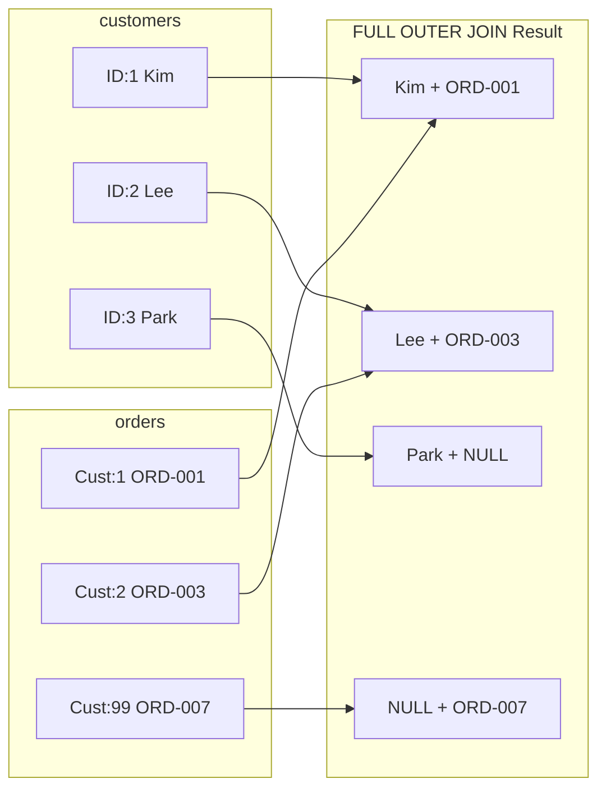

# Lesson 8: LEFT JOIN

`LEFT JOIN` returns **all rows from the left table**, plus matched rows from the right table. When there is no match, the right-side columns are filled with `NULL`. This is essential for finding records that lack a related record — a very common real-world need.



> LEFT JOIN keeps all rows from the left table. Missing matches on the right become NULL.

{ .off-glb width="300"  }

## Basic LEFT JOIN

```sql
-- All products, whether or not they have been reviewed
SELECT
    p.name          AS product_name,
    p.price,
    r.rating,
    r.created_at    AS reviewed_at
FROM products AS p
LEFT JOIN reviews AS r ON p.id = r.product_id
ORDER BY p.name
LIMIT 8;
```

**Result:**

| product_name      | price  | rating | reviewed_at         |
| ----------------- | -----: | -----: | ------------------- |
| AMD Ryzen 9 9900X | 244800 |      1 | 2018-05-12 09:22:49 |
| AMD Ryzen 9 9900X | 244800 |      1 | 2018-08-24 10:40:58 |
| AMD Ryzen 9 9900X | 244800 |      1 | 2018-10-12 17:15:03 |
| AMD Ryzen 9 9900X | 244800 |      1 | 2019-10-26 12:33:53 |
| AMD Ryzen 9 9900X | 244800 |      1 | 2021-03-29 21:06:08 |
| ...               | ...    | ...    | ...                 |

The `ASUS TUF Gaming Laptop` and `Belkin USB-C Hub` have no reviews, so their `rating` and `reviewed_at` are `NULL`.

## Finding Non-Matching Rows

{ .off-glb width="300"  }

The classic "anti-join" pattern: `LEFT JOIN` then filter for `WHERE right_table.id IS NULL`. This finds rows in the left table with **no** corresponding row in the right table.

```sql
-- Products that have NEVER been reviewed
SELECT
    p.id,
    p.name,
    p.price
FROM products AS p
LEFT JOIN reviews AS r ON p.id = r.product_id
WHERE r.id IS NULL
ORDER BY p.name;
```

**Result:**

| id  | name                                                          | price   |
| --: | ------------------------------------------------------------- | ------: |
| 277 | ASRock X870E Taichi 실버                                        |  583500 |
| 268 | ASUS Dual RTX 5070 Ti [특별 한정판 에디션] 저소음 설계, 에너지 효율 1등급, 친환경 포장 | 4226200 |
| 276 | ASUS ROG MAXIMUS Z890 HERO 블랙                                 | 1048400 |
| ... | ...                                                           | ...     |

```sql
-- Customers who have NEVER placed an order
SELECT
    c.id,
    c.name,
    c.email,
    c.created_at
FROM customers AS c
LEFT JOIN orders AS o ON c.id = o.customer_id
WHERE o.id IS NULL
ORDER BY c.created_at DESC
LIMIT 10;
```

**Result:**

| id   | name | email                | created_at          |
| ---: | ---- | -------------------- | ------------------- |
| 4933 | 윤예준  | user4933@testmail.kr | 2025-12-30 20:40:58 |
| 5222 | 유동현  | user5222@testmail.kr | 2025-12-30 10:18:14 |
| ...  | ...  | ...                  | ...                 |

> These are likely very new customers who have browsed but not yet purchased.

## LEFT JOIN with Aggregation

Use `COUNT(right_table.id)` instead of `COUNT(*)` to count only matched rows — NULL columns don't contribute to the count.

```sql
-- Every product with its review count and average rating
SELECT
    p.name          AS product_name,
    p.price,
    COUNT(r.id)     AS review_count,
    ROUND(AVG(r.rating), 2) AS avg_rating
FROM products AS p
LEFT JOIN reviews AS r ON p.id = r.product_id
WHERE p.is_active = 1
GROUP BY p.id, p.name, p.price
ORDER BY review_count DESC
LIMIT 10;
```

**Result:**

| product_name                    | price  | review_count | avg_rating |
| ------------------------------- | -----: | -----------: | ---------: |
| SteelSeries Aerox 5 Wireless 실버 | 119000 |          111 |          4 |
| SteelSeries Prime Wireless 블랙   |  75900 |           93 |       3.82 |
| JBL Flip 6 블랙                   | 195900 |           92 |       3.93 |
| ...                             | ...    | ...          | ...        |

```sql
-- Customers with order statistics (including those with 0 orders)
SELECT
    c.name,
    c.grade,
    COUNT(o.id)         AS order_count,
    COALESCE(SUM(o.total_amount), 0) AS lifetime_value
FROM customers AS c
LEFT JOIN orders AS o ON c.id = o.customer_id
    AND o.status NOT IN ('cancelled', 'returned')
GROUP BY c.id, c.name, c.grade
ORDER BY lifetime_value DESC
LIMIT 8;
```

> Notice the extra `AND` condition inside the `ON` clause rather than `WHERE`. This keeps all customers in the result — a `WHERE` would filter out customers with no orders.

**Result:**

| name | grade | order_count | lifetime_value |
|------|-------|------------:|---------------:|
| Jennifer Martinez | VIP | 48 | 64291.50 |
| Robert Kim | VIP | 41 | 52884.20 |
| ... | | | |

## Multiple LEFT JOINs

```sql
-- Orders with optional shipping and payment info
SELECT
    o.order_number,
    o.status,
    o.total_amount,
    s.carrier,
    s.tracking_number,
    p.method         AS payment_method
FROM orders AS o
LEFT JOIN shipping AS s ON s.order_id = o.id
LEFT JOIN payments AS p ON p.order_id = o.id
WHERE o.ordered_at LIKE '2024-12%'
LIMIT 5;
```

## RIGHT JOIN

{ .off-glb width="300"  }

`RIGHT JOIN` is the opposite of LEFT JOIN. It keeps **all rows from the right table**, filling in `NULL` for left-side columns when there is no match.



```sql
-- RIGHT JOIN: include customers even if they have no orders
SELECT
    c.name,
    c.email,
    o.order_number,
    o.total_amount
FROM orders AS o
RIGHT JOIN customers AS c ON c.id = o.customer_id
ORDER BY c.name
LIMIT 10;
```

In practice, RIGHT JOIN is rarely used. You can always swap the table order and use LEFT JOIN to get the same result:

```sql
-- Equivalent LEFT JOIN
SELECT
    c.name,
    c.email,
    o.order_number,
    o.total_amount
FROM customers AS c
LEFT JOIN orders AS o ON c.id = o.customer_id
ORDER BY c.name
LIMIT 10;
```

> Both queries return the same result. LEFT JOIN is more intuitive, so most teams prefer it over RIGHT JOIN.

## FULL OUTER JOIN

{ .off-glb width="300"  }

`FULL OUTER JOIN` keeps **all rows from both tables**. When there is no match on either side, the missing columns are filled with `NULL`. This is useful when you need to see unmatched rows from both sides — for example, customers without orders AND orders without valid customers.



Support for FULL OUTER JOIN varies by database:

=== "SQLite"

    SQLite 3.39.0 (2022-07-21) and later supports `FULL OUTER JOIN` natively:

    ```sql
    -- SQLite 3.39+: FULL OUTER JOIN supported
    SELECT
        c.name,
        c.email,
        o.order_number,
        o.total_amount
    FROM customers AS c
    FULL OUTER JOIN orders AS o ON c.id = o.customer_id
    ORDER BY c.name
    LIMIT 15;
    ```

    For compatibility with older versions, use a `LEFT JOIN` + `UNION ALL` workaround:

    ```sql
    -- SQLite 3.38 and below: LEFT JOIN UNION ALL
    SELECT
        c.name,
        c.email,
        o.order_number,
        o.total_amount
    FROM customers AS c
    LEFT JOIN orders AS o ON c.id = o.customer_id

    UNION ALL

    SELECT
        NULL    AS name,
        NULL    AS email,
        o.order_number,
        o.total_amount
    FROM orders AS o
    LEFT JOIN customers AS c ON c.id = o.customer_id
    WHERE c.id IS NULL
    ORDER BY name
    LIMIT 15;
    ```

=== "MySQL"

    MySQL does not support `FULL OUTER JOIN`. Combine `LEFT JOIN` and `RIGHT JOIN` with `UNION` instead:

    ```sql
    -- MySQL: LEFT JOIN UNION RIGHT JOIN
    SELECT
        c.name,
        c.email,
        o.order_number,
        o.total_amount
    FROM customers AS c
    LEFT JOIN orders AS o ON c.id = o.customer_id

    UNION

    SELECT
        c.name,
        c.email,
        o.order_number,
        o.total_amount
    FROM customers AS c
    RIGHT JOIN orders AS o ON c.id = o.customer_id
    ORDER BY name
    LIMIT 15;
    ```

=== "PostgreSQL"

    PostgreSQL supports `FULL OUTER JOIN` natively:

    ```sql
    -- PostgreSQL: FULL OUTER JOIN supported
    SELECT
        c.name,
        c.email,
        o.order_number,
        o.total_amount
    FROM customers AS c
    FULL OUTER JOIN orders AS o ON c.id = o.customer_id
    ORDER BY c.name
    LIMIT 15;
    ```

!!! note "Lesson Review"
    Quick exercises to check your understanding of this lesson. For comprehensive practice combining multiple concepts, see the [Exercises](../exercises/index.md) section.

## Practice Exercises
### Exercise 1
Show all customers without orders AND all orders without a valid customer in a single query. Return `customer_name`, `order_number`, and `total_amount`. Display `'(Unknown)'` for missing customers and `'(No orders)'` for missing orders. Sort by `customer_name` ascending, limit to 15 rows.

??? success "Answer"
    === "SQLite"

    ```sql
    -- SQLite 3.39+
    SELECT
        COALESCE(c.name, '(Unknown)')          AS customer_name,
        COALESCE(o.order_number, '(No orders)') AS order_number,
        o.total_amount
    FROM customers AS c
    FULL OUTER JOIN orders AS o ON c.id = o.customer_id
    ORDER BY customer_name
    LIMIT 15;
    ```

=== "MySQL"

    ```sql
    SELECT
        COALESCE(c.name, '(Unknown)')          AS customer_name,
        COALESCE(o.order_number, '(No orders)') AS order_number,
        o.total_amount
    FROM customers AS c
    LEFT JOIN orders AS o ON c.id = o.customer_id

    UNION

    SELECT
        COALESCE(c.name, '(Unknown)')          AS customer_name,
        COALESCE(o.order_number, '(No orders)') AS order_number,
        o.total_amount
    FROM customers AS c
    RIGHT JOIN orders AS o ON c.id = o.customer_id
    ORDER BY customer_name
    LIMIT 15;
    ```

=== "PostgreSQL"

    ```sql
    SELECT
        COALESCE(c.name, '(Unknown)')          AS customer_name,
        COALESCE(o.order_number, '(No orders)') AS order_number,
        o.total_amount
    FROM customers AS c
    FULL OUTER JOIN orders AS o ON c.id = o.customer_id
    ORDER BY customer_name
    LIMIT 15;
    ```


### Exercise 2
Count how many customers have **never written a review**. Return a single value named `no_review_customers`.

??? success "Answer"
    ```sql
    SELECT COUNT(*) AS no_review_customers
    FROM customers AS c
    LEFT JOIN reviews AS r ON c.id = r.customer_id
    WHERE r.id IS NULL;
    ```

    **Expected result:**

    | no_review_customers |
    | ------------------: |
    |                3388 |


### Exercise 3
Find all active products that have **no inventory transactions** recorded in the `inventory_transactions` table. Return `product_id`, `name`, and `stock_qty`.

??? success "Answer"
    ```sql
    SELECT
        p.id        AS product_id,
        p.name,
        p.stock_qty
    FROM products AS p
    LEFT JOIN inventory_transactions AS it ON p.id = it.product_id
    WHERE p.is_active = 1
      AND it.id IS NULL
    ORDER BY p.name;
    ```


### Exercise 4
For every category, show the category name and the number of products in it (`product_count`). **Include categories with zero products.** Sort by `product_count` descending, then category name ascending.

??? success "Answer"
    ```sql
    SELECT
        cat.name        AS category_name,
        COUNT(p.id)     AS product_count
    FROM categories AS cat
    LEFT JOIN products AS p ON cat.id = p.category_id
    GROUP BY cat.id, cat.name
    ORDER BY product_count DESC, category_name ASC;
    ```

    **Expected result:**

    | category_name | product_count |
    | ------------- | ------------: |
    | Intel 소켓      |            13 |
    | 파워서플라이(PSU)   |            13 |
    | 스피커/헤드셋       |            12 |
    | 기계식           |            11 |
    | 멤브레인          |            11 |
    | ...           | ...           |


### Exercise 5
Using a RIGHT JOIN on the `orders` table, find every customer's name (`name`) and their order count (`order_count`). **Include customers with no orders.** Sort by order count descending and limit to 10 rows.

??? success "Answer"
    ```sql
    SELECT
        c.name,
        COUNT(o.id) AS order_count
    FROM orders AS o
    RIGHT JOIN customers AS c ON c.id = o.customer_id
    GROUP BY c.id, c.name
    ORDER BY order_count DESC
    LIMIT 10;
    ```

    **Expected result:**

    | name | order_count |
    | ---- | ----------: |
    | 이영자  |         346 |
    | 김병철  |         342 |
    | 박정수  |         340 |
    | 강명자  |         254 |
    | 김성민  |         232 |
    | ...  | ...         |


### Exercise 6
For each supplier, find the number of active products they supply (`product_count`) and total stock (`total_stock`). **Include suppliers with no products**, showing 0 for those values. Sort by `total_stock` descending.

??? success "Answer"
    ```sql
    SELECT
        sup.company_name,
        COUNT(p.id)                     AS product_count,
        COALESCE(SUM(p.stock_qty), 0)   AS total_stock
    FROM suppliers AS sup
    LEFT JOIN products AS p ON sup.id = p.supplier_id
        AND p.is_active = 1
    GROUP BY sup.id, sup.company_name
    ORDER BY total_stock DESC;
    ```

    **Expected result:**

    | company_name | product_count | total_stock |
    | ------------ | ------------: | ----------: |
    | 삼성전자 공식 유통   |            21 |        6174 |
    | 에이수스코리아      |            21 |        5828 |
    | MSI코리아       |            12 |        4070 |
    | ASRock코리아    |             9 |        3084 |
    | TP-Link코리아   |            11 |        3081 |
    | ...          | ...           | ...         |


### Exercise 7
For every product, show its name, price, total units sold (`SUM(order_items.quantity)`), and the number of distinct orders it appeared in. Include products that have **never been ordered** (show 0 for those). Limit to 20 rows, sorted by units sold descending.

??? success "Answer"
    ```sql
    SELECT
        p.name              AS product_name,
        p.price,
        COALESCE(SUM(oi.quantity), 0)    AS units_sold,
        COUNT(DISTINCT oi.order_id)       AS order_appearances
    FROM products AS p
    LEFT JOIN order_items AS oi ON p.id = oi.product_id
    GROUP BY p.id, p.name, p.price
    ORDER BY units_sold DESC
    LIMIT 20;
    ```

    **Expected result:**

    | product_name                    | price  | units_sold | order_appearances |
    | ------------------------------- | -----: | ---------: | ----------------: |
    | Crucial T700 2TB 실버             | 323700 |       1486 |              1436 |
    | AMD Ryzen 9 9900X               | 244800 |       1323 |              1274 |
    | SK하이닉스 Platinum P41 2TB 실버      | 256500 |       1308 |              1267 |
    | SteelSeries Aerox 5 Wireless 실버 | 119000 |       1088 |               998 |
    | SteelSeries Prime Wireless 실버   |  69300 |       1049 |               932 |
    | ...                             | ...    | ...        | ...               |


### Exercise 8
For every order, show the order number, total amount, payment method (`payments.method`), and shipping carrier (`shipping.carrier`). Include orders that have no payment or shipping records, displaying `'Unpaid'` and `'Not shipped'` respectively via `COALESCE`. Sort by total amount descending and limit to 10 rows.

??? success "Answer"
    ```sql
    SELECT
        o.order_number,
        o.total_amount,
        COALESCE(p.method, 'Unpaid')      AS payment_method,
        COALESCE(s.carrier, 'Not shipped') AS carrier
    FROM orders AS o
    LEFT JOIN payments AS p ON o.id = p.order_id
    LEFT JOIN shipping AS s ON o.id = s.order_id
    ORDER BY o.total_amount DESC
    LIMIT 10;
    ```

    **Expected result:**

    | order_number       | total_amount | payment_method | carrier |
    | ------------------ | -----------: | -------------- | ------- |
    | ORD-20210628-12574 |     58039800 | bank_transfer  | 로젠택배    |
    | ORD-20230809-24046 |     55047300 | card           | 로젠택배    |
    | ORD-20210321-11106 |     48718000 | card           | CJ대한통운  |
    | ORD-20200605-07165 |     47954000 | card           | CJ대한통운  |
    | ORD-20231020-25036 |     46945700 | kakao_pay      | 한진택배    |
    | ...                | ...          | ...            | ...     |


### Exercise 9
Show every customer's name, email, and the status of their most recent order. For customers with no orders, display `'No orders'` using `COALESCE`. Sort by customer name ascending and limit to 15 rows.

??? success "Answer"
    ```sql
    SELECT
        c.name,
        c.email,
        COALESCE(o.status, 'No orders') AS last_order_status
    FROM customers AS c
    LEFT JOIN orders AS o ON c.id = o.customer_id
        AND o.ordered_at = (
            SELECT MAX(o2.ordered_at)
            FROM orders AS o2
            WHERE o2.customer_id = c.id
        )
    ORDER BY c.name
    LIMIT 15;
    ```

    **Expected result:**

    | name | email                | last_order_status |
    | ---- | -------------------- | ----------------- |
    | 강건우  | user4737@testmail.kr | No orders         |
    | 강경수  | user3281@testmail.kr | No orders         |
    | 강경숙  | user2384@testmail.kr | No orders         |
    | 강경숙  | user3645@testmail.kr | No orders         |
    | 강경자  | user1109@testmail.kr | confirmed         |
    | ...  | ...                  | ...               |


### Exercise 10
Find all customers who have items in their wishlist but have **never placed an order**. Return `customer_name`, `email`, and `wishlist_items` (count of wishlist entries). Order by `wishlist_items` descending.

??? success "Answer"
    ```sql
    SELECT
        c.name  AS customer_name,
        c.email,
        COUNT(w.id) AS wishlist_items
    FROM customers AS c
    LEFT JOIN orders    AS o ON c.id = o.customer_id
    INNER JOIN wishlists AS w ON c.id = w.customer_id
    WHERE o.id IS NULL
    GROUP BY c.id, c.name, c.email
    ORDER BY wishlist_items DESC;
    ```


---
Next: [Lesson 9: Subqueries](09-subqueries.md)
