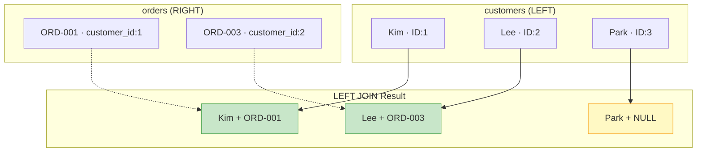
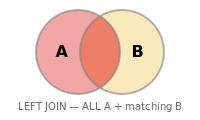
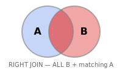
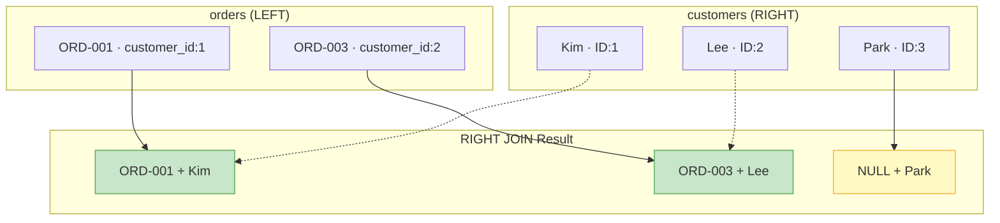
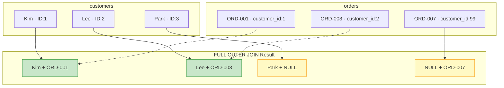

# Lesson 9: LEFT JOIN and Outer Joins

In Lesson 8, we connected two tables with INNER JOIN. However, INNER JOIN only returns rows where data exists on both sides. What if you need to find 'customers with no orders' or 'products with no reviews'? That's where LEFT JOIN comes in.

!!! note "Already familiar?"
    If you're comfortable with LEFT JOIN, RIGHT JOIN, and FULL OUTER JOIN, skip ahead to [Lesson 10: Subqueries](10-subqueries.md).

`LEFT JOIN` returns **all rows from the left table** and brings matching rows from the right table. If there is no match, the right-side columns are filled with `NULL`. This is an essential technique for finding rows without related records and is used very frequently in practice.



> **LEFT JOIN** keeps all rows from the left table. If there's no match on the right, the values are filled with NULL.

{ .off-glb width="300"  }

## Basic LEFT JOIN

```sql
-- Query all products regardless of whether they have reviews
SELECT
    p.name          AS product_name,
    p.price,
    r.rating,
    r.created_at    AS reviewed_at
FROM products AS p
LEFT JOIN reviews AS r ON p.id = r.product_id
ORDER BY p.name
LIMIT 8;
```

**Result:**

| product_name | price | rating | reviewed_at |
| ---------- | ----------: | ----------: | ---------- |
| AMD Ryzen 5 9600X | 186400.0 | 1 | 2016-10-11 19:28:27 |
| AMD Ryzen 5 9600X | 186400.0 | 1 | 2016-11-20 11:26:07 |
| AMD Ryzen 5 9600X | 186400.0 | 1 | 2021-01-06 14:45:38 |
| AMD Ryzen 5 9600X | 186400.0 | 1 | 2024-02-17 09:15:04 |
| AMD Ryzen 5 9600X | 186400.0 | 1 | 2024-04-25 10:35:27 |
| AMD Ryzen 5 9600X | 186400.0 | 1 | 2024-05-17 22:57:55 |
| AMD Ryzen 5 9600X | 186400.0 | 1 | 2025-03-07 12:44:04 |
| AMD Ryzen 5 9600X | 186400.0 | 2 | 2016-09-23 14:03:18 |
| ... | ... | ... | ... |

Products like `ASUS TUF Gaming Laptop` and `Belkin USB-C Hub` have no reviews, so `rating` and `reviewed_at` are `NULL`.

## Finding Unmatched Rows

{ .off-glb width="300"  }

Anti-join pattern: add `WHERE right_table.id IS NULL` after a `LEFT JOIN`. This finds rows in the left table that have **no corresponding row** in the right table.

```sql
-- Products that have never received a review
SELECT
    p.id,
    p.name,
    p.price
FROM products AS p
LEFT JOIN reviews AS r ON p.id = r.product_id
WHERE r.id IS NULL
ORDER BY p.name;
```

**Result:**

| id | name | price |
| ----------: | ---------- | ----------: |
| 2712 | ASRock X870E Taichi 화이트 | 218900.0 |
| 2224 | ASUS ExpertCenter D900 | 2655100.0 |
| 21 | ASUS ROG Strix G16CH 화이트 | 3307900.0 |
| 2570 | ASUS ROG Zephyrus G14 실버 | 3362500.0 |
| 2719 | BenQ PD2725U 화이트 | 814400.0 |
| 2577 | CORSAIR Vengeance DDR5 32GB 실버 | 338300.0 |
| 2523 | Dell P2723D | 817700.0 |
| 2514 | Dell U2723QE 실버 | 555800.0 |
| ... | ... | ... |

```sql
-- Customers who have never placed an order
SELECT
    c.id,
    c.name,
    c.email,
    c.created_at
FROM customers AS c
LEFT JOIN orders AS o ON c.id = o.customer_id
WHERE o.id IS NULL
ORDER BY c.created_at DESC
LIMIT 10;
```

**Result:**

| id | name | email | created_at |
| ----------: | ---------- | ---------- | ---------- |
| 49801 | 김선영 | user49801@testmail.kr | 2025-12-30 22:45:23 |
| 48802 | 류은경 | user48802@testmail.kr | 2025-12-30 22:33:01 |
| 51023 | 이은경 | user51023@testmail.kr | 2025-12-30 19:52:14 |
| 47952 | 류지원 | user47952@testmail.kr | 2025-12-30 19:44:42 |
| 45855 | 강성민 | user45855@testmail.kr | 2025-12-30 17:47:49 |
| 50734 | 최하은 | user50734@testmail.kr | 2025-12-30 15:43:58 |
| 49114 | 이재호 | user49114@testmail.kr | 2025-12-30 15:37:59 |
| 48650 | 김민지 | user48650@testmail.kr | 2025-12-30 13:11:58 |
| ... | ... | ... | ... |

> These customers likely signed up recently and haven't made a purchase yet.

## LEFT JOIN with Aggregation

To count only matched rows, use `COUNT(right_table.id)` instead of `COUNT(*)` -- NULLs are not included in the count.

```sql
-- Review count and average rating for all products
SELECT
    p.name          AS product_name,
    p.price,
    COUNT(r.id)     AS review_count,
    ROUND(AVG(r.rating), 2) AS avg_rating
FROM products AS p
LEFT JOIN reviews AS r ON p.id = r.product_id
WHERE p.is_active = 1
GROUP BY p.id, p.name, p.price
ORDER BY review_count DESC
LIMIT 10;
```

**Result:**

| product_name | price | review_count | avg_rating |
| ---------- | ----------: | ----------: | ----------: |
| 로지텍 G PRO X SUPERLIGHT 2 실버 | 49400.0 | 137 | 3.93 |
| Arctic Freezer i35 화이트 | 31800.0 | 121 | 3.79 |
| Keychron Q1 Pro 실버 | 178600.0 | 116 | 3.79 |
| SteelSeries Aerox 5 Wireless 실버 | 61500.0 | 114 | 3.7 |
| 로지텍 G502 X PLUS 화이트 | 91400.0 | 112 | 4.02 |
| Crucial T700 2TB 실버 | 37100.0 | 111 | 3.85 |
| SteelSeries Aerox 5 Wireless 실버 | 101400.0 | 106 | 3.86 |
| Arctic Freezer i35 블랙 | 44600.0 | 106 | 3.73 |
| ... | ... | ... | ... |

```sql
-- Per-customer order statistics including customers with 0 orders
SELECT
    c.name,
    c.grade,
    COUNT(o.id)         AS order_count,
    COALESCE(SUM(o.total_amount), 0) AS lifetime_value
FROM customers AS c
LEFT JOIN orders AS o ON c.id = o.customer_id
    AND o.status NOT IN ('cancelled', 'returned')
GROUP BY c.id, c.name, c.grade
ORDER BY lifetime_value DESC
LIMIT 8;
```

> Notice that the additional `AND` condition is placed in the `ON` clause rather than `WHERE`. Placing it in `WHERE` would exclude customers with no orders from the result.

**Result:**

| name | grade | order_count | lifetime_value |
| ---------- | ---------- | ----------: | ----------: |
| 박정수 | VIP | 661 | 671056103.0 |
| 정유진 | VIP | 544 | 646834022.0 |
| 이미정 | VIP | 530 | 633645694.0 |
| 김상철 | VIP | 513 | 565735423.0 |
| 문영숙 | VIP | 546 | 523138846.0 |
| 이영자 | VIP | 509 | 520594776.0 |
| 이미정 | VIP | 440 | 497376276.0 |
| 장영숙 | VIP | 356 | 487964896.0 |
| ... | ... | ... | ... |

## Chaining Multiple LEFT JOINs

```sql
-- Query orders with optional shipping and payment info
SELECT
    o.order_number,
    o.status,
    o.total_amount,
    s.carrier,
    s.tracking_number,
    p.method         AS payment_method
FROM orders AS o
LEFT JOIN shipping AS s ON s.order_id = o.id
LEFT JOIN payments AS p ON p.order_id = o.id
WHERE o.ordered_at LIKE '2024-12%'
LIMIT 5;
```

## RIGHT JOIN

{ .off-glb width="300"  }

`RIGHT JOIN` is the opposite of LEFT JOIN. It keeps **all rows from the right table** and fills with `NULL` when there's no match on the left.



```sql
-- RIGHT JOIN: Include customers with no orders
SELECT
    c.name,
    c.email,
    o.order_number,
    o.total_amount
FROM orders AS o
RIGHT JOIN customers AS c ON c.id = o.customer_id
ORDER BY c.name
LIMIT 10;
```

In practice, RIGHT JOIN is rarely used. You can get the same result by swapping the table order and using LEFT JOIN:

```sql
-- Same result with LEFT JOIN
SELECT
    c.name,
    c.email,
    o.order_number,
    o.total_amount
FROM customers AS c
LEFT JOIN orders AS o ON c.id = o.customer_id
ORDER BY c.name
LIMIT 10;
```

> Both queries return the same result. LEFT JOIN is more intuitive, so most teams prefer it.

## FULL OUTER JOIN

{ .off-glb width="300"  }

`FULL OUTER JOIN` keeps **all rows from both tables**. If there's no match on either side, the values are filled with `NULL`. This is useful when you need to simultaneously find customers without orders and orders without customer information.



Support for FULL OUTER JOIN varies by database:

=== "SQLite"

    SQLite 3.39.0 (2022-07-21) and above supports `FULL OUTER JOIN` directly:

    ```sql
    -- SQLite 3.39+ : Use FULL OUTER JOIN directly
    SELECT
        c.name,
        c.email,
        o.order_number,
        o.total_amount
    FROM customers AS c
    FULL OUTER JOIN orders AS o ON c.id = o.customer_id
    ORDER BY c.name
    LIMIT 15;
    ```

    If you need compatibility with older versions, you can use the `LEFT JOIN` + `UNION ALL` pattern instead:

    ```sql
    -- SQLite 3.38 and below: LEFT JOIN UNION ALL
    SELECT
        c.name,
        c.email,
        o.order_number,
        o.total_amount
    FROM customers AS c
    LEFT JOIN orders AS o ON c.id = o.customer_id

    UNION ALL

    SELECT
        NULL    AS name,
        NULL    AS email,
        o.order_number,
        o.total_amount
    FROM orders AS o
    LEFT JOIN customers AS c ON c.id = o.customer_id
    WHERE c.id IS NULL
    ORDER BY name
    LIMIT 15;
    ```

=== "MySQL"

    MySQL does not support `FULL OUTER JOIN`. Use `LEFT JOIN` and `RIGHT JOIN` combined with `UNION` instead:

    ```sql
    -- MySQL: LEFT JOIN UNION RIGHT JOIN
    SELECT
        c.name,
        c.email,
        o.order_number,
        o.total_amount
    FROM customers AS c
    LEFT JOIN orders AS o ON c.id = o.customer_id

    UNION

    SELECT
        c.name,
        c.email,
        o.order_number,
        o.total_amount
    FROM customers AS c
    RIGHT JOIN orders AS o ON c.id = o.customer_id
    ORDER BY name
    LIMIT 15;
    ```

=== "PostgreSQL"

    PostgreSQL supports `FULL OUTER JOIN` directly:

    ```sql
    -- PostgreSQL: FULL OUTER JOIN supported directly
    SELECT
        c.name,
        c.email,
        o.order_number,
        o.total_amount
    FROM customers AS c
    FULL OUTER JOIN orders AS o ON c.id = o.customer_id
    ORDER BY c.name
    LIMIT 15;
    ```

## Summary

| Concept | Description | Example |
|------|------|------|
| LEFT JOIN | Keeps all rows from left table, NULL for unmatched | `FROM products LEFT JOIN reviews ON ...` |
| Anti-join | LEFT JOIN + WHERE IS NULL to find unmatched rows | `WHERE r.id IS NULL` |
| LEFT JOIN + aggregation | COUNT(right.id) to exclude NULLs from count | `COUNT(r.id) AS review_count` |
| ON vs WHERE | ON preserves LEFT rows, WHERE excludes them | `LEFT JOIN orders ON ... AND o.status = 'delivered'` |
| RIGHT JOIN | Keeps all rows from right table (opposite of LEFT JOIN) | `FROM orders RIGHT JOIN customers ON ...` |
| FULL OUTER JOIN | Keeps all rows from both sides, NULL on either side for unmatched | `FULL OUTER JOIN orders ON ...` |

!!! note "Lesson Review Problems"
    These are simple problems to immediately test the concepts from this lesson. For comprehensive practice combining multiple concepts, see the [Practice Problems](../exercises/index.md) section.

## Practice Problems
### Problem 1
Include **all** customers without orders and orders without customer information. Query `customer_name`, `order_number`, `total_amount`. Display `'(unknown)'` for missing customers and `'(no order)'` for missing orders. Sort by `customer_name` ascending and return up to 15 rows.

??? success "Answer"
    === "SQLite"

    ```sql
    -- SQLite 3.39+
    SELECT
        COALESCE(c.name, '(unknown)')       AS customer_name,
        COALESCE(o.order_number, '(no order)') AS order_number,
        o.total_amount
    FROM customers AS c
    FULL OUTER JOIN orders AS o ON c.id = o.customer_id
    ORDER BY customer_name
    LIMIT 15;
    ```

=== "MySQL"

    ```sql
    SELECT
        COALESCE(c.name, '(unknown)')       AS customer_name,
        COALESCE(o.order_number, '(no order)') AS order_number,
        o.total_amount
    FROM customers AS c
    LEFT JOIN orders AS o ON c.id = o.customer_id

    UNION

    SELECT
        COALESCE(c.name, '(unknown)')       AS customer_name,
        COALESCE(o.order_number, '(no order)') AS order_number,
        o.total_amount
    FROM customers AS c
    RIGHT JOIN orders AS o ON c.id = o.customer_id
    ORDER BY customer_name
    LIMIT 15;
    ```

=== "PostgreSQL"

    ```sql
    SELECT
        COALESCE(c.name, '(unknown)')       AS customer_name,
        COALESCE(o.order_number, '(no order)') AS order_number,
        o.total_amount
    FROM customers AS c
    FULL OUTER JOIN orders AS o ON c.id = o.customer_id
    ORDER BY customer_name
    LIMIT 15;
    ```


### Problem 2
Find the number of customers who have **never left a review**. Return a single value named `no_review_customers`.

??? success "Answer"
    ```sql
    SELECT COUNT(*) AS no_review_customers
    FROM customers AS c
    LEFT JOIN reviews AS r ON c.id = r.customer_id
    WHERE r.id IS NULL;
    ```

    **Result (example):**

| no_review_customers |
| ----------: |
| 31971 |


### Problem 3
Find all active products that have **no inventory transactions** in the `inventory_transactions` table. Return `product_id`, `name`, `stock_qty`.

??? success "Answer"
    ```sql
    SELECT
        p.id        AS product_id,
        p.name,
        p.stock_qty
    FROM products AS p
    LEFT JOIN inventory_transactions AS it ON p.id = it.product_id
    WHERE p.is_active = 1
      AND it.id IS NULL
    ORDER BY p.name;
    ```


### Problem 4
For all categories, find the category name and the number of products (`product_count`) in each category. **Include categories with zero products** and display 0 for them. Sort by `product_count` descending, then by category name ascending.

??? success "Answer"
    ```sql
    SELECT
        cat.name        AS category_name,
        COUNT(p.id)     AS product_count
    FROM categories AS cat
    LEFT JOIN products AS p ON cat.id = p.category_id
    GROUP BY cat.id, cat.name
    ORDER BY product_count DESC, category_name ASC;
    ```

    **Result (example):**

| category_name | product_count |
| ---------- | ----------: |
| 스피커/헤드셋 | 135 |
| 파워서플라이(PSU) | 120 |
| 케이스 | 116 |
| 게이밍 | 115 |
| 일반 노트북 | 115 |
| 게이밍 노트북 | 113 |
| 기계식 | 112 |
| 프린터/스캐너 | 104 |
| ... | ... |


### Problem 5
Using a RIGHT JOIN with the `orders` table as the left side, find all customers' names (`name`) and order counts (`order_count`). **Include customers with no orders**, and sort by order count descending, limited to 10 rows.

??? success "Answer"
    ```sql
    SELECT
        c.name,
        COUNT(o.id) AS order_count
    FROM orders AS o
    RIGHT JOIN customers AS c ON c.id = o.customer_id
    GROUP BY c.id, c.name
    ORDER BY order_count DESC
    LIMIT 10;
    ```

    **Result (example):**

| name | order_count |
| ---------- | ----------: |
| 박정수 | 713 |
| 문영숙 | 589 |
| 정유진 | 585 |
| 이미정 | 559 |
| 이영자 | 551 |
| 김상철 | 550 |
| 김병철 | 471 |
| 이미정 | 467 |
| ... | ... |


### Problem 6
Find the number of active products (`product_count`) and total stock (`total_stock`) per supplier. **Include suppliers with no products** and display 0 for those values. Sort by `total_stock` descending.

??? success "Answer"
    ```sql
    SELECT
        sup.company_name,
        COUNT(p.id)                     AS product_count,
        COALESCE(SUM(p.stock_qty), 0)   AS total_stock
    FROM suppliers AS sup
    LEFT JOIN products AS p ON sup.id = p.supplier_id
        AND p.is_active = 1
    GROUP BY sup.id, sup.company_name
    ORDER BY total_stock DESC;
    ```

    **Result (example):**

| company_name | product_count | total_stock |
| ---------- | ----------: | ----------: |
| 에이수스코리아 | 187 | 47249 |
| 삼성전자 공식 유통 | 158 | 40991 |
| MSI코리아 | 117 | 31624 |
| 로지텍코리아 | 112 | 27098 |
| LG전자 공식 유통 | 93 | 25853 |
| 서린시스테크 | 104 | 25157 |
| 레이저코리아 | 105 | 24665 |
| 앱솔루트 테크놀로지 | 102 | 22886 |
| ... | ... | ... |


### Problem 7
For all products, show the product name, price, total units sold (`SUM(order_items.quantity)`), and the number of orders the product appeared in. **Include products never ordered** and display 0 in that case. Sort by units sold descending, limited to 20 rows.

??? success "Answer"
    ```sql
    SELECT
        p.name              AS product_name,
        p.price,
        COALESCE(SUM(oi.quantity), 0)    AS units_sold,
        COUNT(DISTINCT oi.order_id)       AS order_appearances
    FROM products AS p
    LEFT JOIN order_items AS oi ON p.id = oi.product_id
    GROUP BY p.id, p.name, p.price
    ORDER BY units_sold DESC
    LIMIT 20;
    ```

    **Result (example):**

| product_name | price | units_sold | order_appearances |
| ---------- | ----------: | ----------: | ----------: |
| AMD Ryzen 5 9600X | 186400.0 | 2340 | 2273 |
| AMD Ryzen 9 9900X | 290600.0 | 2222 | 2166 |
| AMD Ryzen 9 9900X 화이트 | 809200.0 | 2100 | 2081 |
| AMD Ryzen 7 9800X3D 실버 [특별 한정판 에디션] RGB 라이팅 탑재, 소프트웨어 커스터마이징 지원 | 182100.0 | 2081 | 1996 |
| AMD Ryzen 7 7700X 블랙 | 1105200.0 | 1928 | 1919 |
| AMD Ryzen 9 9950X3D 블랙 | 419500.0 | 1783 | 1749 |
| Intel Core Ultra 7 265K 화이트 | 175300.0 | 1745 | 1692 |
| Intel Core Ultra 5 245KF 블랙 | 345600.0 | 1617 | 1582 |
| ... | ... | ... | ... |


### Problem 8
For all orders, show the order number, total amount, payment method (`payments.method`), and shipping carrier (`shipping.carrier`). Include orders without payment or shipping info, using `COALESCE` to display `'unpaid'` and `'unshipped'` respectively. Sort by total amount descending, limited to 10 rows.

??? success "Answer"
    ```sql
    SELECT
        o.order_number,
        o.total_amount,
        COALESCE(p.method, 'unpaid')   AS payment_method,
        COALESCE(s.carrier, 'unshipped')  AS carrier
    FROM orders AS o
    LEFT JOIN payments AS p ON o.id = p.order_id
    LEFT JOIN shipping AS s ON o.id = s.order_id
    ORDER BY o.total_amount DESC
    LIMIT 10;
    ```

    **Result (example):**

| order_number | total_amount | payment_method | carrier |
| ---------- | ----------: | ---------- | ---------- |
| ORD-20230408-248697 | 71906300.0 | card | CJ대한통운 |
| ORD-20240218-293235 | 68948100.0 | card | 우체국택배 |
| ORD-20240822-323378 | 64332900.0 | card | CJ대한통운 |
| ORD-20180516-26809 | 63466900.0 | card | CJ대한통운 |
| ORD-20200429-82365 | 61889000.0 | card | 한진택배 |
| ORD-20230626-259827 | 61811500.0 | virtual_account | 로젠택배 |
| ORD-20160730-03977 | 60810900.0 | kakao_pay | 우체국택배 |
| ORD-20251230-417476 | 60038800.0 | kakao_pay | unshipped |
| ... | ... | ... | ... |


### Problem 9
Query all customers' names, emails, and their most recent order status. Display `'no orders'` for customers without orders. Use `COALESCE`, sort by customer name ascending, and return up to 15 rows.

??? success "Answer"
    ```sql
    SELECT
        c.name,
        c.email,
        COALESCE(o.status, 'no orders') AS last_order_status
    FROM customers AS c
    LEFT JOIN orders AS o ON c.id = o.customer_id
        AND o.ordered_at = (
            SELECT MAX(o2.ordered_at)
            FROM orders AS o2
            WHERE o2.customer_id = c.id
        )
    ORDER BY c.name
    LIMIT 15;
    ```

    **Result (example):**

| name | email | last_order_status |
| ---------- | ---------- | ---------- |
| 강건우 | user4737@testmail.kr | confirmed |
| 강건우 | user5321@testmail.kr | no orders |
| 강건우 | user11336@testmail.kr | confirmed |
| 강건우 | user24351@testmail.kr | no orders |
| 강건우 | user26672@testmail.kr | confirmed |
| 강건우 | user27223@testmail.kr | no orders |
| 강건우 | user32918@testmail.kr | confirmed |
| 강건우 | user39877@testmail.kr | confirmed |
| ... | ... | ... |


### Problem 10
Find all customers who added products to their wishlist but **never placed an order**. Return `customer_name`, `email`, `wishlist_items` (number of wishlist items), sorted by `wishlist_items` descending.

??? success "Answer"
    ```sql
    SELECT
        c.name  AS customer_name,
        c.email,
        COUNT(w.id) AS wishlist_items
    FROM customers AS c
    LEFT JOIN orders    AS o ON c.id = o.customer_id
    INNER JOIN wishlists AS w ON c.id = w.customer_id
    WHERE o.id IS NULL
    GROUP BY c.id, c.name, c.email
    ORDER BY wishlist_items DESC;
    ```

    **Result (example):**

| customer_name | email | wishlist_items |
| ---------- | ---------- | ----------: |
| 주민재 | user1125@testmail.kr | 4 |
| 조광수 | user15000@testmail.kr | 4 |
| 강영숙 | user24435@testmail.kr | 4 |
| 양병철 | user35514@testmail.kr | 4 |
| 이영일 | user36836@testmail.kr | 4 |
| 박성민 | user45132@testmail.kr | 4 |
| 안영호 | user45255@testmail.kr | 4 |
| 박미정 | user47439@testmail.kr | 4 |
| ... | ... | ... |


### Scoring Guide

| Score | Next Step |
|:----:|----------|
| **9-10** | Move on to [Lesson 10: Subqueries](10-subqueries.md) |
| **7-8** | Review the explanations for incorrect answers, then proceed |
| **Half or fewer** | Re-read this lesson |
| **3 or fewer** | Start again from [Lesson 8: INNER JOIN](08-inner-join.md) |

**Problem Areas:**

| Area | Problems |
|------|:--------:|
| FULL OUTER JOIN + COALESCE | 1 |
| Anti-join (LEFT JOIN + IS NULL) | 2, 3 |
| LEFT JOIN + aggregation | 4, 6, 7 |
| RIGHT JOIN | 5 |
| Multiple LEFT JOINs + COALESCE | 8 |
| LEFT JOIN + subquery | 9 |
| Anti-join + INNER JOIN combination | 10 |

---
Next: [Lesson 10: Subqueries](10-subqueries.md)
