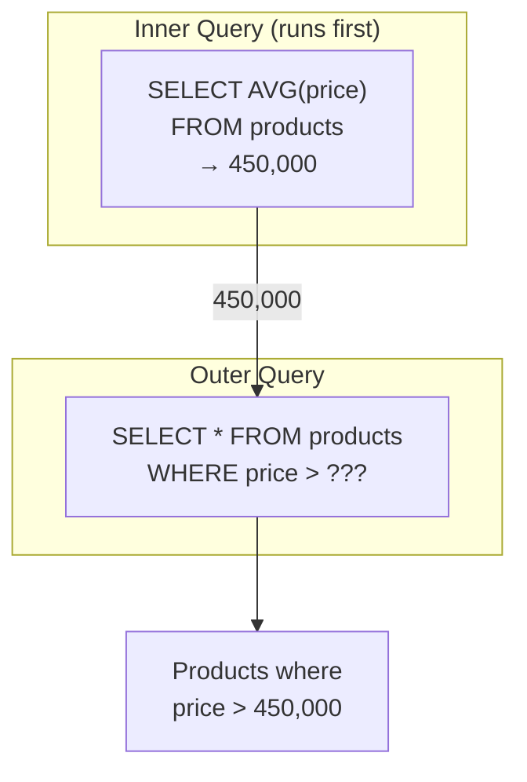

# Lesson 9: Subqueries

A subquery is a `SELECT` statement nested inside another query. It can appear in the `WHERE`, `FROM`, or `SELECT` clause. Subqueries let you break complex questions into smaller, readable steps.



> The inner query runs first, and its result is passed to the outer query.

## Scalar Subqueries in WHERE

A scalar subquery returns a single value (one row, one column). It can be used anywhere a literal value would work.

```sql
-- Products priced above the overall average
SELECT name, price
FROM products
WHERE price > (SELECT AVG(price) FROM products WHERE is_active = 1)
  AND is_active = 1
ORDER BY price ASC;
```

**Result:**

| name                            | price  |
| ------------------------------- | -----: |
| 삼성 오디세이 OLED G8                 | 693300 |
| 엡손 L15160                       | 742100 |
| ASUS ROG Swift OLED PG27AQDM 실버 | 754300 |
| ...                             | ...    |

The inner query `(SELECT AVG(price) FROM products WHERE is_active = 1)` computes the average once, and the outer query compares each product's price against that number.

```sql
-- Customers who joined before the very first order was placed
SELECT name, created_at
FROM customers
WHERE created_at < (SELECT MIN(ordered_at) FROM orders)
LIMIT 5;
```

## IN Subqueries

{ .off-glb width="280"  }

When a subquery can return multiple rows, use `IN` instead of `=`.

```sql
-- Customers who have ever left a 1-star review
SELECT name, email, grade
FROM customers
WHERE id IN (
    SELECT DISTINCT customer_id
    FROM reviews
    WHERE rating = 1
)
ORDER BY name;
```

**Result:**

| name | email                | grade |
| ---- | -------------------- | ----- |
| 강명자  | user162@testmail.kr  | VIP   |
| 강미숙  | user2129@testmail.kr | VIP   |
| ...  | ...                  | ...   |

```sql
-- Products that appear in at least one active cart right now
SELECT name, price, stock_qty
FROM products
WHERE id IN (
    SELECT DISTINCT product_id
    FROM cart_items
)
  AND is_active = 1
ORDER BY name;
```

## NOT IN

{ .off-glb width="280"  }

`NOT IN` finds rows that are *absent* from the subquery result — similar to the `LEFT JOIN ... IS NULL` anti-join pattern.

```sql
-- Products that have NEVER appeared in any order
SELECT name, price
FROM products
WHERE id NOT IN (
    SELECT DISTINCT product_id
    FROM order_items
)
  AND is_active = 1;
```

> **Caution:** `NOT IN` behaves unexpectedly when the subquery returns any NULL values (it returns no rows). Prefer `NOT EXISTS` (Lesson 20) when NULLs might appear.

## FROM Subqueries (Derived Tables)

A subquery in the `FROM` clause creates a temporary, inline table — called a **derived table** or **inline view**.

```sql
-- Average order value per customer grade
SELECT
    grade,
    ROUND(AVG(avg_order), 2) AS avg_order_value
FROM (
    SELECT
        c.grade,
        o.customer_id,
        AVG(o.total_amount) AS avg_order
    FROM orders AS o
    INNER JOIN customers AS c ON o.customer_id = c.id
    WHERE o.status NOT IN ('cancelled', 'returned')
    GROUP BY c.grade, o.customer_id
) AS customer_avgs
GROUP BY grade
ORDER BY avg_order_value DESC;
```

**Result:**

| grade  | avg_order_value |
| ------ | --------------: |
| VIP    |      1297607.02 |
| GOLD   |      1206233.73 |
| SILVER |       873016.36 |
| BRONZE |       702221.89 |

=== "SQLite"
    ```sql
    -- Top 3 highest-revenue months, then show their order counts
    SELECT
        monthly.year_month,
        monthly.revenue,
        monthly.order_count
    FROM (
        SELECT
            SUBSTR(ordered_at, 1, 7) AS year_month,
            SUM(total_amount)        AS revenue,
            COUNT(*)                 AS order_count
        FROM orders
        WHERE status NOT IN ('cancelled', 'returned')
        GROUP BY SUBSTR(ordered_at, 1, 7)
    ) AS monthly
    ORDER BY revenue DESC
    LIMIT 3;
    ```

=== "MySQL"
    ```sql
    SELECT
        monthly.year_month,
        monthly.revenue,
        monthly.order_count
    FROM (
        SELECT
            DATE_FORMAT(ordered_at, '%Y-%m') AS year_month,
            SUM(total_amount)                AS revenue,
            COUNT(*)                         AS order_count
        FROM orders
        WHERE status NOT IN ('cancelled', 'returned')
        GROUP BY DATE_FORMAT(ordered_at, '%Y-%m')
    ) AS monthly
    ORDER BY revenue DESC
    LIMIT 3;
    ```

=== "PostgreSQL"
    ```sql
    SELECT
        monthly.year_month,
        monthly.revenue,
        monthly.order_count
    FROM (
        SELECT
            TO_CHAR(ordered_at, 'YYYY-MM') AS year_month,
            SUM(total_amount)              AS revenue,
            COUNT(*)                       AS order_count
        FROM orders
        WHERE status NOT IN ('cancelled', 'returned')
        GROUP BY TO_CHAR(ordered_at, 'YYYY-MM')
    ) AS monthly
    ORDER BY revenue DESC
    LIMIT 3;
    ```

**Result:**

| year_month | revenue | order_count |
|------------|--------:|------------:|
| 2024-12 | 1841293.70 | 892 |
| 2023-12 | 1624817.40 | 801 |
| 2024-11 | 1312944.90 | 703 |

## Scalar Subqueries in SELECT

A subquery in the `SELECT` list runs once per output row.

```sql
-- Each customer with their most recent order date
SELECT
    c.name,
    c.grade,
    (
        SELECT MAX(ordered_at)
        FROM orders
        WHERE customer_id = c.id
    ) AS last_order_date
FROM customers AS c
WHERE c.is_active = 1
ORDER BY last_order_date DESC
LIMIT 8;
```

**Result:**

| name | grade | last_order_date |
|------|-------|-----------------|
| Jennifer Martinez | VIP | 2024-12-31 |
| David Park | GOLD | 2024-12-30 |
| ... | | |

> Scalar subqueries in `SELECT` can be slow on large tables because they run per row. Consider a `LEFT JOIN` with aggregation for better performance.

!!! note "Lesson Review"
    Quick exercises to check your understanding of this lesson. For comprehensive practice combining multiple concepts, see the [Exercises](../exercises/index.md) section.

## Practice Exercises

### Exercise 1
Find all products whose price is higher than the average price of products in their own category. Return `product_name`, `price`, and `category_id`. Use a scalar subquery in the `WHERE` clause that references the outer query's `category_id`.

??? success "Answer"
    ```sql
    SELECT
        p.name        AS product_name,
        p.price,
        p.category_id
    FROM products AS p
    WHERE p.price > (
        SELECT AVG(p2.price)
        FROM products AS p2
        WHERE p2.category_id = p.category_id
          AND p2.is_active = 1
    )
      AND p.is_active = 1
    ORDER BY p.category_id, p.price DESC;
    ```

### Exercise 2
Use a `FROM` subquery to find the top 10 customers by number of completed orders. The inner query should count orders per customer; the outer query adds the customer's `name` and `grade` by joining to `customers`.

??? success "Answer"
    ```sql
    SELECT
        c.name,
        c.grade,
        order_stats.order_count,
        order_stats.total_spent
    FROM (
        SELECT
            customer_id,
            COUNT(*)            AS order_count,
            SUM(total_amount)   AS total_spent
        FROM orders
        WHERE status IN ('delivered', 'confirmed')
        GROUP BY customer_id
    ) AS order_stats
    INNER JOIN customers AS c ON order_stats.customer_id = c.id
    ORDER BY order_stats.order_count DESC
    LIMIT 10;
    ```

    **Expected result:**

    | name | grade | order_count | total_spent |
    | ---- | ----- | ----------: | ----------: |
    | 김병철  | VIP   |         319 |   291265567 |
    | 이영자  | VIP   |         315 |   284481704 |
    | 박정수  | VIP   |         305 |   339169936 |
    | 강명자  | VIP   |         240 |   296857745 |
    | 김성민  | VIP   |         210 |   220361434 |
    | ...  | ...   | ...         | ...         |


### Exercise 3
Find products that are in the wishlist of at least one customer but have **never appeared in any order**. Use `IN` and `NOT IN` subqueries. Return `product_name` and `price`.

??? success "Answer"
    ```sql
    SELECT name AS product_name, price
    FROM products
    WHERE id IN (
        SELECT DISTINCT product_id FROM wishlists
    )
      AND id NOT IN (
        SELECT DISTINCT product_id FROM order_items
    )
    ORDER BY price DESC;
    ```

    **Expected result:**

    | product_name                  | price  |
    | ----------------------------- | -----: |
    | 삼성 오디세이 OLED G8               | 693300 |
    | ASRock X870E Taichi 실버        | 583500 |
    | 보스 SoundLink Flex 블랙          | 516000 |
    | MSI MAG B860 TOMAHAWK WIFI    | 440900 |
    | be quiet! Dark Power 13 1000W | 359500 |
    | ...                           | ...    |


### Exercise 4
Find all orders whose `total_amount` exceeds the overall average order amount. Return `order_number` and `total_amount`, sorted by `total_amount` descending. Limit to 10 rows. Use a scalar subquery in the `WHERE` clause.

??? success "Answer"
    ```sql
    SELECT order_number, total_amount
    FROM orders
    WHERE total_amount > (
        SELECT AVG(total_amount) FROM orders
    )
    ORDER BY total_amount DESC
    LIMIT 10;
    ```

    **Expected result:**

    | order_number       | total_amount |
    | ------------------ | -----------: |
    | ORD-20210628-12574 |     58039800 |
    | ORD-20230809-24046 |     55047300 |
    | ORD-20210321-11106 |     48718000 |
    | ORD-20200605-07165 |     47954000 |
    | ORD-20231020-25036 |     46945700 |
    | ...                | ...          |


### Exercise 5
Find all products that have been ordered at least once by a `'VIP'` customer. Use an `IN` subquery. Return `product_name` and `price`, sorted by price descending.

??? success "Answer"
    ```sql
    SELECT p.name AS product_name, p.price
    FROM products AS p
    WHERE p.id IN (
        SELECT DISTINCT oi.product_id
        FROM order_items AS oi
        INNER JOIN orders AS o ON oi.order_id = o.id
        INNER JOIN customers AS c ON o.customer_id = c.id
        WHERE c.grade = 'VIP'
    )
    ORDER BY p.price DESC;
    ```

    **Expected result:**

    | product_name                                                  | price   |
    | ------------------------------------------------------------- | ------: |
    | ASUS ROG Strix GT35                                           | 4314800 |
    | ASUS ROG Zephyrus G16                                         | 4284100 |
    | ASUS Dual RTX 5070 Ti [특별 한정판 에디션] 저소음 설계, 에너지 효율 1등급, 친환경 포장 | 4226200 |
    | Razer Blade 18 블랙                                             | 4182100 |
    | Razer Blade 16 실버                                             | 4123800 |
    | ...                                                           | ...     |


### Exercise 6
Find orders that have never had a completed payment. Use a `NOT IN` subquery to exclude `order_id` values from `payments` where `status = 'completed'`. Return `order_number`, `total_amount`, and `status`. Sort by `total_amount` descending and limit to 10 rows.

??? success "Answer"
    ```sql
    SELECT order_number, total_amount, status
    FROM orders
    WHERE id NOT IN (
        SELECT order_id
        FROM payments
        WHERE status = 'completed'
    )
    ORDER BY total_amount DESC
    LIMIT 10;
    ```

    **Expected result:**

    | order_number       | total_amount | status           |
    | ------------------ | -----------: | ---------------- |
    | ORD-20230504-22760 |     19613300 | return_requested |
    | ORD-20240908-29994 |     14691400 | returned         |
    | ORD-20220923-19607 |     14400000 | cancelled        |
    | ORD-20250309-33168 |     13528400 | cancelled        |
    | ORD-20190726-03947 |     11884300 | cancelled        |
    | ...                | ...          | ...              |


### Exercise 7
Use a `FROM` subquery to compute the average product price per category, then join with `categories` in the outer query to show `category_name` and `avg_price`. Sort by `avg_price` descending.

??? success "Answer"
    ```sql
    SELECT
        cat.name       AS category_name,
        price_stats.avg_price
    FROM (
        SELECT
            category_id,
            ROUND(AVG(price), 2) AS avg_price
        FROM products
        WHERE is_active = 1
        GROUP BY category_id
    ) AS price_stats
    INNER JOIN categories AS cat ON price_stats.category_id = cat.id
    ORDER BY price_stats.avg_price DESC;
    ```

    **Expected result:**

    | category_name | avg_price  |
    | ------------- | ---------: |
    | 맥북            |    3774700 |
    | 게이밍 노트북       |    3169700 |
    | NVIDIA        |    2045440 |
    | 일반 노트북        |  1856837.5 |
    | 조립PC          | 1795033.33 |
    | ...           | ...        |


### Exercise 8
For each active product, show its name, price, and the number of reviews it has received using a scalar subquery in the `SELECT` clause. Return `product_name`, `price`, and `review_count`. Sort by `review_count` descending and limit to 10 rows.

??? success "Answer"
    ```sql
    SELECT
        p.name  AS product_name,
        p.price,
        (
            SELECT COUNT(*)
            FROM reviews AS r
            WHERE r.product_id = p.id
        ) AS review_count
    FROM products AS p
    WHERE p.is_active = 1
    ORDER BY review_count DESC
    LIMIT 10;
    ```

    **Expected result:**

    | product_name                    | price  | review_count |
    | ------------------------------- | -----: | -----------: |
    | SteelSeries Aerox 5 Wireless 실버 | 119000 |          111 |
    | SteelSeries Prime Wireless 블랙   |  75900 |           93 |
    | JBL Flip 6 블랙                   | 195900 |           92 |
    | 녹투아 NH-L12S                     |  49400 |           88 |
    | 삼성 DDR4 32GB PC4-25600          |  49100 |           87 |
    | ...                             | ...    | ...          |


### Exercise 9
Find customers whose order count is above the average number of orders per customer. Use a `FROM` subquery to count orders per customer, and a scalar subquery in `WHERE` to compare against the average. Return `customer_id` and `order_count`, sorted by `order_count` descending. Limit to 10 rows.

??? success "Answer"
    ```sql
    SELECT
        customer_id,
        order_count
    FROM (
        SELECT
            customer_id,
            COUNT(*) AS order_count
        FROM orders
        GROUP BY customer_id
    ) AS cust_orders
    WHERE order_count > (
        SELECT AVG(cnt)
        FROM (
            SELECT COUNT(*) AS cnt
            FROM orders
            GROUP BY customer_id
        ) AS avg_calc
    )
    ORDER BY order_count DESC
    LIMIT 10;
    ```

    **Expected result:**

    | customer_id | order_count |
    | ----------: | ----------: |
    |          98 |         346 |
    |          97 |         342 |
    |         226 |         340 |
    |         162 |         254 |
    |         227 |         232 |
    | ...         | ...         |


---
Next: [Lesson 10: CASE Expressions](10-case.md)
