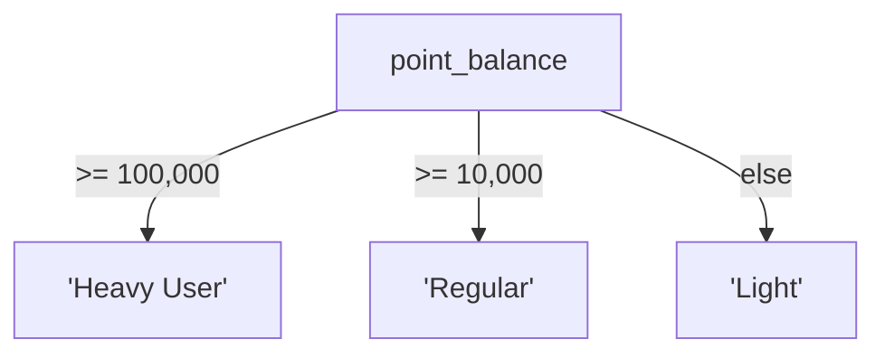

# Lesson 10: CASE Expressions

`CASE` is SQL's conditional expression — similar to `if/else` in programming languages. It lets you transform values, create labels, bucket data into ranges, and conditionally aggregate, all within a single query.



> CASE is SQL's if-else. Conditions are checked top to bottom.

## Simple CASE

The simple form compares a single column against fixed values.

```sql
-- Translate order status codes to readable labels
SELECT
    order_number,
    total_amount,
    CASE status
        WHEN 'pending'          THEN 'Awaiting Payment'
        WHEN 'paid'             THEN 'Payment Received'
        WHEN 'preparing'        THEN 'Being Prepared'
        WHEN 'shipped'          THEN 'In Transit'
        WHEN 'delivered'        THEN 'Delivered'
        WHEN 'confirmed'        THEN 'Complete'
        WHEN 'cancelled'        THEN 'Cancelled'
        WHEN 'return_requested' THEN 'Return Pending'
        WHEN 'returned'         THEN 'Returned'
        ELSE status
    END AS status_label
FROM orders
ORDER BY ordered_at DESC
LIMIT 5;
```

**Result:**

| order_number       | total_amount | status_label     |
| ------------------ | -----------: | ---------------- |
| ORD-20250630-34900 |      1483000 | Awaiting Payment |
| ORD-20250630-34905 |       152600 | Awaiting Payment |
| ORD-20250630-34903 |       401800 | Cancelled        |
| ORD-20250630-34899 |       167500 | Awaiting Payment |
| ORD-20250630-34896 |      1646400 | Awaiting Payment |

## Searched CASE

The searched form evaluates independent `WHEN` conditions, giving you full flexibility with comparisons and expressions.

```sql
-- Bucket products into price tiers
SELECT
    name,
    price,
    CASE
        WHEN price < 50           THEN 'Budget'
        WHEN price BETWEEN 50 AND 199.99  THEN 'Mid-range'
        WHEN price BETWEEN 200 AND 799.99 THEN 'Premium'
        ELSE 'High-end'
    END AS price_tier
FROM products
WHERE is_active = 1
ORDER BY price ASC
LIMIT 10;
```

**Result:**

| name                            | price | price_tier |
| ------------------------------- | ----: | ---------- |
| TP-Link TG-3468 블랙              | 13100 | High-end   |
| Microsoft Ergonomic Keyboard 실버 | 23000 | High-end   |
| TP-Link Archer TBE400E 화이트      | 23300 | High-end   |
| 삼성 SPA-KFG0BUB                  | 26200 | High-end   |
| 삼성 SPA-KFG0BUB 실버               | 27500 | High-end   |
| V3 Endpoint Security 블랙         | 28500 | High-end   |
| Arctic Freezer 36 A-RGB 화이트     | 29800 | High-end   |
| ...                             | ...   | ...        |

## CASE for Age Groups

=== "SQLite"
    ```sql
    -- Classify customers into age cohorts
    SELECT
        name,
        birth_date,
        CASE
            WHEN birth_date IS NULL THEN 'Unknown'
            WHEN CAST(SUBSTR(birth_date, 1, 4) AS INTEGER) >= 1997 THEN 'Gen Z'
            WHEN CAST(SUBSTR(birth_date, 1, 4) AS INTEGER) >= 1981 THEN 'Millennial'
            WHEN CAST(SUBSTR(birth_date, 1, 4) AS INTEGER) >= 1965 THEN 'Gen X'
            ELSE 'Boomer+'
        END AS generation
    FROM customers
    LIMIT 8;
    ```

=== "MySQL"
    ```sql
    SELECT
        name,
        birth_date,
        CASE
            WHEN birth_date IS NULL THEN 'Unknown'
            WHEN YEAR(birth_date) >= 1997 THEN 'Gen Z'
            WHEN YEAR(birth_date) >= 1981 THEN 'Millennial'
            WHEN YEAR(birth_date) >= 1965 THEN 'Gen X'
            ELSE 'Boomer+'
        END AS generation
    FROM customers
    LIMIT 8;
    ```

=== "PostgreSQL"
    ```sql
    SELECT
        name,
        birth_date,
        CASE
            WHEN birth_date IS NULL THEN 'Unknown'
            WHEN EXTRACT(YEAR FROM birth_date) >= 1997 THEN 'Gen Z'
            WHEN EXTRACT(YEAR FROM birth_date) >= 1981 THEN 'Millennial'
            WHEN EXTRACT(YEAR FROM birth_date) >= 1965 THEN 'Gen X'
            ELSE 'Boomer+'
        END AS generation
    FROM customers
    LIMIT 8;
    ```

**Result:**

| name | birth_date | generation |
|------|------------|------------|
| Jennifer Martinez | 1989-04-12 | Millennial |
| Alex Chen | (NULL) | Unknown |
| Robert Kim | 1972-08-27 | Gen X |
| Sarah Johnson | 2000-01-15 | Gen Z |
| ... | | |

## CASE in GROUP BY and Aggregation

`CASE` can be used as a grouping expression or inside aggregate functions.

```sql
-- Count products per price tier
SELECT
    CASE
        WHEN price < 50           THEN 'Budget (<$50)'
        WHEN price BETWEEN 50 AND 199.99  THEN 'Mid-range ($50–$199)'
        WHEN price BETWEEN 200 AND 799.99 THEN 'Premium ($200–$799)'
        ELSE 'High-end ($800+)'
    END AS price_tier,
    COUNT(*)   AS product_count,
    AVG(price) AS avg_price
FROM products
WHERE is_active = 1
GROUP BY price_tier
ORDER BY avg_price;
```

**Result:**

| price_tier | product_count | avg_price |
|------------|--------------:|----------:|
| Budget (<$50) | 42 | 23.87 |
| Mid-range ($50–$199) | 98 | 112.43 |
| Premium ($200–$799) | 87 | 421.29 |
| High-end ($800+) | 53 | 1342.18 |

=== "SQLite"
    ```sql
    -- Pivot: count orders by status as columns
    SELECT
        SUBSTR(ordered_at, 1, 7) AS year_month,
        COUNT(CASE WHEN status = 'confirmed' THEN 1 END) AS confirmed,
        COUNT(CASE WHEN status = 'cancelled' THEN 1 END) AS cancelled,
        COUNT(CASE WHEN status = 'returned'  THEN 1 END) AS returned,
        COUNT(*) AS total
    FROM orders
    WHERE ordered_at LIKE '2024%'
    GROUP BY SUBSTR(ordered_at, 1, 7)
    ORDER BY year_month;
    ```

=== "MySQL"
    ```sql
    SELECT
        DATE_FORMAT(ordered_at, '%Y-%m') AS year_month,
        COUNT(CASE WHEN status = 'confirmed' THEN 1 END) AS confirmed,
        COUNT(CASE WHEN status = 'cancelled' THEN 1 END) AS cancelled,
        COUNT(CASE WHEN status = 'returned'  THEN 1 END) AS returned,
        COUNT(*) AS total
    FROM orders
    WHERE ordered_at >= '2024-01-01'
      AND ordered_at <  '2025-01-01'
    GROUP BY DATE_FORMAT(ordered_at, '%Y-%m')
    ORDER BY year_month;
    ```

=== "PostgreSQL"
    ```sql
    SELECT
        TO_CHAR(ordered_at, 'YYYY-MM') AS year_month,
        COUNT(CASE WHEN status = 'confirmed' THEN 1 END) AS confirmed,
        COUNT(CASE WHEN status = 'cancelled' THEN 1 END) AS cancelled,
        COUNT(CASE WHEN status = 'returned'  THEN 1 END) AS returned,
        COUNT(*) AS total
    FROM orders
    WHERE ordered_at >= '2024-01-01'
      AND ordered_at <  '2025-01-01'
    GROUP BY TO_CHAR(ordered_at, 'YYYY-MM')
    ORDER BY year_month;
    ```

**Result:**

| year_month | confirmed | cancelled | returned | total |
|------------|----------:|----------:|---------:|------:|
| 2024-01 | 198 | 42 | 12 | 312 |
| 2024-02 | 183 | 38 | 9 | 289 |
| 2024-03 | 261 | 57 | 14 | 405 |
| ... | | | | |

## CASE in ORDER BY

You can sort by a computed expression.

```sql
-- Sort orders: active statuses first, terminal statuses last
SELECT order_number, status, total_amount
FROM orders
ORDER BY
    CASE status
        WHEN 'pending'   THEN 1
        WHEN 'paid'      THEN 2
        WHEN 'preparing' THEN 3
        WHEN 'shipped'   THEN 4
        ELSE 5
    END,
    total_amount DESC
LIMIT 10;
```

!!! note "Lesson Review"
    Quick exercises to check your understanding of this lesson. For comprehensive practice combining multiple concepts, see the [Exercises](../exercises/index.md) section.

## Practice Exercises
### Exercise 1
Display `'No memo'` when an order's `notes` column is NULL. Use a CASE expression to return `order_number`, `status`, and `memo` (the notes value if not NULL, otherwise `'No memo'`). Limit to the 15 most recent orders.

??? success "Answer"
    ```sql
    SELECT
        order_number,
        status,
        CASE
            WHEN notes IS NULL THEN 'No memo'
            ELSE notes
        END AS memo
    FROM orders
    ORDER BY ordered_at DESC
    LIMIT 15;
    ```

    **Expected result:**

    | order_number       | status    | memo               |
    | ------------------ | --------- | ------------------ |
    | ORD-20250630-34900 | pending   | 문 앞에 놓아주세요         |
    | ORD-20250630-34905 | pending   | No memo            |
    | ORD-20250630-34903 | cancelled | 오후 2시 이후 배송 부탁드립니다 |
    | ORD-20250630-34899 | pending   | 배송 전 연락 부탁합니다      |
    | ORD-20250630-34896 | pending   | 경비실에 맡겨주세요         |
    | ...                | ...       | ...                |


    **Expected result:**

    | order_number       | status    | memo               |
    | ------------------ | --------- | ------------------ |
    | ORD-20250630-34900 | pending   | 문 앞에 놓아주세요         |
    | ORD-20250630-34905 | pending   | No memo            |
    | ORD-20250630-34903 | cancelled | 오후 2시 이후 배송 부탁드립니다 |
    | ORD-20250630-34899 | pending   | 배송 전 연락 부탁합니다      |
    | ORD-20250630-34896 | pending   | 경비실에 맡겨주세요         |
    | ...                | ...       | ...                |


### Exercise 2
Sort active staff so that `'manager'` roles appear first, then `'staff'`, then any other role. Within the same role, sort by `name` ascending. Return `name`, `department`, and `role`.

??? success "Answer"
    ```sql
    SELECT name, department, role
    FROM staff
    WHERE is_active = 1
    ORDER BY
        CASE role
            WHEN 'manager' THEN 1
            WHEN 'staff'   THEN 2
            ELSE 3
        END,
        name ASC;
    ```

    **Expected result:**

    | name | department | role    |
    | ---- | ---------- | ------- |
    | 권영희  | 마케팅        | manager |
    | 이준혁  | 영업         | manager |
    | 박경수  | 경영         | admin   |
    | 장주원  | 경영         | admin   |
    | 한민재  | 경영         | admin   |


    **Expected result:**

    | name | department | role    |
    | ---- | ---------- | ------- |
    | 권영희  | 마케팅        | manager |
    | 이준혁  | 영업         | manager |
    | 박경수  | 경영         | admin   |
    | 장주원  | 경영         | admin   |
    | 한민재  | 경영         | admin   |


### Exercise 3
Translate `payments.method` to a readable label using a simple CASE: `'card'` → `'Credit Card'`, `'bank_transfer'` → `'Bank Transfer'`, `'cash'` → `'Cash'`, anything else → `'Other'`. Return `id`, `amount`, and `method_label`. Limit to 10 rows.

??? success "Answer"
    ```sql
    SELECT
        id,
        amount,
        CASE method
            WHEN 'card'          THEN 'Credit Card'
            WHEN 'bank_transfer' THEN 'Bank Transfer'
            WHEN 'cash'          THEN 'Cash'
            ELSE 'Other'
        END AS method_label
    FROM payments
    LIMIT 10;
    ```

    **Expected result:**

    | id | amount | method_label |
    | -: | -----: | ------------ |
    |  1 | 130700 | Credit Card  |
    |  2 | 130700 | Credit Card  |
    |  3 | 265400 | Credit Card  |
    |  4 | 130700 | Other        |
    |  5 | 131390 | Other        |
    | ... | ...    | ...          |


    **Expected result:**

    | id | amount | method_label |
    | -: | -----: | ------------ |
    |  1 | 130700 | Credit Card  |
    |  2 | 130700 | Credit Card  |
    |  3 | 265400 | Credit Card  |
    |  4 | 130700 | Other        |
    |  5 | 131390 | Other        |
    | ... | ...    | ...          |


### Exercise 4
Add a `stock_status` column to a product listing: `'Out of Stock'` when `stock_qty = 0`, `'Low Stock'` when `1–10`, `'In Stock'` when `11–100`, and `'Well Stocked'` when over 100. Return `name`, `stock_qty`, and `stock_status` for all active products.

??? success "Answer"
    ```sql
    SELECT
        name,
        stock_qty,
        CASE
            WHEN stock_qty = 0         THEN 'Out of Stock'
            WHEN stock_qty <= 10       THEN 'Low Stock'
            WHEN stock_qty <= 100      THEN 'In Stock'
            ELSE 'Well Stocked'
        END AS stock_status
    FROM products
    WHERE is_active = 1
    ORDER BY stock_qty ASC;
    ```

    **Expected result:**

    | name                         | stock_qty | stock_status |
    | ---------------------------- | --------: | ------------ |
    | Arctic Freezer 36 A-RGB 화이트  |         0 | Out of Stock |
    | 삼성 SPA-KFG0BUB               |         4 | Low Stock    |
    | 로지텍 G502 HERO 실버             |         8 | Low Stock    |
    | ASUS ROG Strix Scar 16       |        18 | In Stock     |
    | MSI MPG X870E CARBON WIFI 블랙 |        21 | In Stock     |
    | ...                          | ...       | ...          |


### Exercise 5
Create a generation breakdown report: count how many active customers fall into each generation (Gen Z: born 1997+, Millennial: 1981–1996, Gen X: 1965–1980, Boomer+: before 1965, Unknown: NULL birth_date). Return `generation` and `customer_count`.

??? success "Answer"
    === "SQLite"
        ```sql
        SELECT
            CASE
                WHEN birth_date IS NULL THEN 'Unknown'
                WHEN CAST(SUBSTR(birth_date, 1, 4) AS INTEGER) >= 1997 THEN 'Gen Z'
                WHEN CAST(SUBSTR(birth_date, 1, 4) AS INTEGER) >= 1981 THEN 'Millennial'
                WHEN CAST(SUBSTR(birth_date, 1, 4) AS INTEGER) >= 1965 THEN 'Gen X'
                ELSE 'Boomer+'
            END AS generation,
            COUNT(*) AS customer_count
        FROM customers
        WHERE is_active = 1
        GROUP BY generation
        ORDER BY customer_count DESC;
        ```

        **Expected result:**

        | generation | customer_count |
        | ---------- | -------------: |
        | Millennial |           1808 |
        | Gen Z      |            829 |
        | Unknown    |            560 |
        | Gen X      |            558 |
        | Boomer+    |             61 |


        **Expected result:**

        | generation | customer_count |
        | ---------- | -------------: |
        | Millennial |           1808 |
        | Gen Z      |            829 |
        | Unknown    |            560 |
        | Gen X      |            558 |
        | Boomer+    |             61 |


    === "MySQL"
        ```sql
        SELECT
            CASE
                WHEN birth_date IS NULL THEN 'Unknown'
                WHEN YEAR(birth_date) >= 1997 THEN 'Gen Z'
                WHEN YEAR(birth_date) >= 1981 THEN 'Millennial'
                WHEN YEAR(birth_date) >= 1965 THEN 'Gen X'
                ELSE 'Boomer+'
            END AS generation,
            COUNT(*) AS customer_count
        FROM customers
        WHERE is_active = 1
        GROUP BY generation
        ORDER BY customer_count DESC;
        ```

    === "PostgreSQL"
        ```sql
        SELECT
            CASE
                WHEN birth_date IS NULL THEN 'Unknown'
                WHEN EXTRACT(YEAR FROM birth_date) >= 1997 THEN 'Gen Z'
                WHEN EXTRACT(YEAR FROM birth_date) >= 1981 THEN 'Millennial'
                WHEN EXTRACT(YEAR FROM birth_date) >= 1965 THEN 'Gen X'
                ELSE 'Boomer+'
            END AS generation,
            COUNT(*) AS customer_count
        FROM customers
        WHERE is_active = 1
        GROUP BY generation
        ORDER BY customer_count DESC;
        ```


### Exercise 6
Convert `rating` in the `reviews` table to a text label: 5 → `'Excellent'`, 4 → `'Good'`, 3 → `'Average'`, 2 → `'Poor'`, 1 → `'Terrible'`. Show the review count and average rating per label. Return `rating_label`, `review_count`, `avg_rating`, sorted by `avg_rating` descending.

??? success "Answer"
    ```sql
    SELECT
        CASE rating
            WHEN 5 THEN 'Excellent'
            WHEN 4 THEN 'Good'
            WHEN 3 THEN 'Average'
            WHEN 2 THEN 'Poor'
            WHEN 1 THEN 'Terrible'
        END AS rating_label,
        COUNT(*)            AS review_count,
        ROUND(AVG(rating), 2) AS avg_rating
    FROM reviews
    GROUP BY rating
    ORDER BY avg_rating DESC;
    ```

    **Expected result:**

    | rating_label | review_count | avg_rating |
    | ------------ | -----------: | ---------: |
    | Excellent    |         3221 |          5 |
    | Good         |         2362 |          4 |
    | Average      |         1193 |          3 |
    | Poor         |          774 |          2 |
    | Terrible     |          395 |          1 |


    **Expected result:**

    | rating_label | review_count | avg_rating |
    | ------------ | -----------: | ---------: |
    | Excellent    |         3221 |          5 |
    | Good         |         2362 |          4 |
    | Average      |         1193 |          3 |
    | Poor         |          774 |          2 |
    | Terrible     |          395 |          1 |


### Exercise 7
Classify customers by `point_balance` into three tiers: 100,000+ as `'Heavy User'`, 10,000+ as `'Regular'`, and the rest as `'Light'`. For each `grade`, count the number of customers in each tier. Return `grade`, `heavy_count`, `regular_count`, and `light_count`.

??? success "Answer"
    ```sql
    SELECT
        grade,
        COUNT(CASE WHEN point_balance >= 100000 THEN 1 END) AS heavy_count,
        COUNT(CASE WHEN point_balance >= 10000
                    AND point_balance < 100000 THEN 1 END) AS regular_count,
        COUNT(CASE WHEN point_balance < 10000 THEN 1 END)  AS light_count
    FROM customers
    WHERE is_active = 1
    GROUP BY grade
    ORDER BY grade;
    ```

    **Expected result:**

    | grade  | heavy_count | regular_count | light_count |
    | ------ | ----------: | ------------: | ----------: |
    | BRONZE |         198 |           570 |        1780 |
    | GOLD   |         206 |           278 |           0 |
    | SILVER |         117 |           292 |          60 |
    | VIP    |         251 |            64 |           0 |


    **Expected result:**

    | grade  | heavy_count | regular_count | light_count |
    | ------ | ----------: | ------------: | ----------: |
    | BRONZE |         198 |           570 |        1780 |
    | GOLD   |         206 |           278 |           0 |
    | SILVER |         117 |           292 |          60 |
    | VIP    |         251 |            64 |           0 |


### Exercise 8
Bucket orders by `total_amount` into tiers: under 100 as `'Small'`, 100 to under 500 as `'Medium'`, 500+ as `'Large'`. Count orders and sum revenue per tier, with the largest tier shown first. Return `amount_tier`, `order_count`, and `total_revenue`.

??? success "Answer"
    ```sql
    SELECT
        CASE
            WHEN total_amount < 100      THEN 'Small'
            WHEN total_amount < 500      THEN 'Medium'
            ELSE 'Large'
        END AS amount_tier,
        COUNT(*)          AS order_count,
        SUM(total_amount) AS total_revenue
    FROM orders
    WHERE status NOT IN ('cancelled', 'returned')
    GROUP BY amount_tier
    ORDER BY
        CASE
            WHEN total_amount < 100 THEN 3
            WHEN total_amount < 500 THEN 2
            ELSE 1
        END;
    ```

    **Expected result:**

    | amount_tier | order_count | total_revenue |
    | ----------- | ----------: | ------------: |
    | Large       |       32695 |   33168376925 |


    **Expected result:**

    | amount_tier | order_count | total_revenue |
    | ----------- | ----------: | ------------: |
    | Large       |       32695 |   33168376925 |


### Exercise 9
Pivot payment outcomes by method: count `'completed'` payments as successes and all others as failures. Return `method`, `success_count`, `fail_count`, and `success_rate` (percentage rounded to 1 decimal). Sort by `success_rate` descending.

??? success "Answer"
    ```sql
    SELECT
        method,
        COUNT(CASE WHEN status = 'completed' THEN 1 END) AS success_count,
        COUNT(CASE WHEN status != 'completed' THEN 1 END) AS fail_count,
        ROUND(
            COUNT(CASE WHEN status = 'completed' THEN 1 END) * 100.0
            / COUNT(*),
            1
        ) AS success_rate
    FROM payments
    GROUP BY method
    ORDER BY success_rate DESC;
    ```

    **Expected result:**

    | method          | success_count | fail_count | success_rate |
    | --------------- | ------------: | ---------: | -----------: |
    | virtual_account |          1638 |        134 |         92.4 |
    | card            |         14522 |       1206 |         92.3 |
    | naver_pay       |          4835 |        417 |         92.1 |
    | kakao_pay       |          6359 |        543 |         92.1 |
    | bank_transfer   |          3194 |        289 |         91.7 |
    | ...             | ...           | ...        | ...          |


    **Expected result:**

    | method          | success_count | fail_count | success_rate |
    | --------------- | ------------: | ---------: | -----------: |
    | virtual_account |          1638 |        134 |         92.4 |
    | card            |         14522 |       1206 |         92.3 |
    | naver_pay       |          4835 |        417 |         92.1 |
    | kakao_pay       |          6359 |        543 |         92.1 |
    | bank_transfer   |          3194 |        289 |         91.7 |
    | ...             | ...           | ...        | ...          |


### Exercise 10
For each product, calculate the revenue earned in each quarter of 2024 as separate columns (`q1_revenue`, `q2_revenue`, `q3_revenue`, `q4_revenue`) using conditional aggregation (`SUM(CASE WHEN ... THEN ... END)`). Only show products with any 2024 sales. Limit to 10 rows by total 2024 revenue descending.

??? success "Answer"
    ```sql
    SELECT
        p.name AS product_name,
        SUM(CASE WHEN o.ordered_at BETWEEN '2024-01-01' AND '2024-03-31 23:59:59'
                 THEN oi.quantity * oi.unit_price ELSE 0 END) AS q1_revenue,
        SUM(CASE WHEN o.ordered_at BETWEEN '2024-04-01' AND '2024-06-30 23:59:59'
                 THEN oi.quantity * oi.unit_price ELSE 0 END) AS q2_revenue,
        SUM(CASE WHEN o.ordered_at BETWEEN '2024-07-01' AND '2024-09-30 23:59:59'
                 THEN oi.quantity * oi.unit_price ELSE 0 END) AS q3_revenue,
        SUM(CASE WHEN o.ordered_at BETWEEN '2024-10-01' AND '2024-12-31 23:59:59'
                 THEN oi.quantity * oi.unit_price ELSE 0 END) AS q4_revenue
    FROM order_items AS oi
    INNER JOIN orders    AS o ON oi.order_id   = o.id
    INNER JOIN products  AS p ON oi.product_id = p.id
    WHERE o.ordered_at LIKE '2024%'
      AND o.status NOT IN ('cancelled', 'returned')
    GROUP BY p.id, p.name
    ORDER BY (q1_revenue + q2_revenue + q3_revenue + q4_revenue) DESC
    LIMIT 10;
    ```

    **Expected result:**

    | product_name                 | q1_revenue | q2_revenue | q3_revenue | q4_revenue |
    | ---------------------------- | ---------: | ---------: | ---------: | ---------: |
    | Razer Blade 18 블랙            |   37638900 |   29274700 |   41821000 |   37638900 |
    | Razer Blade 18 화이트           |   29886300 |   53131200 |   29886300 |   33207000 |
    | Razer Blade 16 실버            |   45361800 |   24742800 |   20619000 |   20619000 |
    | Razer Blade 18 블랙            |   29875000 |   17925000 |   29875000 |   32862500 |
    | SAPPHIRE PULSE RX 7800 XT 실버 |   35413200 |   22297200 |   14427600 |   31478400 |
    | ...                          | ...        | ...        | ...        | ...        |


    **Expected result:**

    | product_name                 | q1_revenue | q2_revenue | q3_revenue | q4_revenue |
    | ---------------------------- | ---------: | ---------: | ---------: | ---------: |
    | Razer Blade 18 블랙            |   37638900 |   29274700 |   41821000 |   37638900 |
    | Razer Blade 18 화이트           |   29886300 |   53131200 |   29886300 |   33207000 |
    | Razer Blade 16 실버            |   45361800 |   24742800 |   20619000 |   20619000 |
    | Razer Blade 18 블랙            |   29875000 |   17925000 |   29875000 |   32862500 |
    | SAPPHIRE PULSE RX 7800 XT 실버 |   35413200 |   22297200 |   14427600 |   31478400 |
    | ...                          | ...        | ...        | ...        | ...        |


---
Next: [Lesson 11: Date and Time Functions](11-datetime.md)
