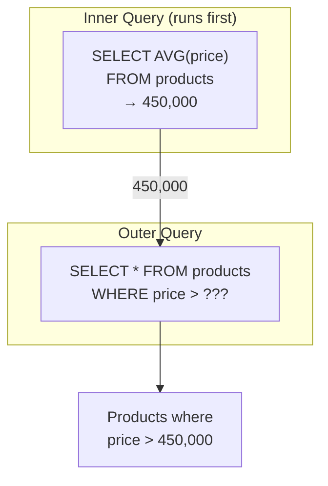

# Lesson 10: Subqueries

We learned how to connect tables with JOINs. Now we learn about subqueries -- queries nested inside other queries. You can use the result of one query as a condition in another, like finding "products more expensive than the average price".

!!! note "Already familiar?"
    If you're comfortable with scalar subqueries, inline views, and WHERE subqueries, skip ahead to [Lesson 11: Date/Time Functions](11-datetime.md).

A subquery is a `SELECT` statement nested inside another query. It can be used in `WHERE`, `FROM`, or `SELECT` clauses. Subqueries let you break down complex questions into small, readable steps.



> The inner query runs first, and its result is passed to the outer query.

## Scalar Subqueries in WHERE

A scalar subquery returns a single value (1 row, 1 column). It can be used anywhere a literal value would go.

```sql
-- Products more expensive than overall average price
SELECT name, price
FROM products
WHERE price > (SELECT AVG(price) FROM products WHERE is_active = 1)
  AND is_active = 1
ORDER BY price ASC;
```

**Result:**

| name | price |
| ---------- | ----------: |
| ASRock B850M Pro RS Silver | 665600.0 |
| ASUS ExpertCenter PN65 Silver | 722100.0 |
| Hansung BossMonster DX9900 Silver | 739900.0 |
| Netgear Orbi 970 Black | 762500.0 |
| MSI MAG Z790 TOMAHAWK WIFI | 795600.0 |
| Samsung DM500TDA Silver | 822100.0 |
| SAPPHIRE PULSE RX 7800 XT Black | 862500.0 |
| Dell U2724D Black | 870200.0 |
| ... | ... |

The inner query `(SELECT AVG(price) FROM products WHERE is_active = 1)` calculates the average once, then the outer query compares each product price against that value.

```sql
-- Customers who signed up before the first order
SELECT name, created_at
FROM customers
WHERE created_at < (SELECT MIN(ordered_at) FROM orders)
LIMIT 5;
```

## IN Subqueries

{ .off-glb width="280"  }

When a subquery can return multiple rows, use `IN` instead of `=`.

```sql
-- Customers who have left a 1-star review
SELECT name, email, grade
FROM customers
WHERE id IN (
    SELECT DISTINCT customer_id
    FROM reviews
    WHERE rating = 1
)
ORDER BY name;
```

**Result:**

| name | email | grade |
| ---------- | ---------- | ---------- |
| Adam Mcdaniel | user3712@testmail.kr | BRONZE |
| Adam Moore | user3@testmail.kr | VIP |
| Alan Newman | user1516@testmail.kr | VIP |
| Alejandro Waller | user1176@testmail.kr | GOLD |
| Alexandria Hicks | user1818@testmail.kr | BRONZE |
| Alicia Frey | user3259@testmail.kr | VIP |
| Allen Snyder | user226@testmail.kr | VIP |
| Allen West | user2493@testmail.kr | GOLD |
| ... | ... | ... |

```sql
-- Active products currently in shopping carts
SELECT name, price, stock_qty
FROM products
WHERE id IN (
    SELECT DISTINCT product_id
    FROM cart_items
)
  AND is_active = 1
ORDER BY name;
```

## NOT IN

{ .off-glb width="280"  }

`NOT IN` finds rows that are **not in** the subquery result -- similar to the `LEFT JOIN ... IS NULL` anti-join pattern.

```sql
-- Products that have never been ordered
SELECT name, price
FROM products
WHERE id NOT IN (
    SELECT DISTINCT product_id
    FROM order_items
)
  AND is_active = 1;
```

> **Warning:** If the subquery returns even one NULL value, `NOT IN` behaves unexpectedly (returning no rows at all). When NULLs may be present, use `NOT EXISTS` (Lesson 20) instead.

## FROM Subqueries (Derived Tables)

A subquery in the `FROM` clause creates a temporary inline table. This is called a **derived table** or **inline view**.

```sql
-- Average order amount by customer grade
SELECT
    grade,
    ROUND(AVG(avg_order), 2) AS avg_order_value
FROM (
    SELECT
        c.grade,
        o.customer_id,
        AVG(o.total_amount) AS avg_order
    FROM orders AS o
    INNER JOIN customers AS c ON o.customer_id = c.id
    WHERE o.status NOT IN ('cancelled', 'returned')
    GROUP BY c.grade, o.customer_id
) AS customer_avgs
GROUP BY grade
ORDER BY avg_order_value DESC;
```

**Result:**

| grade | avg_order_value |
| ---------- | ----------: |
| VIP | 1430749.76 |
| GOLD | 1115867.67 |
| SILVER | 881870.78 |
| BRONZE | 690005.82 |

=== "SQLite"
    ```sql
    -- Top 3 months by revenue with order count
    SELECT
        monthly.year_month,
        monthly.revenue,
        monthly.order_count
    FROM (
        SELECT
            SUBSTR(ordered_at, 1, 7) AS year_month,
            SUM(total_amount)        AS revenue,
            COUNT(*)                 AS order_count
        FROM orders
        WHERE status NOT IN ('cancelled', 'returned')
        GROUP BY SUBSTR(ordered_at, 1, 7)
    ) AS monthly
    ORDER BY revenue DESC
    LIMIT 3;
    ```

=== "MySQL"
    ```sql
    SELECT
        monthly.year_month,
        monthly.revenue,
        monthly.order_count
    FROM (
        SELECT
            DATE_FORMAT(ordered_at, '%Y-%m') AS year_month,
            SUM(total_amount)                AS revenue,
            COUNT(*)                         AS order_count
        FROM orders
        WHERE status NOT IN ('cancelled', 'returned')
        GROUP BY DATE_FORMAT(ordered_at, '%Y-%m')
    ) AS monthly
    ORDER BY revenue DESC
    LIMIT 3;
    ```

=== "PostgreSQL"
    ```sql
    SELECT
        monthly.year_month,
        monthly.revenue,
        monthly.order_count
    FROM (
        SELECT
            TO_CHAR(ordered_at, 'YYYY-MM') AS year_month,
            SUM(total_amount)              AS revenue,
            COUNT(*)                       AS order_count
        FROM orders
        WHERE status NOT IN ('cancelled', 'returned')
        GROUP BY TO_CHAR(ordered_at, 'YYYY-MM')
    ) AS monthly
    ORDER BY revenue DESC
    LIMIT 3;
    ```

**Result:**

| year_month | revenue | order_count |
|------------|--------:|------------:|
| 2024-12 | 1841293.70 | 892 |
| 2023-12 | 1624817.40 | 801 |
| 2024-11 | 1312944.90 | 703 |

## Scalar Subqueries in SELECT

A subquery in the `SELECT` list executes once for each output row.

```sql
-- Most recent order date for each customer
SELECT
    c.name,
    c.grade,
    (
        SELECT MAX(ordered_at)
        FROM orders
        WHERE customer_id = c.id
    ) AS last_order_date
FROM customers AS c
WHERE c.is_active = 1
ORDER BY last_order_date DESC
LIMIT 8;
```

**Result:**

| name | grade | last_order_date |
| ---------- | ---------- | ---------- |
| Angel Jones | BRONZE | 2025-12-31 22:25:39 |
| Carla Watson | GOLD | 2025-12-31 21:40:27 |
| Martin Hanson | SILVER | 2025-12-31 20:00:48 |
| Lucas Johnson | BRONZE | 2025-12-31 18:43:56 |
| Adam Moore | BRONZE | 2025-12-31 18:00:24 |
| Justin Murphy | VIP | 2025-12-31 15:43:23 |
| Sara Hill | GOLD | 2025-12-31 15:33:05 |
| David York | GOLD | 2025-12-31 15:08:54 |
| ... | ... | ... |

> Scalar subqueries in `SELECT` execute per row, so they can be slow on large tables. When performance matters, use `LEFT JOIN` with aggregation instead.

## Summary

| Concept | Description | Example |
|------|------|------|
| Scalar subquery | Subquery that returns a single value | `WHERE price > (SELECT AVG(price) ...)` |
| IN subquery | Subquery returning multiple values to check membership | `WHERE id IN (SELECT product_id ...)` |
| NOT IN | Find rows not in the subquery result (watch for NULLs) | `WHERE id NOT IN (SELECT ...)` |
| Derived table (FROM) | Create a temporary inline table in the FROM clause | `FROM (SELECT ... GROUP BY ...) AS sub` |
| SELECT scalar | Calculate a value per row in the SELECT list | `(SELECT MAX(ordered_at) ...) AS last_order` |
| Correlated subquery | Subquery that references a value from the outer query | `WHERE p2.category_id = p.category_id` |

!!! note "Lesson Review Problems"
    These are simple problems to immediately test the concepts from this lesson. For comprehensive practice combining multiple concepts, see the [Practice Problems](../exercises/index.md) section.

## Practice Problems
### Problem 1
Find orders that have never had a completed payment. Use a `NOT IN` subquery to exclude `order_id`s from the `payments` table where `status = 'completed'`. Return `order_number`, `total_amount`, `status`, sorted by `total_amount` descending, limited to 10 rows.

??? success "Answer"
    ```sql
    SELECT order_number, total_amount, status
    FROM orders
    WHERE id NOT IN (
        SELECT order_id
        FROM payments
        WHERE status = 'completed'
    )
    ORDER BY total_amount DESC
    LIMIT 10;
    ```

    **Result (example):**

| order_number | total_amount | status |
| ---------- | ----------: | ---------- |
| ORD-20230523-22331 | 46094971.0 | cancelled |
| ORD-20221231-20394 | 43585700.0 | cancelled |
| ORD-20211112-14229 | 20640700.0 | cancelled |
| ORD-20200316-05860 | 19280300.0 | return_requested |
| ORD-20250424-33207 | 19179500.0 | return_requested |
| ORD-20250307-32312 | 18229600.0 | cancelled |
| ORD-20190519-03402 | 15130700.0 | returned |
| ORD-20250924-35599 | 14735700.0 | cancelled |
| ... | ... | ... |


### Problem 2
Query orders with amounts greater than the overall average order amount. Return `order_number`, `total_amount`, sorted by `total_amount` descending, limited to 10 rows. Use a scalar subquery in the `WHERE` clause.

??? success "Answer"
    ```sql
    SELECT order_number, total_amount
    FROM orders
    WHERE total_amount > (
        SELECT AVG(total_amount) FROM orders
    )
    ORDER BY total_amount DESC
    LIMIT 10;
    ```

    **Result (example):**

| order_number | total_amount |
| ---------- | ----------: |
| ORD-20201121-08810 | 50867500.0 |
| ORD-20250305-32265 | 46820024.0 |
| ORD-20230523-22331 | 46094971.0 |
| ORD-20200209-05404 | 43677500.0 |
| ORD-20221231-20394 | 43585700.0 |
| ORD-20251218-37240 | 38626400.0 |
| ORD-20220106-15263 | 37987600.0 |
| ORD-20200820-07684 | 37518200.0 |
| ... | ... |


### Problem 3
Use a scalar subquery in the `SELECT` clause to find each product's name and its review count. Return `product_name`, `price`, `review_count`, sorted by `review_count` descending, limited to 10 rows. Only include active products.

??? success "Answer"
    ```sql
    SELECT
        p.name  AS product_name,
        p.price,
        (
            SELECT COUNT(*)
            FROM reviews AS r
            WHERE r.product_id = p.id
        ) AS review_count
    FROM products AS p
    WHERE p.is_active = 1
    ORDER BY review_count DESC
    LIMIT 10;
    ```

    **Result (example):**

| product_name | price | review_count |
| ---------- | ----------: | ----------: |
| SteelSeries Prime Wireless Silver | 95900.0 | 105 |
| Kingston FURY Beast DDR4 16GB Silver | 48000.0 | 102 |
| Logitech G502 X PLUS | 97500.0 | 101 |
| SteelSeries Aerox 5 Wireless Silver | 100000.0 | 100 |
| Ducky One 3 TKL White | 189100.0 | 89 |
| Samsung SPA-KFG0BUB Silver | 21900.0 | 82 |
| SteelSeries Prime Wireless Black | 89800.0 | 80 |
| Crucial T700 2TB Silver | 257000.0 | 77 |
| ... | ... | ... |


### Problem 4
Find all products priced above the average price within their own category. Use a correlated scalar subquery in the `WHERE` clause that references the outer query's `category_id`. Return `product_name`, `price`, `category_id`.

??? success "Answer"
    ```sql
    SELECT
        p.name        AS product_name,
        p.price,
        p.category_id
    FROM products AS p
    WHERE p.price > (
        SELECT AVG(p2.price)
        FROM products AS p2
        WHERE p2.category_id = p.category_id
          AND p2.is_active = 1
    )
      AND p.is_active = 1
    ORDER BY p.category_id, p.price DESC;
    ```

    **Result (example):**

| product_name | price | category_id |
| ---------- | ----------: | ----------: |
| LG All-in-One PC 27V70Q Silver | 1093200.0 | 2 |
| ASUS ROG Strix G16CH White | 3671500.0 | 3 |
| ASUS ROG Strix GT35 | 3296800.0 | 3 |
| ASUS ROG Strix G16CH Silver | 1879100.0 | 3 |
| Jooyon Rionine i9 High-End | 1849900.0 | 3 |
| ASUS ExpertBook B5 [Special Limited Edition] RGB lighting equipped, software customization supported | 2121600.0 | 6 |
| HP EliteBook 840 G10 Black [Special Limited Edition] Extended 3-year warranty + exclusive carrying case included | 2080300.0 | 6 |
| ASUS ExpertBook B5 White | 2068800.0 | 6 |
| ... | ... | ... |


### Problem 5
Find products that are in at least one customer's wishlist but have **never been ordered**. Use `IN` and `NOT IN` subqueries and return `product_name` and `price`.

??? success "Answer"
    ```sql
    SELECT name AS product_name, price
    FROM products
    WHERE id IN (
        SELECT DISTINCT product_id FROM wishlists
    )
      AND id NOT IN (
        SELECT DISTINCT product_id FROM order_items
    )
    ORDER BY price DESC;
    ```

    **Result (example):**

    | product_name                  | price  |
    | ----------------------------- | -----: |
    | 삼성 오디세이 OLED G8               | 693300 |
    | ASRock X870E Taichi 실버        | 583500 |
    | 보스 SoundLink Flex 블랙          | 516000 |
    | MSI MAG B860 TOMAHAWK WIFI    | 440900 |
    | be quiet! Dark Power 13 1000W | 359500 |
    | ...                           | ...    |


### Problem 6
Use a `FROM` subquery to first calculate the average product price per category, then join with the `categories` table in the outer query to return `category_name` and `avg_price`. Sort by `avg_price` descending.

??? success "Answer"
    ```sql
    SELECT
        cat.name       AS category_name,
        price_stats.avg_price
    FROM (
        SELECT
            category_id,
            ROUND(AVG(price), 2) AS avg_price
        FROM products
        WHERE is_active = 1
        GROUP BY category_id
    ) AS price_stats
    INNER JOIN categories AS cat ON price_stats.category_id = cat.id
    ORDER BY price_stats.avg_price DESC;
    ```

    **Result (example):**

| category_name | avg_price |
| ---------- | ----------: |
| MacBook | 5481100.0 |
| Gaming Laptop | 2887583.33 |
| NVIDIA | 2207600.0 |
| Custom Build | 1836466.67 |
| General Laptop | 1794812.5 |
| Professional Monitor | 1492983.33 |
| 2-in-1 | 1417242.86 |
| AMD | 1214266.67 |
| ... | ... |


### Problem 7
`VIP'` grade customers. Use an `IN` subquery and return `product_name` and `price`. Sort by price descending.

??? success "Answer"
    ```sql
    SELECT p.name AS product_name, p.price
    FROM products AS p
    WHERE p.id IN (
        SELECT DISTINCT oi.product_id
        FROM order_items AS oi
        INNER JOIN orders AS o ON oi.order_id = o.id
        INNER JOIN customers AS c ON o.customer_id = c.id
        WHERE c.grade = 'VIP'
    )
    ORDER BY p.price DESC;
    ```

    **Result (example):**

| product_name | price |
| ---------- | ----------: |
| MacBook Air 15 M3 Silver | 5481100.0 |
| ASUS TUF Gaming RTX 5080 White | 4526600.0 |
| ASUS Dual RTX 5070 Ti [Special Limited Edition] Low-noise design, energy efficiency rated, eco-friendly packaging | 4496700.0 |
| Razer Blade 18 Black | 4353100.0 |
| Razer Blade 16 Silver | 3702900.0 |
| ASUS ROG Strix G16CH White | 3671500.0 |
| ASUS ROG Zephyrus G16 | 3429900.0 |
| ASUS ROG Strix GT35 | 3296800.0 |
| ... | ... |


### Problem 8
Use a `FROM` subquery to find the top 10 customers by number of completed orders. Count orders per customer in the inner query, then join with the `customers` table in the outer query to add `name` and `grade`.

??? success "Answer"
    ```sql
    SELECT
        c.name,
        c.grade,
        order_stats.order_count,
        order_stats.total_spent
    FROM (
        SELECT
            customer_id,
            COUNT(*)            AS order_count,
            SUM(total_amount)   AS total_spent
        FROM orders
        WHERE status IN ('delivered', 'confirmed')
        GROUP BY customer_id
    ) AS order_stats
    INNER JOIN customers AS c ON order_stats.customer_id = c.id
    ORDER BY order_stats.order_count DESC
    LIMIT 10;
    ```

    **Result (example):**

| name | grade | order_count | total_spent |
| ---------- | ---------- | ----------: | ----------: |
| Jason Rivera | VIP | 340 | 362705631.0 |
| Allen Snyder | VIP | 302 | 403081258.0 |
| Gabriel Walters | VIP | 275 | 230165991.0 |
| Brenda Garcia | VIP | 249 | 253180338.0 |
| James Banks | VIP | 230 | 234708853.0 |
| Courtney Huff | VIP | 223 | 244604910.0 |
| Ronald Arellano | VIP | 219 | 235775349.0 |
| Michael Duncan | VIP | 188 | 184685776.0 |
| ... | ... | ... | ... |


### Problem 9
Find customers whose order count exceeds the overall average order count per customer. Use a `FROM` subquery to first get the order count per customer, then use a scalar subquery in the `WHERE` clause to compare against the average. Return `customer_id` and `order_count`, sorted by `order_count` descending, limited to 10 rows.

??? success "Answer"
    ```sql
    SELECT
        customer_id,
        order_count
    FROM (
        SELECT
            customer_id,
            COUNT(*) AS order_count
        FROM orders
        GROUP BY customer_id
    ) AS cust_orders
    WHERE order_count > (
        SELECT AVG(cnt)
        FROM (
            SELECT COUNT(*) AS cnt
            FROM orders
            GROUP BY customer_id
        ) AS avg_calc
    )
    ORDER BY order_count DESC
    LIMIT 10;
    ```

    **Result (example):**

| customer_id | order_count |
| ----------: | ----------: |
| 97 | 366 |
| 226 | 328 |
| 98 | 307 |
| 162 | 266 |
| 227 | 246 |
| 356 | 237 |
| 549 | 234 |
| 259 | 199 |
| ... | ... |


### Problem 10
Find the names, emails, and last order dates of the 5 most recently ordering customers. Use a `FROM` subquery to first get the latest order date (`last_order`) per customer, then join with the `customers` table in the outer query. Sort by `last_order` descending.

??? success "Answer"
    ```sql
    SELECT
        c.name,
        c.email,
        recent.last_order
    FROM (
        SELECT
            customer_id,
            MAX(ordered_at) AS last_order
        FROM orders
        GROUP BY customer_id
    ) AS recent
    INNER JOIN customers AS c ON recent.customer_id = c.id
    ORDER BY recent.last_order DESC
    LIMIT 5;
    ```


### Scoring Guide

| Score | Next Step |
|:----:|----------|
| **9-10** | Move on to [Lesson 11: Date/Time Functions](11-datetime.md) |
| **7-8** | Review the explanations for incorrect answers, then proceed |
| **Half or fewer** | Re-read this lesson |
| **3 or fewer** | Start again from [Lesson 9: LEFT JOIN](09-left-join.md) |

**Problem Areas:**

| Area | Problems |
|------|:--------:|
| NOT IN subquery | 1 |
| WHERE scalar subquery | 2 |
| SELECT scalar subquery | 3 |
| Correlated subquery | 4 |
| IN + NOT IN combination | 5 |
| FROM subquery (derived table) | 6, 8, 10 |
| IN subquery + JOIN | 7 |
| Nested subquery | 9 |

---
Next: [Lesson 11: Date/Time Functions](11-datetime.md)
